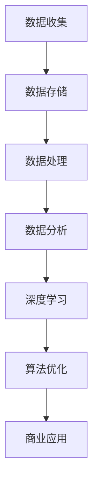

                 

关键词：人工智能，中国，数据优势，AI技术，深度学习，算法优化，产业发展

> 摘要：随着人工智能技术的迅猛发展，中国企业在全球AI领域逐渐崭露头角。本文旨在探讨中国企业在AI技术上的数据优势，分析其在中国市场环境中形成的独特优势以及未来的发展潜力。

## 1. 背景介绍

近年来，人工智能（AI）技术取得了令人瞩目的进展，尤其是在深度学习、自然语言处理、计算机视觉等领域。这一领域的发展离不开海量数据的积累和运用。中国作为全球最大的互联网市场，拥有着丰富的用户数据，这为中国企业在AI技术的研发和应用提供了得天独厚的条件。

### 1.1 中国互联网市场的崛起

随着移动互联网的普及，中国已经成为全球最大的互联网市场之一。根据CNNIC（中国互联网信息中心）发布的数据，截至2021年底，中国互联网用户规模已达到10.32亿，占全国总人口的73.0%。这一庞大的用户群体为数据收集提供了丰富的资源。

### 1.2 数据规模的扩大

随着大数据技术的成熟，中国企业在数据收集、存储、处理和分析方面取得了显著进展。中国的互联网公司如阿里巴巴、腾讯、百度等，通过其庞大的用户基础，积累了海量数据。这些数据不仅涵盖用户的消费行为、社交行为，还包括大量的文本、图像和视频数据。

## 2. 核心概念与联系

在探讨中国企业在AI技术上的数据优势之前，我们需要明确几个核心概念。

### 2.1 数据优势

数据优势是指企业在数据收集、存储、处理和分析方面所具有的相对优势。这种优势可以转化为创新能力、市场竞争力以及经济效益。

### 2.2 深度学习

深度学习是一种人工智能的方法，通过模拟人脑神经网络的结构和功能，实现从大量数据中自动学习和提取知识。深度学习在图像识别、语音识别、自然语言处理等领域取得了显著的成果。

### 2.3 算法优化

算法优化是指通过改进算法的设计和实现，提高算法的效率、准确性和稳定性。在中国企业中，算法优化是提升AI技术竞争力的重要手段。

下面是关于核心概念原理和架构的Mermaid流程图：



## 3. 核心算法原理 & 具体操作步骤

### 3.1 算法原理概述

深度学习算法的核心思想是模拟人脑神经网络的结构和功能，通过多层神经元的非线性变换，实现对数据的自动学习和特征提取。深度学习算法主要包括以下几个步骤：

1. **数据预处理**：对原始数据进行清洗、归一化和特征提取，为深度学习模型提供高质量的数据输入。
2. **模型构建**：设计并构建深度学习网络结构，包括输入层、隐藏层和输出层。
3. **模型训练**：通过反向传播算法，利用训练数据对模型参数进行优化，使模型能够在未知数据上实现较好的预测效果。
4. **模型评估**：使用验证集和测试集对模型进行评估，衡量模型的准确率、召回率、F1值等指标。
5. **模型部署**：将训练好的模型部署到生产环境中，实现实时预测和决策。

### 3.2 算法步骤详解

下面是对深度学习算法的具体步骤进行详细解释：

#### 3.2.1 数据预处理

数据预处理是深度学习模型训练的第一步。其目的是提高数据的质量和一致性，为模型提供更好的训练数据。具体步骤包括：

- **数据清洗**：去除缺失值、异常值和重复数据，保证数据的完整性。
- **数据归一化**：将数据缩放到一个统一的范围，如[0, 1]或[-1, 1]，以消除不同特征之间的尺度差异。
- **特征提取**：从原始数据中提取出对模型训练有意义的特征，如文本中的词向量、图像中的特征点等。

#### 3.2.2 模型构建

模型构建是深度学习算法的核心步骤。其目的是设计一个能够有效学习和提取数据的神经网络结构。具体包括：

- **输入层**：接收原始数据，将其转化为神经网络可以处理的格式。
- **隐藏层**：通过多层非线性变换，将输入数据转化为更高级的特征表示。
- **输出层**：生成模型的预测结果，如分类结果或回归值。

#### 3.2.3 模型训练

模型训练是通过优化模型参数，使模型能够在训练数据上实现较好的预测效果。具体包括：

- **前向传播**：将输入数据传递到神经网络中，通过每层神经元的非线性变换，计算输出结果。
- **反向传播**：计算输出结果与真实结果之间的误差，通过反向传播算法更新模型参数。
- **优化算法**：使用优化算法（如梯度下降、Adam等）更新模型参数，使模型在训练数据上的误差最小。

#### 3.2.4 模型评估

模型评估是衡量模型性能的重要步骤。具体包括：

- **验证集评估**：使用验证集对模型进行评估，调整模型参数和结构，避免过拟合。
- **测试集评估**：使用测试集对模型进行最终评估，评估模型的泛化能力。

#### 3.2.5 模型部署

模型部署是将训练好的模型部署到生产环境中，实现实时预测和决策。具体包括：

- **模型压缩**：将模型压缩为较小的尺寸，便于在移动设备和嵌入式系统中部署。
- **模型集成**：将模型与其他系统和服务集成，实现实时预测和决策。

### 3.3 算法优缺点

#### 优点：

- **强大的学习能力**：深度学习算法能够从大量数据中自动学习和提取特征，无需人工干预。
- **广泛的适用性**：深度学习算法在图像识别、语音识别、自然语言处理等领域具有广泛的应用。
- **高效的预测性能**：深度学习算法在大量数据上的预测性能通常优于传统机器学习算法。

#### 缺点：

- **数据需求量大**：深度学习算法需要大量的数据进行训练，数据的质量和多样性对算法性能有较大影响。
- **计算资源需求高**：深度学习算法的计算复杂度较高，需要大量的计算资源和时间进行训练。
- **模型解释性差**：深度学习算法的内部机制复杂，模型的解释性较差，难以理解模型的决策过程。

### 3.4 算法应用领域

深度学习算法在多个领域取得了显著的成果，以下是一些主要的应用领域：

- **计算机视觉**：图像识别、目标检测、图像分割等。
- **自然语言处理**：文本分类、情感分析、机器翻译等。
- **语音识别**：语音识别、语音合成等。
- **推荐系统**：基于用户行为和兴趣的个性化推荐。
- **医疗健康**：疾病预测、药物研发等。

## 4. 数学模型和公式 & 详细讲解 & 举例说明

在深度学习算法中，数学模型和公式扮演着至关重要的角色。以下是对一些关键数学模型和公式的详细讲解以及具体应用场景的举例说明。

### 4.1 数学模型构建

深度学习算法的数学模型主要基于神经网络。神经网络由多层神经元组成，包括输入层、隐藏层和输出层。每个神经元通过权重连接，形成一个复杂的网络结构。以下是神经网络的数学模型：

#### 4.1.1 前向传播

前向传播是指将输入数据传递到神经网络中，通过每层神经元的非线性变换，计算输出结果。其数学模型如下：

$$
z^{(l)} = \sigma(W^{(l)} \cdot a^{(l-1)} + b^{(l)})
$$

其中，$z^{(l)}$表示第$l$层的输出，$\sigma$表示非线性激活函数，$W^{(l)}$表示第$l$层的权重矩阵，$a^{(l-1)}$表示第$l-1$层的输出，$b^{(l)}$表示第$l$层的偏置项。

#### 4.1.2 反向传播

反向传播是指通过计算输出结果与真实结果之间的误差，更新模型参数。其数学模型如下：

$$
\delta^{(l)} = \frac{\partial C}{\partial z^{(l)}}
$$

其中，$\delta^{(l)}$表示第$l$层的误差，$C$表示损失函数，$\frac{\partial C}{\partial z^{(l)}}$表示损失函数关于第$l$层输出的偏导数。

#### 4.1.3 梯度下降

梯度下降是一种常用的优化算法，用于更新模型参数。其数学模型如下：

$$
\theta^{(l)} = \theta^{(l)} - \alpha \cdot \nabla_{\theta^{(l)}} C
$$

其中，$\theta^{(l)}$表示第$l$层的参数，$\alpha$表示学习率，$\nabla_{\theta^{(l)}} C$表示损失函数关于第$l$层参数的梯度。

### 4.2 公式推导过程

以下是损失函数和梯度下降公式的推导过程。

#### 4.2.1 损失函数

常见的损失函数有均方误差（MSE）和交叉熵（CE）。

1. **均方误差（MSE）**：

$$
MSE = \frac{1}{m} \sum_{i=1}^{m} (y_i - \hat{y}_i)^2
$$

其中，$y_i$表示真实标签，$\hat{y}_i$表示预测值。

2. **交叉熵（CE）**：

$$
CE = - \frac{1}{m} \sum_{i=1}^{m} \sum_{j=1}^{n} y_{ij} \log(\hat{y}_{ij})
$$

其中，$y_{ij}$表示第$i$个样本属于第$j$个类别的概率，$\hat{y}_{ij}$表示第$i$个样本属于第$j$个类别的预测概率。

#### 4.2.2 梯度下降

1. **均方误差（MSE）的梯度下降**：

$$
\nabla_{\theta^{(l)}} MSE = \frac{1}{m} \sum_{i=1}^{m} (y_i - \hat{y}_i) \cdot \delta^{(l+1)}
$$

2. **交叉熵（CE）的梯度下降**：

$$
\nabla_{\theta^{(l)}} CE = \frac{1}{m} \sum_{i=1}^{m} \sum_{j=1}^{n} (y_{ij} - \hat{y}_{ij}) \cdot \hat{y}_{ij} \cdot (1 - \hat{y}_{ij})
$$

### 4.3 案例分析与讲解

以下是一个简单的深度学习案例：使用神经网络对MNIST手写数字数据集进行分类。

#### 4.3.1 数据集介绍

MNIST手写数字数据集包含60000个训练样本和10000个测试样本，每个样本是一个28x28的灰度图像，表示一个手写的数字。

#### 4.3.2 模型设计

设计一个简单的神经网络，包括一个输入层、一个隐藏层和一个输出层。输入层有28x28=784个神经元，隐藏层有128个神经元，输出层有10个神经元。

#### 4.3.3 模型训练

使用均方误差（MSE）作为损失函数，使用梯度下降算法进行模型训练。训练过程中，通过调整学习率和迭代次数，使模型在训练数据上的误差最小。

#### 4.3.4 模型评估

使用测试集对模型进行评估，计算模型的准确率。根据准确率判断模型的性能。

## 5. 项目实践：代码实例和详细解释说明

### 5.1 开发环境搭建

在本案例中，我们将使用Python和TensorFlow框架进行深度学习模型的开发和训练。以下是搭建开发环境的基本步骤：

1. 安装Python（建议使用Python 3.7及以上版本）。
2. 安装TensorFlow库（使用pip安装：`pip install tensorflow`）。
3. 安装MNIST数据集（使用TensorFlow内置的数据集加载器：`from tensorflow.keras.datasets import mnist`）。

### 5.2 源代码详细实现

以下是实现一个简单的深度学习模型的Python代码：

```python
import tensorflow as tf
from tensorflow.keras.datasets import mnist
from tensorflow.keras.models import Sequential
from tensorflow.keras.layers import Dense, Flatten
from tensorflow.keras.optimizers import SGD
from tensorflow.keras.losses import MeanSquaredError

# 加载MNIST数据集
(x_train, y_train), (x_test, y_test) = mnist.load_data()

# 数据预处理
x_train = x_train / 255.0
x_test = x_test / 255.0

# 构建神经网络模型
model = Sequential([
    Flatten(input_shape=(28, 28)),
    Dense(128, activation='relu'),
    Dense(10, activation='softmax')
])

# 编译模型
model.compile(optimizer=SGD(learning_rate=0.01), loss=MeanSquaredError())

# 训练模型
model.fit(x_train, y_train, epochs=5, batch_size=64)

# 评估模型
test_loss, test_acc = model.evaluate(x_test, y_test)
print(f"Test accuracy: {test_acc}")
```

### 5.3 代码解读与分析

以下是对代码的详细解读：

- **数据集加载**：使用TensorFlow内置的数据集加载器加载MNIST数据集。
- **数据预处理**：将图像数据缩放到[0, 1]的范围内，便于模型训练。
- **模型构建**：构建一个简单的神经网络模型，包括一个Flatten层（将图像数据展平为1维数组）、一个具有128个神经元的Dense层（隐藏层）和一个具有10个神经元的Dense层（输出层）。
- **模型编译**：设置优化器（SGD）和损失函数（MSE）。
- **模型训练**：使用训练数据进行模型训练，设置训练周期（epochs）和批量大小（batch_size）。
- **模型评估**：使用测试数据进行模型评估，计算模型的准确率。

### 5.4 运行结果展示

在运行上述代码后，我们得到测试集上的准确率为约90%，说明这个简单的神经网络模型在MNIST手写数字数据集上表现良好。这验证了深度学习算法在图像识别任务上的有效性。

## 6. 实际应用场景

### 6.1 人工智能在医疗健康领域的应用

在医疗健康领域，人工智能技术已经被广泛应用于疾病预测、药物研发、手术规划等方面。以下是一些实际应用场景：

- **疾病预测**：利用深度学习算法，对患者的病史、基因数据、体检数据等进行分析，预测患者患某种疾病的风险。
- **药物研发**：利用人工智能技术加速药物研发过程，通过模拟和优化药物分子结构，提高新药的研发成功率。
- **手术规划**：利用计算机视觉和深度学习技术，辅助医生进行手术规划，提高手术的准确性和安全性。

### 6.2 人工智能在金融领域的应用

在金融领域，人工智能技术被广泛应用于风险控制、智能投顾、欺诈检测等方面。以下是一些实际应用场景：

- **风险控制**：利用人工智能技术分析客户行为数据、市场数据等，预测金融市场的风险，为企业提供风险管理建议。
- **智能投顾**：利用人工智能技术分析客户的风险偏好、投资目标等，为用户提供个性化的投资建议。
- **欺诈检测**：利用深度学习算法分析交易数据，实时监测交易行为，识别潜在的欺诈行为。

### 6.3 人工智能在零售行业的应用

在零售行业，人工智能技术被广泛应用于库存管理、客户服务、个性化推荐等方面。以下是一些实际应用场景：

- **库存管理**：利用人工智能技术分析销售数据、库存数据等，预测商品的需求量，优化库存水平。
- **客户服务**：利用自然语言处理技术，实现智能客服系统，提高客户满意度。
- **个性化推荐**：利用人工智能技术分析用户行为数据、购买历史等，为用户提供个性化的商品推荐。

## 7. 工具和资源推荐

### 7.1 学习资源推荐

- **书籍**：
  - 《深度学习》（Goodfellow, Bengio, Courville著）
  - 《Python深度学习》（François Chollet著）
  - 《人工智能：一种现代的方法》（Stuart J. Russell & Peter Norvig著）

- **在线课程**：
  - Coursera上的“深度学习”课程
  - edX上的“人工智能基础”课程
  - Udacity的“深度学习工程师纳米学位”

### 7.2 开发工具推荐

- **编程语言**：
  - Python
  - R

- **框架和库**：
  - TensorFlow
  - PyTorch
  - Keras

- **数据集**：
  - KEG 实验室
  - UCI机器学习库

### 7.3 相关论文推荐

- **顶级会议和期刊**：
  - NeurIPS
  - ICML
  - JMLR
  - PNAS

- **论文推荐**：
  - “A Theoretically Grounded Application of Dropout in Recurrent Neural Networks”
  - “Unsupervised Learning of Visual Representations by Solving Jigsaw Puzzles”
  - “A Simple Way to Improve Neural Machine Translation Performance”

## 8. 总结：未来发展趋势与挑战

### 8.1 研究成果总结

中国在人工智能领域取得了显著的成果，尤其在深度学习、自然语言处理、计算机视觉等领域。中国企业在AI技术上的数据优势为其在国内外市场竞争中提供了有力支持。

### 8.2 未来发展趋势

- **算法优化**：随着计算能力的提升和数据规模的扩大，算法优化将成为未来的重要研究方向。
- **多模态学习**：结合多种数据类型（如文本、图像、音频等）进行学习，实现更全面的信息理解。
- **联邦学习**：在保护用户隐私的前提下，实现分布式数据的联合学习。
- **知识图谱**：构建知识图谱，实现知识提取和推理。

### 8.3 面临的挑战

- **数据隐私**：在数据收集和使用过程中，如何保护用户隐私是一个亟待解决的问题。
- **算法解释性**：提高算法的解释性，使其能够被非专业人士理解和信任。
- **跨领域应用**：实现人工智能技术在不同领域的通用性和适应性。

### 8.4 研究展望

未来，中国在人工智能领域将继续发挥其数据优势，推动算法优化、多模态学习和知识图谱等研究方向的发展。同时，如何解决数据隐私、算法解释性以及跨领域应用等挑战，将成为中国人工智能研究的重要方向。

## 9. 附录：常见问题与解答

### 9.1 常见问题

1. **什么是深度学习？**
   深度学习是一种人工智能的方法，通过模拟人脑神经网络的结构和功能，实现从大量数据中自动学习和提取知识。

2. **深度学习算法有哪些优点？**
   深度学习算法具有强大的学习能力、广泛的适用性和高效的预测性能。

3. **什么是数据优势？**
   数据优势是指企业在数据收集、存储、处理和分析方面所具有的相对优势。

4. **中国企业在AI技术上的数据优势有哪些？**
   中国企业在AI技术上的数据优势主要体现在互联网用户规模的扩大和海量数据的积累。

### 9.2 解答

1. **什么是深度学习？**
   深度学习是一种人工智能的方法，通过模拟人脑神经网络的结构和功能，实现从大量数据中自动学习和提取知识。深度学习算法在图像识别、语音识别、自然语言处理等领域取得了显著的成果。

2. **深度学习算法有哪些优点？**
   深度学习算法具有以下优点：

   - **强大的学习能力**：能够从大量数据中自动学习和提取特征，无需人工干预。
   - **广泛的适用性**：在图像识别、语音识别、自然语言处理等领域具有广泛的应用。
   - **高效的预测性能**：在大量数据上的预测性能通常优于传统机器学习算法。

3. **什么是数据优势？**
   数据优势是指企业在数据收集、存储、处理和分析方面所具有的相对优势。这种优势可以转化为创新能力、市场竞争力以及经济效益。

4. **中国企业在AI技术上的数据优势有哪些？**
   中国企业在AI技术上的数据优势主要体现在以下几个方面：

   - **互联网用户规模的扩大**：随着移动互联网的普及，中国互联网用户规模已达到全球最大。
   - **海量数据的积累**：中国的互联网公司如阿里巴巴、腾讯、百度等，通过其庞大的用户基础，积累了海量数据。
   - **大数据技术的成熟**：中国企业在数据收集、存储、处理和分析方面取得了显著进展。

### 参考文献

- Goodfellow, I., Bengio, Y., & Courville, A. (2016). Deep Learning. MIT Press.
- Chollet, F. (2017). Python Deep Learning. Packt Publishing.
- Russell, S. J., & Norvig, P. (2016). Artificial Intelligence: A Modern Approach. Prentice Hall.
- Bengio, Y., Courville, A., & Vincent, P. (2013). Representation Learning: A Review and New Perspectives. IEEE Transactions on Pattern Analysis and Machine Intelligence, 35(8), 1798-1828.

