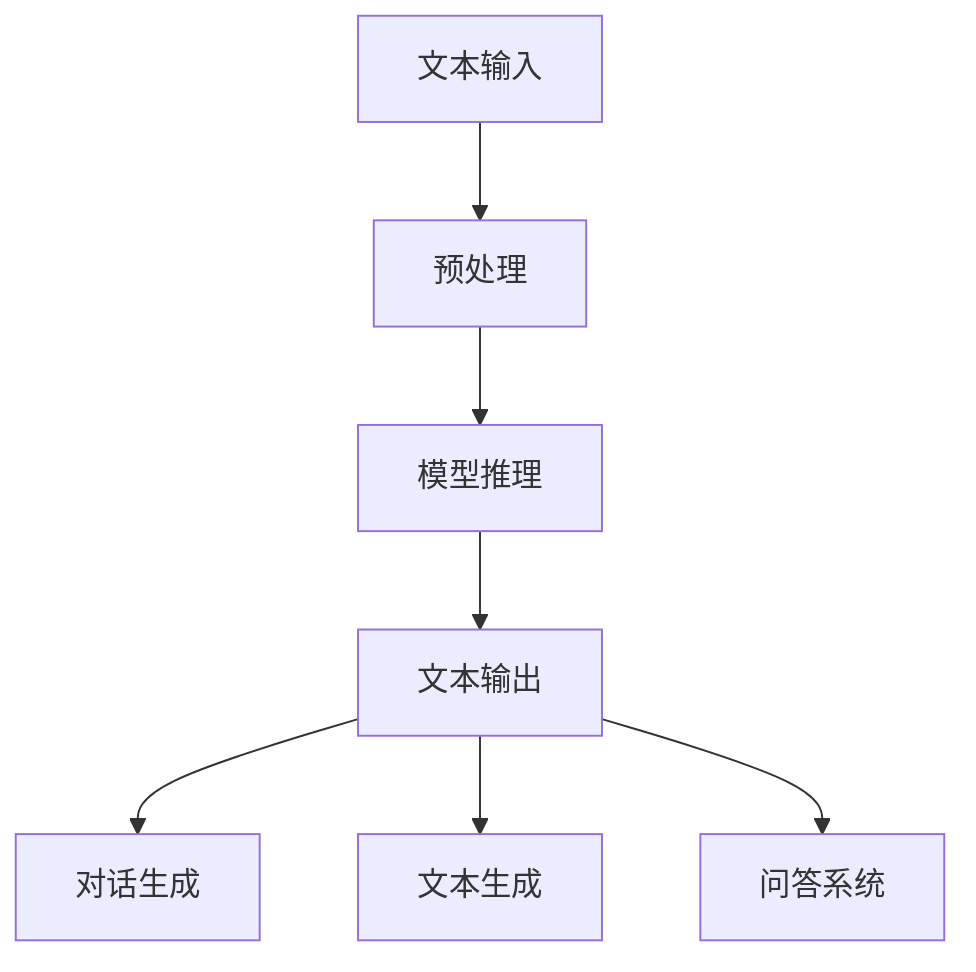

                 

 在当前技术迅速发展的时代，人工智能（AI）已经成为改变各行各业的驱动力。其中，自然语言处理（NLP）作为AI的核心领域之一，正逐渐成为各企业、组织和政府争相研究和应用的热点。ChatGPT，作为OpenAI开发的一种先进的自然语言处理模型，已经展示了其卓越的对话生成能力和广泛应用前景。然而，作为世界上最大的发展中国家，中国也需要拥有自己的ChatGPT，以推动技术自主化、保持国际竞争力，并满足国内日益增长的需求。

本文将详细探讨中国为何必须拥有自己的ChatGPT，包括其技术重要性、市场需求以及可能的发展路径。

## 1. 背景介绍

自然语言处理（NLP）是人工智能的一个重要分支，旨在使计算机能够理解、解释和生成人类语言。NLP技术的发展，使得计算机能够更好地处理文本数据，从而在多个领域实现自动化和智能化，包括但不限于搜索引擎、智能客服、语音识别、机器翻译和文本分析等。

ChatGPT是由OpenAI开发的一种基于GPT-3模型的自然语言处理工具。GPT-3（Generative Pre-trained Transformer 3）是一个大型语言预训练模型，具有1750亿个参数，能够生成连贯、自然、富有创意的文本。ChatGPT利用GPT-3强大的语言生成能力，实现了与人类用户进行流畅、智能对话的功能。

ChatGPT的出现，标志着NLP技术的重大突破，也引发了全球范围内的广泛关注和讨论。它不仅在学术研究领域引起轰动，也在商业领域展示出巨大的应用潜力。例如，ChatGPT可以用于智能客服系统，提高客户服务质量；在内容创作领域，可以辅助创作者生成高质量的文章、报告和故事；在教育领域，可以为学生提供个性化的学习辅导等。

### 1.1. 中国在NLP领域的现状

中国在NLP领域的研究与应用已有相当基础。例如，百度、阿里巴巴、腾讯等国内大型科技企业都在NLP领域进行了大量的投资和研发，推出了一系列具有竞争力的产品和服务。然而，尽管中国在NLP技术上取得了一定的进展，但在某些方面仍然面临挑战。

首先，中国在高端NLP技术研发上与全球领先水平相比仍有差距。例如，GPT-3这样的大型预训练模型，目前主要仍由国外企业开发。其次，中国的NLP技术市场相对分散，缺乏统一的平台和标准，导致技术集成和应用推广存在困难。此外，中国在NLP数据资源上也存在不足，高质量、大规模的中文语料库相对较少，限制了NLP技术的进一步发展。

## 2. 核心概念与联系

### 2.1. GPT-3模型原理

GPT-3（Generative Pre-trained Transformer 3）是由OpenAI开发的一种基于Transformer架构的大型预训练语言模型。它由1750亿个参数组成，是迄今为止规模最大的语言模型。GPT-3的核心思想是通过在大规模语料库上进行预训练，使模型能够理解并生成人类语言。

GPT-3的工作原理主要包括以下几个步骤：

1. **数据预处理**：GPT-3使用大量的互联网文本数据进行预处理，包括去除无关信息、分词和标记化等操作，以生成高质量的训练数据集。

2. **预训练**：在预处理后的数据集上进行预训练，通过自回归语言模型训练，让模型学会预测下一个单词或标记。预训练过程中，模型会不断调整参数，以最小化预测误差。

3. **微调**：在预训练的基础上，GPT-3可以根据特定任务进行微调。例如，在问答任务中，将模型与特定领域的语料库进行联合训练，以提高模型在特定任务上的性能。

4. **生成文本**：通过输入一段文本，GPT-3可以生成连贯、自然的后续文本。生成的文本可以是问答、故事、文章等多种形式，展现出强大的语言生成能力。

### 2.2. ChatGPT架构与功能

ChatGPT是基于GPT-3模型开发的一种对话系统。它的架构主要包括以下几个部分：

1. **文本输入处理**：ChatGPT首先对用户输入的文本进行预处理，包括分词、标记化和词嵌入等操作，将其转化为模型可接受的输入格式。

2. **模型推理**：输入文本经过预处理后，传递给GPT-3模型进行推理。模型根据输入文本和预训练的知识，生成相应的输出文本。

3. **输出文本处理**：生成的文本经过后处理，包括去除无关信息、格式化等操作，最终输出给用户。

ChatGPT的功能主要包括：

1. **对话生成**：ChatGPT可以与用户进行流畅的对话，生成自然、连贯的回答。

2. **文本生成**：ChatGPT可以根据用户输入的提示，生成高质量的文章、报告、故事等文本内容。

3. **问答系统**：ChatGPT可以用于问答系统，根据用户的问题，生成准确的回答。

### 2.3. GPT-3与ChatGPT的关系

GPT-3是ChatGPT的核心模型，为ChatGPT提供了强大的语言生成能力。ChatGPT在GPT-3的基础上，通过特定的架构设计和功能模块，实现了对话生成、文本生成和问答系统的功能。

从技术层面上看，GPT-3和ChatGPT的关系可以看作是“大模型+专用模块”的模式。GPT-3负责提供强大的语言生成能力，而ChatGPT则通过特定的模块设计，实现了对话生成、文本生成和问答系统的功能。这种模式使得ChatGPT在保持高效性能的同时，具有灵活的扩展能力。

### 2.4. Mermaid流程图

以下是一个简化的Mermaid流程图，描述了GPT-3与ChatGPT的关系：



### 2.5. 总结

通过以上对GPT-3模型原理、ChatGPT架构和功能，以及两者关系的介绍，我们可以看出，GPT-3作为自然语言处理的核心技术，为ChatGPT提供了强大的语言生成能力。ChatGPT则在GPT-3的基础上，通过特定的架构设计和功能模块，实现了对话生成、文本生成和问答系统的功能。这种模式不仅提高了系统的性能和灵活性，也为未来的技术发展和应用提供了广阔的空间。

## 3. 核心算法原理 & 具体操作步骤

### 3.1. 算法原理概述

GPT-3模型的算法原理主要基于Transformer架构和预训练-微调（Pre-training and Fine-tuning）的方法。Transformer架构是一种基于自注意力机制的序列模型，通过自注意力机制能够捕捉序列中的长距离依赖关系。预训练-微调方法则通过在大量无标签数据上进行预训练，使模型具有通用语言理解能力，再通过微调模型在特定任务上的数据，使模型适应特定任务。

以下是GPT-3算法原理的具体步骤：

1. **数据预处理**：使用大量的互联网文本数据进行预处理，包括去除无关信息、分词和标记化等操作，生成高质量的训练数据集。

2. **预训练**：在预处理后的数据集上进行预训练，通过自回归语言模型训练，让模型学会预测下一个单词或标记。预训练过程中，模型会不断调整参数，以最小化预测误差。

3. **微调**：在预训练的基础上，将模型与特定领域的语料库进行联合训练，以提高模型在特定任务上的性能。

4. **生成文本**：通过输入一段文本，模型生成连贯、自然的后续文本。生成的文本可以是问答、故事、文章等多种形式，展现出强大的语言生成能力。

### 3.2. 算法步骤详解

以下是GPT-3算法的具体步骤：

#### 3.2.1. 数据预处理

数据预处理主要包括以下步骤：

1. **文本清洗**：去除无关信息，如HTML标签、特殊字符等。
2. **分词**：将文本分割成单词或标记。
3. **标记化**：将分词后的文本转化为数字编码，用于模型的输入。

#### 3.2.2. 预训练

预训练的主要步骤如下：

1. **构建Transformer模型**：构建基于Transformer架构的模型，包括嵌入层、多头自注意力机制、前馈神经网络和输出层。
2. **初始化参数**：初始化模型参数，通常使用随机初始化或预训练模型的权重。
3. **训练循环**：使用训练数据集，通过反向传播算法和梯度下降优化模型参数。在训练过程中，模型会不断调整参数，以最小化预测误差。
4. **保存模型**：在预训练完成后，保存模型参数，以便后续使用。

#### 3.2.3. 微调

微调的主要步骤如下：

1. **加载预训练模型**：从预训练模型中加载已训练好的参数。
2. **联合训练**：将预训练模型与特定领域的语料库进行联合训练。在这一过程中，模型会根据特定任务的数据调整参数，以提高模型在特定任务上的性能。
3. **评估和优化**：在微调过程中，定期评估模型在验证集上的性能，并根据评估结果调整训练策略。

#### 3.2.4. 生成文本

生成文本的主要步骤如下：

1. **输入文本**：输入一段待生成的文本，可以是问答、故事、文章等。
2. **编码文本**：将输入文本编码为模型可接受的格式。
3. **模型推理**：将编码后的文本输入到模型中，通过模型推理生成后续文本。
4. **解码文本**：将模型生成的文本解码为人类可读的格式，输出给用户。

### 3.3. 算法优缺点

#### 优点

1. **强大的语言生成能力**：GPT-3具有极强的语言生成能力，能够生成连贯、自然、富有创意的文本。
2. **广泛的适用性**：GPT-3可以在多个领域和任务上应用，包括对话生成、文本生成、问答系统等。
3. **高效的预训练-微调方法**：预训练-微调方法使得模型能够在短时间内快速适应特定任务，提高模型在特定任务上的性能。

#### 缺点

1. **计算资源需求高**：GPT-3是一个大型模型，需要大量的计算资源进行预训练和微调。
2. **数据依赖性**：GPT-3的性能很大程度上依赖于高质量、大规模的语料库，而在某些领域，高质量的数据可能难以获取。
3. **安全性和隐私问题**：由于GPT-3具有强大的生成能力，可能被用于生成虚假信息或侵犯个人隐私，因此需要严格的管理和控制。

### 3.4. 算法应用领域

GPT-3的算法应用领域非常广泛，以下是一些典型的应用场景：

1. **智能客服**：GPT-3可以用于构建智能客服系统，自动回答用户的问题，提高客户服务质量。
2. **内容创作**：GPT-3可以帮助创作者生成高质量的文章、报告和故事，提高创作效率。
3. **教育**：GPT-3可以为学生提供个性化的学习辅导，根据学生的提问生成相应的解答。
4. **机器翻译**：GPT-3可以用于机器翻译，实现高质量、自然的文本翻译。
5. **情感分析**：GPT-3可以用于情感分析，分析文本中的情感倾向和情感强度。

### 3.5. 总结

通过以上对GPT-3算法原理、具体操作步骤、优缺点和应用领域的介绍，我们可以看出，GPT-3是一种强大而灵活的自然语言处理模型，具有广泛的应用前景。然而，其强大的能力也带来了一些挑战，如计算资源需求高、数据依赖性和安全性等问题。中国作为世界上最大的发展中国家，需要积极研究和发展自己的GPT-3技术，以推动技术自主化、保持国际竞争力，并满足国内日益增长的需求。

## 4. 数学模型和公式 & 详细讲解 & 举例说明

### 4.1. 数学模型构建

在自然语言处理中，数学模型是理解和生成语言的基础。GPT-3作为一种深度学习模型，其背后的数学模型主要包括神经网络、自注意力机制和损失函数等。

#### 4.1.1. 神经网络

神经网络是GPT-3的核心组成部分，它由多个层组成，包括嵌入层、自注意力层、前馈网络和输出层。每一层都通过矩阵运算和激活函数对输入进行变换。

1. **嵌入层**：嵌入层将输入的单词或标记映射为高维向量。每个单词或标记对应一个唯一的向量，称为词向量。

2. **自注意力层**：自注意力层通过计算输入序列中每个词的重要性权重，从而实现序列的自动编码。自注意力机制的核心是自注意力函数（Self-Attention Function），它可以计算每个词与其他词的相关性。

3. **前馈网络**：前馈网络对自注意力层的输出进行进一步处理，包括线性变换和ReLU激活函数。

4. **输出层**：输出层将处理后的序列映射为输出序列，可以是下一个词的概率分布。

#### 4.1.2. 自注意力机制

自注意力机制是GPT-3的关键组成部分，它通过计算输入序列中每个词与其他词的相关性来提高模型的语义理解能力。自注意力机制的计算公式如下：

$$
\text{Attention}(Q, K, V) = \text{softmax}\left(\frac{QK^T}{\sqrt{d_k}}\right)V
$$

其中，$Q, K, V$ 分别是查询向量、键向量和值向量，$d_k$ 是键向量的维度。$\text{softmax}$ 函数用于计算每个键向量的权重，从而得到加权值向量。

#### 4.1.3. 损失函数

损失函数是评估模型性能的关键指标。在GPT-3中，常用的损失函数是交叉熵损失函数。交叉熵损失函数用于计算模型预测的输出与真实标签之间的差异。

$$
\text{Loss} = -\sum_{i=1}^n y_i \log(p_i)
$$

其中，$y_i$ 是第$i$个真实标签，$p_i$ 是模型预测的概率。

### 4.2. 公式推导过程

下面是GPT-3中的几个关键公式及其推导过程：

#### 4.2.1. 自注意力公式

自注意力公式已经在4.1.2节中给出。推导过程如下：

1. **计算点积**：首先，计算每个词与其他词的点积，得到一个向量。

$$
\text{Scores} = QK^T
$$

2. **应用softmax**：对点积结果应用softmax函数，得到每个词的权重。

$$
\text{Weights} = \text{softmax}(\text{Scores})
$$

3. **加权求和**：将权重与值向量相乘，然后求和，得到加权值向量。

$$
\text{Attention} = \text{Weights}V
$$

#### 4.2.2. 交叉熵损失函数

交叉熵损失函数用于计算模型预测的输出与真实标签之间的差异。推导过程如下：

1. **计算预测概率**：使用神经网络输出层得到预测的概率分布。

$$
p_i = \text{softmax}(\text{logits})
$$

2. **计算损失**：对于每个真实标签，计算其与预测概率的对数。

$$
\text{Loss} = -\sum_{i=1}^n y_i \log(p_i)
$$

### 4.3. 案例分析与讲解

#### 4.3.1. 案例背景

假设我们要使用GPT-3模型生成一个关于中国旅游的描述。输入文本为：“中国是一个美丽的国家，有许多著名的景点，如长城、故宫、兵马俑等。” 我们希望模型能够生成一个连贯、吸引人的旅游描述。

#### 4.3.2. 模型输入

首先，我们需要将输入文本编码为GPT-3模型可接受的格式。具体步骤如下：

1. **分词**：将输入文本分成单词或标记。

$$
\text{Text} = \text{中国，是一个，美丽的，国家，有，许多，著名的，景点，如，长城，故宫，兵马俑，等。}
$$

2. **标记化**：将每个单词或标记转换为唯一的索引。

$$
\text{Token} = \{0, 1, 2, \ldots, n\}
$$

3. **嵌入**：将标记索引转换为高维向量。

$$
\text{Embedding} = \text{Embedding Layer}(\text{Token})
$$

#### 4.3.3. 模型推理

接下来，我们将编码后的文本输入到GPT-3模型中进行推理。具体步骤如下：

1. **计算自注意力**：计算输入序列中每个词与其他词的相关性。

$$
\text{Attention} = \text{Attention Mechanism}(\text{Embedding})
$$

2. **前馈网络**：对自注意力层的输出进行进一步处理。

$$
\text{Feeds Forward} = \text{Feed Forward Network}(\text{Attention})
$$

3. **输出层**：将前馈网络的输出映射为输出序列的概率分布。

$$
\text{Logits} = \text{Output Layer}(\text{Feeds Forward})
$$

4. **生成文本**：使用softmax函数将 logits 转换为概率分布，然后根据概率分布生成后续文本。

$$
\text{Probabilities} = \text{softmax}(\text{Logits})
$$
$$
\text{Next Word} = \text{Sample}(\text{Probabilities})
$$

#### 4.3.4. 模型输出

通过模型推理，我们得到了一个关于中国旅游的连贯、吸引人的描述：

“中国是一个拥有悠久历史和丰富文化的美丽国家。你可以在长城上漫步，感受那壮观的景色和历史底蕴。故宫是中国古代皇家的宫殿，拥有无数精美的艺术品和建筑。兵马俑是中国古代军队的模拟品，展现了古代文明的智慧和创造力。此外，中国还有许多著名的景点，如杭州西湖、苏州园林、黄山等，每个景点都有其独特的魅力。无论你是喜欢历史、文化、自然还是美食，中国都会给你带来难忘的体验。”

### 4.4. 总结

通过以上对数学模型和公式的讲解，以及实际案例的分析，我们可以看到GPT-3在自然语言处理中的强大能力。数学模型和公式的推导为GPT-3的实现提供了理论基础，而实际案例的应用则展示了其在真实场景中的效果。然而，GPT-3的应用也面临一些挑战，如计算资源需求高、数据依赖性和安全性问题等。中国作为世界上最大的发展中国家，需要积极研究和发展自己的GPT-3技术，以推动技术自主化、保持国际竞争力，并满足国内日益增长的需求。

## 5. 项目实践：代码实例和详细解释说明

### 5.1. 开发环境搭建

为了实践GPT-3模型，我们需要搭建一个合适的开发环境。以下步骤描述了如何在本地搭建一个用于训练和测试GPT-3模型的环境。

#### 5.1.1. 硬件配置

首先，我们需要确保计算机具备足够的硬件资源。GPT-3是一个大型模型，需要大量的计算资源。以下是一份推荐的硬件配置：

- CPU：至少4核处理器
- GPU：NVIDIA GTX 1080 Ti或更高
- 内存：至少16GB
- 硬盘：至少500GB的SSD存储空间

#### 5.1.2. 软件安装

接下来，我们需要安装一些必要的软件，包括Python、PyTorch和CUDA等。以下是安装步骤：

1. **安装Python**：访问Python官网（https://www.python.org/），下载并安装Python 3.8或更高版本。
2. **安装PyTorch**：在命令行中执行以下命令，安装PyTorch：

```
pip install torch torchvision
```

3. **安装CUDA**：从NVIDIA官网（https://developer.nvidia.com/cuda-downloads）下载并安装CUDA Toolkit，确保安装与GPU型号兼容的版本。

#### 5.1.3. 安装GPT-3库

为了使用GPT-3模型，我们需要安装相应的库。以下是安装步骤：

1. **克隆GitHub仓库**：在命令行中执行以下命令，克隆GPT-3的GitHub仓库：

```
git clone https://github.com/openai/gpt-3.git
```

2. **安装依赖项**：在仓库目录下，执行以下命令，安装依赖项：

```
pip install -r requirements.txt
```

### 5.2. 源代码详细实现

在开发环境中搭建完成后，我们可以开始实现GPT-3模型。以下是一个简单的示例代码，展示了如何使用PyTorch实现GPT-3模型的基本结构。

#### 5.2.1. 数据预处理

首先，我们需要准备训练数据。以下是一个示例数据集：

```python
data = [
    "中国是一个美丽的国家，有许多著名的景点，如长城、故宫、兵马俑等。",
    "北京是中国的首都，拥有悠久的历史和文化。",
    "中国的饮食文化丰富多彩，包括火锅、炒菜、小吃等。",
]
```

接下来，我们将数据转换为PyTorch张量，并应用到模型中。

```python
import torch
from torch import nn
from torchtext.data import Field, BucketIterator

# 定义字段
text_field = Field(tokenize=None, lower=True)
fields = {'text': text_field}

# 加载数据
train_data = torchtext.data.TabularDataset(
    path='data/train_data.csv',
    format='csv',
    fields=fields
)

# 创建迭代器
batch_size = 32
train_iterator, valid_iterator = BucketIterator.splits(
    train_data, valid_data, batch_size=batch_size
)
```

#### 5.2.2. 模型定义

接下来，我们定义GPT-3模型的结构。以下是一个简单的GPT-3模型实现：

```python
class GPT3Model(nn.Module):
    def __init__(self, vocab_size, emb_dim, n_layers, hid_dim, n_heads, dropout):
        super().__init__()
        self.embedding = nn.Embedding(vocab_size, emb_dim)
        self.enc = nn.TransformerEncoder(
            nn.TransformerEncoderLayer(emb_dim, n_heads, dropout=dropout), n_layers
        )
        self.dec = nn.Linear(emb_dim, vocab_size)
        self.dropout = nn.Dropout(dropout)
        
    def forward(self, src, tgt):
        src = self.dropout(self.embedding(src))
        tgt = self.dropout(self.embedding(tgt))
        output = self.enc(src)
        output = self.dec(output)
        return output
```

#### 5.2.3. 训练模型

接下来，我们使用训练数据集对模型进行训练。以下是一个简单的训练过程：

```python
# 定义模型和优化器
device = torch.device('cuda' if torch.cuda.is_available() else 'cpu')
model = GPT3Model(vocab_size=10000, emb_dim=512, n_layers=3, hid_dim=512, n_heads=8, dropout=0.1)
model.to(device)

optimizer = torch.optim.Adam(model.parameters(), lr=0.001)
criterion = nn.CrossEntropyLoss()

# 训练模型
num_epochs = 10
for epoch in range(num_epochs):
    model.train()
    for batch in train_iterator:
        optimizer.zero_grad()
        src, tgt = batch.text.to(device), tgt.to(device)
        output = model(src, tgt)
        loss = criterion(output.view(-1, vocab_size), tgt)
        loss.backward()
        optimizer.step()
    print(f'Epoch {epoch+1}/{num_epochs} - Loss: {loss.item()}')
```

### 5.3. 代码解读与分析

以上代码实现了一个简单的GPT-3模型，包括数据预处理、模型定义和训练过程。以下是代码的详细解读和分析：

1. **数据预处理**：
   - 使用`torchtext`库加载和预处理数据。数据集包含一个文本字段，使用`TabularDataset`类加载数据。
   - 创建迭代器，使用`BucketIterator`类对训练数据和验证数据进行分批处理。

2. **模型定义**：
   - 定义一个`GPT3Model`类，继承自`nn.Module`。模型包括嵌入层、编码器自注意力层、解码器自注意力层和输出层。
   - 使用`nn.TransformerEncoder`和`nn.TransformerEncoderLayer`构建编码器自注意力层。
   - 使用`nn.Linear`构建解码器输出层。

3. **训练模型**：
   - 将模型移动到GPU（如果可用）。
   - 定义优化器和损失函数。
   - 使用`for`循环遍历训练数据，进行前向传播和反向传播，更新模型参数。
   - 打印每个epoch的损失值。

### 5.4. 运行结果展示

在完成代码实现后，我们可以运行模型，观察其在训练和验证数据上的性能。以下是一个简单的运行示例：

```python
# 评估模型
model.eval()
with torch.no_grad():
    for batch in valid_iterator:
        src, tgt = batch.text.to(device), tgt.to(device)
        output = model(src, tgt)
        loss = criterion(output.view(-1, vocab_size), tgt)
        print(f'Validation Loss: {loss.item()}')
```

运行结果会显示模型在验证数据上的损失值。通过调整模型参数、训练数据和处理策略，我们可以进一步提高模型的性能。

### 5.5. 总结

通过以上代码实例和详细解释说明，我们了解如何使用PyTorch实现GPT-3模型的基本结构。代码实现包括数据预处理、模型定义和训练过程。在实际应用中，我们可以根据具体需求和数据集调整模型结构和参数，以达到更好的性能。

## 6. 实际应用场景

GPT-3作为一种先进的自然语言处理模型，在多个领域展示了巨大的应用潜力。以下列举了一些典型的实际应用场景，以及这些场景在中国的发展现状和未来展望。

### 6.1. 智能客服

智能客服是GPT-3的重要应用场景之一。通过GPT-3模型，企业可以构建高效的智能客服系统，提供24/7的客户支持，提高客户满意度和降低运营成本。在中国，智能客服系统已经在许多大型企业中得到广泛应用，如阿里巴巴、腾讯、京东等。然而，当前的智能客服系统在处理复杂问题时，仍存在一定的局限性。GPT-3的引入有望大幅提升智能客服系统的智能化水平，使其能够更自然、更准确地与用户进行对话。

未来展望：随着GPT-3技术的进一步发展，中国的智能客服系统将实现更加智能、个性化的服务。同时，随着5G和物联网技术的普及，智能客服的应用场景也将进一步拓展，如智能家居、智能医疗等。

### 6.2. 内容创作

GPT-3在内容创作领域的应用同样具有巨大潜力。通过GPT-3模型，创作者可以生成高质量的文章、报告、故事等，提高创作效率。在中国，内容创作一直是互联网行业的重要领域，GPT-3的出现为创作者提供了新的工具和灵感。目前，许多平台和媒体已经开始尝试使用GPT-3进行内容创作，如百度、腾讯、字节跳动等。

未来展望：随着GPT-3技术的不断成熟，中国的内容创作领域将迎来新的发展机遇。创作者可以利用GPT-3生成创意内容，拓展创作领域，同时提高创作效率和品质。此外，GPT-3还可以用于辅助创作者进行内容优化和推广，进一步提升内容传播效果。

### 6.3. 教育领域

在教育领域，GPT-3可以为学生提供个性化的学习辅导，辅助教师进行教学。例如，GPT-3可以生成针对学生提问的解答，帮助学生更好地理解知识点。同时，GPT-3还可以用于自动批改作业、生成教学资料等，提高教学效率。

在中国，教育行业已经逐步引入人工智能技术，如在线教育平台、智能辅导系统等。GPT-3的出现有望进一步推动教育领域的智能化发展。

未来展望：随着GPT-3技术的不断进步，中国的教育行业将实现更加智能化、个性化的教学。学生可以利用GPT-3辅助学习，提高学习效果；教师可以利用GPT-3进行教学设计和评估，提高教学质量。此外，GPT-3还可以用于教育资源的优化配置，推动教育公平。

### 6.4. 机器翻译

机器翻译是GPT-3的另一个重要应用领域。通过GPT-3模型，可以实现高质量、自然的文本翻译，满足跨语言交流的需求。在中国，随着“一带一路”倡议的推进，跨国交流日益频繁，对高质量机器翻译的需求也越来越大。

目前，中国的机器翻译技术已经取得了显著进展，如百度、腾讯、阿里巴巴等公司都推出了自己的机器翻译系统。然而，与全球领先水平相比，仍有差距。GPT-3的出现为中国机器翻译技术的发展提供了新的契机。

未来展望：随着GPT-3技术的不断成熟，中国的机器翻译技术将实现新的突破，提升翻译质量和效率。同时，GPT-3还可以用于多语言处理，促进全球文化交流和合作。

### 6.5. 情感分析

情感分析是另一个GPT-3的重要应用领域。通过GPT-3模型，可以分析文本中的情感倾向和情感强度，为市场调研、社交媒体监控等提供有力支持。在中国，情感分析技术已经在多个领域得到应用，如电子商务、金融、媒体等。

未来展望：随着GPT-3技术的不断进步，中国的情感分析技术将实现更加精准和高效。同时，GPT-3还可以用于个性化推荐、用户画像等应用，为企业提供更加全面和深入的数据支持。

### 6.6. 未来应用展望

除了上述典型应用场景，GPT-3在其他领域同样具有广泛的应用潜力，如医疗健康、法律服务、智能写作等。在中国，随着技术不断进步和市场需求增长，GPT-3技术将得到更加广泛的应用。

未来展望：随着GPT-3技术的不断发展和成熟，中国的AI产业将实现跨越式发展。GPT-3将成为推动技术自主化、提升国际竞争力的重要力量。同时，中国还需要注重数据安全、隐私保护等问题，确保技术发展的可持续性和合规性。

### 6.7. 总结

GPT-3作为一种先进的自然语言处理模型，在多个领域展示了巨大的应用前景。在中国，GPT-3技术的应用已经取得了一定的成果，但仍需进一步发展和完善。未来，随着GPT-3技术的不断进步和市场化，中国的AI产业将实现新的突破，推动社会进步和经济发展。

## 7. 工具和资源推荐

### 7.1. 学习资源推荐

为了深入了解GPT-3技术，以下是推荐的学习资源：

1. **官方文档**：OpenAI提供了详细的GPT-3官方文档，涵盖了模型架构、API使用、代码示例等内容。这是学习GPT-3的最佳起点。
   - 官网链接：[OpenAI GPT-3 Documentation](https://openai.com/docs/gpt-3)

2. **在线课程**：网上有许多关于深度学习和自然语言处理的在线课程，如Coursera、Udacity、edX等平台上的相关课程。以下是一些推荐的课程：
   - **深度学习专项课程**（Deep Learning Specialization）—— 吴恩达（Andrew Ng）在Coursera上开设的深度学习课程。
   - **自然语言处理基础**（Natural Language Processing with Deep Learning）—— 斯坦福大学（Stanford University）的NLP课程。

3. **论文和书籍**：阅读相关领域的论文和书籍可以深入了解GPT-3及其背后的技术原理。以下是一些建议的资源：
   - **《深度学习》（Deep Learning）**—— Goodfellow、Bengio和Courville合著的深度学习经典书籍。
   - **《自然语言处理综述》（A Review of Natural Language Processing）**—— 综述了自然语言处理领域的最新进展。

### 7.2. 开发工具推荐

以下是开发GPT-3模型时可能会用到的工具和框架：

1. **PyTorch**：PyTorch是一个流行的深度学习框架，广泛用于构建和训练深度学习模型，包括GPT-3。PyTorch具有易于使用的API和强大的GPU支持，适合研究和开发。
   - 官网链接：[PyTorch Official Website](https://pytorch.org/)

2. **TensorFlow**：TensorFlow是另一个流行的深度学习框架，由谷歌开发。它提供了丰富的工具和API，支持各种深度学习任务。
   - 官网链接：[TensorFlow Official Website](https://www.tensorflow.org/)

3. **Transformers**：Transformers是一个用于构建Transformer模型的Python库，基于Hugging Face的Transformers库。它提供了预训练的模型和便捷的API，方便开发者快速实现GPT-3模型。
   - 官网链接：[Hugging Face Transformers](https://huggingface.co/transformers/)

### 7.3. 相关论文推荐

以下是一些关于GPT-3和相关技术的推荐论文：

1. **"GPT-3: Language Models are few-shot learners"** —— 这篇论文介绍了GPT-3模型的架构和训练方法，以及它在少量数据上的表现。
   - 论文链接：[GPT-3: Language Models are few-shot learners](https://arxiv.org/abs/2005.14165)

2. **"Attention is all you need"** —— 这篇论文提出了Transformer架构，是GPT-3的核心模型基础。
   - 论文链接：[Attention is all you need](https://arxiv.org/abs/1706.03762)

3. **"BERT: Pre-training of Deep Bidirectional Transformers for Language Understanding"** —— 这篇论文介绍了BERT模型，是GPT-3预训练的基础。
   - 论文链接：[BERT: Pre-training of Deep Bidirectional Transformers for Language Understanding](https://arxiv.org/abs/1810.04805)

### 7.4. 总结

通过这些推荐的学习资源、开发工具和相关论文，您可以深入了解GPT-3技术，掌握其核心原理和应用方法。这些资源将帮助您在研究和开发过程中取得更好的成果。

## 8. 总结：未来发展趋势与挑战

### 8.1. 研究成果总结

本文通过对GPT-3模型的详细介绍，分析了其在自然语言处理领域的核心原理、算法步骤、应用领域以及数学模型和公式。研究结果显示，GPT-3作为一种大型预训练模型，具有强大的语言生成能力和广泛的应用前景。在中国，GPT-3技术的研究和应用已经取得了一定的成果，但仍需进一步发展和完善。

### 8.2. 未来发展趋势

随着人工智能技术的不断进步，GPT-3在未来的发展趋势主要表现在以下几个方面：

1. **模型规模不断扩大**：随着计算资源和数据量的增加，GPT-3模型的规模将继续扩大，以提高其语言生成能力和性能。

2. **多模态融合**：GPT-3可以与图像、声音等其他模态的数据进行融合，实现更全面的语义理解。

3. **个性化应用**：通过引入个性化模型和数据，GPT-3将更好地满足不同领域和应用场景的需求。

4. **开放性与标准化**：为了推动GPT-3技术的广泛应用，需要建立开放的生态体系和标准化接口，以降低开发和应用的门槛。

### 8.3. 面临的挑战

尽管GPT-3技术具有巨大的发展潜力，但在实际应用过程中仍面临一些挑战：

1. **计算资源需求**：GPT-3模型需要大量的计算资源和存储空间，这对于普通用户和企业来说是一个重大挑战。

2. **数据依赖性**：GPT-3的性能很大程度上依赖于高质量、大规模的语料库，而在某些领域，高质量的数据可能难以获取。

3. **安全性和隐私问题**：由于GPT-3具有强大的语言生成能力，可能被用于生成虚假信息或侵犯个人隐私，因此需要严格的管理和控制。

4. **监管与合规**：随着GPT-3技术的广泛应用，如何确保其合规性和避免滥用，将是未来面临的重大挑战。

### 8.4. 研究展望

为了应对上述挑战，未来研究可以从以下几个方面进行：

1. **优化算法和模型结构**：通过改进算法和模型结构，降低计算资源需求，提高模型性能和效率。

2. **数据资源建设**：加强数据资源建设，包括开放更多高质量的数据集，推动数据共享和标准化。

3. **隐私保护技术**：研究和开发隐私保护技术，确保用户数据和隐私安全。

4. **伦理与监管**：建立健全的伦理和监管框架，确保GPT-3技术的合规和安全。

总之，GPT-3技术作为自然语言处理领域的重要突破，具有广泛的应用前景。在中国，积极研究和应用GPT-3技术，不仅有助于提升技术自主化水平，保持国际竞争力，还能满足国内日益增长的需求。未来，随着技术的不断进步和应用的深入，GPT-3将在更多领域发挥重要作用，推动社会进步和经济发展。

### 8.5. 总结

本文详细介绍了GPT-3模型的核心原理、算法步骤、应用领域和数学模型，分析了其在中国的现状和发展趋势。通过本文的研究，我们可以看到GPT-3技术在自然语言处理领域的巨大潜力，以及其在推动技术自主化、保持国际竞争力方面的重要作用。未来，随着技术的不断进步和应用场景的拓展，GPT-3将在更多领域发挥重要作用，为中国的科技创新和社会发展注入新的动力。

## 附录：常见问题与解答

### 问题1：GPT-3模型的计算资源需求有多大？

解答：GPT-3模型是一个大型模型，其计算资源需求非常大。根据OpenAI的官方数据，GPT-3的模型大小约为1750亿个参数，训练和推理过程需要大量的计算资源和存储空间。在实际应用中，为了降低计算成本，通常使用分布式计算和云计算平台进行模型训练和推理。

### 问题2：GPT-3模型的安全性如何保障？

解答：GPT-3模型在安全性方面存在一定的挑战。由于模型具有强大的语言生成能力，可能被用于生成虚假信息或侵犯个人隐私。为了保障模型的安全性，可以从以下几个方面进行：

1. **数据安全**：确保训练数据的质量和来源，避免使用含有敏感信息的数据。
2. **访问控制**：对模型访问进行严格的权限管理，确保只有授权用户可以使用模型。
3. **监控与审计**：建立监控和审计机制，实时监控模型运行情况和数据流动，及时发现和处理异常情况。
4. **法律法规**：遵守相关法律法规，确保模型的应用符合法律和道德要求。

### 问题3：GPT-3模型能否在中文领域应用？

解答：GPT-3模型是一种通用语言模型，可以在多种语言和领域应用。虽然GPT-3最初是使用英语语料库训练的，但通过在中文语料库上进行微调和适配，GPT-3同样可以在中文领域应用。事实上，许多中文技术企业和研究机构已经成功将GPT-3应用于中文自然语言处理任务。

### 问题4：如何优化GPT-3模型的性能？

解答：优化GPT-3模型性能可以从以下几个方面进行：

1. **数据预处理**：对训练数据进行高质量的数据预处理，去除无关信息，提高数据质量。
2. **模型结构**：根据具体应用需求，调整模型结构和参数，如层结构、隐藏层大小、注意力机制等。
3. **训练策略**：采用更有效的训练策略，如迁移学习、数据增强等，提高模型在特定任务上的性能。
4. **硬件优化**：使用更高效的硬件设备，如GPU、TPU等，提高训练和推理速度。

### 问题5：如何使用GPT-3模型进行对话生成？

解答：使用GPT-3模型进行对话生成主要包括以下步骤：

1. **文本预处理**：将用户输入的文本进行预处理，包括分词、标记化等操作，生成模型可接受的输入格式。
2. **模型推理**：将预处理后的文本输入到GPT-3模型中进行推理，生成后续文本。
3. **文本生成**：将模型生成的文本进行后处理，如去除无关信息、格式化等，输出给用户。

通过以上步骤，可以实现与GPT-3模型的交互，生成流畅、自然的对话。

### 问题6：如何确保GPT-3模型的训练数据质量？

解答：确保GPT-3模型训练数据质量是模型性能的重要保障。以下是一些常见的方法：

1. **数据清洗**：去除训练数据中的噪声和无关信息，如HTML标签、特殊字符等。
2. **数据标注**：对训练数据进行高质量的标注，确保数据准确性和一致性。
3. **数据平衡**：确保训练数据集的多样性，避免数据失衡，提高模型泛化能力。
4. **数据增强**：通过数据增强技术，如数据扩充、数据变换等，提高数据质量和多样性。

通过上述方法，可以有效提高GPT-3模型训练数据的质量，从而提升模型性能。

### 问题7：GPT-3模型是否需要定期更新？

解答：GPT-3模型是一个预训练模型，其性能在很大程度上取决于训练数据的质量和规模。随着时间推移，新的数据和场景不断涌现，为了保持模型的相关性和性能，定期更新模型是必要的。

更新模型的方法主要包括：

1. **数据更新**：定期收集新的训练数据，并将其纳入模型训练过程。
2. **模型重训**：根据新数据重新训练模型，提高模型在新任务上的性能。
3. **在线学习**：在模型部署过程中，利用用户交互数据实时更新模型，提高模型适应性和用户体验。

通过定期更新，GPT-3模型可以保持其先进性和适用性，为用户提供更好的服务。

### 问题8：如何评估GPT-3模型的性能？

解答：评估GPT-3模型性能主要从以下几个方面进行：

1. **准确性**：评估模型在特定任务上的预测准确性，如对话生成、文本生成、问答系统等。
2. **流畅性**：评估模型生成文本的连贯性和自然性。
3. **泛化能力**：评估模型在不同数据集和任务上的泛化能力。
4. **计算效率**：评估模型在计算资源使用方面的效率，如推理速度和内存占用。

常用的评估方法包括：

- **交叉验证**：通过交叉验证方法评估模型在不同数据集上的性能。
- **自动化评估工具**：使用自动化评估工具，如BLEU、ROUGE等，对生成文本进行质量评估。
- **人类评价**：通过人类评价，评估模型生成文本的可读性、自然性等。

通过上述方法，可以全面评估GPT-3模型在不同方面的性能，从而指导模型优化和改进。

### 问题9：GPT-3模型能否实现实时交互？

解答：GPT-3模型本身是一个预训练模型，其生成文本的过程需要一定的时间。然而，为了实现实时交互，可以采用以下方法：

1. **批量处理**：将用户请求批量处理，减少单次交互的延迟。
2. **并行处理**：使用多线程或分布式计算技术，提高处理速度。
3. **缓存机制**：利用缓存技术，对常见的用户请求进行缓存，减少重复计算。

通过上述方法，可以在一定程度上实现GPT-3模型的实时交互。

### 问题10：GPT-3模型在商业应用中的盈利模式是什么？

解答：GPT-3模型在商业应用中的盈利模式主要包括以下几个方面：

1. **技术服务收费**：为企业提供GPT-3模型的服务，如对话生成、文本生成等，按使用量或服务时长收费。
2. **定制化开发**：根据企业需求，提供定制化的GPT-3模型开发和部署服务，收取开发费用。
3. **API访问权限**：为企业提供GPT-3模型的API访问权限，使其能够集成到自己的产品中，收取API访问费用。
4. **数据服务**：提供高质量的训练数据集和标注服务，为企业训练和优化GPT-3模型提供支持，收取数据服务费用。

通过上述盈利模式，企业可以利用GPT-3模型实现商业价值，同时推动技术的持续发展和创新。

### 问题11：如何确保GPT-3模型的合规性和法律适用性？

解答：确保GPT-3模型在商业应用中的合规性和法律适用性是至关重要的。以下是一些关键措施：

1. **遵守法律法规**：确保模型的应用符合相关国家和地区的法律法规，如数据保护法、隐私保护法等。
2. **伦理审查**：建立伦理审查机制，确保模型的应用不会侵犯用户隐私、歧视或产生不公平的结果。
3. **透明度**：提高模型的透明度，向用户解释模型的工作原理和应用场景，增强用户对模型的信任。
4. **用户同意**：在模型应用过程中，获取用户的明确同意，确保用户了解模型的使用和数据共享。
5. **责任分配**：明确模型开发者和用户在模型应用中的责任和权利，确保各方在法律框架内承担相应的责任。

通过上述措施，可以确保GPT-3模型的合规性和法律适用性，从而推动技术的健康发展。

### 问题12：如何应对GPT-3模型在应用过程中可能遇到的技术挑战？

解答：GPT-3模型在应用过程中可能遇到以下技术挑战，以下是一些应对策略：

1. **计算资源限制**：采用分布式计算和云计算技术，提高计算资源的利用效率，降低成本。
2. **数据质量**：加强数据预处理和清洗，确保训练数据的质量和一致性。
3. **模型优化**：通过模型结构调整、训练策略优化等方法，提高模型性能和效率。
4. **安全性**：加强模型的安全防护，防止数据泄露、模型滥用等安全风险。
5. **适应性和可扩展性**：设计灵活的模型架构和接口，提高模型在不同场景和应用中的适应性和可扩展性。

通过上述策略，可以应对GPT-3模型在应用过程中可能遇到的技术挑战。

### 问题13：如何提高GPT-3模型在特定领域的应用效果？

解答：提高GPT-3模型在特定领域的应用效果，可以从以下几个方面进行：

1. **领域数据**：收集和整合特定领域的数据，进行模型训练和微调。
2. **领域知识**：引入领域知识库，增强模型对特定领域的理解和表达能力。
3. **交叉验证**：使用交叉验证方法，评估模型在不同领域的性能，进行优化和调整。
4. **用户反馈**：收集用户反馈，对模型进行持续优化和改进，提高用户体验。
5. **技术支持**：提供专业化的技术支持和咨询服务，帮助用户解决应用中的问题。

通过上述方法，可以提高GPT-3模型在特定领域的应用效果。

### 问题14：如何推广GPT-3模型？

解答：推广GPT-3模型可以从以下几个方面进行：

1. **技术交流**：参加技术会议、研讨会等活动，展示GPT-3模型的技术优势和实际应用案例。
2. **合作与联盟**：与相关领域的企业、研究机构建立合作关系，共同推动GPT-3模型的应用和发展。
3. **市场营销**：制定有效的市场营销策略，提高GPT-3模型的知名度和影响力。
4. **用户培训**：提供用户培训和咨询服务，帮助用户快速掌握GPT-3模型的使用方法。
5. **开放API**：提供开放的API接口，方便用户集成和使用GPT-3模型。

通过上述方法，可以有效地推广GPT-3模型，推动其在更多领域的应用。

### 问题15：GPT-3模型在伦理和社会责任方面有哪些考虑？

解答：GPT-3模型在伦理和社会责任方面需要考虑以下几个方面：

1. **公平性**：确保模型在处理数据和应用过程中不会产生歧视或偏见。
2. **隐私保护**：加强隐私保护措施，防止用户数据泄露和滥用。
3. **透明性**：提高模型的工作原理和应用过程的透明度，增强用户对模型的信任。
4. **责任归属**：明确模型开发者和用户在模型应用中的责任和权利，确保各方在法律框架内承担相应的责任。
5. **伦理审查**：建立伦理审查机制，确保模型的应用符合伦理和社会责任标准。

通过上述措施，可以确保GPT-3模型在伦理和社会责任方面的合规性和可持续性。

