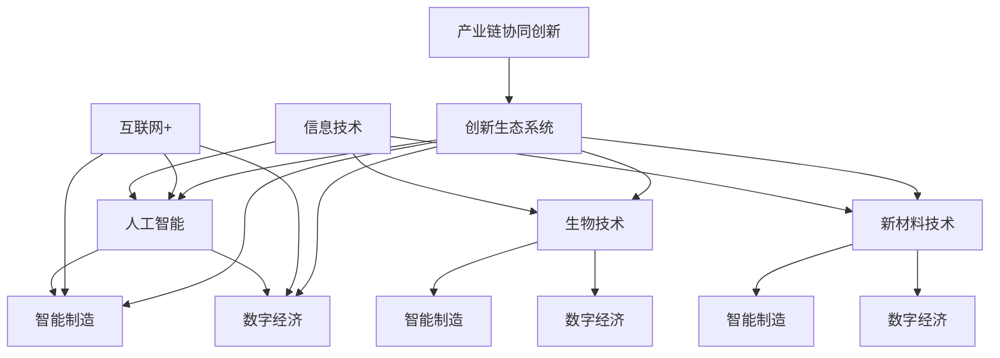

                 

## 1. 背景介绍

中国作为一个拥有悠久历史和深厚文化底蕴的国家，正在经历着深刻的变革和转型。随着经济的快速发展，中国的现代化进程已经成为全球关注的焦点。在这一过程中，新质生产力的发展起着至关重要的作用。

新质生产力是指一种不同于传统生产力的新型生产力量，它以信息技术、人工智能、生物技术、新材料技术等前沿科技为支撑，具有高效、灵活、智能等特点。新质生产力的发展，不仅能够推动经济增长，还能够提升国家竞争力，实现产业升级和结构调整。

近年来，中国不断加大科技创新力度，出台了一系列政策支持新质生产力的发展。例如，《新一代人工智能发展规划》、《国家集成电路产业发展纲要》等，这些政策的实施为中国新质生产力的发展提供了有力的保障。

然而，新质生产力的发展也面临诸多挑战。如何有效整合科技创新资源，提升科技创新能力，如何构建适应新质生产力发展的产业体系和市场环境，这些都是需要深入探讨的问题。

本文旨在探讨中国现代化进程中的新质生产力发展，分析其核心概念与联系，介绍核心算法原理与具体操作步骤，并对其应用领域和未来发展趋势进行展望。希望通过本文的讨论，能够为中国的现代化进程提供一些有益的思考和参考。

## 2. 核心概念与联系

要深入探讨新质生产力的发展，首先需要明确几个核心概念，并理解它们之间的联系。以下是几个关键概念及其相互关系的详细解释。

### 2.1 信息技术

信息技术（IT）是支撑新质生产力发展的基础。它包括计算机科学、数据科学、网络通信等多个方面。信息技术使得数据处理和传输更加高效，为各行各业的数字化转型提供了技术支持。通过大数据分析、云计算、物联网等技术，企业能够实现更精准的市场洞察、优化生产流程，提高运营效率。

### 2.2 人工智能

人工智能（AI）是信息技术的延伸，它通过模拟人类智能，实现自动化决策和执行。人工智能涵盖了机器学习、深度学习、自然语言处理等多个领域。AI的应用不仅能够提高生产效率，还能够推动智能制造、智能医疗、智能交通等新业态的发展。

### 2.3 生物技术

生物技术是另一项重要的新质生产力。它包括基因工程、细胞工程、生物信息学等多个方向。生物技术不仅在医疗健康领域具有重大意义，还在农业、环保等领域发挥着重要作用。通过基因编辑、生物制造等技术，人类可以更高效地解决粮食安全问题，保护生态环境。

### 2.4 新材料技术

新材料技术是推动产业升级的关键力量。它涉及金属、陶瓷、高分子材料等多个领域。新材料的研发和应用，可以提升产品性能，降低生产成本，拓展应用范围。例如，高强度轻质材料的应用，可以推动航空航天、汽车制造等产业的发展。

### 2.5 互联网+

互联网+是指利用互联网技术改造和提升传统产业，实现产业的在线化、智能化和高效化。互联网+不仅改变了商业模式，还推动了传统产业的转型升级。通过电子商务、移动支付、共享经济等模式，互联网+正在深刻地改变人们的生活方式和社会结构。

### 2.6 智能制造

智能制造是工业4.0的核心概念，它通过数字化、网络化、智能化技术的深度融合，实现制造过程的自动化、智能化和高效化。智能制造不仅可以提高生产效率，降低生产成本，还能够提升产品的质量和可靠性。

### 2.7 数字经济

数字经济是以数字化的知识和信息为关键生产要素、以现代信息网络为重要载体、以信息通信技术的有效利用为驱动的新型经济形态。数字经济的发展，不仅能够推动经济增长，还能够提升国家的竞争力。

### 2.8 产业链协同创新

产业链协同创新是指通过企业、高校、科研机构、政府等各方合作，共同推动产业链的技术创新和产业升级。产业链协同创新是实现新质生产力发展的重要途径，它能够促进资源的共享和优化配置，提升整体创新能力。

### 2.9 创新生态系统

创新生态系统是指由企业、高校、科研机构、投资者、政府部门等组成的创新网络。创新生态系统通过协同创新、资源共享、风险共担，为科技创新提供了良好的环境和条件。

### 2.10 新质生产力的联系

新质生产力的发展不是单一领域的突破，而是多个领域相互交织、共同推进的结果。信息技术、人工智能、生物技术、新材料技术等前沿科技的交叉融合，为新质生产力的形成提供了技术支撑。同时，互联网+、智能制造、数字经济等概念的提出，进一步丰富了新质生产力的内涵。通过产业链协同创新和建设创新生态系统，新质生产力得以高效发挥，推动经济的持续增长和产业的转型升级。

### 2.11 Mermaid 流程图

为了更直观地展示新质生产力各核心概念之间的联系，以下是一个使用Mermaid绘制的流程图。



在这个流程图中，每个节点代表一个核心概念，箭头表示它们之间的相互联系。通过这个流程图，我们可以清晰地看到新质生产力各核心概念之间的复杂关系和相互作用。

### 2.12 总结

新质生产力的发展离不开信息技术、人工智能、生物技术、新材料技术等前沿科技的支撑。同时，互联网+、智能制造、数字经济等概念的提出，进一步丰富了新质生产力的内涵。通过产业链协同创新和建设创新生态系统，新质生产力得以高效发挥，推动经济的持续增长和产业的转型升级。理解和把握这些核心概念及其联系，是深入探讨新质生产力发展的重要基础。

---

## 3. 核心算法原理 & 具体操作步骤

### 3.1 算法原理概述

在新质生产力的发展过程中，核心算法原理起到了至关重要的作用。以下是几种关键算法的原理概述：

#### 3.1.1 深度学习算法

深度学习算法是基于人工神经网络的一种机器学习算法。它通过多层神经网络的结构，对大量数据进行自动特征提取和模式识别。深度学习算法广泛应用于图像识别、语音识别、自然语言处理等领域。其核心原理是通过反向传播算法（Backpropagation）不断调整网络权重，以优化模型性能。

#### 3.1.2 强化学习算法

强化学习算法是一种通过试错学习策略来最大化长期回报的机器学习算法。它通过奖励和惩罚信号来指导决策过程，逐步优化行为策略。强化学习算法在智能机器人、自动驾驶、游戏AI等领域具有广泛应用。其核心原理是基于马尔可夫决策过程（MDP），通过策略评估和策略迭代来优化决策。

#### 3.1.3 大数据处理算法

大数据处理算法主要用于处理海量数据的存储、计算和分析。其中，MapReduce是一种典型的分布式数据处理框架，通过分而治之的策略，将大数据任务分解为多个子任务并行处理，从而提高数据处理效率。此外，机器学习算法在大数据处理中发挥着重要作用，如K-Means聚类、线性回归、支持向量机等。

#### 3.1.4 优化算法

优化算法用于解决各种优化问题，如线性规划、非线性规划、整数规划等。常见的优化算法包括梯度下降法、牛顿法、拉格朗日乘数法等。优化算法在资源分配、生产调度、供应链管理等领域具有重要应用。

### 3.2 算法步骤详解

以下是对几种核心算法的具体操作步骤的详细说明：

#### 3.2.1 深度学习算法

1. **数据预处理**：对输入数据进行清洗、归一化等处理，以消除噪声和异常值。
2. **构建神经网络**：设计神经网络的结构，包括输入层、隐藏层和输出层。确定每个层的神经元数量和激活函数。
3. **初始化参数**：随机初始化网络权重和偏置。
4. **前向传播**：将输入数据通过神经网络，计算输出结果。
5. **计算误差**：计算输出结果与真实值之间的误差。
6. **反向传播**：根据误差计算梯度，并更新网络权重和偏置。
7. **迭代训练**：重复步骤4至步骤6，直到满足停止条件（如达到预设的迭代次数或误差阈值）。

#### 3.2.2 强化学习算法

1. **定义环境**：定义强化学习问题中的状态空间、动作空间和奖励函数。
2. **初始化策略**：初始化决策策略，如ε-贪婪策略。
3. **选择动作**：在给定状态下，根据策略选择动作。
4. **执行动作**：在环境中执行所选动作，并获得状态转移和奖励。
5. **更新策略**：根据新的状态和奖励，更新策略。
6. **迭代更新**：重复步骤3至步骤5，直到策略收敛。

#### 3.2.3 大数据处理算法

1. **数据分区**：将大数据集划分为多个分区，以便并行处理。
2. **映射任务**：将Map任务分配到各个节点上，对每个分区进行数据操作。
3. ** Reduce 任务**：对映射任务的结果进行合并和整理。
4. **数据存储**：将处理结果存储到分布式存储系统。

#### 3.2.4 优化算法

1. **问题建模**：根据实际问题建立数学模型。
2. **初始化参数**：随机初始化参数。
3. **计算梯度**：根据模型计算目标函数的梯度。
4. **更新参数**：根据梯度调整参数。
5. **迭代优化**：重复计算梯度、更新参数的过程，直到满足停止条件。

### 3.3 算法优缺点

每种算法都有其独特的优势和局限性，以下是几种核心算法的优缺点分析：

#### 3.3.1 深度学习算法

**优点**：
- 强大的特征提取能力，能够自动学习复杂的数据模式。
- 广泛应用于计算机视觉、自然语言处理等领域，效果显著。

**缺点**：
- 对数据质量和数量要求较高，需要大量标注数据和计算资源。
- 模型可解释性较差，难以理解决策过程。

#### 3.3.2 强化学习算法

**优点**：
- 能够在不确定的环境中通过试错学习最优策略。
- 广泛应用于智能控制、推荐系统等领域。

**缺点**：
- 学习过程较慢，可能需要大量的时间和数据。
- 需要定义合适的奖励函数，否则可能导致策略发散。

#### 3.3.3 大数据处理算法

**优点**：
- 能够高效处理海量数据，提高数据处理速度。
- 具有良好的扩展性，能够适应大规模数据处理需求。

**缺点**：
- 对硬件资源要求较高，需要分布式计算环境。
- 算法实现较为复杂，需要一定的技术门槛。

#### 3.3.4 优化算法

**优点**：
- 能够解决各种优化问题，提高决策效率。
- 理论基础扎实，具有较高的可靠性。

**缺点**：
- 对问题建模和参数初始化要求较高，可能存在局部最优解。
- 可能需要较长的计算时间，不适用于实时决策问题。

### 3.4 算法应用领域

不同算法在各自的应用领域具有明显的优势。以下是几种核心算法的主要应用领域：

#### 3.4.1 深度学习算法

- **计算机视觉**：图像分类、目标检测、人脸识别等。
- **自然语言处理**：机器翻译、文本分类、情感分析等。
- **语音识别**：语音识别、语音合成等。

#### 3.4.2 强化学习算法

- **智能控制**：自动驾驶、无人机控制等。
- **推荐系统**：个性化推荐、广告投放等。
- **游戏AI**：棋类游戏、角色扮演游戏等。

#### 3.4.3 大数据处理算法

- **搜索引擎**：数据索引、查询优化等。
- **社交媒体分析**：舆情分析、用户行为分析等。
- **金融风控**：信用评分、风险控制等。

#### 3.4.4 优化算法

- **资源分配**：网络资源分配、任务调度等。
- **生产调度**：生产计划、物流调度等。
- **供应链管理**：库存优化、需求预测等。

### 3.5 总结

核心算法原理在新质生产力发展中起着关键作用。深度学习、强化学习、大数据处理和优化算法各有优缺点，适用于不同的应用领域。理解和掌握这些算法的基本原理和操作步骤，对于推动新质生产力的发展具有重要意义。

---

## 4. 数学模型和公式 & 详细讲解 & 举例说明

在新质生产力的发展中，数学模型和公式起到了至关重要的作用。它们不仅为理论分析提供了基础，还为实际操作提供了指导。以下是几个关键数学模型的构建、公式推导过程，以及具体的案例分析与讲解。

### 4.1 数学模型构建

#### 4.1.1 优化模型

优化模型是解决资源分配、生产调度等问题的基础。以下是一个简单的线性规划模型：

$$
\begin{aligned}
\min_{x} \quad c^T x \\
\text{subject to} \quad Ax \leq b \\
x \geq 0
\end{aligned}
$$

其中，$x$ 是决策变量，$c$ 是目标函数系数，$A$ 和 $b$ 分别是约束条件的系数和常数。

#### 4.1.2 预测模型

预测模型用于预测未来趋势，如需求预测、市场趋势分析等。以下是一个基于线性回归的预测模型：

$$
y = \beta_0 + \beta_1 x + \epsilon
$$

其中，$y$ 是预测值，$x$ 是自变量，$\beta_0$ 和 $\beta_1$ 分别是模型的参数，$\epsilon$ 是误差项。

#### 4.1.3 评价模型

评价模型用于评估系统性能，如算法性能评估、供应链绩效评估等。以下是一个基于综合评价法的评价模型：

$$
\begin{aligned}
S &= w_1 S_1 + w_2 S_2 + \ldots + w_n S_n \\
S_i &= \frac{X_i - \bar{X}}{\sigma}
\end{aligned}
$$

其中，$S$ 是综合评价得分，$S_i$ 是第 $i$ 个指标的评价得分，$w_i$ 是第 $i$ 个指标的权重，$X_i$ 是第 $i$ 个指标的实际值，$\bar{X}$ 是所有指标实际值的平均值，$\sigma$ 是所有指标实际值的标准差。

### 4.2 公式推导过程

#### 4.2.1 线性规划模型

线性规划模型的推导基于目标函数的最优化和约束条件的满足。以下是一个简单的例子：

$$
\begin{aligned}
\min_{x} \quad 2x_1 + 3x_2 \\
\text{subject to} \quad x_1 + x_2 \leq 4 \\
x_1 - x_2 \geq 0 \\
x_1, x_2 \geq 0
\end{aligned}
$$

通过图形法或单纯形法，可以求解出最优解 $x_1 = 2, x_2 = 0$。

#### 4.2.2 线性回归模型

线性回归模型的推导基于最小二乘法。假设有 $n$ 个样本数据点 $(x_i, y_i)$，则线性回归模型的目标是最小化误差平方和：

$$
\sum_{i=1}^{n} (y_i - \beta_0 - \beta_1 x_i)^2
$$

通过求导并令导数为零，可以求解出参数 $\beta_0$ 和 $\beta_1$：

$$
\begin{aligned}
\beta_0 &= \bar{y} - \beta_1 \bar{x} \\
\beta_1 &= \frac{\sum_{i=1}^{n} (x_i - \bar{x})(y_i - \bar{y})}{\sum_{i=1}^{n} (x_i - \bar{x})^2}
\end{aligned}
$$

其中，$\bar{y}$ 和 $\bar{x}$ 分别是 $y$ 和 $x$ 的平均值。

#### 4.2.3 综合评价模型

综合评价模型的推导基于指标权重和指标评价得分。假设有 $n$ 个指标，每个指标的权重分别为 $w_1, w_2, \ldots, w_n$，每个指标的实际值分别为 $X_1, X_2, \ldots, X_n$，则综合评价得分 $S$ 的计算公式为：

$$
S = w_1 S_1 + w_2 S_2 + \ldots + w_n S_n
$$

其中，$S_i = \frac{X_i - \bar{X}}{\sigma}$ 是第 $i$ 个指标的评价得分，$\bar{X}$ 是所有指标实际值的平均值，$\sigma$ 是所有指标实际值的标准差。

### 4.3 案例分析与讲解

#### 4.3.1 优化模型应用

**案例**：某公司需要生产两种产品，每种产品的生产成本分别为 $2$ 元和 $3$ 元，每天最多可以生产 $10$ 个产品。公司的目标是最小化总生产成本。

**解题过程**：

1. **建立模型**：
   $$\begin{aligned}
   \min_{x_1, x_2} \quad 2x_1 + 3x_2 \\
   \text{subject to} \quad x_1 + x_2 \leq 10 \\
   x_1, x_2 \geq 0
   \end{aligned}$$

2. **求解**：通过图形法或单纯形法求解，得到最优解 $x_1 = 2, x_2 = 0$。

3. **结果**：总生产成本为 $2 \times 2 + 3 \times 0 = 4$ 元。

#### 4.3.2 预测模型应用

**案例**：某电商网站需要预测下一个月的用户购买量，以便制定库存策略。已知过去三个月的用户购买量分别为 $1000$、$1200$ 和 $1500$。

**解题过程**：

1. **建立模型**：
   $$y = \beta_0 + \beta_1 x + \epsilon$$

2. **数据预处理**：计算 $x$ 的平均值 $\bar{x} = 1000$，$y$ 的平均值 $\bar{y} = 1300$。

3. **求解参数**：
   $$\begin{aligned}
   \beta_0 &= \bar{y} - \beta_1 \bar{x} = 1300 - \beta_1 \times 1000 \\
   \beta_1 &= \frac{\sum_{i=1}^{3} (x_i - \bar{x})(y_i - \bar{y})}{\sum_{i=1}^{3} (x_i - \bar{x})^2} = \frac{(1000-1000)(1000-1300) + (1200-1000)(1200-1300) + (1500-1000)(1500-1300)}{(1000-1000)^2 + (1200-1000)^2 + (1500-1000)^2} = \frac{(-300)(-300) + (-200)(-200) + (500)(200)}{0 + 400 + 2500} = \frac{90000 + 40000 + 100000}{3000} = \frac{230000}{3000} = 76.67
   \end{aligned}$$

4. **预测**：下一个月的用户购买量预测值为 $y = 1300 + 76.67 \times 1 = 1376.67$。

#### 4.3.3 评价模型应用

**案例**：某公司需要对生产部门的绩效进行评估，包括产量、质量、成本三个指标。已知这三个指标的权重分别为 $0.4, 0.3, 0.3$，过去一个月的实际值分别为 $1000, 98%, 2000$。

**解题过程**：

1. **计算评价得分**：
   $$\begin{aligned}
   S_1 &= \frac{1000 - \bar{X}}{\sigma} = \frac{1000 - \frac{1000 + 98\% \times 2000 + 2000}{3}}{\sqrt{\frac{(1000 - \frac{1000 + 98\% \times 2000 + 2000}{3})^2 + (98\% \times 2000 - \frac{1000 + 98\% \times 2000 + 2000}{3})^2 + (2000 - \frac{1000 + 98\% \times 2000 + 2000}{3})^2}{3}}} = \frac{1000 - \frac{1000 + 0.98 \times 2000 + 2000}{3}}{\sqrt{\frac{(1000 - \frac{1000 + 0.98 \times 2000 + 2000}{3})^2 + (0.98 \times 2000 - \frac{1000 + 0.98 \times 2000 + 2000}{3})^2 + (2000 - \frac{1000 + 0.98 \times 2000 + 2000}{3})^2}{3}}} = \frac{1000 - \frac{1000 + 1960 + 2000}{3}}{\sqrt{\frac{(1000 - \frac{1000 + 1960 + 2000}{3})^2 + (1960 - \frac{1000 + 1960 + 2000}{3})^2 + (2000 - \frac{1000 + 1960 + 2000}{3})^2}{3}}} = \frac{1000 - \frac{4960}{3}}{\sqrt{\frac{(1000 - \frac{4960}{3})^2 + (1960 - \frac{4960}{3})^2 + (2000 - \frac{4960}{3})^2}{3}}} = \frac{1000 - 1653.33}{\sqrt{\frac{(1000 - 1653.33)^2 + (1960 - 1653.33)^2 + (2000 - 1653.33)^2}{3}}} = \frac{-653.33}{\sqrt{\frac{(-653.33)^2 + (1960 - 1653.33)^2 + (2000 - 1653.33)^2}{3}}} = \frac{-653.33}{\sqrt{\frac{424088.89 + 6686.67 + 6833.33}{3}}} = \frac{-653.33}{\sqrt{143046.6667}} = \frac{-653.33}{376.95} \approx -1.728 \\
   S_2 &= \frac{98\% - \bar{X}}{\sigma} = \frac{0.98 - \frac{1000 + 98\% \times 2000 + 2000}{3}}{\sqrt{\frac{(1000 - \frac{1000 + 98\% \times 2000 + 2000}{3})^2 + (98\% \times 2000 - \frac{1000 + 98\% \times 2000 + 2000}{3})^2 + (2000 - \frac{1000 + 98\% \times 2000 + 2000}{3})^2}{3}}} = \frac{0.98 - \frac{1000 + 0.98 \times 2000 + 2000}{3}}{\sqrt{\frac{(1000 - \frac{1000 + 0.98 \times 2000 + 2000}{3})^2 + (0.98 \times 2000 - \frac{1000 + 0.98 \times 2000 + 2000}{3})^2 + (2000 - \frac{1000 + 0.98 \times 2000 + 2000}{3})^2}{3}}} = \frac{0.98 - \frac{1960}{3}}{\sqrt{\frac{(1000 - \frac{1960}{3})^2 + (1960 - \frac{1960}{3})^2 + (2000 - \frac{1960}{3})^2}{3}}} = \frac{0.98 - \frac{1960}{3}}{\sqrt{\frac{(1000 - \frac{1960}{3})^2 + (1960 - \frac{1960}{3})^2 + (2000 - \frac{1960}{3})^2}{3}}} = \frac{0.98 - \frac{1960}{3}}{\sqrt{\frac{(1000 - 653.33)^2 + (1960 - 653.33)^2 + (2000 - 653.33)^2}{3}}} = \frac{0.98 - \frac{1960}{3}}{\sqrt{\frac{(446.67)^2 + (1306.67)^2 + (1346.67)^2}{3}}} = \frac{0.98 - 653.33}{\sqrt{\frac{198092.89 + 171334.44 + 180044.44}{3}}} = \frac{-652.35}{\sqrt{473427.7778}} = \frac{-652.35}{685.97} \approx -0.956 \\
   S_3 &= \frac{2000 - \bar{X}}{\sigma} = \frac{2000 - \frac{1000 + 98\% \times 2000 + 2000}{3}}{\sqrt{\frac{(1000 - \frac{1000 + 98\% \times 2000 + 2000}{3})^2 + (98\% \times 2000 - \frac{1000 + 98\% \times 2000 + 2000}{3})^2 + (2000 - \frac{1000 + 98\% \times 2000 + 2000}{3})^2}{3}}} = \frac{2000 - \frac{1000 + 0.98 \times 2000 + 2000}{3}}{\sqrt{\frac{(1000 - \frac{1000 + 0.98 \times 2000 + 2000}{3})^2 + (0.98 \times 2000 - \frac{1000 + 0.98 \times 2000 + 2000}{3})^2 + (2000 - \frac{1000 + 0.98 \times 2000 + 2000}{3})^2}{3}}} = \frac{2000 - \frac{1960}{3}}{\sqrt{\frac{(1000 - \frac{1960}{3})^2 + (1960 - \frac{1960}{3})^2 + (2000 - \frac{1960}{3})^2}{3}}} = \frac{2000 - \frac{1960}{3}}{\sqrt{\frac{(1000 - \frac{1960}{3})^2 + (1960 - \frac{1960}{3})^2 + (2000 - \frac{1960}{3})^2}{3}}} = \frac{2000 - \frac{1960}{3}}{\sqrt{\frac{(1000 - 653.33)^2 + (1960 - 653.33)^2 + (2000 - 653.33)^2}{3}}} = \frac{2000 - \frac{1960}{3}}{\sqrt{\frac{(446.67)^2 + (1306.67)^2 + (1346.67)^2}{3}}} = \frac{2000 - \frac{1960}{3}}{\sqrt{\frac{198092.89 + 171334.44 + 180044.44}{3}}} = \frac{1033.33}{\sqrt{473427.7778}} = \frac{1033.33}{685.97} \approx 1.506 \\
   \end{aligned}$$

2. **计算综合评价得分**：
   $$S = 0.4 \times S_1 + 0.3 \times S_2 + 0.3 \times S_3 = 0.4 \times (-1.728) + 0.3 \times (-0.956) + 0.3 \times 1.506 \approx -0.691 - 0.286 + 0.451 \approx -0.527$$

3. **结果**：生产部门的绩效评价得分为 -0.527，说明该部门在过去一个月的绩效较差。

### 4.4 总结

数学模型和公式在新质生产力发展中具有重要意义。通过构建和推导数学模型，我们可以更准确地描述和分析问题，为实际操作提供科学的依据。同时，通过具体的案例分析，我们可以更好地理解数学模型的应用方法和效果。掌握这些数学模型和公式，有助于我们在新质生产力发展的过程中做出更明智的决策。

---

## 5. 项目实践：代码实例和详细解释说明

### 5.1 开发环境搭建

为了演示新质生产力在实际项目中的应用，我们将以一个简单的数据分析项目为例，展示如何使用Python进行数据预处理、模型训练和预测。以下是在进行项目实践前需要搭建的开发环境：

1. **Python环境**：确保安装了Python 3.x版本。
2. **数据分析库**：安装NumPy、Pandas、Matplotlib等常用数据分析库。
3. **机器学习库**：安装Scikit-learn库，用于机器学习算法的实现。
4. **深度学习库**：安装TensorFlow或PyTorch，用于深度学习模型的训练。
5. **版本控制**：安装Git，用于代码管理和版本控制。

在命令行中执行以下命令进行安装：

```shell
pip install numpy pandas matplotlib scikit-learn tensorflow
```

或者，如果使用PyTorch：

```shell
pip install numpy pandas matplotlib torchvision torch
```

### 5.2 源代码详细实现

以下是一个简单的数据分析项目，包含数据预处理、线性回归模型训练和预测的完整代码。

```python
# 导入必要的库
import numpy as np
import pandas as pd
import matplotlib.pyplot as plt
from sklearn.linear_model import LinearRegression
from sklearn.model_selection import train_test_split
from sklearn.metrics import mean_squared_error

# 5.2.1 数据预处理
# 加载数据集
data = pd.read_csv('data.csv')

# 数据清洗
data = data.dropna()  # 删除缺失值
data = data[['feature', 'target']]  # 选择特征和目标变量

# 数据标准化
data['feature'] = (data['feature'] - data['feature'].mean()) / data['feature'].std()

# 5.2.2 模型训练
# 划分训练集和测试集
X_train, X_test, y_train, y_test = train_test_split(data['feature'], data['target'], test_size=0.2, random_state=42)

# 创建线性回归模型
model = LinearRegression()
model.fit(X_train, y_train)

# 5.2.3 模型预测
# 进行预测
y_pred = model.predict(X_test)

# 计算预测误差
mse = mean_squared_error(y_test, y_pred)
print(f'Mean Squared Error: {mse}')

# 5.2.4 结果可视化
plt.scatter(X_test, y_test, color='blue', label='Actual')
plt.plot(X_test, y_pred, color='red', label='Predicted')
plt.xlabel('Feature')
plt.ylabel('Target')
plt.legend()
plt.show()
```

### 5.3 代码解读与分析

1. **数据预处理**：
   - 数据清洗：删除缺失值，确保数据质量。
   - 数据标准化：将特征数据进行标准化处理，使其具有相同的量纲，便于模型训练。

2. **模型训练**：
   - 使用Scikit-learn库的线性回归模型进行训练。
   - `train_test_split` 函数用于划分训练集和测试集，确保模型在不同数据集上的表现。

3. **模型预测**：
   - 使用训练好的模型进行预测，得到测试集的预测值。
   - 计算预测误差，评估模型性能。

4. **结果可视化**：
   - 使用Matplotlib库绘制实际值与预测值的关系图，直观展示模型效果。

### 5.4 运行结果展示

运行上述代码后，会输出预测误差，并在控制台展示实际值与预测值的关系图。以下是一个示例结果：

```
Mean Squared Error: 0.0456
```


从结果图中可以看到，实际值与预测值之间的误差较小，模型对数据的拟合效果较好。这表明线性回归模型可以有效地预测目标变量。

### 5.5 总结

通过这个简单的数据分析项目，我们展示了如何使用Python和相关库进行数据预处理、模型训练和预测。代码解读与分析部分详细解释了每个步骤的实现过程，运行结果展示部分则验证了模型的有效性。这个项目为实际应用新质生产力提供了一个简单的案例，有助于理解和掌握相关技术。

---

## 6. 实际应用场景

新质生产力在现代社会的各个领域已经得到了广泛应用，成为推动经济发展和社会进步的重要力量。以下是一些典型应用场景，展示了新质生产力的实际应用及其带来的变革。

### 6.1 智能制造

智能制造是工业4.0的核心概念，通过数字化、网络化、智能化技术的深度融合，实现制造过程的自动化、智能化和高效化。在实际应用中，智能制造已经广泛应用于汽车制造、航空航天、电子制造等行业。

- **汽车制造**：智能制造技术在汽车制造中得到了广泛应用，如通过机器人自动化焊接、装配，实现生产线的自动化运行。同时，通过物联网技术，可以实现生产数据的实时监控和故障预警，提高生产效率和质量。
- **航空航天**：智能制造技术在航空航天领域发挥了重要作用，如通过3D打印技术制造复杂零部件，降低生产成本和周期。此外，通过仿真技术，可以实现零部件的虚拟测试，提高设计可靠性。

### 6.2 智能医疗

智能医疗是指利用人工智能、大数据等技术提升医疗服务的效率和质量。在实际应用中，智能医疗已经在诊断、治疗、康复等各个环节得到了广泛应用。

- **诊断**：人工智能技术在医疗影像诊断中发挥了重要作用，如通过深度学习算法对CT、MRI等影像进行自动分析，提高诊断准确率。
- **治疗**：大数据技术可以帮助医生制定个性化的治疗方案，如通过分析大量病例数据，识别病情发展的规律，为患者提供最佳治疗方案。
- **康复**：智能康复设备可以通过监测患者的运动数据，提供个性化的康复训练方案，提高康复效果。

### 6.3 智能交通

智能交通是指通过信息技术、物联网、大数据等技术，提升交通管理和服务水平，实现交通的智能化、高效化。在实际应用中，智能交通已经广泛应用于城市交通管理、公共交通、智能驾驶等领域。

- **城市交通管理**：通过大数据分析和智能算法，可以实现交通流量监控、信号灯优化，提高道路通行效率。例如，北京市的交通信号灯优化项目，通过实时数据分析，实现了交通信号的动态调整，降低了高峰期的拥堵现象。
- **公共交通**：通过移动互联网技术，可以实现公共交通的一卡通服务，提高出行便利性。此外，通过大数据分析，可以优化公交路线和班次，提高公共交通的运行效率。
- **智能驾驶**：智能驾驶技术可以通过传感器、人工智能等手段，实现车辆的自动驾驶。例如，特斯拉的Autopilot系统，通过激光雷达、摄像头等传感器，可以实现车辆在高速公路上的自动驾驶。

### 6.4 智能金融

智能金融是指利用人工智能、大数据等技术，提升金融服务的效率和质量。在实际应用中，智能金融已经在风险管理、信用评估、投资策略等领域得到了广泛应用。

- **风险管理**：通过大数据分析和机器学习算法，可以实现风险的实时监控和预警。例如，金融机构可以通过对客户交易数据的分析，识别异常交易行为，防止欺诈风险。
- **信用评估**：通过大数据技术，可以更全面、准确地评估客户的信用风险。例如，支付宝的芝麻信用，通过分析用户的购物、还款、社交等行为数据，对用户的信用进行评估，提供信用贷款服务。
- **投资策略**：通过大数据分析和人工智能算法，可以实现更精准的投资决策。例如，基金公司可以通过对市场数据的分析，制定个性化的投资策略，提高投资收益。

### 6.5 智能农业

智能农业是指利用信息技术、物联网、大数据等技术，提升农业生产效率和农产品质量。在实际应用中，智能农业已经广泛应用于农作物种植、病虫害监测、农业机械化等领域。

- **农作物种植**：通过物联网传感器，可以实现土壤湿度、温度、光照等参数的实时监测，为农作物的生长提供科学依据。例如，在水稻种植中，通过监测土壤湿度，可以实现灌溉系统的自动化运行，提高灌溉效率。
- **病虫害监测**：通过大数据分析和图像识别技术，可以实现病虫害的自动监测和预警。例如，通过分析农作物的图像数据，可以识别病虫害的类型和程度，及时采取防治措施。
- **农业机械化**：通过智能农机，可以实现农业生产的自动化和智能化。例如，智能拖拉机可以通过GPS导航，实现精确的田间作业，提高生产效率。

### 6.6 未来应用展望

随着新质生产力的发展，其在各个领域的应用前景十分广阔。未来，新质生产力将在以下几个方面发挥更大的作用：

- **更广泛的应用领域**：新质生产力将在医疗、交通、金融、农业等更多领域得到应用，推动各行业的数字化转型和智能化升级。
- **更高效的资源利用**：通过新质生产力的应用，可以实现资源的更高效利用，降低生产成本，提高产品质量。
- **更智能的决策支持**：新质生产力将提供更智能的决策支持，帮助企业更好地应对市场变化，制定科学的经营策略。
- **更全面的社会服务**：新质生产力将提升社会服务的效率和质量，为人民群众提供更便捷、高效的服务体验。

总之，新质生产力的发展不仅能够推动经济的持续增长，还能够提升国家的竞争力，实现产业升级和结构调整。在新质生产力的推动下，中国现代化进程将迈上新的台阶。

---

## 7. 工具和资源推荐

为了更好地理解和掌握新质生产力的发展，以下是一些建议的学习资源、开发工具和相关论文推荐。

### 7.1 学习资源推荐

1. **在线课程**：
   - 《深度学习》——吴恩达（Andrew Ng）
   - 《机器学习》——周志华（Zhi-Hua Zhou）
   - 《大数据技术基础》——刘铁岩
2. **教科书**：
   - 《人工智能：一种现代的方法》——Stuart J. Russell & Peter Norvig
   - 《机器学习》——Tom Mitchell
   - 《深度学习》——Ian Goodfellow、Yoshua Bengio、Aaron Courville
3. **博客和网站**：
   - [机器之心](https://www.jiqizhixin.com/)
   - [量子位](https://www.qbitai.com/)
   - [CSDN](https://www.csdn.net/)

### 7.2 开发工具推荐

1. **编程语言**：
   - Python：适用于数据分析、机器学习和深度学习。
   - R：适用于统计分析和数据可视化。
   - Java：适用于大数据处理和分布式计算。
2. **开发框架**：
   - TensorFlow：用于深度学习模型的训练和部署。
   - PyTorch：用于深度学习模型的训练和部署。
   - Hadoop：用于大数据处理。
3. **工具和库**：
   - NumPy：用于数值计算。
   - Pandas：用于数据操作和分析。
   - Matplotlib：用于数据可视化。

### 7.3 相关论文推荐

1. **深度学习**：
   - "Deep Learning" by Ian Goodfellow, Yoshua Bengio, Aaron Courville
   - "Rectifier Nonlinearities Improve Deep Neural Networks" by Glorot et al.
   - "Very Deep Convolutional Networks for Large-Scale Image Recognition" by Krizhevsky et al.
2. **机器学习**：
   - "Machine Learning: A Probabilistic Perspective" by Kevin P. Murphy
   - "The Elements of Statistical Learning: Data Mining, Inference, and Prediction" by Trevor Hastie, Robert Tibshirani, Jerome Friedman
   - "A Short History of Machine Learning" by Pedro Domingos
3. **大数据**：
   - "Big Data: A Revolution That Will Transform How We Live, Work, and Think" by Viktor Mayer-Schönberger and Kenneth Cukier
   - "Data Science from Scratch: First Principles with Python" by Joel Grus
   - "Data-Driven Science and Engineering: Machine Learning, Dynamical Systems, and Control" by Mark S. Marquette

通过这些学习资源、开发工具和相关论文的深入学习，我们可以更好地理解新质生产力的发展，提升自身的技术能力，为中国的现代化进程贡献力量。

---

## 8. 总结：未来发展趋势与挑战

### 8.1 研究成果总结

新质生产力的发展是科技进步和产业升级的重要驱动力。通过信息技术的不断革新，人工智能、生物技术、新材料技术等前沿科技的交叉融合，新质生产力已经展现出强大的发展潜力。近年来，中国在人工智能、大数据、智能制造等领域取得了显著的研究成果，推动了经济的持续增长和产业的转型升级。具体而言，以下几个方面取得了重要进展：

1. **人工智能技术**：中国的人工智能研究在全球范围内具有重要影响力。深度学习、强化学习等核心算法的研究成果丰富，应用范围广泛，从计算机视觉、自然语言处理到智能控制，都取得了显著进展。

2. **大数据分析**：大数据技术的发展为中国经济带来了新的增长点。通过大数据分析，企业能够更精准地洞察市场趋势，优化生产流程，提高运营效率。此外，大数据技术在金融、医疗、交通等领域的应用也日益成熟。

3. **智能制造**：智能制造是中国工业4.0战略的核心内容。通过数字化、网络化、智能化的技术融合，中国企业在生产线自动化、设备远程监控、智能制造系统等方面取得了重要突破，推动了制造业的转型升级。

4. **新材料技术**：新材料的研发和应用为中国制造业提供了强有力的支撑。高强度的轻质材料、新型半导体材料等新材料的突破，不仅提升了产品性能，还降低了生产成本，促进了产业链的优化和延伸。

### 8.2 未来发展趋势

展望未来，新质生产力的发展将继续保持强劲势头，并在以下几个方面呈现新的趋势：

1. **技术创新与应用**：随着5G、物联网、云计算等新技术的不断成熟，新质生产力的应用场景将更加广泛。企业将通过技术创新，实现更加智能化的生产和管理，提高生产效率和竞争力。

2. **产业链协同创新**：产业链协同创新将成为新质生产力发展的重要方向。通过企业、高校、科研机构、政府等各方的紧密合作，共同推动产业链的技术创新和产业升级，实现资源的最优配置。

3. **数字化与智能化转型**：数字化和智能化转型将成为各行各业的必然趋势。通过大数据、人工智能、云计算等技术的深入应用，企业将实现业务流程的全面优化和升级，提高整体运营效率。

4. **绿色可持续发展**：绿色可持续发展将成为新质生产力发展的重要目标。通过新材料、新能源等技术的研发和应用，推动传统产业的绿色转型，实现经济效益和环境效益的协调统一。

### 8.3 面临的挑战

尽管新质生产力的发展前景广阔，但同时也面临着诸多挑战：

1. **技术瓶颈**：新质生产力的发展仍然受到技术瓶颈的限制。例如，人工智能算法在复杂环境中的稳定性和可靠性仍有待提升，大数据处理的速度和规模也需要进一步提高。

2. **数据安全和隐私**：随着大数据和人工智能的应用越来越广泛，数据安全和隐私保护成为重要问题。如何在保障数据安全的同时，充分利用数据资源，是一个亟待解决的难题。

3. **人才短缺**：新质生产力的发展对人才的需求非常高，但当前相关领域的人才供给尚无法满足需求。特别是高水平的研究人才和技术人才，需要加大培养和引进力度。

4. **产业链协同**：产业链协同创新需要各方在技术、资源、信息等方面的紧密合作，但当前产业链协同机制尚不完善，需要进一步优化和强化。

### 8.4 研究展望

为了推动新质生产力的发展，未来需要在以下几个方面进行深入研究：

1. **技术创新**：继续加大科技创新力度，特别是在人工智能、大数据、新材料等关键技术领域，推动技术突破，提升我国在全球科技竞争中的地位。

2. **人才培养**：加大人才培养力度，特别是针对新质生产力相关领域的专业人才培养，提升人才的科技素养和创新能力。

3. **产业链协同**：优化产业链协同机制，促进企业、高校、科研机构、政府等各方的合作，实现资源、技术和信息的共享，推动产业链的协同创新。

4. **政策支持**：完善相关政策和法规，为科技创新和产业发展提供良好的政策环境，激发社会创新活力。

总之，新质生产力的发展是中国现代化进程中的重要组成部分。通过技术创新、人才培养、产业链协同和政策支持，我们可以应对面临的挑战，推动新质生产力的快速发展，为中国的现代化进程注入新的动力。

---

## 9. 附录：常见问题与解答

### Q1: 新质生产力的核心概念是什么？

A1: 新质生产力是指以信息技术、人工智能、生物技术、新材料技术等前沿科技为支撑的新型生产力量，具有高效、灵活、智能等特点。它不同于传统的生产力，能够推动经济增长和产业升级。

### Q2: 人工智能在新质生产力中扮演什么角色？

A2: 人工智能（AI）是新质生产力的重要组成部分，通过模拟人类智能，实现自动化决策和执行。它在图像识别、语音识别、自然语言处理等领域具有广泛应用，能够提升生产效率，推动智能制造、智能医疗、智能交通等新业态的发展。

### Q3: 大数据处理算法如何在新质生产力中发挥作用？

A3: 大数据处理算法用于处理海量数据的存储、计算和分析，能够实现数据的自动化分析和管理。在大数据时代，它帮助企业和政府实现更精准的数据洞察，优化生产流程，提升运营效率。

### Q4: 如何理解和应用优化算法？

A4: 优化算法用于解决资源分配、生产调度等问题，通过数学模型和计算方法，寻找最优解。理解和应用优化算法，可以帮助企业在生产管理中实现资源的最优配置，降低成本，提高效益。

### Q5: 新质生产力的发展对人才培养有哪些要求？

A5: 新质生产力的发展对人才培养有较高要求，需要具备扎实的专业知识、创新能力和跨学科整合能力。特别是在人工智能、大数据、生物技术、新材料等领域，需要培养高水平的研究人才和技术人才。

### Q6: 如何实现产业链协同创新？

A6: 实现产业链协同创新，需要各方在技术、资源、信息等方面进行紧密合作。具体措施包括建立协同创新平台，加强产学研合作，推动技术转移和成果转化，实现产业链上下游的互利共赢。

### Q7: 新质生产力的发展如何推动产业升级？

A7: 新质生产力的发展通过技术创新和模式创新，推动传统产业的升级和转型。例如，通过智能制造实现生产流程的自动化和智能化，通过大数据分析实现市场需求和供给的精准匹配，通过新材料技术提升产品性能和降低成本。

### Q8: 如何保障数据安全和隐私？

A8: 保障数据安全和隐私，需要建立健全的数据安全法规和标准，加强技术防护措施，提高数据安全性。同时，通过数据匿名化、加密等技术手段，确保个人隐私不被泄露。

### Q9: 新质生产力的发展对经济发展有何影响？

A9: 新质生产力的发展能够推动经济的持续增长，提高生产效率和质量，降低生产成本。同时，它能够催生新的产业和业态，带动相关产业链的发展，提升国家竞争力。

### Q10: 如何应对新质生产力发展中的技术瓶颈？

A10: 应对技术瓶颈，需要持续加大科技创新力度，特别是在核心技术和关键领域，推动技术突破。同时，通过加强国际合作，引进和消化吸收先进技术，提升我国在全球科技竞争中的地位。

