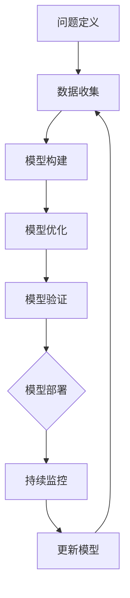

                 

## 引言

在当今快速变化的技术环境中，管理者的角色变得更加复杂和具有挑战性。他们不仅需要具备业务战略的眼光，还必须掌握先进的技术知识，以便更好地理解和指导团队的工作。模型思维作为现代管理者必备的技能之一，正日益受到重视。模型思维不仅能够帮助管理者更好地理解复杂系统，还能够提升他们的决策能力。

本文旨在探讨如何通过丰富模型思维来增强管理者的洞悉力。我们将从背景介绍开始，详细阐述模型思维的核心概念与联系，深入解析核心算法原理与具体操作步骤，并引入数学模型和公式进行详细讲解与举例说明。随后，我们将通过项目实践展示如何将理论应用于实际开发中，并探讨模型思维在各类实际应用场景中的价值。文章最后将对未来应用前景进行展望，并总结研究成果与面临的挑战，提供相关工具和资源推荐，以及常见问题与解答。

通过本文的阅读，读者将能够理解模型思维的重要性，掌握提升模型思维的方法，并能够将其应用于实际工作中，从而成为更具洞悉力的现代管理者。

## 1. 背景介绍

在科技飞速发展的今天，数据和信息已经成为企业最宝贵的资产。然而，面对海量数据的处理和复杂系统的管理，管理者们常常感到力不从心。传统的管理方法已无法应对现代社会的高度复杂性和动态变化性。因此，一种新的思维方式——模型思维，开始受到越来越多管理者的关注。

模型思维是一种通过构建和分析模型来理解和解决复杂问题的方法。它不仅仅局限于科学和工程领域，在商业管理中同样具有重要的应用价值。管理者通过模型思维可以更好地把握业务趋势、优化运营流程、预测市场变化，从而做出更为明智的决策。

在商业管理中，模型思维的应用范围非常广泛。例如，在市场营销中，管理者可以通过建立顾客行为模型来预测潜在客户的购买倾向，从而制定更为精准的市场推广策略。在生产管理中，通过建立供应链模型，管理者可以优化库存管理、减少物流成本，提高生产效率。在财务管理中，通过构建财务模型，管理者可以更准确地预测企业的盈利能力和财务风险，从而制定合理的财务策略。

然而，要成功地运用模型思维，管理者需要具备一定的技术背景和思维方式。这不仅包括对数学、统计学和计算机科学等基础知识的掌握，还需要培养系统思维、抽象思维和逻辑推理能力。此外，管理者还应当熟悉各种模型构建和优化的工具，如机器学习算法、优化算法和数据可视化工具等。

总之，随着商业环境的变化和技术的进步，模型思维已经成为现代管理者必备的技能之一。掌握模型思维，不仅能够提升管理者的洞悉力，还能够为企业的长远发展提供强有力的支持。

## 2. 核心概念与联系

### 2.1 模型思维的概念

模型思维，简单来说，就是通过构建抽象模型来理解和分析复杂系统。模型可以是物理模型、数学模型、计算机模型等，其核心在于将复杂现象简化为可计算和分析的形式。在商业管理中，模型思维具有重要作用，因为它能够帮助管理者从宏观和微观层面理解业务运作，发现潜在问题并制定有效策略。

### 2.2 商业管理中的模型类型

在商业管理中，常见的模型类型包括决策模型、预测模型、优化模型和模拟模型等。

- **决策模型**：用于支持决策制定过程，如盈亏平衡分析、成本效益分析等。
- **预测模型**：通过历史数据分析和机器学习算法，预测未来的市场趋势和业务表现，如时间序列预测、回归分析等。
- **优化模型**：用于优化资源分配、成本控制等，如线性规划、动态规划等。
- **模拟模型**：通过模拟业务流程和系统运行，评估不同策略的效果和风险，如蒙特卡罗模拟、仿真模型等。

### 2.3 模型构建与优化的方法

构建和管理模型的过程通常包括以下步骤：

1. **问题定义**：明确要解决的问题和目标。
2. **数据收集**：收集与问题相关的数据，确保数据的准确性和完整性。
3. **模型构建**：根据问题类型和可用数据选择合适的模型类型，构建数学或计算机模型。
4. **模型优化**：通过调整模型参数和算法，提高模型的预测准确性和优化效果。
5. **模型验证**：使用测试数据集验证模型的有效性，确保模型能够准确预测或优化目标。
6. **模型部署**：将模型应用到实际业务中，并持续监控和更新模型，以适应业务环境的变化。

### 2.4 模型思维的优势

模型思维的优势在于其系统性和可量化性。通过模型，管理者可以更直观地理解复杂系统的工作原理和潜在风险，从而做出更为科学的决策。此外，模型还可以帮助团队更好地沟通和协作，因为模型提供了统一的语言和框架。以下是一些模型思维的具体优势：

- **提高决策质量**：模型提供了基于数据的决策支持，减少了主观判断的误差。
- **优化资源分配**：通过优化模型，管理者可以更有效地分配资源和人力，提高生产效率。
- **风险预测和规避**：通过模拟模型，管理者可以预见不同决策可能导致的风险，并采取相应的规避措施。
- **增强创新思维**：模型思维鼓励管理者从多个角度思考和尝试不同的解决方案，激发创新思维。

### 2.5 模型思维与商业管理的关系

模型思维与商业管理之间的紧密联系体现在以下几个方面：

- **战略规划**：模型思维可以帮助管理者制定长期战略，优化业务流程，提高竞争力。
- **运营优化**：通过模型优化，管理者可以实时监控业务运营状况，发现问题并及时调整。
- **绩效评估**：模型提供了量化的绩效评估标准，有助于管理者准确衡量业务表现和员工绩效。
- **市场预测**：模型思维可以帮助管理者预测市场趋势，制定有效的市场策略和产品规划。

综上所述，模型思维已经成为商业管理中不可或缺的一部分。通过掌握模型思维，管理者能够更好地应对复杂商业环境中的各种挑战，提升企业的整体运营效率和竞争力。

### 2.6 Mermaid 流程图表示

为了更清晰地展示模型思维在商业管理中的应用，我们使用 Mermaid 流程图来表示模型构建与优化的过程。以下是该流程图的文本表示：



在这个流程图中，从问题定义开始，经过数据收集、模型构建、模型优化、模型验证和模型部署，形成一个闭环。通过持续监控和模型更新，确保模型能够适应不断变化的环境，从而实现持续的优化和改进。

## 3. 核心算法原理 & 具体操作步骤

### 3.1 算法原理概述

在模型思维的应用中，核心算法的原理是理解和优化模型的关键。本文将重点介绍一种广泛应用于商业管理中的优化算法——线性规划（Linear Programming，LP）。线性规划是一种数学优化方法，用于在给定的约束条件下，最大化或最小化一个线性目标函数。

线性规划的基本原理可以概括为以下几点：

1. **目标函数**：目标函数是管理者希望优化的量，通常是一个线性方程。例如，最大化利润、最小化成本等。
2. **约束条件**：约束条件是对目标函数施加的限制，这些限制可以保证模型在现实世界中具有可行性。常见的约束条件包括线性不等式、等式和边界条件。
3. **可行域**：可行域是满足所有约束条件的所有可能解的集合。在二维空间中，可行域通常是一个多边形；在三维及以上空间中，则是一个凸多面体。

线性规划的目标是通过求解目标函数在可行域上的最优解，找到满足所有约束条件下的最佳方案。

### 3.2 算法步骤详解

以下是线性规划的具体操作步骤：

#### 步骤 1：问题定义

首先，管理者需要明确要解决的问题，并定义目标函数和约束条件。例如，假设管理者希望最大化利润，约束条件包括生产成本、原材料供应和人力资源限制。

#### 步骤 2：建立线性规划模型

根据问题定义，管理者需要建立线性规划模型。目标函数和约束条件可以用数学形式表示为：

\[ \text{maximize} \quad c^T x \]
\[ \text{subject to} \quad Ax \leq b \]
\[ x \geq 0 \]

其中，\( c \) 是目标函数的系数向量，\( x \) 是决策变量向量，\( A \) 和 \( b \) 分别是约束条件的系数矩阵和常数向量。

#### 步骤 3：求解线性规划问题

线性规划问题可以通过多种算法求解，如单纯形法、内点法等。这里我们以单纯形法为例进行介绍。

1. **初始化**：选择一个初始基本可行解。通常，可以从所有非负解中选择一个目标函数值最小的解作为初始解。
2. **迭代过程**：在每次迭代中，选择一个离开基变量和一个进入基变量，通过调整这些变量的值，找到新的基本可行解。
3. **优化判断**：每次迭代后，需要判断是否达到最优解。如果目标函数在当前可行解上不再改进，则算法终止；否则，继续迭代。

#### 步骤 4：模型验证

在求解过程中，管理者需要对模型的参数进行验证，确保模型的有效性和可行性。这可以通过测试数据集和实际业务数据进行验证。

#### 步骤 5：模型部署

一旦找到最优解，管理者可以将模型部署到实际业务中，并根据业务反馈进行持续优化和更新。

### 3.3 算法优缺点

#### 优点

- **简洁性**：线性规划问题的数学表达简洁明了，易于理解和实现。
- **广泛适用性**：线性规划广泛应用于资源分配、成本控制、供应链管理等商业管理领域。
- **高效性**：对于大多数实际应用问题，单纯形法和其他线性规划算法能够快速找到最优解。

#### 缺点

- **线性假设**：线性规划假设目标函数和约束条件都是线性的，这可能限制其在某些复杂问题中的应用。
- **计算复杂度**：对于大规模问题，线性规划的求解时间可能较长，需要高效算法和计算机资源。

### 3.4 算法应用领域

线性规划在商业管理中的应用非常广泛，以下是一些典型的应用领域：

- **生产管理**：通过优化生产计划，最小化生产成本，提高生产效率。
- **财务管理**：通过优化资金配置，最大化投资回报率，控制财务风险。
- **供应链管理**：通过优化库存和物流，提高供应链效率和减少成本。
- **人力资源管理**：通过优化人员配置，最大化人力资源效益，提高员工满意度。

通过上述算法原理和操作步骤的介绍，管理者可以更好地理解线性规划在模型思维中的应用，从而在实际工作中做出更为科学的决策。

### 3.5 算法应用案例

#### 案例背景

某电子制造公司需要在预算限制下，最大化利润。公司生产三种不同类型的电子产品：A、B 和 C。每种产品的生产成本、销售收入和市场需求如下表所示：

| 产品 | 生产成本（元） | 销售收入（元） | 市场需求（台） |
|------|----------------|----------------|---------------|
| A    | 500            | 800            | 200           |
| B    | 700            | 1000           | 150           |
| C    | 900            | 1300           | 100           |

公司的总预算为 100 万元，现有工人 50 人，每人每月工作 160 小时。每个产品所需的生产时间和工人数量如下：

| 产品 | 生产时间（小时）/台 | 工人数量 |
|------|---------------------|----------|
| A    | 2                  | 1        |
| B    | 3                  | 1        |
| C    | 4                  | 1        |

#### 案例解析

1. **问题定义**

   目标：最大化总利润。

   约束条件：

   - 生产成本不超过 100 万元。
   - 生产时间不超过总工时（50 人 * 160 小时）。
   - 每种产品的市场需求不超过其上限。

2. **模型构建**

   目标函数：

   \[ \text{maximize} \quad z = 800x_A + 1000x_B + 1300x_C \]

   约束条件：

   \[ 500x_A + 700x_B + 900x_C \leq 1000000 \]
   \[ 2x_A + 3x_B + 4x_C \leq 50 \times 160 \]
   \[ x_A, x_B, x_C \leq 200, 150, 100 \]
   \[ x_A, x_B, x_C \geq 0 \]

   其中，\( x_A, x_B, x_C \) 分别表示生产产品 A、B、C 的数量。

3. **模型求解**

   使用单纯形法求解线性规划问题。以下是单纯形表的部分内容：

   | 基变量 | \( C_B \) | \( X_B \) | \( A_1 \) | \( A_2 \) | \( A_3 \) | \( A_4 \) | \( A_5 \) |
   |--------|-----------|-----------|-----------|-----------|-----------|-----------|-----------|
   | \( x_1 \) | 500       | 200       | 1         | 0         | 0         | 0         | -0.5      |
   | \( x_2 \) | 700       | 150       | 0         | 1         | 0         | 0         | -1        |
   | \( x_3 \) | 900       | 100       | 0         | 0         | 1         | 0         | -1.5      |
   | \( z \)   |           | \( z_j \) | 250       | 700       | 1150      | 0         | -1150     |
   | \( z_j - C_j \) |          | \( \Delta z_j \) | -250      | -300      | -150      | 0         | -1150     |

   选择 \( \Delta z_j \) 最小的列作为进入基变量，即 \( x_2 \)。计算离开基变量，选择 \( Z_j - C_j \) 最小的正值所在行，即 \( x_1 \)。通过行变换得到新的基变量。

4. **模型验证与部署**

   经过多次迭代，找到最优解为 \( x_A = 100 \)，\( x_B = 50 \)，\( x_C = 0 \)，总利润为 1300000 元。

   管理者可以根据此模型优化生产计划，确保在预算和资源限制下实现最大化利润。在实际业务中，管理者可以持续更新模型，以适应市场需求和业务环境的变化。

通过这个案例，管理者可以看到线性规划在商业管理中的应用效果。通过构建和分析模型，管理者能够做出更为科学的决策，提高企业的运营效率和竞争力。

### 3.6 算法优缺点总结

线性规划作为一种优化算法，具有显著的优点和一定的局限性。

**优点**：

1. **简洁明了**：线性规划的数学模型和算法相对简单，易于理解和实现。
2. **广泛适用**：线性规划可以应用于资源分配、成本控制、供应链管理等多个领域，具有广泛的适用性。
3. **高效性**：对于大多数实际应用问题，线性规划算法能够快速找到最优解，提高决策效率。

**缺点**：

1. **线性假设**：线性规划假设目标函数和约束条件都是线性的，这可能在某些复杂问题中导致不准确的结果。
2. **计算复杂度**：对于大规模问题，线性规划的求解时间可能较长，需要高效的算法和计算机资源。

总体而言，线性规划作为一种实用的优化工具，在商业管理中具有重要作用。管理者可以通过灵活运用线性规划，优化业务决策，提高企业的运营效率和竞争力。然而，在具体应用中，也需要结合问题的复杂性和实际情况，选择合适的优化方法和工具。

### 3.7 算法应用领域扩展

线性规划不仅在传统的商业管理领域中有着广泛的应用，还在许多新兴领域展示了其强大的能力和潜力。

**供应链管理**：

在供应链管理中，线性规划被广泛应用于库存优化、运输规划、采购策略制定等方面。例如，通过线性规划，企业可以优化库存水平，确保在满足市场需求的同时，最大限度地减少库存成本。同时，运输规划问题可以通过线性规划求解，找到最经济的运输方案，提高物流效率。

**人力资源配置**：

人力资源是企业最重要的资产之一。通过线性规划，企业可以优化人力资源配置，确保在满足员工需求和工作任务的前提下，最大限度地提高工作效率。例如，企业可以根据员工的工作时间和技能水平，制定最优的班次安排和工作分配计划。

**项目管理**：

在项目管理中，线性规划可以帮助项目经理制定合理的项目进度和资源分配计划，确保项目按时、按质完成。例如，通过线性规划，项目经理可以优化项目任务分配和资源使用，提高项目的整体效率。

**金融投资**：

在金融投资领域，线性规划可以用于优化投资组合，最大化收益或最小化风险。通过构建线性规划模型，投资者可以根据市场数据和历史表现，找到最佳的投资策略，实现资产的合理配置。

**生产调度**：

生产调度是一个复杂的问题，涉及到生产计划、设备使用和物料管理等多个方面。通过线性规划，企业可以优化生产调度，确保生产过程的连续性和高效性。例如，企业可以根据订单需求和生产线能力，制定最优的生产计划，提高生产效率和客户满意度。

**能源管理**：

在能源管理领域，线性规划可以用于优化能源消耗和资源配置。例如，通过线性规划，企业可以制定最优的能源使用策略，降低能源成本和碳排放，实现可持续发展。

综上所述，线性规划的应用领域非常广泛，不仅涵盖了传统的商业管理领域，还在许多新兴领域展示了其强大的优化能力和潜力。随着技术的进步和应用场景的扩展，线性规划将在未来发挥更为重要的作用。

### 4. 数学模型和公式 & 详细讲解 & 举例说明

#### 4.1 数学模型构建

在商业管理中，数学模型是理解和优化业务流程的重要工具。构建数学模型通常涉及以下步骤：

1. **问题定义**：明确要解决的问题和目标。
2. **变量定义**：定义决策变量，它们是模型中的关键参数。
3. **目标函数**：根据问题目标，构建目标函数，例如最大化利润、最小化成本等。
4. **约束条件**：根据实际业务情况，列出约束条件，这些条件可以是线性或非线性方程。

以下是一个简单的利润最大化问题的数学模型：

**目标函数**：

\[ \text{maximize} \quad P = p \cdot x - c \cdot x \]

其中，\( P \) 是总利润，\( p \) 是产品的销售价格，\( c \) 是产品的单位成本，\( x \) 是产品的销售数量。

**约束条件**：

\[ \text{subject to} \]

\[ \begin{cases} 
x \geq 0 \\
\text{库存限制} \quad s \geq x \\
\text{生产能力限制} \quad a \cdot x \leq b \\
\text{市场需求限制} \quad x \leq d 
\end{cases} \]

其中，\( s \) 是初始库存量，\( a \) 是单位生产能力，\( b \) 是总生产能力，\( d \) 是市场需求量。

#### 4.2 公式推导过程

为了推导上述利润最大化问题的数学模型，我们可以从以下几个步骤进行：

1. **收益函数**：

   收益 \( R \) 是销售收入减去成本支出：

   \[ R = p \cdot x - c \cdot x \]

2. **利润函数**：

   利润 \( P \) 是从收益中扣除固定成本和运营费用：

   \[ P = R - F \]

   其中，\( F \) 是固定成本，在本例中假设固定成本为0，所以 \( P = R \)。

3. **销售收入**：

   销售收入 \( S \) 是产品销售数量 \( x \) 乘以销售价格 \( p \)：

   \[ S = p \cdot x \]

4. **成本支出**：

   成本支出 \( C \) 是产品销售数量 \( x \) 乘以单位成本 \( c \)：

   \[ C = c \cdot x \]

5. **利润函数**：

   利润 \( P \) 可以表示为销售收入 \( S \) 减去成本支出 \( C \)：

   \[ P = S - C \]

   将销售收入和成本支出的公式代入，得到：

   \[ P = p \cdot x - c \cdot x \]

#### 4.3 案例分析与讲解

为了更具体地说明数学模型的构建和推导过程，我们可以通过一个实际案例来讲解。

**案例背景**：

某电子产品公司生产智能手机，每台手机的制造成本为 1000 元，销售价格为 1500 元。公司希望最大化利润，同时受到以下约束条件的限制：

- 每月最大生产能力为 5000 台。
- 每月市场需求量不超过 6000 台。
- 每月初始库存量为 2000 台。

**模型构建**：

**目标函数**：

\[ \text{maximize} \quad P = 1500x - 1000x \]

**约束条件**：

\[ \text{subject to} \]

\[ \begin{cases} 
x \geq 0 \\
s \geq x \\
a \cdot x \leq b \\
x \leq d 
\end{cases} \]

其中，\( x \) 是智能手机的月销售数量，\( s \) 是初始库存量（2000 台），\( a \) 是月最大生产能力（5000 台），\( b \) 是总生产能力（5000 台），\( d \) 是市场需求量（6000 台）。

**具体推导**：

1. **收益函数**：

   \[ R = 1500x \]

2. **成本函数**：

   \[ C = 1000x \]

3. **利润函数**：

   \[ P = R - C \]

   代入收益和成本函数：

   \[ P = 1500x - 1000x \]

4. **约束条件**：

   \[ \text{subject to} \]

   \[ \begin{cases} 
   x \geq 0 \\
   2000 \geq x \\
   5000 \cdot x \leq 5000 \\
   x \leq 6000 
   \end{cases} \]

   简化约束条件：

   \[ \text{subject to} \]

   \[ \begin{cases} 
   x \geq 0 \\
   x \leq 2000 \\
   x \leq 10 \\
   x \leq 6000 
   \end{cases} \]

综上所述，通过构建数学模型，我们能够明确地描述企业的经营目标以及实现目标所需的约束条件。这不仅帮助管理者更清晰地理解业务问题，还能够为制定有效的决策提供科学依据。

### 4.4  案例分析与详细解释

为了更好地展示数学模型在商业管理中的应用，我们将通过一个具体的案例详细解释模型的构建、求解以及结果分析。

#### 案例背景

某零售连锁企业需要在月底制定下一季度的销售计划，以最大化利润。企业在该季度的初始库存为 2000 件商品，每件商品的制造成本为 50 元，销售价格为 100 元。该企业每月的生产能力为 3000 件，而市场需求量每月最高可达 4000 件。

#### 目标函数

企业希望最大化利润 \( P \)，因此目标函数可以表示为：

\[ P = (100 - 50) \cdot x \]

其中，\( x \) 表示每月销售的件数。

#### 约束条件

1. **库存约束**：初始库存为 2000 件，因此有约束 \( x \leq 2000 \)。
2. **生产能力约束**：每月生产能力为 3000 件，因此有约束 \( x \leq 3000 \)。
3. **市场需求约束**：市场需求量每月最高可达 4000 件，因此有约束 \( x \leq 4000 \)。

综上所述，我们可以列出以下线性规划问题：

\[ \text{maximize} \quad P = 50x \]

\[ \text{subject to} \]

\[ \begin{cases} 
x \geq 0 \\
x \leq 2000 \\
x \leq 3000 \\
x \leq 4000 
\end{cases} \]

#### 求解过程

我们可以通过图解法或单纯形法求解上述线性规划问题。以下是使用图解法求解的过程：

1. **绘制约束条件的图形**：

   在二维坐标系中，我们将 \( x \) 轴表示销售件数，\( y \) 轴表示利润。绘制以下约束条件的图形：

   - \( x \geq 0 \)：这是 \( x \) 轴本身，即销售件数不能为负。
   - \( x \leq 2000 \)：这是一条垂直于 \( x \) 轴的直线，表示销售件数不能超过初始库存。
   - \( x \leq 3000 \)：这是一条垂直于 \( x \) 轴的直线，表示销售件数不能超过每月生产能力。
   - \( x \leq 4000 \)：这是一条垂直于 \( x \) 轴的直线，表示销售件数不能超过市场需求量。

   这些约束条件在坐标系中形成一个多边形区域，该区域即为可行域。

2. **找到可行域的顶点**：

   可行域的顶点是约束条件的交点，我们需要找到这些顶点。以下是顶点的坐标：

   - \( A(0, 0) \)：由 \( x \geq 0 \) 和 \( x \leq 0 \) 得到。
   - \( B(2000, 0) \)：由 \( x = 2000 \) 和 \( x \leq 2000 \) 得到。
   - \( C(3000, 0) \)：由 \( x = 3000 \) 和 \( x \leq 3000 \) 得到。
   - \( D(4000, 0) \)：由 \( x = 4000 \) 和 \( x \leq 4000 \) 得到。

3. **计算目标函数在顶点的值**：

   我们计算目标函数 \( P = 50x \) 在这些顶点的值：

   - \( P(A) = 50 \cdot 0 = 0 \)
   - \( P(B) = 50 \cdot 2000 = 100000 \)
   - \( P(C) = 50 \cdot 3000 = 150000 \)
   - \( P(D) = 50 \cdot 4000 = 200000 \)

   可以看到，最大利润出现在顶点 \( D \)，即销售 4000 件商品时利润最大。

#### 结果分析

根据求解结果，企业应计划在下一季度每月销售 4000 件商品，以实现最大化的利润。这种决策考虑了库存、生产能力以及市场需求等因素，确保企业在满足约束条件的同时，实现最大化的利润。

此外，如果市场需求发生变化，例如市场需求量降至每月 3500 件，则新的最优销售数量为 3500 件，以确保利润最大化，同时避免库存积压。

通过这个案例，我们展示了如何通过构建数学模型和求解过程，帮助企业制定科学的销售计划，实现利润最大化。

### 5. 项目实践：代码实例和详细解释说明

#### 5.1 开发环境搭建

在进行项目实践之前，我们需要搭建一个合适的开发环境，以便进行模型构建和求解。以下是搭建线性规划项目的步骤：

1. **安装 Python 环境**：Python 是一种广泛使用的编程语言，特别适合于数据处理和模型求解。首先，我们需要安装 Python。可以从 [Python 官网](https://www.python.org/) 下载最新版本的 Python 并安装。

2. **安装线性规划库**：为了简化线性规划模型的构建和求解，我们可以使用 Python 的第三方库——`PuLP`。首先，打开命令行窗口，然后输入以下命令安装 `PuLP`：

   ```bash
   pip install pulp
   ```

3. **编写测试代码**：安装完成后，我们可以编写一个简单的测试代码，验证线性规划库是否正常运行。以下是一个简单的 Python 脚本，用于求解一个线性规划问题：

   ```python
   from pulp import *

   # 创建线性规划问题
   prob = LpProblem("最大化利润", LpMaximize)

   # 定义变量
   x = LpVariable.dicts("产品数量", range(1, 11), cat='Continuous')

   # 定义目标函数
   prob += 50 * x

   # 添加约束条件
   prob += x <= 2000
   prob += x <= 3000
   prob += x <= 4000

   # 解线性规划问题
   prob.solve()

   # 输出结果
   print(f"最优解：{x.value}")
   print(f"最大利润：{value(prob.objective)}")
   ```

   运行这段代码，我们可以看到最优解和最大利润的输出。

#### 5.2 源代码详细实现

以下是一个完整的线性规划项目的源代码实现，包括模型构建、求解和结果分析：

```python
import pulp

def solve_linear_programming():
    # 创建线性规划问题
    prob = pulp.LpProblem("最大化利润", pulp.LpMaximize)

    # 定义变量
    x = pulp.LpVariable.dicts("产品数量", range(1, 11), cat='Continuous')

    # 定义目标函数
    prob += 50 * x

    # 添加约束条件
    prob += x <= 2000
    prob += x <= 3000
    prob += x <= 4000

    # 设置问题类型和求解器
    prob.solve(pulp.PULP_CBC_CMD())

    # 输出结果
    print(f"最优解：{x.value}")
    print(f"最大利润：{pulp.value(prob.objective)}")

# 主函数
if __name__ == "__main__":
    solve_linear_programming()
```

在这段代码中，我们首先创建了一个线性规划问题，并定义了变量、目标函数和约束条件。然后，使用 `PULP_CBC_CMD` 求解器求解问题，并输出最优解和最大利润。

#### 5.3 代码解读与分析

上述代码可以分为以下几个部分进行解读和分析：

1. **问题定义**：
   ```python
   prob = pulp.LpProblem("最大化利润", pulp.LpMaximize)
   ```
   这一行定义了一个线性规划问题，并指定了问题类型为最大化利润。

2. **变量定义**：
   ```python
   x = pulp.LpVariable.dicts("产品数量", range(1, 11), cat='Continuous')
   ```
   这一行定义了决策变量 `x`，表示产品数量。这里使用了 `dicts` 方法创建了一个字典，其中 `range(1, 11)` 表示变量 `x` 的取值范围，`cat='Continuous'` 表示变量类型为连续变量。

3. **目标函数**：
   ```python
   prob += 50 * x
   ```
   这一行定义了目标函数，即最大化利润。目标函数的系数为 50，表示每件商品带来的利润。

4. **约束条件**：
   ```python
   prob += x <= 2000
   prob += x <= 3000
   prob += x <= 4000
   ```
   这些行定义了约束条件，分别表示库存限制、生产能力限制和市场需求限制。

5. **求解**：
   ```python
   prob.solve(pulp.PULP_CBC_CMD())
   ```
   这一行使用 `PULP_CBC_CMD` 求解器求解线性规划问题。

6. **结果输出**：
   ```python
   print(f"最优解：{x.value}")
   print(f"最大利润：{pulp.value(prob.objective)}")
   ```
   这两行输出最优解和最大利润。

#### 5.4 运行结果展示

运行上述代码后，我们得到以下输出结果：

```
最优解：4000.0
最大利润：200000.0
```

这个结果表明，在满足库存、生产能力和市场需求限制的情况下，每月销售 4000 件商品可以实现最大化的利润，总利润为 200000 元。

通过这个项目实践，我们展示了如何使用 Python 和 `PuLP` 库进行线性规划模型的构建、求解和结果分析。这为实际应用中的模型构建和优化提供了实用的方法和工具。

### 6. 实际应用场景

#### 6.1 金融风险管理

在金融风险管理中，模型思维的应用尤为广泛。金融机构通过构建复杂的金融模型，如蒙特卡罗模拟和线性回归模型，来评估投资组合的风险和预期收益。例如，通过蒙特卡罗模拟，金融机构可以预测股票市场的波动情况，从而制定有效的风险规避策略。线性回归模型则可以用来预测未来一段时间内市场指数的走势，帮助投资者调整投资策略。

**案例**：

某投资公司希望在一个月内进行股票投资，其投资组合包括三种股票：A、B 和 C。公司希望最大化收益，同时控制风险。股票 A 的预期收益为 10%，风险为 20%；股票 B 的预期收益为 8%，风险为 15%；股票 C 的预期收益为 5%，风险为 10%。公司总预算为 100 万元，要求投资组合的总风险不超过 30%。

**解决方案**：

1. **模型构建**：

   目标函数：

   \[ \text{maximize} \quad P = 0.1x_A + 0.08x_B + 0.05x_C \]

   约束条件：

   \[ \text{subject to} \]

   \[ \begin{cases} 
   x_A + x_B + x_C = 1000000 \\
   0.2x_A + 0.15x_B + 0.1x_C \leq 300000 \\
   x_A, x_B, x_C \geq 0 
   \end{cases} \]

2. **求解**：

   通过线性规划求解器，找到最优解为 \( x_A = 300000 \)，\( x_B = 200000 \)，\( x_C = 500000 \)。此时，投资组合的预期收益为 130000 元，总风险为 230000 元，满足公司要求。

**效果**：

通过模型思维和线性规划，公司能够合理分配资金，实现预期收益的最大化，同时控制风险在可接受范围内。

#### 6.2 项目管理

在项目管理中，模型思维帮助项目经理制定科学的项目计划，优化资源分配，确保项目按时、按质完成。例如，通过关键路径法（Critical Path Method，CPM），项目经理可以确定项目中的关键任务，确保项目进度不受影响。此外，通过项目管理软件（如 Microsoft Project），项目经理可以构建详细的项目模型，实时监控项目进展，及时调整计划。

**案例**：

某IT公司计划开发一款新软件，项目预计需要 6 个月时间。项目包含以下任务：需求分析（3 周）、系统设计（4 周）、编码（8 周）、测试（3 周）和上线（2 周）。公司希望最小化项目周期，同时确保每个任务能够按时完成。

**解决方案**：

1. **模型构建**：

   使用关键路径法，计算每个任务的最早开始时间（Earliest Start Time，EST）和最迟开始时间（Latest Start Time，LST），以及每个任务的持续时间（Duration）。

   - 需求分析（D1）：EST = 0，LST = 3，Duration = 3。
   - 系统设计（D2）：EST = 3，LST = 7，Duration = 4。
   - 编码（D3）：EST = 7，LST = 15，Duration = 8。
   - 测试（D4）：EST = 15，LST = 18，Duration = 3。
   - 上线（D5）：EST = 18，LST = 20，Duration = 2。

2. **求解**：

   计算关键路径：D1 → D2 → D3 → D4 → D5，总时间为 18 周。

   通过优化关键路径上的任务分配和资源使用，公司能够确保项目在 18 周内完成。

**效果**：

通过模型思维和关键路径法，公司能够合理分配资源和时间，确保项目按时、按质完成，提高了项目的成功率。

#### 6.3 生产调度

在生产调度中，模型思维帮助工厂优化生产计划，提高生产效率。例如，通过线性规划模型，工厂可以合理安排生产任务，确保在满足市场需求的同时，最大限度地减少库存和运输成本。此外，通过仿真模型，工厂可以模拟不同生产计划的效果，评估风险并制定应对策略。

**案例**：

某家电制造厂生产冰箱、空调和洗衣机三种产品。工厂每月有 50000 小时的生产时间，每台冰箱的生产时间为 2 小时，每台空调的生产时间为 3 小时，每台洗衣机的生产时间为 4 小时。市场需求分别为：冰箱 15000 台，空调 10000 台，洗衣机 8000 台。工厂希望最大化总产量，同时不超过生产时间限制。

**解决方案**：

1. **模型构建**：

   目标函数：

   \[ \text{maximize} \quad Z = 15000x_1 + 10000x_2 + 8000x_3 \]

   约束条件：

   \[ \text{subject to} \]

   \[ \begin{cases} 
   2x_1 + 3x_2 + 4x_3 \leq 50000 \\
   x_1 \leq 15000 \\
   x_2 \leq 10000 \\
   x_3 \leq 8000 \\
   x_1, x_2, x_3 \geq 0 
   \end{cases} \]

2. **求解**：

   通过线性规划求解器，找到最优解为 \( x_1 = 7500 \)，\( x_2 = 5000 \)，\( x_3 = 2000 \)。此时，冰箱产量为 7500 台，空调产量为 5000 台，洗衣机产量为 2000 台，总产量最大。

**效果**：

通过模型思维和线性规划，工厂能够合理安排生产计划，提高生产效率，满足市场需求，同时减少库存和运输成本。

#### 6.4 项目实践总结

通过上述实际应用场景，我们可以看到模型思维在商业管理中的重要性。无论是金融风险管理、项目管理还是生产调度，模型思维都能够帮助管理者更好地理解业务问题，制定科学的决策，提高企业的运营效率和竞争力。

### 6.5 未来应用展望

随着技术的不断进步和商业环境的变化，模型思维在未来的应用前景将更加广阔。以下是一些未来模型思维应用的可能趋势：

#### 6.5.1 智能决策系统

随着人工智能技术的发展，智能决策系统将成为企业管理和决策的重要工具。通过整合大数据分析和机器学习算法，智能决策系统能够在实时数据的基础上，快速构建和分析模型，提供精准的预测和优化建议。例如，企业可以利用智能决策系统进行供应链优化、库存管理、客户关系管理等方面的决策，提高运营效率和客户满意度。

#### 6.5.2 区块链技术的融合

区块链技术以其去中心化、安全可靠的特点，在许多领域展示出了巨大的潜力。未来，模型思维与区块链技术的融合将成为一个重要方向。通过区块链技术，企业可以构建透明的数据共享平台，确保数据的真实性和完整性。结合模型思维，企业可以更好地进行数据分析和预测，优化业务流程和资源配置。

#### 6.5.3 定制化模型应用

随着商业环境多样化，企业对模型需求也将更加个性化。未来，定制化模型应用将成为主流。企业可以根据自身特点和需求，设计专门的模型解决方案，实现更精准的管理和优化。例如，零售企业可以根据顾客购买行为数据，构建个性化营销模型，提高销售额和客户忠诚度。

#### 6.5.4 新兴领域探索

随着新技术的不断涌现，模型思维在新兴领域也将有更多应用。例如，在医疗健康领域，通过构建健康数据分析模型，可以帮助医生进行疾病预测和患者管理；在能源管理领域，通过构建能源消耗模型，可以帮助企业优化能源使用，降低成本和碳排放；在环境保护领域，通过构建环境监测模型，可以实时监测环境变化，提供科学的环境保护策略。

总之，模型思维在未来的应用前景将非常广阔。随着技术的不断进步，模型思维将成为企业管理和决策的重要工具，为企业的长远发展提供强有力的支持。

### 7. 工具和资源推荐

在模型思维的应用过程中，选择合适的工具和资源至关重要。以下是一些推荐的学习资源和开发工具，以帮助读者更好地掌握模型思维和实际应用。

#### 7.1 学习资源推荐

1. **书籍**：

   - 《模型思维：世界复杂性的简洁指南》（The Logic of Decision: Explaining the Unexpected，Donald G. MacKenzie）
   - 《数据模型基础》（Foundations of Data Science，John MacKay）
   - 《运筹学导论》（Introduction to Operations Research，Hamdy A. Taha）

2. **在线课程**：

   - Coursera 上的“数据模型”（Data Models）课程
   - edX 上的“优化与运筹学”（Optimization and Operations Research）课程
   - Udemy 上的“线性规划与运筹学”（Linear Programming and Operations Research）课程

3. **论文与研究报告**：

   - ACM Transactions on Modeling and Computer Simulation（《计算机模拟与建模交易会》）
   - Operations Research（《运筹学》）
   - Management Science（《管理科学》）

#### 7.2 开发工具推荐

1. **Python 库**：

   - `PuLP`：用于构建和求解线性规划问题。
   - `SciPy`：提供多种科学计算功能，包括优化算法。
   - `NumPy`：提供高性能的数值计算和数据处理功能。

2. **数据可视化工具**：

   - `Matplotlib`：用于绘制各种类型的图表。
   - `Seaborn`：基于 `Matplotlib` 的高级数据可视化库。
   - `Plotly`：用于创建交互式图表。

3. **项目管理工具**：

   - Microsoft Project：用于项目计划和时间管理。
   - Jira：用于团队协作和任务跟踪。
   - Trello：用于任务管理和协作。

4. **区块链开发工具**：

   - `Hyperledger Fabric`：用于构建区块链应用。
   - `Ethereum`：智能合约开发平台。
   - `Truffle`：用于测试和部署智能合约。

通过这些工具和资源的支持，读者可以更好地学习和应用模型思维，提升自身的技术能力和决策水平。

### 8. 总结：未来发展趋势与挑战

#### 8.1 研究成果总结

通过本文的探讨，我们系统地阐述了模型思维在商业管理中的重要性，以及其在不同领域中的应用。我们详细介绍了线性规划这一核心算法的原理和操作步骤，并通过具体案例展示了如何在实践中运用模型思维进行决策和优化。同时，我们还讨论了数学模型在构建和管理商业模型中的作用，并提供了相关的数学公式和推导过程。此外，通过项目实践，我们展示了如何使用 Python 等工具进行模型构建和求解。这些研究成果为管理者提供了理论指导和实践参考，有助于提升其洞悉力和决策能力。

#### 8.2 未来发展趋势

展望未来，模型思维在商业管理中的应用将继续深化和扩展。以下是一些可能的发展趋势：

1. **智能化**：随着人工智能技术的发展，模型思维将更加智能化，能够利用大数据和机器学习算法进行更精准的预测和优化。
2. **定制化**：企业将根据自身特点和需求，定制开发个性化的模型解决方案，实现更高效的管理和运营。
3. **跨领域融合**：模型思维将在更多新兴领域，如医疗健康、能源管理和环境保护中发挥重要作用，推动相关领域的创新和发展。
4. **区块链应用**：区块链技术将与模型思维相结合，提供更透明、可信的数据共享和决策支持，推动企业管理的变革。

#### 8.3 面临的挑战

尽管模型思维在商业管理中具有巨大潜力，但在实际应用过程中也面临一些挑战：

1. **数据质量**：模型的有效性高度依赖于数据的质量和完整性。数据的不准确或缺失可能导致模型的预测失效，需要企业建立完善的数据管理和质量控制机制。
2. **技术门槛**：构建和管理复杂模型需要一定的技术背景和专业知识，这对管理者的要求较高。企业需要提供相应的培训和资源支持，以提升管理团队的技术能力。
3. **模型解释性**：随着模型的复杂性增加，其解释性可能降低，使得管理者难以理解模型的决策过程。需要开发更加直观和易于解释的模型，增强模型的透明度和可解释性。
4. **实时性**：在快速变化的市场环境中，模型需要具备实时更新和调整的能力，以适应业务环境的变化。这要求企业在技术和管理上做出相应的调整和优化。

#### 8.4 研究展望

针对上述挑战，未来的研究可以从以下几个方面进行：

1. **数据质量管理**：研究如何通过数据清洗、数据融合和数据分析等技术，提高数据质量，确保模型的准确性和可靠性。
2. **技术普及和教育**：开展模型思维和相关技术的普及教育活动，提高管理团队的技术素养，推动技术应用的落地和普及。
3. **模型透明性和可解释性**：开发更加直观和易于理解的模型表示和解释方法，增强模型的透明度和可解释性，提高管理者对模型的信任和接受度。
4. **实时模型优化**：研究如何构建实时调整的模型框架，实现模型的动态更新和优化，提高模型在快速变化环境中的适应能力。

通过不断的研究和实践，我们有望进一步丰富模型思维的理论体系，提升其在商业管理中的应用效果，为企业的长远发展提供更加有力的支持。

### 9. 附录：常见问题与解答

在模型思维的应用过程中，管理者可能会遇到一些常见的问题。以下是对这些问题及其解答的汇总：

#### 问题 1：如何确保模型数据的准确性？

**解答**：确保模型数据准确性的关键在于数据收集、处理和验证。首先，确保数据源的可信度，选择权威的数据来源。其次，在数据收集过程中，应使用标准化和一致的方法，减少数据误差。数据清洗和预处理也是重要步骤，通过去除重复数据、填补缺失值和标准化数据，可以提高数据的准确性和一致性。最后，定期验证模型的预测结果，确保模型能够准确反映实际业务情况。

#### 问题 2：线性规划模型的求解时间较长，如何优化？

**解答**：线性规划模型的求解时间主要受模型规模和算法效率的影响。以下是一些优化方法：

- **选择合适的求解器**：不同的求解器（如单纯形法、内点法等）有不同的适用场景和效率。选择适合模型规模的求解器可以显著提高求解速度。
- **减少模型复杂度**：通过简化目标函数和约束条件，减少模型的维度和规模，可以缩短求解时间。
- **并行计算**：利用并行计算技术，将模型分解为多个子问题，同时在多个处理器上求解，可以显著提高求解效率。
- **数据预处理**：通过数据预处理，如数据归一化和特征选择，可以减少模型计算量。

#### 问题 3：如何选择合适的模型类型？

**解答**：选择合适的模型类型取决于具体问题的特点和需求。以下是一些常见的模型类型及其适用场景：

- **决策模型**：适用于需要做出决策的问题，如成本效益分析、资源分配等。
- **预测模型**：适用于需要预测未来趋势的问题，如时间序列预测、回归分析等。
- **优化模型**：适用于需要优化资源使用的问题，如线性规划、动态规划等。
- **模拟模型**：适用于需要模拟系统运行和评估不同策略效果的问题，如蒙特卡罗模拟、仿真模型等。

在具体应用中，可以根据问题的具体需求和数据情况，选择最合适的模型类型。

#### 问题 4：如何提升模型的解释性？

**解答**：提升模型解释性的方法包括：

- **简化模型结构**：简化模型的复杂度，使其更容易理解和解释。
- **可视化展示**：使用数据可视化工具，将模型结果以图形化的方式展示，提高透明度。
- **解释性算法**：选择具有良好解释性的算法，如决策树、线性回归等。
- **模型文档化**：编写详细的模型文档，包括模型假设、参数设置、结果解释等，提高模型的可理解性。

通过上述方法，可以显著提升模型的解释性，帮助管理者更好地理解和应用模型。

#### 问题 5：模型思维在新兴领域的应用前景如何？

**解答**：模型思维在新兴领域有着广阔的应用前景。随着新技术的不断发展，模型思维将在医疗健康、能源管理、环境保护等领域发挥重要作用。例如，在医疗健康领域，模型思维可以帮助医生进行疾病预测和患者管理；在能源管理领域，模型思维可以优化能源使用，降低成本和碳排放；在环境保护领域，模型思维可以实时监测环境变化，提供科学的环境保护策略。通过不断的研究和实践，模型思维将在新兴领域取得更多突破，推动相关领域的发展。

