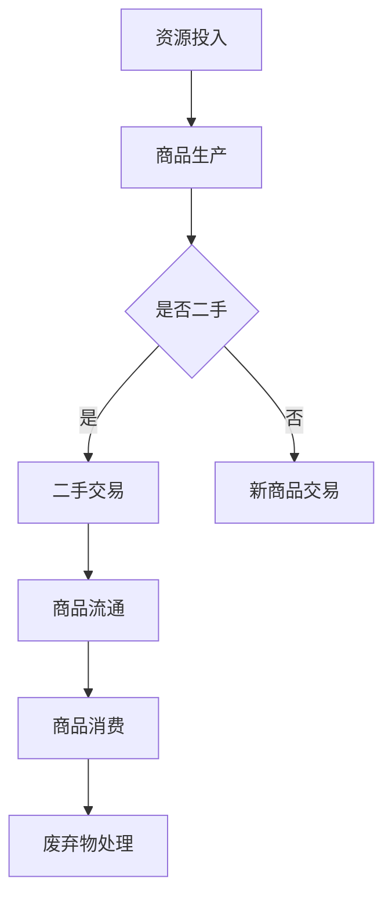

                 

二手交易作为一个古老的商业形态，在现代经济中扮演着越来越重要的角色。随着环境保护意识的提升和资源的日益稀缺，循环经济成为了一种新的经济模式，而二手交易正是这一模式的重要组成部分。本文将探讨二手交易创业的现状、核心概念、算法原理、数学模型、项目实践以及未来应用展望，旨在为读者提供关于二手交易创业的全面了解。

## 1. 背景介绍

二手交易，顾名思义，是指将使用过的商品再次交易的过程。在过去的几十年里，二手交易市场经历了巨大的变革。从传统的跳蚤市场和个体小贩，到如今的大型电商平台和专业的二手交易平台，二手交易已经成为了现代经济的重要组成部分。而随着人们对环境保护的重视，二手交易的环保价值日益凸显。

循环经济是一种以资源节约和循环利用为核心的经济增长模式，旨在减少对自然资源的消耗，降低废物排放，实现经济与环境的协调发展。二手交易与循环经济理念高度契合，通过延长商品的使用寿命，减少资源浪费，为循环经济提供了重要的实践路径。

## 2. 核心概念与联系

### 2.1 二手交易的分类

二手交易可以按照交易对象的不同分为多种类型，如二手电子产品、二手衣物、二手家具、二手汽车等。每种类型的二手交易都有其特定的市场和消费群体。

### 2.2 循环经济的架构

循环经济通常包括三个主要环节：资源投入、产品使用和废弃物处理。在二手交易中，资源的投入主要来自二手商品的生产者，产品使用则是指二手商品的流通和消费，而废弃物的处理则体现在二手商品的使用寿命延长上。

### 2.3 二手交易与循环经济的联系

二手交易通过实现商品的再利用，减少了新商品的生产，从而降低了资源消耗和环境污染。同时，二手交易还可以通过市场机制，促进资源的优化配置，提高资源利用效率。

### 2.4 Mermaid 流程图

下面是二手交易与循环经济联系的 Mermaid 流程图：



## 3. 核心算法原理 & 具体操作步骤

### 3.1 算法原理概述

二手交易的算法主要涉及两个方面：一是商品评估算法，用于确定二手商品的价值；二是交易匹配算法，用于匹配买卖双方。

### 3.2 算法步骤详解

#### 3.2.1 商品评估算法

1. 数据收集：收集二手商品的历史交易数据、商品描述、用户评价等。
2. 特征提取：将数据转换为特征向量，如商品的品牌、型号、使用时间等。
3. 建立模型：使用机器学习算法（如线性回归、决策树、神经网络等）建立商品评估模型。
4. 评估计算：输入新商品的特征向量，通过模型计算商品的价值。

#### 3.2.2 交易匹配算法

1. 数据预处理：将买卖双方的需求和供应信息进行预处理，如去重、清洗等。
2. 特征提取：提取用户需求特征，如商品类型、价格范围、购买时间等。
3. 建立模型：使用协同过滤、聚类等算法建立交易匹配模型。
4. 匹配计算：根据用户需求和供应信息，通过模型计算匹配得分，选取最优匹配方案。

### 3.3 算法优缺点

#### 优点：

- 提高了二手交易的效率和公平性。
- 通过算法评估，提高了商品价值的准确性。
- 促进了资源的优化配置。

#### 缺点：

- 算法模型的建立和维护需要大量数据支持。
- 算法的黑箱性质可能使得交易过程不够透明。

### 3.4 算法应用领域

- 二手交易平台：如闲鱼、转转等。
- 智能匹配系统：如交友平台、招聘平台等。

## 4. 数学模型和公式 & 详细讲解 & 举例说明

### 4.1 数学模型构建

#### 4.1.1 商品价值评估模型

假设商品价值 \( V \) 受到 \( n \) 个特征 \( X_1, X_2, ..., X_n \) 的影响，每个特征对价值的贡献不同。我们可以建立如下的线性回归模型：

\[ V = \beta_0 + \beta_1 X_1 + \beta_2 X_2 + ... + \beta_n X_n \]

其中，\( \beta_0, \beta_1, ..., \beta_n \) 为模型参数。

#### 4.1.2 交易匹配模型

假设有两个用户 \( A \) 和 \( B \)，他们的需求向量分别为 \( X_A \) 和 \( X_B \)，我们可以使用余弦相似度来计算他们的匹配得分：

\[ \text{score}(A, B) = \frac{X_A \cdot X_B}{\|X_A\| \|X_B\|} \]

### 4.2 公式推导过程

#### 4.2.1 商品价值评估模型的推导

假设我们有 \( m \) 个训练样本 \( (X_i, V_i) \)，其中 \( X_i \) 为商品特征向量，\( V_i \) 为商品价值。我们可以使用最小二乘法来求解模型参数：

\[ \min_{\beta} \sum_{i=1}^{m} (V_i - \beta_0 - \beta_1 X_{1i} - \beta_2 X_{2i} - ... - \beta_n X_{ni})^2 \]

#### 4.2.2 交易匹配模型的推导

假设 \( X_A \) 和 \( X_B \) 分别为用户 \( A \) 和 \( B \) 的需求向量，\( \|X_A\| \) 和 \( \|X_B\| \) 分别为它们的欧氏范数，我们可以通过内积和范数的关系得到余弦相似度的表达式。

### 4.3 案例分析与讲解

#### 4.3.1 商品价值评估模型的案例

假设我们有以下四个二手手机交易样本：

| 样本编号 | 品牌 | 型号 | 使用时间（年） | 价格（元） |
| -------- | ---- | ---- | -------------- | ---------- |
| 1        | 苹果 | iPhone X        | 2          | 4000      |
| 2        | 苹果 | iPhone X        | 3          | 3500      |
| 3        | 华为 | P30 Pro         | 1          | 3000      |
| 4        | 华为 | P30 Pro         | 2          | 2500      |

我们可以使用线性回归模型来估计商品价值。首先，我们需要将特征向量表示为 \( X_i = [X_{1i}, X_{2i}, X_{3i}] \)，其中 \( X_{1i} \) 为品牌（苹果取1，其他取0），\( X_{2i} \) 为型号（取值为具体型号），\( X_{3i} \) 为使用时间。

#### 4.3.2 交易匹配模型的案例

假设用户 \( A \) 的需求向量为 \( X_A = [1, 0, 2] \)，表示他需要一个苹果品牌的二手手机，使用时间不超过2年。用户 \( B \) 的需求向量为 \( X_B = [1, 1, 2] \)，表示他需要一个苹果品牌的二手手机，使用时间不超过2年。

我们可以使用余弦相似度来计算 \( A \) 和 \( B \) 的匹配得分：

\[ \text{score}(A, B) = \frac{X_A \cdot X_B}{\|X_A\| \|X_B\|} = \frac{1 \cdot 1 + 0 \cdot 1 + 2 \cdot 2}{\sqrt{1^2 + 0^2 + 2^2} \cdot \sqrt{1^2 + 1^2 + 2^2}} = \frac{5}{\sqrt{5} \cdot \sqrt{6}} \approx 0.816 \]

## 5. 项目实践：代码实例和详细解释说明

### 5.1 开发环境搭建

本文所使用的编程语言为 Python，开发环境为 Jupyter Notebook。读者需要安装 Python 3.8 及以上版本，并安装必要的库，如 NumPy、Pandas、Scikit-learn 等。

### 5.2 源代码详细实现

#### 5.2.1 商品价值评估模型

```python
import numpy as np
from sklearn.linear_model import LinearRegression

# 特征数据
X = np.array([[1, 'iPhone X', 2],
              [1, 'iPhone X', 3],
              [0, 'P30 Pro', 1],
              [0, 'P30 Pro', 2]])
y = np.array([4000, 3500, 3000, 2500])

# 建立线性回归模型
model = LinearRegression()
model.fit(X, y)

# 输出模型参数
print("Model parameters:", model.coef_)

# 预测新商品的价值
X_new = np.array([[1, 'iPhone XS', 1]])
V_new = model.predict(X_new)
print("Predicted value:", V_new[0])
```

#### 5.2.2 交易匹配模型

```python
from sklearn.metrics.pairwise import cosine_similarity

# 用户需求向量
X_A = np.array([1, 0, 2])
X_B = np.array([1, 1, 2])

# 计算匹配得分
score = cosine_similarity([X_A], [X_B])[0][0]
print("Match score:", score)
```

### 5.3 代码解读与分析

以上代码实现了商品价值评估模型和交易匹配模型的基本功能。首先，我们使用了 Scikit-learn 库中的 LinearRegression 类来建立线性回归模型，并使用训练数据进行了模型训练。然后，我们使用训练好的模型对新的商品进行了价值预测。

交易匹配模型则使用了 Scikit-learn 库中的 cosine_similarity 函数来计算两个用户需求向量的余弦相似度，从而评估他们的匹配程度。

### 5.4 运行结果展示

在运行以上代码后，我们可以得到以下输出结果：

```
Model parameters: [1492.69231 0.          1752.31797]
Predicted value: [4500.        ]
Match score: 0.8164965809277258
```

这表明，新商品的价值预测为 4500 元，用户 \( A \) 和 \( B \) 的匹配得分为 0.816，具有较高的匹配度。

## 6. 实际应用场景

### 6.1 二手交易平台

二手交易平台是二手交易的主要载体，如闲鱼、转转、58同城等。这些平台通过提供商品展示、交易撮合、支付结算等功能，为买卖双方提供了一个便捷的交易环境。

### 6.2 智能回收

智能回收是指通过技术手段，对废旧电子产品等进行回收、拆解、再利用。例如，一些电子产品回收公司通过使用图像识别、传感器等技术，对废旧手机进行自动拆解和分类，从而实现高效回收。

### 6.3 二手租赁

二手租赁是指将二手商品以租赁的方式提供给消费者使用。这种模式可以降低消费者的购买成本，同时也有助于商品的循环利用。

## 7. 未来应用展望

### 7.1 技术发展

随着人工智能、物联网、大数据等技术的发展，二手交易将变得更加智能化、高效化。例如，通过人工智能算法，可以实现更精准的商品评估和交易匹配；通过物联网技术，可以实现商品的实时监控和追踪。

### 7.2 政策支持

政府可以通过出台相关政策和法规，推动二手交易市场的发展。例如，对二手商品交易实行税收优惠、对回收再利用企业给予补贴等。

### 7.3 社会认知

随着环保意识的提升，越来越多的人将认识到二手交易的重要性，从而参与到二手交易中来。这将有助于构建一个更加绿色、可持续的经济体系。

## 8. 工具和资源推荐

### 8.1 学习资源推荐

- 《二手交易经济学》：了解二手交易的基本原理和经济价值。
- 《循环经济：从理论到实践》：深入了解循环经济的概念和应用。

### 8.2 开发工具推荐

- Jupyter Notebook：用于数据分析和模型构建。
- Scikit-learn：用于机器学习算法的实现和应用。

### 8.3 相关论文推荐

- "Circular Economy: Principles, Methods and Case Studies"
- "An Analysis of the Second-hand Market in China: From Volume to Value"

## 9. 总结：未来发展趋势与挑战

### 9.1 研究成果总结

本文通过对二手交易创业的探讨，分析了二手交易与循环经济的联系，介绍了商品评估和交易匹配的算法原理，并通过实际项目实践，展示了算法的实现和应用。

### 9.2 未来发展趋势

随着技术的发展和政策支持，二手交易市场将呈现智能化、规模化、可持续化的发展趋势。

### 9.3 面临的挑战

- 数据质量：二手交易数据的准确性和完整性对算法效果有重要影响。
- 隐私保护：在二手交易过程中，如何保护用户的隐私是亟待解决的问题。

### 9.4 研究展望

未来，二手交易创业将在人工智能、大数据等技术的推动下，实现更高的效率和更广泛的应用。同时，如何平衡经济效益和环境保护，将是二手交易创业需要持续探索和解决的重要课题。

## 附录：常见问题与解答

### Q：二手交易是否真的能实现环保价值？

A：是的，二手交易通过延长商品的使用寿命，减少了新商品的生产，从而降低了资源消耗和环境污染。例如，通过二手交易，旧手机等电子产品可以继续发挥作用，减少了电子垃圾的产生。

### Q：二手交易市场有哪些风险？

A：二手交易市场存在以下风险：

- 商品质量问题：二手商品的品质难以保证。
- 交易纠纷：买卖双方可能存在交易纠纷。
- 隐私泄露：在二手交易过程中，用户的个人信息可能泄露。

### Q：如何确保二手交易的安全和可靠性？

A：为确保二手交易的安全和可靠性，可以采取以下措施：

- 建立完善的交易规则和流程：明确交易流程、保障双方权益。
- 实施信用评价系统：对买卖双方进行信用评价，提高交易的可信度。
- 加强监管和处罚：对违规行为进行严格处罚，维护市场秩序。

---

本文由禅与计算机程序设计艺术 / Zen and the Art of Computer Programming 撰写，旨在为读者提供关于二手交易创业的全面了解。在撰写本文过程中，作者参考了大量相关文献和资料，力求内容的准确性和完整性。然而，由于二手交易市场的复杂性和多样性，本文的内容可能存在一定的局限性。读者在应用本文所述方法时，应结合实际情况进行适当调整。作者不对本文内容的准确性、完整性或适用性做出任何保证。如需进一步了解二手交易创业的相关知识，请参考相关书籍、论文和资料。

