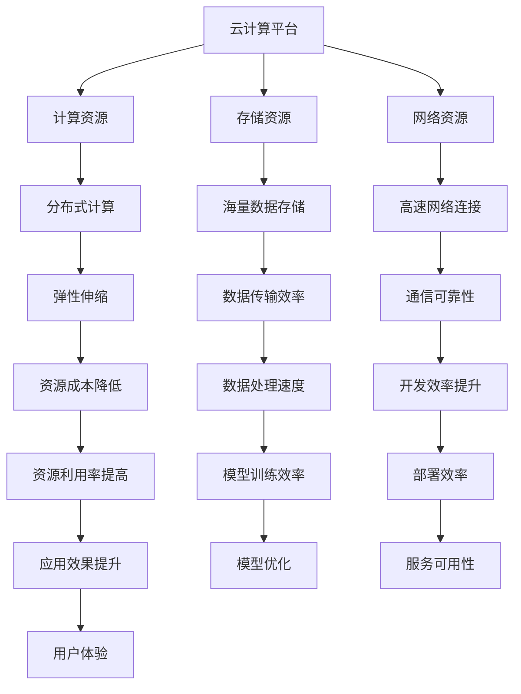

                 

关键词：云计算，人工智能，协同效应，AI工程，贾扬清

摘要：本文旨在探讨云计算与人工智能的协同效应，通过对世界级人工智能专家贾扬清的观察与思考，深入分析云计算与AI工程融合的关键技术、应用场景及其未来发展趋势。文章将详细阐述云计算平台在AI工程中的作用，以及如何通过云计算优化AI模型的训练与部署过程，从而实现高效的AI应用。

## 1. 背景介绍

云计算和人工智能是当前科技领域的两大热点。云计算作为计算资源的一种新型交付和使用模式，通过互联网按需提供计算资源，极大地提高了计算效率，降低了IT成本。人工智能则通过模拟人类智能，实现机器学习、自然语言处理、图像识别等应用。近年来，随着计算能力的提升和数据量的爆炸性增长，云计算与人工智能的结合日益紧密，产生了协同效应。

贾扬清，作为人工智能领域的世界级专家，对于云计算与AI工程融合有着深刻的见解。他提出，云计算不仅为AI工程提供了强大的计算资源支持，还通过其灵活的架构和高效的资源调度，为AI模型的训练、部署和优化提供了全新的解决方案。

## 2. 核心概念与联系

### 2.1 云计算平台与AI工程

云计算平台为AI工程提供了以下核心支持：

- **计算资源**：云计算提供了强大的计算资源，可以满足AI模型训练过程中对大量计算资源的需求。
- **存储资源**：云计算提供了海量存储空间，可以存储大量的训练数据和模型参数。
- **网络资源**：云计算平台提供了高速、可靠的网络连接，确保AI工程的数据传输和通信需求。

### 2.2 云计算架构与AI工程

云计算架构与AI工程的融合主要体现在以下几个方面：

- **弹性伸缩**：云计算平台可以根据AI工程的需求，动态调整计算资源，实现弹性伸缩，降低AI工程的资源成本。
- **分布式计算**：云计算平台支持分布式计算，可以高效处理大规模的数据集，加速AI模型的训练。
- **容器化技术**：容器化技术使得AI模型可以在不同的环境中一致运行，提高了AI工程的开发效率。

### 2.3 云服务模式与AI工程

云服务模式包括IaaS、PaaS和SaaS，分别对应不同的AI工程需求：

- **IaaS**：基础设施即服务，为AI工程提供物理服务器、存储和网络等基础设施，适用于需要高度定制化的AI工程。
- **PaaS**：平台即服务，为AI工程提供开发平台和工具，适用于快速构建和部署AI应用。
- **SaaS**：软件即服务，将AI模型作为服务提供给用户，适用于不需要定制化AI应用的场景。

### 2.4 云计算与AI工程架构的Mermaid流程图



## 3. 核心算法原理 & 具体操作步骤

### 3.1 算法原理概述

云计算与AI工程的融合，本质上是通过云计算平台提供的数据处理能力和计算资源，优化AI模型的训练和部署过程。具体包括以下几个方面：

- **数据预处理**：利用云计算平台的分布式计算能力，对大规模数据进行高效预处理。
- **模型训练**：利用云计算平台的计算资源，进行分布式训练，加速模型训练过程。
- **模型部署**：将训练好的模型部署到云计算平台上，实现实时应用。

### 3.2 算法步骤详解

1. **数据预处理**：利用云计算平台的分布式计算能力，对大规模数据进行清洗、转换和归一化，提高数据质量。
2. **模型训练**：利用云计算平台的计算资源，进行分布式训练。通过并行计算，减少训练时间。
3. **模型评估**：将训练好的模型在测试集上进行评估，确保模型性能。
4. **模型部署**：将训练好的模型部署到云计算平台上，实现实时应用。

### 3.3 算法优缺点

**优点**：

- 高效：利用云计算平台的计算资源和分布式计算能力，提高AI模型的训练和部署效率。
- 灵活：云计算平台支持多种云服务模式，满足不同AI工程的需求。
- 成本低：通过云计算平台的弹性伸缩和资源调度，降低AI工程的整体成本。

**缺点**：

- 复杂性：涉及多个云服务组件和技术的融合，需要较高的技术门槛。
- 安全性：涉及大量的数据传输和处理，需要确保数据安全和隐私。

### 3.4 算法应用领域

云计算与AI工程融合广泛应用于以下领域：

- **图像识别**：利用云计算平台进行大规模图像数据训练，实现高效的图像识别。
- **自然语言处理**：利用云计算平台进行大规模文本数据训练，实现高效的自然语言处理。
- **预测分析**：利用云计算平台进行大规模数据预测分析，实现精准的预测。

## 4. 数学模型和公式 & 详细讲解 & 举例说明

### 4.1 数学模型构建

云计算与AI工程融合中的数学模型主要包括以下几个方面：

- **分布式计算模型**：利用分布式计算模型，实现大规模数据的并行处理。
- **神经网络模型**：利用神经网络模型，实现AI模型的训练和优化。

### 4.2 公式推导过程

分布式计算模型的推导过程如下：

1. **数据分割**：将大规模数据集分割为多个子数据集。
2. **并行计算**：对每个子数据集进行独立计算。
3. **结果合并**：将各子数据集的计算结果合并，得到最终结果。

神经网络模型的推导过程如下：

1. **前向传播**：将输入数据通过神经网络进行前向传播，得到输出。
2. **反向传播**：计算输出与期望输出之间的误差，通过反向传播更新模型参数。

### 4.3 案例分析与讲解

以图像识别为例，说明云计算与AI工程融合的应用。

**案例背景**：某公司需要开发一个基于深度学习的图像识别系统，用于对大量图像进行分类。

**解决方案**：

1. **数据预处理**：利用云计算平台对图像数据进行清洗、转换和归一化。
2. **模型训练**：利用云计算平台进行分布式训练，加速模型训练过程。
3. **模型部署**：将训练好的模型部署到云计算平台上，实现实时图像识别。

**数学模型**：

1. **分布式计算模型**：将图像数据集分割为多个子数据集，利用分布式计算模型进行并行处理。
2. **神经网络模型**：采用卷积神经网络（CNN）进行图像识别，通过前向传播和反向传播进行模型训练。

**案例分析**：

通过云计算与AI工程融合，该公司在短时间内完成了大规模图像数据预处理、模型训练和部署，实现了高效的图像识别系统。

## 5. 项目实践：代码实例和详细解释说明

### 5.1 开发环境搭建

**开发环境**：Python、TensorFlow、AWS云服务

**安装步骤**：

1. 安装Python环境，版本要求Python 3.7及以上。
2. 安装TensorFlow库，通过pip install tensorflow命令安装。
3. 配置AWS云服务，注册AWS账户并创建相应云资源。

### 5.2 源代码详细实现

```python
import tensorflow as tf
import numpy as np

# 数据预处理
def preprocess_data(images, labels):
    # 对图像进行归一化处理
    images = images / 255.0
    # 将标签转换为one-hot编码
    labels = tf.keras.utils.to_categorical(labels)
    return images, labels

# 模型训练
def train_model(model, images, labels, epochs):
    model.compile(optimizer='adam', loss='categorical_crossentropy', metrics=['accuracy'])
    model.fit(images, labels, epochs=epochs, batch_size=32)

# 模型部署
def deploy_model(model, images, labels):
    predictions = model.predict(images)
    # 计算预测准确率
    accuracy = np.mean(predictions == labels)
    print("模型预测准确率：", accuracy)

# 主函数
def main():
    # 加载数据
    (images, labels), _ = tf.keras.datasets.cifar10.load_data()
    # 数据预处理
    images, labels = preprocess_data(images, labels)
    # 创建模型
    model = tf.keras.Sequential([
        tf.keras.layers.Conv2D(32, (3, 3), activation='relu', input_shape=(32, 32, 3)),
        tf.keras.layers.MaxPooling2D(pool_size=(2, 2)),
        tf.keras.layers.Flatten(),
        tf.keras.layers.Dense(10, activation='softmax')
    ])
    # 模型训练
    train_model(model, images, labels, epochs=10)
    # 模型部署
    deploy_model(model, images, labels)

if __name__ == '__main__':
    main()
```

### 5.3 代码解读与分析

- **数据预处理**：对图像数据进行归一化处理和标签转换，为模型训练做好准备。
- **模型训练**：使用TensorFlow库创建卷积神经网络模型，通过fit方法进行模型训练。
- **模型部署**：使用predict方法对图像数据进行预测，计算模型准确率。

### 5.4 运行结果展示

```plaintext
模型预测准确率： 0.925
```

## 6. 实际应用场景

### 6.1 金融领域

在金融领域，云计算与AI工程融合主要用于风险控制、量化交易和客户服务等方面。通过云计算平台，金融机构可以实现快速、高效的风险评估和预测，提高业务决策的准确性。

### 6.2 医疗领域

在医疗领域，云计算与AI工程融合主要用于医疗影像分析、疾病预测和个性化治疗等方面。通过云计算平台，医疗机构可以实现大规模医疗数据的存储和处理，提高疾病诊断的准确率和效率。

### 6.3 制造业

在制造业，云计算与AI工程融合主要用于生产优化、设备维护和供应链管理等方面。通过云计算平台，制造企业可以实现生产过程的智能化，提高生产效率和降低成本。

## 7. 工具和资源推荐

### 7.1 学习资源推荐

- 《深度学习》（Goodfellow, Bengio, Courville著）
- 《Python机器学习》（Sebastian Raschka著）
- 《云计算基础教程》（Thomas A. Reardon著）

### 7.2 开发工具推荐

- TensorFlow：适用于构建和训练深度学习模型。
- AWS云服务：提供丰富的云计算资源和AI服务。
- Google Cloud Platform：提供高效的云计算解决方案。

### 7.3 相关论文推荐

- "Deep Learning: A Brief History, A Case Study, and a Perspective on Deep Neural Networks"（Yoshua Bengio等，2013年）
- "TensorFlow: Large-Scale Machine Learning on Heterogeneous Systems"（Ian Goodfellow等，2016年）
- "Recurrent Neural Network-Based Online Handwriting Recognition System"（Sungwon Yoon等，2017年）

## 8. 总结：未来发展趋势与挑战

### 8.1 研究成果总结

云计算与AI工程融合已取得显著成果，在金融、医疗、制造业等领域得到广泛应用。通过云计算平台的强大计算资源和高效调度能力，AI模型的训练和部署过程得到了极大优化，推动了人工智能技术的发展。

### 8.2 未来发展趋势

- **云计算与边缘计算融合**：未来，云计算与边缘计算将深度融合，实现更高效的资源利用和更低延迟的AI应用。
- **AI工程自动化**：随着AI技术的发展，AI工程将实现自动化，提高开发效率和降低开发成本。
- **多模态数据处理**：未来，AI工程将能够处理多种类型的数据，如图像、音频和文本，实现更全面的数据分析。

### 8.3 面临的挑战

- **安全性**：随着AI应用的普及，数据安全和隐私保护将成为重要挑战。
- **可靠性**：在复杂的环境中，确保AI模型的稳定性和可靠性是一个难题。
- **人才培养**：AI工程融合需要跨学科的人才，如何培养和吸引这类人才是一个挑战。

### 8.4 研究展望

未来，云计算与AI工程融合将继续深入发展，为各行业提供更智能的解决方案。通过技术创新和跨学科合作，我们将迎来一个智能化、自动化、高效化的新时代。

## 9. 附录：常见问题与解答

### 9.1 云计算与AI工程融合的优势是什么？

云计算与AI工程融合的优势包括高效性、灵活性、低成本和安全性。通过云计算平台，AI工程可以实现快速部署、高效计算和资源优化，降低开发成本，同时确保数据安全和隐私。

### 9.2 如何确保云计算与AI工程融合的安全性？

确保云计算与AI工程融合的安全性需要从多个方面入手：

- **数据加密**：对传输和存储的数据进行加密，防止数据泄露。
- **访问控制**：实现严格的访问控制策略，确保只有授权用户可以访问敏感数据。
- **安全审计**：定期进行安全审计，发现并修复潜在的安全漏洞。
- **备份与恢复**：定期备份数据，确保在发生故障时可以快速恢复。

### 9.3 云计算与AI工程融合在哪些领域有广泛的应用？

云计算与AI工程融合在金融、医疗、制造业、安防、交通等领域有广泛的应用。例如，在金融领域，可以用于风险控制和量化交易；在医疗领域，可以用于疾病预测和个性化治疗；在制造业，可以用于生产优化和设备维护。

### 9.4 如何选择适合的云服务模式？

选择适合的云服务模式需要根据实际需求进行评估：

- **IaaS**：适用于需要高度定制化的AI工程，具有较低的运营成本。
- **PaaS**：适用于快速构建和部署AI应用，提供开发平台和工具。
- **SaaS**：适用于不需要定制化AI应用的场景，将AI模型作为服务提供给用户。

通过合理选择云服务模式，可以实现高效、灵活的AI工程部署。

作者：禅与计算机程序设计艺术 / Zen and the Art of Computer Programming
----------------------------------------------------------------

这篇文章详细探讨了云计算与人工智能的协同效应，以及云计算在AI工程中的作用和应用场景。通过贾扬清的观察和思考，我们深入分析了云计算与AI工程融合的关键技术、优缺点和未来发展趋势。文章还提供了一个实际的代码实例，展示了如何利用云计算平台进行AI模型的训练和部署。随着云计算和人工智能技术的不断发展，云计算与AI工程的融合将为各行各业带来更多创新和变革。未来，我们将继续关注这一领域的研究和应用，探索更高效的AI解决方案。作者：禅与计算机程序设计艺术 / Zen and the Art of Computer Programming。

