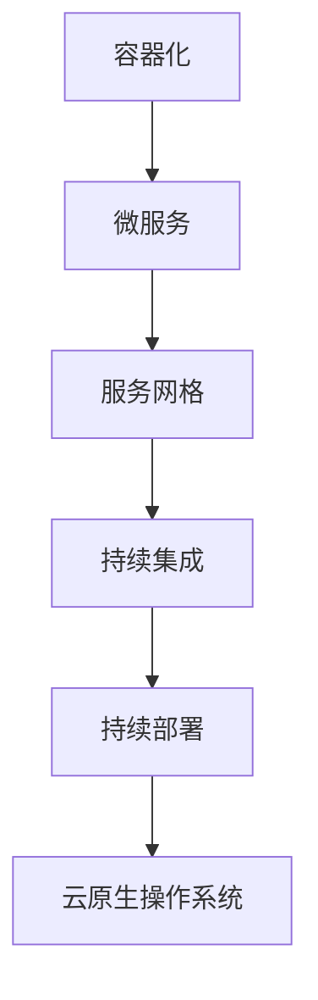

                 

关键词：云原生，架构设计，可扩展性，云端应用，微服务，容器化，DevOps

> 摘要：本文深入探讨了云原生架构设计的核心概念、原则和实践方法。通过分析其与微服务、容器化、DevOps等技术的紧密联系，本文旨在为开发者和架构师提供构建高效可扩展云端应用的理论基础和实践指南。

## 1. 背景介绍

在云计算技术飞速发展的今天，云原生（Cloud Native）已成为引领未来应用架构的关键方向。云原生架构不仅能够充分利用云计算资源，实现高效的可扩展性、弹性和灵活性，还能大大降低开发和运维的复杂度。

云原生架构的设计理念源于对传统应用架构的革新，它强调利用容器、服务网格、微服务、持续集成和持续部署（CI/CD）等新兴技术，以实现应用的动态伸缩、自动化运维和敏捷迭代。其核心目标是构建能够在任何云平台上运行的可移植、可复用和可升级的软件系统。

本文将围绕云原生架构设计的核心概念、实践方法以及相关技术，详细探讨如何构建高效可扩展的云端应用。

## 2. 核心概念与联系

### 2.1 云原生架构的五大原则

云原生架构遵循以下五大原则：

1. **容器化**：将应用打包为容器，实现应用与运行环境的解耦。
2. **微服务化**：将大应用拆分为多个独立的微服务，提高系统的可扩展性和灵活性。
3. **服务网格**：通过服务网格实现服务之间的通信、监控和路由。
4. **持续集成和持续部署**：实现代码的自动化测试、集成和部署，提高开发效率。
5. **云原生操作系统**：利用云原生操作系统（如Kubernetes）提供资源管理、自动化部署和弹性伸缩等能力。

### 2.2 云原生架构与微服务的联系

微服务是一种将大型应用拆分为多个小型、独立服务的架构风格。每个微服务都可以独立开发、测试、部署和扩展，从而提高了系统的可扩展性和灵活性。云原生架构与微服务之间的紧密联系体现在以下几个方面：

- **容器化**：容器化技术使微服务可以独立打包、部署和运行，从而实现微服务的灵活部署。
- **服务网格**：服务网格可以管理和优化微服务之间的通信，提高系统的可靠性和性能。
- **持续集成和持续部署**：微服务的独立性使得持续集成和持续部署得以实现，从而提高了开发效率。

### 2.3 Mermaid 流程图

以下是一个简单的Mermaid流程图，展示了云原生架构的核心概念和联系：



## 3. 核心算法原理 & 具体操作步骤

### 3.1 算法原理概述

云原生架构的核心算法原理包括：

1. **容器编排**：通过容器编排算法实现容器资源的高效分配和管理。
2. **服务发现**：通过服务发现算法实现微服务之间的动态通信。
3. **弹性伸缩**：通过弹性伸缩算法实现系统资源根据负载动态调整。

### 3.2 算法步骤详解

1. **容器编排**：
   - 步骤1：容器镜像构建
   - 步骤2：容器编排器调度
   - 步骤3：容器资源监控和调整

2. **服务发现**：
   - 步骤1：服务注册
   - 步骤2：服务发现查询
   - 步骤3：服务路由和连接

3. **弹性伸缩**：
   - 步骤1：负载监控
   - 步骤2：扩缩容策略制定
   - 步骤3：资源调整和容器重启

### 3.3 算法优缺点

1. **容器编排**：
   - 优点：高效、灵活、可扩展
   - 缺点：需要一定程度的运维知识，编排算法复杂

2. **服务发现**：
   - 优点：动态、高效、可靠
   - 缺点：可能引入单点故障，服务发现策略需要仔细设计

3. **弹性伸缩**：
   - 优点：自动化、高效、节约成本
   - 缺点：可能引入一定的延迟，扩缩容策略需要根据业务场景进行调整

### 3.4 算法应用领域

云原生架构的核心算法广泛应用于以下领域：

- **互联网应用**：如电商、社交、游戏等
- **大数据应用**：如数据采集、存储、处理和分析等
- **金融应用**：如银行、保险、证券等

## 4. 数学模型和公式 & 详细讲解 & 举例说明

### 4.1 数学模型构建

云原生架构中的数学模型主要涉及以下两个方面：

1. **负载均衡模型**：描述系统在负载压力下的资源分配和调度策略。
2. **弹性伸缩模型**：描述系统根据负载变化动态调整资源的过程。

### 4.2 公式推导过程

1. **负载均衡模型**：

   负载均衡模型的核心公式为：

   $$L_i = f(W_i, R_i)$$

   其中，$L_i$ 表示第 $i$ 个资源的负载，$W_i$ 表示第 $i$ 个资源的权重，$R_i$ 表示第 $i$ 个资源的剩余容量。

   公式推导过程如下：

   - 步骤1：定义资源权重 $W_i$，用于衡量资源的重要性和性能。

   - 步骤2：定义资源剩余容量 $R_i$，用于衡量资源的可用性。

   - 步骤3：根据资源权重和剩余容量计算负载 $L_i$，即：

   $$L_i = \frac{W_i}{R_i}$$

2. **弹性伸缩模型**：

   弹性伸缩模型的核心公式为：

   $$R_{new} = R_{old} + \alpha(L_{current} - L_{threshold})$$

   其中，$R_{new}$ 表示新的资源容量，$R_{old}$ 表示旧的资源容量，$L_{current}$ 表示当前负载，$L_{threshold}$ 表示负载阈值，$\alpha$ 表示扩缩容比例。

   公式推导过程如下：

   - 步骤1：定义负载阈值 $L_{threshold}$，用于判断系统是否需要扩缩容。

   - 步骤2：根据当前负载 $L_{current}$ 和负载阈值 $L_{threshold}$ 计算扩缩容比例 $\alpha$，即：

   $$\alpha = \frac{L_{current} - L_{threshold}}{L_{threshold}}$$

   - 步骤3：根据扩缩容比例 $\alpha$ 计算新的资源容量 $R_{new}$，即：

   $$R_{new} = R_{old} + \alpha(L_{current} - L_{threshold})$$

### 4.3 案例分析与讲解

假设一个电商平台在双十一期间面临巨大的流量压力，系统的负载阈值设定为 $L_{threshold} = 0.8$。根据历史数据和预测，当前负载 $L_{current} = 0.9$，扩缩容比例 $\alpha = 1.5$。

根据弹性伸缩模型，计算新的资源容量 $R_{new}$：

$$R_{new} = R_{old} + \alpha(L_{current} - L_{threshold})$$

$$R_{new} = R_{old} + 1.5(0.9 - 0.8)$$

$$R_{new} = R_{old} + 0.15R_{old}$$

$$R_{new} = 1.15R_{old}$$

即新的资源容量为原来的 $1.15$ 倍。

这个案例展示了云原生架构中的弹性伸缩模型如何根据实际负载动态调整系统资源，确保系统在高负载情况下仍然能够稳定运行。

## 5. 项目实践：代码实例和详细解释说明

### 5.1 开发环境搭建

在本项目中，我们将使用Docker和Kubernetes作为主要的容器化和编排工具。以下是开发环境的搭建步骤：

1. **安装Docker**：

   在Ubuntu系统上，可以通过以下命令安装Docker：

   ```bash
   sudo apt-get update
   sudo apt-get install docker.io
   sudo systemctl start docker
   sudo systemctl enable docker
   ```

2. **安装Kubernetes**：

   可以使用Kubeadm工具快速部署Kubernetes集群。以下是在一个单节点上进行部署的步骤：

   ```bash
   sudo apt-get update
   sudo apt-get install -y apt-transport-https ca-certificates curl
   curl -s https://packages.cloud.google.com/apt/doc/apt-key.gpg | sudo apt-key add -
   cat <<EOF | sudo tee /etc/apt/sources.list.d/kubernetes.list
   deb https://apt.kubernetes.io/ kubernetes-xenial main
   EOF
   sudo apt-get update
   sudo apt-get install -y kubelet kubeadm kubectl
   sudo apt-mark hold kubelet kubeadm kubectl
   ```

   运行以下命令初始化集群：

   ```bash
   sudo kubeadm init --pod-network-cidr=10.244.0.0/16
   ```

   遵循提示完成初始化过程，并获取管理集群的kubectl命令。

3. **安装Calico网络插件**：

   ```bash
   kubectl apply -f https://docs.projectcalico.org/manifests/calico.yaml
   ```

### 5.2 源代码详细实现

以下是项目中的一个微服务——用户服务（User Service）的Dockerfile：

```Dockerfile
# 使用官方的Java 11镜像作为基础镜像
FROM openjdk:11-jdk-alpine

# 设置维护者信息
LABEL maintainer="禅与计算机程序设计艺术 <your_email@example.com>"

# 设置工作目录
WORKDIR /app

# 将源代码复制到容器中
COPY src /app

# 安装Maven
RUN apk add --no-cache maven

# 构建项目
RUN mvn install

# 暴露容器端口
EXPOSE 8080

# 运行用户服务
CMD ["java", "-Djava.security.egd=file:/dev/./urandom", "-jar", "/app/target/user-service-0.1.0.jar"]
```

### 5.3 代码解读与分析

这个Dockerfile用于构建用户服务的容器镜像。以下是代码的详细解读：

- **基础镜像**：使用了官方的Java 11镜像，这是Alpine版本，具有轻量级特性。

- **维护者信息**：设置了维护者的信息，方便其他开发者了解和维护。

- **工作目录**：将工作目录设置为/app，这是后续文件操作的基础目录。

- **复制源代码**：将项目的源代码从宿主机复制到容器的/app目录。

- **安装Maven**：在容器中安装Maven，用于编译和构建Java项目。

- **构建项目**：使用Maven构建用户服务，并将生成的jar文件放置在容器的/app/target目录。

- **暴露端口**：容器启动时，暴露8080端口，以便外部访问用户服务。

- **运行命令**：启动Java进程，运行用户服务的jar文件。

### 5.4 运行结果展示

以下是运行用户服务的命令和结果：

```bash
# 构建镜像
docker build -t user-service .

# 运行容器
docker run -d -p 8080:8080 --name user-service user-service
```

运行结果：

- 构建成功并运行容器。

- 可以通过访问localhost:8080检查用户服务的运行状态。

## 6. 实际应用场景

### 6.1 互联网电商

在互联网电商领域，云原生架构的应用主要体现在以下几个方面：

- **高并发处理**：通过容器化和微服务化，实现灵活的负载均衡和分布式处理，确保在高并发情况下系统稳定运行。

- **弹性伸缩**：根据用户访问量的变化，动态调整服务器资源，实现成本优化。

- **快速迭代**：通过持续集成和持续部署，缩短产品迭代周期，快速响应市场需求。

### 6.2 大数据处理

在大数据处理领域，云原生架构的应用包括：

- **资源调度**：利用容器编排和弹性伸缩，实现大数据处理任务的高效调度和资源利用。

- **分布式存储**：通过云原生架构，实现分布式存储系统的弹性扩展和故障转移。

- **数据安全**：利用云原生安全框架，确保数据处理过程的安全性。

### 6.3 金融科技

在金融科技领域，云原生架构的应用主要包括：

- **交易处理**：通过微服务和容器化，实现高并发交易处理，确保交易系统的稳定性和安全性。

- **风险控制**：利用云原生架构的弹性伸缩和监控能力，实现实时风险监控和快速响应。

- **合规性**：通过云原生安全框架，确保金融系统的合规性和数据安全。

## 7. 工具和资源推荐

### 7.1 学习资源推荐

- **《云原生应用架构指南》**：全面介绍云原生架构的设计原则、实践方法和相关技术。
- **Kubernetes官方文档**：深入了解Kubernetes的核心概念、功能和使用方法。
- **云原生微服务实践》**：介绍微服务架构在云原生环境下的设计、开发和运维。

### 7.2 开发工具推荐

- **Docker**：用于构建、运行和分发容器化应用。
- **Kubernetes**：用于管理容器化应用的生命周期和资源。
- **Jenkins**：用于实现持续集成和持续部署。

### 7.3 相关论文推荐

- **“Docker: Lightweight Linux Containers for Developing, Shipping, and Running Applications”**：介绍Docker的核心概念和实现原理。
- **“Kubernetes: System Overview”**：深入分析Kubernetes的设计和架构。
- **“Microservices: A Definition of a Software Architecture Style”**：阐述微服务架构的特点和优势。

## 8. 总结：未来发展趋势与挑战

### 8.1 研究成果总结

云原生架构的设计理念和技术体系已逐渐成熟，并在多个领域取得了显著的应用成果。通过容器化、微服务化、服务网格、持续集成和持续部署等技术，云原生架构实现了应用的高效可扩展性、弹性和灵活性。

### 8.2 未来发展趋势

未来，云原生架构将继续向以下几个方面发展：

- **自动化运维**：进一步提高自动化水平，减少人工干预，提高系统运维效率。
- **多云和多云迁移**：实现跨云平台的应用部署和迁移，提高系统的灵活性和可移植性。
- **安全性和隐私保护**：加强云原生架构的安全性，确保数据安全和隐私保护。

### 8.3 面临的挑战

尽管云原生架构具有诸多优势，但在实际应用过程中仍面临以下挑战：

- **技术复杂性**：云原生架构涉及多个技术组件和工具，需要掌握一定的运维知识。
- **运维成本**：随着系统规模的扩大，运维成本也相应增加。
- **安全性问题**：容器化、微服务化等技术的引入可能带来新的安全风险。

### 8.4 研究展望

未来，云原生架构的研究方向将包括：

- **智能化运维**：利用人工智能和机器学习技术，实现智能化运维和故障预测。
- **混合云架构**：研究如何将云原生架构与传统的企业IT系统相结合，实现混合云架构。
- **云原生安全**：加强云原生架构的安全性研究，提高系统的安全性和可靠性。

## 9. 附录：常见问题与解答

### 9.1 什么是云原生架构？

云原生架构是一种利用云计算、容器化、微服务、持续集成和持续部署等新兴技术，实现应用的高效可扩展性、弹性和灵活性的架构风格。

### 9.2 云原生架构与微服务架构有什么区别？

云原生架构是一种基于云计算和微服务架构的扩展和革新。微服务架构强调将大应用拆分为多个独立的服务，而云原生架构在此基础上增加了容器化、服务网格、持续集成和持续部署等概念，以实现更高的可扩展性和自动化水平。

### 9.3 如何在云原生架构中实现弹性伸缩？

在云原生架构中，实现弹性伸缩通常涉及以下几个步骤：

- **监控负载**：通过监控工具实时监控系统负载。
- **制定策略**：根据业务需求和资源限制，制定合适的弹性伸缩策略。
- **自动扩缩容**：利用容器编排器（如Kubernetes）实现自动扩缩容。

### 9.4 云原生架构的安全性如何保障？

云原生架构的安全性保障可以从以下几个方面入手：

- **容器安全**：确保容器镜像的安全，避免镜像漏洞和恶意软件。
- **网络隔离**：通过容器网络隔离技术，防止容器间的网络攻击。
- **访问控制**：实施严格的访问控制策略，限制容器和服务的访问权限。

## 作者署名

作者：禅与计算机程序设计艺术 / Zen and the Art of Computer Programming

