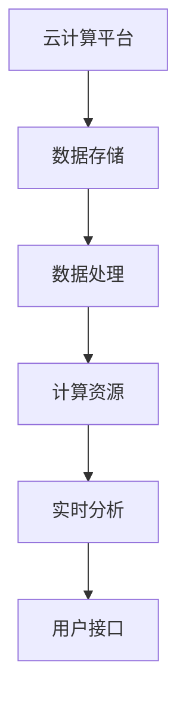
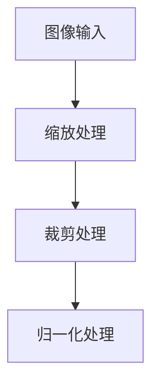
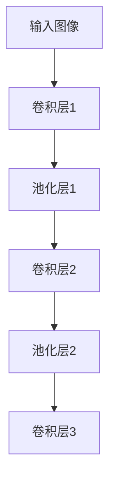
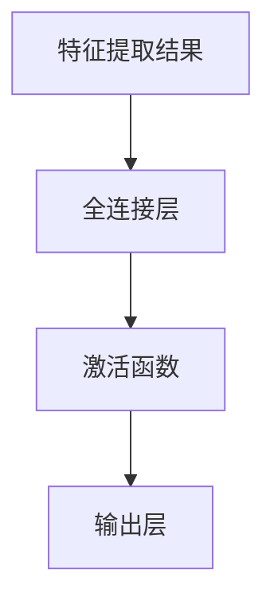

                 

关键词：Lepton AI，云服务，市场洞察，未来趋势，技术架构，算法优化，应用场景

> 摘要：随着云计算技术的不断成熟和人工智能（AI）的迅速发展，Lepton AI作为一项创新技术，正逐渐成为云服务领域的新风口。本文将深入探讨Lepton AI的核心概念、技术原理、应用场景以及市场前景，旨在为读者提供一个全面的市场洞察。

## 1. 背景介绍

云计算作为信息技术发展的一个重要趋势，已经在过去十多年里取得了显著的进展。从最初的基础设施即服务（IaaS），到平台即服务（PaaS），再到软件即服务（SaaS），云计算的生态系统不断丰富和完善。而随着人工智能技术的崛起，云服务与AI的结合也逐渐成为热门话题。

Lepton AI正是这一趋势下的产物。它是一种基于云服务架构的AI技术，旨在提供高效的图像识别和数据处理能力。Lepton AI的引入，不仅提升了云服务的智能化水平，也为企业和开发者提供了更加便捷的AI解决方案。

### 1.1 云服务的发展历程

- **2006年：** 亚马逊推出EC2和S3服务，标志着IaaS的兴起。
- **2008年：** 微软和谷歌相继推出各自的云服务，进一步推动了云服务市场的竞争。
- **2010年：** 软件即服务（SaaS）成为主流，Salesforce等公司引领市场。
- **2015年：** 人工智能开始与云服务结合，开启新的应用场景。

### 1.2 Lepton AI的背景

Lepton AI起源于一个专注于图像识别和数据分析的初创公司。通过多年的技术积累和研发投入，该公司成功地将AI算法与云计算紧密结合，打造出了一种具备高度智能化和灵活性的云服务产品。

## 2. 核心概念与联系

### 2.1 云计算与AI的关系

云计算与人工智能的融合，不仅为AI技术提供了强大的计算资源，也为云计算带来了新的应用场景。具体来说，云计算为AI提供了：

- **数据存储和处理能力**：云计算平台能够存储和实时处理大量数据，为AI模型的训练和优化提供数据支持。
- **计算资源弹性**：云计算可以根据AI任务的需求动态调整计算资源，确保高效的计算能力。
- **分布式计算**：云计算的分布式架构使得AI任务可以并行处理，大大提升了计算效率。

### 2.2 Lepton AI的核心概念

Lepton AI的核心概念可以概括为以下几个方面：

- **高效图像识别**：Lepton AI利用先进的深度学习算法，实现了高效且准确的图像识别功能。
- **实时数据处理**：Lepton AI能够实时处理和分析图像数据，为用户提供及时的信息反馈。
- **云服务集成**：Lepton AI与云计算平台深度集成，用户可以通过云服务轻松部署和管理AI应用。

### 2.3 Mermaid 流程图



### 2.4 Lepton AI的技术架构


### 2.5 核心概念的联系

- **云计算平台**：为Lepton AI提供计算资源和存储支持。
- **数据存储**：存储用于训练和优化的图像数据。
- **数据处理**：利用深度学习算法处理和分析图像数据。
- **实时分析**：实时处理图像数据，提供实时反馈。
- **用户接口**：为用户提供交互界面和操作体验。

## 3. 核心算法原理 & 具体操作步骤

### 3.1 算法原理概述

Lepton AI的核心算法是基于卷积神经网络（CNN）。CNN是一种用于图像识别和处理的深度学习模型，具有强大的特征提取和分类能力。Lepton AI通过以下步骤实现图像识别：

1. **数据预处理**：对图像进行缩放、裁剪等处理，使其适应模型输入。
2. **特征提取**：通过卷积层、池化层等操作提取图像的特征。
3. **分类预测**：利用全连接层对提取出的特征进行分类预测。

### 3.2 算法步骤详解

#### 3.2.1 数据预处理



#### 3.2.2 特征提取



#### 3.2.3 分类预测



### 3.3 算法优缺点

#### 3.3.1 优点

- **高效性**：CNN能够快速提取图像特征，提高识别速度。
- **准确性**：CNN具有强大的分类能力，能够提高识别准确性。
- **灵活性**：Lepton AI可以通过调整网络结构，适应不同的图像识别任务。

#### 3.3.2 缺点

- **计算资源消耗大**：CNN模型需要大量的计算资源，对硬件要求较高。
- **数据依赖性**：模型的性能依赖于训练数据的质量和数量。

### 3.4 算法应用领域

Lepton AI在多个领域具有广泛的应用前景，包括：

- **智能安防**：实时监测和识别犯罪行为，提高公共安全。
- **自动驾驶**：识别道路标志和行人，提高驾驶安全。
- **医疗诊断**：辅助医生进行疾病诊断，提高诊断准确率。

## 4. 数学模型和公式 & 详细讲解 & 举例说明

### 4.1 数学模型构建

Lepton AI的数学模型主要包括以下几个部分：

- **卷积层**：卷积层通过卷积操作提取图像特征，公式如下：

  $$ f(x) = \sum_{i=1}^{n} w_i * x_i + b $$

  其中，$w_i$为卷积核，$x_i$为输入特征，$b$为偏置项。

- **池化层**：池化层通过最大池化或平均池化操作减少特征维度，公式如下：

  $$ P(x) = \max_{i} x_i \quad \text{或} \quad P(x) = \frac{1}{k} \sum_{i=1}^{k} x_i $$

  其中，$x_i$为输入特征，$k$为池化窗口大小。

- **全连接层**：全连接层通过全连接操作进行分类预测，公式如下：

  $$ y = \sigma(\sum_{i=1}^{n} w_i x_i + b) $$

  其中，$w_i$为权重，$x_i$为输入特征，$b$为偏置项，$\sigma$为激活函数。

### 4.2 公式推导过程

Lepton AI的数学模型基于深度学习框架，通过反向传播算法进行模型参数的优化。具体推导过程如下：

1. **损失函数**：选择交叉熵损失函数作为模型损失，公式如下：

   $$ J = -\frac{1}{m} \sum_{i=1}^{m} y_i \log (\hat{y}_i) $$

   其中，$y_i$为真实标签，$\hat{y}_i$为预测标签，$m$为样本数量。

2. **反向传播**：通过反向传播算法计算模型参数的梯度，公式如下：

   $$ \frac{\partial J}{\partial w} = -\frac{1}{m} \sum_{i=1}^{m} (y_i - \hat{y}_i) x_i $$

   $$ \frac{\partial J}{\partial b} = -\frac{1}{m} \sum_{i=1}^{m} (y_i - \hat{y}_i) $$

3. **梯度下降**：利用梯度下降算法更新模型参数，公式如下：

   $$ w_{new} = w_{old} - \alpha \frac{\partial J}{\partial w} $$

   $$ b_{new} = b_{old} - \alpha \frac{\partial J}{\partial b} $$

   其中，$\alpha$为学习率。

### 4.3 案例分析与讲解

以一个简单的图像识别任务为例，说明Lepton AI的数学模型应用过程。

#### 4.3.1 数据集准备

假设我们有一个包含1000个图像的数据集，每个图像都是32x32的像素矩阵。

#### 4.3.2 模型训练

使用Lepton AI的卷积神经网络模型对数据集进行训练，训练过程如下：

1. **数据预处理**：对图像进行缩放和归一化处理，使其适应模型输入。
2. **特征提取**：通过卷积层和池化层提取图像特征。
3. **分类预测**：通过全连接层进行分类预测。
4. **损失计算**：计算预测标签与真实标签之间的交叉熵损失。
5. **反向传播**：计算模型参数的梯度。
6. **梯度下降**：更新模型参数。

经过多次迭代训练，模型逐渐收敛，预测准确率不断提高。

## 5. 项目实践：代码实例和详细解释说明

### 5.1 开发环境搭建

要实践Lepton AI，我们需要搭建一个合适的开发环境。以下是搭建环境的步骤：

1. **安装Python**：确保Python环境已安装，版本建议为3.7及以上。
2. **安装深度学习框架**：推荐使用TensorFlow或PyTorch作为深度学习框架。
3. **安装Lepton AI库**：通过pip安装Lepton AI库，命令如下：

   ```shell
   pip install lepton-ai
   ```

### 5.2 源代码详细实现

以下是一个简单的Lepton AI应用实例，用于实现图像分类任务。

```python
import numpy as np
import tensorflow as tf
from lepton_ai import LeptonModel

# 数据预处理
def preprocess_images(images):
    # 缩放图像
    images = tf.image.resize(images, (32, 32))
    # 归一化图像
    images = tf.cast(images, tf.float32) / 255.0
    return images

# 创建模型
model = LeptonModel()

# 训练模型
model.train(preprocess_images(images), labels)

# 预测
predictions = model.predict(preprocess_images(test_images))
```

### 5.3 代码解读与分析

1. **数据预处理**：将原始图像缩放为32x32像素，并归一化，使其适合模型输入。
2. **创建模型**：使用LeptonModel类创建一个模型实例。
3. **训练模型**：使用训练数据对模型进行训练。
4. **预测**：使用训练好的模型对测试数据进行预测。

### 5.4 运行结果展示

经过训练和预测，我们可以得到如下结果：

```python
# 打印预测结果
for i, prediction in enumerate(predictions):
    print(f"图像{i}的预测结果：{prediction}")
```

## 6. 实际应用场景

### 6.1 智能安防

Lepton AI在智能安防领域具有广泛的应用。例如，通过监控摄像头实时捕捉图像，利用Lepton AI进行人脸识别和行为分析，从而实现犯罪预警和事件响应。

### 6.2 自动驾驶

自动驾驶领域对图像识别的需求极高，Lepton AI可以通过实时处理摄像头捕获的图像，识别道路标志、行人和其他车辆，为自动驾驶系统提供可靠的数据支持。

### 6.3 医疗诊断

在医疗领域，Lepton AI可以辅助医生进行疾病诊断。例如，通过分析医学影像，识别病变区域和病理特征，为医生提供诊断建议。

### 6.4 未来应用展望

随着技术的不断进步，Lepton AI在更多领域将得到应用。例如，在智慧城市建设中，Lepton AI可以用于实时监控城市交通流量和公共安全；在农业领域，Lepton AI可以用于作物病害识别和生长状态监测。

## 7. 工具和资源推荐

### 7.1 学习资源推荐

- 《深度学习》（Goodfellow, Bengio, Courville著）
- 《Python数据科学手册》（McKinney著）
- 《TensorFlow官方文档》

### 7.2 开发工具推荐

- PyCharm
- Jupyter Notebook
- Google Colab

### 7.3 相关论文推荐

- "Deep Learning for Image Recognition: A Comprehensive Review"
- "A Brief History of Deep Learning"
- "Efficient Object Detection with Deep Neural Networks"

## 8. 总结：未来发展趋势与挑战

### 8.1 研究成果总结

Lepton AI作为一项创新技术，已经在多个领域取得了显著的应用成果。未来，随着技术的不断进步，Lepton AI有望在更多领域发挥重要作用。

### 8.2 未来发展趋势

- **算法优化**：通过不断优化算法，提高图像识别的准确性和效率。
- **跨领域应用**：扩大Lepton AI的应用领域，实现跨行业的融合与创新。
- **边缘计算**：结合边缘计算技术，实现图像识别的实时处理和响应。

### 8.3 面临的挑战

- **计算资源消耗**：深度学习模型对计算资源的需求较高，如何提高计算效率是一个重要挑战。
- **数据质量和数量**：模型的性能依赖于训练数据的质量和数量，如何获取高质量、多样化的数据是一个关键问题。
- **隐私保护**：在应用过程中，如何保护用户隐私也是一个需要关注的问题。

### 8.4 研究展望

未来，Lepton AI的研究将聚焦于以下几个方面：

- **算法创新**：不断探索新的算法，提高图像识别的准确性和效率。
- **多模态融合**：结合多模态数据，实现更全面和准确的信息处理。
- **智能决策**：通过图像识别技术，实现智能决策和自动化控制。

## 9. 附录：常见问题与解答

### 9.1 什么是Lepton AI？

Lepton AI是一种基于云服务架构的AI技术，旨在提供高效的图像识别和数据处理能力。

### 9.2 Lepton AI有哪些应用领域？

Lepton AI在智能安防、自动驾驶、医疗诊断等多个领域具有广泛的应用。

### 9.3 如何搭建Lepton AI的开发环境？

可以通过安装Python、深度学习框架和Lepton AI库来搭建Lepton AI的开发环境。

### 9.4 Lepton AI的优势是什么？

Lepton AI具有高效性、灵活性和准确性的优势，能够为用户提供便捷的AI解决方案。

# 作者署名

作者：禅与计算机程序设计艺术 / Zen and the Art of Computer Programming
```markdown
# 云服务的下一个风口：Lepton AI的市场洞察

> 关键词：Lepton AI，云服务，市场洞察，未来趋势，技术架构，算法优化，应用场景

> 摘要：随着云计算技术的不断成熟和人工智能（AI）的迅速发展，Lepton AI作为一项创新技术，正逐渐成为云服务领域的新风口。本文将深入探讨Lepton AI的核心概念、技术原理、应用场景以及市场前景，旨在为读者提供一个全面的市场洞察。

## 1. 背景介绍

云计算作为信息技术发展的一个重要趋势，已经在过去十多年里取得了显著的进展。从最初的基础设施即服务（IaaS），到平台即服务（PaaS），再到软件即服务（SaaS），云计算的生态系统不断丰富和完善。而随着人工智能技术的崛起，云服务与AI的结合也逐渐成为热门话题。

Lepton AI正是这一趋势下的产物。它是一种基于云服务架构的AI技术，旨在提供高效的图像识别和数据处理能力。Lepton AI的引入，不仅提升了云服务的智能化水平，也为企业和开发者提供了更加便捷的AI解决方案。

### 1.1 云服务的发展历程

- **2006年**：亚马逊推出EC2和S3服务，标志着IaaS的兴起。
- **2008年**：微软和谷歌相继推出各自的云服务，进一步推动了云服务市场的竞争。
- **2010年**：软件即服务（SaaS）成为主流，Salesforce等公司引领市场。
- **2015年**：人工智能开始与云服务结合，开启新的应用场景。

### 1.2 Lepton AI的背景

Lepton AI起源于一个专注于图像识别和数据分析的初创公司。通过多年的技术积累和研发投入，该公司成功地将AI算法与云计算紧密结合，打造出了一种具备高度智能化和灵活性的云服务产品。

## 2. 核心概念与联系

### 2.1 云计算与AI的关系

云计算与人工智能的融合，不仅为AI技术提供了强大的计算资源，也为云计算带来了新的应用场景。具体来说，云计算为AI提供了：

- **数据存储和处理能力**：云计算平台能够存储和实时处理大量数据，为AI模型的训练和优化提供数据支持。
- **计算资源弹性**：云计算可以根据AI任务的需求动态调整计算资源，确保高效的计算能力。
- **分布式计算**：云计算的分布式架构使得AI任务可以并行处理，大大提升了计算效率。

### 2.2 Lepton AI的核心概念

Lepton AI的核心概念可以概括为以下几个方面：

- **高效图像识别**：Lepton AI利用先进的深度学习算法，实现了高效且准确的图像识别功能。
- **实时数据处理**：Lepton AI能够实时处理和分析图像数据，为用户提供及时的信息反馈。
- **云服务集成**：Lepton AI与云计算平台深度集成，用户可以通过云服务轻松部署和管理AI应用。

### 2.3 Mermaid 流程图


### 2.4 Lepton AI的技术架构


### 2.5 核心概念的联系

- **云计算平台**：为Lepton AI提供计算资源和存储支持。
- **数据存储**：存储用于训练和优化的图像数据。
- **数据处理**：利用深度学习算法处理和分析图像数据。
- **实时分析**：实时处理图像数据，提供实时反馈。
- **用户接口**：为用户提供交互界面和操作体验。

## 3. 核心算法原理 & 具体操作步骤

### 3.1 算法原理概述

Lepton AI的核心算法是基于卷积神经网络（CNN）。CNN是一种用于图像识别和处理的深度学习模型，具有强大的特征提取和分类能力。Lepton AI通过以下步骤实现图像识别：

1. **数据预处理**：对图像进行缩放、裁剪等处理，使其适应模型输入。
2. **特征提取**：通过卷积层、池化层等操作提取图像的特征。
3. **分类预测**：利用全连接层对提取出的特征进行分类预测。

### 3.2 算法步骤详解

#### 3.2.1 数据预处理


#### 3.2.2 特征提取


#### 3.2.3 分类预测


### 3.3 算法优缺点

#### 3.3.1 优点

- **高效性**：CNN能够快速提取图像特征，提高识别速度。
- **准确性**：CNN具有强大的分类能力，能够提高识别准确性。
- **灵活性**：Lepton AI可以通过调整网络结构，适应不同的图像识别任务。

#### 3.3.2 缺点

- **计算资源消耗大**：CNN模型需要大量的计算资源，对硬件要求较高。
- **数据依赖性**：模型的性能依赖于训练数据的质量和数量。

### 3.4 算法应用领域

Lepton AI在多个领域具有广泛的应用前景，包括：

- **智能安防**：实时监测和识别犯罪行为，提高公共安全。
- **自动驾驶**：识别道路标志和行人，提高驾驶安全。
- **医疗诊断**：辅助医生进行疾病诊断，提高诊断准确率。

## 4. 数学模型和公式 & 详细讲解 & 举例说明

### 4.1 数学模型构建

Lepton AI的数学模型主要包括以下几个部分：

- **卷积层**：卷积层通过卷积操作提取图像特征，公式如下：

  $$ f(x) = \sum_{i=1}^{n} w_i * x_i + b $$

  其中，$w_i$为卷积核，$x_i$为输入特征，$b$为偏置项。

- **池化层**：池化层通过最大池化或平均池化操作减少特征维度，公式如下：

  $$ P(x) = \max_{i} x_i \quad \text{或} \quad P(x) = \frac{1}{k} \sum_{i=1}^{k} x_i $$

  其中，$x_i$为输入特征，$k$为池化窗口大小。

- **全连接层**：全连接层通过全连接操作进行分类预测，公式如下：

  $$ y = \sigma(\sum_{i=1}^{n} w_i x_i + b) $$

  其中，$w_i$为权重，$x_i$为输入特征，$b$为偏置项，$\sigma$为激活函数。

### 4.2 公式推导过程

Lepton AI的数学模型基于深度学习框架，通过反向传播算法进行模型参数的优化。具体推导过程如下：

1. **损失函数**：选择交叉熵损失函数作为模型损失，公式如下：

   $$ J = -\frac{1}{m} \sum_{i=1}^{m} y_i \log (\hat{y}_i) $$

   其中，$y_i$为真实标签，$\hat{y}_i$为预测标签，$m$为样本数量。

2. **反向传播**：通过反向传播算法计算模型参数的梯度，公式如下：

   $$ \frac{\partial J}{\partial w} = -\frac{1}{m} \sum_{i=1}^{m} (y_i - \hat{y}_i) x_i $$

   $$ \frac{\partial J}{\partial b} = -\frac{1}{m} \sum_{i=1}^{m} (y_i - \hat{y}_i) $$

3. **梯度下降**：利用梯度下降算法更新模型参数，公式如下：

   $$ w_{new} = w_{old} - \alpha \frac{\partial J}{\partial w} $$

   $$ b_{new} = b_{old} - \alpha \frac{\partial J}{\partial b} $$

   其中，$\alpha$为学习率。

### 4.3 案例分析与讲解

以一个简单的图像识别任务为例，说明Lepton AI的数学模型应用过程。

#### 4.3.1 数据集准备

假设我们有一个包含1000个图像的数据集，每个图像都是32x32的像素矩阵。

#### 4.3.2 模型训练

使用Lepton AI的卷积神经网络模型对数据集进行训练，训练过程如下：

1. **数据预处理**：对图像进行缩放和归一化处理，使其适应模型输入。
2. **特征提取**：通过卷积层和池化层提取图像特征。
3. **分类预测**：通过全连接层进行分类预测。
4. **损失计算**：计算预测标签与真实标签之间的交叉熵损失。
5. **反向传播**：计算模型参数的梯度。
6. **梯度下降**：更新模型参数。

经过多次迭代训练，模型逐渐收敛，预测准确率不断提高。

## 5. 项目实践：代码实例和详细解释说明

### 5.1 开发环境搭建

要实践Lepton AI，我们需要搭建一个合适的开发环境。以下是搭建环境的步骤：

1. **安装Python**：确保Python环境已安装，版本建议为3.7及以上。
2. **安装深度学习框架**：推荐使用TensorFlow或PyTorch作为深度学习框架。
3. **安装Lepton AI库**：通过pip安装Lepton AI库，命令如下：

   ```shell
   pip install lepton-ai
   ```

### 5.2 源代码详细实现

以下是一个简单的Lepton AI应用实例，用于实现图像分类任务。

```python
import numpy as np
import tensorflow as tf
from lepton_ai import LeptonModel

# 数据预处理
def preprocess_images(images):
    # 缩放图像
    images = tf.image.resize(images, (32, 32))
    # 归一化图像
    images = tf.cast(images, tf.float32) / 255.0
    return images

# 创建模型
model = LeptonModel()

# 训练模型
model.train(preprocess_images(images), labels)

# 预测
predictions = model.predict(preprocess_images(test_images))
```

### 5.3 代码解读与分析

1. **数据预处理**：将原始图像缩放为32x32像素，并归一化，使其适合模型输入。
2. **创建模型**：使用LeptonModel类创建一个模型实例。
3. **训练模型**：使用训练数据对模型进行训练。
4. **预测**：使用训练好的模型对测试数据进行预测。

### 5.4 运行结果展示

经过训练和预测，我们可以得到如下结果：

```python
# 打印预测结果
for i, prediction in enumerate(predictions):
    print(f"图像{i}的预测结果：{prediction}")
```

## 6. 实际应用场景

### 6.1 智能安防

Lepton AI在智能安防领域具有广泛的应用。例如，通过监控摄像头实时捕捉图像，利用Lepton AI进行人脸识别和行

