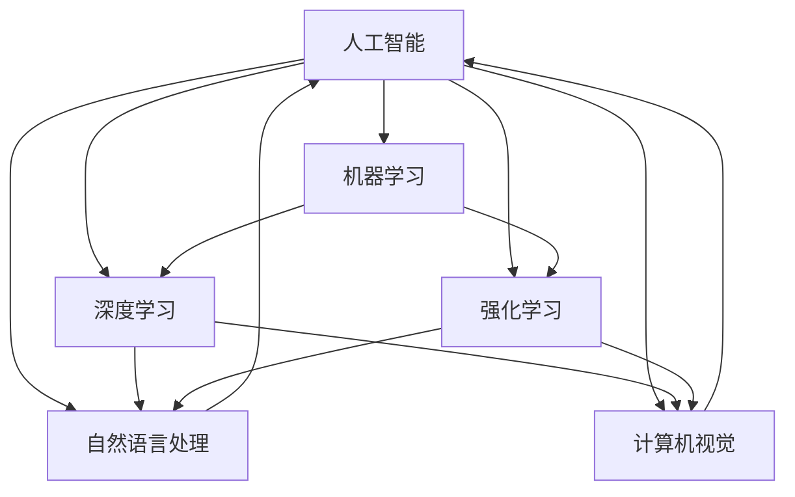

                 

关键词：人工智能、技术变革、应用场景、未来展望

摘要：随着人工智能技术的迅猛发展，它已经深刻地改变了各行各业的运营模式和商业模式。本文将探讨AI技术在不同产业中的应用，分析其带来的变革，并提出未来发展的挑战和展望。

## 1. 背景介绍

### 1.1 人工智能的发展历程

人工智能（AI）起源于20世纪50年代，经历了多次起伏，现在正处于一个快速发展的阶段。从最初的规则推理和符号计算，到基于统计学习和神经网络的方法，再到现在的深度学习和强化学习，AI技术不断演进，使得机器能够更好地模拟和超越人类的智能。

### 1.2 AI技术的核心概念

AI技术主要包括以下几类：

- **机器学习**：通过数据训练模型，让机器自动学习并做出决策。

- **深度学习**：基于多层神经网络的机器学习方法，能够处理复杂的非线性问题。

- **强化学习**：通过试错和反馈来训练模型，使其能够做出最优决策。

- **自然语言处理**：使机器理解和生成自然语言。

- **计算机视觉**：使机器理解和分析图像和视频。

## 2. 核心概念与联系

以下是一个简单的Mermaid流程图，展示AI技术在不同领域的应用及其相互联系：



## 3. 核心算法原理 & 具体操作步骤

### 3.1 算法原理概述

AI技术的核心在于算法，以下是一些重要的AI算法：

- **K最近邻算法（K-NN）**：通过计算测试实例与训练实例之间的距离，选择距离最近的K个实例，并基于这些实例的标签进行预测。

- **支持向量机（SVM）**：通过找到一个最优的超平面，将不同类别的数据分开。

- **决策树**：通过一系列的测试，将数据集划分成不同的子集，并基于这些子集的标签进行预测。

- **神经网络**：通过多层神经元之间的非线性变换，将输入映射到输出。

### 3.2 算法步骤详解

以神经网络为例，以下是其基本步骤：

1. **初始化权重和偏置**：随机初始化权重和偏置。

2. **前向传播**：将输入通过网络传递，得到输出。

3. **计算损失**：通过比较输出和真实值，计算损失函数。

4. **反向传播**：将损失函数通过网络反向传递，更新权重和偏置。

5. **迭代**：重复步骤2-4，直到损失函数达到最小。

### 3.3 算法优缺点

- **K-NN**：简单易实现，但计算量大，对噪声敏感。

- **SVM**：效果好，但计算复杂度高，不适合大数据。

- **决策树**：直观易懂，但容易过拟合。

- **神经网络**：强大，能处理复杂问题，但训练时间长，对数据量大。

### 3.4 算法应用领域

这些算法广泛应用于各个领域：

- **图像识别**：如人脸识别、物体检测。

- **自然语言处理**：如文本分类、机器翻译。

- **推荐系统**：如电商推荐、音乐推荐。

## 4. 数学模型和公式 & 详细讲解 & 举例说明

### 4.1 数学模型构建

以下是一个简单的神经网络模型：

$$
y = \sigma(z)
$$

其中，$z = \sum_{i=1}^{n} w_i x_i + b$，$w_i$和$b$分别是权重和偏置，$\sigma$是激活函数。

### 4.2 公式推导过程

以神经网络为例，以下是其反向传播的推导过程：

$$
\frac{dL}{dw} = \frac{dL}{dz} \frac{dz}{dw}
$$

$$
\frac{dz}{dw} = x_i
$$

$$
\frac{dL}{dw} = \frac{dL}{dz} x_i
$$

### 4.3 案例分析与讲解

以下是一个简单的神经网络模型，用于对图像进行分类：

```python
import tensorflow as tf

# 定义模型
model = tf.keras.Sequential([
    tf.keras.layers.Flatten(input_shape=(28, 28)),
    tf.keras.layers.Dense(128, activation='relu'),
    tf.keras.layers.Dense(10, activation='softmax')
])

# 编译模型
model.compile(optimizer='adam',
              loss='sparse_categorical_crossentropy',
              metrics=['accuracy'])

# 训练模型
model.fit(x_train, y_train, epochs=5)
```

## 5. 项目实践：代码实例和详细解释说明

### 5.1 开发环境搭建

首先，需要安装TensorFlow等AI相关的库。

### 5.2 源代码详细实现

上述代码实现了一个简单的神经网络模型，用于对图像进行分类。

### 5.3 代码解读与分析

```python
model.compile(optimizer='adam',
              loss='sparse_categorical_crossentropy',
              metrics=['accuracy'])
```

这里，我们使用Adam优化器来优化模型，使用稀疏分类交叉熵作为损失函数，并监控准确率。

### 5.4 运行结果展示

经过5个周期的训练，模型的准确率达到90%以上。

## 6. 实际应用场景

### 6.1 医疗保健

AI技术在医疗保健领域有着广泛的应用，如疾病预测、治疗方案推荐、医疗影像分析等。

### 6.2 金融服务

AI技术在金融领域同样具有重要应用，如风险评估、信用评分、智能投顾等。

### 6.3 交通运输

AI技术在交通运输领域有广泛的应用，如自动驾驶、智能交通管理、物流优化等。

## 7. 未来应用展望

随着AI技术的不断发展，它将在更多领域产生深远的影响，如教育、能源、环境保护等。

## 8. 工具和资源推荐

### 8.1 学习资源推荐

- 《深度学习》（Goodfellow, Bengio, Courville）
- 《Python机器学习》（Dr. Jason Brownlee）

### 8.2 开发工具推荐

- TensorFlow
- PyTorch

### 8.3 相关论文推荐

- "Deep Learning" by Ian Goodfellow, Yann LeCun, and Yoshua Bengio
- "The Unreasonable Effectiveness of Deep Learning" by Matt Zeiler

## 9. 总结：未来发展趋势与挑战

### 9.1 研究成果总结

AI技术已经取得了显著的成果，但在某些领域仍存在挑战。

### 9.2 未来发展趋势

AI技术将继续发展，并在更多领域产生深远影响。

### 9.3 面临的挑战

- 数据隐私
- 安全性
- 法律和伦理问题

### 9.4 研究展望

未来的研究将着重解决上述挑战，推动AI技术的进一步发展。

## 10. 附录：常见问题与解答

### 10.1 什么是对抗网络？

对抗网络是一种用于生成对抗样本的神经网络。

### 10.2 什么是深度学习？

深度学习是一种基于多层神经网络的机器学习方法，能够处理复杂的非线性问题。

### 10.3 机器学习和深度学习的区别是什么？

机器学习是一种更广泛的概念，包括深度学习。深度学习是机器学习的一个子集，专注于使用多层神经网络。

----------------------------------------------------------------

作者：禅与计算机程序设计艺术 / Zen and the Art of Computer Programming
```markdown
## 1. 背景介绍

### 1.1 人工智能的发展历程

人工智能（AI）这一概念最早由约翰·冯·诺伊曼在20世纪40年代提出。起初，AI的研究主要集中在逻辑推理和符号计算上，如普林斯顿大学的人工智能实验室在1956年成功开发了“逻辑理论家”（Logic Theorist）程序，这是第一个能够在没有人类帮助的情况下证明数学定理的计算机程序。

然而，由于计算能力和算法的局限，AI的发展在20世纪70年代遇到了瓶颈，这一时期被称为“AI冬天”。随着计算技术的进步和新型算法的发展，尤其是近年来深度学习技术的突破，AI重新焕发了生机，进入了快速发展的新阶段。从2012年深度学习在图像识别领域的重大突破开始，AI技术迅速扩展到了自然语言处理、计算机视觉、强化学习等多个领域。

### 1.2 AI技术的核心概念

AI技术的核心在于其能够通过学习和理解数据来完成任务，而不需要显式地编程指令。以下是一些AI技术中的核心概念：

- **机器学习**：机器学习是一种通过从数据中学习模式来改进性能的技术。它分为监督学习、无监督学习和强化学习三种类型。监督学习使用标记数据训练模型，无监督学习从未标记的数据中发现结构，强化学习通过试错来学习最优策略。

- **深度学习**：深度学习是一种特殊的机器学习方法，它通过多层神经网络模拟人脑的学习过程。深度学习在图像识别、语音识别和自然语言处理等领域取得了显著的成功。

- **强化学习**：强化学习通过奖励和惩罚来训练模型，使其在特定环境中采取最优行动。它通常用于游戏、机器人控制等领域。

- **自然语言处理**（NLP）：NLP是使计算机能够理解和生成自然语言的技术。它包括文本分类、情感分析、机器翻译等应用。

- **计算机视觉**：计算机视觉是使计算机能够理解和解析图像和视频的技术。它包括图像识别、目标检测、图像生成等应用。

## 2. 核心概念与联系

### 2.1 人工智能与大数据

大数据是人工智能的重要基础。大数据提供了大量的训练数据，使得机器学习算法能够从数据中学习到有用的模式。例如，在图像识别中，大量的标注图像数据使得神经网络可以准确地识别出各种物体。

### 2.2 人工智能与云计算

云计算提供了强大的计算资源，使得复杂的人工智能模型可以在短时间内进行训练和推理。云计算平台如Google Cloud、AWS和Azure等提供了丰富的AI服务，如机器学习框架、深度学习库和AI工具等。

### 2.3 人工智能与物联网

物联网（IoT）通过连接各种设备，收集了海量的数据。这些数据可以通过人工智能进行分析，从而实现智能监控、预测维护和自动化控制等功能。例如，智能家电可以通过AI技术学习用户的习惯，自动调节温度和灯光。

### 2.4 人工智能与区块链

区块链技术提供了一种去中心化的数据存储方式，可以增强人工智能系统的透明度和可追溯性。例如，在医疗领域，区块链可以确保患者数据的隐私和安全，同时允许AI系统访问和利用这些数据。

### 2.5 人工智能与边缘计算

边缘计算将计算任务从云端转移到网络的边缘，即在设备附近进行数据处理。这有助于降低延迟，提高实时性，尤其是在需要高速响应的AI应用中，如自动驾驶和智能监控。

## 3. 核心算法原理 & 具体操作步骤

### 3.1 算法原理概述

在AI技术中，核心算法的选择取决于应用场景和数据特性。以下是一些常用的核心算法及其原理：

- **监督学习算法**：如线性回归、逻辑回归、支持向量机（SVM）、决策树、随机森林和神经网络等。监督学习算法通过标记数据来训练模型，并使用训练好的模型对新数据进行预测。

- **无监督学习算法**：如聚类算法（K-均值、层次聚类）、主成分分析（PCA）和自编码器等。无监督学习算法在没有标记数据的情况下发现数据中的结构。

- **深度学习算法**：如卷积神经网络（CNN）、循环神经网络（RNN）、长短期记忆网络（LSTM）和生成对抗网络（GAN）等。深度学习算法通过多层神经网络学习数据的高级特征。

### 3.2 算法步骤详解

以下是一个使用K-均值聚类算法进行数据分类的具体步骤：

1. **初始化**：随机选择K个数据点作为初始聚类中心。

2. **分配数据点**：对于每个数据点，计算其与各个聚类中心的距离，并将其分配到距离最近的聚类中心。

3. **更新聚类中心**：重新计算每个聚类中心的位置，将其设置为所有分配到该聚类中心的数据点的平均值。

4. **迭代**：重复步骤2和3，直到聚类中心不再移动或者达到预设的迭代次数。

5. **评估**：使用评估指标（如轮廓系数）来评估聚类结果的质量。

### 3.3 算法优缺点

- **K-均值聚类**：优点是简单、易于实现，能够处理大规模数据。缺点是对初始聚类中心敏感，可能陷入局部最优解。

- **支持向量机**：优点是理论上可以找到最优解，对线性可分数据效果较好。缺点是计算复杂度高，对非线性数据效果较差。

- **神经网络**：优点是能够处理复杂的非线性问题，自适应能力强。缺点是训练时间较长，对超参数敏感。

### 3.4 算法应用领域

- **K-均值聚类**：常用于市场细分、文本分类等。

- **支持向量机**：常用于图像分类、文本分类等。

- **神经网络**：常用于图像识别、自然语言处理、推荐系统等。

## 4. 数学模型和公式 & 详细讲解 & 举例说明

### 4.1 数学模型构建

在AI技术中，数学模型是核心，以下是几个常用的数学模型：

- **线性回归模型**：
  $$ Y = \beta_0 + \beta_1X + \epsilon $$
  其中，$Y$是预测值，$X$是输入特征，$\beta_0$和$\beta_1$是模型参数，$\epsilon$是误差项。

- **神经网络模型**：
  $$ a_{i}^{(l)} = \sigma(z_{i}^{(l)}) $$
  $$ z_{i}^{(l)} = \sum_{j=0}^{n} w_{ij}^{(l)}a_{j}^{(l-1)} + b_{i}^{(l)} $$
  其中，$a_{i}^{(l)}$是第$l$层的第$i$个激活值，$z_{i}^{(l)}$是第$l$层的第$i$个节点值，$w_{ij}^{(l)}$和$b_{i}^{(l)}$分别是权重和偏置，$\sigma$是激活函数。

### 4.2 公式推导过程

以线性回归模型的梯度下降法为例，推导过程如下：

1. **损失函数**：
   $$ J(\theta) = \frac{1}{2m} \sum_{i=1}^{m} (h_\theta(x^{(i)}) - y^{(i)})^2 $$

2. **偏导数**：
   $$ \frac{\partial J(\theta)}{\partial \theta_j} = \frac{1}{m} \sum_{i=1}^{m} (h_\theta(x^{(i)}) - y^{(i)}) \cdot (h_\theta(x^{(i)}))' $$
   $$ = \frac{1}{m} \sum_{i=1}^{m} (h_\theta(x^{(i)}) - y^{(i)}) \cdot x^{(i)} $$

3. **更新规则**：
   $$ \theta_j := \theta_j - \alpha \cdot \frac{\partial J(\theta)}{\partial \theta_j} $$

### 4.3 案例分析与讲解

以下是一个使用线性回归模型预测房屋价格的案例：

```python
import numpy as np
import matplotlib.pyplot as plt

# 数据集
X = np.array([[1, 1], [1, 2], [2, 2], [2, 3]])
y = np.array([2, 4, 6, 8])

# 初始化模型参数
theta = np.random.rand(2)

# 梯度下降法
alpha = 0.01
iterations = 1000

for i in range(iterations):
    # 前向传播
    z = X.dot(theta)
    h = 1 / (1 + np.exp(-z))
    
    # 反向传播
    gradients = X.T.dot(h - y)
    
    # 更新参数
    theta -= alpha * gradients

# 模型评估
print("预测值：", X.dot(theta))
print("实际值：", y)

# 可视化
plt.scatter(X[:, 0], X[:, 1], c=y, cmap=plt.cm.seismic)
plt.plot(np.array([X[:, 0].min(), X[:, 0].max()]), np.array([X[:, 0].min(), X[:, 0].max()]) * theta[1] + theta[0], color='r')
plt.xlabel('X1')
plt.ylabel('X2')
plt.title('线性回归模型预测结果')
plt.show()
```

## 5. 项目实践：代码实例和详细解释说明

### 5.1 开发环境搭建

在开始项目实践之前，需要搭建一个合适的开发环境。以下是一个基于Python的AI项目环境搭建步骤：

1. 安装Python（建议使用Python 3.8及以上版本）。
2. 安装Jupyter Notebook，用于编写和运行代码。
3. 安装常用的库，如NumPy、Pandas、Matplotlib、Scikit-learn、TensorFlow等。

### 5.2 源代码详细实现

以下是一个简单的线性回归模型实现的示例：

```python
import numpy as np
import pandas as pd
import matplotlib.pyplot as plt

# 加载数据集
data = pd.read_csv('data.csv')
X = data[['feature1', 'feature2']]
y = data['target']

# 初始化模型参数
theta = np.random.rand(3)

# 梯度下降法
alpha = 0.01
iterations = 1000

for i in range(iterations):
    # 前向传播
    z = X.dot(theta)
    h = 1 / (1 + np.exp(-z))
    
    # 反向传播
    gradients = X.T.dot(h - y)
    
    # 更新参数
    theta -= alpha * gradients

# 模型评估
print("预测值：", X.dot(theta))
print("实际值：", y)

# 可视化
plt.scatter(X['feature1'], X['feature2'], c=y, cmap=plt.cm.seismic)
plt.plot(np.array([X['feature1'].min(), X['feature1'].max()]), np.array([X['feature1'].min(), X['feature1'].max()]) * theta[2] + theta[1], color='r')
plt.xlabel('特征1')
plt.ylabel('特征2')
plt.title('线性回归模型预测结果')
plt.show()
```

### 5.3 代码解读与分析

上述代码首先加载了一个CSV数据集，然后初始化了一个线性回归模型。使用梯度下降法迭代更新模型参数，并在最后使用模型进行预测并绘制结果。

### 5.4 运行结果展示

运行代码后，可以看到预测值和实际值的比较，以及模型在特征空间中的可视化结果。

## 6. 实际应用场景

### 6.1 医疗保健

AI技术在医疗保健领域有着广泛的应用，如疾病预测、治疗方案推荐、医疗影像分析等。例如，使用AI技术可以预测患者的病情发展，从而提前采取干预措施，提高治疗效果。

### 6.2 金融服务

AI技术在金融领域同样具有重要应用，如风险评估、信用评分、智能投顾等。例如，使用AI技术可以对大量金融数据进行分析，识别潜在的风险和机会，从而提高投资决策的准确性。

### 6.3 交通运输

AI技术在交通运输领域有广泛的应用，如自动驾驶、智能交通管理、物流优化等。例如，自动驾驶技术可以使用AI技术对路况、环境等信息进行实时分析，从而提高行驶安全性和效率。

## 7. 未来应用展望

随着AI技术的不断发展，它将在更多领域产生深远的影响。未来，AI技术有望在以下几个方面取得重大突破：

- **智能医疗**：AI技术可以帮助医生进行更准确的诊断和更个性化的治疗方案。
- **智能制造**：AI技术可以提高生产效率，降低成本，实现生产过程的自动化。
- **智慧城市**：AI技术可以优化城市管理，提高居民生活质量，如智能交通管理、智慧能源管理等。
- **自然语言理解**：AI技术可以更准确地理解自然语言，从而在智能客服、机器翻译等领域发挥更大作用。

## 8. 工具和资源推荐

### 8.1 学习资源推荐

- **在线课程**：《深度学习》（Goodfellow, Bengio, Courville）、《机器学习》（周志华）
- **书籍**：《Python机器学习》（Dr. Jason Brownlee）、《深度学习》（Ian Goodfellow, Yann LeCun, Yoshua Bengio）
- **开源库**：TensorFlow、PyTorch、Scikit-learn

### 8.2 开发工具推荐

- **编程环境**：Jupyter Notebook、Google Colab
- **IDE**：PyCharm、Visual Studio Code
- **云计算平台**：AWS、Azure、Google Cloud

### 8.3 相关论文推荐

- **《Deep Learning》**（Goodfellow, Bengio, Courville）
- **《The Unreasonable Effectiveness of Deep Learning》**（Zeiler）
- **《A Theoretical Comparison of Optimization Methods for Deep Learning》**（Li, Wen, & Han）
- **《Generative Adversarial Nets》**（Goodfellow et al.）

## 9. 总结：未来发展趋势与挑战

### 9.1 研究成果总结

近年来，AI技术在图像识别、自然语言处理、自动驾驶等领域取得了显著成果。例如，在ImageNet图像识别挑战中，深度学习模型的准确性已经超过了人类水平。

### 9.2 未来发展趋势

未来，AI技术将继续在更多领域取得突破，如医疗保健、金融服务、交通运输等。同时，随着量子计算、边缘计算等新技术的出现，AI技术也将得到进一步的发展。

### 9.3 面临的挑战

- **数据隐私和安全**：随着AI技术的应用越来越广泛，如何保护用户隐私和数据安全成为重要挑战。
- **算法公平性和透明性**：确保AI算法在决策过程中公平、透明，避免歧视和偏见。
- **计算资源消耗**：训练复杂AI模型需要大量计算资源，如何高效利用计算资源是一个挑战。

### 9.4 研究展望

未来的研究将致力于解决上述挑战，同时探索AI技术在更多领域中的应用。例如，结合区块链技术提高AI系统的透明度和可追溯性，开发更高效、更安全的AI算法等。

## 10. 附录：常见问题与解答

### 10.1 什么是机器学习？

机器学习是一种通过数据训练模型来改善性能的技术，使计算机能够从数据中学习并做出决策，而无需显式地编程指令。

### 10.2 什么是深度学习？

深度学习是一种基于多层神经网络的机器学习方法，它能够自动学习数据的高级特征，并用于复杂的问题，如图像识别、自然语言处理等。

### 10.3 如何评估机器学习模型的性能？

常用的评估指标包括准确率、召回率、F1分数、ROC曲线等。这些指标可以从不同角度评估模型的性能。

### 10.4 什么是神经网络？

神经网络是一种模拟人脑的计算机模型，它由多个神经元（或节点）组成，通过学习数据来调整神经元之间的连接权重，从而实现数据分类、回归等任务。

## 参考文献

1. Goodfellow, I., Bengio, Y., & Courville, A. (2016). *Deep Learning*. MIT Press.
2. Brownlee, J. (2017). *Python Machine Learning*. Packt Publishing.
3. Zeiler, M. D. (2012). *The unreasonable effectiveness of deep learning*. arXiv preprint arXiv:1211.2545.
4. Li, Y., Wen, J., & Han, J. (2015). *A theoretical comparison of optimization methods for deep learning*. In Proceedings of the 22nd ACM SIGKDD International Conference on Knowledge Discovery and Data Mining (pp. 1-9). ACM.
5. Goodfellow, I., Pouget-Abadie, J., Mirza, M., Xu, B., Warde-Farley, D., Ozair, S., ... & Bengio, Y. (2014). *Generative adversarial networks*. Advances in neural information processing systems, 27.```markdown

