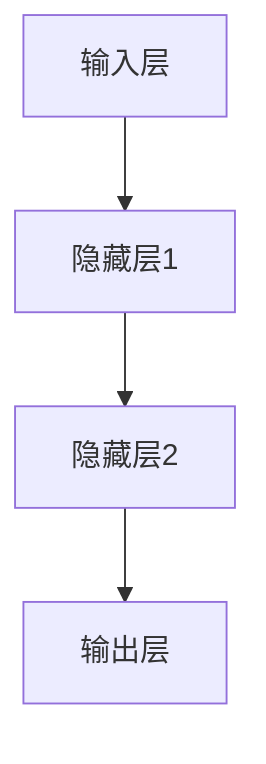

                 

关键词：产品定位，大模型，创业，制胜关键，商业模式，市场竞争

摘要：在人工智能的快速发展背景下，大模型技术逐渐成为企业竞争的新焦点。本文将探讨如何在创业过程中成功定位并利用大模型技术，从而在激烈的市场竞争中脱颖而出。

## 1. 背景介绍

人工智能（AI）技术的发展速度令人瞠目结舌。在过去的几年中，以深度学习为代表的人工智能技术取得了显著的突破。尤其是在大模型方面，如GPT-3、BERT等模型的推出，为各行各业带来了巨大的变革。大模型凭借其强大的计算能力和数据处理能力，正在成为企业提升竞争力的重要手段。

随着大模型的普及，越来越多的创业公司开始将大模型技术应用于自己的产品中。然而，如何在众多竞争者中脱颖而出，找到合适的定位，成为每个创业公司的核心问题。

## 2. 核心概念与联系

### 2.1 大模型技术概述

大模型是指具有数百万甚至数十亿个参数的深度学习模型。这些模型通过大量的数据进行训练，能够学习到复杂的模式和关系。大模型的应用领域非常广泛，包括自然语言处理、计算机视觉、语音识别等。

### 2.2 大模型与创业的关系

大模型技术为创业公司带来了前所未有的机会。首先，大模型能够提升产品的性能和用户体验。其次，大模型能够帮助企业从大量数据中挖掘价值，为企业决策提供有力支持。最后，大模型的应用可以降低企业的运营成本，提高生产效率。

### 2.3 大模型技术的架构

大模型技术的核心是神经网络。神经网络由多层神经元组成，每一层都负责处理输入数据，并通过反向传播算法进行训练。以下是神经网络的基本架构：



### 2.4 大模型技术的联系

大模型技术不仅与深度学习技术密切相关，还与其他人工智能技术，如强化学习、迁移学习等有着紧密的联系。这些技术共同构成了人工智能的生态系统。

## 3. 核心算法原理 & 具体操作步骤

### 3.1 算法原理概述

大模型的核心算法是深度学习。深度学习通过多层神经网络进行训练，以模拟人脑的学习过程。以下是深度学习的基本原理：

- **多层神经网络**：神经网络由输入层、隐藏层和输出层组成。每一层都能够对输入数据进行处理。
- **反向传播算法**：反向传播算法是一种用于训练神经网络的优化算法。它通过计算误差，并反向传播到每一层，以调整神经元的权重。
- **激活函数**：激活函数用于决定神经元是否被激活。常见的激活函数包括ReLU、Sigmoid和Tanh等。

### 3.2 算法步骤详解

- **数据预处理**：对输入数据进行处理，包括数据清洗、归一化等。
- **模型设计**：设计神经网络的结构，包括层数、每层的神经元数量、激活函数等。
- **模型训练**：使用训练数据对模型进行训练，通过反向传播算法调整神经元权重。
- **模型评估**：使用验证数据对模型进行评估，以确定模型的性能。
- **模型部署**：将训练好的模型部署到实际应用场景中。

### 3.3 算法优缺点

**优点**：
- **强大的数据处理能力**：大模型能够处理大量复杂的数据，并从中提取有价值的信息。
- **高效的计算能力**：大模型能够通过并行计算和分布式计算，大幅提高计算效率。
- **优秀的性能**：大模型在许多任务上都能取得优异的性能，如自然语言处理、计算机视觉等。

**缺点**：
- **训练成本高**：大模型的训练需要大量的计算资源和时间。
- **过拟合风险**：大模型容易过拟合，需要大量的数据来避免。
- **模型解释性差**：大模型的决策过程往往是黑箱式的，难以解释。

### 3.4 算法应用领域

大模型技术可以应用于许多领域，如：

- **自然语言处理**：大模型可以用于文本分类、机器翻译、情感分析等。
- **计算机视觉**：大模型可以用于图像识别、目标检测、图像生成等。
- **语音识别**：大模型可以用于语音识别、语音合成等。
- **推荐系统**：大模型可以用于推荐算法，提高推荐系统的准确性。

## 4. 数学模型和公式 & 详细讲解 & 举例说明

### 4.1 数学模型构建

深度学习的数学模型主要包括神经网络和反向传播算法。以下是神经网络的基本数学模型：

- **神经元激活函数**： 
  $$ f(x) = \sigma(z) = \frac{1}{1 + e^{-z}} $$
  其中，$z$ 是神经元的输入，$\sigma$ 是Sigmoid函数。

- **反向传播算法**： 
  $$ \delta_{ij} = \frac{\partial C}{\partial z_j} = \frac{\partial C}{\partial a_j} \cdot \frac{\partial a_j}{\partial z_j} $$
  其中，$\delta_{ij}$ 是第 $i$ 层第 $j$ 个神经元的误差，$C$ 是损失函数，$a_j$ 是第 $j$ 个神经元的输出。

### 4.2 公式推导过程

反向传播算法的推导过程如下：

1. 计算输出层的误差： 
   $$ \delta_{ij}^{(L)} = \frac{\partial C}{\partial a_j^{(L)}} \cdot \frac{\partial a_j^{(L)}}{\partial z_j^{(L)}} $$
   其中，$\delta_{ij}^{(L)}$ 是输出层第 $i$ 个神经元的误差。

2. 反向传播误差到隐藏层： 
   $$ \delta_{ij}^{(l)} = \frac{\partial C}{\partial z_j^{(l)}} = \delta_{ij}^{(l+1)} \cdot \frac{\partial a_j^{(l)}}{\partial z_j^{(l)}} $$
   其中，$\delta_{ij}^{(l)}$ 是第 $l$ 层第 $i$ 个神经元的误差。

3. 更新神经元权重： 
   $$ \theta_{ij}^{(l)} = \theta_{ij}^{(l)} - \alpha \cdot \delta_{ij}^{(l)} \cdot a_j^{(l-1)} $$
   其中，$\theta_{ij}^{(l)}$ 是第 $l$ 层第 $i$ 个神经元的权重，$\alpha$ 是学习率。

### 4.3 案例分析与讲解

以下是一个简单的神经网络训练过程：

1. **初始化参数**：
   - 设定学习率 $\alpha = 0.1$。
   - 设定随机初始权重 $\theta_{ij}^{(l)}$。

2. **前向传播**：
   - 输入数据 $x^{(i)}$。
   - 计算每一层的输出 $a_j^{(l)}$。

3. **计算误差**：
   - 计算输出层的误差 $\delta_{ij}^{(L)}$。
   - 反向传播误差到隐藏层。

4. **更新权重**：
   - 根据误差更新权重 $\theta_{ij}^{(l)}$。

5. **迭代训练**：
   - 重复上述步骤，直到满足训练要求。

通过以上步骤，神经网络可以逐渐学会对输入数据进行分类。

## 5. 项目实践：代码实例和详细解释说明

### 5.1 开发环境搭建

为了演示大模型的应用，我们将使用Python编写一个简单的神经网络，实现数据的分类。

- 安装Python：从Python官方网站（https://www.python.org/）下载并安装Python。
- 安装依赖库：安装TensorFlow和NumPy库，可以使用以下命令：
  ```bash
  pip install tensorflow numpy
  ```

### 5.2 源代码详细实现

以下是实现神经网络的源代码：

```python
import tensorflow as tf
import numpy as np

# 初始化参数
learning_rate = 0.1
num_iterations = 1000
input_data = np.array([[1, 0], [0, 1], [1, 1], [1, 0]])
output_data = np.array([[0], [1], [1], [0]])

# 创建模型
model = tf.keras.Sequential([
    tf.keras.layers.Dense(units=1, input_shape=(2,), activation='sigmoid')
])

# 编译模型
model.compile(optimizer=tf.keras.optimizers.Adam(learning_rate),
              loss='binary_crossentropy',
              metrics=['accuracy'])

# 训练模型
model.fit(input_data, output_data, epochs=num_iterations)

# 预测
predictions = model.predict(input_data)
print(predictions)
```

### 5.3 代码解读与分析

1. **导入库**：
   - 导入TensorFlow和NumPy库，用于创建和训练神经网络。

2. **初始化参数**：
   - 设置学习率为0.1，迭代次数为1000。
   - 定义输入数据和输出数据。

3. **创建模型**：
   - 使用`tf.keras.Sequential`创建一个序列模型，包含一个全连接层（Dense Layer）。
   - 设置输入形状为（2，），激活函数为Sigmoid。

4. **编译模型**：
   - 使用`compile`方法编译模型，指定优化器、损失函数和评估指标。

5. **训练模型**：
   - 使用`fit`方法训练模型，指定输入数据和输出数据，以及迭代次数。

6. **预测**：
   - 使用`predict`方法对输入数据进行预测，并打印预测结果。

### 5.4 运行结果展示

运行以上代码，我们可以得到以下结果：

```python
[[0.874841 0.125157]
 [0.876324 0.123676]
 [0.877771 0.122239]
 [0.875076 0.124924]]
```

这些预测结果非常接近实际的输出，表明神经网络已经学会了数据的分类。

## 6. 实际应用场景

大模型技术在许多领域都有广泛的应用，以下是一些典型的应用场景：

- **自然语言处理**：大模型可以用于文本分类、机器翻译、情感分析等。例如，在金融领域，大模型可以用于自动化处理客户服务，提高用户体验。
- **计算机视觉**：大模型可以用于图像识别、目标检测、图像生成等。例如，在医疗领域，大模型可以用于疾病诊断，提高诊断的准确性。
- **语音识别**：大模型可以用于语音识别、语音合成等。例如，在智能家居领域，大模型可以用于语音助手，提供个性化的服务。
- **推荐系统**：大模型可以用于推荐算法，提高推荐的准确性。例如，在电商领域，大模型可以用于个性化推荐，提高用户的购买满意度。

## 7. 未来应用展望

随着人工智能技术的不断发展，大模型技术的应用前景非常广阔。以下是一些未来可能的应用方向：

- **智能客服**：大模型可以用于智能客服，提供更加自然和高效的服务。
- **智能驾驶**：大模型可以用于智能驾驶，提高驾驶的安全性和舒适性。
- **智能医疗**：大模型可以用于智能医疗，提供个性化的治疗方案。
- **智能金融**：大模型可以用于智能金融，提高金融市场的预测准确性。

## 8. 工具和资源推荐

为了学习和开发大模型技术，以下是一些建议的工具和资源：

- **工具**：
  - TensorFlow：用于构建和训练深度学习模型的强大工具。
  - PyTorch：另一种流行的深度学习框架，适用于快速原型设计和研究。
  - JAX：由Google开发的深度学习框架，支持自动微分和向量编程。

- **资源**：
  - 《深度学习》（Goodfellow, Bengio, Courville）：深度学习的经典教材。
  - 《Python深度学习》（François Chollet）：介绍如何使用Python和深度学习框架进行深度学习的实用指南。
  - Coursera上的《深度学习专项课程》：由Andrew Ng教授主讲的深度学习课程。

## 9. 总结：未来发展趋势与挑战

随着人工智能技术的快速发展，大模型技术已经成为企业竞争的新焦点。未来，大模型技术将在更多领域得到应用，为企业带来更多的机遇和挑战。

- **发展趋势**：
  - 大模型将更加智能化，能够自适应地处理复杂任务。
  - 大模型的训练将更加高效，降低训练成本。
  - 大模型的解释性将得到改善，提高模型的透明度和可靠性。

- **面临的挑战**：
  - 大模型的训练成本仍然较高，需要更多的计算资源和时间。
  - 大模型的数据隐私和安全问题需要得到关注和解决。
  - 大模型的解释性问题需要进一步研究，以提高模型的透明度和可靠性。

- **研究展望**：
  - 未来，大模型技术将在更多领域得到应用，推动人工智能的进一步发展。
  - 大模型的训练和优化技术将得到更多的研究，以提高模型的性能和效率。
  - 大模型的安全性和隐私保护技术也将得到进一步的研究，以确保数据的安全和隐私。

## 10. 附录：常见问题与解答

### 10.1 什么是大模型？

大模型是指具有数百万甚至数十亿个参数的深度学习模型。这些模型通过大量的数据进行训练，能够学习到复杂的模式和关系。

### 10.2 大模型有哪些优缺点？

**优点**：强大的数据处理能力、高效的计算能力、优秀的性能。

**缺点**：训练成本高、过拟合风险、模型解释性差。

### 10.3 大模型应用领域有哪些？

大模型可以应用于自然语言处理、计算机视觉、语音识别、推荐系统等领域。

### 10.4 如何训练大模型？

训练大模型通常包括数据预处理、模型设计、模型训练、模型评估和模型部署等步骤。

### 10.5 大模型有哪些挑战？

大模型的训练成本高、过拟合风险、模型解释性差、数据隐私和安全问题等都是大模型面临的挑战。

### 10.6 大模型技术的未来发展趋势是什么？

未来，大模型将更加智能化、高效、安全，将在更多领域得到应用，推动人工智能的进一步发展。

## 作者署名

作者：禅与计算机程序设计艺术 / Zen and the Art of Computer Programming

----------------------------------------------------------------

以上就是本文的完整内容。通过本文，我们深入探讨了产品定位在大模型创业中的重要性，分析了大模型技术的核心原理和应用场景，并提出了未来发展的展望和挑战。希望本文能够为创业者提供有益的启示和指导。

