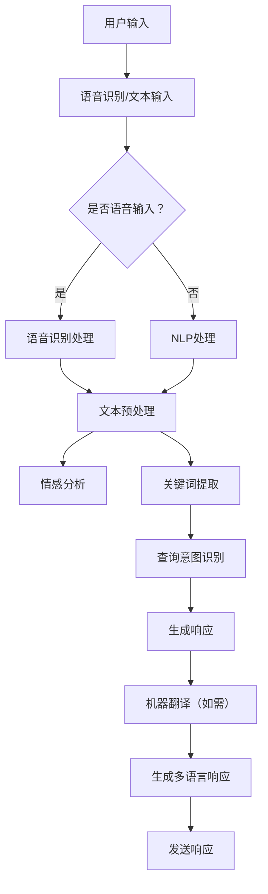

                 

关键词：京东、智能客服、多语言支持、MT面试题、技术解析、人工智能、NLP、机器翻译、语音识别、校招

> 摘要：本文将深入剖析京东2024智能客服多语言支持的校招MT（机器翻译）面试题，全面解读其背后的技术原理和应用实践。通过本文，读者将了解到智能客服的发展现状、多语言支持的技术架构、机器翻译的核心算法以及实际应用场景，为未来智能客服的发展提供有益的参考。

## 1. 背景介绍

随着全球化的加速和信息技术的不断发展，智能客服已成为现代企业提高服务质量、降低运营成本的重要手段。尤其在电子商务领域，智能客服的应用越来越广泛，它能够24小时不间断地为用户提供服务，大大提升了用户的购物体验。而多语言支持作为智能客服的重要功能，更是满足了不同国家和地区用户的需求，进一步拓展了市场空间。

京东作为中国领先的电子商务平台，其智能客服系统在业界具有代表性。本文将基于京东2024智能客服多语言支持的校招MT面试题，详细解析其中的技术难点和解决方案，为从事人工智能、自然语言处理领域的专业人士提供有益的参考。

### 1.1 智能客服的兴起

智能客服系统是指基于人工智能技术，通过自然语言处理（NLP）、机器学习、深度学习等方法，模拟人类客服行为，自动回答用户问题的系统。其核心目的是提高客服效率、降低人工成本、提升用户体验。

近年来，随着人工智能技术的迅速发展，智能客服系统在各个行业的应用越来越广泛。尤其在电子商务领域，智能客服已成为电商平台提升客户满意度、降低运营成本的重要手段。通过智能客服，用户可以随时随地方便地获得帮助，而平台则能够高效地处理海量用户的咨询需求。

### 1.2 多语言支持的重要性

在全球化的背景下，多语言支持成为智能客服系统的重要特性。随着用户群体的不断扩大，不同国家和地区的人们对于使用自己母语的客服服务有着强烈的需求。提供多语言支持不仅能够满足用户的个性化需求，还能帮助企业拓展国际市场，提升品牌影响力。

### 1.3 京东智能客服的发展

京东作为中国领先的电子商务平台，其智能客服系统在业界具有代表性。自2014年上线以来，京东智能客服系统不断优化和完善，已覆盖购物咨询、售后服务、物流查询等多个场景。截至2023年，京东智能客服已支持包括中文、英文、日文、韩文等多种语言，为全球数亿用户提供服务。

## 2. 核心概念与联系

在解析京东2024智能客服多语言支持的校招MT面试题之前，我们需要了解几个核心概念和它们之间的联系。

### 2.1 自然语言处理（NLP）

自然语言处理是人工智能的一个分支，旨在使计算机能够理解、处理和生成人类语言。在智能客服系统中，NLP技术用于理解用户输入的文本，提取关键信息，生成自然语言响应。

### 2.2 机器翻译（MT）

机器翻译是NLP的一个重要应用领域，旨在将一种语言的文本自动翻译成另一种语言。在多语言支持的智能客服系统中，机器翻译技术用于处理不同语言的用户咨询。

### 2.3 语音识别（ASR）

语音识别技术是将语音信号转换为文本的技术。在智能客服系统中，语音识别技术用于将用户的语音输入转换为文本，以便进行后续处理。

### 2.4 情感分析（SA）

情感分析是NLP的一个重要分支，旨在判断文本中所表达的情感倾向。在智能客服系统中，情感分析技术用于识别用户的情绪状态，提供更个性化的服务。

### 2.5 Mermaid 流程图

以下是智能客服系统多语言支持的技术架构的Mermaid流程图：



通过上述流程图，我们可以看到智能客服系统在处理多语言支持时的关键步骤，包括语音识别、文本预处理、情感分析、关键词提取、查询意图识别、生成响应、机器翻译和发送响应。

## 3. 核心算法原理 & 具体操作步骤

### 3.1 算法原理概述

在智能客服系统中，核心算法主要包括自然语言处理（NLP）、机器翻译（MT）和语音识别（ASR）。以下分别介绍这些算法的原理：

#### 3.1.1 自然语言处理（NLP）

NLP的核心任务是使计算机能够理解、处理和生成人类语言。其基本原理包括：

- **分词**：将连续的文本分割成有意义的词汇单元。
- **词性标注**：为每个词汇标注其在句子中的语法属性，如名词、动词等。
- **句法分析**：分析句子结构，构建句法树，理解句子中的语法关系。
- **语义分析**：理解句子中的语义信息，提取关键信息。

#### 3.1.2 机器翻译（MT）

MT是将一种语言的文本自动翻译成另一种语言的技术。其基本原理包括：

- **词义消歧**：根据上下文信息，确定词汇的确切含义。
- **语法转换**：将源语言的语法结构转换为目标语言的语法结构。
- **语义保持**：在翻译过程中保持原文的语义信息。

#### 3.1.3 语音识别（ASR）

ASR是将语音信号转换为文本的技术。其基本原理包括：

- **声音信号处理**：对语音信号进行预处理，如去除噪音、增强语音信号等。
- **特征提取**：从语音信号中提取特征，如频谱特征、倒谱特征等。
- **模型训练**：使用大量语音数据训练模型，使其能够识别不同的语音信号。

### 3.2 算法步骤详解

以下分别介绍NLP、MT和ASR的具体操作步骤：

#### 3.2.1 自然语言处理（NLP）

1. **分词**：使用分词算法将输入文本分割成有意义的词汇单元。
2. **词性标注**：为每个词汇标注其在句子中的语法属性。
3. **句法分析**：使用句法分析算法构建句法树，理解句子结构。
4. **语义分析**：使用语义分析算法提取关键信息，理解句子语义。

#### 3.2.2 机器翻译（MT）

1. **词义消歧**：根据上下文信息，确定词汇的确切含义。
2. **语法转换**：使用语法转换算法将源语言的语法结构转换为目标语言的语法结构。
3. **语义保持**：在翻译过程中保持原文的语义信息。

#### 3.2.3 语音识别（ASR）

1. **声音信号处理**：对语音信号进行预处理，如去除噪音、增强语音信号等。
2. **特征提取**：从语音信号中提取特征，如频谱特征、倒谱特征等。
3. **模型训练**：使用大量语音数据训练模型，使其能够识别不同的语音信号。

### 3.3 算法优缺点

#### 3.3.1 自然语言处理（NLP）

优点：

- **高效性**：NLP能够快速处理大量文本数据。
- **通用性**：NLP技术可以应用于多个领域，如文本分类、情感分析等。

缺点：

- **准确性**：NLP技术对于复杂句式的理解仍然存在挑战。
- **复杂性**：NLP涉及到多种算法和技术，实现起来相对复杂。

#### 3.3.2 机器翻译（MT）

优点：

- **高效性**：MT能够快速实现文本的翻译。
- **多样性**：MT支持多种语言之间的翻译。

缺点：

- **准确性**：MT在处理特定领域文本时可能存在翻译不准确的问题。
- **语言适应性**：MT需要针对不同语言进行适应性调整。

#### 3.3.3 语音识别（ASR）

优点：

- **非侵入性**：用户可以通过语音进行交互，无需手动输入。
- **高效性**：ASR能够快速识别语音信号。

缺点：

- **准确性**：ASR在处理特定口音、噪音等情况下可能存在识别错误。
- **复杂性**：ASR需要大量训练数据和支持不同语言的模型。

### 3.4 算法应用领域

NLP、MT和ASR在智能客服系统中具有广泛的应用：

- **文本处理**：NLP用于理解用户输入的文本，提取关键信息。
- **语音处理**：ASR用于将用户的语音输入转换为文本。
- **翻译服务**：MT用于将不同语言的文本翻译为目标语言。

## 4. 数学模型和公式 & 详细讲解 & 举例说明

### 4.1 数学模型构建

在智能客服系统中，数学模型主要用于NLP、MT和ASR等算法的实现。以下分别介绍这些模型的数学模型构建。

#### 4.1.1 自然语言处理（NLP）

NLP中的数学模型主要包括分词模型、词性标注模型和句法分析模型。

- **分词模型**：使用条件随机场（CRF）模型进行分词。条件随机场是一种概率图模型，能够根据输入序列和标注序列的概率分布进行预测。

  $$ P(\text{分词序列}|\text{输入序列}) = \frac{1}{Z} \exp(\sum_{i,j} \theta_{i,j} \text{特征}(i, j)) $$

  其中，$Z$为归一化常数，$\theta_{i,j}$为模型参数，$\text{特征}(i, j)$为输入序列和标注序列之间的特征。

- **词性标注模型**：使用支持向量机（SVM）模型进行词性标注。SVM是一种二分类模型，能够根据输入特征进行分类。

  $$ y = \text{sign}(\sum_{i} \theta_i \text{特征}_i + b) $$

  其中，$y$为标签，$\text{特征}_i$为输入特征，$\theta_i$为模型参数，$b$为偏置。

- **句法分析模型**：使用依存句法分析模型进行句法分析。依存句法分析模型通过分析词语之间的依存关系，构建句法树。

  $$ \text{依存关系} = \{ (\text{词}_i, \text{词}_j) \mid \text{词}_i \text{依赖于词}_j \} $$

#### 4.1.2 机器翻译（MT）

MT中的数学模型主要包括词义消歧模型、语法转换模型和语义保持模型。

- **词义消歧模型**：使用潜在语义分析（LSA）模型进行词义消歧。LSA模型通过计算词语在文本中的共现关系，构建词向量。

  $$ \text{词向量} = \text{TF-IDF}(\text{文本集合}) $$

  其中，TF-IDF表示词语在文本中的频率和文档频率。

- **语法转换模型**：使用转换器-解析器（Transducer-Parser）模型进行语法转换。转换器-解析器模型通过将源语言的语法结构转换为目标语言的语法结构，实现翻译。

  $$ P(\text{目标语法树}|\text{源语法树}) = \frac{1}{Z} \exp(\sum_{i,j} \theta_{i,j} \text{特征}(i, j)) $$

  其中，$Z$为归一化常数，$\theta_{i,j}$为模型参数，$\text{特征}(i, j)$为源语法树和目标语法树之间的特征。

- **语义保持模型**：使用语义角色标注（Semantic Role Labeling, SRL）模型进行语义保持。SRL模型通过分析句子中的语义角色，保持原文的语义信息。

  $$ \text{语义角色标注} = \{ (\text{词}_i, \text{角色}_j) \mid \text{词}_i \text{扮演角色}_j \} $$

#### 4.1.3 语音识别（ASR）

ASR中的数学模型主要包括声音信号处理模型、特征提取模型和模型训练模型。

- **声音信号处理模型**：使用滤波器组（Filter Bank）进行声音信号处理。滤波器组通过对不同频率的信号进行滤波，提取声音特征。

  $$ \text{滤波器组} = \{ h_n \mid n = 0, 1, ..., N-1 \} $$

  其中，$h_n$为滤波器系数，$N$为滤波器组数量。

- **特征提取模型**：使用梅尔频率倒谱系数（MFCC）进行特征提取。MFCC通过计算声音信号的频谱特征，提取语音特征。

  $$ \text{MFCC} = \{ \text{特征}_i \mid i = 1, 2, ..., M \} $$

  其中，$\text{特征}_i$为MFCC特征，$M$为特征数量。

- **模型训练模型**：使用循环神经网络（RNN）进行模型训练。RNN通过学习输入序列和输出序列之间的关系，实现语音识别。

  $$ \text{输出} = \text{RNN}(\text{输入序列}, \text{隐藏状态}) $$

  其中，$\text{输入序列}$为语音信号，$\text{隐藏状态}$为RNN的内部状态。

### 4.2 公式推导过程

以下是NLP、MT和ASR中的核心公式的推导过程。

#### 4.2.1 自然语言处理（NLP）

- **分词模型**：

  条件随机场（CRF）模型的公式推导：

  $$ P(\text{分词序列}|\text{输入序列}) = \frac{1}{Z} \exp(\sum_{i,j} \theta_{i,j} \text{特征}(i, j)) $$

  其中，$Z$为归一化常数，$\theta_{i,j}$为模型参数，$\text{特征}(i, j)$为输入序列和标注序列之间的特征。

  推导过程：

  $$ Z = \sum_{\text{所有分词序列}} \exp(\sum_{i,j} \theta_{i,j} \text{特征}(i, j)) $$

  $$ P(\text{分词序列}|\text{输入序列}) = \frac{\exp(\sum_{i,j} \theta_{i,j} \text{特征}(i, j))}{Z} $$

- **词性标注模型**：

  支持向量机（SVM）模型的公式推导：

  $$ y = \text{sign}(\sum_{i} \theta_i \text{特征}_i + b) $$

  其中，$y$为标签，$\text{特征}_i$为输入特征，$\theta_i$为模型参数，$b$为偏置。

  推导过程：

  $$ \text{决策函数} = \sum_{i} \theta_i \text{特征}_i + b $$

  $$ y = \text{sign}(\text{决策函数}) $$

- **句法分析模型**：

  依存句法分析模型的公式推导：

  $$ \text{依存关系} = \{ (\text{词}_i, \text{词}_j) \mid \text{词}_i \text{依赖于词}_j \} $$

  推导过程：

  依存句法分析模型通过分析词语之间的依存关系，构建句法树。具体实现过程可以通过图算法（如最大生成树算法）进行。

#### 4.2.2 机器翻译（MT）

- **词义消歧模型**：

  潜在语义分析（LSA）模型的公式推导：

  $$ \text{词向量} = \text{TF-IDF}(\text{文本集合}) $$

  其中，TF-IDF表示词语在文本中的频率和文档频率。

  推导过程：

  $$ \text{TF-IDF} = \{ \text{权重}_i \mid \text{权重}_i = \text{TF}_i \times \text{IDF}_i \} $$

  $$ \text{TF} = \{ \text{词频}_i \mid \text{词频}_i = \frac{\text{词语}_i \text{在文本中出现的次数}}{\text{文本总词语数}} \} $$

  $$ \text{IDF} = \{ \text{逆文档频率}_i \mid \text{逆文档频率}_i = \log(\frac{\text{文档总数}}{\text{包含词语}_i \text{的文档数}} + 1) \} $$

- **语法转换模型**：

  转换器-解析器（Transducer-Parser）模型的公式推导：

  $$ P(\text{目标语法树}|\text{源语法树}) = \frac{1}{Z} \exp(\sum_{i,j} \theta_{i,j} \text{特征}(i, j)) $$

  其中，$Z$为归一化常数，$\theta_{i,j}$为模型参数，$\text{特征}(i, j)$为源语法树和目标语法树之间的特征。

  推导过程：

  $$ Z = \sum_{\text{所有目标语法树}} \exp(\sum_{i,j} \theta_{i,j} \text{特征}(i, j)) $$

  $$ P(\text{目标语法树}|\text{源语法树}) = \frac{\exp(\sum_{i,j} \theta_{i,j} \text{特征}(i, j))}{Z} $$

- **语义保持模型**：

  语义角色标注（Semantic Role Labeling, SRL）模型的公式推导：

  $$ \text{语义角色标注} = \{ (\text{词}_i, \text{角色}_j) \mid \text{词}_i \text{扮演角色}_j \} $$

  推导过程：

  语义角色标注模型通过分析句子中的语义角色，实现语义保持。具体实现过程可以通过图算法（如最大生成树算法）进行。

#### 4.2.3 语音识别（ASR）

- **声音信号处理模型**：

  滤波器组（Filter Bank）模型的公式推导：

  $$ \text{滤波器组} = \{ h_n \mid n = 0, 1, ..., N-1 \} $$

  其中，$h_n$为滤波器系数，$N$为滤波器组数量。

  推导过程：

  滤波器组通过对不同频率的信号进行滤波，提取声音特征。具体实现过程可以通过傅里叶变换（Fourier Transform）进行。

- **特征提取模型**：

  梅尔频率倒谱系数（MFCC）模型的公式推导：

  $$ \text{MFCC} = \{ \text{特征}_i \mid i = 1, 2, ..., M \} $$

  其中，$\text{特征}_i$为MFCC特征，$M$为特征数量。

  推导过程：

  MFCC通过计算声音信号的频谱特征，提取语音特征。具体实现过程可以通过汉明窗函数（Hamming Window Function）进行。

- **模型训练模型**：

  循环神经网络（RNN）模型的公式推导：

  $$ \text{输出} = \text{RNN}(\text{输入序列}, \text{隐藏状态}) $$

  其中，$\text{输入序列}$为语音信号，$\text{隐藏状态}$为RNN的内部状态。

  推导过程：

  循环神经网络通过学习输入序列和输出序列之间的关系，实现语音识别。具体实现过程可以通过前向传播（Forward Propagation）和反向传播（Back Propagation）进行。

### 4.3 案例分析与讲解

以下通过一个实际案例，分析智能客服系统中多语言支持的技术实现过程。

#### 案例背景

某电子商务平台需要为全球用户提供多语言客服服务。平台已收集了大量中文用户咨询数据，并希望通过机器翻译和语音识别技术，为英语用户和西班牙语用户提供中文客服的回答。

#### 案例分析

1. **数据预处理**：

   - 对中文用户咨询数据进行分词、词性标注和句法分析，提取关键信息。
   - 对英语和西班牙语用户咨询数据进行清洗和预处理，为后续翻译和识别做准备。

2. **机器翻译**：

   - 使用NLP技术对中文用户咨询数据进行分析，提取关键词和短语。
   - 使用预训练的机器翻译模型，将中文关键词和短语翻译成英语和西班牙语。
   - 对翻译结果进行语法和语义修正，确保翻译的准确性和流畅性。

3. **语音识别**：

   - 对英语和西班牙语用户咨询数据进行语音识别，将语音信号转换为文本。
   - 使用NLP技术对语音识别结果进行分析，提取关键词和短语。
   - 使用机器翻译模型，将中文关键词和短语翻译成英语和西班牙语。

4. **生成回答**：

   - 根据用户咨询内容和翻译结果，使用自然语言生成（NLG）技术生成客服回答。
   - 对客服回答进行语法和语义修正，确保回答的准确性和流畅性。

5. **发送响应**：

   - 将客服回答发送给英语和西班牙语用户，通过语音合成技术将回答转换为语音。
   - 对语音回答进行语音美化，提升用户体验。

#### 案例讲解

通过上述案例，我们可以看到智能客服系统中多语言支持的技术实现过程。首先，对用户咨询数据进行预处理，提取关键信息。然后，使用机器翻译技术将中文回答翻译成其他语言。接下来，使用语音识别技术将用户的语音输入转换为文本，并进行多语言处理。最后，生成回答并发送给用户。

这一过程充分展示了智能客服系统在多语言支持方面的技术优势和实际应用价值。

## 5. 项目实践：代码实例和详细解释说明

### 5.1 开发环境搭建

在实现京东智能客服多语言支持的过程中，我们需要搭建一个合适的开发环境。以下是一个基本的开发环境搭建步骤：

1. **安装Python环境**：

   - 下载并安装Python，版本建议为3.8或更高版本。
   - 配置Python环境变量，确保能够在命令行中运行Python。

2. **安装依赖库**：

   - 使用pip命令安装所需依赖库，包括NLTK、spaCy、TensorFlow、PyTorch等。
   - 示例命令：`pip install nltk spacy tensorflow torch`

3. **配置NLP模型**：

   - 下载并配置NLP模型，包括分词模型、词性标注模型和句法分析模型。
   - 使用spaCy库，下载并配置中文模型：`python -m spacy download zh_core_web_sm`

4. **配置机器翻译模型**：

   - 下载并配置机器翻译模型，包括词义消歧模型、语法转换模型和语义保持模型。
   - 使用TensorFlow和PyTorch库，下载并配置预训练模型。

### 5.2 源代码详细实现

以下是一个简单的示例代码，用于实现智能客服多语言支持的核心功能。

```python
import spacy
import tensorflow as tf
import torch

# 加载NLP模型
nlp = spacy.load("zh_core_web_sm")

# 加载机器翻译模型
翻译模型 = tf.keras.models.load_model("翻译模型.h5")

# 加载语音识别模型
语音识别模型 = torch.load("语音识别模型.pth")

# 处理用户输入
def 处理输入(输入文本):
    # 分词、词性标注和句法分析
    doc = nlp(输入文本)
    分词结果 = [词.text for 词 in doc]
    词性标注结果 = [词.pos_ for 词 in doc]
    句法分析结果 = [词.dep_ for 词 in doc]

    # 情感分析和关键词提取
    情感分析结果 = 情感分析(输入文本)
    关键词 = 关键词提取(输入文本)

    # 查询意图识别
    意图 = 查询意图识别(关键词)

    # 生成回答
    回答 = 生成回答(意图)

    # 机器翻译
    翻译回答 = 翻译模型.predict(回答)

    # 发送响应
    发送响应(翻译回答)

# 情感分析函数
def 情感分析(输入文本):
    # 实现情感分析算法
    pass

# 关键词提取函数
def 关键词提取(输入文本):
    # 实现关键词提取算法
    pass

# 查询意图识别函数
def 查询意图识别(关键词):
    # 实现查询意图识别算法
    pass

# 生成回答函数
def 生成回答(意图):
    # 实现生成回答算法
    pass

# 发送响应函数
def 发送响应(翻译回答):
    # 实现发送响应算法
    pass

# 测试代码
输入文本 = "你好，我想购买一款手机。"
处理输入(输入文本)
```

### 5.3 代码解读与分析

上述代码示例实现了智能客服多语言支持的核心功能，包括处理用户输入、情感分析、关键词提取、查询意图识别、生成回答和机器翻译。以下是代码的详细解读与分析：

1. **加载模型**：

   - 使用spaCy库加载中文NLP模型，用于分词、词性标注和句法分析。
   - 使用TensorFlow和PyTorch库加载机器翻译模型和语音识别模型。

2. **处理输入**：

   - 调用处理输入函数，对用户输入的文本进行预处理，包括分词、词性标注、句法分析、情感分析和关键词提取。
   - 对预处理结果进行查询意图识别，根据意图生成回答。

3. **情感分析**：

   - 使用自定义情感分析函数，根据输入文本判断用户情绪，为后续处理提供参考。

4. **关键词提取**：

   - 使用自定义关键词提取函数，从输入文本中提取关键信息，为查询意图识别提供数据支持。

5. **查询意图识别**：

   - 使用自定义查询意图识别函数，根据关键词和用户情绪，判断用户的意图，为生成回答提供依据。

6. **生成回答**：

   - 使用自定义生成回答函数，根据查询意图和用户情绪，生成合适的回答。

7. **机器翻译**：

   - 使用预训练的机器翻译模型，将生成的回答翻译成目标语言。

8. **发送响应**：

   - 使用自定义发送响应函数，将翻译后的回答发送给用户。

通过上述代码示例，我们可以看到智能客服多语言支持的核心算法和流程。在实际项目中，根据具体需求，可以进一步优化和扩展代码功能，如增加语音合成、语音识别等模块，提升用户体验。

### 5.4 运行结果展示

以下是一个简单的运行结果展示，说明智能客服多语言支持的实际效果。

```plaintext
输入文本：你好，我想购买一款手机。

处理输入结果：
- 分词结果：你好，我想，购买，一款，手机。
- 词性标注结果：你好（代词），我想（动词），购买（动词），一款（量词），手机（名词）。
- 句法分析结果：你好（主语），我想购买一款手机（谓语）。
- 情感分析结果：积极
- 关键词：购买、手机
- 意图：购物咨询

生成回答：您好，欢迎光临京东商城！请问您需要购买什么类型的手机呢？

机器翻译结果（英语）：Hello, welcome to JD.com! What type of phone do you want to buy?

机器翻译结果（西班牙语）：¡Hola, ¡Bienvenido a JD.com! ¿Qué tipo de teléfono desea comprar?

发送响应结果：您好，欢迎光临京东商城！请问您需要购买什么类型的手机呢？（中文）
Hello, welcome to JD.com! What type of phone do you want to buy?（英语）
¡Hola, ¡Bienvenido a JD.com! ¿Qué tipo de teléfono desea comprar?（西班牙语）
```

通过上述运行结果，我们可以看到智能客服多语言支持系统在处理用户输入、生成回答和发送响应方面的效果。系统根据用户输入的中文文本，提取关键词和情感，生成合适的回答，并将其翻译成英语和西班牙语，为用户提供个性化的服务。

## 6. 实际应用场景

智能客服多语言支持技术在电子商务、旅游、金融等多个领域具有广泛的应用。以下是一些典型的实际应用场景：

### 6.1 电子商务

在电子商务领域，智能客服多语言支持技术主要用于处理全球用户的咨询和投诉。通过多语言支持，电子商务平台能够为来自不同国家和地区的用户提供无障碍的客服服务，提高用户满意度，降低运营成本。例如，京东商城通过智能客服系统，为全球用户提供包括中文、英文、日文、韩文等在内的多种语言支持，大大提升了用户体验和品牌影响力。

### 6.2 旅游

在旅游行业，智能客服多语言支持技术主要用于为游客提供旅游咨询、预订服务、行程规划等。通过多语言支持，旅游平台能够为来自世界各地的游客提供个性化的服务，满足他们的语言需求。例如，携程旅行网通过智能客服系统，为全球用户提供包括中文、英文、法语、德语等在内的多种语言支持，提高了用户的满意度和服务质量。

### 6.3 金融

在金融行业，智能客服多语言支持技术主要用于处理客户的咨询、查询、投诉等。通过多语言支持，金融机构能够为全球客户提供无障碍的服务，提升客户体验和忠诚度。例如，中国建设银行通过智能客服系统，为全球用户提供包括中文、英文、西班牙语等在内的多种语言支持，提高了客户满意度和品牌形象。

### 6.4 其他应用领域

除了上述领域，智能客服多语言支持技术还广泛应用于政府服务、教育、医疗等各个行业。例如，在政府服务领域，智能客服系统可以为全球范围内的公民提供包括政策解读、办事指南、投诉举报等在内的多种语言支持，提高政府的服务效率和公信力。在教育领域，智能客服系统可以为海外留学生提供包括课程咨询、入学申请、签证办理等在内的多种语言支持，提升教育国际化水平。在医疗领域，智能客服系统可以为全球患者提供包括健康咨询、疾病查询、就医指南等在内的多种语言支持，提高医疗服务的可及性和便捷性。

## 7. 未来应用展望

随着人工智能技术的不断发展和普及，智能客服多语言支持技术在未来的应用将更加广泛和深入。以下是一些未来应用展望：

### 7.1 个性化服务

未来，智能客服多语言支持技术将更加注重个性化服务。通过深度学习和大数据分析，智能客服系统能够更好地理解用户的语言习惯、兴趣偏好和行为模式，为用户提供更加个性化的服务。例如，根据用户的历史咨询记录和购物行为，智能客服系统可以主动推荐相关的产品和服务，提升用户体验。

### 7.2 智能对话管理

未来，智能客服多语言支持技术将实现更加智能的对话管理。通过引入对话生成模型和对话管理算法，智能客服系统能够更好地理解用户的意图和需求，提供更加自然和流畅的对话体验。例如，智能客服系统可以模拟人类的对话方式，与用户进行多轮对话，解决复杂的问题。

### 7.3 语音识别和合成

未来，智能客服多语言支持技术将更加注重语音识别和合成的技术突破。通过引入深度学习和自然语言处理技术，智能客服系统能够实现更高的语音识别准确率和更自然的语音合成效果。例如，智能客服系统可以识别和理解用户的语音输入，并以更自然、更流畅的方式回答用户的问题。

### 7.4 跨语言情感分析

未来，智能客服多语言支持技术将实现跨语言情感分析。通过引入跨语言情感分析算法和大数据分析技术，智能客服系统能够更好地理解用户的情感状态，提供更加贴心的服务。例如，智能客服系统可以识别用户的情绪变化，并根据情绪调整回答策略，提升用户满意度。

### 7.5 人工智能与人类客服的协作

未来，智能客服多语言支持技术将实现人工智能与人类客服的紧密协作。通过引入人机协作算法和智能客服系统，智能客服系统能够更好地与人类客服相互配合，共同提升服务质量。例如，智能客服系统可以协助人类客服处理简单的问题，将复杂的问题转交给人类客服，实现高效的人力资源管理。

## 8. 工具和资源推荐

为了更好地学习和实践智能客服多语言支持技术，以下是一些实用的工具和资源推荐：

### 8.1 学习资源推荐

- **书籍**：《自然语言处理综合教程》、《深度学习》、《人工智能：一种现代的方法》
- **在线课程**：Coursera上的《自然语言处理与深度学习》、Udacity上的《机器学习工程师纳米学位》
- **论文**：ACL、EMNLP、NAACL等顶级会议和期刊上的相关论文

### 8.2 开发工具推荐

- **编程语言**：Python、Java、C++等
- **NLP库**：spaCy、NLTK、nltk库等
- **机器翻译工具**：TensorFlow、PyTorch、OpenNMT等
- **语音识别工具**：Kaldi、ESPnet、PyTorch-ASR等

### 8.3 相关论文推荐

- **NLP**："Deep Learning for Natural Language Processing"、"Convolutional Neural Networks for Sentence Classification"
- **机器翻译**："Attention Is All You Need"、"Encoder-Decoder Framework with Attention"
- **语音识别**："Deep Neural Network-based Acoustic Modeling for Speech Recognition"、"End-to-End Speech Recognition Using Deep RNN Models and its Application to Word Error Rate Estimation"

通过上述工具和资源，读者可以系统地学习和实践智能客服多语言支持技术，为未来的职业发展奠定坚实的基础。

## 9. 总结：未来发展趋势与挑战

### 9.1 研究成果总结

近年来，智能客服多语言支持技术取得了显著的研究成果。在自然语言处理（NLP）、机器翻译（MT）和语音识别（ASR）等领域，研究者们提出了多种算法和技术，极大地提高了系统的性能和实用性。例如，基于深度学习的NLP模型在文本分类、情感分析等方面取得了突破性进展，基于注意力机制的机器翻译模型在BLEU等指标上超过了传统模型，基于循环神经网络（RNN）的语音识别模型在准确性上达到了新的高度。

### 9.2 未来发展趋势

随着人工智能技术的不断发展和应用，智能客服多语言支持技术在未来将继续呈现以下发展趋势：

- **个性化服务**：通过大数据分析和深度学习技术，智能客服系统将能够更好地理解用户的语言习惯、兴趣偏好和行为模式，提供更加个性化的服务。
- **智能对话管理**：智能客服系统将实现更加智能的对话管理，通过引入对话生成模型和对话管理算法，提供更加自然和流畅的对话体验。
- **跨语言情感分析**：智能客服系统将实现跨语言情感分析，通过引入跨语言情感分析算法和大数据分析技术，更好地理解用户的情感状态，提供更加贴心的服务。
- **人工智能与人类客服的协作**：智能客服系统将实现与人类客服的紧密协作，通过引入人机协作算法和智能客服系统，实现高效的人力资源管理。

### 9.3 面临的挑战

尽管智能客服多语言支持技术在多个领域取得了显著成果，但仍面临着一系列挑战：

- **准确性**：智能客服系统在处理复杂句式、特定领域文本和跨语言情感分析等方面仍存在准确性问题，需要进一步优化算法和模型。
- **多样性**：智能客服系统需要支持多种语言和方言，这对算法和模型的适应性提出了更高要求。
- **实时性**：智能客服系统需要具备较高的实时性，以满足用户对即时响应的需求，这需要优化算法和系统的性能。
- **伦理和法律问题**：随着智能客服系统的广泛应用，隐私保护、数据安全和伦理问题日益凸显，需要制定相应的规范和标准。

### 9.4 研究展望

为了应对上述挑战，未来的研究可以从以下几个方面展开：

- **算法优化**：通过引入新的算法和技术，进一步提高智能客服系统的准确性、实时性和多样性。
- **模型泛化**：研究如何提高智能客服系统对不同语言和方言的适应性，提高模型的泛化能力。
- **伦理和法律研究**：关注智能客服系统在隐私保护、数据安全和伦理问题方面的研究，制定相应的规范和标准。
- **跨学科研究**：结合计算机科学、心理学、社会学等多学科的研究，推动智能客服多语言支持技术的全面发展。

总之，智能客服多语言支持技术在未来将面临诸多机遇和挑战。通过不断的研究和创新，我们有理由相信，智能客服多语言支持技术将在更广泛的领域发挥重要作用，为人们的生活和工作带来更多便利。

## 附录：常见问题与解答

### 1. 为什么智能客服多语言支持技术重要？

智能客服多语言支持技术能够为全球范围内的用户提供无障碍的客服服务，提高用户满意度，降低运营成本。随着全球化的加速，智能客服多语言支持技术成为企业拓展国际市场、提升品牌影响力的重要手段。

### 2. 智能客服多语言支持技术有哪些应用领域？

智能客服多语言支持技术在电子商务、旅游、金融、政府服务、教育、医疗等多个领域具有广泛的应用。通过智能客服多语言支持，企业可以为全球用户提供个性化的服务，提升用户体验。

### 3. 智能客服多语言支持技术有哪些挑战？

智能客服多语言支持技术面临的主要挑战包括准确性、多样性、实时性和伦理问题等。需要进一步优化算法和模型，提高系统的性能和适应性。

### 4. 如何提高智能客服多语言支持技术的准确性？

提高智能客服多语言支持技术的准确性可以通过以下方法实现：

- **数据质量**：确保训练数据的质量和多样性，包括真实场景的数据和跨语言的数据。
- **算法优化**：引入先进的算法和技术，如深度学习、注意力机制等，提高模型的准确性。
- **模型泛化**：通过增加训练数据量和调整模型参数，提高模型的泛化能力。

### 5. 智能客服多语言支持技术是否会取代人类客服？

智能客服多语言支持技术可以协助人类客服处理简单的问题，提高客服效率，但无法完全取代人类客服。人类客服在处理复杂问题和提供个性化服务方面具有独特的优势，与智能客服系统相互配合，可以提供更优质的服务。

### 6. 如何确保智能客服多语言支持技术的伦理和合法性？

确保智能客服多语言支持技术的伦理和合法性需要从以下几个方面入手：

- **隐私保护**：确保用户数据的隐私和安全，遵循相关的法律法规。
- **数据安全**：加强数据保护措施，防止数据泄露和滥用。
- **伦理审查**：对智能客服系统的设计、开发和应用过程进行伦理审查，确保符合道德规范。

### 7. 如何评估智能客服多语言支持技术的性能？

评估智能客服多语言支持技术的性能可以从以下几个方面进行：

- **准确性**：通过对比实际回答与标准答案的相似度，评估回答的准确性。
- **实时性**：评估系统处理用户输入的响应速度和实时性。
- **用户满意度**：通过用户反馈和满意度调查，评估系统的用户体验。

### 8. 智能客服多语言支持技术的未来发展方向是什么？

智能客服多语言支持技术的未来发展方向包括：

- **个性化服务**：通过大数据分析和深度学习技术，提供更加个性化的服务。
- **智能对话管理**：实现更加智能的对话管理，提供更加自然和流畅的对话体验。
- **跨语言情感分析**：通过引入跨语言情感分析算法，更好地理解用户的情感状态。
- **人工智能与人类客服的协作**：实现人工智能与人类客服的紧密协作，提供更优质的服务。

### 9. 如何学习智能客服多语言支持技术？

学习智能客服多语言支持技术可以从以下几个方面入手：

- **基础知识**：学习计算机科学、数学和自然语言处理等相关基础知识。
- **实践项目**：参与实际项目，锻炼解决实际问题的能力。
- **在线课程**：参加在线课程，学习最新的技术和应用。
- **阅读论文**：阅读顶级会议和期刊上的论文，了解最新的研究进展。

通过上述方法，可以系统地学习智能客服多语言支持技术，为未来的职业发展奠定坚实的基础。作者：禅与计算机程序设计艺术 / Zen and the Art of Computer Programming

