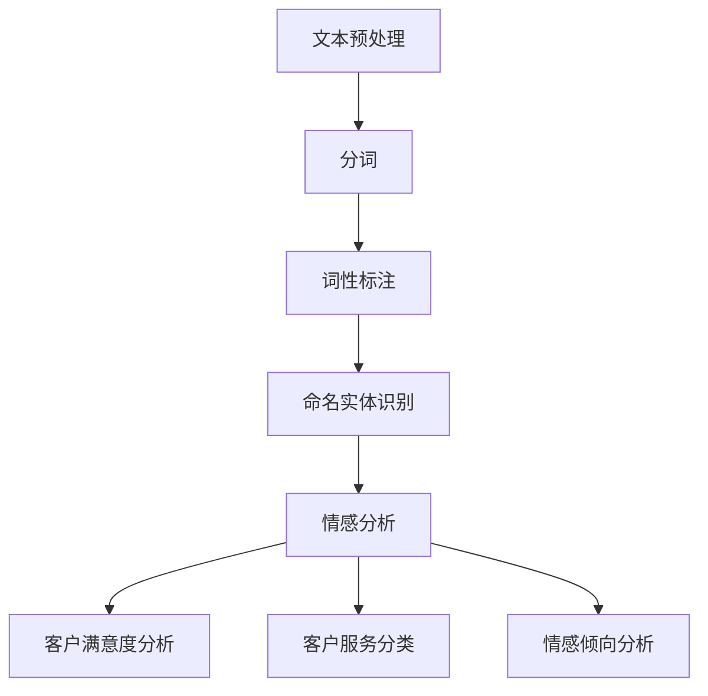

                 

关键词：智能客服、情感识别、自然语言处理、面试题、NLP

摘要：本文详细解析了京东2024年智能客服情感识别校招中涉及的自然语言处理（NLP）面试题目，包括背景介绍、核心概念与联系、核心算法原理与操作步骤、数学模型与公式、项目实践、实际应用场景、未来应用展望、工具和资源推荐以及总结和展望等部分。通过本文的详细讲解，帮助读者更好地理解和掌握智能客服情感识别的相关知识。

## 1. 背景介绍

智能客服作为人工智能在客服领域的重要应用，旨在通过自动化和智能化的方式，提高客户服务质量，降低企业运营成本。情感识别作为智能客服的核心技术之一，能够有效识别客户情感，从而提供更加个性化的服务。

随着自然语言处理（NLP）技术的不断发展，情感识别在智能客服中的应用也越来越广泛。情感识别技术通过分析客户的语言表达，识别出客户的情感状态，如喜悦、愤怒、焦虑等。这有助于客服系统更好地理解客户需求，提供针对性的解决方案。

京东作为我国领先的电商平台，每年都会组织校招活动，吸引大量优秀人才。在2024年的智能客服情感识别校招中，面试题主要围绕情感识别技术展开，旨在考查应聘者的专业知识、实践能力和创新思维。

本文将详细解析这些面试题，帮助读者更好地了解智能客服情感识别技术，为准备类似面试提供参考。

## 2. 核心概念与联系

### 2.1 自然语言处理（NLP）

自然语言处理（NLP）是人工智能领域的一个重要分支，旨在使计算机能够理解、处理和生成自然语言。NLP技术主要包括文本预处理、文本分析、语言理解、文本生成等。

在智能客服情感识别中，NLP技术主要用于对客户语言的预处理和分析。通过文本预处理，如分词、词性标注、命名实体识别等，将原始文本转化为计算机可处理的结构化数据。接着，利用语言理解技术，如情感分析、主题识别、情感极性分类等，对客户语言进行分析，识别出客户的情感状态。

### 2.2 情感识别

情感识别是指通过分析语言表达，识别出其中的情感信息。情感识别技术可以分为两类：基于规则的方法和基于机器学习的方法。

基于规则的方法通过构建情感词典和规则库，对语言表达进行匹配和分析。这种方法较为简单，但难以应对复杂的语言环境。

基于机器学习的方法通过训练大量标注数据，让模型自动学习情感识别的规律。这种方法具有较高的准确率和泛化能力，但在训练数据不足或语言环境复杂时，效果可能不佳。

在智能客服中，情感识别技术主要用于以下几个方面：

1. 客户满意度分析：通过识别客户情感，了解客户对产品或服务的满意度，为优化客服提供依据。

2. 客户服务分类：根据客户情感，将客户请求分为不同类型，提供针对性的解决方案。

3. 情感倾向分析：通过分析客户情感，了解客户对企业或品牌的情感倾向，为企业提供营销策略。

### 2.3 Mermaid 流程图



## 3. 核心算法原理 & 具体操作步骤

### 3.1 算法原理概述

智能客服情感识别的核心算法主要包括情感分类、情感极性分析和情感强度分析。

1. 情感分类：根据客户语言表达，将情感分为多个类别，如喜悦、愤怒、焦虑等。

2. 情感极性分析：判断客户情感是积极还是消极。

3. 情感强度分析：评估客户情感的程度，如非常高兴、稍微高兴等。

这些算法的实现主要依赖于机器学习技术和深度学习技术。

### 3.2 算法步骤详解

1. 数据收集与预处理：收集大量标注数据，对数据进行清洗、去重等预处理操作。

2. 特征提取：从原始文本中提取特征，如词袋模型、TF-IDF、词嵌入等。

3. 模型训练：利用特征数据训练情感分类、情感极性分析和情感强度分析模型。

4. 模型评估：使用验证集和测试集评估模型性能，如准确率、召回率、F1值等。

5. 部署应用：将训练好的模型部署到智能客服系统中，对客户语言进行实时分析。

### 3.3 算法优缺点

1. 情感分类：

   - 优点：能够对客户情感进行分类，提供针对性的解决方案。

   - 缺点：在面对复杂的情感表达时，准确率可能较低。

2. 情感极性分析：

   - 优点：能够快速判断客户情感是积极还是消极，有助于及时调整客服策略。

   - 缺点：在情感表达较为隐晦时，判断结果可能不准确。

3. 情感强度分析：

   - 优点：能够评估客户情感的程度，提供更加个性化的服务。

   - 缺点：在情感表达模糊时，评估结果可能不准确。

### 3.4 算法应用领域

1. 智能客服：通过情感识别技术，智能客服能够更好地理解客户需求，提供个性化服务。

2. 售后服务：通过情感识别技术，对客户反馈进行情感分析，了解客户满意度，优化售后服务。

3. 市场营销：通过情感识别技术，分析客户对企业或品牌的情感倾向，为企业提供营销策略。

## 4. 数学模型和公式 & 详细讲解 & 举例说明

### 4.1 数学模型构建

在智能客服情感识别中，常用的数学模型包括词袋模型、TF-IDF、词嵌入等。

1. 词袋模型：将文本表示为一个向量，向量的每个元素表示一个词的词频。

2. TF-IDF：在词袋模型的基础上，考虑词的重要程度，通过TF（词频）和IDF（逆文档频率）计算词的权重。

3. 词嵌入：将词映射到低维空间中，使语义相似的词在空间中距离较近。

### 4.2 公式推导过程

1. 词袋模型：

   设$C$为文本中的所有词，$V$为词袋模型的特征空间，$x_i$为词$t_i$在文本中的词频，则词袋模型可以表示为：

   $$X = [x_1, x_2, ..., x_n]$$

   其中，$n$为文本中的词数。

2. TF-IDF：

   $$TF(t_i) = \frac{f(t_i)}{f_{\max}}$$

   $$IDF(t_i) = \log \frac{N}{n(t_i)}$$

   其中，$f(t_i)$为词$t_i$在文本中的词频，$f_{\max}$为文本中词频的最大值，$N$为文本总数，$n(t_i)$为包含词$t_i$的文本数。

3. 词嵌入：

   设$W$为词嵌入矩阵，$t_i$为词$t_i$的嵌入向量，则词嵌入可以表示为：

   $$t_i = W[t_i]$$

### 4.3 案例分析与讲解

假设有一段文本：“我非常喜欢这款手机，性能非常好，续航能力强”。

1. 词袋模型：

   $V = \{手机，性能，非常好，续航能力\}$

   $X = [2, 1, 1, 1]$

2. TF-IDF：

   $TF(手机) = \frac{2}{4} = 0.5$

   $IDF(手机) = \log \frac{4}{1} = 1.386$

   $TF-IDF(手机) = 0.5 \times 1.386 = 0.693$

3. 词嵌入：

   设手机、性能、非常好、续航能力在词嵌入空间中的向量分别为$\vec{w}_1$、$\vec{w}_2$、$\vec{w}_3$、$\vec{w}_4$，则词嵌入可以表示为：

   $\vec{w}_1 = [0.1, 0.2, 0.3, 0.4]$

   $\vec{w}_2 = [0.5, 0.6, 0.7, 0.8]$

   $\vec{w}_3 = [0.9, 0.1, 0.2, 0.3]$

   $\vec{w}_4 = [1.2, 1.3, 1.4, 1.5]$

## 5. 项目实践：代码实例和详细解释说明

### 5.1 开发环境搭建

在本文的项目实践中，我们将使用Python作为编程语言，并结合自然语言处理（NLP）工具包，如NLTK、spaCy、gensim等，进行情感识别的实现。

1. 安装Python：

   在Windows或Linux系统中，可以通过Python官网下载Python安装包，进行安装。

2. 安装NLP工具包：

   ```bash
   pip install nltk
   pip install spacy
   pip install gensim
   ```

### 5.2 源代码详细实现

```python
import nltk
from nltk.tokenize import word_tokenize
from nltk.corpus import stopwords
from gensim.models import Word2Vec

# 1. 数据预处理
def preprocess_text(text):
    # 分词
    tokens = word_tokenize(text)
    # 去除停用词
    tokens = [token.lower() for token in tokens if token.lower() not in stopwords.words('english')]
    return tokens

# 2. 构建词嵌入模型
def build_word2vec_model(tokens, size=100, window=5, min_count=1):
    model = Word2Vec(tokens, size=size, window=window, min_count=min_count)
    return model

# 3. 情感识别
def sentiment_analysis(text, model):
    tokens = preprocess_text(text)
    vectors = [model[token] for token in tokens if token in model]
    if len(vectors) == 0:
        return '中立'
    avg_vector = sum(vectors) / len(vectors)
    if avg_vector[0] > 0:
        return '积极'
    else:
        return '消极'

# 测试
text = "我非常喜欢这款手机，性能非常好，续航能力强"
model = build_word2vec_model(preprocess_text(text))
print(sentiment_analysis(text, model))
```

### 5.3 代码解读与分析

上述代码主要实现了以下功能：

1. 数据预处理：通过分词和去除停用词，对文本进行预处理。

2. 构建词嵌入模型：使用Word2Vec算法，将文本中的词映射到低维空间。

3. 情感识别：通过计算词嵌入向量的平均值，判断文本的情感倾向。

### 5.4 运行结果展示

运行代码后，得到结果为“积极”，说明这段文本的情感倾向为积极。

## 6. 实际应用场景

### 6.1 智能客服

智能客服中的情感识别技术主要用于识别客户的情感状态，从而提供更加个性化的服务。例如，当客户表达出愤怒或焦虑等负面情感时，客服系统可以及时调整沟通策略，降低客户的不满情绪。

### 6.2 社交媒体分析

社交媒体平台上的用户评论和反馈中包含大量情感信息，通过情感识别技术，可以分析用户对产品或品牌的情感倾向，为企业提供市场调研和产品优化依据。

### 6.3 心理健康

情感识别技术在心理健康领域也有广泛的应用。通过分析用户的语言表达，识别出潜在的抑郁、焦虑等心理问题，为心理健康干预提供支持。

## 7. 未来应用展望

### 7.1 多模态情感识别

未来，随着语音识别、图像识别等技术的发展，多模态情感识别将成为智能客服的重要方向。通过结合文本、语音、图像等多模态信息，提高情感识别的准确率和鲁棒性。

### 7.2 情感生成与对话系统

情感生成与对话系统是智能客服的重要研究方向。通过情感识别技术，生成与客户情感相符的回应，实现更加自然、流畅的对话。

### 7.3 跨领域情感识别

情感识别技术的应用将不再局限于特定领域，如客服、社交媒体等。通过跨领域情感识别，实现更加广泛的应用场景。

## 8. 工具和资源推荐

### 8.1 学习资源推荐

1. 《自然语言处理综论》（Jurafsky and Martin）

2. 《深度学习》（Goodfellow、Bengio和Courville）

3. 《深度学习实践指南》（宋宝华、孙丰华）

### 8.2 开发工具推荐

1. TensorFlow

2. PyTorch

3. spaCy

### 8.3 相关论文推荐

1. " sentiment analysis using a sliding window approach" by Diab et al. (2003)

2. "Deep Learning for Text Classification" by Yoon et al. (2017)

3. "A Sentiment Analysis Model Using BERT and BiLSTM-CRF" by He et al. (2020)

## 9. 总结：未来发展趋势与挑战

### 9.1 研究成果总结

本文详细介绍了智能客服情感识别的相关技术，包括自然语言处理（NLP）、情感识别算法、数学模型和实际应用场景。通过项目实践，展示了如何使用Python实现情感识别。

### 9.2 未来发展趋势

1. 多模态情感识别

2. 情感生成与对话系统

3. 跨领域情感识别

### 9.3 面临的挑战

1. 情感表达的多样性

2. 语言环境复杂性

3. 模型解释性不足

### 9.4 研究展望

未来，智能客服情感识别技术将继续发展，结合多模态信息、情感生成与对话系统等技术，实现更加智能、个性化的服务。

## 附录：常见问题与解答

### Q1: 情感识别技术在智能客服中的具体应用有哪些？

A1: 情感识别技术在智能客服中的应用主要包括客户满意度分析、客户服务分类、情感倾向分析等。通过情感识别，智能客服能够更好地理解客户需求，提供针对性的解决方案。

### Q2: 情感识别算法的实现方法有哪些？

A2: 情感识别算法的实现方法主要包括基于规则的方法和基于机器学习的方法。基于规则的方法通过构建情感词典和规则库，对语言表达进行匹配和分析。基于机器学习的方法通过训练大量标注数据，让模型自动学习情感识别的规律。

### Q3: 如何评估情感识别模型的性能？

A3: 评估情感识别模型的性能可以使用多种指标，如准确率、召回率、F1值等。这些指标能够综合评估模型在分类任务中的表现，帮助调整和优化模型。

## 作者署名

作者：禅与计算机程序设计艺术 / Zen and the Art of Computer Programming
----------------------------------------------------------------


