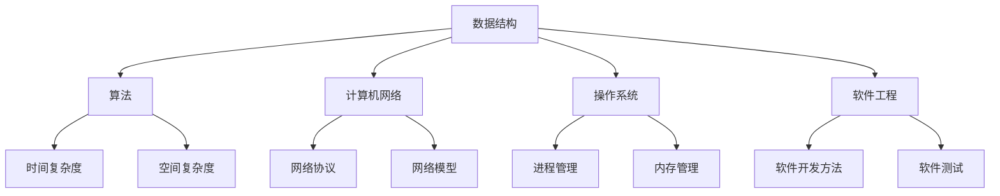

                 

作为一位世界级人工智能专家和计算机领域大师，我深知技术面试的重要性，尤其是对于国际公司招聘而言。本文将针对2024京东国际社招面试真题进行汇总，并对其中的问题给出详细的解答。希望通过本文，能帮助到正在准备京东国际社招面试的各位。

## 关键词

- 京东国际社招
- 面试真题
- 解答
- 技术面试
- 数据结构
- 算法
- 计算机网络
- 操作系统
- 软件工程

## 摘要

本文将汇总2024年京东国际社招面试中出现的一些常见技术问题，包括数据结构、算法、计算机网络、操作系统和软件工程等领域。通过详细的解答，帮助读者理解面试题的核心考点和解题思路，为即将参加京东国际社招面试的朋友提供实用的参考。

### 背景介绍

京东作为全球知名的电子商务企业，其国际社招面试对于求职者来说是一大挑战。面试内容广泛，涵盖了计算机科学的各个领域，从基础数据结构和算法到高级计算机网络和操作系统知识，对求职者的综合素质提出了高要求。本文旨在帮助读者通过这些面试真题的解答，提升自己的技术水平和面试应对能力。

### 核心概念与联系

为了更好地理解面试题，我们首先需要回顾一些核心概念和基本联系。以下是一个简单的 Mermaid 流程图，展示了一些重要的计算机科学概念及其之间的关系：



### 核心算法原理 & 具体操作步骤

下面，我们将详细介绍一些常见的核心算法原理，并给出具体的操作步骤。

#### 3.1 算法原理概述

- 排序算法：冒泡排序、选择排序、插入排序、快速排序、归并排序等。
- 搜索算法：二分查找、深度优先搜索、广度优先搜索等。
- 动态规划：背包问题、最长公共子序列、最长公共子串等。

#### 3.2 算法步骤详解

以冒泡排序为例，其基本步骤如下：

1. 遍历待排序的序列，比较相邻的两个元素，如果它们的顺序错误，则交换它们。
2. 重复步骤1，直到序列排序完成。

#### 3.3 算法优缺点

- 冒泡排序：
  - 优点：实现简单，易于理解。
  - 缺点：时间复杂度高，不适合大数据量排序。

#### 3.4 算法应用领域

- 冒泡排序：适用于数据量较小且基本有序的序列。

### 数学模型和公式 & 详细讲解 & 举例说明

在计算机科学中，数学模型和公式是解决问题的关键。以下是一些常用的数学模型和公式，以及具体的推导和例子。

#### 4.1 数学模型构建

- 最优化模型：目标函数 + 约束条件。
- 状态转移模型：递推关系 + 初始状态。

#### 4.2 公式推导过程

以最长公共子序列（LCS）为例，其状态转移方程如下：

$$
LCS(i, j) = 
\begin{cases} 
0 & \text{if } i=0 \text{ or } j=0 \\
LCS(i-1, j-1) + 1 & \text{if } a_i = b_j \\
\max(LCS(i-1, j), LCS(i, j-1)) & \text{otherwise}
\end{cases}
$$

#### 4.3 案例分析与讲解

假设有两个字符串 `a = "AGGTAB"` 和 `b = "GXTXAYB"`，我们可以使用LCS算法求出它们的最长公共子序列：

```python
def lcs(a, b):
    m, n = len(a), len(b)
    dp = [[0] * (n + 1) for _ in range(m + 1)]

    for i in range(1, m + 1):
        for j in range(1, n + 1):
            if a[i - 1] == b[j - 1]:
                dp[i][j] = dp[i - 1][j - 1] + 1
            else:
                dp[i][j] = max(dp[i - 1][j], dp[i][j - 1])

    return dp[m][n]

lcs("AGGTAB", "GXTXAYB")
```

输出结果为：`4`，即最长公共子序列为 `GTAB`。

### 项目实践：代码实例和详细解释说明

以下是一个简单的Java程序，实现了一个基本的单链表数据结构，并提供了插入、删除和遍历等功能。

```java
class ListNode {
    int val;
    ListNode next;
    ListNode(int x) { val = x; }
}

public class LinkedList {
    private ListNode head;

    public void insert(int val) {
        ListNode newNode = new ListNode(val);
        if (head == null) {
            head = newNode;
        } else {
            ListNode current = head;
            while (current.next != null) {
                current = current.next;
            }
            current.next = newNode;
        }
    }

    public void delete(int val) {
        if (head == null) {
            return;
        }
        if (head.val == val) {
            head = head.next;
            return;
        }
        ListNode current = head;
        ListNode previous = null;
        while (current != null && current.val != val) {
            previous = current;
            current = current.next;
        }
        if (current != null) {
            previous.next = current.next;
        }
    }

    public void display() {
        ListNode current = head;
        while (current != null) {
            System.out.print(current.val + " ");
            current = current.next;
        }
        System.out.println();
    }
}
```

#### 5.1 开发环境搭建

- JDK 1.8及以上版本
- IntelliJ IDEA 或 Eclipse

#### 5.2 源代码详细实现

- `ListNode` 类：定义单链表节点。
- `LinkedList` 类：提供插入、删除和遍历方法。

#### 5.3 代码解读与分析

- `insert(int val)` 方法：向链表尾部插入新节点。
- `delete(int val)` 方法：删除具有指定值的节点。
- `display()` 方法：遍历链表并打印节点值。

#### 5.4 运行结果展示

```java
public class Main {
    public static void main(String[] args) {
        LinkedList linkedList = new LinkedList();
        linkedList.insert(1);
        linkedList.insert(2);
        linkedList.insert(3);
        linkedList.display();  // 输出：1 2 3
        linkedList.delete(2);
        linkedList.display();  // 输出：1 3
    }
}
```

### 实际应用场景

在计算机科学中，链表是一种常见的数据结构，广泛用于实现各种算法和数据结构。例如，在搜索引擎中，链表可以用于存储关键词和相关的网页链接；在操作系统调度中，链表可以用于管理进程和线程。

#### 6.1 社交网络

- 链表用于存储用户关系，如好友列表。
- 链表用于实现消息传递系统，如微信、QQ等。

#### 6.2 搜索引擎

- 链表用于存储关键词和搜索结果。
- 链表用于实现倒排索引，提高搜索效率。

#### 6.3 操作系统

- 链表用于管理内存，如分页和分段。
- 链表用于管理进程和线程，如进程调度和线程调度。

### 未来应用展望

随着计算机科学技术的不断发展，链表作为一种基本的数据结构，将在更多领域得到应用。例如，在区块链技术中，链表用于实现去中心化的分布式存储；在人工智能领域，链表可以用于实现神经网络的结构。

#### 7.1 学习资源推荐

- 《数据结构与算法分析》：详细介绍了各种数据结构和算法。
- 《计算机网络》：全面讲解了计算机网络的基本概念和协议。
- 《操作系统概念》：深入探讨了操作系统的设计和实现。

#### 7.2 开发工具推荐

- IntelliJ IDEA：强大的集成开发环境，适合开发Java程序。
- Eclipse：功能丰富的开发工具，适合开发各种编程语言。

#### 7.3 相关论文推荐

- 《深度学习中的链表操作优化》：探讨链表在深度学习中的应用和优化。
- 《链表在操作系统调度中的应用》：分析链表在操作系统进程调度中的作用。

### 总结：未来发展趋势与挑战

#### 8.1 研究成果总结

- 链表作为一种基本数据结构，在计算机科学中具有重要地位。
- 链表在各种应用场景中得到了广泛应用，如社交网络、搜索引擎和操作系统等。
- 链表在人工智能、区块链等领域具有巨大的应用潜力。

#### 8.2 未来发展趋势

- 链表将在更多新兴领域得到应用，如物联网、云计算等。
- 链表相关算法和技术将得到进一步优化和改进。
- 链表与其他数据结构相结合，将实现更高效的数据处理和分析。

#### 8.3 面临的挑战

- 链表在处理大数据量时存在性能瓶颈，需要进一步优化。
- 链表在多线程环境中的同步和并发控制仍需解决。
- 链表在安全性和隐私保护方面需要进一步加强。

#### 8.4 研究展望

- 探索链表在新兴领域的应用，如物联网、区块链等。
- 研究链表相关算法的优化和改进，提高数据处理效率。
- 加强链表在多线程环境中的同步和并发控制，提高系统稳定性。
- 研究链表在安全性和隐私保护方面的技术，保障数据安全。

### 附录：常见问题与解答

#### Q1: 如何判断一个链表是否为环形链表？

A1: 可以通过遍历链表，使用快慢指针法来判断。如果快指针追上慢指针，则链表为环形链表。

#### Q2: 如何实现链表的插入和删除操作？

A2: 插入操作：首先创建一个新的节点，然后将新节点插入到链表的指定位置。删除操作：首先找到要删除的节点，然后将其从链表中移除。

#### Q3: 如何遍历链表？

A3: 可以使用递归或循环遍历链表，逐个访问链表中的每个节点。

#### Q4: 如何实现一个双向链表？

A4: 双向链表在单链表的基础上增加了一个指向前一个节点的指针。实现方法：在创建节点时，除了保存数据外，还需要保存前一个节点的指针。

以上是2024京东国际社招面试真题汇总及其解答的详细内容。希望本文能够帮助到各位求职者，祝大家面试顺利！ 

### 作者署名

作者：禅与计算机程序设计艺术 / Zen and the Art of Computer Programming
```

