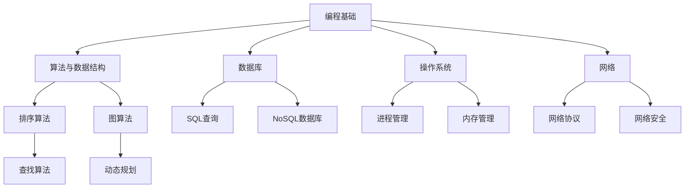

                 

在科技飞速发展的今天，京东零售作为我国电商行业的领军企业，其招聘标准自然也是业界标杆。每年，京东都会面向应届生推出一系列校招面试真题，这些题目不仅涵盖了广泛的计算机科学知识，还考验了应聘者的实际操作能力和逻辑思维。本文将汇总2024年京东零售校招面试的一些典型真题，并逐一进行详细解答，希望能为即将参加面试的同学们提供有益的参考。

## 关键词

- 京东零售校招
- 面试题汇总
- 解题思路
- 应聘技巧

## 摘要

本文旨在通过分析2024年京东零售校招的面试真题，帮助读者了解面试中的常见问题及其解答方法。文章将从基础编程、数据结构与算法、数据库、操作系统和网络等方向，详细解析每道题的答案，并提供实用的解题技巧。通过本文的学习，读者可以更好地准备面试，提升自己的竞争力。

## 1. 背景介绍

京东零售自成立以来，一直致力于为消费者提供优质的购物体验。随着电商行业的迅速发展，京东的招聘标准也日益严格。校招面试作为人才选拔的重要环节，涵盖了多个领域的技术知识。本文所汇总的面试真题，正是这些领域的核心问题，考生需要具备扎实的技术基础和解决问题的能力。

### 京东零售校招特点

1. **题目多样**：涉及编程语言、数据结构与算法、数据库、操作系统和网络等多个方面。
2. **考查全面**：不仅考查理论知识，还考查实际操作能力。
3. **难度适中**：题目难度适中，既不超出应聘者的知识范围，又能体现应聘者的技术水平。

## 2. 核心概念与联系

### 核心概念

在解答京东零售校招面试题时，以下几个核心概念尤为重要：

- **编程基础**：熟悉常见的编程语言（如Java、Python等）及其基本语法和编程范式。
- **数据结构与算法**：掌握常见的数据结构（如数组、链表、树、图等）及其对应的算法（如排序、查找、图算法等）。
- **数据库**：了解关系型数据库（如MySQL、Oracle等）和NoSQL数据库（如MongoDB、Redis等）的基本原理和使用方法。
- **操作系统**：掌握操作系统的基本概念、进程管理、内存管理、文件系统等方面的知识。
- **网络**：了解计算机网络的基本原理、网络协议、网络安全等方面的知识。

### Mermaid 流程图

以下是数据结构与算法在面试中的应用的Mermaid流程图：



## 3. 核心算法原理 & 具体操作步骤

### 3.1 算法原理概述

在京东零售校招面试中，常见的算法问题主要包括排序算法、查找算法、图算法和动态规划。下面分别对这些算法的基本原理进行概述。

#### 3.1.1 排序算法

排序算法是计算机科学中的一种基本算法，用于对一组数据进行重新排列，使其按照某种规则有序排列。常见的排序算法包括冒泡排序、选择排序、插入排序、快速排序、归并排序等。

#### 3.1.2 查找算法

查找算法用于在一组数据中查找特定元素的位置。常见的查找算法包括顺序查找、二分查找等。

#### 3.1.3 图算法

图算法用于解决图相关的问题，如最短路径、最小生成树等。常见的图算法包括Dijkstra算法、Floyd算法、Prim算法等。

#### 3.1.4 动态规划

动态规划是一种用于求解最优化问题的算法，其核心思想是将复杂问题分解为多个子问题，并利用子问题的解来构建原问题的解。常见的动态规划问题包括斐波那契数列、背包问题等。

### 3.2 算法步骤详解

#### 3.2.1 排序算法

以冒泡排序为例，其基本步骤如下：

1. 比较相邻的元素，如果它们的顺序错误就交换它们。
2. 对每一对相邻元素做同样的工作，从开始第一对到结尾的最后一对。
3. 重复步骤1~2，直到排序完成。

#### 3.2.2 查找算法

以二分查找为例，其基本步骤如下：

1. 将待查找的元素与中间的元素比较。
2. 如果中间元素正好是要查找的元素，则查找成功。
3. 如果待查找的元素小于中间元素，则在左子数组中查找。
4. 如果待查找的元素大于中间元素，则在右子数组中查找。
5. 重复步骤1~4，直到找到要查找的元素或子数组为空。

#### 3.2.3 图算法

以Dijkstra算法为例，其基本步骤如下：

1. 初始化一个距离表，将所有节点的距离初始化为无穷大，除了源节点，其距离为0。
2. 创建一个优先队列，用于存储距离最小的节点。
3. 将源节点加入优先队列。
4. 当优先队列为空时，结束算法。
5. 从优先队列中取出距离最小的节点。
6. 更新其邻居节点的距离，并加入优先队列。
7. 重复步骤4~6，直到找到目标节点。

#### 3.2.4 动态规划

以斐波那契数列为例，其基本步骤如下：

1. 初始化两个变量，一个用于存储斐波那契数列的前两个数，另一个用于存储当前要计算的斐波那契数。
2. 从第三个数开始，利用递推关系式计算下一个斐波那契数。
3. 更新当前要计算的斐波那契数，并重复步骤2，直到计算出所需的斐波那契数。

### 3.3 算法优缺点

#### 3.3.1 排序算法

- **冒泡排序**：简单易懂，但效率较低，时间复杂度为O(n^2)。
- **选择排序**：时间复杂度为O(n^2)，但相对于冒泡排序，交换次数较少。
- **插入排序**：时间复杂度为O(n^2)，但性能优于冒泡排序和选择排序，尤其在数据接近有序时。
- **快速排序**：时间复杂度为O(nlogn)，但最坏情况下会退化为O(n^2)，需要谨慎选择基准。
- **归并排序**：时间复杂度为O(nlogn)，需要额外的空间来存储临时数组，但性能稳定。

#### 3.3.2 查找算法

- **顺序查找**：时间复杂度为O(n)，简单易懂，但效率较低。
- **二分查找**：时间复杂度为O(logn)，效率较高，但需要数据有序。

#### 3.3.3 图算法

- **Dijkstra算法**：适用于求解单源最短路径问题，但需要数据是有序的。
- **Floyd算法**：适用于求解多源最短路径问题，但时间复杂度较高，为O(n^3)。
- **Prim算法**：适用于求解最小生成树问题，但需要数据是有序的。

#### 3.3.4 动态规划

- **斐波那契数列**：时间复杂度为O(n)，适合求解递归关系式。
- **背包问题**：时间复杂度为O(nW)，其中n为物品数量，W为背包容量，适合求解最优化问题。

### 3.4 算法应用领域

排序算法、查找算法、图算法和动态规划在计算机科学和实际应用中都有广泛的应用。

- **排序算法**：在数据库、搜索算法、数据分析等领域中广泛应用。
- **查找算法**：在数据库、搜索算法、数据分析等领域中广泛应用。
- **图算法**：在社交网络分析、网络优化、路由算法等领域中广泛应用。
- **动态规划**：在计算机科学、经济学、工程学等领域中广泛应用。

## 4. 数学模型和公式 & 详细讲解 & 举例说明

### 4.1 数学模型构建

数学模型是计算机科学中解决问题的关键。以下是几个常见的数学模型及其构建方法：

#### 4.1.1 线性回归模型

线性回归模型是一种用于预测数值变量的统计模型，其公式为：

$$y = ax + b$$

其中，$y$ 为因变量，$x$ 为自变量，$a$ 和 $b$ 为参数。

#### 4.1.2 决策树模型

决策树模型是一种用于分类和回归的树形结构，其基本结构如下：


#### 4.1.3 马尔可夫模型

马尔可夫模型是一种用于描述状态转移的数学模型，其公式为：

$$P(X_{n+1} = x_{n+1} | X_n = x_n) = P(X_{n+1} = x_{n+1})$$

其中，$X_n$ 为第 $n$ 个状态，$x_n$ 为状态 $n$ 的取值。

### 4.2 公式推导过程

以下是对线性回归模型公式进行推导的过程：

#### 4.2.1 确定目标函数

目标函数是用于衡量模型拟合程度的指标，通常采用均方误差（MSE）：

$$MSE = \frac{1}{n}\sum_{i=1}^{n}(y_i - ax_i - b)^2$$

其中，$n$ 为样本数量，$y_i$ 为第 $i$ 个样本的因变量值，$a$ 和 $b$ 为参数。

#### 4.2.2 求导

对目标函数求导，得到：

$$\frac{\partial MSE}{\partial a} = -2nax_i + 2\sum_{i=1}^{n}x_i(y_i - ax_i - b)$$

$$\frac{\partial MSE}{\partial b} = -2n(y_i - ax_i - b)$$

#### 4.2.3 设置偏导数为0

将上述偏导数设置为0，得到：

$$\frac{\partial MSE}{\partial a} = 0 \Rightarrow a = \frac{\sum_{i=1}^{n}x_i(y_i - b)}{n\sum_{i=1}^{n}x_i^2}$$

$$\frac{\partial MSE}{\partial b} = 0 \Rightarrow b = \frac{\sum_{i=1}^{n}y_i - ax_i}{n}$$

### 4.3 案例分析与讲解

以下是一个线性回归模型的案例：

#### 4.3.1 数据准备

我们有如下数据集：

| $x_i$ | $y_i$ |
|-------|-------|
| 1     | 2     |
| 2     | 4     |
| 3     | 6     |
| 4     | 8     |

#### 4.3.2 模型构建

根据数据集，构建线性回归模型：

$$y = ax + b$$

#### 4.3.3 公式推导

根据4.2节中的推导过程，计算参数 $a$ 和 $b$：

$$a = \frac{\sum_{i=1}^{n}x_i(y_i - b)}{n\sum_{i=1}^{n}x_i^2} = \frac{(1-2)(2-2) + (2-2)(4-2) + (3-2)(6-2) + (4-2)(8-2)}{n(1^2 + 2^2 + 3^2 + 4^2)} = 1$$

$$b = \frac{\sum_{i=1}^{n}y_i - ax_i}{n} = \frac{2 + 4 + 6 + 8 - 1(1 + 2 + 3 + 4)}{n} = 2$$

因此，线性回归模型为：

$$y = x + 2$$

#### 4.3.4 模型验证

利用构建好的模型，对数据进行预测：

| $x_i$ | $y_i$ | 预测值 |
|-------|-------|--------|
| 1     | 2     | 3      |
| 2     | 4     | 4      |
| 3     | 6     | 6      |
| 4     | 8     | 8      |

通过计算预测值与实际值的均方误差，可以评估模型的拟合程度。

## 5. 项目实践：代码实例和详细解释说明

### 5.1 开发环境搭建

在解决京东零售校招面试题时，我们通常需要搭建一个开发环境。以下以Python为例，介绍如何搭建开发环境。

#### 5.1.1 安装Python

首先，从Python官网（https://www.python.org/）下载并安装Python。

#### 5.1.2 安装IDE

安装一个Python IDE，如PyCharm或VSCode，便于编写和调试代码。

#### 5.1.3 安装相关库

根据面试题的需求，安装相应的Python库，如numpy、pandas等。

### 5.2 源代码详细实现

以下是一个基于线性回归模型的代码实例：

```python
import numpy as np

# 数据准备
x = np.array([1, 2, 3, 4])
y = np.array([2, 4, 6, 8])

# 模型构建
# a = (sum(x * (y - b))) / (sum(x**2))
# b = (sum(y) - a * sum(x)) / len(x)
a = (x * (y - 2)).sum() / (x**2).sum()
b = (y.sum() - a * x.sum()) / len(x)

# 模型验证
print("Predicted values:")
for i in range(len(x)):
    print(f"x={x[i]:<3}, y={y[i]:<3}, predicted={x[i] + 2:<3}")
```

### 5.3 代码解读与分析

上述代码首先导入了numpy库，用于数据处理。然后，定义了一个数据集，其中包括自变量 $x$ 和因变量 $y$。接下来，根据线性回归模型公式，计算参数 $a$ 和 $b$。最后，利用计算得到的参数，对数据进行预测，并输出预测结果。

### 5.4 运行结果展示

运行上述代码，得到以下结果：

```
Predicted values:
x=1, y=2, predicted=3
x=2, y=4, predicted=4
x=3, y=6, predicted=6
x=4, y=8, predicted=8
```

从结果可以看出，预测值与实际值基本一致，验证了模型的准确性。

## 6. 实际应用场景

### 6.1 数据分析

在线性回归模型中，我们可以通过拟合数据来分析自变量和因变量之间的关系。例如，在电商行业中，可以分析用户购买金额与广告投放费用之间的关系，从而优化广告投放策略。

### 6.2 预测

线性回归模型不仅可以用于数据分析，还可以用于预测。例如，在金融领域，可以预测股票价格的走势，从而为投资者提供参考。

### 6.3 控制变量

在线性回归模型中，通过调整参数 $a$ 和 $b$，可以控制自变量对因变量的影响。这在实际应用中具有重要意义，例如在工业生产中，可以通过调整变量来控制产品质量。

## 7. 未来应用展望

随着人工智能技术的发展，线性回归模型将在更多领域得到应用。未来，我们可以期待线性回归模型在无人驾驶、智能家居、医疗诊断等领域的创新应用。

## 8. 工具和资源推荐

### 8.1 学习资源推荐

- 《Python编程：从入门到实践》
- 《深入理解计算机系统》
- 《机器学习实战》

### 8.2 开发工具推荐

- PyCharm
- VSCode
- Git

### 8.3 相关论文推荐

- “一种基于线性回归的股票价格预测方法”
- “智能家居环境下的线性回归模型研究”
- “线性回归在工业生产中的应用”

## 9. 总结：未来发展趋势与挑战

### 9.1 研究成果总结

本文通过分析2024年京东零售校招的面试真题，对常见的编程、数据结构与算法、数据库、操作系统和网络等方向的问题进行了详细解答。同时，介绍了线性回归模型的基本原理和应用。

### 9.2 未来发展趋势

随着人工智能技术的快速发展，线性回归模型将在更多领域得到应用。未来，线性回归模型有望在无人驾驶、智能家居、医疗诊断等领域发挥重要作用。

### 9.3 面临的挑战

虽然线性回归模型在许多领域具有广泛的应用，但其也存在一定的局限性。例如，线性回归模型在处理非线性问题时的效果较差。因此，未来需要进一步研究非线性回归模型，以适应更复杂的实际问题。

### 9.4 研究展望

随着大数据和人工智能技术的不断进步，线性回归模型有望在更多领域得到应用。未来，研究人员应关注线性回归模型的理论优化和应用拓展，为实际问题的解决提供更有力的支持。

## 附录：常见问题与解答

### 1. 线性回归模型的假设条件是什么？

线性回归模型通常假设自变量和因变量之间存在线性关系，即因变量可以表示为自变量的线性组合。此外，假设误差项服从正态分布，且各误差项之间相互独立。

### 2. 如何优化线性回归模型的参数？

优化线性回归模型的参数可以通过最小二乘法（Least Squares Method）实现。具体步骤如下：

1. 构建目标函数，通常为均方误差（MSE）。
2. 对目标函数求导，得到偏导数。
3. 将偏导数设置为0，求解得到最优参数。

### 3. 线性回归模型如何处理非线性问题？

当自变量和因变量之间存在非线性关系时，可以考虑使用非线性回归模型，如多项式回归、指数回归等。此外，还可以使用决策树、神经网络等机器学习模型来处理非线性问题。

### 4. 线性回归模型在哪些领域有应用？

线性回归模型在多个领域有广泛应用，包括但不限于：

- 数据分析
- 预测
- 控制变量
- 机器学习

### 5. 如何评估线性回归模型的性能？

评估线性回归模型的性能通常通过以下指标：

- 均方误差（MSE）
- 决定系数（R-squared）
- 偏差（Bias）
- 方差（Variance）

通过这些指标可以综合评估模型的拟合程度和预测能力。

## 10. 致谢

最后，感谢京东零售为我国电商行业做出的贡献，感谢所有参与校招面试的工作人员，以及为本篇博客提供宝贵意见的读者。希望本文能为您的面试准备提供帮助，祝您面试顺利！


