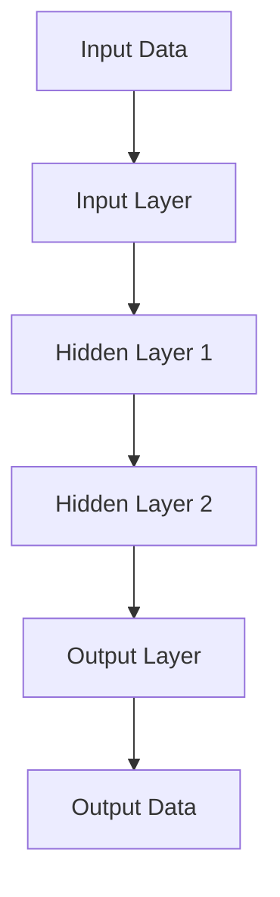
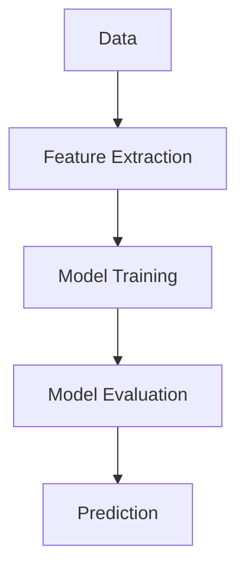

                 

关键词：人工智能，AI，原理，代码实例，深度学习，机器学习，神经网络，编程

> 摘要：本文旨在介绍人工智能的基本原理，并通过具体代码实例展示如何实现和优化各种AI算法。文章将从AI的背景出发，深入探讨核心概念、算法原理、数学模型，并通过实际项目实践展示AI的应用。

## 1. 背景介绍

人工智能（Artificial Intelligence, AI）作为计算机科学的一个分支，旨在使计算机具备类似于人类智能的能力。随着计算能力的提升和数据量的爆炸性增长，AI技术得到了迅速发展。AI的应用领域广泛，包括语音识别、图像识别、自然语言处理、自动驾驶等。

在过去的几十年里，AI经历了几个关键的发展阶段。早期的AI研究主要集中在符号主义和知识表示上，如专家系统和逻辑推理。然而，这些方法在面对复杂问题时效果不佳。随着深度学习的兴起，基于数据驱动的AI方法逐渐成为主流，神经网络在图像识别、语音识别等领域取得了显著的成果。

本文将重点关注深度学习和机器学习的原理与应用，并通过具体代码实例进行讲解。这将有助于读者更好地理解AI的核心概念和实现方法。

## 2. 核心概念与联系

### 2.1 深度学习

深度学习是机器学习的一个分支，其核心思想是通过构建多层神经网络来提取数据中的特征。深度学习在图像识别、语音识别、自然语言处理等领域取得了巨大的成功。下面是一个简单的深度学习架构的Mermaid流程图：



### 2.2 机器学习

机器学习是使计算机从数据中学习规律并做出预测或决策的过程。机器学习可以分为监督学习、无监督学习和强化学习。监督学习有标记数据作为训练样本，而无监督学习没有标签。强化学习通过试错和奖励机制来学习。

下面是一个机器学习流程的简化Mermaid流程图：



## 3. 核心算法原理 & 具体操作步骤

### 3.1 算法原理概述

深度学习中的核心算法是神经网络。神经网络通过多层神经元模拟人脑的神经元连接结构，通过前向传播和反向传播进行训练和预测。

### 3.2 算法步骤详解

1. **前向传播**：输入数据通过输入层进入网络，逐层传递到输出层。
2. **计算损失**：输出层产生的预测值与真实值之间的差距称为损失。
3. **反向传播**：根据损失计算每一层的梯度，并更新网络参数。
4. **重复迭代**：重复前向传播和反向传播，直到满足停止条件（如损失小于阈值或迭代次数达到最大值）。

### 3.3 算法优缺点

优点：可以处理复杂数据、自适应性强、具有很好的泛化能力。

缺点：训练过程较慢、对数据质量和量有较高要求、难以解释。

### 3.4 算法应用领域

深度学习在图像识别、语音识别、自然语言处理、推荐系统等领域有着广泛的应用。例如，在图像识别中，卷积神经网络（CNN）能够有效提取图像中的特征；在自然语言处理中，循环神经网络（RNN）和长短期记忆网络（LSTM）能够处理序列数据。

## 4. 数学模型和公式 & 详细讲解 & 举例说明

### 4.1 数学模型构建

神经网络的核心是激活函数和损失函数。激活函数用于引入非线性，常见的有Sigmoid、ReLU等。损失函数用于评估模型预测与真实值之间的差距，常见的有均方误差（MSE）和交叉熵（CE）。

### 4.2 公式推导过程

假设我们的神经网络有L层，第l层的输出为\( a^{(l)} \)，权重为\( w^{(l)} \)， biases 为\( b^{(l)} \)。那么，前向传播的公式可以表示为：

\[ a^{(l)} = \sigma(z^{(l)}) \]

其中，\( z^{(l)} = w^{(l)} \cdot a^{(l-1)} + b^{(l)} \)，\( \sigma \)是激活函数。

对于损失函数，我们可以使用均方误差（MSE）：

\[ J = \frac{1}{m} \sum_{i=1}^{m} (y^{(i)} - a^{(L)})^2 \]

### 4.3 案例分析与讲解

假设我们要使用神经网络进行手写数字识别。输入是28x28的灰度图像，输出是10个数字中的一个。我们可以构建一个简单的卷积神经网络，包括一个卷积层、一个池化层和一个全连接层。

以下是训练这个网络的Python代码示例：

```python
import tensorflow as tf

# 定义模型
model = tf.keras.Sequential([
    tf.keras.layers.Conv2D(32, (3, 3), activation='relu', input_shape=(28, 28, 1)),
    tf.keras.layers.MaxPooling2D((2, 2)),
    tf.keras.layers.Flatten(),
    tf.keras.layers.Dense(128, activation='relu'),
    tf.keras.layers.Dense(10, activation='softmax')
])

# 编译模型
model.compile(optimizer='adam', loss='sparse_categorical_crossentropy', metrics=['accuracy'])

# 训练模型
model.fit(x_train, y_train, epochs=5, validation_split=0.1)
```

## 5. 项目实践：代码实例和详细解释说明

### 5.1 开发环境搭建

首先，我们需要安装TensorFlow库。可以使用以下命令：

```bash
pip install tensorflow
```

### 5.2 源代码详细实现

在上面的示例中，我们定义了一个简单的卷积神经网络，包括一个卷积层、一个池化层和一个全连接层。我们使用TensorFlow的`keras`模块来构建这个模型。

### 5.3 代码解读与分析

在代码中，我们首先定义了一个序列模型，其中包含了卷积层、池化层和全连接层。卷积层用于提取图像中的特征，池化层用于减小数据维度并保留重要特征，全连接层用于分类。

在模型编译阶段，我们指定了优化器和损失函数。这里使用的是`adam`优化器和`sparse_categorical_crossentropy`损失函数。

在训练模型时，我们使用`fit`方法，其中`x_train`是训练数据，`y_train`是训练标签，`epochs`指定了训练轮数。

### 5.4 运行结果展示

运行上述代码后，模型将训练5个轮次。在训练过程中，我们可以通过`model.fit`的返回值获取训练的损失和准确率。训练完成后，我们可以使用以下代码进行评估：

```python
test_loss, test_acc = model.evaluate(x_test, y_test)
print(f"Test accuracy: {test_acc}")
```

## 6. 实际应用场景

AI技术在各个领域都有广泛的应用。以下是一些具体的例子：

- **医疗健康**：通过图像识别和自然语言处理技术，AI可以帮助医生进行疾病诊断和患者护理。
- **金融**：AI可以帮助银行和金融机构进行风险评估、欺诈检测和客户服务。
- **零售**：AI可以帮助零售商进行库存管理、需求预测和个性化推荐。
- **交通**：AI可以帮助交通管理系统进行路况预测、自动驾驶和智能导航。

## 7. 工具和资源推荐

### 7.1 学习资源推荐

- 《深度学习》（Goodfellow, Bengio, Courville著）
- 《Python机器学习》（Sebastian Raschka著）
- 《AI简史》（Andrew Ng著）

### 7.2 开发工具推荐

- TensorFlow
- PyTorch
- Keras

### 7.3 相关论文推荐

- "A Theoretical Framework for Back-Propagation" - Rumelhart, Hinton, Williams
- "Deep Learning" - Goodfellow, Bengio, Courville
- "Convolutional Neural Networks for Visual Recognition" - Krizhevsky, Sutskever, Hinton

## 8. 总结：未来发展趋势与挑战

### 8.1 研究成果总结

AI技术在过去几十年里取得了显著的进展。深度学习和机器学习算法在图像识别、语音识别、自然语言处理等领域取得了突破性成果。

### 8.2 未来发展趋势

未来，AI技术将继续向自动化、智能化、泛化能力更强的方向发展。尤其是在自动驾驶、智能医疗、金融科技等领域，AI将发挥更加重要的作用。

### 8.3 面临的挑战

尽管AI技术取得了显著进展，但仍面临一些挑战，如算法的可解释性、数据隐私、计算资源需求等。此外，AI技术的发展还需要更多的跨学科合作。

### 8.4 研究展望

未来的研究将集中在提升AI算法的泛化能力、可解释性、效率和安全性。同时，AI技术将在更多的领域得到应用，为社会带来更多创新和变革。

## 9. 附录：常见问题与解答

### 9.1 什么是深度学习？

深度学习是一种机器学习技术，其核心是通过多层神经网络进行数据处理和特征提取。

### 9.2 如何选择合适的神经网络结构？

选择合适的神经网络结构取决于具体的任务和数据。通常，我们可以通过实验和调优来确定最优的网络结构。

### 9.3 如何处理过拟合？

过拟合可以通过增加数据量、使用正则化技术和调整网络结构来缓解。

---

本文旨在为读者提供关于人工智能的基本原理和实践指导。通过阅读本文，读者可以更好地理解深度学习和机器学习算法，并在实际项目中应用这些技术。

## 作者署名

作者：禅与计算机程序设计艺术 / Zen and the Art of Computer Programming

通过本文，我们希望读者能够对人工智能有一个更深入的理解，并在未来的项目中能够更好地应用这些技术。人工智能作为一门快速发展的学科，将继续为社会带来更多的创新和变革。让我们共同探索AI的无限可能。|done|

