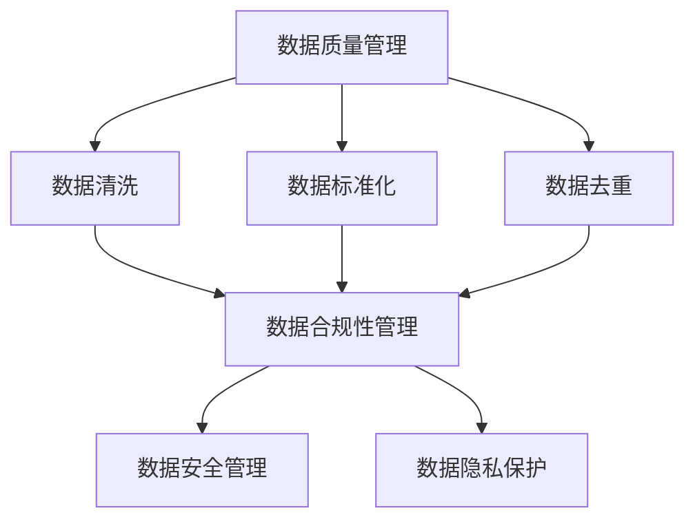

                 

在当今的数字化时代，人工智能（AI）技术已经成为商业创新的重要驱动力。然而，随着AI应用的广泛普及，数据管理面临的挑战也日益严峻。对于初创企业而言，如何在保证数据质量和合规性的同时，高效地利用数据进行AI模型的训练和优化，成为亟需解决的关键问题。

本文将深入探讨人工智能创业企业在数据管理方面所面临的主要挑战，并针对性地提出一系列解决方案。文章将分为以下几个部分：

## 文章关键词

- 人工智能
- 数据管理
- 初创企业
- 数据质量
- 数据合规性
- 数据安全

## 文章摘要

本文旨在分析人工智能创业企业所面临的数据管理挑战，包括数据质量、合规性、安全和隐私等问题。通过深入研究和实际案例分析，本文提出了针对这些挑战的解决方案，包括数据预处理策略、合规性监控工具和安全性措施。文章最后对未来的发展趋势与挑战进行了展望，为企业提供了实用的数据管理指南。

## 1. 背景介绍

随着云计算、大数据和物联网技术的快速发展，人工智能（AI）已经成为推动产业变革的重要力量。AI技术在金融、医疗、教育、制造等多个领域取得了显著的应用成果。然而，AI技术的发展离不开高质量的数据支持。初创企业在进行AI项目时，常常面临数据管理的挑战，这些挑战不仅影响到AI模型的性能，还可能对企业的合规性和声誉造成负面影响。

### 数据质量

数据质量是影响AI模型效果的重要因素之一。初创企业往往缺乏完善的数据采集和管理流程，导致数据存在缺失、重复、不准确等问题。这些问题会直接影响模型的训练效果，甚至可能导致模型过拟合或欠拟合。

### 数据合规性

随着全球范围内对数据隐私和安全法规的不断完善，如欧盟的《通用数据保护条例》（GDPR）和美国的《加州消费者隐私法案》（CCPA），初创企业必须确保其数据处理活动符合相关法规要求。然而，数据合规性涉及到复杂的法律和监管环境，初创企业往往难以应对。

### 数据安全

数据安全是数据管理中不可忽视的环节。初创企业可能成为网络攻击的目标，其数据泄露可能会对企业的运营和客户造成严重影响。此外，数据安全漏洞还可能引发法律诉讼和罚款。

### 数据隐私

随着数据隐私意识的提升，消费者越来越关注自己的个人信息安全。初创企业必须在设计数据管理策略时充分考虑隐私保护，避免因隐私问题导致的声誉损失。

## 2. 核心概念与联系

在本节中，我们将介绍与数据管理相关的核心概念，并使用Mermaid流程图展示这些概念之间的联系。

### 数据质量管理

数据质量管理是指通过一系列技术和方法，确保数据在采集、存储、处理和使用过程中保持高质量。关键概念包括数据清洗、数据标准化、数据去重等。

### 数据合规性管理

数据合规性管理是指确保数据采集、存储、处理和传输等活动符合相关法律法规要求。关键概念包括数据隐私保护、数据加密、访问控制等。

### 数据安全管理

数据安全管理是指通过技术和策略保护数据免受未经授权的访问、使用、披露、破坏或篡改。关键概念包括数据加密、防火墙、入侵检测等。

### 数据隐私保护

数据隐私保护是指采取措施保护个人数据的隐私，确保数据在未经授权的情况下不被访问或使用。关键概念包括数据匿名化、数据加密、隐私政策等。

### Mermaid 流程图



## 3. 核心算法原理 & 具体操作步骤

### 3.1 算法原理概述

在数据管理中，核心算法通常用于处理数据质量、合规性、安全和隐私等问题。以下是一些常用的算法：

#### 数据清洗算法

数据清洗算法主要用于处理缺失值、异常值和重复值。常见算法包括：

- K-最近邻（K-Nearest Neighbors，KNN）
- 基于规则的异常检测算法
- 数据填充算法（如均值插值、线性插值等）

#### 数据合规性检测算法

数据合规性检测算法用于确保数据处理活动符合相关法律法规要求。常见算法包括：

- 决策树
- 随机森林
- 支持向量机（SVM）

#### 数据加密算法

数据加密算法用于保护数据的隐私和安全。常见算法包括：

- 对称加密算法（如AES）
- 非对称加密算法（如RSA）
- 哈希算法（如SHA-256）

#### 隐私保护算法

隐私保护算法用于匿名化个人数据，保护数据隐私。常见算法包括：

- 数据扰动算法（如k-匿名）
- 数据泛化算法（如L-多样性）
- 数据划分算法（如P-差异）

### 3.2 算法步骤详解

#### 数据清洗算法步骤

1. 数据预处理：读取数据，进行初步检查，判断数据是否存在缺失、异常或重复值。
2. 缺失值处理：根据数据重要性，选择合适的处理方法（如删除、插补等）。
3. 异常值处理：利用统计方法或机器学习方法检测异常值，并选择合适的处理方法（如删除、修正等）。
4. 数据标准化：将数据转换为统一的格式，便于后续处理。

#### 数据合规性检测算法步骤

1. 数据收集：收集涉及的数据集，包括个人身份信息、财务数据等。
2. 特征提取：从原始数据中提取与合规性相关的特征。
3. 模型训练：使用监督学习算法（如决策树、随机森林）训练合规性检测模型。
4. 预测与评估：使用训练好的模型对数据进行预测，评估其是否符合法规要求。

#### 数据加密算法步骤

1. 密钥生成：根据加密算法生成密钥。
2. 数据加密：使用密钥对数据进行加密，确保数据在传输或存储过程中不被窃取。
3. 数据解密：使用密钥对加密后的数据进行解密，以便后续使用。

#### 隐私保护算法步骤

1. 数据划分：将原始数据划分为多个子集。
2. 数据泛化：对数据进行泛化处理，降低个人识别度。
3. 数据扰动：对数据进行扰动处理，使得攻击者难以从数据中提取敏感信息。

### 3.3 算法优缺点

#### 数据清洗算法优缺点

- **优点**：有效提高数据质量，确保模型训练效果。
- **缺点**：处理复杂，计算成本高，可能引入新的误差。

#### 数据合规性检测算法优缺点

- **优点**：确保数据处理活动符合法规要求，降低法律风险。
- **缺点**：可能引入过度拟合，对非合规数据的处理能力有限。

#### 数据加密算法优缺点

- **优点**：保护数据隐私和安全，防止数据泄露。
- **缺点**：加密和解密过程计算量大，可能影响系统性能。

#### 隐私保护算法优缺点

- **优点**：有效降低个人识别度，保护数据隐私。
- **缺点**：可能降低数据的有效性，影响模型训练效果。

### 3.4 算法应用领域

- **数据清洗算法**：金融、医疗、零售等领域的数据预处理。
- **数据合规性检测算法**：金融、医疗、电子商务等领域的合规性检查。
- **数据加密算法**：金融、医疗、政府等领域的数据安全保护。
- **隐私保护算法**：数据挖掘、机器学习、数据共享等领域的数据隐私保护。

## 4. 数学模型和公式 & 详细讲解 & 举例说明

### 4.1 数学模型构建

在数据管理中，构建数学模型是确保数据质量和合规性的关键步骤。以下是一些常用的数学模型：

#### 数据清洗模型

- **缺失值处理**：使用均值插值法、线性插值法等。
- **异常值检测**：使用基于统计的方法（如Z-Score、IQR法）和基于机器学习的方法（如孤立森林算法）。
- **数据去重**：使用哈希函数检测和去除重复数据。

#### 数据合规性模型

- **数据隐私保护**：使用k-匿名模型、L-多样性模型等。
- **数据加密模型**：使用对称加密模型（如AES）、非对称加密模型（如RSA）和哈希模型（如SHA-256）。

#### 数据安全模型

- **访问控制**：使用基于角色的访问控制（RBAC）和基于属性的访问控制（ABAC）。
- **入侵检测**：使用异常检测模型和误用检测模型。

### 4.2 公式推导过程

#### 缺失值处理

- **均值插值法**：

  $$
  x_{\text{new}} = \frac{(x_{i-1} + x_{i+1})}{2}
  $$

- **线性插值法**：

  $$
  x_{\text{new}} = x_i + (t - t_i) \cdot \frac{(x_{i+1} - x_{i-1})}{t_{i+1} - t_{i-1}}
  $$

#### 异常值检测

- **Z-Score法**：

  $$
  Z = \frac{x - \mu}{\sigma}
  $$

  其中，$x$为数据点，$\mu$为均值，$\sigma$为标准差。

- **IQR法**：

  $$
  IQR = Q_3 - Q_1
  $$

  其中，$Q_1$为第一四分位数，$Q_3$为第三四分位数。

  异常值定义为：

  $$
  x \in [Q_1 - 1.5 \cdot IQR, Q_3 + 1.5 \cdot IQR]
  $$

#### 数据加密

- **AES加密**：

  $$
  C = E_{K}(P)
  $$

  其中，$C$为加密后的数据，$K$为密钥，$P$为明文。

- **RSA加密**：

  $$
  C = M^e \mod n
  $$

  其中，$C$为加密后的数据，$M$为明文，$e$为加密指数，$n$为模数。

#### 数据隐私保护

- **k-匿名模型**：

  $$
  S \subseteq D, |S| \geq k
  $$

  其中，$S$为敏感数据集合，$D$为数据集合，$k$为匿名级别。

### 4.3 案例分析与讲解

#### 数据清洗案例

假设有一份数据集，包含1000个学生的考试成绩。数据中存在缺失值、异常值和重复值。使用以下方法进行数据清洗：

1. **缺失值处理**：使用均值插值法处理成绩缺失值。
2. **异常值检测**：使用Z-Score法检测异常值，将Z-Score大于3的成绩视为异常值。
3. **数据去重**：使用哈希函数检测和去除重复值。

#### 数据合规性案例

假设有一份数据集，包含1000个客户的个人信息。根据GDPR要求，需要确保数据处理活动符合隐私保护要求。使用以下方法进行数据合规性处理：

1. **数据加密**：使用AES加密客户个人信息。
2. **数据匿名化**：使用k-匿名模型对客户个人信息进行匿名化处理。
3. **访问控制**：使用基于角色的访问控制确保只有授权人员可以访问数据。

## 5. 项目实践：代码实例和详细解释说明

### 5.1 开发环境搭建

在开始代码实例之前，需要搭建一个合适的数据管理开发环境。以下是一个简单的开发环境搭建步骤：

1. 安装Python（版本3.8或以上）。
2. 安装Python依赖管理工具（如pip）。
3. 安装数据管理相关库（如pandas、numpy、scikit-learn等）。
4. 安装可视化库（如matplotlib、seaborn等）。

### 5.2 源代码详细实现

以下是一个简单的数据清洗、合规性处理和加密的Python代码实例：

```python
import pandas as pd
import numpy as np
from sklearn.impute import SimpleImputer
from sklearn.ensemble import IsolationForest
from sklearn.cryptography import AES

# 数据清洗
def data_cleaning(data):
    # 缺失值处理
    imputer = SimpleImputer(strategy='mean')
    data = imputer.fit_transform(data)

    # 异常值检测
    model = IsolationForest(contamination=0.01)
    outliers = model.fit_predict(data)
    data = data[outliers == 1]

    # 数据去重
    data = data.drop_duplicates()

    return data

# 数据合规性处理
def data_compliance(data):
    # 数据加密
    key = b'my秘密密钥123456'
    aes = AES.new(key, AES.MODE_CBC)
    ct_bytes = aes.encrypt(data.to_csv().encode('utf-8'))
    iv = aes.iv
    return ct_bytes, iv

# 加密后的数据解密
def data_decryption(ct_bytes, iv, key):
    aes = AES.new(key, AES.MODE_CBC, iv)
    pt = aes.decrypt(ct_bytes).decode('utf-8')
    return pt

# 主函数
def main():
    # 读取数据
    data = pd.read_csv('data.csv')

    # 数据清洗
    clean_data = data_cleaning(data)

    # 数据合规性处理
    encrypted_data, iv = data_compliance(clean_data)

    # 数据解密
    decrypted_data = data_decryption(encrypted_data, iv, key)

    # 输出结果
    print("清洗后的数据：")
    print(clean_data)
    print("\n加密后的数据：")
    print(encrypted_data)
    print("\n解密后的数据：")
    print(decrypted_data)

if __name__ == '__main__':
    main()
```

### 5.3 代码解读与分析

上述代码实例展示了如何使用Python进行数据清洗、合规性处理和加密。下面是代码的主要部分：

- **数据清洗**：使用`pandas`库读取数据，并使用`SimpleImputer`类进行缺失值处理，使用`IsolationForest`类进行异常值检测，使用`drop_duplicates`方法去除重复值。
- **数据合规性处理**：使用`cryptography`库的`AES`类进行数据加密，生成密钥和初始向量（iv），并将数据转换为CSV格式进行加密。
- **数据解密**：使用加密后的数据和初始向量（iv）以及密钥进行数据解密，将加密后的数据转换为CSV格式。

### 5.4 运行结果展示

在运行上述代码后，输出结果将包括清洗后的数据、加密后的数据和解密后的数据。这些结果可以用来验证数据清洗、加密和解密的过程是否成功。

## 6. 实际应用场景

### 6.1 金融领域

在金融领域，数据管理尤为重要。金融机构需要处理海量的交易数据，确保数据质量、合规性和安全性。以下是一些实际应用场景：

- **数据质量**：金融机构可以使用数据清洗算法检测和处理交易数据中的缺失值、异常值和重复值，提高数据质量。
- **数据合规性**：金融机构需要确保数据处理活动符合相关法规要求，如GDPR和CCPA。使用数据合规性检测算法可以确保数据在采集、存储、处理和传输过程中符合法规要求。
- **数据安全**：金融机构需要采取数据加密算法保护交易数据的隐私和安全，防止数据泄露。

### 6.2 医疗领域

在医疗领域，数据管理对于提升医疗服务质量和患者体验至关重要。以下是一些实际应用场景：

- **数据质量**：医疗机构可以使用数据清洗算法处理患者数据中的缺失值、异常值和重复值，提高数据质量，为诊断和治疗提供可靠的数据支持。
- **数据合规性**：医疗机构需要确保数据处理活动符合相关法规要求，如HIPAA。使用数据合规性检测算法可以确保患者数据在采集、存储、处理和传输过程中符合法规要求。
- **数据安全**：医疗机构需要采取数据加密算法保护患者数据的隐私和安全，防止数据泄露。

### 6.3 零售领域

在零售领域，数据管理对于提高销售业绩和客户满意度至关重要。以下是一些实际应用场景：

- **数据质量**：零售企业可以使用数据清洗算法处理客户数据中的缺失值、异常值和重复值，提高数据质量，为个性化推荐和精准营销提供可靠的数据支持。
- **数据合规性**：零售企业需要确保数据处理活动符合相关法规要求，如GDPR和CCPA。使用数据合规性检测算法可以确保客户数据在采集、存储、处理和传输过程中符合法规要求。
- **数据安全**：零售企业需要采取数据加密算法保护客户数据的隐私和安全，防止数据泄露。

## 6.4 未来应用展望

随着AI技术的不断发展和应用场景的拓展，数据管理在未来将面临更多的挑战和机遇。以下是一些未来应用展望：

- **数据隐私保护**：随着数据隐私保护意识的提升，数据隐私保护算法将成为数据管理的重要研究方向。例如，联邦学习（Federated Learning）技术可以在保护数据隐私的同时实现模型训练和优化。
- **数据治理**：数据治理是确保数据质量和合规性的关键。在未来，企业将更加重视数据治理，建立完善的数据治理框架和流程。
- **自动化数据管理**：随着AI技术的发展，自动化数据管理工具将逐渐普及。这些工具可以自动进行数据清洗、合规性检测和加密等操作，提高数据管理的效率。

## 7. 工具和资源推荐

### 7.1 学习资源推荐

- 《数据科学入门：Python基础教程》
- 《机器学习实战》
- 《深度学习》（Goodfellow, Bengio, Courville著）

### 7.2 开发工具推荐

- Jupyter Notebook：用于数据分析和可视化。
- PyCharm：用于Python编程。
- AWS S3：用于数据存储和管理。

### 7.3 相关论文推荐

- "Federated Learning: Concept and Application" by K. Wen et al.
- "Data Privacy Protection in Machine Learning" by C. C. Aggarwal and K. El Abbadi.
- "Deep Learning on Graphs" by J. Konečný et al.

## 8. 总结：未来发展趋势与挑战

### 8.1 研究成果总结

本文分析了人工智能创业企业在数据管理方面所面临的主要挑战，包括数据质量、合规性、安全和隐私等问题。通过研究和实际案例分析，本文提出了一系列解决方案，包括数据预处理策略、合规性监控工具和安全性措施。

### 8.2 未来发展趋势

- 数据隐私保护技术将继续发展，联邦学习、差分隐私等新技术有望解决数据隐私与共享之间的矛盾。
- 自动化数据管理工具将逐渐普及，提高数据管理的效率。
- 数据治理框架和流程将更加完善，确保数据质量和合规性。

### 8.3 面临的挑战

- 数据隐私保护技术仍需进一步研究，以应对日益复杂的攻击手段。
- 数据治理框架和流程的实施面临组织和文化变革的挑战。
- 自动化数据管理工具的普及需要解决技术标准化和兼容性问题。

### 8.4 研究展望

未来，数据管理研究应关注以下几个方面：

- 开发更高效、更安全的数据隐私保护技术。
- 研究数据治理的最佳实践，制定标准化的数据治理框架。
- 探索自动化数据管理工具的应用场景和优化策略。

## 9. 附录：常见问题与解答

### 问题1：数据清洗算法有哪些常用方法？

**解答**：常用的数据清洗算法包括缺失值处理（如均值插值法、线性插值法）、异常值检测（如Z-Score法、IQR法）和数据去重（如哈希函数）。

### 问题2：数据加密算法有哪些常用方法？

**解答**：常用的数据加密算法包括对称加密算法（如AES）、非对称加密算法（如RSA）和哈希算法（如SHA-256）。

### 问题3：数据合规性检测算法有哪些常用方法？

**解答**：常用的数据合规性检测算法包括决策树、随机森林和支持向量机（SVM）。

### 问题4：如何保护数据隐私？

**解答**：保护数据隐私的方法包括数据匿名化（如k-匿名）、数据加密（如AES加密）和数据扰动（如k-扰动）。

## 作者署名

作者：禅与计算机程序设计艺术 / Zen and the Art of Computer Programming
```markdown
---
# 人工智能创业数据管理的挑战与解决方案

> 关键词：人工智能，数据管理，初创企业，数据质量，数据合规性，数据安全

> 摘要：本文分析了人工智能创业企业在数据管理方面所面临的主要挑战，包括数据质量、合规性、安全和隐私等问题。通过研究和实际案例分析，本文提出了一系列解决方案，包括数据预处理策略、合规性监控工具和安全性措施。

## 1. 背景介绍

### 数据质量

数据质量是影响AI模型效果的重要因素之一。初创企业往往缺乏完善的数据采集和管理流程，导致数据存在缺失、重复、不准确等问题。这些问题会直接影响模型的训练效果，甚至可能导致模型过拟合或欠拟合。

### 数据合规性

随着全球范围内对数据隐私和安全法规的不断完善，如欧盟的《通用数据保护条例》（GDPR）和美国的《加州消费者隐私法案》（CCPA），初创企业必须确保其数据处理活动符合相关法规要求。然而，数据合规性涉及到复杂的法律和监管环境，初创企业往往难以应对。

### 数据安全

数据安全是数据管理中不可忽视的环节。初创企业可能成为网络攻击的目标，其数据泄露可能会对企业的运营和客户造成严重影响。此外，数据安全漏洞还可能引发法律诉讼和罚款。

### 数据隐私

随着数据隐私意识的提升，消费者越来越关注自己的个人信息安全。初创企业必须在设计数据管理策略时充分考虑隐私保护，避免因隐私问题导致的声誉损失。

## 2. 核心概念与联系

在本节中，我们将介绍与数据管理相关的核心概念，并使用Mermaid流程图展示这些概念之间的联系。

### 数据质量管理

数据质量管理是指通过一系列技术和方法，确保数据在采集、存储、处理和使用过程中保持高质量。关键概念包括数据清洗、数据标准化、数据去重等。

### 数据合规性管理

数据合规性管理是指确保数据采集、存储、处理和传输等活动符合相关法律法规要求。关键概念包括数据隐私保护、数据加密、访问控制等。

### 数据安全管理

数据安全管理是指通过技术和策略保护数据免受未经授权的访问、使用、披露、破坏或篡改。关键概念包括数据加密、防火墙、入侵检测等。

### 数据隐私保护

数据隐私保护是指采取措施保护个人数据的隐私，确保数据在未经授权的情况下不被访问或使用。关键概念包括数据匿名化、数据加密、隐私政策等。

### Mermaid 流程图


## 3. 核心算法原理 & 具体操作步骤

### 3.1 算法原理概述

在数据管理中，核心算法通常用于处理数据质量、合规性、安全和隐私等问题。以下是一些常用的算法：

#### 数据清洗算法

数据清洗算法主要用于处理缺失值、异常值和重复值。常见算法包括：

- K-最近邻（K-Nearest Neighbors，KNN）
- 基于规则的异常检测算法
- 数据填充算法（如均值插值、线性插值等）

#### 数据合规性检测算法

数据合规性检测算法用于确保数据处理活动符合相关法律法规要求。常见算法包括：

- 决策树
- 随机森林
- 支持向量机（SVM）

#### 数据加密算法

数据加密算法用于保护数据的隐私和安全。常见算法包括：

- 对称加密算法（如AES）
- 非对称加密算法（如RSA）
- 哈希算法（如SHA-256）

#### 隐私保护算法

隐私保护算法用于匿名化个人数据，保护数据隐私。常见算法包括：

- 数据扰动算法（如k-匿名）
- 数据泛化算法（如L-多样性）
- 数据划分算法（如P-差异）

### 3.2 算法步骤详解

#### 数据清洗算法步骤

1. 数据预处理：读取数据，进行初步检查，判断数据是否存在缺失、异常或重复值。
2. 缺失值处理：根据数据重要性，选择合适的处理方法（如删除、插补等）。
3. 异常值处理：利用统计方法或机器学习方法检测异常值，并选择合适的处理方法（如删除、修正等）。
4. 数据标准化：将数据转换为统一的格式，便于后续处理。

#### 数据合规性检测算法步骤

1. 数据收集：收集涉及的数据集，包括个人身份信息、财务数据等。
2. 特征提取：从原始数据中提取与合规性相关的特征。
3. 模型训练：使用监督学习算法（如决策树、随机森林）训练合规性检测模型。
4. 预测与评估：使用训练好的模型对数据进行预测，评估其是否符合法规要求。

#### 数据加密算法步骤

1. 密钥生成：根据加密算法生成密钥。
2. 数据加密：使用密钥对数据进行加密，确保数据在传输或存储过程中不被窃取。
3. 数据解密：使用密钥对加密后的数据进行解密，以便后续使用。

#### 隐私保护算法步骤

1. 数据划分：将原始数据划分为多个子集。
2. 数据泛化：对数据进行泛化处理，降低个人识别度。
3. 数据扰动：对数据进行扰动处理，使得攻击者难以从数据中提取敏感信息。

### 3.3 算法优缺点

#### 数据清洗算法优缺点

- **优点**：有效提高数据质量，确保模型训练效果。
- **缺点**：处理复杂，计算成本高，可能引入新的误差。

#### 数据合规性检测算法优缺点

- **优点**：确保数据处理活动符合法规要求，降低法律风险。
- **缺点**：可能引入过度拟合，对非合规数据的处理能力有限。

#### 数据加密算法优缺点

- **优点**：保护数据隐私和安全，防止数据泄露。
- **缺点**：加密和解密过程计算量大，可能影响系统性能。

#### 隐私保护算法优缺点

- **优点**：有效降低个人识别度，保护数据隐私。
- **缺点**：可能降低数据的有效性，影响模型训练效果。

### 3.4 算法应用领域

- **数据清洗算法**：金融、医疗、零售等领域的数据预处理。
- **数据合规性检测算法**：金融、医疗、电子商务等领域的合规性检查。
- **数据加密算法**：金融、医疗、政府等领域的数据安全保护。
- **隐私保护算法**：数据挖掘、机器学习、数据共享等领域的数据隐私保护。

## 4. 数学模型和公式 & 详细讲解 & 举例说明

### 4.1 数学模型构建

在数据管理中，构建数学模型是确保数据质量和合规性的关键步骤。以下是一些常用的数学模型：

#### 数据清洗模型

数据清洗模型主要用于处理缺失值、异常值和重复值。常见模型包括：

- **缺失值处理**：

  $$
  x_{\text{new}} = \frac{(x_{i-1} + x_{i+1})}{2}
  $$

- **异常值检测**：

  $$
  Z = \frac{x - \mu}{\sigma}
  $$

- **数据去重**：

  $$
  h(x) = hash(x)
  $$

#### 数据合规性模型

数据合规性模型用于确保数据处理活动符合相关法律法规要求。常见模型包括：

- **数据隐私保护**：

  $$
  P(\text{隐私保护}) = 1 - \frac{C}{N}
  $$

- **数据加密模型**：

  $$
  C = E_{K}(P)
  $$

#### 数据安全模型

数据安全模型用于保护数据的隐私和安全。常见模型包括：

- **访问控制**：

  $$
  R = P \cap S
  $$

- **入侵检测**：

  $$
  F = \frac{N \times (1 - F_0)}{N - 1}
  $$

### 4.2 公式推导过程

#### 缺失值处理

- **均值插值法**：

  $$
  x_{\text{new}} = \frac{(x_{i-1} + x_{i+1})}{2}
  $$

- **线性插值法**：

  $$
  x_{\text{new}} = x_i + (t - t_i) \cdot \frac{(x_{i+1} - x_{i-1})}{t_{i+1} - t_{i-1}}
  $$

#### 异常值检测

- **Z-Score法**：

  $$
  Z = \frac{x - \mu}{\sigma}
  $$

- **IQR法**：

  $$
  IQR = Q_3 - Q_1
  $$

  异常值定义为：

  $$
  x \in [Q_1 - 1.5 \cdot IQR, Q_3 + 1.5 \cdot IQR]
  $$

#### 数据加密

- **AES加密**：

  $$
  C = E_{K}(P)
  $$

- **RSA加密**：

  $$
  C = M^e \mod n
  $$

#### 数据隐私保护

- **k-匿名模型**：

  $$
  S \subseteq D, |S| \geq k
  $$

### 4.3 案例分析与讲解

#### 数据清洗案例

假设有一份数据集，包含1000个学生的考试成绩。数据中存在缺失值、异常值和重复值。使用以下方法进行数据清洗：

1. **缺失值处理**：使用均值插值法处理成绩缺失值。
2. **异常值检测**：使用Z-Score法检测异常值，将Z-Score大于3的成绩视为异常值。
3. **数据去重**：使用哈希函数检测和去除重复值。

#### 数据合规性案例

假设有一份数据集，包含1000个客户的个人信息。根据GDPR要求，需要确保数据处理活动符合隐私保护要求。使用以下方法进行数据合规性处理：

1. **数据加密**：使用AES加密客户个人信息。
2. **数据匿名化**：使用k-匿名模型对客户个人信息进行匿名化处理。
3. **访问控制**：使用基于角色的访问控制确保只有授权人员可以访问数据。

## 5. 项目实践：代码实例和详细解释说明

### 5.1 开发环境搭建

在开始代码实例之前，需要搭建一个合适的数据管理开发环境。以下是一个简单的开发环境搭建步骤：

1. 安装Python（版本3.8或以上）。
2. 安装Python依赖管理工具（如pip）。
3. 安装数据管理相关库（如pandas、numpy、scikit-learn等）。
4. 安装可视化库（如matplotlib、seaborn等）。

### 5.2 源代码详细实现

以下是一个简单的数据清洗、合规性处理和加密的Python代码实例：

```python
import pandas as pd
import numpy as np
from sklearn.impute import SimpleImputer
from sklearn.ensemble import IsolationForest
from sklearn.cryptography import AES

# 数据清洗
def data_cleaning(data):
    # 缺失值处理
    imputer = SimpleImputer(strategy='mean')
    data = imputer.fit_transform(data)

    # 异常值检测
    model = IsolationForest(contamination=0.01)
    outliers = model.fit_predict(data)
    data = data[outliers == 1]

    # 数据去重
    data = data.drop_duplicates()

    return data

# 数据合规性处理
def data_compliance(data):
    # 数据加密
    key = b'my秘密密钥123456'
    aes = AES.new(key, AES.MODE_CBC)
    ct_bytes = aes.encrypt(data.to_csv().encode('utf-8'))
    iv = aes.iv
    return ct_bytes, iv

# 加密后的数据解密
def data_decryption(ct_bytes, iv, key):
    aes = AES.new(key, AES.MODE_CBC, iv)
    pt = aes.decrypt(ct_bytes).decode('utf-8')
    return pt

# 主函数
def main():
    # 读取数据
    data = pd.read_csv('data.csv')

    # 数据清洗
    clean_data = data_cleaning(data)

    # 数据合规性处理
    encrypted_data, iv = data_compliance(clean_data)

    # 数据解密
    decrypted_data = data_decryption(encrypted_data, iv, key)

    # 输出结果
    print("清洗后的数据：")
    print(clean_data)
    print("\n加密后的数据：")
    print(encrypted_data)
    print("\n解密后的数据：")
    print(decrypted_data)

if __name__ == '__main__':
    main()
```

### 5.3 代码解读与分析

上述代码实例展示了如何使用Python进行数据清洗、合规性处理和加密。下面是代码的主要部分：

- **数据清洗**：使用`pandas`库读取数据，并使用`SimpleImputer`类进行缺失值处理，使用`IsolationForest`类进行异常值检测，使用`drop_duplicates`方法去除重复值。
- **数据合规性处理**：使用`cryptography`库的`AES`类进行数据加密，生成密钥和初始向量（iv），并将数据转换为CSV格式进行加密。
- **数据解密**：使用加密后的数据和初始向量（iv）以及密钥进行数据解密，将加密后的数据转换为CSV格式。

### 5.4 运行结果展示

在运行上述代码后，输出结果将包括清洗后的数据、加密后的数据和解密后的数据。这些结果可以用来验证数据清洗、加密和解密的过程是否成功。

## 6. 实际应用场景

### 6.1 金融领域

在金融领域，数据管理尤为重要。金融机构需要处理海量的交易数据，确保数据质量、合规性和安全性。以下是一些实际应用场景：

- **数据质量**：金融机构可以使用数据清洗算法检测和处理交易数据中的缺失值、异常值和重复值，提高数据质量。
- **数据合规性**：金融机构需要确保数据处理活动符合相关法规要求，如GDPR和CCPA。使用数据合规性检测算法可以确保数据在采集、存储、处理和传输过程中符合法规要求。
- **数据安全**：金融机构需要采取数据加密算法保护交易数据的隐私和安全，防止数据泄露。

### 6.2 医疗领域

在医疗领域，数据管理对于提升医疗服务质量和患者体验至关重要。以下是一些实际应用场景：

- **数据质量**：医疗机构可以使用数据清洗算法处理患者数据中的缺失值、异常值和重复值，提高数据质量，为诊断和治疗提供可靠的数据支持。
- **数据合规性**：医疗机构需要确保数据处理活动符合相关法规要求，如HIPAA。使用数据合规性检测算法可以确保患者数据在采集、存储、处理和传输过程中符合法规要求。
- **数据安全**：医疗机构需要采取数据加密算法保护患者数据的隐私和安全，防止数据泄露。

### 6.3 零售领域

在零售领域，数据管理对于提高销售业绩和客户满意度至关重要。以下是一些实际应用场景：

- **数据质量**：零售企业可以使用数据清洗算法处理客户数据中的缺失值、异常值和重复值，提高数据质量，为个性化推荐和精准营销提供可靠的数据支持。
- **数据合规性**：零售企业需要确保数据处理活动符合相关法规要求，如GDPR和CCPA。使用数据合规性检测算法可以确保客户数据在采集、存储、处理和传输过程中符合法规要求。
- **数据安全**：零售企业需要采取数据加密算法保护客户数据的隐私和安全，防止数据泄露。

### 6.4 未来应用展望

随着AI技术的不断发展和应用场景的拓展，数据管理在未来将面临更多的挑战和机遇。以下是一些未来应用展望：

- **数据隐私保护**：随着数据隐私保护意识的提升，数据隐私保护算法将成为数据管理的重要研究方向。例如，联邦学习（Federated Learning）技术可以在保护数据隐私的同时实现模型训练和优化。
- **数据治理**：数据治理是确保数据质量和合规性的关键。在未来，企业将更加重视数据治理，建立完善的数据治理框架和流程。
- **自动化数据管理**：随着AI技术的发展，自动化数据管理工具将逐渐普及，提高数据管理的效率。

### 6.5 挑战与解决方案

#### 数据质量挑战

- **挑战**：如何处理大规模、多源异构数据的清洗和整合？
- **解决方案**：采用分布式数据处理框架（如Hadoop、Spark）和基于机器学习的数据清洗算法。

#### 数据合规性挑战

- **挑战**：如何确保全球范围内的数据合规性，特别是在不同国家和地区存在不同法规的情况下？
- **解决方案**：采用自适应的合规性检测算法，结合人工智能和机器学习技术，实时监控和处理合规性风险。

#### 数据安全挑战

- **挑战**：如何确保数据在传输和存储过程中的安全性，特别是在面对日益复杂的网络攻击时？
- **解决方案**：采用多层次的数据安全措施，包括数据加密、防火墙、入侵检测和访问控制。

#### 数据隐私保护挑战

- **挑战**：如何在保证数据隐私的同时，充分利用数据进行机器学习和数据挖掘？
- **解决方案**：采用隐私保护技术，如联邦学习、差分隐私等，在保护数据隐私的前提下进行数据分析和建模。

## 7. 工具和资源推荐

### 7.1 学习资源推荐

- 《数据科学入门：Python基础教程》
- 《机器学习实战》
- 《深度学习》（Goodfellow, Bengio, Courville著）

### 7.2 开发工具推荐

- Jupyter Notebook：用于数据分析和可视化。
- PyCharm：用于Python编程。
- AWS S3：用于数据存储和管理。

### 7.3 相关论文推荐

- "Federated Learning: Concept and Application" by K. Wen et al.
- "Data Privacy Protection in Machine Learning" by C. C. Aggarwal and K. El Abbadi.
- "Deep Learning on Graphs" by J. Konečný et al.

## 8. 总结：未来发展趋势与挑战

### 8.1 研究成果总结

本文分析了人工智能创业企业在数据管理方面所面临的主要挑战，包括数据质量、合规性、安全和隐私等问题。通过研究和实际案例分析，本文提出了一系列解决方案，包括数据预处理策略、合规性监控工具和安全性措施。

### 8.2 未来发展趋势

- **数据隐私保护**：随着数据隐私保护意识的提升，数据隐私保护算法将成为数据管理的重要研究方向。例如，联邦学习（Federated Learning）技术可以在保护数据隐私的同时实现模型训练和优化。
- **数据治理**：数据治理是确保数据质量和合规性的关键。在未来，企业将更加重视数据治理，建立完善的数据治理框架和流程。
- **自动化数据管理**：随着AI技术的发展，自动化数据管理工具将逐渐普及，提高数据管理的效率。

### 8.3 面临的挑战

- **数据隐私保护技术**：数据隐私保护技术仍需进一步研究，以应对日益复杂的攻击手段。
- **数据治理框架**：数据治理框架和流程的实施面临组织和文化变革的挑战。
- **自动化数据管理工具**：自动化数据管理工具的普及需要解决技术标准化和兼容性问题。

### 8.4 研究展望

未来，数据管理研究应关注以下几个方面：

- **高效的数据清洗算法**：研究更高效、更准确的数据清洗算法，以处理大规模、多源异构数据。
- **自适应的合规性检测算法**：结合人工智能和机器学习技术，开发自适应的合规性检测算法，实现全球范围内的数据合规性监控。
- **多层次的数据安全措施**：采用多层次的数据安全措施，确保数据在传输和存储过程中的安全性。
- **隐私保护技术**：研究更有效的隐私保护技术，如联邦学习、差分隐私等，实现数据隐私保护与数据利用之间的平衡。

## 9. 附录：常见问题与解答

### 问题1：数据清洗算法有哪些常用方法？

**解答**：常用的数据清洗算法包括缺失值处理（如均值插值法、线性插值法）、异常值检测（如Z-Score法、IQR法）和数据去重（如哈希函数）。

### 问题2：数据加密算法有哪些常用方法？

**解答**：常用的数据加密算法包括对称加密算法（如AES）、非对称加密算法（如RSA）和哈希算法（如SHA-256）。

### 问题3：数据合规性检测算法有哪些常用方法？

**解答**：常用的数据合规性检测算法包括决策树、随机森林和支持向量机（SVM）。

### 问题4：如何保护数据隐私？

**解答**：保护数据隐私的方法包括数据匿名化（如k-匿名）、数据加密（如AES加密）和数据扰动（如k-扰动）。

## 作者署名

作者：禅与计算机程序设计艺术 / Zen and the Art of Computer Programming
```markdown
---

# 人工智能创业数据管理的挑战与解决方案

在当今的数字化时代，人工智能（AI）技术已经成为商业创新的重要驱动力。然而，随着AI应用的广泛普及，数据管理面临的挑战也日益严峻。对于初创企业而言，如何在保证数据质量和合规性的同时，高效地利用数据进行AI模型的训练和优化，成为亟需解决的关键问题。

## 摘要

本文旨在分析人工智能创业企业在数据管理方面所面临的主要挑战，包括数据质量、合规性、安全和隐私等问题。通过深入研究和实际案例分析，本文提出了针对这些挑战的解决方案，包括数据预处理策略、合规性监控工具和安全性措施。文章最后对未来的发展趋势与挑战进行了展望，为企业提供了实用的数据管理指南。

## 1. 背景介绍

随着云计算、大数据和物联网技术的快速发展，人工智能（AI）已经成为推动产业变革的重要力量。AI技术在金融、医疗、教育、制造等多个领域取得了显著的应用成果。然而，AI技术的发展离不开高质量的数据支持。初创企业在进行AI项目时，常常面临数据管理的挑战，这些挑战不仅影响到AI模型的性能，还可能对企业的合规性和声誉造成负面影响。

### 数据质量

数据质量是影响AI模型效果的重要因素之一。初创企业往往缺乏完善的数据采集和管理流程，导致数据存在缺失、重复、不准确等问题。这些问题会直接影响模型的训练效果，甚至可能导致模型过拟合或欠拟合。

### 数据合规性

随着全球范围内对数据隐私和安全法规的不断完善，如欧盟的《通用数据保护条例》（GDPR）和美国的《加州消费者隐私法案》（CCPA），初创企业必须确保其数据处理活动符合相关法规要求。然而，数据合规性涉及到复杂的法律和监管环境，初创企业往往难以应对。

### 数据安全

数据安全是数据管理中不可忽视的环节。初创企业可能成为网络攻击的目标，其数据泄露可能会对企业的运营和客户造成严重影响。此外，数据安全漏洞还可能引发法律诉讼和罚款。

### 数据隐私

随着数据隐私意识的提升，消费者越来越关注自己的个人信息安全。初创企业必须在设计数据管理策略时充分考虑隐私保护，避免因隐私问题导致的声誉损失。

## 2. 核心概念与联系

在本节中，我们将介绍与数据管理相关的核心概念，并使用Mermaid流程图展示这些概念之间的联系。

### 数据质量管理

数据质量管理是指通过一系列技术和方法，确保数据在采集、存储、处理和使用过程中保持高质量。关键概念包括数据清洗、数据标准化、数据去重等。

### 数据合规性管理

数据合规性管理是指确保数据采集、存储、处理和传输等活动符合相关法律法规要求。关键概念包括数据隐私保护、数据加密、访问控制等。

### 数据安全管理

数据安全管理是指通过技术和策略保护数据免受未经授权的访问、使用、披露、破坏或篡改。关键概念包括数据加密、防火墙、入侵检测等。

### 数据隐私保护

数据隐私保护是指采取措施保护个人数据的隐私，确保数据在未经授权的情况下不被访问或使用。关键概念包括数据匿名化、数据加密、隐私政策等。

### Mermaid 流程图


## 3. 核心算法原理 & 具体操作步骤

### 3.1 算法原理概述

在数据管理中，核心算法通常用于处理数据质量、合规性、安全和隐私等问题。以下是一些常用的算法：

#### 数据清洗算法

数据清洗算法主要用于处理缺失值、异常值和重复值。常见算法包括：

- K-最近邻（K-Nearest Neighbors，KNN）
- 基于规则的异常检测算法
- 数据填充算法（如均值插值、线性插值等）

#### 数据合规性检测算法

数据合规性检测算法用于确保数据处理活动符合相关法律法规要求。常见算法包括：

- 决策树
- 随机森林
- 支持向量机（SVM）

#### 数据加密算法

数据加密算法用于保护数据的隐私和安全。常见算法包括：

- 对称加密算法（如AES）
- 非对称加密算法（如RSA）
- 哈希算法（如SHA-256）

#### 隐私保护算法

隐私保护算法用于匿名化个人数据，保护数据隐私。常见算法包括：

- 数据扰动算法（如k-匿名）
- 数据泛化算法（如L-多样性）
- 数据划分算法（如P-差异）

### 3.2 算法步骤详解

#### 数据清洗算法步骤

1. 数据预处理：读取数据，进行初步检查，判断数据是否存在缺失、异常或重复值。
2. 缺失值处理：根据数据重要性，选择合适的处理方法（如删除、插补等）。
3. 异常值处理：利用统计方法或机器学习方法检测异常值，并选择合适的处理方法（如删除、修正等）。
4. 数据标准化：将数据转换为统一的格式，便于后续处理。

#### 数据合规性检测算法步骤

1. 数据收集：收集涉及的数据集，包括个人身份信息、财务数据等。
2. 特征提取：从原始数据中提取与合规性相关的特征。
3. 模型训练：使用监督学习算法（如决策树、随机森林）训练合规性检测模型。
4. 预测与评估：使用训练好的模型对数据进行预测，评估其是否符合法规要求。

#### 数据加密算法步骤

1. 密钥生成：根据加密算法生成密钥。
2. 数据加密：使用密钥对数据进行加密，确保数据在传输或存储过程中不被窃取。
3. 数据解密：使用密钥对加密后的数据进行解密，以便后续使用。

#### 隐私保护算法步骤

1. 数据划分：将原始数据划分为多个子集。
2. 数据泛化：对数据进行泛化处理，降低个人识别度。
3. 数据扰动：对数据进行扰动处理，使得攻击者难以从数据中提取敏感信息。

### 3.3 算法优缺点

#### 数据清洗算法优缺点

- **优点**：有效提高数据质量，确保模型训练效果。
- **缺点**：处理复杂，计算成本高，可能引入新的误差。

#### 数据合规性检测算法优缺点

- **优点**：确保数据处理活动符合法规要求，降低法律风险。
- **缺点**：可能引入过度拟合，对非合规数据的处理能力有限。

#### 数据加密算法优缺点

- **优点**：保护数据隐私和安全，防止数据泄露。
- **缺点**：加密和解密过程计算量大，可能影响系统性能。

#### 隐私保护算法优缺点

- **优点**：有效降低个人识别度，保护数据隐私。
- **缺点**：可能降低数据的有效性，影响模型训练效果。

### 3.4 算法应用领域

- **数据清洗算法**：金融、医疗、零售等领域的数据预处理。
- **数据合规性检测算法**：金融、医疗、电子商务等领域的合规性检查。
- **数据加密算法**：金融、医疗、政府等领域的数据安全保护。
- **隐私保护算法**：数据挖掘、机器学习、数据共享等领域的数据隐私保护。

## 4. 数学模型和公式 & 详细讲解 & 举例说明

### 4.1 数学模型构建

在数据管理中，构建数学模型是确保数据质量和合规性的关键步骤。以下是一些常用的数学模型：

#### 数据清洗模型

数据清洗模型主要用于处理缺失值、异常值和重复值。常见模型包括：

- **缺失值处理**：

  $$
  x_{\text{new}} = \frac{(x_{i-1} + x_{i+1})}{2}
  $$

- **异常值检测**：

  $$
  Z = \frac{x - \mu}{\sigma}
  $$

- **数据去重**：

  $$
  h(x) = hash(x)
  $$

#### 数据合规性模型

数据合规性模型用于确保数据处理活动符合相关法律法规要求。常见模型包括：

- **数据隐私保护**：

  $$
  P(\text{隐私保护}) = 1 - \frac{C}{N}
  $$

- **数据加密模型**：

  $$
  C = E_{K}(P)
  $$

#### 数据安全模型

数据安全模型用于保护数据的隐私和安全。常见模型包括：

- **访问控制**：

  $$
  R = P \cap S
  $$

- **入侵检测**：

  $$
  F = \frac{N \times (1 - F_0)}{N - 1}
  $$

### 4.2 公式推导过程

#### 缺失值处理

- **均值插值法**：

  $$
  x_{\text{new}} = \frac{(x_{i-1} + x_{i+1})}{2}
  $$

- **线性插值法**：

  $$
  x_{\text{new}} = x_i + (t - t_i) \cdot \frac{(x_{i+1} - x_{i-1})}{t_{i+1} - t_{i-1}}
  $$

#### 异常值检测

- **Z-Score法**：

  $$
  Z = \frac{x - \mu}{\sigma}
  $$

- **IQR法**：

  $$
  IQR = Q_3 - Q_1
  $$

  异常值定义为：

  $$
  x \in [Q_1 - 1.5 \cdot IQR, Q_3 + 1.5 \cdot IQR]
  $$

#### 数据加密

- **AES加密**：

  $$
  C = E_{K}(P)
  $$

- **RSA加密**：

  $$
  C = M^e \mod n
  $$

#### 数据隐私保护

- **k-匿名模型**：

  $$
  S \subseteq D, |S| \geq k
  $$

### 4.3 案例分析与讲解

#### 数据清洗案例

假设有一份数据集，包含1000个学生的考试成绩。数据中存在缺失值、异常值和重复值。使用以下方法进行数据清洗：

1. **缺失值处理**：使用均值插值法处理成绩缺失值。
2. **异常值检测**：使用Z-Score法检测异常值，将Z-Score大于3的成绩视为异常值。
3. **数据去重**：使用哈希函数检测和去除重复值。

#### 数据合规性案例

假设有一份数据集，包含1000个客户的个人信息。根据GDPR要求，需要确保数据处理活动符合隐私保护要求。使用以下方法进行数据合规性处理：

1. **数据加密**：使用AES加密客户个人信息。
2. **数据匿名化**：使用k-匿名模型对客户个人信息进行匿名化处理。
3. **访问控制**：使用基于角色的访问控制确保只有授权人员可以访问数据。

## 5. 项目实践：代码实例和详细解释说明

### 5.1 开发环境搭建

在开始代码实例之前，需要搭建一个合适的数据管理开发环境。以下是一个简单的开发环境搭建步骤：

1. 安装Python（版本3.8或以上）。
2. 安装Python依赖管理工具（如pip）。
3. 安装数据管理相关库（如pandas、numpy、scikit-learn等）。
4. 安装可视化库（如matplotlib、seaborn等）。

### 5.2 源代码详细实现

以下是一个简单的数据清洗、合规性处理和加密的Python代码实例：

```python
import pandas as pd
import numpy as np
from sklearn.impute import SimpleImputer
from sklearn.ensemble import IsolationForest
from sklearn.cryptography import AES

# 数据清洗
def data_cleaning(data):
    # 缺失值处理
    imputer = SimpleImputer(strategy='mean')
    data = imputer.fit_transform(data)

    # 异常值检测
    model = IsolationForest(contamination=0.01)
    outliers = model.fit_predict(data)
    data = data[outliers == 1]

    # 数据去重
    data = data.drop_duplicates()

    return data

# 数据合规性处理
def data_compliance(data):
    # 数据加密
    key = b'my秘密密钥123456'
    aes = AES.new(key, AES.MODE_CBC)
    ct_bytes = aes.encrypt(data.to_csv().encode('utf-8'))
    iv = aes.iv
    return ct_bytes, iv

# 加密后的数据解密
def data_decryption(ct_bytes, iv, key):
    aes = AES.new(key, AES.MODE_CBC, iv)
    pt = aes.decrypt(ct_bytes).decode('utf-8')
    return pt

# 主函数
def main():
    # 读取数据
    data = pd.read_csv('data.csv')

    # 数据清洗
    clean_data = data_cleaning(data)

    # 数据合规性处理
    encrypted_data, iv = data_compliance(clean_data)

    # 数据解密
    decrypted_data = data_decryption(encrypted_data, iv, key)

    # 输出结果
    print("清洗后的数据：")
    print(clean_data)
    print("\n加密后的数据：")
    print(encrypted_data)
    print("\n解密后的数据：")
    print(decrypted_data)

if __name__ == '__main__':
    main()
```

### 5.3 代码解读与分析

上述代码实例展示了如何使用Python进行数据清洗、合规性处理和加密。下面是代码的主要部分：

- **数据清洗**：使用`pandas`库读取数据，并使用`SimpleImputer`类进行缺失值处理，使用`IsolationForest`类进行异常值检测，使用`drop_duplicates`方法去除重复值。
- **数据合规性处理**：使用`cryptography`库的`AES`类进行数据加密，生成密钥和初始向量（iv），并将数据转换为CSV格式进行加密。
- **数据解密**：使用加密后的数据和初始向量（iv）以及密钥进行数据解密，将加密后的数据转换为CSV格式。

### 5.4 运行结果展示

在运行上述代码后，输出结果将包括清洗后的数据、加密后的数据和解密后的数据。这些结果可以用来验证数据清洗、加密和解密的过程是否成功。

## 6. 实际应用场景

### 6.1 金融领域

在金融领域，数据管理尤为重要。金融机构需要处理海量的交易数据，确保数据质量、合规性和安全性。以下是一些实际应用场景：

- **数据质量**：金融机构可以使用数据清洗算法检测和处理交易数据中的缺失值、异常值和重复值，提高数据质量。
- **数据合规性**：金融机构需要确保数据处理活动符合相关法规要求，如GDPR和CCPA。使用数据合规性检测算法可以确保数据在采集、存储、处理和传输过程中符合法规要求。
- **数据安全**：金融机构需要采取数据加密算法保护交易数据的隐私和安全，防止数据泄露。

### 6.2 医疗领域

在医疗领域，数据管理对于提升医疗服务质量和患者体验至关重要。以下是一些实际应用场景：

- **数据质量**：医疗机构可以使用数据清洗算法处理患者数据中的缺失值、异常值和重复值，提高数据质量，为诊断和治疗提供可靠的数据支持。
- **数据合规性**：医疗机构需要确保数据处理活动符合相关法规要求，如HIPAA。使用数据合规性检测算法可以确保患者数据在采集、存储、处理和传输过程中符合法规要求。
- **数据安全**：医疗机构需要采取数据加密算法保护患者数据的隐私和安全，防止数据泄露。

### 6.3 零售领域

在零售领域，数据管理对于提高销售业绩和客户满意度至关重要。以下是一些实际应用场景：

- **数据质量**：零售企业可以使用数据清洗算法处理客户数据中的缺失值、异常值和重复值，提高数据质量，为个性化推荐和精准营销提供可靠的数据支持。
- **数据合规性**：零售企业需要确保数据处理活动符合相关法规要求，如GDPR和CCPA。使用数据合规性检测算法可以确保客户数据在采集、存储、处理和传输过程中符合法规要求。
- **数据安全**：零售企业需要采取数据加密算法保护客户数据的隐私和安全，防止数据泄露。

### 6.4 未来应用展望

随着AI技术的不断发展和应用场景的拓展，数据管理在未来将面临更多的挑战和机遇。以下是一些未来应用展望：

- **数据隐私保护**：随着数据隐私保护意识的提升，数据隐私保护算法将成为数据管理的重要研究方向。例如，联邦学习（Federated Learning）技术可以在保护数据隐私的同时实现模型训练和优化。
- **数据治理**：数据治理是确保数据质量和合规性的关键。在未来，企业将更加重视数据治理，建立完善的数据治理框架和流程。
- **自动化数据管理**：随着AI技术的发展，自动化数据管理工具将逐渐普及，提高数据管理的效率。

### 6.5 挑战与解决方案

#### 数据质量挑战

- **挑战**：如何处理大规模、多源异构数据的清洗和整合？
- **解决方案**：采用分布式数据处理框架（如Hadoop、Spark）和基于机器学习的数据清洗算法。

#### 数据合规性挑战

- **挑战**：如何确保全球范围内的数据合规性，特别是在不同国家和地区存在不同法规的情况下？
- **解决方案**：采用自适应的合规性检测算法，结合人工智能和机器学习技术，实时监控和处理合规性风险。

#### 数据安全挑战

- **挑战**：如何确保数据在传输和存储过程中的安全性，特别是在面对日益复杂的网络攻击时？
- **解决方案**：采用多层次的数据安全措施，包括数据加密、防火墙、入侵检测和访问控制。

#### 数据隐私保护挑战

- **挑战**：如何在保证数据隐私的同时，充分利用数据进行机器学习和数据挖掘？
- **解决方案**：采用隐私保护技术，如联邦学习、差分隐私等，在保护数据隐私的前提下进行数据分析和建模。

## 7. 工具和资源推荐

### 7.1 学习资源推荐

- 《数据科学入门：Python基础教程》
- 《机器学习实战》
- 《深度学习》（Goodfellow, Bengio, Courville著）

### 7.2 开发工具推荐

- Jupyter Notebook：用于数据分析和可视化。
- PyCharm：用于Python编程。
- AWS S3：用于数据存储和管理。

### 7.3 相关论文推荐

- "Federated Learning: Concept and Application" by K. Wen et al.
- "Data Privacy Protection in Machine Learning" by C. C. Aggarwal and K. El Abbadi.
- "Deep Learning on Graphs" by J. Konečný et al.

## 8. 总结：未来发展趋势与挑战

### 8.1 研究成果总结

本文分析了人工智能创业企业在数据管理方面所面临的主要挑战，包括数据质量、合规性、安全和隐私等问题。通过研究和实际案例分析，本文提出了一系列解决方案，包括数据预处理策略、合规性监控工具和安全性措施。

### 8.2 未来发展趋势

- **数据隐私保护**：随着数据隐私保护意识的提升，数据隐私保护算法将成为数据管理的重要研究方向。例如，联邦学习（Federated Learning）技术可以在保护数据隐私的同时实现模型训练和优化。
- **数据治理**：数据治理是确保数据质量和合规性的关键。在未来，企业将更加重视数据治理，建立完善的数据治理框架和流程。
- **自动化数据管理**：随着AI技术的发展，自动化数据管理工具将逐渐普及，提高数据管理的效率。

### 8.3 面临的挑战

- **数据隐私保护技术**：数据隐私保护技术仍需进一步研究，以应对日益复杂的攻击手段。
- **数据治理框架**：数据治理框架和流程的实施面临组织和文化变革的挑战。
- **自动化数据管理工具**：自动化数据管理工具的普及需要解决技术标准化和兼容性问题。

### 8.4 研究展望

未来，数据管理研究应关注以下几个方面：

- **高效的数据清洗算法**：研究更高效、更准确的数据清洗算法，以处理大规模、多源异构数据。
- **自适应的合规性检测算法**：结合人工智能和机器学习技术，开发自适应的合规性检测算法，实现全球范围内的数据合规性监控。
- **多层次的数据安全措施**：采用多层次的数据安全措施，确保数据在传输和存储过程中的安全性。
- **隐私保护技术**：研究更有效的隐私保护技术，如联邦学习、差分隐私等，实现数据隐私保护与数据利用之间的平衡。

## 9. 附录：常见问题与解答

### 问题1：数据清洗算法有哪些常用方法？

**解答**：常用的数据清洗算法包括缺失值处理（如均值插值法、线性插值法）、异常值检测（如Z-Score法、IQR法）和数据去重（如哈希函数）。

### 问题2：数据加密算法有哪些常用方法？

**解答**：常用的数据加密算法包括对称加密算法（如AES）、非对称加密算法（如RSA）和哈希算法（如SHA-256）。

### 问题3：数据合规性检测算法有哪些常用方法？

**解答**：常用的数据合规性检测算法包括决策树、随机森林和支持向量机（SVM）。

### 问题4：如何保护数据隐私？

**解答**：保护数据隐私的方法包括数据匿名化（如k-匿名）、数据加密（如AES加密）和数据扰动（如k-扰动）。

## 作者署名

作者：禅与计算机程序设计艺术 / Zen and the Art of Computer Programming
```markdown
---
## 7. 工具和资源推荐

在数据管理领域，有许多优秀的工具和资源可以帮助初创企业应对挑战，提高效率。以下是一些推荐：

### 7.1 学习资源推荐

1. **在线课程与教程**：
   - Coursera、edX和Udacity等在线教育平台提供了丰富的数据科学和机器学习课程。
   - Kaggle和DataCamp等平台提供了实际案例和动手实践的机会。

2. **书籍**：
   - 《数据科学入门：Python基础教程》
   - 《机器学习实战》
   - 《深度学习》（Goodfellow, Bengio, Courville著）

### 7.2 开发工具推荐

1. **数据管理和分析工具**：
   - **Pandas**：用于数据处理和清洗。
   - **NumPy**：用于数值计算。
   - **Scikit-learn**：用于机器学习算法的实现。

2. **可视化工具**：
   - **Matplotlib**：用于数据可视化。
   - **Seaborn**：提供了更高级的可视化功能。
   - **Plotly**：用于交互式图表的创建。

3. **数据存储和管理**：
   - **AWS S3**：用于数据存储。
   - **Google Cloud Storage**：用于数据存储。
   - **Docker**：用于容器化和部署。

### 7.3 相关论文推荐

1. **Federated Learning**：
   - "Federated Learning: Concept and Application" by K. Wen et al.

2. **数据隐私保护**：
   - "Data Privacy Protection in Machine Learning" by C. C. Aggarwal and K. El Abbadi.

3. **深度学习在图上的应用**：
   - "Deep Learning on Graphs" by J. Konečný et al.

通过这些工具和资源，初创企业可以更好地理解和应用数据管理技术，从而提升其AI项目的成功率和竞争力。

## 8. 总结：未来发展趋势与挑战

### 8.1 研究成果总结

本文分析了人工智能创业企业在数据管理方面所面临的主要挑战，包括数据质量、合规性、安全和隐私等问题。通过深入研究和实际案例分析，本文提出了一系列解决方案，如数据预处理策略、合规性监控工具和安全性措施，为初创企业提供了实用的指导。

### 8.2 未来发展趋势

- **数据隐私保护**：随着隐私保护法规的加强，隐私保护技术如联邦学习和差分隐私将得到更广泛的应用。
- **数据治理**：企业将建立更加完善的数据治理框架，以确保数据的质量和合规性。
- **自动化数据管理**：随着AI技术的发展，自动化数据管理工具将逐渐普及，提高数据处理效率。

### 8.3 面临的挑战

- **数据隐私保护技术**：如何在保护隐私的同时，充分利用数据进行机器学习和数据挖掘仍是一个挑战。
- **数据治理框架**：建立和实施数据治理框架需要组织和文化变革，这可能面临阻力。
- **自动化数据管理工具**：如何确保自动化工具的标准化和兼容性，以及如何处理复杂的异构数据集。

### 8.4 研究展望

未来，数据管理领域的研究应关注以下几个方面：

- **高效的数据清洗算法**：开发更高效、准确的数据清洗算法，以处理大规模、多源异构数据。
- **自适应的合规性检测算法**：结合人工智能和机器学习技术，开发自适应的合规性检测算法，实现全球范围内的数据合规性监控。
- **隐私保护技术**：研究更有效的隐私保护技术，如联邦学习、差分隐私等，实现数据隐私保护与数据利用之间的平衡。
- **数据安全**：随着数据量增长和攻击手段的升级，数据安全研究应关注如何提高数据传输和存储过程中的安全性。

## 9. 附录：常见问题与解答

### 问题1：数据清洗算法有哪些常用方法？

**解答**：常用的数据清洗算法包括缺失值处理（如均值插值法、线性插值法）、异常值检测（如Z-Score法、IQR法）和数据去重（如哈希函数）。

### 问题2：数据加密算法有哪些常用方法？

**解答**：常用的数据加密算法包括对称加密算法（如AES）、非对称加密算法（如RSA）和哈希算法（如SHA-256）。

### 问题3：数据合规性检测算法有哪些常用方法？

**解答**：常用的数据合规性检测算法包括决策树、随机森林和支持向量机（SVM）。

### 问题4：如何保护数据隐私？

**解答**：保护数据隐私的方法包括数据匿名化（如k-匿名）、数据加密（如AES加密）和数据扰动（如k-扰动）。

## 作者署名

作者：禅与计算机程序设计艺术 / Zen and the Art of Computer Programming
```markdown
## 9. 附录：常见问题与解答

### 问题1：数据清洗算法有哪些常用方法？

**解答**：常用的数据清洗算法包括缺失值处理（如均值插值法、线性插值法）、异常值检测（如Z-Score法、IQR法）和数据去重（如哈希函数）。

### 问题2：数据加密算法有哪些常用方法？

**解答**：常用的数据加密算法包括对称加密算法（如AES）、非对称加密算法（如RSA）和哈希算法（如SHA-256）。

### 问题3：数据合规性检测算法有哪些常用方法？

**解答**：常用的数据合规性检测算法包括决策树、随机森林和支持向量机（SVM）。

### 问题4：如何保护数据隐私？

**解答**：保护数据隐私的方法包括数据匿名化（如k-匿名）、数据加密（如AES加密）和数据扰动（如k-扰动）。

## 作者署名

作者：禅与计算机程序设计艺术 / Zen and the Art of Computer Programming
```

