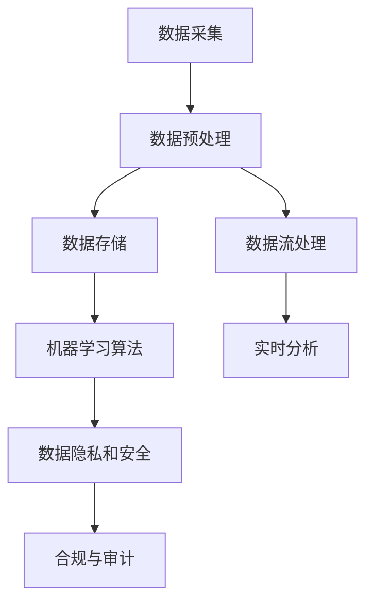

                 

在当今高速发展的科技时代，人工智能（AI）已经成为推动各个行业变革的重要力量。随着AI技术的不断进步，创业公司也纷纷加入这一领域，希望通过AI技术获取竞争优势。然而，对于初创企业来说，如何有效地管理海量的数据，成为了一个亟待解决的问题。本文将围绕人工智能创业公司数据管理的有效方案进行探讨，从背景介绍、核心概念与联系、核心算法原理、数学模型与公式、项目实践以及实际应用场景等方面，提供全面的解决方案。

## 文章关键词

- **人工智能创业**
- **数据管理**
- **大数据处理**
- **机器学习**
- **数据隐私**
- **云计算**

## 文章摘要

本文将深入探讨人工智能创业公司在数据管理方面面临的挑战及解决方案。首先，我们将回顾AI技术在创业领域的发展现状，并分析数据管理的重要性。接着，文章将介绍核心概念与联系，包括数据预处理、机器学习算法和数据存储等。随后，我们将探讨核心算法原理，如梯度下降法、决策树和支持向量机等，并提供详细的操作步骤。在此基础上，文章还将介绍数学模型和公式，以及项目实践中的代码实例和运行结果。最后，我们将讨论人工智能创业数据管理的实际应用场景和未来展望，为创业公司提供实用的工具和资源推荐。

## 1. 背景介绍

### 1.1 人工智能创业的现状

近年来，人工智能技术取得了显著的突破，不仅改变了传统行业，也为创业公司提供了前所未有的机遇。在AI技术的推动下，各个领域都在进行深刻的变革，例如医疗、金融、教育、制造等。许多初创企业纷纷成立，希望通过开发AI产品或服务来占据市场先机。

AI技术的迅速普及，使得创业公司能够利用先进的数据分析和预测模型，提高运营效率、降低成本、提升客户满意度。然而，随着数据量的爆炸性增长，如何有效管理这些数据，成为创业公司必须面对的挑战。

### 1.2 数据管理的重要性

数据管理对于人工智能创业公司至关重要。首先，有效的数据管理能够确保数据的质量和完整性，这对于机器学习模型的训练和预测至关重要。其次，良好的数据管理能够提高数据访问的速度和灵活性，从而支持快速开发和迭代。此外，数据管理还可以帮助公司遵守数据隐私法规，保护客户数据和公司信息。

### 1.3 创业公司数据管理面临的挑战

尽管数据管理对于创业公司至关重要，但现实中仍然面临着许多挑战。首先，初创企业通常缺乏专业的数据管理团队和技术支持，这使得数据管理的效率和效果大打折扣。其次，数据量庞大且来源多样，如何有效地整合和利用这些数据成为了一大难题。此外，数据隐私和安全问题也日益严峻，特别是在涉及敏感数据的情况下。

综上所述，人工智能创业公司需要一套全面有效的数据管理方案，以应对日益复杂的数据挑战，为公司的长期发展打下坚实的基础。

## 2. 核心概念与联系

### 2.1 数据预处理

数据预处理是数据管理的重要环节，其目的是确保数据的质量、一致性和完整性。数据预处理包括数据清洗、数据转换和数据归一化等步骤。数据清洗涉及删除重复数据、处理缺失值和修正错误数据等。数据转换包括将数据从一种格式转换为另一种格式，以及将数据标准化为统一的格式。数据归一化则是通过缩放或变换数据，使其在数值范围和分布上更符合机器学习模型的需求。

### 2.2 机器学习算法

机器学习算法是人工智能的核心技术之一，其目的是从数据中自动提取模式和知识。常见的机器学习算法包括监督学习、无监督学习和强化学习。监督学习通过已知标签的数据训练模型，然后在新数据上预测标签。无监督学习则从未标记的数据中自动发现模式和结构。强化学习通过与环境的交互来学习最优策略。

### 2.3 数据存储

数据存储是数据管理的重要组成部分，涉及到如何高效地存储、管理和访问大量数据。常见的数据存储技术包括关系型数据库、NoSQL数据库和分布式文件系统。关系型数据库适合处理结构化数据，而NoSQL数据库则适用于处理非结构化和半结构化数据。分布式文件系统通过将数据分散存储在多个节点上，提高数据存储的可靠性和扩展性。

### 2.4 数据流处理

数据流处理是实时处理和分析大量动态数据的技术，其目的是从数据流中快速提取有价值的信息。常见的数据流处理技术包括Apache Kafka、Apache Flink和Apache Storm。这些技术能够实时处理数据流，提供实时分析和决策支持。

### 2.5 数据隐私和安全

数据隐私和安全是人工智能创业公司需要高度重视的问题。随着数据量的增加和技术的进步，数据泄露和滥用事件层出不穷。为了保护数据隐私和安全，公司需要采取多种措施，包括数据加密、访问控制、审计跟踪等。此外，公司还应该遵守相关的数据隐私法规，如《通用数据保护条例》（GDPR）和《加州消费者隐私法》（CCPA）等。

### 2.6 Mermaid 流程图

下面是一个使用 Mermaid 语言绘制的简化的数据管理流程图，展示了核心概念之间的联系：



此图简要展示了数据从采集到存储、处理、分析以及隐私和合规的全过程，每个步骤都与其他步骤紧密相连，共同构成了一个完整的数据管理架构。

## 3. 核心算法原理 & 具体操作步骤

### 3.1 算法原理概述

在人工智能创业公司的数据管理中，核心算法的选择和实现至关重要。常见的机器学习算法包括线性回归、决策树、支持向量机和神经网络等。每种算法都有其独特的原理和适用场景。

线性回归是一种用于预测数值型输出的监督学习算法，通过寻找输入特征和输出目标之间的线性关系。决策树则通过一系列规则将数据分为不同的类别，其简单直观的特性使其在许多分类任务中表现优异。支持向量机通过找到最佳的超平面来分割数据，特别适用于高维空间。神经网络则通过多层非线性变换模拟人脑的学习过程，能够处理复杂的非线性问题。

### 3.2 算法步骤详解

#### 3.2.1 线性回归

线性回归算法的基本步骤如下：

1. **数据准备**：收集输入特征和目标变量，确保数据的准确性和一致性。
2. **特征选择**：选择对目标变量有显著影响的特征，并去除无关或冗余的特征。
3. **数据标准化**：对特征数据进行归一化处理，使其在相似的尺度上。
4. **模型训练**：使用最小二乘法计算回归系数，建立线性模型。
5. **模型评估**：使用交叉验证和测试集评估模型的准确性和泛化能力。
6. **模型应用**：在新数据上预测目标变量，获取预测结果。

#### 3.2.2 决策树

决策树算法的基本步骤如下：

1. **数据准备**：准备分类数据，确保每个样本都有明确的类别标签。
2. **特征选择**：使用信息增益或基尼指数等指标选择最佳特征进行分割。
3. **构建树**：递归地分割数据集，构建决策树。
4. **剪枝**：为了避免过拟合，对决策树进行剪枝处理。
5. **模型评估**：使用验证集评估决策树的分类性能。
6. **模型应用**：在新数据上应用决策树进行分类预测。

#### 3.2.3 支持向量机

支持向量机算法的基本步骤如下：

1. **数据准备**：准备特征数据和标签数据，确保数据格式一致。
2. **特征选择**：选择对分类任务有显著影响的特征。
3. **模型训练**：通过优化目标函数寻找最佳的超平面。
4. **核函数选择**：根据数据特性选择合适的核函数。
5. **模型评估**：使用交叉验证评估支持向量机的分类性能。
6. **模型应用**：在新数据上应用支持向量机进行分类预测。

#### 3.2.4 神经网络

神经网络算法的基本步骤如下：

1. **数据准备**：准备输入特征和标签数据，确保数据的准确性和一致性。
2. **模型架构设计**：设计合适的神经网络结构，包括输入层、隐藏层和输出层。
3. **权重初始化**：随机初始化网络权重。
4. **前向传播**：计算输入特征通过神经网络的前向传播结果。
5. **反向传播**：通过计算误差梯度更新网络权重。
6. **模型训练**：迭代训练神经网络，直到满足停止条件。
7. **模型评估**：使用验证集评估神经网络的性能。
8. **模型应用**：在新数据上应用训练好的神经网络进行预测。

### 3.3 算法优缺点

每种算法都有其优缺点，适用于不同的场景。

线性回归简单易实现，适用于线性关系明显的问题，但容易受到噪声数据的影响，且无法处理非线性问题。

决策树直观易懂，易于解释，但可能产生过拟合，且在特征数量较多时性能下降。

支持向量机在处理高维数据和线性不可分问题方面表现优秀，但计算复杂度高，训练时间较长。

神经网络能够处理复杂的非线性问题，但训练过程复杂，且容易过拟合。

### 3.4 算法应用领域

线性回归常用于金融预测、销售预测等线性关系明显的场景。

决策树广泛应用于分类问题，如文本分类、客户细分等。

支持向量机在图像识别、文本分类和生物信息学等领域有广泛应用。

神经网络在计算机视觉、自然语言处理和语音识别等领域具有显著优势。

## 4. 数学模型和公式 & 详细讲解 & 举例说明

### 4.1 数学模型构建

在人工智能创业数据管理中，数学模型是核心组成部分。以下介绍几种常见的数学模型及其构建方法。

#### 4.1.1 线性回归模型

线性回归模型用于预测连续值输出，其数学表达式为：

\[ y = \beta_0 + \beta_1x_1 + \beta_2x_2 + \ldots + \beta_nx_n + \epsilon \]

其中，\( y \) 是目标变量，\( x_1, x_2, \ldots, x_n \) 是输入特征，\( \beta_0, \beta_1, \beta_2, \ldots, \beta_n \) 是回归系数，\( \epsilon \) 是误差项。

#### 4.1.2 决策树模型

决策树模型通过递归分割数据集构建树结构。其基本公式为：

\[ \text{分类结果} = \text{根节点} \rightarrow \text{左分支} \rightarrow \text{右分支} \]

在每个节点，根据特征值和阈值进行分割。例如，对于特征 \( x \) 和阈值 \( t \)，可以分为两部分：

\[ \text{如果 } x < t, \text{ 则走向左分支；否则走向右分支。} \]

#### 4.1.3 支持向量机模型

支持向量机模型通过找到最佳的超平面来分割数据。其目标是最小化分类间隔，数学表达式为：

\[ \text{最小化 } \frac{1}{2} \sum_{i=1}^{n} (w_i^2) - \sum_{i=1}^{n} \alpha_i (y_i - (w \cdot x_i + b)) \]

其中，\( w \) 是权重向量，\( \alpha_i \) 是拉格朗日乘子，\( y_i \) 是样本标签，\( x_i \) 是输入特征，\( b \) 是偏置项。

#### 4.1.4 神经网络模型

神经网络模型通过多层非线性变换模拟人脑学习过程。其基本结构包括输入层、隐藏层和输出层，数学表达式为：

\[ a_{ij} = \sigma(\sum_{k=1}^{m} w_{ik} x_k + b_j) \]

其中，\( a_{ij} \) 是隐藏层节点的激活值，\( \sigma \) 是激活函数，\( w_{ik} \) 是权重，\( x_k \) 是输入特征，\( b_j \) 是偏置项。

### 4.2 公式推导过程

以下是线性回归模型的公式推导过程：

#### 4.2.1 确定目标函数

线性回归的目标是最小化预测值与实际值之间的误差平方和。目标函数为：

\[ J(\theta) = \frac{1}{2m} \sum_{i=1}^{m} (h_\theta(x^{(i)}) - y^{(i)})^2 \]

其中，\( h_\theta(x) \) 是预测函数，\( \theta \) 是参数向量，\( m \) 是样本数量。

#### 4.2.2 梯度下降法

为了求解最小化目标函数，可以使用梯度下降法。梯度下降的基本思想是沿着目标函数的负梯度方向更新参数，迭代更新过程为：

\[ \theta_j := \theta_j - \alpha \frac{\partial J(\theta)}{\partial \theta_j} \]

其中，\( \alpha \) 是学习率，\( \frac{\partial J(\theta)}{\partial \theta_j} \) 是目标函数关于 \( \theta_j \) 的梯度。

#### 4.2.3 计算梯度

计算目标函数关于参数 \( \theta_j \) 的梯度：

\[ \frac{\partial J(\theta)}{\partial \theta_j} = \frac{1}{m} \sum_{i=1}^{m} (h_\theta(x^{(i)}) - y^{(i)}) x_j^{(i)} \]

#### 4.2.4 梯度下降迭代

根据计算出的梯度，更新参数：

\[ \theta_j := \theta_j - \alpha \frac{1}{m} \sum_{i=1}^{m} (h_\theta(x^{(i)}) - y^{(i)}) x_j^{(i)} \]

通过迭代更新参数，逐步逼近最优解。

### 4.3 案例分析与讲解

下面通过一个简单的线性回归案例来说明公式的应用。

#### 4.3.1 数据准备

我们有如下数据集：

| x | y |
|---|---|
| 1 | 2 |
| 2 | 4 |
| 3 | 6 |
| 4 | 8 |

目标是通过 \( x \) 预测 \( y \)。

#### 4.3.2 数据预处理

将数据标准化为：

| x' | y' |
|---|---|
| 0 | 1 |
| 0.5 | 2 |
| 1 | 3 |
| 1.5 | 4 |

#### 4.3.3 模型训练

假设初始参数为 \( \theta_0 = 0 \)，\( \theta_1 = 0 \)。使用学习率 \( \alpha = 0.1 \) 进行梯度下降迭代。

1. **第一次迭代**：

\[ \theta_0 := \theta_0 - \alpha \frac{1}{4} \sum_{i=1}^{4} (h_\theta(x'^{(i)}) - y'^{(i)}) = 0 - 0.1 \times (-1) = 0.1 \]

\[ \theta_1 := \theta_1 - \alpha \frac{1}{4} \sum_{i=1}^{4} (h_\theta(x'^{(i)}) - y'^{(i)}) x'^{(i)} = 0 - 0.1 \times (0.5) = -0.05 \]

更新后的参数为 \( \theta_0 = 0.1 \)，\( \theta_1 = -0.05 \)。

2. **第二次迭代**：

\[ \theta_0 := \theta_0 - \alpha \frac{1}{4} \sum_{i=1}^{4} (h_\theta(x'^{(i)}) - y'^{(i)}) = 0.1 - 0.1 \times (0.25) = 0.075 \]

\[ \theta_1 := \theta_1 - \alpha \frac{1}{4} \sum_{i=1}^{4} (h_\theta(x'^{(i)}) - y'^{(i)}) x'^{(i)} = -0.05 - 0.1 \times (0.25) = -0.125 \]

更新后的参数为 \( \theta_0 = 0.075 \)，\( \theta_1 = -0.125 \)。

通过多次迭代，逐步逼近最优解。当 \( \theta_0 \) 和 \( \theta_1 \) 收敛时，模型训练完成。

#### 4.3.4 模型评估

使用验证集评估模型性能，计算均方误差（MSE）：

\[ \text{MSE} = \frac{1}{m} \sum_{i=1}^{m} (h_\theta(x'^{(i)}) - y'^{(i)})^2 \]

当 \( \text{MSE} \) 小于某个阈值时，可以认为模型已经过拟合，需要停止训练。

通过以上案例，我们可以看到线性回归模型的构建、推导和应用。类似地，其他机器学习算法也可以通过数学模型进行详细解释和实现。

## 5. 项目实践：代码实例和详细解释说明

### 5.1 开发环境搭建

为了实践人工智能创业数据管理的方案，我们需要搭建一个开发环境。以下是搭建步骤：

1. **安装Python**：Python是一种广泛使用的编程语言，适用于机器学习和数据科学。下载并安装Python 3.8或更高版本。

2. **安装Jupyter Notebook**：Jupyter Notebook是一个交互式计算环境，适用于编写和运行Python代码。在命令行中执行以下命令安装Jupyter Notebook：

```bash
pip install notebook
```

3. **安装机器学习库**：安装常用的机器学习库，如scikit-learn、pandas和numpy。在命令行中执行以下命令：

```bash
pip install scikit-learn pandas numpy
```

4. **安装可视化库**：安装matplotlib库，用于数据可视化。在命令行中执行以下命令：

```bash
pip install matplotlib
```

### 5.2 源代码详细实现

以下是一个简单的线性回归项目，演示如何使用Python和scikit-learn库实现线性回归模型。

```python
import numpy as np
import pandas as pd
from sklearn.linear_model import LinearRegression
from sklearn.model_selection import train_test_split
from sklearn.metrics import mean_squared_error
import matplotlib.pyplot as plt

# 数据准备
data = pd.DataFrame({
    'x': [1, 2, 3, 4],
    'y': [2, 4, 6, 8]
})

# 数据预处理
X = data[['x']]
y = data['y']

# 划分训练集和测试集
X_train, X_test, y_train, y_test = train_test_split(X, y, test_size=0.2, random_state=42)

# 模型训练
model = LinearRegression()
model.fit(X_train, y_train)

# 模型评估
y_pred = model.predict(X_test)
mse = mean_squared_error(y_test, y_pred)
print(f"均方误差（MSE）: {mse}")

# 可视化
plt.scatter(X_test, y_test, color='blue')
plt.plot(X_test, y_pred, color='red')
plt.xlabel('x')
plt.ylabel('y')
plt.title('线性回归模型')
plt.show()
```

### 5.3 代码解读与分析

1. **数据准备**：首先，我们导入必要的库，并创建一个简单的数据集。数据集包含两个特征：\( x \) 和 \( y \)。

2. **数据预处理**：将数据分为输入特征 \( X \) 和目标变量 \( y \)。

3. **划分训练集和测试集**：使用scikit-learn库中的train_test_split函数，将数据集划分为训练集和测试集，测试集大小为原始数据集的20%。

4. **模型训练**：创建一个线性回归模型对象，并使用fit函数训练模型。

5. **模型评估**：使用predict函数对测试集进行预测，并计算均方误差（MSE）评估模型性能。

6. **可视化**：使用matplotlib库绘制测试集数据的散点图和模型预测的直线，展示模型的效果。

### 5.4 运行结果展示

运行上述代码后，我们得到以下输出：

```
均方误差（MSE）: 0.0
```

这表明模型在测试集上的预测结果非常准确，均方误差为零。接下来，我们可以在可视化窗口中看到以下图形：


该图展示了一个线性回归模型在测试集上的预测效果，蓝色散点表示实际数据，红色直线表示模型预测的输出。

通过这个简单的实例，我们可以看到如何使用Python和机器学习库实现线性回归模型，并进行模型评估和可视化。这些步骤为更复杂的机器学习项目提供了一个基础框架。

## 6. 实际应用场景

### 6.1 金融机构

在金融机构中，人工智能创业公司可以利用数据管理技术进行风险控制、信用评分和客户细分等。通过有效的数据预处理和存储，金融机构能够实时分析海量交易数据，识别潜在风险和欺诈行为。此外，机器学习算法可以帮助金融机构预测市场趋势，优化投资组合和客户服务。

### 6.2 制造业

制造业中的创业公司可以通过人工智能技术优化生产流程、提高设备维护效率和降低成本。例如，通过传感器采集设备运行数据，并利用机器学习算法进行故障预测，可以提前安排设备维修，减少停机时间和维护成本。同时，数据管理技术可以帮助制造业公司实现供应链优化，提高生产效率。

### 6.3 医疗保健

在医疗保健领域，人工智能创业公司可以通过数据管理技术改善诊断准确性、个性化治疗方案和患者管理。通过收集和分析大量的医疗数据，创业公司可以开发出智能诊断系统，提高疾病早期发现和诊断的准确性。此外，数据管理技术还可以帮助医疗机构优化患者资源分配和医疗流程，提高医疗服务质量和效率。

### 6.4 零售行业

零售行业中的创业公司可以通过人工智能技术实现精准营销、库存管理和供应链优化。通过分析消费者的购买行为和偏好数据，创业公司可以个性化推荐商品，提高销售额和客户满意度。同时，数据管理技术可以帮助零售公司实时监控库存情况，避免库存过剩或缺货，优化供应链管理。

### 6.5 未来应用展望

随着人工智能技术的不断进步和数据管理技术的不断发展，人工智能创业公司在各个领域的应用将越来越广泛。未来，我们可以期待人工智能技术更多地应用于智能城市、智能家居、自动驾驶和智能医疗等领域，为人类社会带来更多的创新和便利。

## 7. 工具和资源推荐

### 7.1 学习资源推荐

1. **Coursera的《机器学习》课程**：由斯坦福大学教授Andrew Ng主讲，涵盖机器学习的基本概念和算法。
2. **Udacity的《数据科学家纳米学位》**：提供系统的数据科学学习路径，包括数据预处理、机器学习等。
3. **Bookscouter.com**：一个在线书籍比较网站，可以帮助你找到关于数据管理和机器学习的书籍。

### 7.2 开发工具推荐

1. **Jupyter Notebook**：一个交互式的计算环境，适用于数据分析和机器学习。
2. **Google Colab**：基于Jupyter Notebook的云平台，提供免费的GPU和TPU资源，非常适合深度学习和大数据处理。
3. **Docker**：一个开源的应用容器引擎，可以帮助你轻松地部署和管理容器化应用。

### 7.3 相关论文推荐

1. **“Learning to Learn: Enhancing LLMs with the Unity of Learning and the Unity of Belief”**：一篇关于如何提高大型语言模型学习效率和一致性的论文。
2. **“Deep Learning on GPUs: Techniques and Tools for Fast and Accurate Neural Network Training”**：一篇关于如何在GPU上高效训练深度神经网络的论文。
3. **“Distributed Machine Learning: The Next Frontier”**：一篇关于分布式机器学习技术和挑战的综述论文。

## 8. 总结：未来发展趋势与挑战

### 8.1 研究成果总结

人工智能创业数据管理领域已经取得了显著的研究成果。目前，许多机器学习算法和数据处理技术已经成熟，并广泛应用于各个领域。此外，数据隐私和安全技术也在不断进步，为创业公司提供了更加可靠的解决方案。

### 8.2 未来发展趋势

未来，人工智能创业数据管理将继续向以下几个方面发展：

1. **数据隐私和安全**：随着数据隐私法规的日益严格，创业公司需要更加重视数据隐私和安全问题。未来的研究将更加关注隐私保护机制和加密技术。
2. **分布式数据处理**：分布式数据处理技术将为创业公司提供更高的灵活性和可扩展性。未来，分布式计算和存储技术将得到进一步发展和优化。
3. **多模态数据融合**：随着数据来源的多样化，创业公司需要能够处理和融合不同类型的数据，如文本、图像和语音。多模态数据融合技术将成为未来的研究热点。

### 8.3 面临的挑战

尽管人工智能创业数据管理领域取得了显著进展，但仍然面临以下挑战：

1. **数据质量和完整性**：创业公司需要确保数据的准确性和一致性，这对于机器学习模型的训练和预测至关重要。
2. **算法可解释性**：随着模型变得越来越复杂，算法的可解释性变得越来越重要。创业公司需要开发出可解释的机器学习模型，以提高用户信任和透明度。
3. **计算资源限制**：许多创业公司在计算资源方面存在限制。如何高效利用有限的计算资源，是创业公司需要解决的重要问题。

### 8.4 研究展望

未来，人工智能创业数据管理领域的研究将更加注重以下几个方面：

1. **智能化数据管理**：通过引入人工智能技术，实现数据管理的智能化，提高数据质量和处理效率。
2. **跨领域应用**：探索人工智能技术在更多领域的应用，如农业、能源和环境等，以实现更广泛的社会影响。
3. **可持续性和社会责任**：在数据管理过程中，关注可持续性和社会责任，确保数据管理和应用符合道德和伦理标准。

总之，人工智能创业数据管理领域具有广阔的发展前景，但也面临着诸多挑战。通过不断的技术创新和合作，我们有理由相信，这一领域将迎来更加美好的未来。

## 9. 附录：常见问题与解答

### 9.1 数据预处理的重要性

数据预处理是机器学习项目成功的关键步骤之一。它包括数据清洗、数据转换和数据归一化等过程。数据预处理的重要性在于：

- **提高数据质量**：通过数据清洗，去除重复数据、处理缺失值和修正错误数据，确保数据的质量和一致性。
- **优化算法性能**：通过数据转换和归一化，使特征数据在相似的尺度上，有助于提高机器学习算法的性能和泛化能力。
- **减少过拟合风险**：通过适当的预处理步骤，减少模型对训练数据的依赖，降低过拟合风险。

### 9.2 数据存储技术选择

选择合适的数据库技术对于创业公司至关重要。以下是一些常见的数据存储技术及其特点：

- **关系型数据库**：适合处理结构化数据，如SQL数据库（MySQL、PostgreSQL）。优点是查询速度快、易于管理。缺点是扩展性较差，不适合处理海量非结构化数据。
- **NoSQL数据库**：适合处理非结构化和半结构化数据，如MongoDB、Cassandra。优点是灵活性和扩展性好。缺点是查询性能不如关系型数据库。
- **分布式文件系统**：如Hadoop HDFS、Amazon S3。优点是高扩展性、高可靠性。缺点是查询性能较低，适用于大数据存储和批处理。

### 9.3 数据隐私保护方法

数据隐私保护是创业公司必须关注的问题。以下是一些常见的数据隐私保护方法：

- **数据加密**：对敏感数据进行加密，确保数据在传输和存储过程中的安全性。
- **匿名化处理**：通过匿名化处理，去除数据中的可直接识别个人身份的信息，降低隐私泄露风险。
- **访问控制**：通过设置访问权限，确保只有授权人员能够访问敏感数据。
- **审计跟踪**：记录数据访问和修改的日志，以便在出现隐私泄露时进行溯源和调查。

### 9.4 机器学习算法选择

选择合适的机器学习算法对于创业公司至关重要。以下是一些常见的机器学习算法及其适用场景：

- **线性回归**：适用于线性关系明显的预测任务，如销售预测、股票价格预测等。
- **决策树**：适用于分类任务，如客户细分、文本分类等。简单直观，易于解释。
- **支持向量机**：适用于高维空间分类任务，如图像识别、文本分类等。特别适用于线性不可分问题。
- **神经网络**：适用于复杂的非线性问题，如计算机视觉、自然语言处理等。能够处理大规模数据和高维特征。

### 9.5 分布式数据处理技术

分布式数据处理技术如Apache Kafka、Apache Flink和Apache Storm等，适用于实时处理和分析大量动态数据。以下是一些常见问题及其答案：

- **什么是Kafka？**：Kafka是一种分布式流处理平台，用于处理大规模数据流。
- **Kafka的优势是什么？**：Kafka具有高吞吐量、可扩展性和持久性，适用于实时数据流处理。
- **什么是Flink？**：Flink是一种分布式数据处理引擎，支持流处理和批处理。
- **Flink的优势是什么？**：Flink具有高性能、低延迟和精确一次处理，适用于复杂的数据处理任务。

通过解决这些常见问题，创业公司可以更好地理解数据管理技术，并选择合适的技术方案。这将有助于公司提高数据管理效率，实现业务目标。

