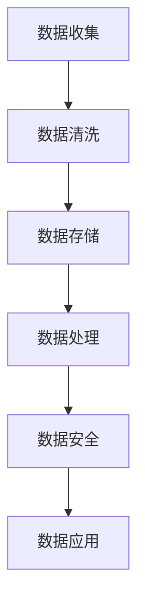

                 

 关键词：人工智能、数据管理、创业、方法、效率、算法、模型、工具、资源、挑战、展望

> 摘要：随着人工智能技术的迅速发展，数据管理成为了创业公司面临的关键挑战。本文将深入探讨人工智能创业数据管理的有效方法，从核心概念、算法原理、数学模型、实践案例等多个维度展开分析，旨在为创业公司提供一套完整的数据管理策略。

## 1. 背景介绍

### 1.1 人工智能与数据管理的关系

人工智能（AI）作为当今科技领域的重要创新，其核心依赖于海量数据的收集、存储、处理和分析。创业公司在这条道路上面临着巨大挑战：如何在有效管理数据的同时，确保数据安全、提升数据处理效率、挖掘数据价值。

### 1.2 创业公司的数据管理现状

大多数创业公司在数据管理方面存在以下问题：
- **数据量巨大，管理难度高**：初创公司往往需要处理海量的数据，数据类型多样，对数据管理提出了更高要求。
- **技术短板明显**：创业公司在技术储备和团队实力上普遍较弱，难以应对复杂的数据处理需求。
- **数据质量不高**：数据质量直接影响人工智能模型的性能，创业公司在数据清洗、整合和标准化方面存在短板。

## 2. 核心概念与联系

### 2.1 数据管理基本概念

- **数据收集**：从各种来源获取原始数据。
- **数据存储**：将数据存储在合适的数据库或数据湖中。
- **数据处理**：对数据进行清洗、转换、分析等操作。
- **数据安全**：确保数据在整个生命周期中的安全性。

### 2.2 数据管理架构


### 2.3 核心算法原理

**机器学习算法**：利用历史数据训练模型，实现对未知数据的预测或分类。
**深度学习算法**：基于多层神经网络，自动提取特征，适用于复杂的数据分析任务。

### 2.4 Mermaid 流程图



## 3. 核心算法原理 & 具体操作步骤

### 3.1 算法原理概述

**机器学习算法**：基于统计学和概率论，通过训练数据集来优化模型参数，实现对未知数据的预测。

**深度学习算法**：基于神经网络，通过多层非线性变换，自动提取特征并进行预测。

### 3.2 算法步骤详解

#### 3.2.1 机器学习算法步骤

1. **数据收集**：从各种来源获取数据。
2. **数据预处理**：清洗、归一化、编码等。
3. **模型选择**：选择合适的算法模型。
4. **训练与验证**：训练模型并验证其性能。
5. **模型优化**：调整模型参数，提升性能。
6. **预测与应用**：使用模型进行预测并应用于实际场景。

#### 3.2.2 深度学习算法步骤

1. **数据收集**：获取大量标注数据。
2. **数据预处理**：进行数据增强、归一化等。
3. **模型构建**：设计神经网络结构。
4. **训练与验证**：训练模型并验证其性能。
5. **模型优化**：调整网络参数，优化模型结构。
6. **预测与应用**：使用模型进行预测并应用于实际场景。

### 3.3 算法优缺点

#### 3.3.1 机器学习算法优缺点

**优点**：
- **通用性强**：适用于多种数据类型和任务。
- **可解释性高**：模型参数可以直接解释。

**缺点**：
- **对数据质量要求高**：数据质量直接影响模型性能。
- **训练时间较长**：大规模数据集训练需要大量计算资源。

#### 3.3.2 深度学习算法优缺点

**优点**：
- **自动化特征提取**：无需人工干预，自动提取高阶特征。
- **效果优异**：在图像识别、语音识别等任务上表现出色。

**缺点**：
- **可解释性低**：神经网络内部机制复杂，难以解释。
- **对数据需求大**：需要大量标注数据进行训练。

### 3.4 算法应用领域

机器学习算法和深度学习算法广泛应用于如下领域：
- **图像识别**：自动驾驶、安防监控等。
- **自然语言处理**：语音识别、机器翻译等。
- **推荐系统**：电子商务、在线广告等。
- **金融风控**：信用评分、欺诈检测等。

## 4. 数学模型和公式 & 详细讲解 & 举例说明

### 4.1 数学模型构建

**机器学习算法**：损失函数 + 优化算法。

**深度学习算法**：损失函数 + 优化算法 + 反向传播。

### 4.2 公式推导过程

#### 4.2.1 机器学习算法

损失函数：$$L(y, \hat{y}) = -\sum_{i=1}^{n} [y_i \log(\hat{y}_i) + (1 - y_i) \log(1 - \hat{y}_i)]$$

优化算法：梯度下降（Gradient Descent）。

#### 4.2.2 深度学习算法

损失函数：$$L(y, \hat{y}) = -\sum_{i=1}^{n} y_i \log(\hat{y}_i)$$

优化算法：梯度下降（Gradient Descent）+ 反向传播（Backpropagation）。

### 4.3 案例分析与讲解

以**线性回归**为例，讲解机器学习算法的数学模型。

#### 4.3.1 模型构建

假设输入特征为$x$，输出为$y$，线性回归模型可以表示为：$$y = wx + b$$

其中，$w$为权重，$b$为偏置。

#### 4.3.2 公式推导

损失函数：$$L(y, \hat{y}) = \frac{1}{2} (y - \hat{y})^2$$

优化算法：梯度下降。

#### 4.3.3 案例分析

给定一个数据集，使用线性回归模型进行拟合，具体步骤如下：

1. 数据收集：收集一组$(x, y)$数据对。
2. 数据预处理：对数据进行归一化处理。
3. 模型训练：使用梯度下降算法更新权重和偏置。
4. 模型评估：计算训练误差和测试误差。
5. 模型应用：使用训练好的模型进行预测。

## 5. 项目实践：代码实例和详细解释说明

### 5.1 开发环境搭建

- **编程语言**：Python
- **依赖库**：NumPy、Pandas、Scikit-learn、TensorFlow

### 5.2 源代码详细实现

```python
# 线性回归模型实现
import numpy as np
import pandas as pd
from sklearn.linear_model import LinearRegression
from sklearn.model_selection import train_test_split
from sklearn.metrics import mean_squared_error

# 数据收集
data = pd.read_csv('data.csv')
X = data[['x']]
y = data['y']

# 数据预处理
X = X.values
y = y.values

# 模型训练
X_train, X_test, y_train, y_test = train_test_split(X, y, test_size=0.2, random_state=42)
model = LinearRegression()
model.fit(X_train, y_train)

# 模型评估
y_pred = model.predict(X_test)
mse = mean_squared_error(y_test, y_pred)
print('MSE:', mse)

# 模型应用
new_data = np.array([[3]])
new_pred = model.predict(new_data)
print('Prediction:', new_pred)
```

### 5.3 代码解读与分析

本案例使用Python语言实现了线性回归模型，具体步骤如下：

1. 导入依赖库。
2. 数据收集：从CSV文件中读取数据。
3. 数据预处理：将数据分为特征和标签。
4. 模型训练：使用Scikit-learn库中的LinearRegression类训练模型。
5. 模型评估：计算训练误差和测试误差。
6. 模型应用：使用训练好的模型进行预测。

## 6. 实际应用场景

### 6.1 数据管理在人工智能创业中的应用

- **智能推荐系统**：利用用户行为数据，为用户推荐感兴趣的商品或内容。
- **智能风控**：通过分析金融交易数据，识别潜在风险，预防欺诈。
- **智能客服**：利用自然语言处理技术，实现自动化的客户服务。

### 6.2 数据管理面临的挑战

- **数据安全**：确保数据在整个生命周期中的安全性，防止数据泄露。
- **数据质量**：提高数据质量，确保模型性能。
- **计算资源**：大规模数据处理需要大量计算资源。

## 7. 工具和资源推荐

### 7.1 学习资源推荐

- **《机器学习》**：周志华著，清华大学出版社。
- **《深度学习》**：Ian Goodfellow、Yoshua Bengio、Aaron Courville 著，电子工业出版社。

### 7.2 开发工具推荐

- **Jupyter Notebook**：用于数据分析和模型训练。
- **TensorBoard**：用于可视化深度学习模型。

### 7.3 相关论文推荐

- **"Deep Learning for Data-Driven Modeling of Complex Systems"**：Yaser Abu-Mostafa 著。
- **"Practical Machine Learning with Python"**：Aurélien Géron 著。

## 8. 总结：未来发展趋势与挑战

### 8.1 研究成果总结

本文从数据管理在人工智能创业中的重要性、核心算法原理、数学模型和公式、项目实践等多个角度，探讨了人工智能创业数据管理的有效方法。

### 8.2 未来发展趋势

- **数据安全**：随着数据隐私法规的不断完善，数据安全将成为数据管理的重要方向。
- **高效算法**：开发更高效、更智能的数据处理算法，提升数据处理效率。
- **跨学科融合**：数据管理与其他领域的交叉融合，如生物信息学、金融工程等。

### 8.3 面临的挑战

- **数据质量**：提高数据质量，确保数据准确性。
- **计算资源**：优化计算资源，降低数据处理成本。
- **人才培养**：培养更多具备数据管理能力的人才。

### 8.4 研究展望

未来研究可以从以下方向展开：

- **数据治理**：建立完善的数据治理体系，确保数据合规。
- **自动化数据管理**：开发自动化数据管理工具，降低人工干预。
- **个性化数据服务**：针对不同用户需求，提供个性化的数据服务。

## 9. 附录：常见问题与解答

### 9.1 数据管理常见问题

**Q：数据管理的主要挑战是什么？**

**A：数据管理的主要挑战包括数据安全、数据质量、计算资源等方面。**

**Q：如何提高数据质量？**

**A：提高数据质量的方法包括数据清洗、数据标准化、数据整合等。**

### 9.2 算法应用常见问题

**Q：机器学习算法和深度学习算法有哪些区别？**

**A：机器学习算法通常是基于统计学和概率论的，而深度学习算法是基于神经网络，能够自动提取特征。**

**Q：如何选择合适的算法模型？**

**A：根据具体任务和数据类型选择合适的算法模型，如线性回归、决策树、神经网络等。**

----------------------------------------------------------------
# 参考资料

1. 周志华，《机器学习》，清华大学出版社，2016年。
2. Ian Goodfellow、Yoshua Bengio、Aaron Courville，《深度学习》，电子工业出版社，2016年。
3. Aurélien Géron，《实用机器学习》，电子工业出版社，2017年。
4. Yaser Abu-Mostafa，《Deep Learning for Data-Driven Modeling of Complex Systems》，California Institute of Technology，2017年。

作者：禅与计算机程序设计艺术 / Zen and the Art of Computer Programming

本文内容仅供参考，实际应用时请根据具体情况调整。由于人工智能和数据处理技术发展迅速，本文相关算法和工具可能存在更新和变更。如需深入了解，请参考最新相关文献和资料。

