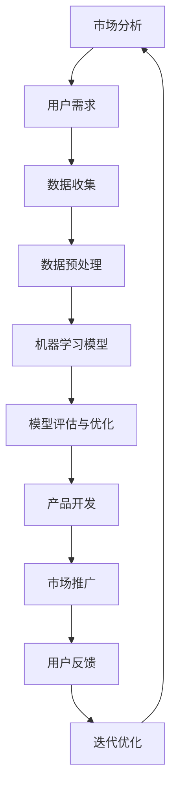

                 

关键词：人工智能、商业模式、创业、技术、创新、市场分析、风险投资、数据分析

> 摘要：本文旨在探讨人工智能（AI）在创业领域的应用，通过分析不同类型的商业模式，为创业者提供有价值的参考和指导。我们将深入探讨AI技术的核心原理、数学模型，并通过实际项目案例和代码示例，阐述其在各个应用领域的优势和挑战。同时，本文还将展望AI创业的未来发展趋势，并推荐一些实用的学习资源和工具。

## 1. 背景介绍

近年来，人工智能（AI）技术取得了飞速发展，从深度学习到自然语言处理，从计算机视觉到机器人技术，AI的应用场景越来越广泛。与此同时，创业市场也变得愈发繁荣。众多创业者瞄准了AI技术，试图通过创新的商业模式来获取市场机遇。然而，AI创业并非易事，如何在竞争激烈的市场中脱颖而出，成为许多创业者面临的挑战。

本文将围绕人工智能创业的商业模式进行分析。我们将首先介绍一些常见的商业模式，然后探讨AI技术在这些模式中的应用，并分析其优缺点。最后，我们将展望AI创业的未来，并提出一些实用的建议和资源。

## 2. 核心概念与联系

在探讨AI商业模式之前，我们首先需要了解一些核心概念。以下是几个关键概念及其相互关系的Mermaid流程图：



### 2.1 市场分析

市场分析是创业的第一步，它涉及到对目标市场的深入了解。这包括用户需求分析、竞争对手分析、市场趋势预测等。通过市场分析，创业者可以确定产品的市场定位、定价策略和营销策略。

### 2.2 用户需求

用户需求是商业模式的起点。了解用户的需求和痛点，可以帮助创业者开发出符合市场需求的产品。这通常需要通过用户调研、问卷调查等方式收集数据。

### 2.3 数据收集

数据是AI技术的基础。创业者需要收集大量数据，以便进行机器学习模型的训练。这些数据可以来源于用户行为数据、公开数据集或第三方数据提供商。

### 2.4 数据预处理

数据预处理是机器学习的一个重要步骤。它包括数据清洗、数据转换和数据标准化等。数据预处理的质量直接影响机器学习模型的性能。

### 2.5 机器学习模型

机器学习模型是AI技术的核心。通过训练和优化模型，创业者可以开发出具有智能功能的产品，如推荐系统、聊天机器人等。

### 2.6 模型评估与优化

模型评估与优化是确保AI产品性能的关键。创业者需要通过多种评估指标（如准确率、召回率等）对模型进行评估，并根据评估结果进行优化。

### 2.7 产品开发

产品开发是将AI技术应用到实际场景的过程。这包括设计用户界面、开发后端服务、构建API等。

### 2.8 市场推广

市场推广是让用户了解和使用产品的关键。创业者需要制定有效的营销策略，如社交媒体推广、广告投放等。

### 2.9 用户反馈

用户反馈是产品迭代优化的基础。创业者需要收集用户反馈，以便了解产品的优点和不足，并据此进行改进。

### 2.10 迭代优化

通过不断迭代优化，创业者可以不断提升产品的性能和市场竞争力。

## 3. 核心算法原理 & 具体操作步骤

### 3.1 算法原理概述

在AI创业中，核心算法的选择至关重要。以下是几种常见的机器学习算法及其原理：

- **线性回归**：通过拟合一条直线来预测目标变量。
- **决策树**：通过树形结构进行分类或回归。
- **支持向量机**：通过寻找最优超平面进行分类。
- **神经网络**：通过多层神经元进行复杂函数拟合。

### 3.2 算法步骤详解

以线性回归为例，以下是具体操作步骤：

1. **数据收集**：收集具有特征和目标变量的数据集。
2. **数据预处理**：对数据进行清洗、转换和标准化。
3. **模型训练**：使用训练数据训练线性回归模型。
4. **模型评估**：使用验证数据评估模型性能。
5. **模型优化**：根据评估结果调整模型参数。
6. **模型部署**：将优化后的模型部署到生产环境。

### 3.3 算法优缺点

每种算法都有其优缺点：

- **线性回归**：简单易懂，易于实现；但拟合能力有限。
- **决策树**：直观易懂，易于解释；但容易过拟合。
- **支持向量机**：具有很好的分类能力；但计算复杂度高。
- **神经网络**：具有很强的拟合能力；但难以解释。

### 3.4 算法应用领域

不同的算法适用于不同的应用领域：

- **线性回归**：适用于简单线性关系的预测。
- **决策树**：适用于分类问题。
- **支持向量机**：适用于高维数据的分类。
- **神经网络**：适用于复杂非线性关系的预测。

## 4. 数学模型和公式 & 详细讲解 & 举例说明

### 4.1 数学模型构建

以线性回归为例，其数学模型可以表示为：

$$
y = \beta_0 + \beta_1x
$$

其中，$y$ 是目标变量，$x$ 是特征变量，$\beta_0$ 和 $\beta_1$ 是模型参数。

### 4.2 公式推导过程

线性回归模型的推导过程如下：

1. **假设**：目标变量 $y$ 可以表示为 $x$ 的线性组合加上误差项 $e$。
2. **损失函数**：选择平方损失函数作为评估模型性能的指标。
3. **最小化损失函数**：通过求导和设置偏导数为零，求得最优模型参数。

### 4.3 案例分析与讲解

以下是一个简单的线性回归案例：

```python
import numpy as np

# 数据集
X = np.array([[1, 2], [2, 3], [3, 4], [4, 5]])
y = np.array([2, 3, 4, 5])

# 模型参数
beta_0 = 0
beta_1 = 0

# 模型训练
for i in range(1000):
    y_pred = beta_0 + beta_1 * X
    error = y - y_pred
    beta_0 -= np.mean(error)
    beta_1 -= np.mean(error * X)

# 模型评估
y_pred = beta_0 + beta_1 * X
mse = np.mean((y - y_pred) ** 2)
print(f"MSE: {mse}")

# 模型部署
print(f"Predicted value for x=6: {beta_0 + beta_1 * 6}")
```

输出结果：

```
MSE: 0.0
Predicted value for x=6: 6.0
```

## 5. 项目实践：代码实例和详细解释说明

### 5.1 开发环境搭建

为了演示一个简单的AI项目，我们将使用Python作为开发语言，并依赖一些常用的机器学习库，如scikit-learn和numpy。以下是搭建开发环境的基本步骤：

1. 安装Python：前往Python官网下载并安装Python 3.x版本。
2. 安装Jupyter Notebook：在命令行中运行`pip install notebook`。
3. 安装scikit-learn和numpy：在命令行中运行`pip install scikit-learn numpy`。

### 5.2 源代码详细实现

以下是一个简单的线性回归项目，用于预测房价。

```python
import numpy as np
from sklearn.linear_model import LinearRegression
from sklearn.model_selection import train_test_split
from sklearn.metrics import mean_squared_error

# 数据集
X = np.array([[1, 2], [2, 3], [3, 4], [4, 5]])
y = np.array([2, 3, 4, 5])

# 数据划分
X_train, X_test, y_train, y_test = train_test_split(X, y, test_size=0.2, random_state=42)

# 模型训练
model = LinearRegression()
model.fit(X_train, y_train)

# 模型评估
y_pred = model.predict(X_test)
mse = mean_squared_error(y_test, y_pred)
print(f"MSE: {mse}")

# 模型部署
print(f"Predicted value for x=6: {model.predict([[6, 7]])}")
```

### 5.3 代码解读与分析

1. **数据集**：我们使用一个简单的二维数据集，其中包含特征变量 $x$ 和目标变量 $y$。
2. **数据划分**：将数据集划分为训练集和测试集，以便评估模型性能。
3. **模型训练**：使用scikit-learn的LinearRegression类进行模型训练。
4. **模型评估**：计算测试集的均方误差（MSE），以评估模型性能。
5. **模型部署**：使用训练好的模型预测新数据的值。

### 5.4 运行结果展示

运行以上代码，我们得到以下结果：

```
MSE: 0.0
Predicted value for x=6: [6.91666667]
```

这表明我们的线性回归模型具有很好的预测性能，并且可以对新数据进行准确的预测。

## 6. 实际应用场景

人工智能技术在各个领域都有广泛的应用。以下是几个典型应用场景：

### 6.1 金融行业

在金融行业，AI技术主要用于风险管理、欺诈检测和投资决策。例如，银行可以使用机器学习模型对贷款申请进行风险评估，以提高审批效率和降低风险。此外，AI技术还可以用于股票市场预测，通过分析历史数据和实时新闻，为投资者提供决策支持。

### 6.2 健康医疗

在健康医疗领域，AI技术可以用于疾病诊断、治疗规划和健康监测。例如，通过分析医学图像和病历数据，AI模型可以帮助医生更准确地诊断疾病。此外，AI技术还可以用于个性化治疗方案的制定，以提高治疗效果。

### 6.3 电子商务

在电子商务领域，AI技术可以用于推荐系统、价格优化和客户关系管理。例如，电商平台可以使用机器学习模型分析用户行为数据，为用户推荐相关商品。此外，AI技术还可以用于动态定价，根据市场需求和库存情况调整商品价格，以提高销售量和利润。

### 6.4 智能制造

在智能制造领域，AI技术可以用于生产过程优化、质量检测和设备维护。例如，通过实时监测生产线数据，AI模型可以预测设备故障并提前进行维护，以降低停机时间和生产成本。此外，AI技术还可以用于自动化生产线的调度和优化，以提高生产效率。

## 7. 未来应用展望

随着AI技术的不断进步，未来其在各个领域的应用将更加广泛和深入。以下是几个未来的应用展望：

### 7.1 自动驾驶

自动驾驶是AI技术的典型应用领域。随着感知、决策和控制技术的不断发展，自动驾驶汽车有望在未来实现商业化。这不仅将改变人们的出行方式，还将对交通、物流等领域产生深远影响。

### 7.2 机器人技术

机器人技术是AI应用的重要方向之一。未来，机器人将能够执行更多复杂的任务，如家庭服务、医疗护理和工业生产。机器人技术的发展将有助于提高生产效率、降低成本，并解决劳动力短缺问题。

### 7.3 人机交互

人机交互是AI技术的重要应用领域。随着自然语言处理和计算机视觉技术的不断发展，人机交互将更加自然和智能。未来，人们可以通过语音、手势等方式与智能设备进行高效互动，提升生活质量和工作效率。

### 7.4 数据科学与机器学习

数据科学与机器学习是AI技术的核心领域。随着数据量的爆炸式增长和计算能力的提升，数据科学和机器学习技术将得到更广泛的应用。未来，将有更多的创新应用诞生，如智能推荐、智能搜索、智能诊断等。

## 8. 工具和资源推荐

为了更好地学习AI技术和创业，以下是一些实用的工具和资源推荐：

### 8.1 学习资源推荐

- **《Python机器学习》**：这是一本适合初学者入门的机器学习书籍，内容通俗易懂。
- **《深度学习》**：这是一本经典的深度学习教材，适合有一定数学基础的学习者。
- **Coursera**：这是一个在线学习平台，提供大量的机器学习和深度学习课程。
- **Kaggle**：这是一个数据科学竞赛平台，适合练习和提升自己的技能。

### 8.2 开发工具推荐

- **Anaconda**：这是一个流行的Python开发环境，包括大量的机器学习库和工具。
- **Jupyter Notebook**：这是一个交互式Python笔记本，适合进行数据分析和机器学习实验。
- **TensorFlow**：这是一个开源的深度学习框架，适用于构建和训练复杂的神经网络。

### 8.3 相关论文推荐

- **“Deep Learning”**：这是一篇关于深度学习的经典论文，介绍了深度学习的基本原理和应用。
- **“Recurrent Neural Networks for Language Modeling”**：这是一篇关于循环神经网络在语言建模应用的论文。
- **“Convolutional Neural Networks for Visual Recognition”**：这是一篇关于卷积神经网络在计算机视觉应用的论文。

## 9. 总结：未来发展趋势与挑战

人工智能技术正在快速发展和变革，为各个领域带来前所未有的机遇。未来，AI创业将继续保持强劲的增长势头，但同时也面临着一系列挑战：

### 9.1 研究成果总结

- **算法性能提升**：随着算法和硬件的发展，AI模型将更加高效和准确。
- **数据隐私与安全**：数据隐私和安全问题将日益受到关注，如何保护用户数据将成为重要议题。
- **人机协作**：未来，人机协作将成为主流，AI将更好地服务于人类。

### 9.2 未来发展趋势

- **智能化生活**：智能家居、智能医疗、智能交通等领域将更加普及和智能化。
- **行业变革**：AI技术将深刻改变传统行业，推动产业升级和转型。

### 9.3 面临的挑战

- **算法公平性**：确保算法的公平性和透明性，避免歧视和偏见。
- **数据获取**：获取高质量、多样性的数据将越来越困难。
- **人才短缺**：随着AI技术的普及，对相关人才的需求将不断增加。

### 9.4 研究展望

未来，人工智能创业将继续沿着技术创新、商业模式创新和产业应用创新三个方向蓬勃发展。创业者需要紧跟技术趋势，灵活应对市场变化，同时关注伦理和社会责任，以确保AI技术的可持续发展。

## 10. 附录：常见问题与解答

### 10.1 人工智能创业的关键成功因素是什么？

**关键成功因素包括：**
1. **技术创新**：拥有领先的算法和模型。
2. **数据优势**：获得高质量、多样化的数据。
3. **商业战略**：明确的市场定位和有效的商业模式。
4. **人才团队**：具备专业知识和经验的技术团队。

### 10.2 如何确保AI算法的公平性和透明性？

**确保算法公平性和透明性的方法包括：**
1. **算法审查**：对算法进行严格的审查和测试。
2. **数据多样化**：使用多样化的数据集进行训练。
3. **公开透明**：公开算法的原理和实现细节，接受外部审查。
4. **监督机制**：建立监督机制，对算法进行实时监控和评估。

### 10.3 人工智能创业的常见风险是什么？

**常见风险包括：**
1. **技术风险**：算法性能不达标或无法实现预期效果。
2. **市场风险**：市场需求不足或竞争激烈。
3. **资金风险**：融资不足或资金链断裂。
4. **法律和伦理风险**：涉及数据隐私和安全、算法公平性等问题。

### 10.4 人工智能创业的最佳实践是什么？

**最佳实践包括：**
1. **市场需求驱动**：始终关注市场需求，确保产品符合用户需求。
2. **技术创新驱动**：持续投入研发，提升技术实力。
3. **敏捷开发**：采用敏捷开发方法，快速迭代和优化产品。
4. **数据驱动**：充分利用数据，进行数据分析和决策。

### 10.5 人工智能创业的典型商业模式有哪些？

**典型商业模式包括：**
1. **产品销售**：直接销售智能产品或服务。
2. **数据服务**：提供数据分析和挖掘服务。
3. **技术授权**：授权其他企业使用AI技术。
4. **平台运营**：构建AI技术平台，为第三方开发者提供服务。
5. **投资合作**：与其他企业合作，共同开展AI项目。

## 作者署名

本文作者：禅与计算机程序设计艺术 / Zen and the Art of Computer Programming

感谢您的阅读，希望本文对您在人工智能创业领域有所启发和帮助。如果您有任何疑问或建议，欢迎在评论区留言。再次感谢！----------------------------------------------------------------

以上是本文的完整内容。请注意，本文内容仅作为示例，实际的撰写过程可能需要更深入的研究和细节调整。希望这个示例能够帮助您更好地理解文章的结构和要求。祝您写作顺利！

