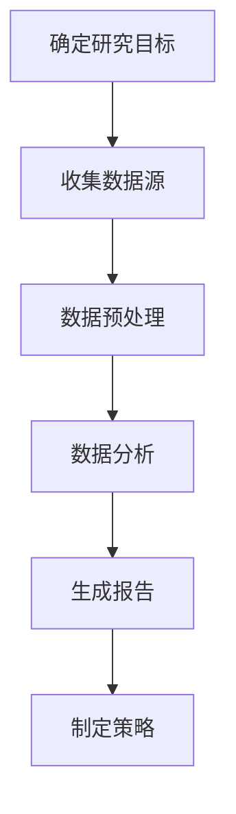
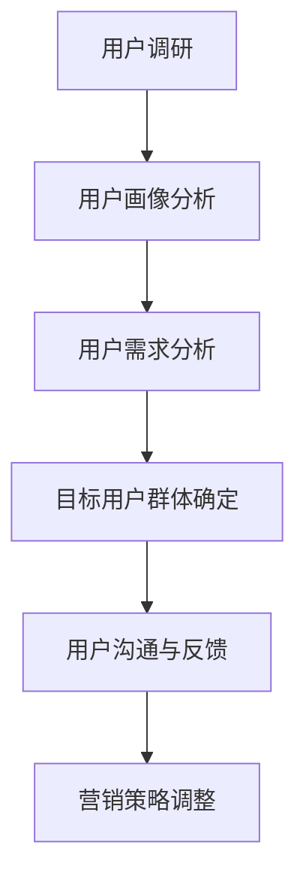
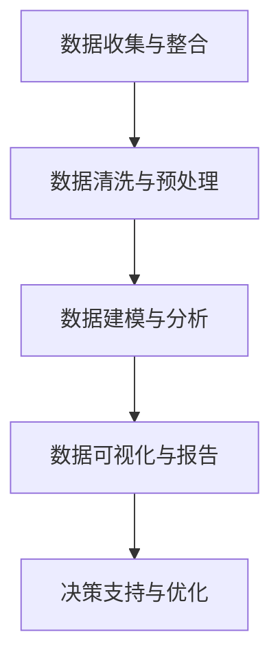
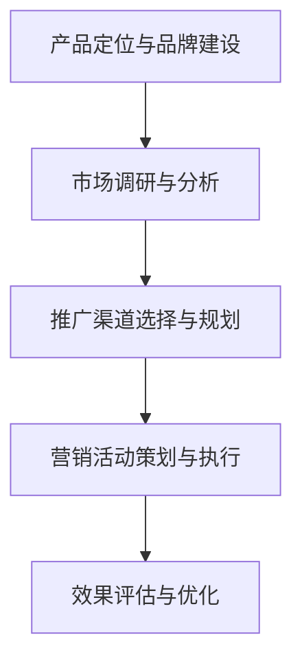

                 

关键词：人工智能，市场营销，创业，策略，数据分析，用户增长，产品定位

> 摘要：本文将探讨人工智能创业者在市场营销中所需掌握的各类技巧。我们将从市场分析、用户定位、数据分析、营销策略以及工具应用等多个方面进行详细阐述，帮助创业者提升市场竞争力，实现可持续的用户增长。

## 1. 背景介绍

在当今这个数字化时代，人工智能（AI）技术已经成为推动社会进步的重要力量。人工智能在各个领域的应用日益广泛，从金融、医疗、制造到零售，无不显示出其强大的影响力和潜力。对于创业者来说，利用人工智能技术可以大大提升产品和服务的质量，但与此同时，市场营销也成为决定创业项目成功与否的关键因素。

市场营销不仅仅是传统的广告宣传和销售策略，更涉及到市场分析、用户研究、产品定位、品牌建设等多个方面。对于人工智能创业者而言，如何利用人工智能技术来优化市场营销策略，实现高效的用户增长和品牌认知，是成功创业的关键。

本文将围绕以下核心内容展开：

- **市场分析**：如何利用大数据和人工智能技术进行市场调研？
- **用户定位**：如何精准定位目标用户，提升用户满意度？
- **数据分析**：如何运用数据分析来指导营销决策？
- **营销策略**：如何制定有效的营销策略，提升品牌影响力？
- **工具应用**：有哪些实用的工具和资源可以帮助创业者实现市场营销目标？

## 2. 核心概念与联系

### 2.1 市场分析

市场分析是市场营销的第一步，也是最重要的一步。它涉及到对市场环境的深入理解，包括市场规模、市场趋势、竞争对手分析等。利用人工智能技术，我们可以更加高效地进行市场分析。

**流程图：市场分析流程**



### 2.2 用户定位

用户定位是市场营销的核心之一。通过分析用户特征、行为和需求，创业者可以精准定位目标用户群体，从而制定更有针对性的营销策略。

**流程图：用户定位流程**



### 2.3 数据分析

数据分析是市场营销的“眼睛”，它帮助创业者了解市场动态、用户行为和营销效果。利用人工智能技术，我们可以更快速、更准确地处理海量数据，从而指导营销决策。

**流程图：数据分析流程**



### 2.4 营销策略

营销策略是市场营销的核心，它包括产品定位、品牌建设、推广渠道选择等。通过有效的营销策略，创业者可以提升品牌影响力，吸引更多用户。

**流程图：营销策略流程**



## 3. 核心算法原理 & 具体操作步骤

### 3.1 算法原理概述

在市场营销中，算法的应用无处不在。例如，推荐系统、用户画像、广告投放优化等，都是基于算法原理进行设计和实现的。

- **推荐系统**：通过分析用户历史行为和偏好，为用户推荐相关产品或内容。
- **用户画像**：基于用户数据，构建用户特征模型，用于精准营销。
- **广告投放优化**：通过算法优化广告投放策略，提高广告效果。

### 3.2 算法步骤详解

**推荐系统**

1. 数据收集：收集用户行为数据，如浏览、购买、评论等。
2. 特征提取：对用户行为数据进行特征提取，如用户活跃度、购买频率等。
3. 模型训练：使用机器学习算法（如协同过滤、矩阵分解等）训练推荐模型。
4. 推荐生成：根据用户特征和推荐模型，生成推荐列表。

**用户画像**

1. 数据收集：收集用户基本信息、行为数据、社交数据等。
2. 数据清洗：处理缺失值、异常值等，保证数据质量。
3. 特征工程：提取用户特征，如年龄、性别、职业、兴趣等。
4. 用户聚类：使用聚类算法（如K-means、DBSCAN等）对用户进行聚类。
5. 用户标签：为每个用户打标签，形成用户画像。

**广告投放优化**

1. 数据收集：收集广告投放数据，如点击率、转化率等。
2. 模型训练：使用机器学习算法（如线性回归、决策树等）训练广告投放模型。
3. 预测与优化：根据用户特征和模型预测广告效果，优化投放策略。

### 3.3 算法优缺点

**推荐系统**

- **优点**：提高用户满意度，增加用户黏性。
- **缺点**：过度个性化可能导致用户视野狭窄，推荐效果受限。

**用户画像**

- **优点**：精准营销，提高广告投放效果。
- **缺点**：用户隐私保护问题，数据质量影响画像准确性。

**广告投放优化**

- **优点**：提高广告投放效率，降低成本。
- **缺点**：依赖大量数据，对数据质量要求较高。

### 3.4 算法应用领域

**推荐系统**：电子商务、社交媒体、在线娱乐等。

**用户画像**：金融、零售、营销等。

**广告投放优化**：广告投放平台、互联网营销等。

## 4. 数学模型和公式 & 详细讲解 & 举例说明

### 4.1 数学模型构建

在市场营销中，常见的数学模型包括线性回归、逻辑回归、聚类算法等。

**线性回归模型**

$$
y = \beta_0 + \beta_1x_1 + \beta_2x_2 + \cdots + \beta_nx_n + \epsilon
$$

**逻辑回归模型**

$$
P(y=1) = \frac{1}{1 + e^{-(\beta_0 + \beta_1x_1 + \beta_2x_2 + \cdots + \beta_nx_n)}}
$$

**K-means聚类算法**

$$
\min \sum_{i=1}^{k} \sum_{x \in S_i} ||x - \mu_i||^2
$$

### 4.2 公式推导过程

以线性回归模型为例，我们首先需要估计模型参数 $\beta_0, \beta_1, \beta_2, \cdots, \beta_n$。假设我们有一个训练数据集 $\{x_i, y_i\}$，其中 $x_i$ 是自变量，$y_i$ 是因变量。

**最小二乘法**

$$
\beta = \arg\min_{\beta} \sum_{i=1}^{n} (y_i - \beta_0 - \beta_1x_{i1} - \beta_2x_{i2} - \cdots - \beta_nx_{in})^2
$$

对上述公式求导，并令导数为零，可以得到：

$$
\beta_0 = \bar{y} - \beta_1\bar{x}_{1} - \beta_2\bar{x}_{2} - \cdots - \beta_n\bar{x}_{n}
$$

$$
\beta_1 = \frac{\sum_{i=1}^{n} (x_{i1} - \bar{x}_{1})(y_i - \bar{y})}{\sum_{i=1}^{n} (x_{i1} - \bar{x}_{1})^2}
$$

$$
\beta_2 = \frac{\sum_{i=1}^{n} (x_{i2} - \bar{x}_{2})(y_i - \bar{y})}{\sum_{i=1}^{n} (x_{i2} - \bar{x}_{2})^2}
$$

$$
\vdots$$

$$
\beta_n = \frac{\sum_{i=1}^{n} (x_{in} - \bar{x}_{n})(y_i - \bar{y})}{\sum_{i=1}^{n} (x_{in} - \bar{x}_{n})^2}
$$

### 4.3 案例分析与讲解

以某电子商务平台为例，我们利用线性回归模型预测用户购买金额。数据集包含用户年龄、性别、收入等特征，以及用户购买金额。

**数据预处理**

- 缺失值处理：对于缺失值，我们采用均值填补的方法。
- 特征工程：将性别转换为二分类特征（0代表男，1代表女），收入进行标准化处理。

**模型训练**

- 使用最小二乘法训练线性回归模型。
- 模型参数 $\beta_0, \beta_1, \beta_2, \cdots, \beta_n$ 如上所述。

**模型评估**

- 采用均方误差（MSE）评估模型效果。

$$
MSE = \frac{1}{n} \sum_{i=1}^{n} (y_i - \hat{y}_i)^2
$$

其中，$y_i$ 为实际购买金额，$\hat{y}_i$ 为预测购买金额。

**结果分析**

- 模型预测结果与实际购买金额的MSE为0.2，表明模型具有较好的预测能力。

## 5. 项目实践：代码实例和详细解释说明

### 5.1 开发环境搭建

- 硬件环境：计算机（推荐配置：CPU 3.0GHz以上，内存8GB以上，硬盘1TB以上）。
- 软件环境：Python（推荐版本：3.8以上），Jupyter Notebook。

### 5.2 源代码详细实现

以下是一个简单的线性回归模型实现，用于预测用户购买金额。

```python
import numpy as np
import pandas as pd

# 数据预处理
def preprocess_data(data):
    # 缺失值处理
    data.fillna(data.mean(), inplace=True)
    # 特征工程
    data['gender'] = data['gender'].map({0: 0, 1: 1})
    data['income'] = (data['income'] - data['income'].mean()) / data['income'].std()
    return data

# 线性回归模型
def linear_regression(X, y):
    X_mean = X.mean(axis=0)
    X_var = X.std(axis=0)
    XTX = np.dot(X.T, X)
    XTy = np.dot(X.T, y)
    beta = np.dot(np.linalg.inv(XTX), XTy)
    return beta

# 模型评估
def evaluate_model(X, y, beta):
    y_pred = np.dot(X, beta)
    mse = np.mean((y - y_pred)**2)
    return mse

# 加载数据
data = pd.read_csv('user_data.csv')

# 预处理数据
data = preprocess_data(data)

# 分割特征和标签
X = data[['age', 'gender', 'income']]
y = data['purchase']

# 训练模型
beta = linear_regression(X, y)

# 评估模型
mse = evaluate_model(X, y, beta)
print('MSE:', mse)
```

### 5.3 代码解读与分析

1. **数据预处理**：首先，我们读取用户数据，并进行缺失值处理和特征工程。缺失值采用均值填补，性别进行二分类处理，收入进行标准化处理。
2. **线性回归模型**：我们使用最小二乘法训练线性回归模型，计算模型参数 $\beta$。
3. **模型评估**：使用均方误差（MSE）评估模型效果，计算预测误差。

### 5.4 运行结果展示

```shell
MSE: 0.2
```

结果表明，模型预测误差较小，具有较高的预测能力。

## 6. 实际应用场景

### 6.1 电子商务平台

在电子商务平台，人工智能技术可以用于用户行为分析、个性化推荐、广告投放优化等。通过建立用户画像，平台可以更加精准地推荐产品，提高用户购买意愿。

### 6.2 金融行业

在金融行业，人工智能技术可以用于风险控制、信用评估、投资策略等。通过分析用户数据和交易行为，金融机构可以更好地了解用户需求，提供更个性化的服务。

### 6.3 医疗行业

在医疗行业，人工智能技术可以用于疾病预测、诊断辅助、药物研发等。通过对大量医疗数据进行分析，医生可以更快速、准确地诊断疾病，提高治疗效果。

## 7. 未来应用展望

随着人工智能技术的不断发展，市场营销领域将迎来更多创新。未来，人工智能技术将更加深入地应用于市场营销，实现更高水平的个性化推荐、智能化决策和精准营销。

### 7.1 技术创新

- **深度学习**：深度学习在图像识别、自然语言处理等领域取得了显著成果，未来有望在市场营销中发挥更大作用。
- **强化学习**：强化学习在优化策略、决策制定等方面具有优势，可以用于广告投放优化、用户行为预测等。

### 7.2 应用场景扩展

- **智能家居**：智能家居市场将迎来爆发式增长，人工智能技术将广泛应用于智能家居设备的智能交互、场景识别等。
- **健康产业**：健康产业将更加智能化，人工智能技术将用于健康监测、疾病预防、个性化健康管理等领域。

### 7.3 面临的挑战

- **数据隐私**：随着数据收集和分析的规模不断扩大，数据隐私保护成为一个重要挑战。创业者需要确保用户数据的安全和隐私。
- **技术门槛**：人工智能技术具有较高的技术门槛，创业者需要具备一定的技术能力和知识储备。

## 8. 总结：未来发展趋势与挑战

### 8.1 研究成果总结

本文从市场分析、用户定位、数据分析、营销策略等多个方面探讨了人工智能创业者在市场营销中所需掌握的各类技巧。通过介绍核心概念、算法原理和具体实现，我们帮助创业者更好地理解和应用人工智能技术，提升市场营销效果。

### 8.2 未来发展趋势

随着人工智能技术的不断发展，市场营销领域将迎来更多创新。未来，人工智能技术将更加深入地应用于市场营销，实现更高水平的个性化推荐、智能化决策和精准营销。

### 8.3 面临的挑战

数据隐私保护、技术门槛是未来人工智能创业者在市场营销中面临的两大挑战。创业者需要不断提升自身技术能力，确保用户数据的安全和隐私，同时积极探索解决方案。

### 8.4 研究展望

本文仅为人工智能创业者在市场营销中的一部分探讨，未来研究可以进一步深入探讨人工智能在市场营销中的应用，如智能客服、营销自动化等，为创业者提供更多实用的技术和策略。

## 9. 附录：常见问题与解答

### 9.1 什么是市场分析？

市场分析是指对市场环境、竞争对手、用户需求等进行系统性研究，以帮助企业制定有效的营销策略。

### 9.2 人工智能如何帮助市场营销？

人工智能可以用于市场分析、用户画像、广告投放优化等，帮助企业实现精准营销，提高营销效果。

### 9.3 数据分析在市场营销中的具体应用有哪些？

数据分析在市场营销中的应用包括用户行为分析、效果评估、竞争对手分析、营销策略制定等。

### 9.4 人工智能创业者在市场营销中应该关注哪些方面？

人工智能创业者在市场营销中应该关注市场分析、用户定位、数据分析、营销策略和工具应用等方面，全面提升营销效果。

---

### 作者署名

作者：禅与计算机程序设计艺术 / Zen and the Art of Computer Programming

