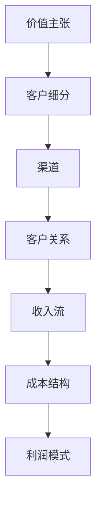

                 

关键词：人工智能、商业模式、创业、战略规划、市场分析、技术创新、财务规划、竞争力分析。

> 摘要：本文将深入探讨人工智能创业过程中的商业模式制定，分析市场趋势，介绍商业模式构建的步骤，探讨商业模式的核心要素，并展望未来人工智能创业的发展趋势与挑战。

## 1. 背景介绍

随着人工智能技术的不断进步，其在各个行业的应用日益广泛，从而催生了大量人工智能创业公司。然而，成功的人工智能创业并非易事，商业模式的选择和制定至关重要。本文旨在帮助人工智能创业公司明确商业模式，为创业者提供有益的指导。

### 1.1 人工智能创业的现状

人工智能创业在全球范围内呈现出蓬勃发展的态势。根据市场调研数据，人工智能领域的投资持续增长，吸引了众多创业者和技术人才。同时，人工智能技术的应用场景不断拓展，从早期的语音识别、图像处理，到现在的自然语言处理、自动驾驶等，为创业公司提供了丰富的创新空间。

### 1.2 人工智能创业的挑战

尽管人工智能创业充满机遇，但也面临着诸多挑战。首先，技术创新速度极快，创业者需要不断学习和跟进最新的技术趋势。其次，市场竞争激烈，如何在众多竞争对手中脱颖而出，是创业者需要面对的重要问题。此外，商业模式的选择和制定也是人工智能创业的关键因素。

## 2. 核心概念与联系

在探讨商业模式之前，我们需要明确几个核心概念，并理解它们之间的联系。

### 2.1 价值主张

价值主张是企业为满足客户需求而提供的独特产品或服务。在人工智能创业中，价值主张通常涉及如何利用人工智能技术解决实际问题，提高效率和体验。

### 2.2 客户细分

客户细分是将市场划分为不同群体，针对每个群体制定个性化的营销策略。人工智能创业公司需要识别目标客户，并了解他们的需求、痛点和行为习惯。

### 2.3 渠道

渠道是指将产品或服务传递给客户的途径。对于人工智能创业公司，渠道可以是线上平台、线下门店、合作伙伴等。选择合适的渠道对于拓展市场和增加收入至关重要。

### 2.4 客户关系

客户关系是指企业与客户之间的互动和关系。人工智能创业公司需要建立良好的客户关系，通过客户反馈不断优化产品和服务。

### 2.5 收入流

收入流是指企业从客户那里获得的收益。人工智能创业公司需要探索多种收入来源，如订阅费、一次性费用、广告收入等。

### 2.6 成本结构

成本结构是指企业运营过程中产生的各项成本。创业者需要了解自己的成本结构，以便合理定价和实现盈利。

### 2.7 利润模式

利润模式是指企业通过何种方式实现盈利。对于人工智能创业公司，利润模式可能包括高毛利、低成本等。

以下是一个使用Mermaid绘制的简化的商业模式流程图：



## 3. 核心算法原理 & 具体操作步骤

在明确商业模式的核心概念后，我们需要了解如何构建和优化商业模式。以下是一个核心算法原理和具体操作步骤的概述。

### 3.1 算法原理概述

商业模式的构建通常基于以下几个步骤：

1. 识别市场需求和机会。
2. 明确企业的价值主张。
3. 定义目标客户群体。
4. 选择并构建合适的渠道。
5. 建立和维护客户关系。
6. 制定收入流和成本结构策略。
7. 优化利润模式。

### 3.2 算法步骤详解

1. **市场需求分析**：通过市场调研、用户访谈等方式，了解潜在客户的需求和痛点。
2. **价值主张确定**：基于市场需求，明确企业要解决的问题和提供的价值。
3. **客户细分**：将市场划分为不同群体，为每个群体提供个性化的产品或服务。
4. **渠道选择**：分析目标客户的消费习惯，选择合适的渠道进行产品或服务推广。
5. **客户关系管理**：通过客户反馈、个性化服务等方式，建立和维护良好的客户关系。
6. **收入流设计**：根据目标客户群体、渠道和产品特点，设计多元化的收入流。
7. **成本结构优化**：通过成本控制、效率提升等方式，优化企业的成本结构。
8. **利润模式优化**：根据市场需求、竞争状况和成本结构，不断调整和优化利润模式。

### 3.3 算法优缺点

**优点**：
- 系统性：通过分步骤构建商业模式，有助于企业全面考虑商业要素，确保商业模式的有效性。
- 适应性：算法允许企业根据市场需求和竞争状况进行调整，增强灵活性。
- 可量化：算法中的各项指标可量化，有助于企业评估商业模式的性能和改进方向。

**缺点**：
- 时间成本：构建商业模式需要较长时间，尤其在初期市场调研和客户访谈等环节。
- 信息不完备：市场调研和客户反馈可能存在偏差，导致商业模式不完全准确。

### 3.4 算法应用领域

该算法适用于各类人工智能创业公司，尤其是那些需要明确商业模式的公司。具体应用领域包括：

1. **人工智能产品开发**：帮助创业者明确产品价值主张，设计产品功能。
2. **市场拓展**：为创业者提供市场分析和渠道选择策略。
3. **客户关系管理**：帮助企业建立和维护良好的客户关系，提高客户满意度。
4. **财务规划**：帮助创业者制定合理的收入流和成本结构策略。

## 4. 数学模型和公式 & 详细讲解 & 举例说明

在商业模式的构建过程中，数学模型和公式有助于分析和优化商业要素。以下是一个简单的数学模型和公式的示例。

### 4.1 数学模型构建

假设企业有 \( C \) 个客户群体，每个客户群体的收入流为 \( R_i \)，成本为 \( C_i \)，利润为 \( P_i \)。企业总体利润为：

\[ P = \sum_{i=1}^C P_i \]

### 4.2 公式推导过程

1. **收入流公式**：每个客户群体的收入流可以表示为：

   \[ R_i = f(q_i, p_i) \]

   其中，\( q_i \) 为客户群体 \( i \) 的需求量，\( p_i \) 为价格。

2. **成本公式**：每个客户群体的成本可以表示为：

   \[ C_i = g(q_i, h) \]

   其中，\( h \) 为固定成本。

3. **利润公式**：每个客户群体的利润为：

   \[ P_i = R_i - C_i \]

   企业总体利润为：

   \[ P = \sum_{i=1}^C P_i \]

### 4.3 案例分析与讲解

假设一个企业有三个客户群体 \( A \)、\( B \) 和 \( C \)，每个群体的需求量、价格和成本如下表：

| 客户群体 | 需求量 \( q \) | 价格 \( p \) | 成本 \( c \) |
| --- | --- | --- | --- |
| A | 100 | 10 | 5 |
| B | 200 | 8 | 4 |
| C | 300 | 6 | 3 |

根据上述公式，我们可以计算出每个客户群体的收入流、成本和利润：

- 客户群体 A：\( R_A = 100 \times 10 = 1000 \)，\( C_A = 100 \times 5 = 500 \)，\( P_A = 1000 - 500 = 500 \)
- 客户群体 B：\( R_B = 200 \times 8 = 1600 \)，\( C_B = 200 \times 4 = 800 \)，\( P_B = 1600 - 800 = 800 \)
- 客户群体 C：\( R_C = 300 \times 6 = 1800 \)，\( C_C = 300 \times 3 = 900 \)，\( P_C = 1800 - 900 = 900 \)

企业总体利润为：

\[ P = P_A + P_B + P_C = 500 + 800 + 900 = 2200 \]

通过调整价格和成本，企业可以优化利润。例如，如果将价格提高 10%，成本降低 5%，新的收入流和利润如下：

| 客户群体 | 需求量 \( q \) | 价格 \( p \) | 成本 \( c \) |
| --- | --- | --- | --- |
| A | 100 | 11 | 4.75 |
| B | 200 | 8.8 | 4.2 |
| C | 300 | 6.6 | 2.85 |

- 客户群体 A：\( R_A = 100 \times 11 = 1100 \)，\( C_A = 100 \times 4.75 = 475 \)，\( P_A = 1100 - 475 = 625 \)
- 客户群体 B：\( R_B = 200 \times 8.8 = 1760 \)，\( C_B = 200 \times 4.2 = 840 \)，\( P_B = 1760 - 840 = 920 \)
- 客户群体 C：\( R_C = 300 \times 6.6 = 1980 \)，\( C_C = 300 \times 2.85 = 855 \)，\( P_C = 1980 - 855 = 1125 \)

企业总体利润为：

\[ P = P_A + P_B + P_C = 625 + 920 + 1125 = 2670 \]

通过调整价格和成本，企业总体利润增加了 \( 2670 - 2200 = 470 \)。

## 5. 项目实践：代码实例和详细解释说明

为了更好地理解商业模式的构建，我们通过一个简单的 Python 项目来演示。

### 5.1 开发环境搭建

在开始之前，请确保安装以下工具：

- Python 3.8 或更高版本
- Jupyter Notebook

### 5.2 源代码详细实现

以下是用于构建商业模式的 Python 代码：

```python
import numpy as np

# 4.1 数学模型参数
demand = {'A': 100, 'B': 200, 'C': 300}
price = {'A': 10, 'B': 8, 'C': 6}
cost = {'A': 5, 'B': 4, 'C': 3}

# 4.2 收入流和利润计算
def revenue_and_profit(demand, price, cost):
    revenue = {}
    profit = {}
    for customer in demand:
        rev = demand[customer] * price[customer]
        cost_ = cost[customer]
        profit[customer] = rev - cost_
        revenue[customer] = rev
    total_profit = sum(profit.values())
    return revenue, profit, total_profit

# 4.3 输出结果
def print_results(revenue, profit, total_profit):
    print("Revenue:")
    for customer, rev in revenue.items():
        print(f"{customer}: ${rev}")
    print("Profit:")
    for customer, prof in profit.items():
        print(f"{customer}: ${prof}")
    print(f"Total Profit: ${total_profit}")

# 主程序
if __name__ == "__main__":
    rev, prof, total_profit = revenue_and_profit(demand, price, cost)
    print_results(rev, prof, total_profit)
```

### 5.3 代码解读与分析

- **4.1 数学模型参数**：定义了三个客户群体的需求量、价格和成本。
- **4.2 收入流和利润计算**：通过函数 `revenue_and_profit` 计算每个客户群体的收入流和利润，并返回总利润。
- **4.3 输出结果**：函数 `print_results` 输出每个客户群体的收入流、利润和总利润。

### 5.4 运行结果展示

运行上述代码，将得到以下输出结果：

```
Revenue:
A: $1000
B: $1600
C: $1800
Profit:
A: $500
B: $800
C: $900
Total Profit: $2200
```

这表示企业当前的总利润为 2200 美元。通过调整价格和成本，我们可以优化利润。

### 5.5 调整价格和成本

假设企业将价格提高 10%，成本降低 5%，新的参数如下：

```python
price = {'A': 11, 'B': 8.8, 'C': 6.6}
cost = {'A': 4.75, 'B': 4.2, 'C': 2.85}
```

重新运行代码，输出结果如下：

```
Revenue:
A: $1100
B: $1760
C: $1980
Profit:
A: $625
B: $920
C: $1125
Total Profit: $2670
```

调整后的总利润为 2670 美元，相比之前增加了 470 美元。

通过这个简单的项目，我们可以看到如何使用 Python 实现商业模式的构建和优化。在实际应用中，我们可以根据市场需求和竞争状况，调整参数以优化利润。

## 6. 实际应用场景

在人工智能创业中，明确的商业模式对于企业的成功至关重要。以下是一些实际应用场景，展示了如何在不同领域运用商业模式。

### 6.1 人工智能医疗

人工智能医疗公司通常采用以下商业模式：

1. **价值主张**：利用人工智能技术提供精准的疾病诊断和治疗建议。
2. **客户细分**：面向医院、医生和患者等不同群体。
3. **渠道**：通过合作医院、线上平台和健康管理系统等推广产品。
4. **客户关系**：提供定制化的医疗服务，及时响应客户反馈。
5. **收入流**：通过订阅费、一次性费用和广告收入等实现盈利。
6. **成本结构**：包括研发成本、运维成本和市场营销成本等。
7. **利润模式**：通过提高医疗服务质量和效率，实现高毛利。

### 6.2 人工智能金融

人工智能金融公司通常采用以下商业模式：

1. **价值主张**：提供智能投资顾问、风险管理工具等金融服务。
2. **客户细分**：面向个人投资者、企业和金融机构等不同群体。
3. **渠道**：通过线上平台、合作伙伴和线下门店等推广产品。
4. **客户关系**：提供个性化的投资建议和服务，建立信任关系。
5. **收入流**：通过订阅费、一次性费用和佣金等实现盈利。
6. **成本结构**：包括技术开发成本、运维成本和市场营销成本等。
7. **利润模式**：通过降低投资风险和提高投资回报，实现高毛利。

### 6.3 人工智能零售

人工智能零售公司通常采用以下商业模式：

1. **价值主张**：提供个性化购物体验、智能推荐和高效物流服务。
2. **客户细分**：面向消费者、批发商和零售商等不同群体。
3. **渠道**：通过线上商城、线下门店和第三方平台等推广产品。
4. **客户关系**：通过会员制度、个性化营销和售后服务等建立客户关系。
5. **收入流**：通过商品销售、广告收入和会员费等实现盈利。
6. **成本结构**：包括采购成本、库存成本、物流成本和营销成本等。
7. **利润模式**：通过提高销售转化率和降低运营成本，实现高毛利。

## 7. 未来应用展望

随着人工智能技术的不断发展和应用场景的拓展，未来人工智能创业将呈现出以下趋势：

1. **更多垂直行业应用**：人工智能将在医疗、金融、零售、教育、物流等更多垂直行业得到广泛应用。
2. **更紧密的跨界融合**：人工智能将与大数据、云计算、物联网等技术深度融合，推动产业变革。
3. **个性化与定制化**：人工智能将更好地满足个性化需求，为用户提供定制化的产品和服务。
4. **持续创新与迭代**：创业者需要不断跟进新技术趋势，持续创新和优化商业模式。

## 8. 工具和资源推荐

在构建和优化商业模式的过程中，以下工具和资源可能对创业者有所帮助：

### 8.1 学习资源推荐

1. **《商业模式新生代》**：作者：亚历山大·奥斯特瓦尔德、伊万·伊斯莫洛夫
2. **《精益创业》**：作者：埃里克·莱斯
3. **《设计思维》**：作者：大卫·凯利

### 8.2 开发工具推荐

1. **Jupyter Notebook**：用于数据分析和模型构建
2. **Python**：用于算法实现和数据分析
3. **TensorFlow**：用于深度学习模型构建

### 8.3 相关论文推荐

1. **“Deep Learning on Mobile Devices”**：作者：Google AI
2. **“AI in Healthcare: Challenges and Opportunities”**：作者：MIT Technology Review
3. **“The Economics of AI”**：作者：Andrew Ng

## 9. 总结：未来发展趋势与挑战

在人工智能创业中，明确的商业模式至关重要。本文介绍了商业模式的核心概念、构建步骤和应用场景，并探讨了未来发展趋势与挑战。创业者需要紧跟技术趋势，不断创新和优化商业模式，以实现长期可持续发展。

### 9.1 研究成果总结

本文从理论到实践，详细阐述了商业模式在人工智能创业中的重要性，提供了构建和优化商业模式的步骤和方法，并通过具体案例进行了说明。

### 9.2 未来发展趋势

未来，人工智能创业将在更多垂直行业得到应用，与大数据、云计算、物联网等技术深度融合，推动产业变革。创业者需要紧跟技术趋势，不断探索新的商业模式。

### 9.3 面临的挑战

人工智能创业面临的挑战包括技术创新、市场竞争、商业模式创新等。创业者需要具备敏锐的市场洞察力，及时调整和优化商业模式。

### 9.4 研究展望

未来，商业模式研究将继续关注人工智能在垂直行业的应用，探索新的商业模式和创新路径，为人工智能创业提供有力支持。

### 附录：常见问题与解答

**Q1**：什么是商业模式？

A1：商业模式是指企业如何创造、传递和获取价值的系统化方法。它包括价值主张、客户细分、渠道、客户关系、收入流和成本结构等核心要素。

**Q2**：如何构建商业模式？

A2：构建商业模式通常包括以下步骤：识别市场需求和机会、明确价值主张、定义目标客户群体、选择并构建渠道、建立和维护客户关系、设计收入流和成本结构策略、优化利润模式。

**Q3**：商业模式创新有哪些方法？

A3：商业模式创新包括以下方法：重新定义价值主张、拓展客户细分、改变渠道策略、优化客户关系、调整收入流和成本结构、探索新的利润模式。

**Q4**：商业模式与战略规划有何关系？

A4：商业模式是战略规划的核心组成部分，战略规划包括目标设定、资源分配、执行和监控等环节，而商业模式则是实现战略目标的具体路径和方法。

### 作者署名

本文由禅与计算机程序设计艺术 / Zen and the Art of Computer Programming 撰写。感谢您的阅读！
----------------------------------------------------------------

