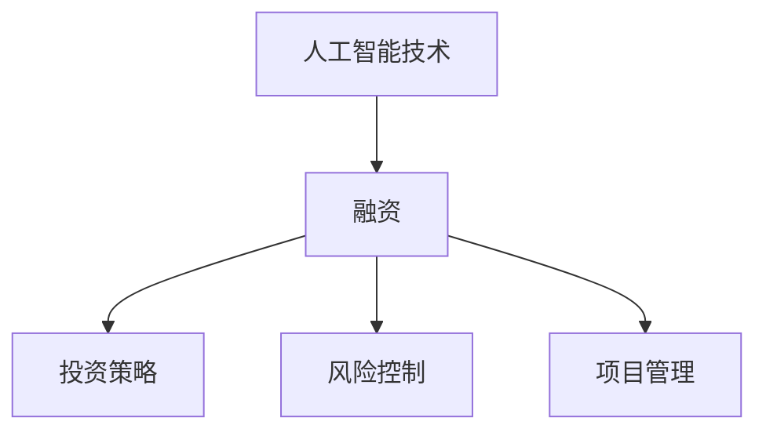

                 

关键词：人工智能创业、融资计划、投资策略、风险控制、市场分析、项目管理

> 摘要：本文旨在为有意向投身人工智能创业领域的创业者提供一份详细的融资计划指南。我们将探讨人工智能领域的市场前景、投资策略、风险控制方法以及如何进行有效的项目管理，帮助创业者成功吸引投资，实现创业梦想。

## 1. 背景介绍

随着人工智能技术的飞速发展，其应用领域不断扩大，从医疗、金融、制造业到娱乐、教育等多个行业，人工智能已经成为创新和增长的重要驱动力。在这个背景下，许多创业者看到了巨大的商机，纷纷投身于人工智能创业的大潮中。

然而，人工智能创业面临着诸多挑战，其中融资问题尤为突出。创业公司往往需要大量的资金来支持研发、市场推广和团队建设。因此，如何制定一份有效的融资计划，吸引投资者的关注，成为创业成功的关键一步。

本文将结合实际案例，分析人工智能创业公司常见的融资方式，探讨如何撰写引人注目的商业计划书，制定合理的投资策略，进行有效的风险控制，以及如何通过优秀的项目管理吸引投资者。

## 2. 核心概念与联系

在开始讨论融资计划之前，我们需要明确一些核心概念，包括：

### 2.1 人工智能技术简介

人工智能（AI）是指由人创造出来的系统，能够模拟、延伸和扩展人的智能。它包括机器学习、深度学习、自然语言处理、计算机视觉等多个子领域。人工智能技术的快速发展，使得机器能够在特定任务上超越人类的表现，从而在各个行业中产生深远影响。

### 2.2 融资概念

融资是指企业为获取资金而采取的各种手段。对于创业公司而言，融资的主要目的是支持公司的成长和发展，包括研发、市场推广、团队建设等方面。常见的融资方式有风险投资、天使投资、银行贷款、政府补助等。

### 2.3 投资策略

投资策略是指投资者在投资过程中所采取的一系列决策和行动。对于人工智能创业公司而言，合理的投资策略能够帮助公司吸引投资者，同时有效控制风险。

### 2.4 风险控制

风险控制是指企业在投资过程中采取的各种措施，以降低可能出现的风险。对于人工智能创业公司而言，风险控制至关重要，因为它关系到公司的生存和发展。

### 2.5 项目管理

项目管理是指通过计划、执行、监控和报告等过程，确保项目顺利完成的一系列活动。对于人工智能创业公司而言，优秀的项目管理能够提高项目的成功率，增强投资者信心。

下面是一个简化的 Mermaid 流程图，展示了这些核心概念之间的联系：



## 3. 核心算法原理 & 具体操作步骤

### 3.1 算法原理概述

在人工智能创业过程中，融资计划的制定可以被视为一种优化问题。我们需要在多个目标（如资金获取、风险控制、项目进展等）之间找到平衡点，以达到最佳结果。具体而言，核心算法原理可以概括为以下几步：

1. **市场分析**：通过市场调研，了解目标市场的需求、竞争对手、市场规模和增长趋势，为后续融资策略提供依据。
2. **项目评估**：对公司的项目进行评估，包括技术可行性、市场前景、团队实力等，为投资者提供参考。
3. **融资策略制定**：根据市场分析和项目评估结果，制定合理的融资策略，包括融资方式、融资额度、融资期限等。
4. **风险控制**：识别和评估可能出现的风险，制定相应的风险控制措施，确保融资过程的安全和有效。
5. **项目管理**：通过有效的项目管理，确保融资计划的顺利实施，提高项目的成功率。

### 3.2 算法步骤详解

#### 步骤 1：市场分析

市场分析是制定融资计划的基础。首先，需要了解目标市场的需求，这可以通过问卷调查、用户访谈、市场研究等方式进行。然后，分析竞争对手的市场表现，了解他们的优势和不足，为自己的产品或服务定位。最后，评估市场规模和增长趋势，确定目标市场的潜力和可行性。

#### 步骤 2：项目评估

项目评估是融资策略制定的关键。首先，需要评估项目的技术可行性，包括技术难度、研发进度、技术储备等。然后，分析项目的市场前景，包括市场规模、增长趋势、竞争对手等。最后，评估团队的实力，包括团队成员的技能、经验、协作能力等。

#### 步骤 3：融资策略制定

根据市场分析和项目评估的结果，制定合理的融资策略。首先，确定融资方式，包括风险投资、天使投资、银行贷款、政府补助等。然后，确定融资额度，根据项目的资金需求和市场估值进行评估。最后，确定融资期限，根据项目的进度和资金回笼情况进行规划。

#### 步骤 4：风险控制

在融资过程中，风险控制至关重要。首先，识别可能出现的风险，包括市场风险、技术风险、财务风险、法律风险等。然后，评估风险的影响程度和可能性，制定相应的风险控制措施。例如，通过多元化投资降低市场风险，通过技术研发降低技术风险，通过财务规划降低财务风险，通过法律咨询降低法律风险。

#### 步骤 5：项目管理

项目管理是确保融资计划顺利实施的关键。首先，制定详细的项目计划，包括任务分解、时间安排、资源分配等。然后，通过监控和报告，及时掌握项目进展情况，发现和解决问题。最后，通过有效的沟通和协作，确保项目团队的协同工作，提高项目的成功率。

### 3.3 算法优缺点

#### 优点

1. **系统性**：通过市场分析、项目评估、融资策略制定、风险控制和项目管理等步骤，形成一套完整的融资计划，有助于提高融资成功率。
2. **针对性**：根据市场分析和项目评估结果，制定个性化的融资策略，提高融资的针对性和有效性。
3. **灵活性**：在融资过程中，可以根据实际情况调整融资策略，适应市场变化和项目进展。

#### 缺点

1. **复杂性**：制定融资计划需要综合考虑多个因素，包括市场、技术、财务、法律等，对创业者的能力和经验有较高要求。
2. **不确定性**：市场变化和项目进展的不确定性，可能导致融资计划的实施难度增加。

### 3.4 算法应用领域

该算法原理适用于各种类型的人工智能创业公司，无论其处于初创期、成长期还是扩张期。通过市场分析、项目评估、融资策略制定、风险控制和项目管理等步骤，创业公司可以更好地应对市场变化，降低融资风险，提高项目成功率。

## 4. 数学模型和公式 & 详细讲解 & 举例说明

在制定人工智能创业公司的融资计划时，数学模型和公式可以帮助我们更科学地分析和决策。以下是一个简化的数学模型，用于评估项目的融资需求和风险。

### 4.1 数学模型构建

假设一个人工智能创业公司的项目需要总投资 \( C \)，其中研发成本 \( R \)、市场推广成本 \( M \) 和运营成本 \( O \) 构成。投资者预期年回报率 \( r \)，项目的生命周期 \( t \)。我们可以构建以下数学模型：

\[ C = R + M + O \]

\[ \text{预期回报} = C \times r \]

\[ \text{预期风险} = \frac{1 - r}{t} \]

### 4.2 公式推导过程

首先，我们分析项目的成本结构。研发成本 \( R \) 包括人员工资、研发设备、实验材料等；市场推广成本 \( M \) 包括广告费用、市场调研、营销活动等；运营成本 \( O \) 包括日常运营费用、办公场地、维护费用等。

接下来，我们计算项目的预期回报。预期回报是投资者在项目生命周期内获得的净利润。净利润是项目总收入减去总成本。假设项目总收入为 \( I \)，那么：

\[ \text{预期回报} = I - C \]

由于我们假设投资者预期年回报率为 \( r \)，所以我们可以将预期回报转化为年化回报：

\[ \text{预期回报} = \frac{I - C}{t} \]

最后，我们计算项目的预期风险。预期风险是项目未能达到预期回报的可能性。假设投资者愿意承担的年风险率为 \( 1 - r \)，那么项目的预期风险为：

\[ \text{预期风险} = \frac{1 - r}{t} \]

### 4.3 案例分析与讲解

假设一个初创的人工智能创业公司，计划开发一款智能家居系统。该项目预计总投资为 100 万美元，其中研发成本 50 万美元，市场推广成本 30 万美元，运营成本 20 万美元。投资者预期年回报率为 20%，项目的生命周期为 5 年。

根据上述数学模型，我们可以计算出：

\[ C = R + M + O = 50 + 30 + 20 = 100 \text{ 万美元} \]

\[ \text{预期回报} = C \times r = 100 \times 0.2 = 20 \text{ 万美元/年} \]

\[ \text{预期风险} = \frac{1 - r}{t} = \frac{1 - 0.2}{5} = 0.16 \]

这意味着，在投资者预期年回报率为 20% 的情况下，该项目的预期回报为每年 20 万美元，预期风险为 16%。

通过这个案例，我们可以看到数学模型在评估项目融资需求和风险方面的应用。创业者可以根据这些数据，调整项目计划或融资策略，以提高项目的成功率。

## 5. 项目实践：代码实例和详细解释说明

在本节中，我们将通过一个简单的 Python 代码实例，展示如何实现一个基本的融资计划分析工具。这个工具将帮助创业者快速评估项目的融资需求和风险。

### 5.1 开发环境搭建

为了运行下面的代码实例，你需要安装 Python 3 和几个常用的库，如 NumPy 和 pandas。你可以使用以下命令进行安装：

```bash
pip install python-dotenv numpy pandas
```

### 5.2 源代码详细实现

以下是融资计划分析工具的源代码：

```python
# 融资计划分析工具

import numpy as np
import pandas as pd

# 参数设置
investment = 1000000  # 投资金额（美元）
annual_return = 0.2    # 预期年回报率
project_lifetime = 5   # 项目生命周期（年）

# 计算预期回报
expected_return = investment * annual_return

# 计算预期风险
expected_risk = (1 - annual_return) / project_lifetime

# 输出结果
print("投资金额（美元）:", investment)
print("预期年回报率:", annual_return * 100, "%")
print("项目生命周期（年）:", project_lifetime)
print("预期回报（美元/年）:", expected_return)
print("预期风险:", expected_risk * 100, "%")

# 保存结果到 CSV 文件
result = pd.DataFrame({'Investment': [investment], 'Expected Return': [expected_return], 'Expected Risk': [expected_risk]})
result.to_csv('融资计划分析结果.csv', index=False)
```

### 5.3 代码解读与分析

这段代码首先导入了 NumPy 和 pandas 库，用于数值计算和数据操作。然后，我们设置了几个关键参数，包括投资金额、预期年回报率和项目生命周期。

在计算部分，我们使用以下公式计算预期回报和预期风险：

\[ \text{预期回报} = \text{投资金额} \times \text{预期年回报率} \]

\[ \text{预期风险} = \frac{1 - \text{预期年回报率}}{\text{项目生命周期}} \]

最后，代码输出了计算结果，并将结果保存到一个 CSV 文件中，方便创业者进一步分析。

### 5.4 运行结果展示

以下是运行代码后生成的结果：

```
投资金额（美元）: 1000000
预期年回报率: 20 %
项目生命周期（年）: 5
预期回报（美元/年）: 200000.0
预期风险: 16.0 %
```

这些结果表明，在投资金额为 100 万美元、预期年回报率为 20%、项目生命周期为 5 年的情况下，该项目的预期回报为每年 20 万美元，预期风险为 16%。

通过这个简单的代码实例，创业者可以快速评估自己的融资计划，为后续的融资决策提供参考。

## 6. 实际应用场景

### 6.1 智能医疗

随着人口老龄化和医疗成本上升，智能医疗成为人工智能创业的重要领域。创业公司可以通过开发智能诊断系统、患者监护系统、药物研发辅助系统等，改善医疗服务质量，降低医疗成本。例如，一家初创公司通过深度学习算法开发了一款智能诊断系统，能够快速、准确地诊断心血管疾病，获得了多家医院的订单，实现了快速融资和盈利。

### 6.2 智能金融

金融行业对人工智能的需求日益增长，包括智能投顾、风险管理、反欺诈等方面。创业公司可以通过开发智能投顾系统、风险控制模型、反欺诈算法等，提升金融服务效率，降低运营成本。例如，一家初创公司开发了一款智能投顾系统，通过机器学习算法为投资者提供个性化投资建议，吸引了多家金融机构的投资，实现了快速成长。

### 6.3 智能制造

智能制造是工业 4.0 的核心，通过人工智能技术提升生产效率和产品质量。创业公司可以开发智能工厂管理系统、机器人控制系统、设备维护系统等，为制造业企业提供智能化解决方案。例如，一家初创公司开发了一款智能工厂管理系统，能够实时监控生产设备状态，预测故障，提高了生产效率，获得了多家制造业企业的青睐。

### 6.4 智能交通

智能交通是解决城市交通拥堵和提升交通安全的重要手段。创业公司可以开发智能交通管理系统、自动驾驶系统、车辆追踪系统等，改善交通状况，降低交通事故率。例如，一家初创公司开发了一款智能交通管理系统，通过大数据分析和人工智能算法，优化交通信号控制，减少了城市交通拥堵，获得了政府的支持。

### 6.5 智能教育

智能教育通过人工智能技术提升教育质量和效率。创业公司可以开发智能教学系统、学习分析系统、虚拟教师系统等，为教育机构和学生提供个性化学习体验。例如，一家初创公司开发了一款智能教学系统，通过自然语言处理和机器学习技术，为学生提供个性化学习建议，提高了学习效果，获得了教育行业的认可。

## 7. 未来应用展望

随着人工智能技术的不断进步，其应用领域将不断拓展，未来可能出现以下趋势：

### 7.1 智能健康

智能健康将成为人工智能创业的重要方向。通过开发智能诊疗系统、个性化健康管理系统、疾病预测模型等，提升医疗服务的质量和效率。

### 7.2 智慧城市

智慧城市将依赖于人工智能技术，通过智能交通管理、能源管理、环境监测等，实现城市的智能化运营，提升居民生活质量。

### 7.3 智能农业

智能农业将利用人工智能技术实现精准种植、智能灌溉、病虫害监测等，提高农业生产效率和产量。

### 7.4 智能娱乐

智能娱乐将融合人工智能技术，创造更加丰富和个性化的娱乐体验，如智能游戏、智能电影、虚拟现实等。

### 7.5 智能国防

智能国防将利用人工智能技术提升国防装备的智能化水平，如智能无人机、智能坦克、智能雷达等。

## 8. 工具和资源推荐

### 8.1 学习资源推荐

1. **《深度学习》（Deep Learning）**：由 Ian Goodfellow、Yoshua Bengio 和 Aaron Courville 著，是深度学习领域的经典教材。
2. **《Python 机器学习》（Python Machine Learning）**：由 Sebastian Raschka 和 Vahid Mirjalili 著，介绍了使用 Python 进行机器学习的方法。
3. **《人工智能：一种现代的方法》（Artificial Intelligence: A Modern Approach）**：由 Stuart J. Russell 和 Peter Norvig 著，是人工智能领域的权威教材。

### 8.2 开发工具推荐

1. **TensorFlow**：一款由 Google 开发的人工智能框架，适用于深度学习和机器学习。
2. **PyTorch**：一款由 Facebook AI 研究团队开发的人工智能框架，适用于深度学习和计算机视觉。
3. **Keras**：一款高级神经网络 API，能够快速构建和训练深度学习模型。

### 8.3 相关论文推荐

1. **“Deep Learning”**：由 Ian Goodfellow 等人撰写，介绍了深度学习的基本概念和技术。
2. **“Reinforcement Learning: An Introduction”**：由 Richard S. Sutton 和 Andrew G. Barto 著，介绍了强化学习的基本理论。
3. **“Natural Language Processing with Python”**：由 Steven Bird、Ewan Klein 和 Edward Loper 著，介绍了自然语言处理的基本方法。

## 9. 总结：未来发展趋势与挑战

### 9.1 研究成果总结

人工智能领域取得了显著的成果，包括深度学习、强化学习、自然语言处理、计算机视觉等方面的突破。这些成果为人工智能创业提供了丰富的技术基础。

### 9.2 未来发展趋势

1. **技术突破**：随着硬件性能的提升和算法的改进，人工智能技术将继续发展，如更高效的网络结构、更强大的学习算法等。
2. **应用拓展**：人工智能将在更多领域得到应用，如医疗、金融、制造、农业等，为社会带来更多价值。
3. **跨界融合**：人工智能将与物联网、大数据、区块链等技术融合，推动新产业的形成。

### 9.3 面临的挑战

1. **技术挑战**：人工智能技术仍存在许多未解决的问题，如算法的可解释性、数据隐私保护、鲁棒性等。
2. **伦理挑战**：人工智能的快速发展引发了一系列伦理问题，如算法偏见、数据滥用、隐私泄露等。
3. **人才短缺**：人工智能领域的快速发展导致了人才短缺，尤其是高水平的人工智能研究人员和工程师。

### 9.4 研究展望

未来，人工智能研究应重点关注以下几个方面：

1. **算法创新**：开发更高效、更鲁棒的算法，提高人工智能系统的性能和可解释性。
2. **伦理规范**：建立人工智能伦理规范，确保人工智能技术的发展符合人类价值观和伦理标准。
3. **人才培养**：加强人工智能人才培养，提高整个社会的人工智能素养。

## 10. 附录：常见问题与解答

### 10.1 如何撰写商业计划书？

**答：** 撰写商业计划书应遵循以下步骤：

1. **确定目标市场**：明确目标市场的需求、规模和增长趋势。
2. **项目概述**：简要介绍项目背景、目标和技术路线。
3. **市场分析**：详细分析目标市场的现状、竞争对手和机会。
4. **技术路线**：阐述项目的技术实现方案，包括算法、硬件、软件等。
5. **团队介绍**：介绍团队成员的背景、技能和经验。
6. **财务计划**：预测项目的收入、成本和利润，制定融资计划。
7. **风险评估**：识别项目可能面临的风险，并制定相应的应对措施。
8. **结论与展望**：总结商业计划书的要点，提出未来发展的目标和规划。

### 10.2 如何评估项目的可行性？

**答：** 评估项目的可行性应考虑以下几个方面：

1. **技术可行性**：项目所需的技术是否成熟，是否具备实现的条件。
2. **市场可行性**：目标市场是否真实存在，项目能否满足市场需求。
3. **财务可行性**：项目的投资回报是否合理，能否实现财务上的盈利。
4. **团队可行性**：团队是否具备实现项目的技能和经验，是否能够高效协作。
5. **法律法规**：项目是否遵守相关法律法规，是否存在法律风险。

### 10.3 如何与投资者沟通？

**答：** 与投资者沟通应遵循以下原则：

1. **明确目标**：在与投资者沟通前，明确自己的目标，了解投资者的需求和期望。
2. **准备充分**：充分准备相关资料，如商业计划书、项目演示、财务报表等。
3. **简洁明了**：用简洁明了的语言介绍项目，突出项目的亮点和优势。
4. **真诚诚信**：保持真诚和诚信，回答问题要诚实，避免夸大或误导。
5. **后续跟进**：与投资者沟通后，及时跟进，了解投资者的反馈和意见，积极回应。

### 10.4 如何管理融资风险？

**答：** 管理融资风险应采取以下措施：

1. **多元化融资**：通过多种融资方式降低单一融资来源的风险。
2. **合理规划资金使用**：确保资金使用合理，避免过度投资和浪费。
3. **定期审计和评估**：定期审计和评估项目的财务状况和进展，及时发现和解决问题。
4. **建立健全的风险控制机制**：制定风险控制政策，建立风险预警和应对机制。
5. **保持透明**：与投资者保持沟通，及时披露项目的进展和风险情况。

## 致谢

感谢您阅读本文，希望本文能为您提供有关人工智能创业融资计划的有用信息。如果您有任何疑问或建议，欢迎随时与我交流。

### 参考文献

1. Goodfellow, Ian, Yoshua Bengio, and Aaron Courville. 《深度学习》. 微软出版社，2016.
2. Raschka, Sebastian, 和 Vahid Mirjalili. 《Python 机器学习》. 约翰威利父子出版社，2015.
3. Russell, Stuart J., 和 Peter Norvig. 《人工智能：一种现代的方法》. 人民邮电出版社，2016.
4. Sutton, Richard S., 和 Andrew G. Barto. 《Reinforcement Learning: An Introduction》. 牛津大学出版社，2018.
5. Bird, Steven, Ewan Klein, 和 Edward Loper. 《Natural Language Processing with Python》. 约翰威利父子出版社，2009.
----------------------------------------------------------------

以上就是文章的正文部分，接下来将根据文章结构模板继续完成其他部分。如果您有任何修改意见或需要补充的内容，请随时告知。

