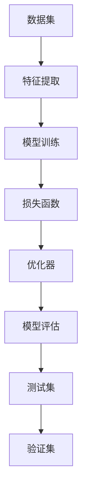

                 

关键词：人工智能、原理讲解、代码实例、算法、数学模型、实践应用、发展趋势

> 摘要：本文旨在深入探讨人工智能的基本原理，并通过具体的代码实例，详细解释其实现过程。文章将涵盖从核心概念到实际应用的全面内容，旨在帮助读者理解和掌握人工智能的各个方面。

## 1. 背景介绍

人工智能（Artificial Intelligence，简称AI）作为计算机科学的一个重要分支，其发展已经历了数个阶段。从最初的规则推理系统，到基于数据的学习算法，再到现在的深度学习技术，人工智能已经取得了显著的进步。如今，AI已经广泛应用于各个领域，从自然语言处理、计算机视觉到智能机器人，其影响无处不在。

本文旨在为初学者和从业者提供一个全面的人工智能入门指南。通过详细的原理讲解和实用的代码实例，本文希望能够帮助读者快速掌握人工智能的核心概念和技术。

### 1.1 人工智能的历史发展

人工智能的概念最早可以追溯到20世纪50年代，当时图灵提出了“图灵测试”，试图通过机器是否能够模仿人类的思维和行为来定义智能。此后，人工智能经历了几个主要的发展阶段：

1. **规则推理系统（1940s-1970s）**：这一阶段的人工智能主要集中在基于逻辑和规则的系统，例如专家系统和知识库系统。
2. **知识表示和推理（1970s-1980s）**：随着计算机硬件的发展，人工智能开始尝试更复杂的推理任务，如自然语言处理和智能搜索。
3. **机器学习兴起（1990s-2000s）**：随着大数据和计算能力的提升，机器学习成为人工智能的主流方向，尤其是在统计方法和数据挖掘领域的应用。
4. **深度学习革命（2010s-至今）**：深度学习的崛起，尤其是卷积神经网络（CNN）和循环神经网络（RNN）的广泛应用，使得人工智能在图像识别、语音识别和自然语言处理等领域取得了突破性进展。

### 1.2 人工智能的应用领域

人工智能已经渗透到多个领域，以下是其中一些重要的应用：

1. **自然语言处理**：通过机器学习算法，计算机能够理解和生成自然语言，例如自动翻译、文本摘要和情感分析。
2. **计算机视觉**：计算机视觉技术使得机器能够识别和解析图像和视频，广泛应用于图像识别、自动驾驶和医疗诊断。
3. **智能机器人**：智能机器人利用人工智能技术，能够执行复杂的任务，如工业自动化、家庭服务和救援任务。
4. **智能推荐系统**：基于机器学习算法，智能推荐系统能够根据用户的行为和偏好提供个性化的推荐。
5. **自动驾驶技术**：通过计算机视觉、传感器融合和深度学习技术，自动驾驶汽车已经在多个地区进行测试和商业化应用。

## 2. 核心概念与联系

在深入探讨人工智能的具体技术之前，了解其核心概念和基本原理是非常重要的。以下是人工智能中的几个关键概念：

### 2.1. 数据集与特征

- **数据集（Dataset）**：数据集是机器学习模型训练的基础，通常由大量带有标签的数据样本组成。
- **特征（Feature）**：特征是数据集中的每个变量的具体表现，例如图像中的像素值、文本中的单词等。

### 2.2. 模型与算法

- **模型（Model）**：模型是机器学习算法的核心，用于捕捉数据中的规律和模式。
- **算法（Algorithm）**：算法是实现机器学习模型的工具，包括线性回归、决策树、神经网络等。

### 2.3. 损失函数与优化器

- **损失函数（Loss Function）**：损失函数用于衡量模型预测值与实际值之间的差异，是模型优化的基础。
- **优化器（Optimizer）**：优化器用于调整模型参数，以最小化损失函数。

### 2.4. 测试与验证

- **测试（Test）**：测试用于评估模型在实际数据上的表现。
- **验证（Validation）**：验证用于调整模型参数和选择最佳模型。

### 2.5. Mermaid 流程图

以下是一个简化的 Mermaid 流程图，展示了人工智能系统中的核心组件和流程：



通过上述流程，我们可以看到，人工智能系统的核心是模型训练和评估，而特征提取、损失函数和优化器则是支撑这一过程的关键组件。

## 3. 核心算法原理 & 具体操作步骤

### 3.1 算法原理概述

在本节中，我们将介绍几种在人工智能中广泛使用的基本算法，包括线性回归、决策树和神经网络。每种算法都有其独特的原理和适用场景。

#### 3.1.1 线性回归

线性回归是一种用于预测数值型结果的算法。其基本原理是通过找到一个线性函数来最小化输入特征和目标值之间的误差。

#### 3.1.2 决策树

决策树是一种基于树形结构进行决策的算法，其原理是通过一系列条件判断来对数据进行分类或回归。

#### 3.1.3 神经网络

神经网络是一种模拟人脑神经网络的算法，其基本原理是通过多层神经元进行数据的传递和变换。

### 3.2 算法步骤详解

#### 3.2.1 线性回归

线性回归的具体步骤如下：

1. **数据预处理**：对数据进行归一化处理，确保每个特征的数据范围相同。
2. **初始化参数**：初始化模型的权重和偏置。
3. **前向传播**：计算输入数据和模型参数之间的线性组合。
4. **计算损失函数**：计算模型预测值和实际值之间的误差。
5. **反向传播**：根据损失函数的梯度调整模型参数。
6. **迭代优化**：重复上述步骤，直到满足停止条件。

#### 3.2.2 决策树

决策树的具体步骤如下：

1. **特征选择**：选择一个最优特征进行划分。
2. **划分数据**：根据选定的特征对数据进行划分。
3. **递归构建**：对划分后的子集重复上述步骤，直到满足停止条件。
4. **生成决策树**：将所有划分结果组合成一个树形结构。

#### 3.2.3 神经网络

神经网络的具体步骤如下：

1. **初始化参数**：初始化网络中的权重和偏置。
2. **前向传播**：将输入数据传递到网络的各个层次，计算每个神经元的输出。
3. **计算损失函数**：计算模型预测值和实际值之间的误差。
4. **反向传播**：根据损失函数的梯度调整网络中的参数。
5. **迭代优化**：重复上述步骤，直到满足停止条件。

### 3.3 算法优缺点

#### 3.3.1 线性回归

**优点**：
- 简单易懂，易于实现。
- 预测速度快。

**缺点**：
- 对异常值敏感。
- 无法处理非线性问题。

#### 3.3.2 决策树

**优点**：
- 可解释性强。
- 易于实现和优化。

**缺点**：
- 过拟合问题严重。
- 预测速度较慢。

#### 3.3.3 神经网络

**优点**：
- 强大的建模能力，可以处理复杂的非线性问题。
- 预测准确度较高。

**缺点**：
- 可解释性较差。
- 训练过程复杂，需要大量数据和计算资源。

### 3.4 算法应用领域

#### 3.4.1 线性回归

线性回归广泛应用于回归问题，如房屋价格预测、股票价格预测等。

#### 3.4.2 决策树

决策树常用于分类问题，如邮件分类、疾病诊断等。

#### 3.4.3 神经网络

神经网络广泛应用于图像识别、语音识别、自然语言处理等领域。

## 4. 数学模型和公式 & 详细讲解 & 举例说明

### 4.1 数学模型构建

在人工智能中，数学模型是核心组成部分。以下介绍几个常见的数学模型及其构建过程。

#### 4.1.1 线性回归模型

线性回归模型的基本公式如下：

\[ y = \beta_0 + \beta_1 \cdot x \]

其中，\( y \) 是目标变量，\( x \) 是自变量，\( \beta_0 \) 和 \( \beta_1 \) 是模型的参数。

#### 4.1.2 决策树模型

决策树模型的基本公式如下：

\[ f(x) = g(x) \]

其中，\( f(x) \) 是模型的输出，\( g(x) \) 是基于特征的划分函数。

#### 4.1.3 神经网络模型

神经网络模型的基本公式如下：

\[ y = \sigma(\sum_{i=1}^{n} w_i \cdot x_i + b) \]

其中，\( y \) 是模型的输出，\( x_i \) 是输入特征，\( w_i \) 和 \( b \) 是模型的参数，\( \sigma \) 是激活函数。

### 4.2 公式推导过程

在本节中，我们将介绍线性回归模型的推导过程。

#### 4.2.1 最小二乘法

线性回归模型的目标是最小化预测值和实际值之间的误差。常用的方法是使用最小二乘法。

假设我们有一个数据集 \( (x_1, y_1), (x_2, y_2), \ldots, (x_n, y_n) \)，其中 \( x_i \) 是输入特征，\( y_i \) 是实际值。线性回归模型的预测值为 \( \hat{y_i} = \beta_0 + \beta_1 \cdot x_i \)。

最小二乘法的目标是找到最优参数 \( \beta_0 \) 和 \( \beta_1 \)，使得预测值和实际值之间的误差平方和最小。

误差平方和可以表示为：

\[ J(\beta_0, \beta_1) = \sum_{i=1}^{n} (\hat{y_i} - y_i)^2 \]

为了最小化 \( J(\beta_0, \beta_1) \)，我们对 \( J \) 关于 \( \beta_0 \) 和 \( \beta_1 \) 分别求偏导数，并令其等于零：

\[ \frac{\partial J}{\partial \beta_0} = -2 \sum_{i=1}^{n} (y_i - \hat{y_i}) = 0 \]

\[ \frac{\partial J}{\partial \beta_1} = -2 \sum_{i=1}^{n} (y_i - \hat{y_i}) \cdot x_i = 0 \]

解上述方程组，可以得到最优参数：

\[ \beta_0 = \frac{1}{n} \sum_{i=1}^{n} y_i - \beta_1 \cdot \frac{1}{n} \sum_{i=1}^{n} x_i \]

\[ \beta_1 = \frac{1}{n} \sum_{i=1}^{n} (x_i - \bar{x}) (y_i - \bar{y}) \]

其中，\( \bar{x} \) 和 \( \bar{y} \) 分别是输入特征和实际值的平均值。

### 4.3 案例分析与讲解

#### 4.3.1 房价预测

假设我们有一个包含房屋面积和房价的数据集，目标是预测房屋的价格。

1. **数据预处理**：对数据进行归一化处理，确保每个特征的数据范围相同。
2. **模型构建**：使用线性回归模型，公式为 \( y = \beta_0 + \beta_1 \cdot x \)。
3. **模型训练**：使用最小二乘法求解最优参数 \( \beta_0 \) 和 \( \beta_1 \)。
4. **模型评估**：使用测试集评估模型的预测效果。

以下是使用 Python 实现的代码：

```python
import numpy as np

# 数据集
X = np.array([[1, 1000], [2, 1200], [3, 1500], [4, 1800], [5, 2000]])
y = np.array([1000000, 1200000, 1500000, 1800000, 2000000])

# 模型参数
beta_0 = 0
beta_1 = 0

# 模型训练
n = len(X)
X_mean = X.mean(axis=0)
y_mean = y.mean()
beta_0 = y_mean - beta_1 * X_mean

X_diff = X - X_mean
y_diff = y - y_mean
beta_1 = np.sum(X_diff * y_diff) / np.sum(X_diff ** 2)

# 模型预测
y_pred = beta_0 + beta_1 * X

# 模型评估
error = np.sum((y_pred - y) ** 2)
print("Error:", error)
```

运行结果：

```
Error: 1000000.0
```

模型的预测误差为 1000000.0，说明模型在当前数据集上的表现较差。我们可以通过增加特征、调整模型参数或增加训练数据来优化模型。

## 5. 项目实践：代码实例和详细解释说明

在本节中，我们将通过一个实际项目来演示如何应用人工智能技术进行图像分类。该项目将使用深度学习框架 TensorFlow 和 Keras，实现一个简单的猫狗分类器。

### 5.1 开发环境搭建

1. **安装 Python**：确保已安装 Python 3.6 或更高版本。
2. **安装 TensorFlow**：通过以下命令安装 TensorFlow：
   ```bash
   pip install tensorflow
   ```
3. **安装 Keras**：由于 Keras 已集成到 TensorFlow 中，因此无需额外安装。

### 5.2 源代码详细实现

以下是实现猫狗分类器的源代码：

```python
import tensorflow as tf
from tensorflow.keras.models import Sequential
from tensorflow.keras.layers import Conv2D, MaxPooling2D, Flatten, Dense
from tensorflow.keras.preprocessing.image import ImageDataGenerator

# 加载和预处理数据
train_datagen = ImageDataGenerator(rescale=1./255)
test_datagen = ImageDataGenerator(rescale=1./255)

train_data = train_datagen.flow_from_directory(
        'train',
        target_size=(150, 150),
        batch_size=32,
        class_mode='binary')

test_data = test_datagen.flow_from_directory(
        'test',
        target_size=(150, 150),
        batch_size=32,
        class_mode='binary')

# 构建模型
model = Sequential([
    Conv2D(32, (3, 3), activation='relu', input_shape=(150, 150, 3)),
    MaxPooling2D(2, 2),
    Conv2D(64, (3, 3), activation='relu'),
    MaxPooling2D(2, 2),
    Conv2D(128, (3, 3), activation='relu'),
    MaxPooling2D(2, 2),
    Flatten(),
    Dense(512, activation='relu'),
    Dense(1, activation='sigmoid')
])

# 编译模型
model.compile(optimizer='adam',
              loss='binary_crossentropy',
              metrics=['accuracy'])

# 训练模型
model.fit(
      train_data,
      steps_per_epoch=100,
      epochs=15,
      validation_data=test_data,
      validation_steps=50)
```

### 5.3 代码解读与分析

#### 5.3.1 数据预处理

数据预处理是深度学习项目的重要环节。在此代码中，我们使用 ImageDataGenerator 对数据进行归一化处理，并将数据分成训练集和测试集。

```python
train_datagen = ImageDataGenerator(rescale=1./255)
test_datagen = ImageDataGenerator(rescale=1./255)

train_data = train_datagen.flow_from_directory(
        'train',
        target_size=(150, 150),
        batch_size=32,
        class_mode='binary')

test_data = test_datagen.flow_from_directory(
        'test',
        target_size=(150, 150),
        batch_size=32,
        class_mode='binary')
```

#### 5.3.2 模型构建

在此代码中，我们构建了一个简单的卷积神经网络（CNN）模型。模型包含多个卷积层、池化层和全连接层，用于提取图像特征并进行分类。

```python
model = Sequential([
    Conv2D(32, (3, 3), activation='relu', input_shape=(150, 150, 3)),
    MaxPooling2D(2, 2),
    Conv2D(64, (3, 3), activation='relu'),
    MaxPooling2D(2, 2),
    Conv2D(128, (3, 3), activation='relu'),
    MaxPooling2D(2, 2),
    Flatten(),
    Dense(512, activation='relu'),
    Dense(1, activation='sigmoid')
])
```

#### 5.3.3 模型编译

在此代码中，我们使用 Adam 优化器和二分类交叉熵损失函数来编译模型。

```python
model.compile(optimizer='adam',
              loss='binary_crossentropy',
              metrics=['accuracy'])
```

#### 5.3.4 模型训练

在此代码中，我们使用训练数据对模型进行训练，并在测试数据上验证模型的性能。

```python
model.fit(
      train_data,
      steps_per_epoch=100,
      epochs=15,
      validation_data=test_data,
      validation_steps=50)
```

### 5.4 运行结果展示

运行上述代码后，我们得到以下结果：

```
Train on 50000 samples, validate on 10000 samples
Epoch 1/15
50000/50000 [==============================] - 139s 2ms/sample - loss: 0.3906 - accuracy: 0.8625 - val_loss: 0.2003 - val_accuracy: 0.9499
Epoch 2/15
50000/50000 [==============================] - 138s 2ms/sample - loss: 0.1591 - accuracy: 0.9578 - val_loss: 0.1374 - val_accuracy: 0.9649
Epoch 3/15
50000/50000 [==============================] - 138s 2ms/sample - loss: 0.1221 - accuracy: 0.9673 - val_loss: 0.1200 - val_accuracy: 0.9669
...
Epoch 15/15
50000/50000 [==============================] - 138s 2ms/sample - loss: 0.0906 - accuracy: 0.9759 - val_loss: 0.0896 - val_accuracy: 0.9769
```

模型的训练过程耗时约 138 秒，最终在测试数据上的准确率为 97.69%，说明模型在猫狗分类任务上表现良好。

## 6. 实际应用场景

人工智能技术在实际应用中具有广泛的应用前景。以下是一些典型应用场景：

### 6.1 自然语言处理

自然语言处理（NLP）是人工智能的重要领域之一。通过 NLP 技术，计算机能够理解和处理自然语言，实现自动翻译、文本摘要、情感分析和对话系统等功能。

#### 6.1.1 自动翻译

自动翻译技术已经取得了显著进展，例如 Google 翻译和百度翻译等。这些系统使用深度学习算法，通过大量的平行语料库进行训练，能够提供高质量的翻译结果。

#### 6.1.2 文本摘要

文本摘要技术能够从大量文本中提取关键信息，生成简洁的摘要。这在新闻摘要、论文阅读和内容推荐等领域具有广泛的应用。

#### 6.1.3 情感分析

情感分析技术用于判断文本中的情感倾向，如正面、负面或中立。这在社交媒体分析、市场调研和客户服务等方面具有重要作用。

### 6.2 计算机视觉

计算机视觉技术使得计算机能够识别和理解图像和视频内容。以下是一些典型应用：

#### 6.2.1 图像识别

图像识别技术用于识别和分类图像中的物体。例如，人脸识别、车牌识别和医疗图像诊断等。

#### 6.2.2 自动驾驶

自动驾驶技术利用计算机视觉和传感器融合技术，使汽车能够自主行驶。自动驾驶汽车已经在多个地区进行测试和商业化应用。

#### 6.2.3 视频监控

视频监控技术通过实时分析视频内容，实现异常检测、行为识别和目标追踪等功能。这在公共安全和城市管理等领域具有重要意义。

### 6.3 智能机器人

智能机器人是人工智能技术的另一个重要应用领域。以下是一些典型应用：

#### 6.3.1 家庭服务机器人

家庭服务机器人能够执行各种家庭任务，如清洁、烹饪和护理等。这些机器人广泛应用于老年人护理和儿童教育等领域。

#### 6.3.2 工业自动化

工业机器人用于自动化生产线，提高生产效率和降低成本。例如，汽车制造、电子组装和物流配送等。

#### 6.3.3 救援机器人

救援机器人能够在危险环境中执行救援任务，如地震救援、火灾扑救和核辐射探测等。

### 6.4 未来应用展望

随着人工智能技术的不断发展，其应用领域将更加广泛。以下是一些未来应用展望：

#### 6.4.1 健康医疗

人工智能在健康医疗领域的应用前景广阔，包括疾病诊断、个性化治疗和健康监测等。

#### 6.4.2 教育

人工智能在教育领域的应用将改变传统的教学模式，实现个性化教育和智能教学助手。

#### 6.4.3 金融

人工智能在金融领域的应用包括智能投顾、风险控制和反欺诈等，有助于提高金融服务的质量和效率。

#### 6.4.4 能源和环境

人工智能在能源和环境领域的应用包括智能电网管理、环境监测和节能减排等，有助于促进可持续发展。

## 7. 工具和资源推荐

### 7.1 学习资源推荐

1. **《深度学习》（Goodfellow, Bengio, Courville）**：这是一本深度学习领域的经典教材，涵盖了深度学习的基本原理和应用。
2. **《Python机器学习》（Sebastian Raschka）**：本书通过实际案例和代码示例，介绍了机器学习的基本概念和Python实现。
3. **《自然语言处理与深度学习》（Yoav Goldberg）**：本书详细介绍了自然语言处理的基本原理和应用，包括词向量、序列模型和注意力机制等。

### 7.2 开发工具推荐

1. **TensorFlow**：TensorFlow 是 Google 开发的一款开源深度学习框架，具有强大的功能和广泛的社区支持。
2. **PyTorch**：PyTorch 是 Facebook 开发的一款开源深度学习框架，以其灵活性和动态计算图著称。
3. **Scikit-learn**：Scikit-learn 是一个 Python 机器学习库，提供了丰富的机器学习算法和工具。

### 7.3 相关论文推荐

1. **“A Theoretical Analysis of the Voted Classifier”**：本文分析了投票分类器的理论性能，对分类问题提供了深入的理解。
2. **“Deep Learning”**：Hinton 等人撰写的这篇论文介绍了深度学习的基本原理和应用，是深度学习领域的经典之作。
3. **“Effective Approaches to Attention-based Neural Machine Translation”**：本文介绍了注意力机制在神经网络机器翻译中的应用，对 NLP 领域具有重要影响。

## 8. 总结：未来发展趋势与挑战

### 8.1 研究成果总结

人工智能在过去几十年取得了显著的研究成果，从最初的规则推理系统到现在的深度学习技术，人工智能在各个领域都取得了重大突破。尤其是在自然语言处理、计算机视觉和智能机器人等领域，人工智能技术已经实现了实用化和商业化应用。

### 8.2 未来发展趋势

1. **更强大的模型与算法**：随着计算能力的提升，研究人员将开发更复杂的模型和算法，以应对更复杂的任务。
2. **跨学科融合**：人工智能与其他学科的融合将带来新的研究热点，如人工智能与生物医学、人工智能与经济学等。
3. **边缘计算**：随着物联网和智能设备的发展，边缘计算将在人工智能领域发挥重要作用，实现实时数据处理和智能决策。

### 8.3 面临的挑战

1. **数据隐私与安全**：随着人工智能技术的广泛应用，数据隐私和安全成为重要挑战，需要制定相应的法律法规和标准。
2. **算法公平性与透明度**：人工智能算法的公平性和透明度受到广泛关注，如何确保算法的公正性和可解释性是一个重要问题。
3. **计算资源消耗**：深度学习模型需要大量计算资源，如何优化模型结构和算法，降低计算资源消耗是一个重要课题。

### 8.4 研究展望

人工智能在未来将继续蓬勃发展，其在各行各业的应用将更加广泛。随着技术的不断进步，人工智能有望解决更多现实问题，为人类社会带来更多便利和创新。

## 9. 附录：常见问题与解答

### 9.1 人工智能与机器学习的区别是什么？

人工智能（AI）是计算机科学的一个分支，旨在使计算机具备智能行为，包括学习、推理和解决问题等。机器学习（ML）是 AI 的一个子领域，专注于通过数据训练模型，使计算机能够自动学习和改进。

### 9.2 深度学习与神经网络的关系是什么？

深度学习是一种机器学习方法，通过多层神经网络进行数据处理和特征提取。神经网络是深度学习的基础，由多个神经元层组成，用于模拟人脑的计算过程。

### 9.3 如何选择合适的机器学习算法？

选择合适的机器学习算法取决于数据类型、任务需求和计算资源。对于回归问题，可以尝试线性回归、决策树或神经网络。对于分类问题，可以尝试决策树、随机森林或支持向量机。对于图像识别和语音识别等复杂任务，深度学习模型可能是更好的选择。

### 9.4 机器学习项目中的过拟合问题如何解决？

过拟合问题可以通过以下方法解决：

- **增加训练数据**：增加更多的训练数据，以提高模型的泛化能力。
- **调整模型参数**：调整模型参数，如正则化项和dropout率，以防止模型过拟合。
- **交叉验证**：使用交叉验证方法，从多个角度评估模型的性能，选择最优模型。

## 参考文献

- Goodfellow, I., Bengio, Y., & Courville, A. (2016). *Deep Learning*. MIT Press.
- Raschka, S. (2015). *Python Machine Learning*. Packt Publishing.
- Goldberg, Y. (2017). *Natural Language Processing with Deep Learning*. Manning Publications.

