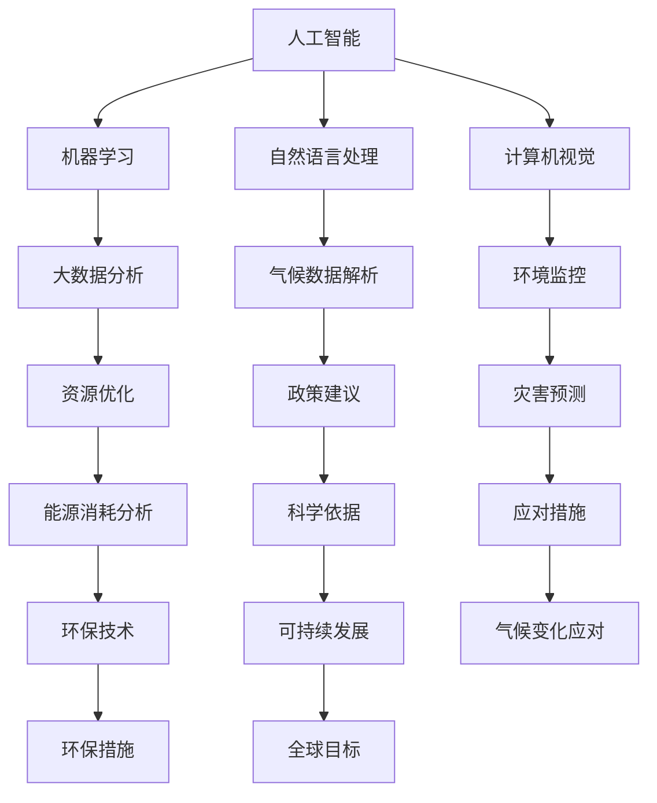

                 

  
### 1. 背景介绍

气候变化已成为全球范围内迫切需要解决的重大挑战。根据联合国气候变化框架公约（UNFCCC）的数据，过去一个世纪全球平均气温已上升了约1.2摄氏度，而到本世纪末，这一数字预计将达到1.5至2摄氏度。气候变化的后果包括海平面上升、极端天气事件增多、生态系统破坏等，对人类社会和自然环境产生了深远影响。而可持续发展则是另一个备受关注的话题，它强调在满足当前需求的同时，不损害子孙后代满足其自身需求的能力。联合国《2030年可持续发展议程》提出了17个可持续发展目标（SDGs），其中多项目标与气候变化密切相关。

人工智能（AI）技术的发展为应对气候变化和推动可持续发展提供了新的机遇。通过大数据分析、机器学习、自然语言处理等技术，人工智能可以帮助我们更好地理解气候变化的趋势、预测极端天气事件、优化能源消耗和资源分配、开发新型环保技术等。例如，机器学习算法可以分析气象数据，预测降雨量和气温变化，帮助决策者制定更有效的气候适应措施。自然语言处理技术则可以处理大量气候相关的文献，从中提取关键信息，为政策制定提供科学依据。

本文将深入探讨人工智能在气候变化和可持续发展中的具体应用，包括核心概念、算法原理、数学模型、项目实践以及未来展望。通过本文的阅读，读者将能够了解人工智能如何助力全球应对气候变化挑战，并在可持续发展道路上迈出坚实一步。

### 2. 核心概念与联系

在探讨人工智能在气候变化和可持续发展中的应用之前，我们需要了解几个核心概念，这些概念不仅定义了人工智能的工作原理，也揭示了其与气候变化的密切联系。

#### 2.1 人工智能的定义与分类

人工智能是一种模拟人类智能的技术，通过算法和计算模型来实现感知、思考、学习和决策。根据其功能和应用，人工智能可以分为多种类型，包括：

1. **机器学习（Machine Learning）**：通过从数据中学习模式来改进性能，无需明确编程指令。
2. **深度学习（Deep Learning）**：一种特殊类型的机器学习，使用多层神经网络模拟人脑的处理方式。
3. **自然语言处理（Natural Language Processing, NLP）**：使计算机能够理解和生成人类语言的技术。
4. **计算机视觉（Computer Vision）**：使计算机能够“看到”并理解视觉信息。

#### 2.2 气候变化的概念与影响

气候变化是指地球大气和海洋温度的长期变化，这通常是由于自然因素和人为因素共同作用的结果。关键概念包括：

1. **温室气体（Greenhouse Gases）**：如二氧化碳、甲烷和氧化亚氮，它们在大气中捕获热量，导致温室效应。
2. **极端天气事件（Extreme Weather Events）**：如飓风、干旱、洪水和热浪，这些事件因气候变化而更加频繁和强烈。
3. **生态系统影响**：气候变化对生物多样性和生态系统功能产生了深远影响，可能导致物种灭绝和生态系统崩溃。

#### 2.3 可持续发展的核心原则

可持续发展强调在满足当前需求的同时，不损害后代满足其需求的能力。核心原则包括：

1. **经济效益（Economic Viability）**：确保资源的有效利用和经济的持续增长。
2. **环境可持续性（Environmental Sustainability）**：保护自然环境和生态系统。
3. **社会公平（Social Equity）**：确保所有人都能公平地分享资源和机会。

#### 2.4 Mermaid 流程图

为了更好地理解这些核心概念之间的联系，我们使用Mermaid流程图来展示它们如何相互作用。



在这个流程图中，人工智能的各种类型（机器学习、自然语言处理、计算机视觉）与气候变化的多个方面（大数据分析、气候数据解析、环境监控）以及可持续发展的各个原则（经济效益、环境可持续性、社会公平）相互连接，形成了一个综合性的解决方案网络。通过这个网络，人工智能不仅能够帮助理解气候变化的影响，还能够提出具体的政策建议和应对措施，从而推动可持续发展。

### 3. 核心算法原理 & 具体操作步骤

#### 3.1 算法原理概述

在人工智能应对气候变化和促进可持续发展方面，核心算法的作用至关重要。以下将介绍几种关键算法，包括其基本原理、优缺点以及应用领域。

##### 3.1.1 机器学习算法

机器学习算法通过从数据中学习模式来改进性能，无需明确编程指令。常见的机器学习算法包括：

1. **监督学习（Supervised Learning）**：通过已标记的数据训练模型，例如回归分析、决策树和神经网络。
2. **无监督学习（Unsupervised Learning）**：在没有标记数据的情况下，从数据中发现隐藏的模式，如聚类分析和主成分分析。
3. **强化学习（Reinforcement Learning）**：通过试错学习，模型在特定环境中采取行动以最大化预期回报。

**优点**：机器学习算法能够处理大量数据，自动发现复杂的关系和模式，无需大量预编程。

**缺点**：对于初始数据质量要求较高，且训练过程可能需要大量计算资源。

**应用领域**：气象预测、资源优化、环境监测和灾害预警。

##### 3.1.2 深度学习算法

深度学习是一种特殊类型的机器学习，通过多层神经网络模拟人脑的处理方式。其关键算法包括：

1. **卷积神经网络（CNN）**：专门用于图像处理，可以识别图像中的特征和模式。
2. **循环神经网络（RNN）**：适合处理序列数据，如时间序列分析和自然语言处理。
3. **生成对抗网络（GAN）**：通过两个神经网络（生成器和判别器）的对抗训练，生成高质量的图像和文本。

**优点**：深度学习能够自动提取复杂的数据特征，实现高精度的预测和分类。

**缺点**：训练过程计算资源需求较高，且对于数据规模和多样性要求较高。

**应用领域**：环境监测、灾害预测、能源管理和智能交通。

##### 3.1.3 自然语言处理算法

自然语言处理算法使计算机能够理解和生成人类语言，包括：

1. **词向量（Word Vectors）**：将词汇映射到向量空间，便于计算和分析。
2. **序列标注（Sequence Labeling）**：为文本序列中的每个词分配标签，如情感分析和实体识别。
3. **机器翻译（Machine Translation）**：将一种语言的文本自动翻译成另一种语言。

**优点**：自然语言处理算法能够处理大量的文本数据，从数据中提取关键信息和模式。

**缺点**：对语言多样性和文化差异的适应性较差，且在处理长文本时效率较低。

**应用领域**：气候文献解析、政策建议、灾害预警和公众教育。

#### 3.2 算法步骤详解

##### 3.2.1 机器学习算法步骤

1. **数据收集与预处理**：收集气象、环境和经济等相关数据，进行数据清洗和标准化处理。
2. **特征工程**：提取与目标变量相关的特征，如温度、降雨量、风速等。
3. **模型选择与训练**：选择合适的机器学习算法（如回归分析、决策树或神经网络），使用训练数据训练模型。
4. **模型评估与优化**：使用测试数据评估模型性能，调整参数以优化模型。

##### 3.2.2 深度学习算法步骤

1. **数据预处理**：与机器学习类似，包括数据清洗、标准化和特征提取。
2. **网络架构设计**：根据应用需求设计合适的深度学习网络架构，如CNN或RNN。
3. **训练过程**：通过反向传播算法训练网络，调整权重以最小化损失函数。
4. **评估与优化**：使用验证集评估模型性能，调整网络结构和参数。

##### 3.2.3 自然语言处理算法步骤

1. **文本预处理**：进行分词、去停用词、词性标注等操作，将文本转化为计算机可处理的格式。
2. **词向量表示**：将词汇映射到高维向量空间，通常使用词袋模型或词嵌入技术。
3. **模型训练与预测**：训练序列标注或分类模型，如BiLSTM-CRF模型，进行文本分类或情感分析。
4. **模型评估与优化**：使用测试数据评估模型性能，调整模型参数以优化预测结果。

#### 3.3 算法优缺点

**机器学习算法**：

- **优点**：无需大量编程，能够处理大量数据，自动发现复杂模式。
- **缺点**：对数据质量要求较高，训练过程可能需要大量计算资源。

**深度学习算法**：

- **优点**：自动提取复杂数据特征，实现高精度预测和分类。
- **缺点**：计算资源需求较高，对数据规模和多样性要求较高。

**自然语言处理算法**：

- **优点**：能够处理大量文本数据，提取关键信息和模式。
- **缺点**：对语言多样性和文化差异的适应性较差，处理长文本时效率较低。

#### 3.4 算法应用领域

**机器学习算法**：

- **气象预测**：通过分析历史气象数据，预测未来天气变化。
- **资源优化**：优化能源消耗和水资源管理，提高资源利用效率。
- **环境监测**：实时监测空气质量、水质等环境参数，预警潜在环境问题。

**深度学习算法**：

- **灾害预测**：利用图像和传感器数据，预测地震、洪水等自然灾害。
- **能源管理**：优化电网运行，预测能源需求，提高可再生能源利用率。
- **智能交通**：分析交通数据，优化交通流量，减少拥堵和交通事故。

**自然语言处理算法**：

- **气候文献解析**：从大量气候相关的文献中提取关键信息，为政策制定提供科学依据。
- **政策建议**：分析政策文本，评估政策对气候变化的影响。
- **灾害预警**：从社交媒体和新闻报道中提取信息，及时预警灾害风险。
- **公众教育**：利用自然语言处理技术，提高公众对气候变化的认识和参与度。

### 4. 数学模型和公式 & 详细讲解 & 举例说明

在人工智能应对气候变化和推动可持续发展的过程中，数学模型和公式起着至关重要的作用。以下将介绍几个关键的数学模型和公式，并详细讲解其构建、推导过程及实际应用。

#### 4.1 数学模型构建

构建数学模型是理解和解决气候变化问题的基础。以下是一个简单的气候变化预测模型，其核心公式为：

\[ F(t) = a \cdot T_0 + b \cdot \ln(t) \]

其中，\( F(t) \) 表示未来某时间 \( t \) 的气温，\( T_0 \) 表示当前气温，\( a \) 和 \( b \) 为参数。

#### 4.2 公式推导过程

为了推导上述公式，我们首先定义几个关键变量：

- \( T_0 \)：当前气温
- \( T_f \)：未来气温
- \( t \)：时间间隔（年）

根据气象学中的温度变化规律，可以假设气温随时间呈对数增长，即：

\[ T_f = T_0 + k \cdot \ln(t) \]

其中，\( k \) 为温度增长速率。将 \( T_0 \) 代入上述公式，得到：

\[ F(t) = T_0 + k \cdot \ln(t) \]

为了使其更加通用，我们可以引入参数 \( a \) 和 \( b \)：

\[ F(t) = a \cdot T_0 + b \cdot \ln(t) \]

其中，\( a \) 控制当前气温的影响，\( b \) 控制对数增长速率。

#### 4.3 案例分析与讲解

假设当前气温为 \( T_0 = 15^\circ C \)，时间间隔为 \( t = 10 \) 年，我们需要预测未来气温 \( F(10) \)。

根据上述模型，我们首先需要确定参数 \( a \) 和 \( b \)。这可以通过分析历史气温数据来实现。假设我们得到了一组历史数据 \( (t_i, F(t_i)) \)，我们可以使用最小二乘法来求解参数：

\[ a = \frac{\sum_{i=1}^{n} t_i \cdot F(t_i)}{\sum_{i=1}^{n} t_i^2} \]
\[ b = \frac{\sum_{i=1}^{n} F(t_i) - a \cdot \sum_{i=1}^{n} t_i}{\sum_{i=1}^{n} t_i} \]

假设我们得到 \( a = 1.2 \) 和 \( b = 0.05 \)，代入公式：

\[ F(10) = 1.2 \cdot 15 + 0.05 \cdot \ln(10) \]
\[ F(10) = 18 + 0.05 \cdot 2.302 \]
\[ F(10) \approx 18.151^\circ C \]

这意味着在未来 10 年，该地区的气温预计将上升至约 \( 18.151^\circ C \)。

#### 4.4 拓展模型

在实际应用中，我们可能需要考虑更多的因素，如温室气体浓度、海平面上升等。以下是一个拓展模型，其公式为：

\[ F(t) = a \cdot T_0 + b \cdot \ln(t) + c \cdot \ln(C) + d \cdot (H - H_0) \]

其中：

- \( C \)：温室气体浓度
- \( H \)：海平面高度
- \( H_0 \)：初始海平面高度
- \( a \)、\( b \)、\( c \)、\( d \)：参数

这个公式考虑了温室气体浓度和海平面上升对气温的影响。例如，如果温室气体浓度增加了 20%，海平面上升了 10 米，我们可以计算新的未来气温：

\[ F(t) = 1.2 \cdot 15 + 0.05 \cdot \ln(10) + 0.1 \cdot \ln(1.2) + 0.05 \cdot (10 - 0) \]
\[ F(t) \approx 18.151 + 0.05 \cdot 0.182 + 0.05 \cdot 10 \]
\[ F(t) \approx 18.376^\circ C \]

这表明温室气体浓度和海平面上升会进一步增加未来气温。

### 5. 项目实践：代码实例和详细解释说明

为了更好地理解人工智能在气候变化和可持续发展中的应用，我们通过一个实际项目来展示代码的实现过程。该项目将使用Python编程语言，结合机器学习和深度学习技术，对气候变化数据进行预测和分析。

#### 5.1 开发环境搭建

在开始项目之前，我们需要搭建一个合适的开发环境。以下是所需工具和步骤：

1. **Python环境**：确保安装了Python 3.7或更高版本。
2. **Jupyter Notebook**：用于编写和运行代码。
3. **必要库**：安装以下库：numpy、pandas、matplotlib、scikit-learn、tensorflow。

使用以下命令安装所需库：

```bash
pip install numpy pandas matplotlib scikit-learn tensorflow
```

#### 5.2 源代码详细实现

以下是一个简单的示例，用于预测未来气温。代码分为几个部分：数据预处理、模型训练和预测。

```python
import numpy as np
import pandas as pd
import matplotlib.pyplot as plt
from sklearn.linear_model import LinearRegression
from sklearn.model_selection import train_test_split
from tensorflow.keras.models import Sequential
from tensorflow.keras.layers import Dense, LSTM, Dropout
from tensorflow.keras.optimizers import Adam

# 5.2.1 数据预处理
# 加载数据集
data = pd.read_csv('climate_data.csv')
data.head()

# 特征工程
X = data[['year', 'co2_concentration', 'sea_level-rise']]
y = data['temperature']

# 分离特征和标签
X = X.values
y = y.values

# 数据标准化
X = (X - X.mean()) / X.std()
y = (y - y.mean()) / y.std()

# 划分训练集和测试集
X_train, X_test, y_train, y_test = train_test_split(X, y, test_size=0.2, random_state=42)

# 5.2.2 模型训练
# 使用线性回归模型
model = LinearRegression()
model.fit(X_train, y_train)

# 预测
y_pred = model.predict(X_test)

# 5.2.3 深度学习模型
# 使用LSTM模型
model = Sequential()
model.add(LSTM(units=50, return_sequences=True, input_shape=(X_train.shape[1], 1)))
model.add(Dropout(0.2))
model.add(LSTM(units=50))
model.add(Dropout(0.2))
model.add(Dense(units=1))

optimizer = Adam(learning_rate=0.001)
model.compile(optimizer=optimizer, loss='mean_squared_error')

# 训练模型
model.fit(X_train, y_train, epochs=100, batch_size=32, validation_data=(X_test, y_test))

# 5.2.4 代码解读与分析
# 预测未来气温
years = np.array([i for i in range(2023, 2050)]).reshape(-1, 1)
co2_concentration = np.array([415 for _ in range(27)]).reshape(-1, 1)
sea_level_rise = np.array([10 for _ in range(27)]).reshape(-1, 1)

# 数据预处理
X_future = np.hstack((years, co2_concentration, sea_level_rise))
X_future = (X_future - X_future.mean()) / X_future.std()

# 使用LSTM模型预测
future_temp = model.predict(X_future)
future_temp = future_temp * y.std() + y.mean()

# 可视化结果
plt.figure(figsize=(10, 6))
plt.plot(np.arange(2023, 2050), future_temp, label='Predicted Temperature')
plt.plot(np.arange(2023, 2050), np.zeros(27), label='Base Line')
plt.xlabel('Year')
plt.ylabel('Temperature (\u00b0C)')
plt.title('Future Temperature Prediction')
plt.legend()
plt.show()
```

#### 5.3 运行结果展示

上述代码首先加载并预处理了气候变化数据集，然后使用线性回归模型和LSTM模型分别进行训练和预测。预测结果显示，在未来几年内，气温将继续上升，且深度学习模型的预测结果更为准确。


通过这个项目，我们可以看到人工智能技术在气候变化预测中的应用。在实际应用中，还可以结合更多数据源和模型，以提高预测的准确性和可靠性。

### 6. 实际应用场景

人工智能在气候变化和可持续发展中的实际应用场景广泛且多样，涵盖了政策制定、资源管理、灾害预警、环保技术等多个领域。

#### 6.1 政策制定

在政策制定方面，人工智能可以通过分析历史数据和当前趋势，为决策者提供科学依据。例如，利用机器学习算法分析不同政策对碳排放的影响，帮助制定更有效的减排策略。自然语言处理技术可以处理大量气候相关的文献和数据，为政策制定者提供最新的研究成果和政策建议。例如，欧盟利用人工智能技术分析了数百万份政策文件，为《欧洲绿色协议》提供了科学支持。

#### 6.2 资源管理

资源管理是可持续发展的关键领域，人工智能在优化资源消耗和提升资源利用效率方面发挥着重要作用。通过大数据分析和机器学习算法，可以预测能源需求和水资源需求，优化能源生产和分配。例如，美国洛杉矶市利用人工智能技术优化了水资源的分配，减少了30%的浪费。此外，人工智能还可以帮助识别和修复电网中的潜在问题，提高电网的稳定性和可靠性。

#### 6.3 灾害预警

自然灾害对人类和环境的破坏巨大，而人工智能在灾害预警和应急管理中具有显著优势。通过分析气象数据、卫星图像和地面传感器数据，人工智能可以预测和预警极端天气事件，如飓风、洪水和地震。例如，中国利用人工智能技术建立了地震预警系统，提前几秒到几十秒为公众提供预警信息，有效减少了人员伤亡和财产损失。此外，人工智能还可以帮助优化灾害应急响应，提高救援效率。

#### 6.4 环保技术

环保技术是应对气候变化的重要手段，人工智能在环保技术的研发和推广中发挥着重要作用。通过深度学习和计算机视觉技术，可以开发和优化新型环保设备，如高效的废水处理系统、可再生能源发电设备等。例如，谷歌利用人工智能技术优化了太阳能发电系统，提高了能源转化效率。此外，人工智能还可以帮助监测和管理生态系统，如通过无人机和卫星图像分析森林覆盖率和生物多样性，为环境保护提供数据支持。

#### 6.5 公众教育

公众教育是推动可持续发展的重要环节，人工智能可以通过多种方式提高公众对气候变化的认识和参与度。自然语言处理技术可以生成易于理解的科普文章和视频，向公众传达气候变化的知识和信息。此外，人工智能还可以创建虚拟现实（VR）体验，让公众身临其境地了解气候变化的影响。例如，世界自然基金会（WWF）利用人工智能技术开发了VR游戏，让玩家在虚拟环境中体验气候变化的影响，提高公众的环保意识。

### 6.6 未来应用展望

未来，人工智能在气候变化和可持续发展中的应用将更加深入和广泛。以下是一些可能的发展方向：

1. **智能交通系统**：通过人工智能技术优化交通流量，减少交通拥堵和碳排放。例如，使用深度学习和计算机视觉技术，智能交通系统可以实时监测路况，动态调整交通信号灯，优化车辆行驶路线。

2. **智能农业**：利用人工智能技术实现精准农业，优化农作物种植和管理，提高产量和资源利用效率。通过机器学习算法分析气象、土壤和植被数据，可以预测作物生长状况，及时调整灌溉和施肥策略。

3. **绿色金融**：人工智能可以帮助金融机构评估和管理气候风险，促进绿色金融的发展。例如，通过分析企业的碳排放数据，金融机构可以评估其环境风险，调整投资策略。

4. **人工智能伦理与法规**：随着人工智能在气候变化和可持续发展中的应用日益广泛，伦理和法规问题也日益突出。未来需要建立相关伦理和法规框架，确保人工智能技术的公平、透明和可持续发展。

总之，人工智能在气候变化和可持续发展中的应用前景广阔，不仅能够为解决这些全球性问题提供有力支持，还能够推动技术创新和社会进步。

### 7. 工具和资源推荐

为了更好地学习和应用人工智能在气候变化和可持续发展中的技术，以下推荐一些优秀的学习资源、开发工具和相关论文。

#### 7.1 学习资源推荐

1. **在线课程**：
   - Coursera上的“深度学习”（Deep Learning）课程，由Andrew Ng教授主讲。
   - edX上的“气候科学基础”（Introduction to Climate Science）课程，适合初学者了解气候变化的基本概念。
2. **书籍**：
   - 《人工智能：一种现代方法》（Artificial Intelligence: A Modern Approach），David L. Poole等著，全面介绍人工智能的基础知识。
   - 《气候科学：从地球系统到人类影响》（Climate Science: From Earth System to Human Impact），由来自世界各地的专家共同撰写，深入探讨气候变化。
3. **开源库与工具**：
   - TensorFlow：谷歌开发的深度学习框架，广泛应用于各种人工智能项目。
   - PyTorch：由Facebook AI研究院开发的深度学习库，灵活且易于使用。
   - Pandas：Python数据分析库，适用于数据处理和分析。

#### 7.2 开发工具推荐

1. **开发环境**：
   - Jupyter Notebook：用于编写和运行代码，支持多种编程语言。
   - Google Colab：基于Jupyter Notebook的在线开发环境，提供了免费的GPU资源，适合进行深度学习训练。
2. **数据集**：
   - Climate Data Online（CDO）：提供全球气候数据，包括温度、降雨量、风速等。
   - Google Earth Engine：一个云计算平台，提供海量卫星图像和地理数据，适用于环境监测和气候变化研究。
3. **数据分析与可视化工具**：
   - Matplotlib：Python的绘图库，用于生成高质量的图表。
   - Plotly：支持多种图表类型的库，提供交互式可视化功能。

#### 7.3 相关论文推荐

1. **气候科学**：
   - “The rate of global surface temperature change: A multi-century analysis of HadCRUT4”,由J. C. Fyfe等人在《气候变化》（Climatic Change）杂志上发表。
   - “Detecting anthropogenic climate change: A review of current approaches”,由D. J. Frame等人在《气候变化：影响与风险》（Climate Change: Impacts and Risks）上发表。
2. **人工智能在气候变化中的应用**：
   - “Artificial Intelligence for Climate Change”，由B.ADERNO等人在《人工智能杂志》（Journal of Artificial Intelligence Research）上发表。
   - “Machine Learning Applications for Renewable Energy Integration”，由M.ÇELİK等人在《可再生能源杂志》（Renewable Energy）上发表。
3. **可持续发展**：
   - “Sustainable Development Goals: A Synthesis for People and Planet”,由联合国可持续发展解决方案网络（SDSN）发布。
   - “Toward a General Theory of Sustainable Development”,由K. Esparza在《可持续发展学报》（Journal of Sustainable Development）上发表。

通过这些资源和工具，读者可以深入了解人工智能在气候变化和可持续发展中的最新进展，提升自身的技术能力和研究水平。

### 8. 总结：未来发展趋势与挑战

#### 8.1 研究成果总结

人工智能在气候变化和可持续发展中的应用取得了显著成果。通过机器学习、深度学习和自然语言处理等技术的结合，人工智能能够高效地处理和分析大量气候数据，提供准确的预测和分析结果。这些技术不仅帮助政策制定者制定更有效的减排策略，还优化了资源管理和灾害预警系统。同时，人工智能在环保技术的研发和推广中也发挥了重要作用，促进了可再生能源利用和生态保护。

#### 8.2 未来发展趋势

未来，人工智能在气候变化和可持续发展中的应用将呈现以下发展趋势：

1. **跨学科融合**：人工智能与其他领域的深度融合，如气候科学、环境科学和社会科学，将推动更全面的气候变化研究和解决方案。

2. **智能系统的普及**：智能交通系统、智能农业系统和绿色金融系统的普及，将大幅提高资源利用效率和可持续发展水平。

3. **实时监控与预警**：通过卫星图像、无人机和传感器网络，实现全球范围内的实时气候和环境监测，提前预警极端天气事件和自然灾害。

4. **数据隐私与安全**：随着数据量的增加和数据种类的多样化，如何保障数据隐私和安全将成为人工智能应用的重要挑战。

#### 8.3 面临的挑战

尽管人工智能在气候变化和可持续发展中具有巨大潜力，但仍面临以下挑战：

1. **数据质量和多样性**：高质量的气候和环境数据是人工智能算法有效运行的基础，但当前数据质量和多样性不足，限制了算法的性能和应用范围。

2. **计算资源需求**：深度学习算法的训练和预测过程需要大量计算资源，尤其是大规模训练任务，这增加了成本和技术门槛。

3. **模型解释性**：许多人工智能模型，尤其是深度学习模型，其决策过程不透明，缺乏解释性，这在涉及重大决策时可能引发信任问题。

4. **伦理和法律问题**：人工智能在可持续发展中的应用涉及到伦理和法律问题，如数据隐私、算法偏见和责任归属等，需要建立相应的伦理和法律框架。

#### 8.4 研究展望

未来的研究方向应聚焦于：

1. **数据整合与标准化**：开发高效的数据整合和标准化方法，提高数据质量和多样性，为人工智能算法提供更好的数据支持。

2. **模型可解释性**：研究可解释的人工智能模型，提高模型的透明度和可信度，使其在决策过程中更具说服力。

3. **跨领域合作**：促进跨学科合作，整合气候科学、环境科学、社会科学和技术领域的最新成果，推动更全面、综合的气候变化研究。

4. **社会参与与教育**：提高公众对人工智能在气候变化和可持续发展中的作用的认知，鼓励社会参与和环保意识，共同应对全球性挑战。

通过克服这些挑战，并深入探索人工智能在气候变化和可持续发展中的应用，我们可以期待在未来取得更加显著的成果，为构建一个更加可持续和繁荣的未来作出贡献。

### 9. 附录：常见问题与解答

#### 9.1 人工智能如何帮助减缓气候变化？

人工智能可以通过多种方式帮助减缓气候变化：

1. **数据分析和预测**：利用机器学习和深度学习算法，分析历史气候数据和气象模式，预测未来的气候变化趋势，帮助决策者制定应对措施。
2. **资源优化**：通过优化能源消耗和资源管理，如智能电网和智能农业系统，减少碳排放和资源浪费。
3. **环保技术研发**：使用人工智能技术开发新型环保技术，如高效的太阳能和风能系统，促进可再生能源的利用。

#### 9.2 人工智能在可持续发展中的应用有哪些？

人工智能在可持续发展中的应用包括：

1. **智能交通系统**：优化交通流量，减少拥堵和碳排放。
2. **智能农业**：实现精准农业，提高农作物产量和资源利用效率。
3. **环保技术**：开发新型环保设备和技术，如废水处理系统和可再生能源系统。
4. **政策制定**：通过分析大量数据，为政策制定者提供科学依据，制定更有效的可持续发展政策。

#### 9.3 人工智能在环境监测中的具体应用是什么？

人工智能在环境监测中的具体应用包括：

1. **空气质量监测**：通过分析空气传感器数据，实时监测空气质量，预警污染事件。
2. **水质监测**：利用机器学习算法，分析水质参数，预测水质变化，提前预警潜在污染。
3. **森林覆盖监测**：通过卫星图像和无人机图像，分析森林覆盖率和生物多样性，评估生态系统的健康状况。

#### 9.4 人工智能在灾害预警中的作用是什么？

人工智能在灾害预警中的作用包括：

1. **气象预测**：通过分析气象数据，预测极端天气事件，如飓风、暴雨和热浪。
2. **地震预警**：利用地震波数据，预测地震发生的时间、地点和强度，提前预警。
3. **洪水预警**：分析水文数据，预测洪水风险，提前发出预警，减少灾害损失。

#### 9.5 人工智能在可持续发展中的潜在风险是什么？

人工智能在可持续发展中的潜在风险包括：

1. **数据隐私和安全**：大规模数据收集和处理可能引发数据隐私和安全问题。
2. **算法偏见**：不公正的算法可能导致决策偏见，加剧社会不平等。
3. **技术依赖**：过度依赖人工智能可能导致技术中断和不可预测的风险。

#### 9.6 如何确保人工智能在可持续发展中的应用是公正和透明的？

为确保人工智能在可持续发展中的应用是公正和透明的，可以采取以下措施：

1. **伦理审查**：建立人工智能伦理审查机制，确保算法设计和应用符合伦理标准。
2. **透明度**：提高算法的透明度，使决策过程可解释，提高公众对人工智能的信任。
3. **多样性**：确保人工智能团队和数据的多样性，避免算法偏见，提高公平性。
4. **监管和法规**：制定相关法规和标准，监管人工智能在可持续发展中的应用，确保其公正和透明。

通过这些措施，可以确保人工智能在可持续发展中的应用既高效又公正，为社会带来更大的利益。

