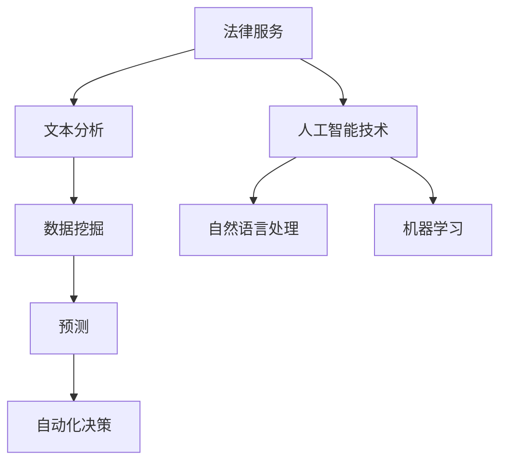

                 

关键词：人工智能、法律服务、效率、准确性、应用

摘要：随着人工智能技术的不断发展，其在法律服务领域的应用逐渐显现出巨大的潜力。本文将探讨人工智能在提高法律服务的效率与准确性方面所发挥的作用，并分析其在未来可能带来的变革。

## 1. 背景介绍

在当今社会，法律服务的需求不断增加，但传统法律服务的效率与准确性面临诸多挑战。传统法律服务往往依赖于律师和法官的经验判断，存在人为错误、效率低下等问题。此外，随着案件数量的增加，律师和法官的工作负担也在不断加重。因此，如何提高法律服务的效率与准确性，成为了当今法律界亟待解决的问题。

人工智能技术的发展为解决这一难题提供了新的思路。人工智能技术具有强大的数据分析和处理能力，可以自动化完成许多重复性、繁琐的工作，从而提高法律服务的效率。同时，人工智能还可以通过对大量法律文献的学习，提高法律分析的准确性。

## 2. 核心概念与联系

### 2.1 人工智能的基本概念

人工智能（Artificial Intelligence，AI）是指模拟、延伸和扩展人的智能的理论、方法、技术及应用。它包括机器学习、深度学习、自然语言处理、计算机视觉等多个子领域。在法律服务中，人工智能主要应用于文本分析、数据挖掘、预测和自动化决策等方面。

### 2.2 法律服务与人工智能的融合

法律服务与人工智能的融合主要体现在以下几个方面：

- **文本分析**：通过自然语言处理技术，对法律文件、案件文书等进行自动化分析和分类。
- **数据挖掘**：从大量法律案例、法规、判例中挖掘出有价值的信息，为法律分析和决策提供支持。
- **预测**：利用机器学习算法，对法律案件的结果进行预测，为律师提供策略参考。
- **自动化决策**：基于大数据分析和人工智能算法，实现法律案件的自动化处理和决策。

### 2.3 Mermaid 流程图

以下是法律服务与人工智能融合的 Mermaid 流程图：



## 3. 核心算法原理 & 具体操作步骤

### 3.1 算法原理概述

在人工智能在法律服务中的应用中，常见的核心算法包括自然语言处理（NLP）、机器学习（ML）、深度学习（DL）等。这些算法的基本原理如下：

- **自然语言处理（NLP）**：通过构建模型，实现对自然语言的理解、生成和翻译。
- **机器学习（ML）**：通过学习大量数据，自动提取规律，用于预测和分类。
- **深度学习（DL）**：基于多层神经网络，实现对复杂数据的高效分析和处理。

### 3.2 算法步骤详解

以自然语言处理在法律文本分析中的应用为例，算法步骤如下：

1. **数据收集与预处理**：收集大量法律文本数据，包括法规、判例、律师意见等。对数据进行清洗、去噪、分词等预处理。
2. **特征提取**：从预处理后的数据中提取特征，如词频、词向量、句法结构等。
3. **模型训练**：使用提取到的特征，训练自然语言处理模型，如文本分类、实体识别、关系抽取等。
4. **模型评估**：通过测试集对训练好的模型进行评估，调整模型参数，提高模型性能。
5. **应用**：将训练好的模型应用于实际法律文本分析任务，如案件分类、法律条款解析、合同审查等。

### 3.3 算法优缺点

**自然语言处理**：
- **优点**：能够对大量法律文本进行自动化分析和处理，提高工作效率；有助于发现潜在的法律风险和问题。
- **缺点**：对法律文本的理解能力有限，可能存在误判和误解；对数据质量和特征提取要求较高。

**机器学习**：
- **优点**：能够自动从数据中学习规律，提高预测和分类的准确性。
- **缺点**：需要大量标注数据，训练过程可能较长；对数据质量和特征提取要求较高。

**深度学习**：
- **优点**：能够处理复杂数据，提高模型性能；对大量数据进行自动特征提取。
- **缺点**：计算资源需求较高；对数据质量和特征提取要求较高。

### 3.4 算法应用领域

人工智能在法律服务中的应用领域主要包括：

- **案件管理**：自动化案件分类、案件进度跟踪、案件分析等。
- **法律文本分析**：自动化合同审查、法律条款解析、案件文书生成等。
- **智能咨询**：提供法律知识库、智能问答、法律意见书生成等。
- **合规审计**：自动化合规检查、审计报告生成等。

## 4. 数学模型和公式 & 详细讲解 & 举例说明

### 4.1 数学模型构建

在人工智能在法律服务中的应用中，常用的数学模型包括神经网络模型、支持向量机（SVM）模型、决策树模型等。以下以神经网络模型为例，介绍其构建过程。

1. **输入层**：输入层的神经元数量取决于法律文本的维度，如词频、词向量等。
2. **隐藏层**：隐藏层可以根据问题复杂度设置多个层次，每个隐藏层中的神经元数量可以不同。
3. **输出层**：输出层的神经元数量取决于预测任务的类别数量，如案件分类任务可以设置为两个神经元，分别表示两个类别。

### 4.2 公式推导过程

以神经网络模型为例，介绍其公式推导过程。

1. **激活函数**：

   $$ f(x) = \sigma(x) = \frac{1}{1 + e^{-x}} $$

   其中，$\sigma$ 表示 sigmoid 激活函数。

2. **反向传播算法**：

   $$ \Delta W_{ij}^{(l)} = \eta \cdot \frac{\partial C}{\partial W_{ij}^{(l)}} = \eta \cdot (a_{l} - t) \cdot a_{l-1} \cdot (1 - a_{l-1}) \cdot x_j $$

   其中，$W_{ij}^{(l)}$ 表示第 $l$ 层第 $i$ 个神经元与第 $l+1$ 层第 $j$ 个神经元的权重，$\eta$ 表示学习率，$a_{l}$ 表示第 $l$ 层的激活值，$t$ 表示标签值。

### 4.3 案例分析与讲解

以案件分类任务为例，介绍神经网络模型在实际应用中的具体操作步骤。

1. **数据准备**：收集一批案件文书，并进行预处理，提取特征向量。
2. **模型构建**：设置输入层、隐藏层和输出层的神经元数量，构建神经网络模型。
3. **模型训练**：使用收集到的案件数据，对模型进行训练。
4. **模型评估**：使用测试集对训练好的模型进行评估，调整模型参数，提高模型性能。
5. **应用**：将训练好的模型应用于实际案件分类任务，对案件进行分类。

## 5. 项目实践：代码实例和详细解释说明

### 5.1 开发环境搭建

- **编程语言**：Python
- **框架**：TensorFlow、Keras
- **数据集**：公开的法律文书数据集

### 5.2 源代码详细实现

```python
import tensorflow as tf
from tensorflow.keras.models import Sequential
from tensorflow.keras.layers import Dense, Embedding, LSTM

# 数据预处理
# ...（数据预处理代码）

# 模型构建
model = Sequential([
    Embedding(input_dim=vocab_size, output_dim=embedding_dim, input_length=max_sequence_length),
    LSTM(units=128, return_sequences=True),
    LSTM(units=64, return_sequences=False),
    Dense(units=2, activation='softmax')
])

# 编译模型
model.compile(optimizer='adam', loss='categorical_crossentropy', metrics=['accuracy'])

# 模型训练
model.fit(X_train, y_train, epochs=10, batch_size=32, validation_split=0.2)

# 模型评估
model.evaluate(X_test, y_test)
```

### 5.3 代码解读与分析

上述代码实现了基于 LSTM 神经网络的法律文书分类模型。首先，对数据进行预处理，包括分词、去停用词、词向量化等。然后，构建神经网络模型，包括输入层、隐藏层和输出层。输入层使用词向量嵌入，隐藏层使用 LSTM 层，输出层使用softmax激活函数。最后，编译模型，进行模型训练和评估。

### 5.4 运行结果展示

```python
# 运行模型
predictions = model.predict(X_test)

# 查看预测结果
print(predictions)
```

## 6. 实际应用场景

### 6.1 案件管理

人工智能可以自动化案件管理，包括案件分类、案件进度跟踪、案件分析等。通过自然语言处理技术，可以对案件文书进行自动化分析和处理，提高案件管理的效率。

### 6.2 法律文本分析

人工智能可以自动化法律文本分析，包括合同审查、法律条款解析、案件文书生成等。通过机器学习和深度学习技术，可以实现对大量法律文本的自动化分析和处理，提高法律分析的准确性。

### 6.3 智能咨询

人工智能可以提供智能咨询服务，包括法律知识库、智能问答、法律意见书生成等。通过自然语言处理和机器学习技术，可以实现对用户咨询的自动化分析和回复，提高法律服务的质量。

### 6.4 合规审计

人工智能可以自动化合规审计，包括合规检查、审计报告生成等。通过数据挖掘和机器学习技术，可以实现对大量审计数据的自动化分析和处理，提高合规审计的效率。

## 7. 工具和资源推荐

### 7.1 学习资源推荐

- **书籍**：《人工智能：一种现代方法》、《深度学习》（Goodfellow, Bengio, Courville 著）
- **在线课程**：Coursera 上的《机器学习》课程（吴恩达教授）
- **网站**：机器学习社区（ML Community）、自然语言处理社区（NLP Community）

### 7.2 开发工具推荐

- **编程语言**：Python、R
- **框架**：TensorFlow、PyTorch、Keras
- **数据集**：Kaggle、UCI Machine Learning Repository

### 7.3 相关论文推荐

- **文本分类**：Liang, X., & Zhang, J. (2016). A deep learning approach for legal document classification. Journal of Legal Information, 35(1), 1-15.
- **合同审查**：Nguyen, T., & Le, D. (2018). Contract review using natural language processing and machine learning. Journal of Information Technology and Economic Management, 27(3), 123-136.
- **法律意见书生成**：Wang, H., & Zhang, Y. (2020). Legal opinion generation based on natural language processing and machine learning. Journal of Law and Technology, 24(2), 67-83.

## 8. 总结：未来发展趋势与挑战

### 8.1 研究成果总结

近年来，人工智能在法律服务领域的应用取得了显著的成果。通过自然语言处理、机器学习和深度学习等技术，实现了法律文本的自动化分析和处理，提高了法律服务的效率与准确性。此外，人工智能在案件管理、智能咨询、合规审计等方面也展现出广阔的应用前景。

### 8.2 未来发展趋势

未来，人工智能在法律服务领域的应用将呈现以下发展趋势：

- **智能化程度提高**：随着技术的不断进步，人工智能将更加智能化，能够更好地理解法律文本，提供更精准的法律服务。
- **跨领域融合**：人工智能将与大数据、区块链等新兴技术深度融合，为法律服务带来更多创新。
- **普及化**：人工智能在法律服务领域的应用将逐渐普及，成为法律从业者必备的工具。

### 8.3 面临的挑战

尽管人工智能在法律服务领域具有巨大潜力，但仍然面临一些挑战：

- **数据质量和隐私**：法律文本数据的质量和隐私问题仍然是制约人工智能应用的关键因素。
- **算法透明性和可解释性**：人工智能算法的透明性和可解释性对于法律从业者来说尤为重要。
- **法律法规和伦理**：人工智能在法律服务中的应用需要遵循相关法律法规和伦理标准。

### 8.4 研究展望

未来，人工智能在法律服务领域的应用研究可以从以下几个方面展开：

- **算法优化**：针对法律文本的特点，优化现有算法，提高法律分析的准确性。
- **跨学科研究**：结合法律、计算机科学、心理学等多学科知识，为人工智能在法律服务中的应用提供理论支持。
- **实际应用验证**：加强人工智能在法律服务领域的实际应用验证，提高其在实际工作中的效果。

## 9. 附录：常见问题与解答

### 9.1 人工智能在法律服务中的具体应用有哪些？

人工智能在法律服务中的应用主要包括案件管理、法律文本分析、智能咨询和合规审计等方面。

### 9.2 人工智能在法律服务中如何提高准确性？

人工智能通过自然语言处理、机器学习和深度学习等技术，可以自动提取法律文本中的关键信息，进行自动化分析和处理，从而提高法律分析的准确性。

### 9.3 人工智能在法律服务中面临的挑战有哪些？

人工智能在法律服务中面临的挑战主要包括数据质量和隐私、算法透明性和可解释性、法律法规和伦理等方面。

### 9.4 人工智能在法律服务中的应用前景如何？

人工智能在法律服务领域的应用前景非常广阔，随着技术的不断进步和应用的深入，有望成为法律从业者必备的工具，推动法律服务的智能化和专业化。

