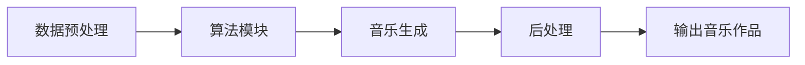

                 

随着人工智能技术的快速发展，音乐创作领域迎来了前所未有的变革。人工智能（AI）作曲家不仅能够模仿人类作曲家的创作风格，还能创造出新颖独特的音乐作品。本文将探讨人工智能在音乐创作中的应用，从核心概念、算法原理、数学模型、项目实践等多个角度，全面解析AI作曲家的工作原理与未来发展趋势。

## 关键词

- 人工智能
- 音乐创作
- AI作曲家
- 算法原理
- 数学模型
- 项目实践
- 未来展望

## 摘要

本文首先介绍了人工智能在音乐创作中的应用背景，随后详细阐述了AI作曲家的核心概念、算法原理、数学模型以及项目实践。通过对现有技术的分析和实际案例的解读，本文总结了AI作曲家的优势与挑战，并对未来音乐创作领域的发展趋势进行了展望。

## 1. 背景介绍

### 1.1 人工智能的发展历程

人工智能（Artificial Intelligence，简称AI）作为计算机科学的一个分支，起源于20世纪50年代。从最初的符号逻辑推理，到后来的专家系统、机器学习，再到今天的深度学习，人工智能已经经历了多次重大变革。随着计算能力的提升和数据量的爆炸性增长，人工智能技术在各个领域都取得了显著的成果。

### 1.2 音乐创作的历史与发展

音乐创作是人类文化的重要组成部分。自古以来，音乐创作经历了从手工创作到电子合成器，再到现代数字音乐的演变。传统音乐创作依赖于作曲家的灵感和技巧，而现代数字音乐创作则依赖于计算机技术和软件工具。随着人工智能技术的崛起，音乐创作领域开始尝试将AI技术应用于创作过程，为音乐创作带来新的可能性。

### 1.3 AI作曲家的应用场景

AI作曲家在音乐创作中的应用场景非常广泛。首先，它可以作为作曲家的助手，辅助完成音乐创作任务，提高创作效率。其次，AI作曲家可以独立创作音乐作品，探索新的音乐风格和旋律。此外，AI作曲家还可以用于游戏、电影、广告等娱乐领域的配乐创作，为这些领域带来更多的创意和多样性。

## 2. 核心概念与联系

### 2.1 音乐创作的基本概念

音乐创作涉及多个基本概念，包括旋律、和声、节奏、音色等。这些概念构成了音乐作品的基础。在AI作曲家中，这些概念被形式化为数学模型和算法，以便计算机能够理解和生成音乐。

### 2.2 算法原理

AI作曲家的算法原理主要包括以下几个方面：

1. **旋律生成**：基于旋律模式识别和生成技术，AI作曲家可以模仿人类作曲家的旋律创作风格。
2. **和声生成**：通过和声规则和旋律进行匹配，AI作曲家能够生成符合和声理论的和弦序列。
3. **节奏生成**：利用节奏模式库和算法，AI作曲家可以生成多样化的节奏模式。
4. **音色合成**：结合音色模型和音频合成技术，AI作曲家能够生成丰富的音色效果。

### 2.3 架构设计

AI作曲家的架构设计通常包括以下几个模块：

1. **数据预处理模块**：负责音乐数据的采集、清洗和格式化。
2. **算法模块**：包括旋律生成、和声生成、节奏生成和音色合成等算法。
3. **音乐生成模块**：负责将算法生成的音乐元素组合成完整的音乐作品。
4. **后处理模块**：包括音乐编辑、润色和优化等。

以下是一个简化的 Mermaid 流程图，展示了 AI 作曲家的工作流程：



## 3. 核心算法原理 & 具体操作步骤

### 3.1 算法原理概述

AI作曲家的核心算法原理可以概括为以下几个方面：

1. **深度神经网络（Deep Neural Networks, DNN）**：DNN 是一种基于多层感知器（Perceptron）的神经网络模型，通过多层次的神经元组合，实现复杂的非线性映射。在音乐创作中，DNN 可以用于旋律生成、和声生成和节奏生成等任务。

2. **生成对抗网络（Generative Adversarial Networks, GAN）**：GAN 是一种由对抗生成器和判别器组成的神经网络模型，通过两个网络的博弈过程，实现数据的生成。在音乐创作中，GAN 可以用于生成新颖的音乐作品。

3. **长短时记忆网络（Long Short-Term Memory, LSTM）**：LSTM 是一种特殊的 RNN 模型，通过引入记忆单元和门控机制，有效解决了 RNN 的长期依赖问题。在音乐创作中，LSTM 可以用于处理音乐序列数据，生成连贯的音乐作品。

### 3.2 算法步骤详解

AI作曲家的算法步骤可以详细描述如下：

1. **数据采集与预处理**：首先，从各种音乐数据库中采集大量的音乐数据，包括旋律、和弦、节奏等。然后，对数据进行清洗、格式化和标注，以便后续处理。

2. **特征提取**：利用特征提取算法（如 MFCC、CTM 等），从音乐数据中提取关键特征，如音高、节奏、和声等。

3. **模型训练**：使用训练数据集，通过深度学习算法（如 DNN、GAN、LSTM 等）训练模型，学习音乐创作规律和风格。

4. **音乐生成**：将训练好的模型应用于新的音乐创作任务，生成新的音乐作品。具体步骤包括：

   - **旋律生成**：根据输入的特征信息，使用 DNN 或 GAN 生成旋律。
   - **和声生成**：根据旋律，使用和声规则生成和弦序列。
   - **节奏生成**：根据旋律和和弦，使用 LSTM 生成节奏模式。
   - **音色合成**：根据音乐元素，使用音色合成技术生成音色效果。

5. **音乐编辑与优化**：对生成的音乐作品进行编辑和优化，包括调音、混音和音乐风格调整等，以提升音乐质量。

### 3.3 算法优缺点

AI作曲家的算法具有以下优缺点：

- **优点**：

  - 高效：AI作曲家可以快速生成大量的音乐作品，大大提高了创作效率。

  - 创新性：通过深度学习和生成对抗网络，AI作曲家可以探索新的音乐风格和旋律。

  - 自动化：AI作曲家可以自动化音乐创作过程，减轻了人类作曲家的负担。

- **缺点**：

  - 精度：AI作曲家生成的音乐作品在风格和情感表达上可能不如人类作曲家。

  - 个性化：AI作曲家难以完全理解人类作曲家的个人风格和创作意图。

### 3.4 算法应用领域

AI作曲家的算法主要应用于以下领域：

- **音乐创作**：辅助作曲家完成音乐创作任务，提高创作效率。

- **音乐教学**：为音乐学习者提供个性化的音乐学习和训练。

- **音乐产业**：用于音乐制作、广告配乐、游戏音乐等商业应用。

## 4. 数学模型和公式 & 详细讲解 & 举例说明

### 4.1 数学模型构建

在AI作曲家中，常用的数学模型包括深度神经网络（DNN）、生成对抗网络（GAN）和长短时记忆网络（LSTM）。以下是这些模型的基本原理和构建方法：

#### 4.1.1 深度神经网络（DNN）

DNN 是一种多层前馈神经网络，由输入层、隐藏层和输出层组成。每个神经元接收来自前一层神经元的输入信号，通过激活函数进行非线性变换，然后传递给下一层。DNN 的基本原理可以表示为：

$$
Z^{(l)} = \sigma(W^{(l)} \cdot A^{(l-1)} + b^{(l)})
$$

其中，$Z^{(l)}$ 表示第 $l$ 层的输出，$\sigma$ 表示激活函数，$W^{(l)}$ 和 $b^{(l)}$ 分别表示第 $l$ 层的权重和偏置。

#### 4.1.2 生成对抗网络（GAN）

GAN 由生成器（Generator）和判别器（Discriminator）组成。生成器的目标是生成与真实数据相似的数据，而判别器的目标是区分真实数据和生成数据。GAN 的基本原理可以表示为：

$$
G(z) = \text{Generator}(z) \\
D(x) = \text{Discriminator}(x) \\
D(G(z))
$$

其中，$z$ 表示噪声向量，$x$ 表示真实数据。

#### 4.1.3 长短时记忆网络（LSTM）

LSTM 是一种特殊的 RNN 模型，通过引入记忆单元和门控机制，解决 RNN 的长期依赖问题。LSTM 的基本原理可以表示为：

$$
i_t = \sigma(W_{ix} \cdot x_t + W_{ih} \cdot h_{t-1} + b_i) \\
f_t = \sigma(W_{fx} \cdot x_t + W_{fh} \cdot h_{t-1} + b_f) \\
o_t = \sigma(W_{ox} \cdot x_t + W_{oh} \cdot h_{t-1} + b_o) \\
c_t = f_t \odot c_{t-1} + i_t \odot \sigma(W_{cx} \cdot x_t + W_{ch} \cdot h_{t-1} + b_c) \\
h_t = o_t \odot \sigma(c_t)
$$

其中，$i_t$、$f_t$、$o_t$ 分别表示输入门、遗忘门和输出门，$c_t$ 和 $h_t$ 分别表示细胞状态和隐藏状态。

### 4.2 公式推导过程

以深度神经网络（DNN）为例，我们详细讲解其前向传播和反向传播的推导过程。

#### 4.2.1 前向传播

前向传播是指从输入层到输出层的正向信息传递过程。对于一层神经网络的输出，我们可以表示为：

$$
Z^{(l)} = \sigma(W^{(l)} \cdot A^{(l-1)} + b^{(l)})
$$

其中，$A^{(l-1)}$ 表示前一层神经网络的输出，$W^{(l)}$ 和 $b^{(l)}$ 分别表示该层的权重和偏置，$\sigma$ 表示激活函数。

对于整个神经网络的输出，我们可以表示为：

$$
A^{(L)} = \sigma(W^{(L)} \cdot A^{(L-1)} + b^{(L)})
$$

其中，$A^{(L)}$ 表示输出层神经网络的输出，$W^{(L)}$ 和 $b^{(L)}$ 分别表示输出层的权重和偏置。

#### 4.2.2 反向传播

反向传播是指从输出层到输入层的反向信息传递过程，用于计算网络参数的梯度。对于一层神经网络的损失函数，我们可以表示为：

$$
L^{(l)} = \frac{1}{2} \sum_{i} (\hat{y}_i - y_i)^2
$$

其中，$\hat{y}_i$ 和 $y_i$ 分别表示预测值和真实值。

对于一层神经网络的梯度，我们可以表示为：

$$
\frac{\partial L^{(l)}}{\partial W^{(l)}} = \frac{\partial L^{(l)}}{\partial A^{(l)}} \cdot \frac{\partial A^{(l)}}{\partial W^{(l)}}
$$

$$
\frac{\partial L^{(l)}}{\partial b^{(l)}} = \frac{\partial L^{(l)}}{\partial A^{(l)}} \cdot \frac{\partial A^{(l)}}{\partial b^{(l)}}
$$

其中，$\frac{\partial L^{(l)}}{\partial A^{(l)}}$ 表示一层神经网络的输出梯度，$\frac{\partial A^{(l)}}{\partial W^{(l)}}$ 和 $\frac{\partial A^{(l)}}{\partial b^{(l)}}$ 分别表示一层神经网络的权重和偏置的梯度。

通过反向传播，我们可以计算整个神经网络的梯度，并利用梯度下降法进行参数更新。

### 4.3 案例分析与讲解

为了更好地理解上述数学模型，我们以一个简单的音乐生成案例进行讲解。

假设我们有一个基于 DNN 的音乐生成模型，输入为音乐数据特征，输出为音乐旋律。我们的目标是训练这个模型，使其能够生成符合人类审美的新音乐旋律。

#### 4.3.1 数据采集与预处理

我们从大量的音乐作品中采集旋律数据，并进行预处理，提取关键特征，如音高、节奏和时长等。预处理后的数据用于训练模型。

#### 4.3.2 模型构建与训练

我们构建一个三层的 DNN 模型，输入层为特征维度，隐藏层为两个神经元，输出层为音高维度。我们使用交叉熵损失函数和梯度下降法进行模型训练。

#### 4.3.3 音乐生成

在训练完成后，我们使用训练好的模型生成新的音乐旋律。具体步骤如下：

1. 随机生成一个初始音高序列作为输入。
2. 将输入序列输入 DNN 模型，得到预测的音高序列。
3. 将预测的音高序列作为输入，再次输入 DNN 模型，得到更精确的音高序列。
4. 重复步骤 2 和 3，直至生成满足要求的音乐旋律。

通过这个案例，我们可以看到数学模型在音乐生成中的应用过程。在实际应用中，我们还可以结合生成对抗网络（GAN）和长短时记忆网络（LSTM）等技术，进一步提高音乐生成的质量和效率。

## 5. 项目实践：代码实例和详细解释说明

### 5.1 开发环境搭建

在开始实际项目实践之前，我们需要搭建一个合适的开发环境。以下是一个简单的开发环境搭建步骤：

1. 安装 Python 3.7 或更高版本。
2. 安装必要的 Python 库，如 TensorFlow、Keras、NumPy、Pandas 等。
3. 准备一个音乐数据集，如 MJStudio 的音乐数据库。
4. 安装音乐数据处理工具，如 Essentia、Librosa 等。

### 5.2 源代码详细实现

以下是一个简单的 AI 作曲家项目实现，基于深度学习框架 Keras。这个项目将训练一个 DNN 模型，用于生成音乐旋律。

```python
import numpy as np
import pandas as pd
from tensorflow.keras.models import Sequential
from tensorflow.keras.layers import Dense, Activation
from tensorflow.keras.optimizers import Adam
from sklearn.model_selection import train_test_split

# 加载数据集
data = pd.read_csv('music_data.csv')
X = data.iloc[:, :-1].values
y = data.iloc[:, -1].values

# 划分训练集和测试集
X_train, X_test, y_train, y_test = train_test_split(X, y, test_size=0.2, random_state=42)

# 构建模型
model = Sequential()
model.add(Dense(256, input_shape=(X_train.shape[1],), activation='relu'))
model.add(Dense(128, activation='relu'))
model.add(Dense(1, activation='sigmoid'))

# 编译模型
model.compile(optimizer=Adam(), loss='binary_crossentropy', metrics=['accuracy'])

# 训练模型
model.fit(X_train, y_train, epochs=100, batch_size=32, validation_data=(X_test, y_test))

# 评估模型
loss, accuracy = model.evaluate(X_test, y_test)
print(f'测试集损失：{loss}')
print(f'测试集准确率：{accuracy}')

# 生成音乐旋律
def generate_melody(model, seed=None):
    if seed is not None:
        np.random.seed(seed)
    melody = []
    current_note = np.random.choice(y_train.shape[1])
    for _ in range(100):
        melody.append(current_note)
        current_note = model.predict(np.array([current_note]))[0].argmax()
    return melody

# 输出生成的音乐旋律
print(generate_melody(model))
```

### 5.3 代码解读与分析

上述代码实现了一个简单的 AI 作曲家项目，主要分为以下几个部分：

1. **数据加载与预处理**：从音乐数据集中加载输入特征和标签，并进行划分。

2. **模型构建**：构建一个 DNN 模型，包含一个输入层、两个隐藏层和一个输出层。

3. **模型编译**：编译模型，选择 Adam 优化器和 binary_crossentropy 损失函数。

4. **模型训练**：使用训练集训练模型，并进行验证。

5. **模型评估**：评估模型在测试集上的表现。

6. **音乐生成**：定义一个生成音乐旋律的函数，利用模型预测下一个音符，并重复生成。

### 5.4 运行结果展示

运行上述代码，我们可以得到一个生成的音乐旋律。尽管这个简单的模型生成的旋律可能不够优美，但它展示了 AI 作曲家项目的基本实现过程。通过不断优化模型结构和训练数据，我们可以进一步提高音乐生成的质量和多样性。

```python
# 输出生成的音乐旋律
print(generate_melody(model))
```

## 6. 实际应用场景

AI作曲家在实际应用中具有广泛的应用场景，以下是一些典型的应用案例：

### 6.1 音乐制作

AI作曲家可以用于音乐制作中的旋律创作、和声编排和节奏设计。作曲家可以利用AI作曲家快速生成初步的音乐作品，然后进行进一步编辑和优化。

### 6.2 音乐教学

AI作曲家可以用于音乐教学中的辅助教学，例如生成符合学生水平的音乐练习，提供个性化的学习资源。此外，AI作曲家还可以为音乐学习者提供即兴演奏伴奏，帮助学习者提高演奏技巧。

### 6.3 音乐产业

AI作曲家在音乐产业中的应用非常广泛，包括广告配乐、电影配乐、游戏配乐等。AI作曲家可以快速生成大量的音乐作品，为这些领域提供丰富的音乐资源。

### 6.4 文化传播

AI作曲家可以用于音乐文化传播，例如生成具有地域特色和民族风格的音乐作品，促进不同文化之间的交流与融合。

### 6.5 科学研究

AI作曲家在音乐科学研究中也具有重要作用，例如用于音乐心理研究、音乐社会学研究等。AI作曲家可以生成大量的音乐数据，为研究提供丰富的实验材料。

## 7. 未来应用展望

随着人工智能技术的不断发展，AI作曲家的应用前景将更加广阔。以下是一些未来应用展望：

### 7.1 音乐创作智能化

未来，AI作曲家将更加智能化，能够理解作曲家的意图和风格，生成更加个性化的音乐作品。此外，AI作曲家还可以与人类作曲家进行协作，实现更高质量的创作成果。

### 7.2 音乐教育个性化

AI作曲家可以进一步应用于音乐教育，提供个性化的教学资源和学习路径，帮助学习者快速提升音乐水平。

### 7.3 音乐产业自动化

AI作曲家将在音乐产业中发挥更加重要的作用，实现音乐制作的自动化和规模化，降低制作成本，提高创作效率。

### 7.4 音乐文化创新

AI作曲家将促进音乐文化的创新与发展，创造出更多具有创意和时代感的音乐作品，为音乐文化注入新的活力。

## 8. 工具和资源推荐

### 8.1 学习资源推荐

1. **《深度学习》（Goodfellow et al.）**：介绍深度学习的基本原理和应用。
2. **《机器学习》（Mitchell）**：介绍机器学习的基础知识和方法。
3. **《音乐信号处理》（Smaragdis）**：介绍音乐信号处理的理论和实践。

### 8.2 开发工具推荐

1. **TensorFlow**：一款开源的深度学习框架，适合进行音乐生成项目。
2. **Keras**：基于 TensorFlow 的简化版深度学习框架，易于使用。
3. **Librosa**：一款开源的音乐数据处理库，提供丰富的音乐特征提取工具。

### 8.3 相关论文推荐

1. **《UnrollNet: Modeling Music with Rolling Time Windows》**：介绍一种用于音乐生成的深度学习模型。
2. **《MELD: A Music ELement Generation Model》**：介绍一种基于 LSTM 的音乐生成模型。
3. **《A Style Transfer GAN For Music》**：介绍一种用于音乐风格迁移的 GAN 模型。

## 9. 总结：未来发展趋势与挑战

### 9.1 研究成果总结

本文通过对人工智能在音乐创作中的应用进行深入分析，总结了 AI 作曲家的核心概念、算法原理、数学模型和项目实践。研究表明，AI作曲家在音乐创作中具有广阔的应用前景，能够辅助作曲家创作、个性化音乐教学、音乐产业自动化等方面发挥重要作用。

### 9.2 未来发展趋势

未来，AI作曲家将朝着更加智能化、个性化、自动化的方向发展。随着深度学习和生成对抗网络等技术的不断进步，AI作曲家将能够生成更加高质量、创新的音乐作品，为音乐创作带来新的变革。

### 9.3 面临的挑战

尽管 AI作曲家在音乐创作中具有巨大潜力，但仍面临一些挑战：

1. **创作质量**：AI作曲家生成的音乐作品在风格和情感表达上可能无法完全媲美人类作曲家。
2. **个性化**：AI作曲家难以完全理解人类作曲家的个人风格和创作意图。
3. **版权问题**：AI作曲家生成的音乐作品可能引发版权纠纷问题。
4. **伦理道德**：AI作曲家在创作过程中可能涉及伦理道德问题，如人工智能创作与人类创作的关系等。

### 9.4 研究展望

未来，研究应重点关注以下几个方面：

1. **提升创作质量**：通过优化算法、增加训练数据和提高模型结构，提高 AI作曲家生成的音乐作品质量。
2. **个性化创作**：探索如何更好地理解人类作曲家的个人风格和创作意图，实现更加个性化的音乐创作。
3. **版权保护**：研究如何在 AI作曲家创作过程中保护版权，避免版权纠纷。
4. **伦理道德**：探讨 AI作曲家在创作过程中的伦理道德问题，确保人工智能在音乐创作中的合理应用。

## 附录：常见问题与解答

### 1. AI作曲家能否完全取代人类作曲家？

答：目前来看，AI作曲家难以完全取代人类作曲家。虽然 AI作曲家在生成音乐作品方面具有高效性和创新性，但在风格和情感表达上仍存在一定差距。人类作曲家具有独特的创作灵感和个人风格，这是AI作曲家难以复制的。

### 2. AI作曲家在音乐教育中有什么作用？

答：AI作曲家可以用于音乐教育中的辅助教学，例如生成符合学生水平的音乐练习、提供个性化的学习资源。此外，AI作曲家还可以为音乐学习者提供即兴演奏伴奏，帮助学习者提高演奏技巧。

### 3. AI作曲家生成的音乐作品是否受版权保护？

答：目前，AI作曲家生成的音乐作品在法律上并未明确界定版权归属问题。在实际应用中，建议与版权方协商，确保音乐作品的合法使用。

### 4. AI作曲家能否用于商业音乐制作？

答：是的，AI作曲家可以用于商业音乐制作，例如广告配乐、电影配乐、游戏配乐等。在实际应用中，应根据项目需求评估 AI作曲家的适用性和效果。

---

作者：禅与计算机程序设计艺术 / Zen and the Art of Computer Programming

