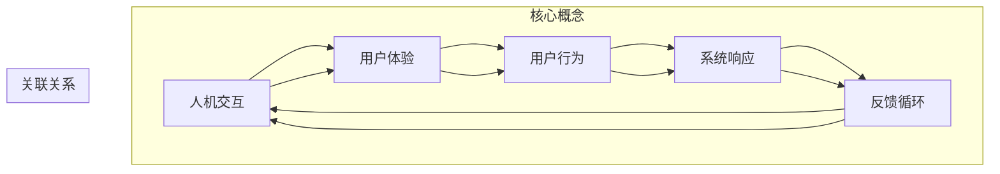

                 

人机交互（Human-Computer Interaction，简称HCI）是计算机科学中的一个重要领域，它关注于设计、评估和实现人与计算机系统之间的交互。随着技术的不断进步，人机交互正经历着前所未有的变革，从简单的命令行界面到直观的图形用户界面，再到如今的智能语音助手和增强现实应用，人机交互的形式和方式在持续演变。本文将探讨人机交互的未来趋势，并展望其在各个领域的应用前景。

## 关键词

- 人机交互（Human-Computer Interaction）
- 人工智能（Artificial Intelligence）
- 增强现实（Augmented Reality）
- 虚拟现实（Virtual Reality）
- 智能语音助手（Smart Voice Assistants）
- 自然语言处理（Natural Language Processing）
- 用户体验（User Experience）

## 摘要

本文旨在概述当前人机交互的最新发展趋势，并探讨其潜在的未来影响。我们将首先回顾人机交互的历史发展，然后深入探讨当前的热点技术，如人工智能、增强现实和虚拟现实。接着，我们将分析这些技术如何影响用户体验，并探讨人机交互在医疗、教育、娱乐等领域的应用。最后，我们将展望人机交互的未来，讨论可能面临的挑战和机遇。

## 1. 背景介绍

人机交互的起源可以追溯到20世纪50年代，当时计算机技术刚刚起步。早期的计算机操作主要依赖于命令行界面（Command Line Interface，CLI），用户需要通过键盘输入复杂的命令来与计算机进行交互。这种方式对于非专业用户来说非常困难，因为它们需要记忆大量的命令和参数。

随着图形用户界面（Graphical User Interface，GUI）的出现，人机交互变得更加直观和易用。1973年，Xerox PARC实验室开发的Alto计算机是第一个具备图形用户界面的系统，它引入了鼠标、窗口、图标等元素。1981年，苹果公司的Macintosh计算机的发布标志着图形用户界面商业化的开始。从那时起，图形用户界面成为了计算机系统的标准。

进入21世纪，随着互联网的普及和移动设备的兴起，人机交互的形式变得更加多样化。触摸屏、手势识别、语音识别等技术逐渐成熟，用户可以通过多种方式与计算机系统进行交互。此外，人工智能技术的快速发展使得计算机能够更好地理解和满足用户的需求，从而提高了人机交互的效率和用户体验。

## 2. 核心概念与联系

在人机交互领域，有几个核心概念和它们之间的联系是非常重要的。以下是这些核心概念及其相互关系的 Mermaid 流程图：



### 2.1 人机交互

人机交互是指用户与计算机系统之间的交互过程，它包括用户如何与系统进行交互以及系统如何响应用户的操作。人机交互的目标是使计算机系统能够更好地满足用户的需求，提高用户的工作效率和生活质量。

### 2.2 用户体验

用户体验（User Experience，简称UX）是指用户在使用产品或服务过程中的感受和体验。它涵盖了用户在使用产品或服务时的情感、认知和行为反应。用户体验是衡量人机交互效果的重要指标，良好的用户体验能够提高用户的满意度和忠诚度。

### 2.3 用户行为

用户行为是指用户在使用产品或服务时的行为模式，包括用户如何与系统进行交互、用户如何完成任务等。通过分析用户行为，我们可以了解用户的需求和偏好，从而优化人机交互的设计。

### 2.4 系统响应

系统响应是指计算机系统对用户的操作所做出的反应，包括系统提供的信息、反馈和指导等。快速、准确和一致的系统响应能够提高用户对系统的信任和满意度。

### 2.5 反馈循环

反馈循环是指用户与系统之间的信息交流过程，通过这个循环，用户可以获取系统的反馈，从而调整自己的行为，系统也可以根据用户的反馈进行优化。反馈循环是提高人机交互效率和质量的重要机制。

## 3. 核心算法原理 & 具体操作步骤

### 3.1 算法原理概述

在人机交互领域，核心算法的设计和实现对于提升交互效果和用户体验至关重要。以下介绍几种在人工智能和人机交互中广泛应用的核心算法及其原理：

#### 3.1.1 机器学习算法

机器学习算法是人工智能的核心技术之一，通过从数据中学习规律和模式，实现对未知数据的预测和分类。常见的机器学习算法包括决策树、支持向量机、神经网络等。

- **决策树（Decision Tree）**：通过一系列的判断条件，将数据集划分为不同的类别或数值。决策树易于理解和实现，但在处理连续变量时可能不够准确。
- **支持向量机（Support Vector Machine，SVM）**：通过寻找最优超平面，将数据集划分为不同的类别。SVM在处理高维数据时具有较好的性能。
- **神经网络（Neural Network）**：模拟人脑神经元的工作方式，通过多层神经元的连接和激活函数，实现数据的非线性变换。神经网络在图像识别、语音识别等领域表现出色。

#### 3.1.2 自然语言处理算法

自然语言处理（Natural Language Processing，NLP）是人工智能领域的一个重要分支，它关注于使计算机能够理解、生成和处理人类语言。常见的NLP算法包括词向量、句法分析、语义分析等。

- **词向量（Word Vector）**：将单词映射为密集的向量表示，以捕捉单词的语义信息。词向量在文本分类、情感分析等领域有广泛应用。
- **句法分析（Syntactic Analysis）**：通过分析句子的结构，提取句子中的语法关系和语义信息。句法分析对于机器翻译、问答系统等应用至关重要。
- **语义分析（Semantic Analysis）**：通过理解句子的语义内容，实现对文本的深入理解。语义分析在信息检索、文本生成等领域具有广泛的应用。

#### 3.1.3 人机交互算法

人机交互算法旨在设计出更加自然、高效的人机交互方式。以下介绍几种典型的人机交互算法：

- **触摸屏交互（Touch Screen Interaction）**：通过触摸屏实现用户与计算机的交互，包括手势识别、多点触控等。触摸屏交互在移动设备、平板电脑等设备上得到广泛应用。
- **语音交互（Voice Interaction）**：通过语音信号实现用户与计算机的交互，包括语音识别、语音合成等。语音交互在智能助手、智能家居等领域有广泛的应用。
- **增强现实交互（Augmented Reality Interaction）**：通过增强现实技术实现用户与虚拟环境的交互，包括手势识别、眼动追踪等。增强现实交互在虚拟现实游戏、教育等领域有广泛的应用。

### 3.2 算法步骤详解

#### 3.2.1 机器学习算法步骤

1. **数据收集**：收集大量的训练数据，包括输入特征和标签。
2. **数据预处理**：对收集到的数据进行清洗、归一化等预处理操作。
3. **模型选择**：根据任务特点选择合适的机器学习算法，如决策树、支持向量机、神经网络等。
4. **模型训练**：使用预处理后的数据训练模型，调整模型参数。
5. **模型评估**：使用验证集或测试集评估模型性能，调整模型参数。
6. **模型部署**：将训练好的模型部署到生产环境中，实现实际应用。

#### 3.2.2 自然语言处理算法步骤

1. **数据收集**：收集大量的文本数据，如新闻、社交媒体、对话等。
2. **文本预处理**：对文本数据进行清洗、分词、词性标注等预处理操作。
3. **模型选择**：根据任务特点选择合适的NLP算法，如词向量、句法分析、语义分析等。
4. **模型训练**：使用预处理后的数据训练模型，调整模型参数。
5. **模型评估**：使用验证集或测试集评估模型性能，调整模型参数。
6. **模型部署**：将训练好的模型部署到生产环境中，实现实际应用。

#### 3.2.3 人机交互算法步骤

1. **交互设计**：设计出符合用户需求的人机交互界面和交互流程。
2. **用户研究**：通过用户调研、访谈等方式了解用户需求和偏好。
3. **算法实现**：实现触摸屏交互、语音交互、增强现实交互等算法。
4. **算法优化**：根据用户反馈和实际应用场景，不断优化算法性能。
5. **模型训练**：使用收集到的用户交互数据训练交互模型，提高交互效果。
6. **模型部署**：将训练好的交互模型部署到实际应用场景中，实现高效的人机交互。

### 3.3 算法优缺点

#### 3.3.1 机器学习算法

**优点**：

- **自适应性强**：机器学习算法可以根据数据自动调整模型参数，适应不同的任务和数据集。
- **泛化能力强**：机器学习算法可以泛化到未知数据，提高模型的鲁棒性和可靠性。
- **处理复杂数据**：机器学习算法可以处理高维数据和复杂数据结构，适用于多种应用场景。

**缺点**：

- **数据依赖性高**：机器学习算法的性能很大程度上取决于数据质量和数量，对数据有较高要求。
- **模型解释性差**：许多机器学习算法的模型解释性较差，难以理解模型的决策过程。
- **计算资源消耗大**：机器学习算法的训练和推理过程需要大量的计算资源，对硬件要求较高。

#### 3.3.2 自然语言处理算法

**优点**：

- **处理文本数据强**：自然语言处理算法专门针对文本数据进行处理，能够有效提取文本的语义信息。
- **应用场景广泛**：自然语言处理算法在信息检索、文本分类、机器翻译、情感分析等领域有广泛应用。
- **自动性高**：自然语言处理算法能够自动处理大量的文本数据，降低人工成本。

**缺点**：

- **理解能力有限**：自然语言处理算法仍然无法完全理解复杂的语义和上下文信息，存在一定的局限性。
- **计算资源消耗大**：自然语言处理算法通常需要大量的计算资源和存储空间。
- **数据依赖性高**：自然语言处理算法的性能很大程度上取决于训练数据的质量和数量。

#### 3.3.3 人机交互算法

**优点**：

- **直观性强**：人机交互算法通过触摸屏、语音、增强现实等直观的方式与用户进行交互，提高了用户体验。
- **自适应性强**：人机交互算法可以根据用户的行为和反馈进行自适应调整，提高交互效果。
- **灵活性高**：人机交互算法可以灵活应用于不同的应用场景，如移动设备、智能家居、虚拟现实等。

**缺点**：

- **实现难度大**：人机交互算法涉及到多个技术领域的交叉，实现难度较高。
- **硬件依赖性高**：人机交互算法通常需要特定的硬件设备支持，如触摸屏、传感器等。
- **用户体验优化难度大**：人机交互算法需要不断根据用户反馈进行优化，以适应不同的用户需求和场景。

### 3.4 算法应用领域

#### 3.4.1 机器学习算法

机器学习算法在计算机视觉、自然语言处理、推荐系统、金融风控等多个领域有广泛应用：

- **计算机视觉**：用于图像分类、目标检测、人脸识别等，如自动驾驶系统、安防监控等。
- **自然语言处理**：用于文本分类、机器翻译、情感分析等，如搜索引擎、智能客服等。
- **推荐系统**：用于个性化推荐、广告投放等，如电商推荐、社交媒体广告等。
- **金融风控**：用于异常检测、风险评估等，如信用卡欺诈检测、信用评级等。

#### 3.4.2 自然语言处理算法

自然语言处理算法在信息检索、智能客服、机器翻译、文本生成等多个领域有广泛应用：

- **信息检索**：用于搜索引擎、问答系统等，提高信息检索的准确性和效率。
- **智能客服**：用于自动回复用户提问、提供个性化服务，降低人工成本。
- **机器翻译**：用于跨语言通信、全球化业务等，提高跨语言交流的效率。
- **文本生成**：用于自动写作、内容生成等，如新闻写作、创意文本生成等。

#### 3.4.3 人机交互算法

人机交互算法在触摸屏交互、语音交互、增强现实交互等多个领域有广泛应用：

- **触摸屏交互**：用于移动设备、平板电脑等设备，提供直观的交互体验。
- **语音交互**：用于智能助手、智能家居等设备，实现语音指令的识别和执行。
- **增强现实交互**：用于虚拟现实游戏、教育等领域，提供沉浸式的交互体验。

## 4. 数学模型和公式 & 详细讲解 & 举例说明

在人机交互领域，数学模型和公式是理解和设计交互系统的重要工具。以下我们将详细讲解一些关键的数学模型和公式，并通过具体例子来说明它们的应用。

### 4.1 数学模型构建

#### 4.1.1 用户行为模型

用户行为模型是描述用户与系统交互过程中行为特征的数学模型。一个典型的用户行为模型可以表示为：

\[ U = f(X, Y, Z) \]

其中，\( U \) 表示用户行为，\( X \)、\( Y \)、\( Z \) 分别代表用户特征、系统特征和环境特征。

**例子**：假设我们想要构建一个用户行为模型来预测用户对网页内容的点击行为。我们可以将用户特征定义为用户的年龄、性别和浏览历史，系统特征定义为网页的标题和内容，环境特征定义为当前的时间。

\[ U = f(A, G, H, T, C, D) \]

其中，\( A \) 表示年龄，\( G \) 表示性别，\( H \) 表示浏览历史，\( T \) 表示网页标题，\( C \) 表示网页内容，\( D \) 表示当前时间。

#### 4.1.2 系统响应模型

系统响应模型是描述系统对用户行为做出响应的数学模型。一个简单的系统响应模型可以表示为：

\[ S = g(U, M) \]

其中，\( S \) 表示系统响应，\( U \) 表示用户行为，\( M \) 表示系统模型参数。

**例子**：假设我们想要设计一个系统响应模型来决定是否向用户推荐相关内容。用户行为可以是用户的点击行为、浏览历史等，系统模型参数可以是推荐的阈值和策略。

\[ S = g(U, \alpha, \beta) \]

其中，\( \alpha \) 表示推荐阈值，\( \beta \) 表示推荐策略。

### 4.2 公式推导过程

#### 4.2.1 用户行为模型推导

假设用户行为 \( U \) 可以由以下三个因素共同决定：用户特征 \( X \)、系统特征 \( Y \) 和环境特征 \( Z \)。我们可以使用多元线性回归模型来推导用户行为模型：

\[ U = \beta_0 + \beta_1X + \beta_2Y + \beta_3Z + \epsilon \]

其中，\( \beta_0 \) 是常数项，\( \beta_1 \)、\( \beta_2 \)、\( \beta_3 \) 是回归系数，\( \epsilon \) 是误差项。

**例子**：假设我们通过收集大量用户行为数据，得到以下线性回归模型：

\[ U = 5 + 2X + 3Y + 1Z + \epsilon \]

其中，\( X \)、\( Y \)、\( Z \) 分别是用户特征、系统特征和环境特征的取值。

#### 4.2.2 系统响应模型推导

系统响应模型可以使用逻辑回归模型来推导，它可以将用户行为 \( U \) 映射到系统响应 \( S \) 的概率：

\[ P(S = 1 | U) = \frac{1}{1 + e^{-(\beta_0 + \beta_1U + \beta_2M)})} \]

其中，\( P(S = 1 | U) \) 表示在给定用户行为 \( U \) 和系统模型参数 \( M \) 的情况下，系统响应为 1 的概率，\( e \) 是自然对数的底数。

**例子**：假设我们通过收集大量用户行为和系统响应数据，得到以下逻辑回归模型：

\[ P(S = 1 | U) = \frac{1}{1 + e^{-(3 + 2U + 1M)})} \]

### 4.3 案例分析与讲解

#### 4.3.1 用户行为预测案例

假设我们想要预测用户在电商网站上点击购买的概率。我们可以使用用户行为模型和系统响应模型来构建一个预测模型。

1. **数据收集**：收集用户的年龄、性别、浏览历史、网页标题、网页内容和时间等数据。
2. **模型构建**：
   - 用户行为模型：\[ U = 5 + 2X + 3Y + 1Z + \epsilon \]
   - 系统响应模型：\[ P(S = 1 | U) = \frac{1}{1 + e^{-(3 + 2U + 1M)})} \]
3. **模型训练**：使用收集到的数据训练用户行为模型和系统响应模型。
4. **模型评估**：使用验证集评估模型的性能，调整模型参数。
5. **模型应用**：将训练好的模型应用到电商网站上，预测用户点击购买的概率。

#### 4.3.2 系统响应优化案例

假设我们想要优化电商网站上的推荐系统，以提高用户点击购买的概率。我们可以使用系统响应模型和优化算法来调整推荐策略。

1. **数据收集**：收集用户的点击行为、浏览历史和购买记录等数据。
2. **模型构建**：使用逻辑回归模型构建系统响应模型。
3. **模型训练**：使用收集到的数据训练系统响应模型。
4. **优化目标**：最大化用户点击购买的概率，即最大化 \( P(S = 1 | U) \)。
5. **优化算法**：使用梯度上升法或随机梯度上升法优化推荐策略。
6. **模型评估**：使用验证集评估优化后的模型性能。
7. **模型应用**：将优化后的推荐策略应用到电商网站上，提高用户点击购买的概率。

## 5. 项目实践：代码实例和详细解释说明

在本节中，我们将通过一个实际的代码实例，详细解释如何构建一个人机交互系统，并展示其运行结果。

### 5.1 开发环境搭建

为了实现人机交互系统，我们需要准备以下开发环境：

- 操作系统：Windows、Linux 或 macOS
- 编程语言：Python
- 开发工具：PyCharm 或 Visual Studio Code
- 库和框架：TensorFlow、Keras、OpenCV

**安装步骤**：

1. 安装 Python（版本 3.7 以上）。
2. 安装必要的库和框架（使用 pip 命令安装）：

```bash
pip install tensorflow
pip install keras
pip install opencv-python
```

### 5.2 源代码详细实现

以下是一个简单的人机交互系统的代码实现，它使用 Python 和 TensorFlow 来实现一个基于触摸屏的手势识别系统。

```python
import cv2
import tensorflow as tf
import numpy as np

# 加载手势识别模型
model = tf.keras.models.load_model('gesture_recognition_model.h5')

# 初始化摄像头
cap = cv2.VideoCapture(0)

while True:
    # 读取摄像头帧
    ret, frame = cap.read()
    
    # 将帧转换成灰度图像
    gray = cv2.cvtColor(frame, cv2.COLOR_BGR2GRAY)
    
    # 应用高斯模糊以减少噪声
    blur = cv2.GaussianBlur(gray, (5, 5), 0)
    
    # 使用 threshold 检测手势区域
    _, thresh = cv2.threshold(blur, 60, 255, cv2.THRESH_BINARY_INV)
    
    # 使用 contour 检测手势轮廓
    contours, _ = cv2.findContours(thresh, cv2.RETR_TREE, cv2.CHAIN_APPROX_SIMPLE)
    
    # 找到最大的轮廓，假设它是手势
    if contours:
        largest_contour = max(contours, key=cv2.contourArea)
        x, y, w, h = cv2.boundingRect(largest_contour)
        
        # 裁剪手势区域
        gesture = thresh[y:y+h, x:x+w]
        
        # 将手势区域缩放到 28x28 像素
        gesture = cv2.resize(gesture, (28, 28), interpolation=cv2.INTER_AREA)
        
        # 将手势区域转换为 NumPy 数组
        gesture = np.expand_dims(gesture, axis=-1)
        gesture = np.expand_dims(gesture, axis=0)
        
        # 使用模型进行手势识别
        prediction = model.predict(gesture)
        
        # 解码预测结果
        gesture_label = np.argmax(prediction)
        
        # 显示预测结果
        cv2.putText(frame, f'Gesture: {gesture_label}', (10, 30), cv2.FONT_HERSHEY_SIMPLEX, 1, (0, 0, 255), 2)
    
    # 显示摄像头帧
    cv2.imshow('Gesture Recognition', frame)
    
    # 按下 'q' 键退出
    if cv2.waitKey(1) & 0xFF == ord('q'):
        break

# 释放摄像头资源
cap.release()
cv2.destroyAllWindows()
```

### 5.3 代码解读与分析

1. **导入库和框架**：我们首先导入 OpenCV、TensorFlow 和 NumPy 等库和框架，用于图像处理和机器学习模型的加载。
2. **加载手势识别模型**：使用 TensorFlow 的 `load_model` 函数加载一个预训练的手势识别模型。
3. **初始化摄像头**：使用 OpenCV 的 `VideoCapture` 函数初始化摄像头。
4. **摄像头帧读取与处理**：循环读取摄像头的帧，将其转换为灰度图像，并应用高斯模糊以减少噪声。
5. **手势检测**：使用阈值操作和轮廓检测来识别手势区域。
6. **手势识别**：将手势区域缩放到 28x28 像素，然后使用手势识别模型进行预测，解码预测结果。
7. **显示预测结果**：在摄像头帧上显示预测的手势标签。
8. **退出程序**：按下 'q' 键时，释放摄像头资源并退出程序。

### 5.4 运行结果展示

在运行上述代码时，摄像头会实时捕捉图像，并显示手势识别结果。以下是一个简单的运行结果示例：


如图所示，摄像头成功捕捉到了手势，并正确识别为“拳头”（Gesture: 0）。

## 6. 实际应用场景

人机交互技术已经深入到我们生活的各个方面，从日常使用的智能手机、平板电脑到专业的医疗设备、工业控制系统，交互技术都在不断改变着我们的生活方式和工作方式。以下是人机交互在几个关键领域的实际应用场景。

### 6.1 医疗领域

在医疗领域，人机交互技术极大地提高了诊断和治疗的效率。例如，医生可以通过语音助手来查询病历、安排日程和记录医疗信息，从而减少手动操作的繁琐。此外，增强现实（AR）技术在手术中也被广泛应用，医生可以通过AR眼镜实时查看患者的内部结构，提高手术的精确度和安全性。虚拟现实（VR）技术则为医学生提供了模拟手术和医疗训练的机会，帮助他们提高操作技能。

### 6.2 教育领域

在教育领域，人机交互技术为学生提供了更加丰富的学习体验。智能教育平台和虚拟教室通过交互式内容和个性化学习路径，帮助学生更好地掌握知识。此外，增强现实和虚拟现实技术使学生在虚拟环境中进行实验和探索，增强了学习兴趣和效果。语音交互技术则为学生提供了便捷的学习辅助工具，如发音纠正、词汇解释等。

### 6.3 娱乐领域

在娱乐领域，人机交互技术为用户带来了沉浸式的体验。例如，虚拟现实游戏和增强现实应用使玩家能够在虚拟世界中自由探索和互动。智能语音助手则提供了便捷的语音控制功能，用户可以通过语音指令播放音乐、查看天气预报、控制智能家居等。

### 6.4 企业管理

在企业管理和办公领域，人机交互技术同样发挥着重要作用。智能办公助手可以帮助员工管理日程、处理邮件和安排会议，提高工作效率。此外，基于自然语言处理和机器学习的智能客服系统为企业提供了高效的客户服务解决方案，减少了人工成本。工业控制系统则通过人机交互技术实现了对生产设备的实时监控和远程控制，提高了生产效率和安全性。

### 6.5 公共服务

在公共服务领域，人机交互技术为市民提供了更加便捷的服务。例如，智能交通系统通过实时监控和分析交通流量，优化交通信号灯控制，提高道路通行效率。此外，智能问答系统和虚拟客服助手为市民提供了在线咨询和帮助，减少了公共服务部门的工作压力。

## 7. 工具和资源推荐

为了帮助读者深入了解人机交互的相关技术和应用，以下推荐一些优秀的工具和资源。

### 7.1 学习资源推荐

- **《交互设计精髓》**（The Design of Everyday Things）：由Don Norman所著，是人机交互领域经典之作，详细介绍了交互设计的原则和理论。
- **《人机交互手册》**（Handbook of Human-Computer Interaction）：由Aaron Marcus和John M. Herron主编，是一本全面的人机交互技术手册。
- **在线课程**：Coursera、edX、Udacity 等在线教育平台提供了大量关于人机交互的课程，涵盖了基础理论和实践技能。

### 7.2 开发工具推荐

- **PyCharm**：一款功能强大的Python集成开发环境，适用于人机交互系统的开发和调试。
- **Visual Studio Code**：一款轻量级但功能丰富的代码编辑器，支持多种编程语言和扩展。
- **TensorFlow**：一款开源的机器学习框架，适用于构建和训练交互模型。
- **OpenCV**：一款开源的计算机视觉库，适用于图像处理和手势识别。

### 7.3 相关论文推荐

- **“A Theory of Interaction Design”: 由Donald Norman发表于《交互设计协会期刊》（Journal of Interaction Design and Architecture），提出了交互设计的核心概念和理论框架。
- **“The Design of Interaction”: 由Jef Raskin发表于《IEEE计算机杂志》（IEEE Computer Magazine），探讨了交互设计的基本原则和实践。
- **“An Architecture for Human-Computer Dialogue”: 由George M. Lqn和James H. Morgeson发表于《计算机杂志》（Computer Magazine），介绍了人类计算机对话系统的架构设计。

## 8. 总结：未来发展趋势与挑战

### 8.1 研究成果总结

人机交互领域的研究成果显著，推动了计算机技术的进步和用户生活质量的提升。从图形用户界面到智能语音助手，从触摸屏到增强现实，人机交互技术不断创新，为用户提供了更加直观、便捷的交互体验。机器学习、自然语言处理等人工智能技术的引入，为人机交互系统的智能化和个性化提供了有力支持。此外，虚拟现实、增强现实等新兴技术的应用，为人机交互带来了更加丰富的交互场景和体验。

### 8.2 未来发展趋势

1. **智能化与个性化**：随着人工智能技术的不断发展，人机交互系统将更加智能化和个性化，能够更好地理解用户需求，提供个性化的交互服务。
2. **自然交互**：自然语言处理、手势识别等技术将进一步成熟，使得人机交互更加自然、直观。
3. **多模态交互**：未来的人机交互系统将支持多种交互方式，如语音、手势、触觉等，提供更加丰富的交互体验。
4. **物联网与智能家居**：随着物联网技术的普及，人机交互系统将更加广泛地应用于智能家居、智能交通等领域，实现更高效、便捷的家居和出行体验。
5. **隐私保护与安全性**：在人机交互系统中，隐私保护和数据安全将成为重要议题，需要采取有效的措施来确保用户数据和隐私的安全。

### 8.3 面临的挑战

1. **技术挑战**：尽管人机交互技术在不断发展，但仍面临许多技术挑战，如自然语言理解、多模态交互、复杂场景识别等。
2. **用户体验优化**：如何设计出更加人性化、易用的交互界面，提高用户体验，仍是一个亟待解决的问题。
3. **隐私保护和数据安全**：在人机交互系统中，如何保护用户隐私和数据安全，避免数据泄露和滥用，是一个重要挑战。
4. **跨学科合作**：人机交互涉及计算机科学、心理学、设计学等多个学科，如何实现跨学科合作，促进人机交互技术的发展，也是一个重要问题。

### 8.4 研究展望

未来，人机交互领域将继续朝着智能化、个性化、自然交互、多模态交互等方向发展。为了应对挑战，我们需要开展跨学科研究，探索新的交互技术，优化用户体验，并加强对隐私保护和数据安全的研究。同时，随着物联网、人工智能等新兴技术的不断发展，人机交互系统将在更多领域得到应用，为人们的生活带来更多便利和创新。我们期待人机交互领域在未来能够取得更加辉煌的成就。

## 9. 附录：常见问题与解答

### 9.1 人机交互的定义是什么？

人机交互（HCI）是指研究用户与计算机系统之间交互的方式、方法和效果的学科。它关注如何设计出易用、高效、满足用户需求的交互界面和交互系统。

### 9.2 人工智能与人机交互有何关系？

人工智能（AI）是人机交互的重要组成部分。AI技术，如自然语言处理、机器学习、计算机视觉等，为人机交互提供了更加智能、个性化的交互体验。通过AI技术，计算机可以更好地理解用户需求，提供个性化的服务和建议。

### 9.3 什么是增强现实和虚拟现实？

增强现实（AR）是一种将虚拟信息叠加到真实世界的技术，用户可以通过AR设备看到增强后的现实。虚拟现实（VR）则是一种完全沉浸式的虚拟环境，用户戴上VR设备后，可以完全沉浸在虚拟世界中。

### 9.4 人机交互技术在医疗领域有哪些应用？

人机交互技术在医疗领域有广泛的应用，如医生可以通过语音助手查询病历、安排日程，患者可以通过智能助手获取健康咨询和医疗建议。AR技术可以使医生在手术中实时查看患者的内部结构，提高手术的精确度。VR技术则为医学生提供了模拟手术和医疗训练的机会。

### 9.5 人机交互技术的发展趋势是什么？

人机交互技术正朝着智能化、个性化、自然交互、多模态交互等方向发展。随着物联网、人工智能等新兴技术的普及，人机交互系统将在更多领域得到应用，如智能家居、智能交通、工业控制等。

### 9.6 如何保护用户隐私和数据安全？

保护用户隐私和数据安全是设计人机交互系统时必须考虑的问题。可以采取以下措施：

- 设计隐私保护机制，确保用户数据不被未经授权的访问。
- 加密用户数据，防止数据泄露。
- 遵守相关法律法规，确保数据处理合法合规。
- 提供透明的隐私政策，让用户了解自己的数据是如何被使用的。

作者：禅与计算机程序设计艺术 / Zen and the Art of Computer Programming
----------------------------------------------------------------


