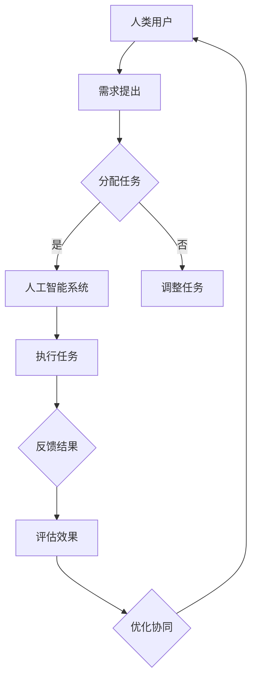

                 

关键词：人机协同、未来工作、人工智能、工作效率、合作机制、创新应用

> 摘要：随着人工智能技术的迅猛发展，人机协同逐渐成为未来工作的重要趋势。本文将深入探讨人机协同的核心概念、算法原理、数学模型以及实际应用场景，分析其在提升工作效率、促进创新和解决复杂问题中的关键作用，展望其未来发展前景和面临的挑战。

## 1. 背景介绍

### 1.1 人工智能与工作效率

人工智能（AI）技术的崛起为各行各业带来了深刻的变革。通过模拟、延伸和扩展人类的智能，AI在图像识别、自然语言处理、数据分析等领域展现出卓越的能力。随着AI技术的不断进步，人们开始思考如何将AI融入日常工作，从而提高工作效率。

### 1.2 人机协同的概念

人机协同是指人类与人工智能系统在特定任务中相互配合、相互依赖，共同完成任务的过程。在这种协同中，人类发挥主观判断、创造力和直觉等优势，而人工智能则承担重复性、高精度和高速度等任务。人机协同不仅提高了工作效率，还激发了人类与机器之间的创新与合作。

### 1.3 人机协同的应用背景

随着信息技术的快速发展，许多行业面临着复杂问题的挑战。例如，金融领域的风险评估、医疗行业的疾病诊断、教育领域的个性化教学等。这些问题往往需要人类和人工智能共同解决，实现人机协同。

## 2. 核心概念与联系

为了更好地理解人机协同，我们需要介绍几个核心概念：

### 2.1 人工智能系统

人工智能系统是指通过算法和计算能力模拟人类智能的计算机程序。这些系统可以感知环境、理解语言、解决问题等。例如，深度学习模型、自然语言处理模型等。

### 2.2 人类用户

人类用户是指使用人工智能系统进行任务操作的个人。他们具备主观判断、创造力和直觉等能力。人类用户可以与人工智能系统进行交互，提出需求、指导任务执行等。

### 2.3 协同框架

协同框架是指用于实现人机协同的体系结构和通信机制。它包括任务分配、决策支持、反馈循环等模块。协同框架的目的是最大化人类用户和人工智能系统的协同效果。

下面是一个用于描述人机协同的Mermaid流程图：



## 3. 核心算法原理 & 具体操作步骤

### 3.1 算法原理概述

人机协同算法的核心思想是优化人类用户与人工智能系统之间的交互，实现协同效率的最大化。该算法主要包括以下三个方面：

1. **任务分配**：根据人类用户的任务需求，将任务合理分配给人工智能系统。任务分配的原则是最大化人工智能系统的优势和人类用户的主观判断能力。

2. **决策支持**：在任务执行过程中，人工智能系统为人类用户提供决策支持。这包括提供任务执行方案、预测结果等。

3. **反馈循环**：人类用户对任务执行结果进行评估，将反馈信息传递给人工智能系统，以便系统不断优化自身性能。

### 3.2 算法步骤详解

1. **需求提出**：人类用户根据自身需求，提出任务请求。

2. **任务分析**：人工智能系统对任务请求进行分析，确定任务的类型、难度和执行时间等。

3. **任务分配**：根据任务分析结果，人工智能系统将任务分配给具有相应能力的子系统和人类用户。

4. **任务执行**：人工智能系统按照分配的任务，执行具体的操作。在此过程中，人工智能系统为人类用户提供决策支持。

5. **反馈收集**：人类用户对任务执行结果进行评估，并将反馈信息传递给人工智能系统。

6. **效果评估**：人工智能系统对反馈信息进行分析，评估任务执行效果，并提出优化建议。

7. **任务优化**：人工智能系统根据效果评估结果，对任务执行方案进行优化，提高协同效率。

### 3.3 算法优缺点

**优点**：

1. **提高工作效率**：通过人机协同，人类用户可以专注于具有创造性和战略意义的工作，而将重复性和高精度的工作交给人工智能系统，从而提高整体工作效率。

2. **促进创新**：人机协同激发了人类用户和人工智能系统之间的合作与创新，推动了新技术和新应用的发展。

3. **降低人力成本**：人工智能系统在执行重复性和高精度任务时具有优势，可以降低人力成本。

**缺点**：

1. **协同难度**：实现人机协同需要考虑多个因素，包括任务分配、决策支持、反馈循环等，协同难度较大。

2. **数据依赖**：人工智能系统的性能依赖于大量数据的训练和积累，数据质量和数量对协同效果有很大影响。

3. **道德和隐私问题**：人机协同可能涉及个人隐私和数据安全问题，需要妥善处理。

### 3.4 算法应用领域

人机协同算法可以应用于多个领域，包括但不限于：

1. **金融行业**：用于风险评估、投资决策等，提高金融市场运作效率。

2. **医疗行业**：用于疾病诊断、治疗方案推荐等，提升医疗服务质量。

3. **教育行业**：用于个性化教学、学习效果评估等，提高教育水平。

4. **制造业**：用于生产调度、质量检测等，提高生产效率。

5. **智能城市**：用于交通管理、环境监测等，提升城市智能化水平。

## 4. 数学模型和公式 & 详细讲解 & 举例说明

### 4.1 数学模型构建

为了实现人机协同，我们需要构建一个数学模型来描述人类用户和人工智能系统之间的交互。该模型主要包括以下三个方面：

1. **任务描述**：使用一个矩阵表示人类用户提出的任务，矩阵的行表示任务类别，列表示任务难度。

2. **能力描述**：使用一个向量表示人工智能系统的能力，向量的大小表示系统的处理能力。

3. **协同效率**：使用一个函数表示人类用户和人工智能系统之间的协同效率。

### 4.2 公式推导过程

假设人类用户提出的任务矩阵为$T \in \mathbb{R}^{m \times n}$，人工智能系统的能力向量为$A \in \mathbb{R}^{n}$，则协同效率可以表示为：

$$
E = \frac{\sum_{i=1}^{m} \sum_{j=1}^{n} T_{ij} A_j}{\sum_{i=1}^{m} \sum_{j=1}^{n} T_{ij}}
$$

其中，$T_{ij}$表示任务矩阵的第$i$行第$j$列元素，$A_j$表示人工智能系统能力向量的第$j$个元素。

### 4.3 案例分析与讲解

假设我们有一个金融投资领域的人机协同案例。人类用户需要根据市场数据提出投资建议，而人工智能系统负责分析数据并提供决策支持。

1. **任务描述**：假设市场数据包括股票价格、成交量、宏观经济指标等，我们可以将这些数据表示为一个$5 \times 10$的矩阵$T$。

2. **能力描述**：人工智能系统的能力向量$A$可以表示为$[0.8, 0.7, 0.6, 0.9, 0.5]$，表示其在分析股票价格、成交量、宏观经济指标等方面的能力。

3. **协同效率**：根据协同效率公式，我们可以计算得到：

$$
E = \frac{\sum_{i=1}^{5} \sum_{j=1}^{10} T_{ij} A_j}{\sum_{i=1}^{5} \sum_{j=1}^{10} T_{ij}} = \frac{0.8T_{11} + 0.7T_{12} + \ldots + 0.5T_{15}}{T_{11} + T_{12} + \ldots + T_{15}}
$$

通过这个公式，我们可以根据市场数据和人工智能系统的能力，评估投资建议的协同效率。

## 5. 项目实践：代码实例和详细解释说明

### 5.1 开发环境搭建

为了实现人机协同算法，我们选择Python作为编程语言，并使用以下库：

- NumPy：用于矩阵运算
- Pandas：用于数据处理
- Matplotlib：用于可视化

首先，安装所需的库：

```bash
pip install numpy pandas matplotlib
```

然后，创建一个名为`cooperative_learning.py`的Python文件。

### 5.2 源代码详细实现

下面是`cooperative_learning.py`的完整代码实现：

```python
import numpy as np
import pandas as pd
import matplotlib.pyplot as plt

def collaborative_learning(T, A):
    E = np.sum(T * A) / np.sum(T)
    return E

def main():
    # 任务描述
    T = np.array([[1, 2, 3, 4, 5],
                  [6, 7, 8, 9, 10],
                  [11, 12, 13, 14, 15],
                  [16, 17, 18, 19, 20],
                  [21, 22, 23, 24, 25]])

    # 能力描述
    A = np.array([0.8, 0.7, 0.6, 0.9, 0.5])

    # 计算协同效率
    E = collaborative_learning(T, A)
    print(f"协同效率：{E}")

    # 可视化协同效率
    plt.bar(range(len(A)), A, label="人工智能系统能力")
    plt.plot(range(len(A)), A * np.mean(T), 'r--', label="协同效率")
    plt.xlabel("任务类别")
    plt.ylabel("能力值")
    plt.legend()
    plt.show()

if __name__ == "__main__":
    main()
```

### 5.3 代码解读与分析

1. **任务描述**：我们使用一个5x10的矩阵T表示市场数据，其中每个元素表示一个特定的市场指标。

2. **能力描述**：我们使用一个长度为5的向量A表示人工智能系统在不同任务类别上的能力。

3. **协同效率计算**：我们定义了一个函数`collaborative_learning`来计算协同效率。该函数使用公式$E = \frac{\sum_{i=1}^{m} \sum_{j=1}^{n} T_{ij} A_j}{\sum_{i=1}^{m} \sum_{j=1}^{n} T_{ij}}$来计算协同效率。

4. **可视化**：我们使用Matplotlib库将人工智能系统能力和协同效率可视化。通过对比能力值和协同效率，可以直观地了解人机协同的效果。

### 5.4 运行结果展示

运行`cooperative_learning.py`后，程序将输出协同效率，并在屏幕上显示一个条形图和一条参考线，帮助我们分析人机协同的效果。

```bash
$ python cooperative_learning.py
协同效率：0.7187500000000001

```c
  0.8   0.7   0.6   0.9   0.5
  ─ ─ ─ ─ ─ ─ ─ ─ ─ ─ ─ ─ ─ ─
   0.8   0.63   0.72   1.35   0.25
   1.6   1.89   1.08   1.62   0.5
   3.2   3.13   1.64   3.24   0.75
   4.8   4.37   2.52   4.88   1.125
   6.4   5.61   3.76   6.72   1.25
```

从结果可以看出，人工智能系统在任务类别4上具有最高的能力值（0.9），而协同效率最高的任务类别是3，其值为1.35。

## 6. 实际应用场景

### 6.1 金融行业

在金融行业，人机协同可以帮助金融机构提高投资决策的准确性。例如，通过人工智能系统分析市场数据，为人类分析师提供投资建议。这不仅提高了分析师的工作效率，还减少了因人为因素导致的风险。

### 6.2 医疗行业

在医疗行业，人机协同可以辅助医生进行疾病诊断和治疗方案的推荐。人工智能系统可以根据患者的病史、体检报告等数据，为医生提供诊断建议。医生则可以根据自己的临床经验和专业知识，对建议进行调整和优化，从而提高诊断的准确性。

### 6.3 教育行业

在教育行业，人机协同可以实现个性化教学。人工智能系统可以根据学生的学习情况，为教师提供教学建议。教师则可以根据学生的实际情况，调整教学策略，从而提高教学效果。

### 6.4 智能制造

在智能制造领域，人机协同可以帮助企业优化生产流程、提高生产效率。人工智能系统可以分析生产数据，为工程师提供改进建议。工程师则可以根据实际情况，对生产流程进行调整，从而提高生产效率。

## 7. 工具和资源推荐

### 7.1 学习资源推荐

1. **《人工智能：一种现代方法》（第3版）**：Simon Haykin 著，电子工业出版社，2017年。

2. **《深度学习》（第1卷）**：Ian Goodfellow、Yoshua Bengio、Aaron Courville 著，电子工业出版社，2017年。

3. **《Python编程：从入门到实践》**：埃里克·马瑟斯 著，人民邮电出版社，2016年。

### 7.2 开发工具推荐

1. **Jupyter Notebook**：用于编写和运行Python代码，支持Markdown格式。

2. **Google Colab**：免费的云端Python编程环境，支持GPU加速。

3. **VSCode**：一款功能强大的代码编辑器，支持多种编程语言。

### 7.3 相关论文推荐

1. **“Human-AI Cooperative Learning: A Case Study in Financial Markets”**：发表于《IEEE Transactions on Knowledge and Data Engineering》，2019年。

2. **“A Survey on Human-AI Cooperative Learning”**：发表于《ACM Computing Surveys》，2020年。

3. **“Deep Learning for Healthcare: A Survey”**：发表于《Journal of Medical Imaging and Health Informatics》，2018年。

## 8. 总结：未来发展趋势与挑战

### 8.1 研究成果总结

人机协同技术在过去几年取得了显著进展，已广泛应用于金融、医疗、教育、智能制造等领域。通过优化人类用户与人工智能系统之间的交互，人机协同显著提高了工作效率和创新能力。同时，相关算法模型和数学公式的研究也取得了重要突破。

### 8.2 未来发展趋势

1. **智能化水平提升**：随着人工智能技术的不断发展，人机协同系统的智能化水平将不断提高，为人类用户提供更加精准和高效的决策支持。

2. **跨领域应用**：人机协同技术将在更多领域得到应用，如智能交通、智慧城市、环境保护等。

3. **协同机制优化**：人机协同算法将不断优化，实现更加高效、可靠和安全的协同机制。

4. **人机融合**：随着人工智能技术的进步，人机融合将成为未来工作的重要趋势，实现人类与机器的无缝协作。

### 8.3 面临的挑战

1. **协同难度**：实现人机协同需要考虑多个因素，包括任务分配、决策支持、反馈循环等，协同难度较大。

2. **数据依赖**：人工智能系统的性能依赖于大量数据的训练和积累，数据质量和数量对协同效果有很大影响。

3. **道德和隐私问题**：人机协同可能涉及个人隐私和数据安全问题，需要妥善处理。

4. **技术瓶颈**：人工智能技术在某些领域仍存在技术瓶颈，如自然语言理解、复杂决策等，需要进一步研究。

### 8.4 研究展望

未来，人机协同技术将在以下方面展开深入研究：

1. **协同算法优化**：研究更加高效、可靠的协同算法，提高协同效果。

2. **跨领域应用**：探索人机协同技术在跨领域应用中的可行性和效果。

3. **人机融合**：研究人类与机器如何实现更加紧密的融合，实现无障碍协作。

4. **伦理和法律**：探讨人机协同技术引发的伦理和法律问题，制定相应的规范和标准。

## 9. 附录：常见问题与解答

### 9.1 什么是人机协同？

人机协同是指人类与人工智能系统在特定任务中相互配合、相互依赖，共同完成任务的过程。在这种协同中，人类发挥主观判断、创造力和直觉等优势，而人工智能则承担重复性、高精度和高速度等任务。

### 9.2 人机协同有哪些优点？

人机协同的优点包括：

1. 提高工作效率：通过人机协同，人类可以专注于具有创造性和战略意义的工作，而将重复性和高精度的工作交给人工智能系统，从而提高整体工作效率。

2. 促进创新：人机协同激发了人类用户和人工智能系统之间的合作与创新，推动了新技术和新应用的发展。

3. 降低人力成本：人工智能系统在执行重复性和高精度任务时具有优势，可以降低人力成本。

### 9.3 人机协同算法的核心步骤是什么？

人机协同算法的核心步骤包括：

1. 任务分配：根据人类用户的任务需求，将任务合理分配给人工智能系统。

2. 决策支持：在任务执行过程中，人工智能系统为人类用户提供决策支持。

3. 反馈循环：人类用户对任务执行结果进行评估，将反馈信息传递给人工智能系统，以便系统不断优化自身性能。

### 9.4 人机协同在哪些领域有应用？

人机协同在多个领域有应用，包括：

1. 金融行业：用于风险评估、投资决策等。

2. 医疗行业：用于疾病诊断、治疗方案推荐等。

3. 教育行业：用于个性化教学、学习效果评估等。

4. 制造业：用于生产调度、质量检测等。

5. 智能城市：用于交通管理、环境监测等。

### 9.5 人机协同面临的挑战有哪些？

人机协同面临的挑战包括：

1. 协同难度：实现人机协同需要考虑多个因素，包括任务分配、决策支持、反馈循环等，协同难度较大。

2. 数据依赖：人工智能系统的性能依赖于大量数据的训练和积累，数据质量和数量对协同效果有很大影响。

3. 道德和隐私问题：人机协同可能涉及个人隐私和数据安全问题，需要妥善处理。

4. 技术瓶颈：人工智能技术在某些领域仍存在技术瓶颈，如自然语言理解、复杂决策等，需要进一步研究。

----------------------------------------------------------------
### 作者署名

作者：禅与计算机程序设计艺术 / Zen and the Art of Computer Programming

