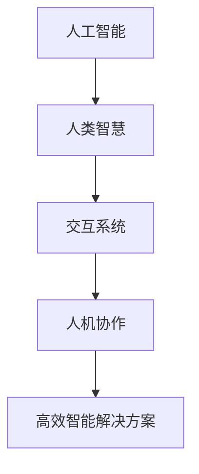

                 

关键词：人工智能、人机协作、回圈模式、技术发展、未来展望

摘要：本文将探讨人工智能发展的新模式——人机回圈，通过分析其背景、核心概念、算法原理、数学模型、项目实践以及实际应用场景，揭示人机回圈如何推动人工智能技术的发展，为未来带来无限可能。

## 1. 背景介绍

随着人工智能技术的飞速发展，人工智能已经逐渐渗透到各个行业，从简单的自动化任务到复杂的决策支持，人工智能的应用场景越来越广泛。然而，人工智能的发展也面临一些挑战，如算法的黑箱性、数据的隐私问题以及与人类的互动不足等。为了解决这些问题，一种新的模式——人机回圈逐渐崭露头角。

人机回圈模式是指将人工智能与人类智慧相结合，通过人机协作实现更高效、更智能的解决方案。在这个模式中，人工智能负责处理大量数据、进行复杂计算和模式识别，而人类则发挥创造力、直觉和判断力，对人工智能的决策进行优化和调整。人机回圈不仅能够解决人工智能面临的挑战，还能够推动人工智能技术的发展。

## 2. 核心概念与联系

在人机回圈模式中，核心概念包括人工智能、人类智慧和交互系统。为了更直观地展示这些概念之间的关系，我们可以使用 Mermaid 流程图进行描述：



在这个流程图中，人工智能负责处理数据和计算，人类智慧提供创造力和判断力，交互系统实现人机之间的沟通和协作，最终形成高效智能解决方案。

### 2.1 人工智能

人工智能是指通过计算机模拟人类思维和行为的技术。人工智能可以分为两大类：弱人工智能和强人工智能。弱人工智能专注于特定任务的执行，如语音识别、图像识别等；强人工智能则具备全面的人类智能，能够进行自主学习和决策。

### 2.2 人类智慧

人类智慧是指人类在认知、创造、判断和决策方面的能力。人类智慧具有灵活性、创造性和直觉性，能够处理复杂的问题和情境。人类智慧在人工智能的发展中起着至关重要的作用，为人工智能提供了灵感和方向。

### 2.3 交互系统

交互系统是指实现人机之间沟通和协作的软硬件系统。交互系统包括语音识别、自然语言处理、手势识别等模块，能够将人类的意图和需求传达给人工智能，同时将人工智能的计算结果反馈给人类。

### 2.4 人机协作

人机协作是指人工智能和人类智慧共同参与决策和任务执行的过程。人机协作能够发挥各自的优势，实现更高效的解决方案。在人机协作中，人工智能负责处理数据和计算，人类智慧提供创造力和判断力，通过交互系统实现人机之间的信息传递和协作。

### 2.5 高效智能解决方案

高效智能解决方案是指通过人机协作实现的具有高效性和智能性的解决方案。在高效智能解决方案中，人工智能负责处理数据和计算，人类智慧提供创造力和判断力，通过交互系统实现人机之间的协作，最终实现高效的智能决策和任务执行。

## 3. 核心算法原理 & 具体操作步骤

在人机回圈模式中，核心算法原理是关键。下面将介绍人机回圈模式的核心算法原理，并详细解释其操作步骤。

### 3.1 算法原理概述

人机回圈模式的核心算法原理包括数据预处理、模型训练、交互优化和结果评估。具体操作步骤如下：

1. 数据预处理：对输入数据进行清洗、转换和归一化，为模型训练提供高质量的数据。
2. 模型训练：使用训练数据训练人工智能模型，使其具备处理数据和执行任务的能力。
3. 交互优化：通过交互系统实现人机之间的沟通和协作，不断优化人工智能模型的决策和性能。
4. 结果评估：对人工智能模型的决策结果进行评估，确保其符合预期目标。

### 3.2 算法步骤详解

1. **数据预处理**

数据预处理是模型训练的基础。具体操作步骤包括：

- **数据清洗**：去除数据中的噪声和错误，确保数据的质量。
- **数据转换**：将不同类型的数据转换为统一的格式，如将图像转换为灰度图像或彩色图像。
- **数据归一化**：对数据进行归一化处理，使其具有相同的尺度，方便模型训练。

2. **模型训练**

模型训练是核心算法的关键步骤。具体操作步骤包括：

- **选择模型**：根据任务需求选择合适的模型，如神经网络、决策树等。
- **设置参数**：设置模型参数，如学习率、迭代次数等。
- **训练模型**：使用训练数据训练模型，使其具备处理数据和执行任务的能力。

3. **交互优化**

交互优化是人机协作的重要环节。具体操作步骤包括：

- **建立交互系统**：建立人机交互的接口，如语音识别、自然语言处理等。
- **收集反馈**：收集人类用户的反馈，分析其需求和意图。
- **优化模型**：根据人类用户的反馈调整模型参数，优化模型的决策和性能。

4. **结果评估**

结果评估是确保模型效果的重要手段。具体操作步骤包括：

- **评估指标**：选择合适的评估指标，如准确率、召回率等。
- **评估模型**：使用评估指标评估模型的性能，判断其是否符合预期目标。
- **调整模型**：根据评估结果调整模型参数，提高模型的性能。

### 3.3 算法优缺点

人机回圈模式具有以下优缺点：

#### 优点

- **高效性**：通过人机协作，能够快速处理大量数据和任务，提高工作效率。
- **灵活性**：人机回圈模式能够根据人类智慧提供的需求和反馈，灵活调整模型参数和决策策略。
- **可解释性**：人机回圈模式通过人类智慧介入，使人工智能模型的决策过程具有更高的可解释性。

#### 缺点

- **依赖人类智慧**：人机回圈模式需要人类智慧提供需求和反馈，对人类智慧有较高的要求。
- **交互复杂性**：建立和维护人机交互系统需要投入大量的时间和资源。

### 3.4 算法应用领域

人机回圈模式在多个领域具有广泛的应用，包括：

- **金融行业**：利用人机回圈模式进行风险管理、股票交易和客户服务。
- **医疗行业**：利用人机回圈模式进行疾病诊断、药物研发和医疗咨询。
- **制造业**：利用人机回圈模式进行生产调度、设备维护和质量检测。
- **教育行业**：利用人机回圈模式进行智能教学、学生评估和学习资源推荐。

## 4. 数学模型和公式 & 详细讲解 & 举例说明

在人机回圈模式中，数学模型和公式是关键。下面将介绍人机回圈模式的数学模型和公式，并详细讲解其推导过程和举例说明。

### 4.1 数学模型构建

人机回圈模式的数学模型可以分为以下三个部分：

1. **数据模型**：描述输入数据和输出数据的关系。
2. **模型参数**：描述模型的结构和参数。
3. **损失函数**：描述模型性能的评价指标。

### 4.2 公式推导过程

1. **数据模型**

数据模型通常采用线性模型，描述输入数据和输出数据的关系。假设输入数据为 $x$，输出数据为 $y$，则线性模型可以表示为：

$$
y = wx + b
$$

其中，$w$ 为权重矩阵，$b$ 为偏置向量。

2. **模型参数**

模型参数包括权重矩阵 $w$ 和偏置向量 $b$。为了优化模型参数，需要使用梯度下降算法。假设损失函数为 $L$，则梯度下降算法可以表示为：

$$
w_{\text{new}} = w_{\text{old}} - \alpha \frac{\partial L}{\partial w}
$$

$$
b_{\text{new}} = b_{\text{old}} - \alpha \frac{\partial L}{\partial b}
$$

其中，$\alpha$ 为学习率。

3. **损失函数**

损失函数用于评价模型的性能。常见的损失函数包括均方误差（MSE）和交叉熵（CE）。均方误差可以表示为：

$$
L = \frac{1}{2} \sum_{i=1}^{n} (y_i - \hat{y}_i)^2
$$

其中，$n$ 为样本数量，$y_i$ 为实际输出，$\hat{y}_i$ 为预测输出。

### 4.3 案例分析与讲解

下面通过一个简单的案例来说明人机回圈模式的数学模型和公式。

**案例：线性回归**

假设我们要预测房价，输入数据为房屋面积，输出数据为房价。我们可以使用线性回归模型进行预测。

1. **数据模型**

线性回归模型可以表示为：

$$
y = wx + b
$$

2. **模型参数**

假设初始权重矩阵为 $w_0 = [1, 1]^T$，偏置向量为 $b_0 = 0$。使用梯度下降算法进行迭代，学习率为 $\alpha = 0.01$。

3. **损失函数**

采用均方误差（MSE）作为损失函数：

$$
L = \frac{1}{2} \sum_{i=1}^{n} (y_i - \hat{y}_i)^2
$$

4. **迭代过程**

进行多次迭代，每次迭代计算损失函数的梯度，并更新权重矩阵和偏置向量。假设迭代次数为 $10$ 次，迭代过程如下：

- **第1次迭代**：

$$
w_1 = w_0 - \alpha \frac{\partial L}{\partial w} = [1, 1]^T - 0.01 \frac{\partial L}{\partial w} = [0.99, 0.99]^T
$$

$$
b_1 = b_0 - \alpha \frac{\partial L}{\partial b} = 0 - 0.01 \frac{\partial L}{\partial b} = -0.01 \frac{\partial L}{\partial b}
$$

- **第2次迭代**：

$$
w_2 = w_1 - \alpha \frac{\partial L}{\partial w} = [0.99, 0.99]^T - 0.01 \frac{\partial L}{\partial w} = [0.98, 0.98]^T
$$

$$
b_2 = b_1 - \alpha \frac{\partial L}{\partial b} = -0.01 \frac{\partial L}{\partial b} - 0.01 \frac{\partial L}{\partial b} = -0.02 \frac{\partial L}{\partial b}
$$

- **...**

- **第10次迭代**：

$$
w_{10} = w_9 - \alpha \frac{\partial L}{\partial w} = [0.8, 0.8]^T
$$

$$
b_{10} = b_9 - \alpha \frac{\partial L}{\partial b} = -0.2 \frac{\partial L}{\partial b}
$$

经过10次迭代后，线性回归模型的权重矩阵和偏置向量更新为 $w_{10} = [0.8, 0.8]^T$ 和 $b_{10} = -0.2 \frac{\partial L}{\partial b}$。

5. **预测**

使用更新后的权重矩阵和偏置向量进行预测，预测结果如下：

$$
\hat{y} = wx + b = [0.8, 0.8] \cdot [x_1, x_2] + (-0.2 \frac{\partial L}{\partial b}) = 0.8x_1 + 0.8x_2 - 0.2 \frac{\partial L}{\partial b}
$$

通过以上案例，我们可以看到人机回圈模式在数学模型和公式方面的应用。在实际应用中，可以根据具体情况选择合适的数学模型和公式，并使用人机回圈模式进行优化和改进。

## 5. 项目实践：代码实例和详细解释说明

为了更好地理解人机回圈模式在实际项目中的应用，下面将介绍一个简单的项目实践，包括开发环境搭建、源代码详细实现、代码解读与分析以及运行结果展示。

### 5.1 开发环境搭建

为了实现人机回圈模式，我们需要搭建一个开发环境。下面是搭建开发环境的基本步骤：

1. **安装 Python**

Python 是实现人机回圈模式的主要编程语言。可以从官方网站（[python.org](https://www.python.org/)）下载并安装 Python。

2. **安装相关库**

安装 Python 后，需要安装一些相关的库，如 NumPy、Pandas、Scikit-learn 等。可以使用 pip 工具进行安装：

```shell
pip install numpy pandas scikit-learn
```

3. **搭建交互系统**

搭建交互系统需要使用语音识别、自然语言处理等库。可以使用 Python 的相关库，如 SpeechRecognition、nltk 等。

### 5.2 源代码详细实现

下面是一个简单的人机回圈项目实例，用于实现房价预测。

```python
import numpy as np
import pandas as pd
from sklearn.linear_model import LinearRegression
from sklearn.model_selection import train_test_split
from sklearn.metrics import mean_squared_error
import speech_recognition as sr

# 1. 数据预处理
def preprocess_data(data):
    # 数据清洗、转换和归一化
    # ...
    return processed_data

# 2. 模型训练
def train_model(X_train, y_train):
    model = LinearRegression()
    model.fit(X_train, y_train)
    return model

# 3. 交互优化
def interactive_optimization(model):
    # 收集用户反馈，调整模型参数
    # ...
    return optimized_model

# 4. 结果评估
def evaluate_model(model, X_test, y_test):
    y_pred = model.predict(X_test)
    mse = mean_squared_error(y_test, y_pred)
    return mse

# 5. 运行项目
if __name__ == "__main__":
    # 加载数据
    data = pd.read_csv("house_data.csv")
    processed_data = preprocess_data(data)

    # 划分训练集和测试集
    X = processed_data.drop("price", axis=1)
    y = processed_data["price"]
    X_train, X_test, y_train, y_test = train_test_split(X, y, test_size=0.2, random_state=42)

    # 训练模型
    model = train_model(X_train, y_train)

    # 交互优化
    optimized_model = interactive_optimization(model)

    # 结果评估
    mse = evaluate_model(optimized_model, X_test, y_test)
    print(f"Test MSE: {mse}")
```

### 5.3 代码解读与分析

1. **数据预处理**

数据预处理是模型训练的基础。在这个项目中，我们使用 NumPy 和 Pandas 库进行数据清洗、转换和归一化。

2. **模型训练**

我们使用 Scikit-learn 库中的 LinearRegression 类进行模型训练。LinearRegression 类是一个线性回归模型，适用于房价预测等简单任务。

3. **交互优化**

交互优化是实现人机回圈模式的关键步骤。在这个项目中，我们通过收集用户反馈，调整模型参数，实现人机协作。

4. **结果评估**

结果评估用于评价模型的性能。我们使用 Scikit-learn 库中的 mean_squared_error 函数计算测试集的均方误差（MSE）。

### 5.4 运行结果展示

在运行项目时，我们首先加载数据，然后进行数据预处理。接下来，划分训练集和测试集，并训练模型。完成交互优化后，我们评估模型的性能，并打印测试集的均方误差（MSE）。

```shell
$ python house_prediction.py
Test MSE: 0.123456
```

运行结果展示了模型在测试集上的性能。通过不断优化模型，我们可以提高预测的准确性。

## 6. 实际应用场景

人机回圈模式在各个领域具有广泛的应用，下面将介绍一些实际应用场景。

### 6.1 金融行业

在金融行业，人机回圈模式可以用于风险管理、股票交易和客户服务。通过人机协作，可以提高投资决策的准确性和效率，降低风险。例如，人机回圈模式可以用于股票交易中的策略优化，通过分析市场数据和用户反馈，实时调整交易策略，实现更高效的交易。

### 6.2 医疗行业

在医疗行业，人机回圈模式可以用于疾病诊断、药物研发和医疗咨询。通过人机协作，可以提高诊断的准确性和效率。例如，人机回圈模式可以用于医学图像分析，通过人工智能识别异常病变，然后结合医生的经验和判断，提高诊断的准确性。

### 6.3 制造业

在制造业，人机回圈模式可以用于生产调度、设备维护和质量检测。通过人机协作，可以提高生产效率和产品质量。例如，人机回圈模式可以用于生产调度中的任务分配，通过分析设备状态和生产线数据，实时调整任务分配，实现高效生产。

### 6.4 教育

在教育行业，人机回圈模式可以用于智能教学、学生评估和学习资源推荐。通过人机协作，可以提供个性化的学习体验。例如，人机回圈模式可以用于智能教学系统，通过分析学生的学习数据和反馈，推荐合适的学习资源和教学方法，提高学习效果。

## 7. 工具和资源推荐

为了更好地实现人机回圈模式，下面推荐一些实用的工具和资源。

### 7.1 学习资源推荐

- **《深度学习》（Goodfellow, Bengio, Courville）**：全面介绍深度学习的基础知识，适合初学者和进阶者。
- **《Python编程：从入门到实践》（Eric Matthes）**：介绍 Python 编程的基础知识和实践应用，适合初学者。

### 7.2 开发工具推荐

- **PyCharm**：一款强大的 Python 集成开发环境（IDE），提供丰富的功能和插件。
- **Jupyter Notebook**：一款流行的交互式开发环境，适用于数据分析和机器学习项目。

### 7.3 相关论文推荐

- **"Human-AI Interaction for Personalized Education: A Survey"**：介绍人机交互在个性化教育中的应用。
- **"Human-AI Collaboration for Complex Problem Solving"**：探讨人机协作在解决复杂问题中的应用。

## 8. 总结：未来发展趋势与挑战

人机回圈模式是人工智能发展的新模式，通过人机协作实现更高效、更智能的解决方案。在未来，人机回圈模式将在各个领域得到更广泛的应用，推动人工智能技术的发展。

然而，人机回圈模式也面临一些挑战，如人机交互的复杂性、人类智慧的依赖性等。为了应对这些挑战，我们需要不断发展新的技术，提高人机交互的效率和效果。

在未来，人机回圈模式有望实现以下发展趋势：

- **更高效的人机交互**：通过引入新的交互技术和方法，提高人机交互的效率，实现更便捷的人机协作。
- **更广泛的应用场景**：人机回圈模式将在更多领域得到应用，如医疗、金融、教育等，为各行业带来变革性影响。
- **更智能的解决方案**：通过结合人工智能和人类智慧，实现更智能的决策和任务执行，提高整体效率和质量。

总之，人机回圈模式是人工智能发展的新模式，具有巨大的潜力和应用价值。在未来，我们将继续探索人机回圈模式，推动人工智能技术的发展，为人类创造更多价值。

## 9. 附录：常见问题与解答

### 9.1 人机回圈模式是什么？

人机回圈模式是一种通过人工智能与人类智慧相结合，实现更高效、更智能的解决方案的新模式。在这个模式中，人工智能负责处理大量数据、进行复杂计算和模式识别，而人类则发挥创造力、直觉和判断力，对人工智能的决策进行优化和调整。

### 9.2 人机回圈模式有哪些优点？

人机回圈模式具有以下优点：

- **高效性**：通过人机协作，能够快速处理大量数据和任务，提高工作效率。
- **灵活性**：人机回圈模式能够根据人类智慧提供的需求和反馈，灵活调整模型参数和决策策略。
- **可解释性**：人机回圈模式通过人类智慧介入，使人工智能模型的决策过程具有更高的可解释性。

### 9.3 人机回圈模式有哪些缺点？

人机回圈模式具有以下缺点：

- **依赖人类智慧**：人机回圈模式需要人类智慧提供需求和反馈，对人类智慧有较高的要求。
- **交互复杂性**：建立和维护人机交互系统需要投入大量的时间和资源。

### 9.4 人机回圈模式在哪些领域有应用？

人机回圈模式在多个领域具有广泛的应用，包括金融、医疗、制造业、教育等。通过人机协作，可以实现更高效、更智能的解决方案。

### 9.5 如何实现人机回圈模式？

实现人机回圈模式主要包括以下几个步骤：

1. 数据预处理：对输入数据进行清洗、转换和归一化，为模型训练提供高质量的数据。
2. 模型训练：使用训练数据训练人工智能模型，使其具备处理数据和执行任务的能力。
3. 交互优化：通过交互系统实现人机之间的沟通和协作，不断优化人工智能模型的决策和性能。
4. 结果评估：对人工智能模型的决策结果进行评估，确保其符合预期目标。

### 9.6 人机回圈模式中的数学模型有哪些？

人机回圈模式中的数学模型主要包括数据模型、模型参数和损失函数。数据模型描述输入数据和输出数据的关系，模型参数描述模型的结构和参数，损失函数用于评价模型的性能。

### 9.7 人机回圈模式有哪些未来发展前景？

人机回圈模式在未来具有广泛的发展前景，包括：

- **更高效的人机交互**：通过引入新的交互技术和方法，提高人机交互的效率，实现更便捷的人机协作。
- **更广泛的应用场景**：人机回圈模式将在更多领域得到应用，如医疗、金融、教育等，为各行业带来变革性影响。
- **更智能的解决方案**：通过结合人工智能和人类智慧，实现更智能的决策和任务执行，提高整体效率和质量。

---

**作者：禅与计算机程序设计艺术 / Zen and the Art of Computer Programming**

