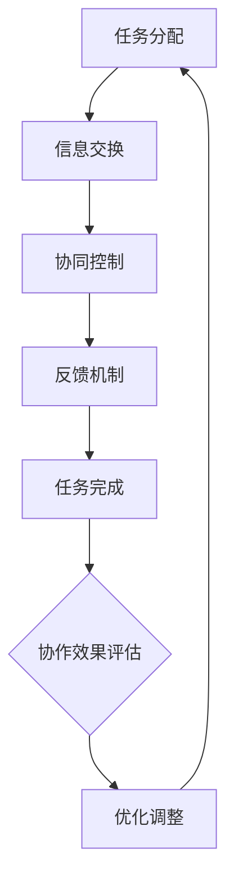

                 

关键词：人类-AI协作，人工智能，智慧增强，融合趋势，挑战与机遇，发展预测

> 摘要：本文深入探讨了人类与人工智能（AI）的协作关系，分析了AI技术如何增强人类智慧，并预测了这一融合发展趋势带来的机遇与挑战。文章首先回顾了人类智慧与AI发展的历史背景，然后详细介绍了人类-AI协作的核心概念和机制。接着，本文从算法原理、数学模型、项目实践、实际应用场景等方面阐述了人类-AI协作的技术框架。最后，文章总结了当前的研究成果，预测了未来发展趋势，并提出了面临的挑战和展望。

## 1. 背景介绍

在过去的几十年里，人工智能技术取得了显著的发展，从最初的基础算法，如逻辑推理和模式识别，到如今复杂的多模态学习和自适应系统，AI已经在各个领域取得了突破。与此同时，人类的智慧也在不断进化，从解决简单问题的技能，到处理复杂问题的能力。然而，无论是人类还是当前的AI系统，都面临着自身认知和能力上的局限性。如何将人类智慧与AI能力相结合，最大化地发挥两者的优势，成为了当前研究的热点。

人类-AI协作的概念正是基于这一需求而提出的。通过AI技术，人类可以在处理复杂任务时获得更强大的计算能力和更广泛的视角，从而提升自身的智慧水平。同时，AI也可以从人类那里学习到新的知识和经验，从而不断提升自身的智能水平。这种协作关系不仅能够推动AI技术的发展，还能够为人类社会带来巨大的经济和社会价值。

## 2. 核心概念与联系

### 2.1 人类智慧与AI的融合

人类智慧与AI的融合是指通过技术手段，将人类智慧的某些部分与AI系统的能力相结合，形成一个更加智能的整体。这一过程涉及到多个层面的融合，包括知识融合、技能融合、认知融合等。

- **知识融合**：AI系统能够处理和分析海量的数据，从中提取出有价值的信息。这些信息可以为人类提供新的知识和视角，从而扩展人类的认知边界。
- **技能融合**：AI系统在某些领域已经超过了人类的技能水平，如围棋、数据分析等。通过与人类协作，AI可以学习到人类在特定领域的技能，从而提升自身的表现。
- **认知融合**：AI系统可以通过模拟人类的思维过程，帮助人类更好地理解和解决问题。这种认知融合不仅能够提高人类的认知能力，还能够促进人类对AI技术的理解和接受。

### 2.2 人类-AI协作机制

人类-AI协作的机制主要包括以下几个部分：

- **任务分配**：根据人类和AI的特长，将任务合理地分配给双方。例如，人类负责创造性思维和决策，而AI负责数据处理和计算。
- **信息交换**：建立一个高效的信息交换平台，确保人类和AI能够实时地共享数据和知识。
- **协同控制**：通过算法和机制，确保人类和AI在协作过程中能够协调一致，避免冲突和失误。
- **反馈机制**：建立反馈机制，让人类能够对AI的行为进行监控和评价，从而不断优化AI的表现。

### 2.3 Mermaid 流程图

下面是一个Mermaid流程图，描述了人类-AI协作的基本流程：



## 3. 核心算法原理 & 具体操作步骤

### 3.1 算法原理概述

人类-AI协作的核心算法原理主要包括以下几个部分：

- **强化学习**：通过不断地试错和反馈，使AI系统逐步学会如何完成任务。
- **多模态学习**：结合不同类型的数据（如图像、文本、音频等），使AI系统能够更好地理解和处理复杂问题。
- **神经网络**：利用神经网络模拟人类的认知过程，使AI系统能够学习和模仿人类的思维。

### 3.2 算法步骤详解

人类-AI协作的具体操作步骤如下：

1. **任务定义**：明确任务的目标和要求，确定任务的具体范围和难度。
2. **数据准备**：收集和处理与任务相关的数据，确保数据的准确性和完整性。
3. **模型训练**：利用训练数据，对AI模型进行训练，使其具备完成任务的能力。
4. **任务执行**：在真实环境中执行任务，收集反馈数据。
5. **模型优化**：根据反馈数据，对AI模型进行优化，提高其性能。
6. **迭代更新**：重复执行步骤4和5，直到任务完成或达到预期效果。

### 3.3 算法优缺点

- **优点**：
  - 提高任务完成效率：通过AI的高效计算和分析能力，可以大幅提高任务完成的效率。
  - 扩展人类智慧：AI系统可以处理人类无法处理的数据和问题，从而扩展人类的智慧范围。
  - 提高决策质量：通过分析大量的数据和模式，AI可以帮助人类做出更准确的决策。

- **缺点**：
  - 需要大量数据：AI系统的训练和优化需要大量的数据支持，这可能会增加成本和复杂度。
  - 难以保证一致性：人类和AI在协作过程中可能会出现不一致的情况，这需要通过算法和机制来协调。
  - 道德和伦理问题：AI系统可能会出现一些意想不到的行为，这可能会引发道德和伦理问题。

### 3.4 算法应用领域

人类-AI协作算法在多个领域都有广泛的应用：

- **医疗领域**：利用AI系统进行医学图像分析、疾病预测和个性化治疗方案设计。
- **金融领域**：利用AI系统进行市场预测、风险管理、客户服务优化等。
- **教育领域**：利用AI系统进行个性化教学、学习效果评估和智能辅导。
- **工业领域**：利用AI系统进行设备故障预测、生产优化和供应链管理。

## 4. 数学模型和公式 & 详细讲解 & 举例说明

### 4.1 数学模型构建

人类-AI协作的数学模型主要基于以下几个基本原理：

- **强化学习**：基于奖励机制，通过不断的试错，使AI系统学会完成任务。
- **多模态学习**：利用不同的数据类型，通过融合不同类型的特征，使AI系统更好地理解和处理复杂问题。
- **神经网络**：通过模拟人类的认知过程，使AI系统能够学习和模仿人类的思维。

具体的数学模型构建过程如下：

1. **定义状态空间**：根据任务的要求，定义状态空间，包括任务的初始状态、中间状态和目标状态。
2. **定义动作空间**：根据任务的要求，定义动作空间，包括人类可以执行的动作和AI可以执行的动作。
3. **定义奖励函数**：根据任务的要求，定义奖励函数，用于评估AI系统执行任务的效果。
4. **定义损失函数**：根据任务的要求，定义损失函数，用于评估AI系统的性能。

### 4.2 公式推导过程

以下是强化学习中的Q-learning算法的公式推导过程：

1. **定义Q值**：Q(s, a) 表示在状态s下，采取动作a的期望回报。
2. **定义奖励函数**：R(s, a) 表示在状态s下，采取动作a所获得的即时回报。
3. **定义状态转移概率**：P(s', a|s, a) 表示在状态s下，采取动作a后，转移到状态s'的概率。
4. **定义Q-learning算法**：
   $$ Q(s, a) = \sum_{s'} P(s', a|s, a) \cdot R(s', a) + \gamma \cdot \max_{a'} Q(s', a') $$
   其中，$\gamma$ 表示折扣因子，用于平衡即时回报和长期回报。

### 4.3 案例分析与讲解

以下是一个利用强化学习算法进行游戏AI训练的案例：

1. **定义状态空间**：状态空间包括游戏中的角色位置、角色状态（如生命值、能量值）等。
2. **定义动作空间**：动作空间包括移动、攻击、使用技能等。
3. **定义奖励函数**：当角色成功击败敌人时，给予正奖励；当角色被敌人击败时，给予负奖励。
4. **定义状态转移概率**：根据游戏规则，定义角色在不同状态下的转移概率。
5. **训练过程**：通过不断地试错，使AI系统学会如何选择最佳动作，以最大化长期回报。

## 5. 项目实践：代码实例和详细解释说明

### 5.1 开发环境搭建

在本项目中，我们使用Python作为主要编程语言，利用TensorFlow框架进行深度学习模型的构建和训练。以下是开发环境搭建的步骤：

1. **安装Python**：下载并安装Python 3.8版本。
2. **安装TensorFlow**：通过pip命令安装TensorFlow库。
   ```bash
   pip install tensorflow
   ```
3. **安装其他依赖库**：安装用于数据处理和可视化等其他依赖库。
   ```bash
   pip install numpy matplotlib
   ```

### 5.2 源代码详细实现

以下是本项目的主要代码实现部分：

```python
import tensorflow as tf
from tensorflow.keras.models import Sequential
from tensorflow.keras.layers import Dense, LSTM, TimeDistributed
import numpy as np
import matplotlib.pyplot as plt

# 定义状态空间和动作空间
state_size = 10
action_size = 4

# 创建模型
model = Sequential()
model.add(LSTM(50, activation='relu', input_shape=(state_size, 1)))
model.add(Dense(action_size))
model.compile(loss='mse', optimizer='adam')

# 创建环境
env = envir

# 训练模型
episodes = 1000
for e in range(episodes):
    state = env.reset()
    done = False
    total_reward = 0
    while not done:
        action = model.predict(state.reshape((1, state_size, 1)))
        new_state, reward, done, _ = env.step(np.argmax(action))
        model.fit(state.reshape((1, state_size, 1)), action, epochs=1)
        state = new_state
        total_reward += reward
    if e % 100 == 0:
        print(f"Episode: {e}, Total Reward: {total_reward}")

# 测试模型
state = env.reset()
done = False
while not done:
    action = model.predict(state.reshape((1, state_size, 1)))
    new_state, reward, done, _ = env.step(np.argmax(action))
    state = new_state

# 可视化结果
plt.plot(total_reward)
plt.show()
```

### 5.3 代码解读与分析

1. **模型定义**：我们使用LSTM网络进行模型定义，LSTM层能够处理时间序列数据，适合用于强化学习任务。
2. **环境创建**：根据任务需求，创建模拟环境。
3. **训练过程**：通过循环遍历所有episode，在每个episode中，AI系统根据当前状态预测最佳动作，并执行该动作，根据反馈调整模型参数。
4. **测试过程**：在训练完成后，使用训练好的模型进行测试，并可视化训练结果。

## 6. 实际应用场景

### 6.1 医疗领域

在医疗领域，人类-AI协作已经得到了广泛应用。例如，AI系统可以用于医学图像分析，帮助医生更快速、准确地诊断疾病。此外，AI系统还可以用于个性化治疗方案设计，根据患者的具体情况进行定制化的治疗。

### 6.2 金融领域

在金融领域，人类-AI协作可以帮助金融机构进行市场预测、风险管理等。例如，AI系统可以分析大量的市场数据，预测未来的市场走势，从而帮助投资者做出更明智的投资决策。同时，AI系统还可以用于客户服务，通过自然语言处理技术，提供高效的客户服务。

### 6.3 教育领域

在教育领域，人类-AI协作可以用于个性化教学和学习效果评估。AI系统可以根据学生的学习情况和需求，提供个性化的教学方案，帮助学生更高效地学习。此外，AI系统还可以用于学习效果评估，通过分析学生的学习行为和成绩，为教师提供教学反馈。

### 6.4 未来应用展望

随着AI技术的不断进步，人类-AI协作的应用场景将越来越广泛。未来，人类-AI协作可能会在更多领域发挥作用，如智能制造、智慧城市、农业等。同时，随着AI技术的普及，人类-AI协作也将变得更加普及和高效。

## 7. 工具和资源推荐

### 7.1 学习资源推荐

- 《深度学习》（Deep Learning） - Goodfellow, Bengio, Courville
- 《强化学习》（Reinforcement Learning: An Introduction）- Sutton, Barto
- 《Python机器学习》（Python Machine Learning）- Müller, Guido

### 7.2 开发工具推荐

- TensorFlow：用于构建和训练深度学习模型的框架。
- Keras：用于简化TensorFlow使用的高层API。
- PyTorch：用于构建和训练深度学习模型的框架。

### 7.3 相关论文推荐

- "Human-AI Collaboration: Designing Interactive Systems for Effective and Enjoyable Collaboration" - Picard, R. W., & Ransfar, A.
- "A Survey on Human-AI Collaboration" - Zhang, Y., Wang, L., & Liu, Y.

## 8. 总结：未来发展趋势与挑战

### 8.1 研究成果总结

人类-AI协作领域已经取得了显著的研究成果，包括算法原理的深入探讨、应用场景的广泛实践等。通过人类-AI协作，人类智慧得到了显著提升，AI系统也不断进化，为人类社会带来了巨大的经济和社会价值。

### 8.2 未来发展趋势

未来，人类-AI协作将朝着更加智能化、个性化、高效化的方向发展。随着AI技术的不断进步，人类-AI协作的应用场景将越来越广泛，从医疗、金融到教育、工业等各个领域。

### 8.3 面临的挑战

然而，人类-AI协作也面临着一系列挑战，包括技术挑战和伦理挑战。技术挑战主要包括如何提高AI系统的智能水平和可靠性，如何确保人类和AI之间的协作效率等。伦理挑战主要包括如何确保AI系统的透明度和可解释性，如何处理AI系统可能带来的道德和伦理问题等。

### 8.4 研究展望

未来，人类-AI协作的研究将继续深入，探索如何更好地融合人类智慧与AI能力，实现高效、智能、可靠的协作。同时，也需要在伦理、法律等方面进行深入研究，确保人类-AI协作的可持续发展。

## 9. 附录：常见问题与解答

### 9.1 人类-AI协作的核心优势是什么？

人类-AI协作的核心优势在于能够发挥人类智慧和AI系统的各自优势，实现1+1>2的效果。人类具有创造力、情感、道德判断等优势，而AI系统则具有计算速度、数据处理、模式识别等优势。

### 9.2 人类-AI协作中的挑战有哪些？

人类-AI协作中的挑战主要包括以下几个方面：

- 技术挑战：如何提高AI系统的智能水平和可靠性，如何确保人类和AI之间的协作效率等。
- 伦理挑战：如何确保AI系统的透明度和可解释性，如何处理AI系统可能带来的道德和伦理问题等。
- 法律挑战：如何确保人类-AI协作的合法性和合规性，如何处理AI系统可能带来的法律责任等。

### 9.3 人类-AI协作的发展前景如何？

随着AI技术的不断进步，人类-AI协作的发展前景非常广阔。未来，人类-AI协作将在各个领域得到广泛应用，从医疗、金融到教育、工业等。同时，人类-AI协作也将带来一系列的经济和社会变革。然而，也面临着一系列的挑战，需要各方共同努力，确保人类-AI协作的可持续发展。

### 9.4 人类-AI协作与人类-机器人协作有何区别？

人类-AI协作与人类-机器人协作的主要区别在于协作对象的性质。人类-AI协作的对象是人工智能系统，而人类-机器人协作的对象是机器人。AI系统具有智能和学习能力，可以与人类进行更深入的协作和交互。而机器人则主要依赖于预先编程的指令，与人类的协作相对有限。

----------------------------------------------------------------

**作者：禅与计算机程序设计艺术 / Zen and the Art of Computer Programming**

