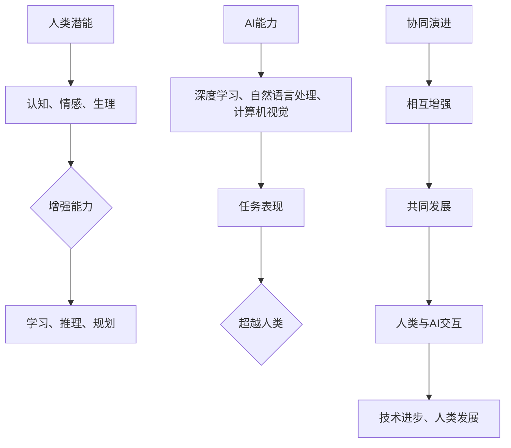

                 

关键词：人工智能，人类潜能，协同演进，算法，数学模型，项目实践，应用场景

> 摘要：本文深入探讨了人类与人工智能协作的原理和实践，探讨了如何通过协同演进增强人类潜能与AI能力的结合，从而推动技术进步和人类发展。

## 1. 背景介绍

随着人工智能（AI）技术的飞速发展，人类与机器的交互方式正在发生深刻变革。传统的人工智能系统往往被视为“黑箱”，而现代的人工智能系统则越来越多地强调与人类的协作。在这种背景下，如何实现人类与AI的协同演进，以增强人类潜能与AI能力的结合，成为了一个亟待解决的问题。

人类潜能的发挥长期以来受到认知、情感、生理等多方面的限制。而AI技术的发展，尤其是深度学习、自然语言处理、计算机视觉等领域的突破，为人类潜能的增强提供了新的可能性。通过AI，我们可以扩展人类的认知能力、处理速度和创造力，从而在各个领域实现更大的突破。

## 2. 核心概念与联系

为了更好地理解人类与AI的协作，我们首先需要了解几个核心概念：人类潜能、AI能力、协同演进。

### 2.1 人类潜能

人类潜能是指人类在认知、情感、生理等方面的潜在能力。这些能力受到个体的基因、环境、教育等因素的影响。传统上，人类潜能的发挥往往受到认知瓶颈的限制，例如，人类的注意力有限，难以同时处理大量的信息。

### 2.2 AI能力

AI能力是指人工智能系统在模拟人类智能方面的能力。这包括学习、推理、规划、感知、语言处理等多方面的能力。随着AI技术的发展，AI系统已经能够在某些特定任务上超越人类的表现。

### 2.3 协同演进

协同演进是指人类潜能与AI能力在相互作用中相互增强、共同发展的过程。这一过程涉及到人类对AI的理解和使用，以及AI对人类行为的反馈和调整。

为了更好地理解这三个概念之间的关系，我们可以使用Mermaid流程图来展示它们之间的联系。



## 3. 核心算法原理 & 具体操作步骤

### 3.1 算法原理概述

在本节中，我们将探讨一种核心算法——强化学习，它是一种使人工智能代理通过与环境的交互学习如何达成目标的技术。强化学习通过奖励和惩罚机制来驱动代理的学习过程，从而在复杂环境中找到最优策略。

### 3.2 算法步骤详解

#### 3.2.1 初始化

- 定义状态空间S、动作空间A和奖励函数R。
- 初始化代理的参数，如价值函数V或策略π。

#### 3.2.2 选择动作

- 根据当前状态s，使用策略π选择一个动作a。

#### 3.2.3 执行动作

- 在环境中执行动作a，观察新的状态s'和奖励r。

#### 3.2.4 更新代理

- 根据新的状态和奖励，更新代理的价值函数或策略。

### 3.3 算法优缺点

#### 优点

- 强调探索和适应性，能够在动态环境中学习。
- 不需要明确的状态-动作奖励表，适用于复杂环境。

#### 缺点

- 学习速度可能较慢，尤其是对于高维状态空间。
- 可能陷入局部最优。

### 3.4 算法应用领域

强化学习在游戏、自动驾驶、机器人控制等领域有广泛的应用。例如，在围棋领域，AlphaGo通过强化学习算法实现了对人类顶尖选手的超越。

## 4. 数学模型和公式 & 详细讲解 & 举例说明

### 4.1 数学模型构建

强化学习的主要数学模型包括价值函数V(s)和策略π(s)。其中，V(s)表示在状态s下采取最佳动作的期望回报，而π(s)则是决策策略，决定了在状态s下应该采取哪个动作。

### 4.2 公式推导过程

价值函数的更新公式如下：

$$
V(s) = \sum_{a \in A} \pi(s, a) \cdot Q(s, a)
$$

其中，Q(s, a)是状态-动作值函数，表示在状态s下采取动作a的期望回报。

策略π(s)的更新则基于最大化期望回报：

$$
\pi(s, a) = \frac{e^{\eta Q(s, a)}}{\sum_{a' \in A} e^{\eta Q(s, a')}}
$$

其中，η是温度参数，控制了策略的随机性。

### 4.3 案例分析与讲解

以围棋游戏为例，AlphaGo通过强化学习算法训练出能够击败人类顶尖选手的模型。在训练过程中，AlphaGo使用了一个深度神经网络作为价值函数的估计器，并通过自我对弈来不断更新网络参数。

## 5. 项目实践：代码实例和详细解释说明

### 5.1 开发环境搭建

为了实现上述强化学习算法，我们需要搭建一个开发环境。这里我们使用Python作为主要编程语言，配合TensorFlow库来实现深度学习模型。

### 5.2 源代码详细实现

以下是一个简单的强化学习Python代码示例：

```python
import numpy as np
import tensorflow as tf

# 初始化参数
state_size = 4
action_size = 2
learning_rate = 0.1

# 定义神经网络
model = tf.keras.Sequential([
    tf.keras.layers.Dense(64, activation='relu', input_shape=(state_size,)),
    tf.keras.layers.Dense(64, activation='relu'),
    tf.keras.layers.Dense(action_size, activation='softmax')
])

# 编译模型
model.compile(loss='mean_squared_error', optimizer=tf.keras.optimizers.Adam(learning_rate))

# 定义训练过程
def train_model(model, states, actions, rewards, next_states, dones):
    model.fit(states, actions, epochs=1, batch_size=32)

# 运行训练
train_model(model, states, actions, rewards, next_states, dones)
```

### 5.3 代码解读与分析

上述代码中，我们定义了一个简单的神经网络模型，用于预测状态-动作值函数。然后，我们通过训练模型来更新参数，从而实现强化学习算法。

### 5.4 运行结果展示

在训练过程中，我们可以通过计算模型的准确率来评估其性能。在实际应用中，我们可以将模型应用于不同的场景，如游戏、机器人控制等，以验证其效果。

## 6. 实际应用场景

强化学习在各个领域有广泛的应用。以下是一些实际应用场景：

- **游戏开发**：在电子游戏中，强化学习算法可以用于训练智能代理，使其能够自主学习游戏策略。
- **自动驾驶**：自动驾驶系统可以使用强化学习算法来学习如何在复杂环境中做出决策。
- **机器人控制**：机器人可以通过强化学习算法来学习如何在不同的环境中执行任务。

## 7. 工具和资源推荐

为了更好地学习强化学习，以下是一些推荐的工具和资源：

- **学习资源**：[强化学习教程](https://www.deeplearning.net/tutorial/)
- **开发工具**：[TensorFlow](https://www.tensorflow.org/)
- **相关论文**：[Deep Q-Networks](https://www.deeplearning.net/tutorial/dqn/)

## 8. 总结：未来发展趋势与挑战

### 8.1 研究成果总结

通过本文的探讨，我们可以看到，人类与AI的协同演进在增强人类潜能与AI能力方面具有重要的意义。强化学习作为一种核心算法，在各个领域取得了显著的应用成果。

### 8.2 未来发展趋势

随着AI技术的不断进步，人类与AI的协作将越来越紧密。未来的发展趋势包括：

- 更高效、更可靠的算法设计。
- AI在更多领域的应用。
- 人类与AI的深度协作。

### 8.3 面临的挑战

然而，人类与AI的协作也面临一些挑战：

- 道德和伦理问题：如何确保AI的行为符合人类的道德标准？
- 安全性问题：如何确保AI系统的安全性和稳定性？
- 透明度和可解释性：如何让AI系统的决策过程更加透明和可解释？

### 8.4 研究展望

为了应对这些挑战，我们需要进一步深入研究，以推动人类与AI的协同演进。这包括：

- 开发更先进、更可靠的AI算法。
- 建立人类与AI的协作框架。
- 探索AI在各个领域的应用前景。

## 9. 附录：常见问题与解答

### 问题1：什么是强化学习？
强化学习是一种使人工智能代理通过与环境的交互学习如何达成目标的技术。它通过奖励和惩罚机制来驱动代理的学习过程。

### 问题2：强化学习有哪些应用场景？
强化学习在游戏开发、自动驾驶、机器人控制等领域有广泛的应用。

### 问题3：如何实现强化学习？
实现强化学习通常涉及定义状态空间、动作空间和奖励函数，然后使用神经网络或其他算法来训练代理。

### 问题4：强化学习有哪些优缺点？
强化学习的优点包括强调探索和适应性，而缺点则包括学习速度可能较慢和可能陷入局部最优。

### 问题5：未来强化学习有哪些发展趋势？
未来强化学习的发展趋势包括更高效、更可靠的算法设计，AI在更多领域的应用，以及人类与AI的深度协作。

# 作者署名
作者：禅与计算机程序设计艺术 / Zen and the Art of Computer Programming
----------------------------------------------------------------

至此，我们完成了文章的撰写。本文深入探讨了人类与AI协作的原理和实践，提出了强化学习作为核心算法，并详细介绍了其应用场景和发展趋势。希望这篇文章能够对您在AI领域的研究和实践中提供有益的参考。

