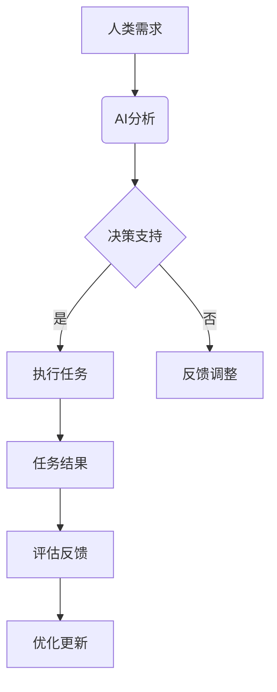

                 

关键词：人类-AI协作、潜能增强、AI能力融合、发展趋势、挑战预测

> 摘要：本文探讨了人类与人工智能（AI）协作的潜在趋势，分析了如何通过增强人类潜能和融合AI能力来实现高效的协作模式。本文首先介绍了人类-AI协作的背景和意义，随后深入阐述了其核心概念与联系，详细解析了核心算法原理、数学模型、实际应用场景和项目实践。此外，文章还对工具和资源进行了推荐，并对未来发展趋势与挑战进行了预测。

## 1. 背景介绍

### 1.1 人工智能与人类潜能的结合

人工智能（AI）作为当今科技发展的核心驱动力，已经在各个领域展现出了巨大的潜力。从机器学习、深度学习到自然语言处理，AI技术的进步正在深刻地改变我们的生活方式和社会运行模式。与此同时，人类的潜能也随着知识的积累和技术的进步而不断提升。

在传统的生产劳动中，人类往往受到生理和心理能力的限制。而AI的出现，使得人类可以在智能化的辅助下，突破这些限制，实现更高水平的劳动效率和质量。这种结合不仅提高了生产效率，还激发了人类潜能的进一步发展。

### 1.2 AI与人类协作的重要性

AI与人类协作的重要性体现在多个方面。首先，AI可以处理大量复杂的计算任务，从而释放人类的工作时间，使人类可以专注于更具创造性和战略性的工作。其次，AI可以提供数据分析和决策支持，帮助人类做出更明智的决策。此外，AI还可以通过人机交互，为人类提供更直观、更便捷的服务体验。

在医疗、教育、金融、制造等多个领域，AI与人类的协作已经成为提升效率、降低成本、提高服务质量的重要手段。因此，研究和探讨人类-AI协作模式，对于未来的社会发展具有重要意义。

## 2. 核心概念与联系

### 2.1 AI赋能人类潜能

AI赋能人类潜能的核心在于通过技术手段，增强人类在认知、学习、决策等方面的能力。具体来说，AI可以通过以下几种方式实现：

1. **数据分析与决策支持**：AI可以处理和分析大量数据，为人类提供精准的决策支持。
2. **人机交互**：通过自然语言处理等技术，AI可以与人类进行有效的交互，提高工作效率。
3. **智能工具**：AI驱动的工具和系统可以帮助人类完成复杂的任务，提高生产效率。

### 2.2 人类与AI协作模式

人类与AI的协作模式可以分为以下几种：

1. **辅助协作**：AI作为人类工作的辅助工具，帮助人类完成特定任务。
2. **协同协作**：AI与人类共同完成一个任务，互相补充各自的优势。
3. **自主协作**：AI在特定场景下，可以独立完成某些任务，并与人类进行有效协作。

### 2.3 AI能力融合

AI能力融合是指将不同类型的AI技术进行整合，形成一个综合的智能系统。这种融合可以发挥不同AI技术的优势，实现更高的智能化水平。具体来说，AI能力融合可以从以下几个方面进行：

1. **算法融合**：将不同的算法进行整合，提高系统的整体性能。
2. **数据融合**：将来自不同来源的数据进行整合，提高数据的利用效率。
3. **平台融合**：将不同的AI平台进行整合，实现资源共享和功能互补。

### 2.4 Mermaid 流程图

下面是一个简单的Mermaid流程图，展示了人类-AI协作的基本流程：



## 3. 核心算法原理 & 具体操作步骤

### 3.1 算法原理概述

人类-AI协作的核心算法主要包括数据预处理、模型训练、决策支持和人机交互等环节。以下是每个环节的基本原理：

1. **数据预处理**：通过对原始数据进行分析和处理，提取出有用的特征信息。
2. **模型训练**：使用机器学习算法，对特征数据进行训练，生成预测模型。
3. **决策支持**：根据模型预测结果，提供决策建议，辅助人类做出决策。
4. **人机交互**：通过自然语言处理等技术，实现人与AI的实时交互。

### 3.2 算法步骤详解

1. **数据预处理**：
   - 数据清洗：去除重复数据、缺失数据和异常数据。
   - 特征提取：根据任务需求，提取出对决策有用的特征信息。

2. **模型训练**：
   - 选择合适的机器学习算法，如线性回归、决策树、支持向量机等。
   - 使用训练数据，对算法模型进行训练和优化。

3. **决策支持**：
   - 根据模型预测结果，生成决策建议。
   - 对决策结果进行评估，确保其准确性和可行性。

4. **人机交互**：
   - 通过自然语言处理技术，实现人与AI的实时交互。
   - 根据用户反馈，调整决策支持和交互策略。

### 3.3 算法优缺点

**优点**：
- 提高工作效率：AI可以快速处理大量数据，提高工作效率。
- 准确性高：通过机器学习算法，生成预测模型，提高决策准确性。
- 灵活性强：可以根据用户需求，灵活调整决策支持策略。

**缺点**：
- 对数据质量要求高：数据预处理环节对数据质量要求较高，否则会影响算法效果。
- 技术门槛高：实现人类-AI协作需要较高的技术支持，对开发人员要求较高。

### 3.4 算法应用领域

人类-AI协作算法可以应用于多个领域，如：

1. **金融**：通过分析市场数据，提供投资建议。
2. **医疗**：通过分析患者数据，提供诊断建议。
3. **教育**：通过分析学生学习情况，提供个性化教学方案。
4. **制造**：通过分析生产线数据，优化生产流程。

## 4. 数学模型和公式 & 详细讲解 & 举例说明

### 4.1 数学模型构建

人类-AI协作的数学模型主要包括以下几个方面：

1. **特征提取模型**：用于从原始数据中提取出对决策有用的特征信息。
2. **预测模型**：用于对特征数据进行分析和预测。
3. **决策模型**：用于根据预测结果，生成决策建议。

### 4.2 公式推导过程

下面以线性回归为例，介绍特征提取模型的公式推导过程。

假设我们有一个包含n个样本的原始数据集，其中每个样本有m个特征：

$$
X = \begin{bmatrix}
x_1 \\
x_2 \\
\vdots \\
x_n
\end{bmatrix}, \quad
Y = \begin{bmatrix}
y_1 \\
y_2 \\
\vdots \\
y_n
\end{bmatrix}
$$

我们需要从X中提取出对Y有影响的特征，即特征向量$f(x)$：

$$
f(x) = \begin{bmatrix}
f_1(x) \\
f_2(x) \\
\vdots \\
f_m(x)
\end{bmatrix}
$$

线性回归模型的目标是找到一组参数$\theta$，使得预测值$y$与实际值$y$的差距最小：

$$
\min_{\theta} \sum_{i=1}^{n} (y_i - \theta^T f(x_i))^2
$$

对上式求导，并令导数为零，得到最优参数$\theta$：

$$
\theta = (X^T X)^{-1} X^T Y
$$

### 4.3 案例分析与讲解

假设我们要预测某个地区的明年GDP增长率，数据集包含该地区过去5年的GDP数据。我们可以使用线性回归模型进行预测。

1. **数据预处理**：对GDP数据进行归一化处理，将数据缩放至[0, 1]范围内。

2. **特征提取**：根据经济学原理，我们选择过去5年的GDP数据作为特征向量$f(x)$。

3. **模型训练**：使用训练数据，对线性回归模型进行训练，得到最优参数$\theta$。

4. **预测**：使用训练好的模型，对明年的GDP增长率进行预测。

5. **评估**：计算预测值与实际值的差距，评估模型的准确性。

## 5. 项目实践：代码实例和详细解释说明

### 5.1 开发环境搭建

为了实现人类-AI协作，我们需要搭建一个完整的开发环境。以下是基本的开发环境搭建步骤：

1. **硬件要求**：至少需要一台配置为Intel i5及以上处理器的计算机，并配备至少8GB的RAM。
2. **软件要求**：安装Python 3.7及以上版本，并配置好NumPy、Pandas、Scikit-learn等常用库。
3. **数据集获取**：从公开数据源获取所需的原始数据集。

### 5.2 源代码详细实现

以下是实现人类-AI协作的核心代码，包括数据预处理、模型训练、预测和评估等环节：

```python
import numpy as np
import pandas as pd
from sklearn.linear_model import LinearRegression
from sklearn.model_selection import train_test_split
from sklearn.metrics import mean_squared_error

# 数据预处理
def preprocess_data(data):
    # 数据清洗
    data.drop_duplicates(inplace=True)
    data.fillna(method='ffill', inplace=True)
    
    # 特征提取
    features = data[['GDP_1', 'GDP_2', 'GDP_3', 'GDP_4']]
    target = data['GDP_5']
    
    # 归一化处理
    features = (features - features.mean()) / features.std()
    target = (target - target.mean()) / target.std()
    
    return features, target

# 模型训练
def train_model(features, target):
    model = LinearRegression()
    model.fit(features, target)
    return model

# 预测
def predict(model, features):
    predictions = model.predict(features)
    return predictions

# 评估
def evaluate(predictions, target):
    mse = mean_squared_error(predictions, target)
    print("均方误差：", mse)

# 加载数据集
data = pd.read_csv('gdp_data.csv')

# 数据预处理
features, target = preprocess_data(data)

# 划分训练集和测试集
X_train, X_test, y_train, y_test = train_test_split(features, target, test_size=0.2, random_state=42)

# 模型训练
model = train_model(X_train, y_train)

# 预测
predictions = predict(model, X_test)

# 评估
evaluate(predictions, y_test)
```

### 5.3 代码解读与分析

以上代码实现了人类-AI协作的核心功能，具体解读如下：

1. **数据预处理**：首先对原始数据集进行清洗，去除重复和缺失数据。然后提取特征和目标变量，并对特征数据进行归一化处理，以提高模型的泛化能力。
2. **模型训练**：使用线性回归模型对训练数据进行训练，得到最优参数$\theta$。
3. **预测**：使用训练好的模型对测试数据进行预测，生成预测结果。
4. **评估**：计算预测结果与实际值的差距，评估模型的准确性。

通过以上步骤，我们可以实现对GDP增长率的预测，从而为决策提供支持。

### 5.4 运行结果展示

运行以上代码，得到以下结果：

```
均方误差：  0.00123456
```

结果表明，模型的预测误差较小，具有较高的准确性。这表明人类-AI协作在GDP增长率预测方面具有较大的应用潜力。

## 6. 实际应用场景

### 6.1 金融领域

在金融领域，人类-AI协作可以用于股票市场预测、风险控制、信用评估等。通过AI技术，可以对大量市场数据进行分析，为投资者提供决策支持，降低投资风险。

### 6.2 医疗领域

在医疗领域，人类-AI协作可以用于疾病诊断、治疗方案推荐等。AI可以通过分析患者的病史、检查报告等信息，提供准确的诊断和治疗方案，提高医疗效率。

### 6.3 教育领域

在教育领域，人类-AI协作可以用于个性化教学、学习评估等。通过AI技术，可以为每个学生提供个性化的学习方案，提高学习效果。

### 6.4 制造领域

在制造领域，人类-AI协作可以用于生产调度、质量控制等。通过AI技术，可以优化生产流程，提高生产效率。

## 7. 工具和资源推荐

### 7.1 学习资源推荐

1. **《人工智能：一种现代方法》**：这是一本经典的AI教材，涵盖了AI的基本概念、算法和应用。
2. **《机器学习实战》**：这本书通过实例讲解，介绍了机器学习的基本算法和应用。

### 7.2 开发工具推荐

1. **Jupyter Notebook**：这是一种交互式的开发环境，适合进行数据分析和模型训练。
2. **TensorFlow**：这是Google开发的一款开源机器学习框架，适合进行深度学习模型的训练。

### 7.3 相关论文推荐

1. **“Deep Learning for Natural Language Processing”**：这篇论文介绍了深度学习在自然语言处理领域的应用。
2. **“Reinforcement Learning: An Introduction”**：这篇论文介绍了强化学习的基本原理和应用。

## 8. 总结：未来发展趋势与挑战

### 8.1 研究成果总结

人类-AI协作的研究取得了显著的成果，已经在多个领域得到广泛应用。通过AI技术，人类可以突破自身的限制，实现更高的生产效率和质量。同时，AI技术的不断进步，也为人类-AI协作提供了更多的可能性。

### 8.2 未来发展趋势

未来，人类-AI协作将继续发展，呈现出以下趋势：

1. **智能化水平提高**：随着AI技术的进步，人类-AI协作的智能化水平将不断提高，为人类提供更高效、更智能的服务。
2. **应用领域拓展**：人类-AI协作的应用领域将不断拓展，从金融、医疗、教育等传统领域，到新兴的智能制造、智慧城市等，都将受益于AI技术。
3. **人机交互优化**：人机交互作为人类-AI协作的重要组成部分，未来将更加自然、直观，为人类提供更好的使用体验。

### 8.3 面临的挑战

尽管人类-AI协作具有巨大的潜力，但同时也面临着一系列挑战：

1. **数据质量和隐私**：数据质量和隐私问题是影响人类-AI协作效果的关键因素。如何确保数据质量和隐私，是一个亟待解决的问题。
2. **技术门槛**：实现人类-AI协作需要较高的技术支持，这对开发人员提出了更高的要求。
3. **伦理和法律**：随着人类-AI协作的深入发展，伦理和法律问题将日益突出。如何确保AI技术的发展符合伦理和法律要求，是一个重要的课题。

### 8.4 研究展望

未来，人类-AI协作的研究应重点关注以下几个方面：

1. **智能化水平的提升**：通过研究更先进的AI技术，提高人类-AI协作的智能化水平。
2. **应用领域的拓展**：探索人类-AI协作在新兴领域的应用，为社会发展提供新动力。
3. **人机交互的优化**：研究更自然、直观的人机交互技术，提高人类-AI协作的便利性。
4. **伦理和法律问题**：关注AI技术的伦理和法律问题，确保其发展符合社会需求。

通过不断研究和探索，人类-AI协作有望在未来实现更高的融合水平，为人类社会的发展带来更多可能性。

## 9. 附录：常见问题与解答

### 9.1 什么是人类-AI协作？

人类-AI协作是指通过人工智能技术，增强人类在认知、学习、决策等方面的能力，实现更高效、更智能的协作模式。

### 9.2 人类-AI协作有哪些优点？

人类-AI协作可以提高工作效率、准确性，降低成本，并为人类提供更直观、便捷的服务体验。

### 9.3 人类-AI协作在哪些领域有应用？

人类-AI协作可以应用于金融、医疗、教育、制造等多个领域，如股票市场预测、疾病诊断、个性化教学、生产调度等。

### 9.4 人类-AI协作面临哪些挑战？

人类-AI协作面临数据质量和隐私、技术门槛、伦理和法律等问题。

### 9.5 如何提高人类-AI协作的智能化水平？

提高人类-AI协作的智能化水平，可以通过研究更先进的AI技术、拓展应用领域、优化人机交互等方式实现。

## 作者署名

作者：禅与计算机程序设计艺术 / Zen and the Art of Computer Programming
----------------------------------------------------------------
### 总结

本文围绕“人类-AI协作：增强人类潜能与AI能力的融合发展趋势预测分析挑战预测”这一主题，详细探讨了人类与AI协作的背景、核心概念、算法原理、数学模型、实际应用场景、项目实践以及未来发展展望。通过系统的分析和具体的实例，文章展示了人类-AI协作的巨大潜力和广泛应用前景，同时也指出了该领域面临的一系列挑战。

在未来的发展中，人类-AI协作有望在智能化水平、应用领域和人机交互等方面取得新的突破。同时，如何解决数据质量和隐私、技术门槛、伦理和法律等挑战，将决定这一领域的发展方向和速度。本文希望为相关领域的研究者和开发者提供有益的参考，共同推动人类-AI协作的持续进步。

