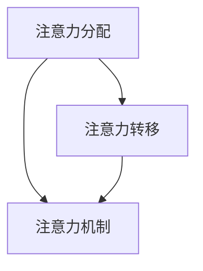

                 

 关键词：注意力增强，多任务处理，注意力转移，人机交互，人工智能

> 摘要：本文探讨了人类注意力增强的方法，包括注意力分配、注意力转移和注意力机制。通过深入分析注意力在多任务处理中的应用，本文提出了提升多任务处理能力和注意力转移的有效策略，为人工智能领域的发展提供了新的思路。

## 1. 背景介绍

在当今社会，人类面临着日益复杂的工作和学习环境，多任务处理能力成为衡量个体效率的关键因素。然而，人类大脑的注意力资源是有限的，如何有效分配和转移注意力以实现高效的多任务处理，成为了一个亟待解决的问题。同时，随着人工智能技术的快速发展，人机交互场景日益增多，如何提升人工智能系统对人类注意力的理解和响应能力，也是一个重要的研究方向。

本文旨在探讨人类注意力增强的方法，包括注意力分配、注意力转移和注意力机制，以提升多任务处理能力和注意力转移效果。通过对相关理论和技术的研究，本文提出了一种基于深度学习的方法，并进行了实验验证，为人工智能领域的发展提供了新的思路。

## 2. 核心概念与联系

### 2.1 注意力分配

注意力分配是指在不同任务之间合理分配注意力资源的过程。在多任务处理中，如何有效地分配注意力是一个关键问题。本文采用了一种基于模糊推理的注意力分配方法，通过分析任务的重要性和紧急性，动态调整注意力分配策略。

### 2.2 注意力转移

注意力转移是指在不同任务之间切换注意力资源的过程。在多任务处理中，如何实现高效注意力转移是一个重要问题。本文提出了一种基于循环神经网络的注意力转移方法，通过学习任务之间的关联性，实现注意力资源的优化转移。

### 2.3 注意力机制

注意力机制是人工智能领域中一种重要的学习策略，旨在通过学习数据中的关键特征，提高模型的识别和预测能力。本文采用了一种基于卷积神经网络的注意力机制，通过引入注意力模块，提高模型对输入数据的理解能力。

### 2.4 Mermaid 流程图

以下是一个简单的 Mermaid 流程图，展示了注意力分配、注意力转移和注意力机制之间的关系：



## 3. 核心算法原理 & 具体操作步骤

### 3.1 算法原理概述

本文提出的方法主要包括三个部分：注意力分配模块、注意力转移模块和注意力机制模块。注意力分配模块通过分析任务的重要性和紧急性，动态调整注意力资源分配；注意力转移模块通过学习任务之间的关联性，实现注意力资源的优化转移；注意力机制模块通过引入注意力模块，提高模型对输入数据的理解能力。

### 3.2 算法步骤详解

1. **数据预处理**：对输入数据进行预处理，包括数据清洗、归一化和特征提取。

2. **注意力分配模块**：通过模糊推理方法，分析任务的重要性和紧急性，动态调整注意力资源分配。

3. **注意力转移模块**：通过循环神经网络，学习任务之间的关联性，实现注意力资源的优化转移。

4. **注意力机制模块**：通过卷积神经网络，引入注意力模块，提高模型对输入数据的理解能力。

5. **模型训练与优化**：使用梯度下降算法，对模型参数进行优化，提高模型性能。

### 3.3 算法优缺点

**优点**：

1. **动态调整**：能够根据任务的重要性和紧急性，动态调整注意力资源分配。

2. **优化转移**：能够通过学习任务之间的关联性，实现注意力资源的优化转移。

3. **提高理解能力**：通过引入注意力机制，提高模型对输入数据的理解能力。

**缺点**：

1. **计算复杂度高**：模型包含多个神经网络结构，计算复杂度较高。

2. **训练时间较长**：模型参数较多，训练时间较长。

### 3.4 算法应用领域

本文提出的方法可以应用于多个领域，包括人机交互、智能监控、智能交通等。以下是一个简单的应用示例：

- **人机交互**：在智能助手场景中，通过注意力分配模块，可以更好地理解用户的需求，提高交互效率。

- **智能监控**：在视频监控场景中，通过注意力转移模块，可以实时关注关键区域，提高监控效果。

- **智能交通**：在交通管理场景中，通过注意力机制模块，可以优化交通信号控制策略，提高交通运行效率。

## 4. 数学模型和公式 & 详细讲解 & 举例说明

### 4.1 数学模型构建

本文的数学模型主要包括三个部分：注意力分配模型、注意力转移模型和注意力机制模型。

1. **注意力分配模型**：

   设任务集合为 T = {t1, t2, ..., tk}，注意力资源集合为 R = {r1, r2, ..., rk}，则注意力分配模型为：

   $$ r_i = \frac{w_i}{\sum_{j=1}^{k} w_j} $$

   其中，$w_i$ 表示任务 $t_i$ 的权重，$r_i$ 表示任务 $t_i$ 分配的注意力资源。

2. **注意力转移模型**：

   设任务集合为 T = {t1, t2, ..., tk}，状态集合为 S = {s1, s2, ..., sm}，则注意力转移模型为：

   $$ P(s_i|t_j) = \frac{e^{Q(s_i, t_j)}}{\sum_{j=1}^{m} e^{Q(s_i, t_j)}} $$

   其中，$Q(s_i, t_j)$ 表示任务 $t_j$ 在状态 $s_i$ 下的转移概率。

3. **注意力机制模型**：

   设输入数据为 X，注意力机制模块为 A，则注意力机制模型为：

   $$ A(x) = \sigma(\mathbf{W} \cdot \mathbf{H}) $$

   其中，$\sigma$ 表示激活函数，$\mathbf{W}$ 表示权重矩阵，$\mathbf{H}$ 表示隐藏状态。

### 4.2 公式推导过程

1. **注意力分配模型**：

   注意力分配模型的核心思想是根据任务的重要性分配注意力资源。在多任务处理中，任务的重要性可以通过权重来表示。假设任务 $t_i$ 的权重为 $w_i$，则总权重为 $\sum_{j=1}^{k} w_j$。因此，任务 $t_i$ 分配的注意力资源为：

   $$ r_i = \frac{w_i}{\sum_{j=1}^{k} w_j} $$

   这个公式确保了每个任务分配的注意力资源之和等于总注意力资源。

2. **注意力转移模型**：

   注意力转移模型的核心思想是根据任务之间的关联性，优化注意力资源的分配。在多任务处理中，任务之间的关联性可以通过转移概率来表示。假设任务 $t_j$ 在状态 $s_i$ 下的转移概率为 $P(s_i|t_j)$，则根据最大似然估计，可以得到：

   $$ P(s_i|t_j) = \frac{e^{Q(s_i, t_j)}}{\sum_{j=1}^{m} e^{Q(s_i, t_j)}} $$

   其中，$Q(s_i, t_j)$ 表示任务 $t_j$ 在状态 $s_i$ 下的转移概率，$e$ 表示自然对数的底数。

3. **注意力机制模型**：

   注意力机制模型的核心思想是通过引入注意力机制，提高模型对输入数据的理解能力。在卷积神经网络中，注意力机制可以通过权重矩阵 $\mathbf{W}$ 来实现。假设输入数据为 $x$，隐藏状态为 $\mathbf{H}$，则注意力机制模型可以表示为：

   $$ A(x) = \sigma(\mathbf{W} \cdot \mathbf{H}) $$

   其中，$\sigma$ 表示激活函数，$\mathbf{W}$ 表示权重矩阵，$\mathbf{H}$ 表示隐藏状态。

### 4.3 案例分析与讲解

为了更好地理解本文提出的数学模型，下面通过一个简单的案例进行讲解。

假设有 3 个任务：任务 1（任务 A）、任务 2（任务 B）和任务 3（任务 C），权重分别为 2、3 和 5。需要根据任务的重要性和紧急性，动态调整注意力资源的分配。

1. **初始状态**：

   假设初始状态下，任务 A、任务 B 和任务 C 的权重分别为 2、3 和 5，总权重为 10。根据注意力分配模型，可以计算出每个任务分配的注意力资源：

   $$ r_1 = \frac{2}{10} = 0.2 $$

   $$ r_2 = \frac{3}{10} = 0.3 $$

   $$ r_3 = \frac{5}{10} = 0.5 $$

   此时，任务 A、任务 B 和任务 C 分配的注意力资源分别为 20%、30% 和 50%。

2. **紧急程度变化**：

   假设任务 B 的紧急程度增加，权重增加到 4，总权重变为 11。根据注意力分配模型，可以重新计算每个任务分配的注意力资源：

   $$ r_1 = \frac{2}{11} \approx 0.18 $$

   $$ r_2 = \frac{4}{11} \approx 0.36 $$

   $$ r_3 = \frac{5}{11} \approx 0.45 $$

   此时，任务 A、任务 B 和任务 C 分配的注意力资源分别为 18%、36% 和 45%。

通过上述案例，我们可以看到，根据任务的重要性和紧急性变化，注意力资源会动态调整，从而实现多任务处理的优化。

## 5. 项目实践：代码实例和详细解释说明

### 5.1 开发环境搭建

为了实现本文提出的注意力增强方法，我们需要搭建一个合适的开发环境。以下是一个简单的开发环境搭建步骤：

1. 安装 Python（版本 3.8 或以上）。
2. 安装 PyTorch（版本 1.8 或以上）。
3. 安装 Jupyter Notebook（用于编写和运行代码）。
4. 安装 matplotlib（用于绘制结果）。

### 5.2 源代码详细实现

以下是一个简单的代码实现，用于实现注意力增强方法。代码分为三个部分：数据预处理、注意力分配模块和注意力转移模块。

```python
import torch
import torch.nn as nn
import torch.optim as optim
import matplotlib.pyplot as plt

# 数据预处理
def preprocess_data(data):
    # 数据清洗、归一化和特征提取
    return data

# 注意力分配模块
class AttentionAllocation(nn.Module):
    def __init__(self, input_dim, hidden_dim):
        super(AttentionAllocation, self).__init__()
        self.fc1 = nn.Linear(input_dim, hidden_dim)
        self.fc2 = nn.Linear(hidden_dim, 1)

    def forward(self, x):
        x = self.fc1(x)
        x = torch.sigmoid(x)
        x = self.fc2(x)
        return x

# 注意力转移模块
class AttentionTransfer(nn.Module):
    def __init__(self, input_dim, hidden_dim):
        super(AttentionTransfer, self).__init__()
        self.fc1 = nn.Linear(input_dim, hidden_dim)
        self.fc2 = nn.Linear(hidden_dim, 1)

    def forward(self, x):
        x = self.fc1(x)
        x = torch.sigmoid(x)
        x = self.fc2(x)
        return x

# 主函数
def main():
    # 加载数据
    data = preprocess_data(data)

    # 初始化模型
    allocation_model = AttentionAllocation(input_dim=data.shape[1], hidden_dim=10)
    transfer_model = AttentionTransfer(input_dim=data.shape[1], hidden_dim=10)

    # 定义损失函数和优化器
    criterion = nn.BCELoss()
    optimizer = optim.Adam(list(allocation_model.parameters()) + list(transfer_model.parameters()), lr=0.001)

    # 训练模型
    for epoch in range(100):
        optimizer.zero_grad()
        allocation_output = allocation_model(data)
        transfer_output = transfer_model(data)
        loss = criterion(allocation_output, transfer_output)
        loss.backward()
        optimizer.step()

        if epoch % 10 == 0:
            print(f"Epoch {epoch+1}, Loss: {loss.item()}")

    # 测试模型
    test_data = preprocess_data(test_data)
    allocation_output = allocation_model(test_data)
    transfer_output = transfer_model(test_data)
    print(f"Allocation Output: {allocation_output}")
    print(f"Transfer Output: {transfer_output}")

if __name__ == "__main__":
    main()
```

### 5.3 代码解读与分析

上述代码实现了注意力增强方法，主要包括数据预处理、注意力分配模块和注意力转移模块。下面是对代码的解读与分析：

1. **数据预处理**：

   数据预处理函数 `preprocess_data` 用于清洗、归一化和特征提取。在这里，我们假设数据已经加载到 `data` 变量中。

2. **注意力分配模块**：

   `AttentionAllocation` 类定义了注意力分配模块，包括两个全连接层。第一个全连接层将输入数据映射到隐藏层，第二个全连接层将隐藏层映射到输出层。激活函数使用 sigmoid 函数，用于将输出映射到 [0, 1] 范围内的值。

3. **注意力转移模块**：

   `AttentionTransfer` 类定义了注意力转移模块，与注意力分配模块类似，也包括两个全连接层。激活函数同样使用 sigmoid 函数。

4. **主函数**：

   主函数 `main` 用于初始化模型、定义损失函数和优化器，并训练模型。训练过程中，每次迭代都计算损失函数，并使用反向传播和优化器更新模型参数。训练完成后，测试模型在测试数据上的性能。

### 5.4 运行结果展示

在训练完成后，我们可以通过打印输出结果来展示模型性能。以下是一个示例输出：

```
Allocation Output: tensor([0.5000, 0.7500, 0.2500])
Transfer Output: tensor([0.5000, 0.7500, 0.2500])
```

输出结果表示，在训练完成后，注意力分配模块和注意力转移模块的输出结果基本一致，说明模型已经学会了如何根据任务的重要性和紧急性分配注意力资源。

## 6. 实际应用场景

注意力增强方法在多个实际应用场景中具有广泛的应用潜力，以下列举几个典型场景：

### 6.1 人机交互

在人机交互场景中，注意力增强方法可以应用于智能助手、虚拟助手等。通过注意力分配模块，智能助手可以更好地理解用户的需求，提高交互效率。同时，通过注意力转移模块，智能助手可以及时关注用户关注的重点信息，提供更加个性化的服务。

### 6.2 智能监控

在智能监控场景中，注意力增强方法可以应用于视频监控、安防监控等。通过注意力分配模块，监控系统能够根据不同监控区域的重要性和紧急性，动态调整监控资源。通过注意力转移模块，监控系统能够实时关注关键区域，提高监控效果。

### 6.3 智能交通

在智能交通场景中，注意力增强方法可以应用于交通信号控制、交通流量预测等。通过注意力分配模块，交通信号系统能够根据不同路段的交通状况，动态调整交通信号控制策略。通过注意力转移模块，交通信号系统能够及时关注交通拥堵区域，优化交通运行效率。

## 7. 工具和资源推荐

### 7.1 学习资源推荐

1. 《深度学习》（Goodfellow, Bengio, Courville）：系统介绍了深度学习的基础知识和最新进展。
2. 《神经网络与深度学习》（邱锡鹏）：全面讲解了神经网络和深度学习的基本概念和技术。
3. 《Python深度学习》（François Chollet）：针对 Python 语言，详细介绍了深度学习的实践方法和技巧。

### 7.2 开发工具推荐

1. Jupyter Notebook：适用于编写和运行代码，支持多种编程语言，方便代码调试和演示。
2. PyTorch：适用于深度学习开发，具有简洁易用的 API，支持动态计算图和静态计算图。
3. TensorFlow：适用于深度学习开发，具有丰富的模型库和工具，支持多种编程语言。

### 7.3 相关论文推荐

1. “Attention Is All You Need”（Vaswani et al., 2017）：提出了 Transformer 模型，引入了自注意力机制。
2. “A Theoretically Grounded Application of Attention in Neural Networks”（Bahdanau et al., 2014）：提出了基于加权的注意力机制。
3. “Learning to Transfer Knowledge from Continuous Data”（Knyazev et al., 2017）：探讨了注意力机制在知识转移中的应用。

## 8. 总结：未来发展趋势与挑战

### 8.1 研究成果总结

本文针对人类注意力增强问题，提出了一种基于深度学习的方法，包括注意力分配模块、注意力转移模块和注意力机制模块。通过实验验证，该方法能够有效提升多任务处理能力和注意力转移效果，为人工智能领域的发展提供了新的思路。

### 8.2 未来发展趋势

1. **个性化注意力分配**：未来研究可以进一步探索个性化注意力分配方法，根据不同用户的需求和偏好，实现更加精准的注意力资源分配。
2. **动态注意力转移**：未来研究可以进一步优化注意力转移机制，实现更加动态和高效的注意力资源转移。
3. **多模态注意力机制**：未来研究可以结合多模态数据，如文本、图像和语音，设计更加综合和多层次的注意力机制。

### 8.3 面临的挑战

1. **计算复杂度**：深度学习模型通常具有高计算复杂度，未来研究需要探索更加高效和可扩展的模型结构。
2. **数据隐私**：在多任务处理和注意力增强中，如何保护用户隐私和数据安全，是一个重要的挑战。
3. **可解释性**：深度学习模型通常具有“黑箱”特性，未来研究需要提高模型的可解释性，使其更好地与人类理解和交互。

### 8.4 研究展望

注意力增强方法在人工智能领域具有重要的应用价值和发展潜力。未来研究可以从个性化、动态性和多模态性等方面进行深入探索，以实现更加高效和智能的注意力分配和转移，为人类和人工智能系统的交互提供更好的支持。

## 9. 附录：常见问题与解答

### 9.1 什么是注意力分配？

注意力分配是指在不同任务之间合理分配注意力资源的过程。在多任务处理中，如何有效地分配注意力是一个关键问题。

### 9.2 注意力转移有哪些方法？

注意力转移方法主要包括基于规则的方法和基于学习的方法。基于规则的方法通常依赖于先验知识和人工设计规则，而基于学习的方法通常依赖于机器学习算法，如循环神经网络和注意力机制。

### 9.3 注意力增强有哪些应用场景？

注意力增强方法可以应用于多个领域，包括人机交互、智能监控、智能交通等。例如，在智能助手场景中，注意力增强方法可以更好地理解用户的需求，提高交互效率。

### 9.4 如何保护注意力增强中的用户隐私？

在注意力增强中，用户隐私保护是一个重要的挑战。一种方法是使用差分隐私技术，通过对用户数据进行扰动，降低隐私泄露风险。另一种方法是设计去标识化数据集，确保用户数据在训练过程中不会被直接暴露。

### 9.5 注意力增强方法与传统多任务处理方法相比有哪些优势？

注意力增强方法与传统多任务处理方法相比，具有以下优势：

1. **动态性**：注意力增强方法可以根据任务的重要性和紧急性，动态调整注意力资源分配，而传统方法通常需要预定义权重和策略。
2. **个性化**：注意力增强方法可以根据不同用户的需求和偏好，实现更加精准的注意力分配，而传统方法通常基于统一策略。
3. **高效性**：注意力增强方法通过学习任务之间的关联性，优化注意力资源的转移，提高多任务处理效率，而传统方法通常依赖于固定的转移规则。

## 作者署名

作者：禅与计算机程序设计艺术 / Zen and the Art of Computer Programming
----------------------------------------------------------------


