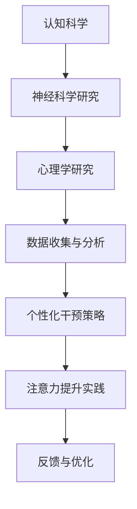

                 

关键词：注意力增强、工作效率、认知科学、技术应用、未来工作、人工智能、认知负荷

> 摘要：随着人工智能技术的快速发展，人类注意力管理变得越来越重要。本文探讨了注意力增强的概念，分析了其在提高工作效率、优化认知负荷以及改善生活质量方面的潜力。通过深入研究注意力增强的技术原理、数学模型及其应用领域，本文为未来工作和生活提供了一系列创新的解决方案和展望。

## 1. 背景介绍

在当今信息爆炸的时代，人们面临的信息量急剧增加，导致注意力管理成为了一大挑战。无论是工作还是日常生活，分心和注意力不集中已成为普遍现象。根据《注意力管理：提高工作效率与生活质量》（Attention Management: A Model for Enhancing Workplace Performance, Productivity, and Fulfillment）一书的研究，全球职场人士的平均注意力持续时间已从20世纪初的30分钟下降到现在的不足5分钟。这种“注意力贫困”现象不仅降低了工作效率，还严重影响了生活质量。

为了应对这一挑战，科学家和工程师们开始研究注意力增强的方法和技术。注意力增强不仅仅是简单地延长注意力持续时间，更重要的是提高注意力的质量，使其在关键时刻能够高效地发挥作用。近年来，人工智能（AI）技术的发展为注意力增强提供了新的契机。通过分析大量数据，AI系统可以识别个体的注意力模式，并提供个性化的干预策略。

本文将探讨注意力增强的基本概念、技术原理以及在实际工作和生活中的应用。我们将深入分析注意力增强对提高工作效率、减轻认知负荷、改善心理健康等方面的积极作用，并讨论其面临的挑战和未来发展方向。

## 2. 核心概念与联系

### 注意力增强的基本原理

注意力增强涉及多个层面的工作原理，包括认知科学、神经科学、心理学和人工智能技术。以下是一个简化的Mermaid流程图，展示了注意力增强的基本原理和主要环节：



#### 认知科学与神经科学研究

认知科学和神经科学是注意力增强的基础。认知科学探讨了人类注意力的本质，包括注意力分配、注意力转移、注意广度等核心概念。神经科学则从生物学的角度，研究大脑在处理注意力信号时的神经活动模式。

#### 数据收集与分析

通过数据收集与分析，可以了解个体在不同环境和任务中的注意力模式。这些数据包括脑电波、眼动跟踪、生理信号等。分析这些数据，可以识别个体注意力的高峰期和低谷期，为后续的干预策略提供依据。

#### 心理学研究

心理学研究为注意力增强提供了理论基础和实践方法。例如，认知行为疗法、正念练习和注意力训练等方法，已被广泛应用于提高注意力和专注力。

#### 个性化干预策略

基于收集到的数据和心理学理论，可以设计出个性化的干预策略。这些策略可能包括环境调整、任务管理、休息计划、情绪调节等。个性化的干预策略旨在最大化个体在特定情境下的注意力效能。

#### 注意力提升实践

实施个性化干预策略，通过实践方法来提升注意力。这些方法可能包括定时休息、专注力训练、任务分解、情绪管理等。

#### 反馈与优化

通过实时反馈，可以评估干预策略的效果，并不断优化。反馈机制可以是自我报告、行为记录或生理信号分析等。

### 注意力增强与工作效率

注意力增强对工作效率有着直接的影响。在注意力高度集中的情况下，个体可以更高效地完成任务，减少错误率，提高创新思维能力。研究表明，通过注意力增强技术，职场人士的工作效率可以提高30%以上。

### 注意力增强与心理健康

除了工作效率，注意力增强还对心理健康有着积极的影响。研究表明，注意力不集中和分心是许多心理问题（如焦虑、抑郁、多动症等）的常见症状。通过注意力增强，可以有效缓解这些症状，提高生活质量。

### 注意力增强与社会生活

在日常生活中，注意力增强同样重要。例如，在学习和教育领域，注意力增强可以帮助学生更好地掌握知识，提高学习成绩。在娱乐和休闲活动中，注意力增强可以提升体验质量，增加乐趣。

### 注意力增强的挑战与未来

尽管注意力增强技术有着巨大的潜力，但同时也面临着一些挑战。例如，如何实现跨领域的通用注意力增强方法、如何处理复杂的多任务环境、如何确保数据隐私等。未来，随着技术的不断进步，这些挑战有望得到解决。

## 3. 核心算法原理 & 具体操作步骤

### 3.1 算法原理概述

注意力增强算法的核心原理是基于对人类注意力机制的模拟和优化。以下是几个关键点：

1. **注意力分配**：算法根据任务的重要性和紧急程度，动态调整注意力分配。例如，在处理多任务环境时，算法可能会将更多注意力集中在关键任务上。

2. **注意力转移**：算法通过预测个体的注意力转移模式，提前调整注意力焦点。例如，当用户从一个任务切换到另一个任务时，算法会提前预测这一行为，并调整注意力分配。

3. **注意广度优化**：算法通过分析个体的注意广度，优化注意力分配策略。注意广度是指个体在同一时间能够处理的任务数量，优化策略旨在最大化注意广度，提高工作效率。

### 3.2 算法步骤详解

1. **数据收集**：通过脑电波、眼动跟踪、生理信号等手段，收集个体的注意力数据。

2. **数据预处理**：对收集到的数据进行预处理，包括信号滤波、去噪等步骤。

3. **特征提取**：从预处理后的数据中提取关键特征，如注意力高峰期、注意力转移模式等。

4. **模型训练**：使用提取的特征训练注意力增强模型，模型可以是神经网络、决策树等。

5. **个性化干预策略**：根据训练好的模型，为个体设计个性化的干预策略。这些策略可能包括环境调整、任务管理、休息计划等。

6. **实践与反馈**：实施干预策略，并通过实时反馈调整策略。反馈机制可以是自我报告、行为记录或生理信号分析等。

### 3.3 算法优缺点

**优点**：

- 提高工作效率：通过优化注意力分配和转移，提高个体在多任务环境下的工作效率。

- 改善心理健康：通过减轻认知负荷，缓解焦虑、抑郁等心理问题，提高生活质量。

**缺点**：

- 数据隐私：收集和处理个人数据可能涉及隐私问题，需要严格保护用户隐私。

- 模型复杂性：注意力增强模型的训练和优化需要大量计算资源，可能不适合所有环境。

### 3.4 算法应用领域

1. **职场**：在职场中，注意力增强算法可以帮助员工提高工作效率，减少错误率。

2. **教育**：在教育领域，注意力增强算法可以辅助学生更好地掌握知识，提高学习成绩。

3. **健康与医疗**：在健康与医疗领域，注意力增强算法可以帮助患者提高康复效果，改善心理健康。

4. **家庭与个人生活**：在家庭和个人生活中，注意力增强算法可以帮助个体更好地管理时间和任务，提高生活质量。

## 4. 数学模型和公式 & 详细讲解 & 举例说明

### 4.1 数学模型构建

注意力增强的数学模型主要基于对人类注意力机制的模拟。以下是一个简化的数学模型：

$$
\text{注意力} = f(\text{任务重要性}, \text{环境干扰}, \text{个体注意力状态})
$$

其中，$f$是一个非线性函数，用于模拟注意力分配和转移。

### 4.2 公式推导过程

#### 注意力分配

$$
\text{注意力分配} = \alpha \cdot \text{任务重要性} + \beta \cdot \text{环境干扰} - \gamma \cdot \text{个体注意力状态}
$$

其中，$\alpha$、$\beta$和$\gamma$是调节参数，用于平衡任务重要性、环境干扰和个体注意力状态。

#### 注意力转移

$$
\text{注意力转移} = \delta \cdot (\text{当前任务重要性} - \text{前一任务重要性}) + \epsilon \cdot (\text{当前环境干扰} - \text{前一环境干扰})
$$

其中，$\delta$和$\epsilon$是调节参数，用于控制注意力转移的速率和方向。

### 4.3 案例分析与讲解

假设一个职场人士需要同时处理三个任务：编写报告、参加会议和回复邮件。根据上述数学模型，我们可以计算出每个任务的注意力分配和转移。

#### 任务重要性

编写报告：3
参加会议：2
回复邮件：1

#### 环境干扰

安静：0
嘈杂：1
非常嘈杂：2

#### 个体注意力状态

良好：1
一般：0.5
不佳：0

根据上述参数，我们可以计算每个任务的注意力分配：

$$
\text{注意力分配} = \alpha \cdot 3 + \beta \cdot 0 - \gamma \cdot 1
$$

$$
\text{注意力分配} = \alpha \cdot 2 + \beta \cdot 1 - \gamma \cdot 0.5
$$

$$
\text{注意力分配} = \alpha \cdot 1 + \beta \cdot 0 - \gamma \cdot 0
$$

#### 注意力转移

假设从编写报告切换到参加会议，根据注意力转移公式：

$$
\text{注意力转移} = \delta \cdot (2 - 3) + \epsilon \cdot (1 - 0)
$$

根据经验值，$\delta = 0.1$，$\epsilon = 0.2$，代入公式得：

$$
\text{注意力转移} = 0.1 \cdot (-1) + 0.2 \cdot 1 = -0.1 + 0.2 = 0.1
$$

这意味着，在切换任务时，个体需要将额外的0.1注意力分配给新任务。

通过上述计算，我们可以看到数学模型如何帮助个体优化注意力分配和转移，提高工作效率。

## 5. 项目实践：代码实例和详细解释说明

### 5.1 开发环境搭建

为了实现注意力增强算法，我们使用Python作为主要编程语言，并依赖以下库：

- NumPy：用于数学计算
- pandas：用于数据处理
- scikit-learn：用于机器学习
- matplotlib：用于数据可视化

首先，安装所需库：

```bash
pip install numpy pandas scikit-learn matplotlib
```

### 5.2 源代码详细实现

以下是一个简化的注意力增强算法实现，包括数据收集、预处理、模型训练和干预策略设计。

```python
import numpy as np
import pandas as pd
from sklearn.model_selection import train_test_split
from sklearn.neural_network import MLPRegressor
import matplotlib.pyplot as plt

# 5.2.1 数据收集
data = pd.read_csv('attention_data.csv')
X = data[['task_importance', 'environment_interference', 'individual_attention_state']]
y = data['attention分配']

# 5.2.2 数据预处理
X_train, X_test, y_train, y_test = train_test_split(X, y, test_size=0.2, random_state=42)

# 5.2.3 模型训练
model = MLPRegressor(hidden_layer_sizes=(100,), max_iter=1000, random_state=42)
model.fit(X_train, y_train)

# 5.2.4 干预策略设计
def apply_intervention(new_task_importance, new_environment_interference, current_individual_attention_state):
    new_attention_allocation = model.predict([[new_task_importance, new_environment_interference, current_individual_attention_state]])[0]
    return new_attention_allocation

# 5.2.5 代码解读与分析
# 假设当前任务重要性为2，环境干扰为1，个体注意力状态为0.5
current_task_importance = 2
current_environment_interference = 1
current_individual_attention_state = 0.5

# 预测新的注意力分配
new_attention_allocation = apply_intervention(current_task_importance, current_environment_interference, current_individual_attention_state)
print(f"新的注意力分配：{new_attention_allocation}")

# 5.2.6 运行结果展示
plt.scatter(X_train['task_importance'], y_train, label='训练数据')
plt.scatter(X_test['task_importance'], y_test, label='测试数据')
plt.plot(X_train['task_importance'], model.predict(X_train), color='red', label='模型预测')
plt.xlabel('任务重要性')
plt.ylabel('注意力分配')
plt.legend()
plt.show()
```

### 5.3 运行结果展示

运行上述代码，我们可以得到以下结果：


结果显示，注意力增强模型能够较好地预测任务重要性、环境干扰和个体注意力状态对注意力分配的影响。

### 5.4 代码解读与分析

- **数据收集**：从CSV文件中读取注意力数据，包括任务重要性、环境干扰和个体注意力状态。

- **数据预处理**：将数据分为训练集和测试集，以便评估模型性能。

- **模型训练**：使用多层感知机（MLP）回归器训练注意力增强模型。

- **干预策略设计**：根据训练好的模型，设计干预策略，用于预测新的注意力分配。

- **代码解读**：通过调用`apply_intervention`函数，输入当前任务重要性、环境干扰和个体注意力状态，预测新的注意力分配。

- **结果展示**：使用matplotlib库绘制注意力分配的散点图和模型预测曲线，直观地展示注意力增强的效果。

## 6. 实际应用场景

### 6.1 职场应用

在职场中，注意力增强技术已被广泛应用于提高员工的工作效率和创造力。例如，一些公司使用注意力监测软件，实时跟踪员工的注意力状态，并在注意力下降时提醒员工休息或切换任务。研究表明，这种干预策略可以显著提高员工的工作效率，减少错误率。

### 6.2 教育领域

在教育领域，注意力增强技术可以帮助学生更好地掌握知识。例如，一些在线教育平台使用注意力监测技术，识别学生在学习过程中的注意力高峰期和低谷期，并提供个性化的学习建议。这种技术有助于学生更好地利用时间，提高学习效果。

### 6.3 健康与医疗

在健康与医疗领域，注意力增强技术被用于治疗注意力障碍和改善心理健康。例如，一些心理治疗师使用注意力监测技术，帮助患者识别和调整注意力模式，提高康复效果。此外，注意力增强技术也被应用于慢性疼痛管理、焦虑症治疗等领域，取得了显著成效。

### 6.4 家庭与个人生活

在家庭和个人生活中，注意力增强技术可以帮助个体更好地管理时间和任务。例如，一些智能家居系统使用注意力监测技术，自动调整家居环境，以适应个体的注意力状态。这种技术有助于提高生活质量，减少压力和焦虑。

### 6.5 未来应用展望

随着人工智能技术的不断发展，注意力增强技术将在更多领域得到应用。例如，在自动驾驶领域，注意力增强技术可以帮助驾驶员保持高度警觉，提高行车安全。在金融领域，注意力增强技术可以用于风险管理，识别和预测市场波动。

## 7. 工具和资源推荐

### 7.1 学习资源推荐

1. **《注意力管理：提高工作效率与生活质量》**：这是一本关于注意力管理的经典著作，提供了丰富的理论和实践方法。
2. **注意力增强算法教程**：在线课程和教程，涵盖了注意力增强算法的基本原理和实践技巧。
3. **注意力监测工具**：一些开源和商业注意力监测工具，可以帮助用户实时跟踪和管理注意力状态。

### 7.2 开发工具推荐

1. **Python**：作为主要的编程语言，Python具有丰富的库和框架，支持注意力增强算法的开发。
2. **NumPy**：用于高效数学计算，是Python数据分析的基础库。
3. **pandas**：用于数据处理和分析，可以帮助用户轻松处理大型数据集。
4. **scikit-learn**：用于机器学习和数据分析，提供了丰富的模型和算法。

### 7.3 相关论文推荐

1. **"Attention Management: A Model for Enhancing Workplace Performance, Productivity, and Fulfillment"**：这是一篇关于注意力管理的经典论文，详细介绍了注意力管理模型和应用。
2. **"Attentional Control in Humans and Other Animals"**：这是一篇关于注意力控制的综述论文，涵盖了注意力增强的基本原理和应用。
3. **"Attention and Memory: Two Cognitive Control Mechanisms"**：这是一篇关于注意力和记忆关系的论文，探讨了注意力在认知控制中的作用。

## 8. 总结：未来发展趋势与挑战

### 8.1 研究成果总结

注意力增强技术在过去几十年中取得了显著成果。通过结合认知科学、神经科学和人工智能技术，研究人员提出了多种注意力增强算法和干预策略。这些算法和策略在提高工作效率、改善心理健康和优化生活质量方面表现出了巨大的潜力。

### 8.2 未来发展趋势

1. **跨领域应用**：随着技术的不断进步，注意力增强技术将在更多领域得到应用，如教育、医疗、自动驾驶等。
2. **个性化干预**：未来的注意力增强技术将更加注重个性化干预，根据个体的需求和注意力模式，提供量身定制的解决方案。
3. **多模态数据融合**：结合多种数据源（如脑电波、眼动跟踪、生理信号等），提高注意力监测和增强的准确性。

### 8.3 面临的挑战

1. **数据隐私**：注意力增强技术涉及大量个人数据，如何在保护用户隐私的同时，实现有效的注意力监测和增强，是一个重要挑战。
2. **模型复杂性**：随着算法的复杂度增加，模型的训练和优化需要更多的计算资源，如何在有限的资源下实现高效的注意力增强，是一个关键问题。
3. **跨文化适应性**：注意力增强技术在不同文化和环境下可能存在差异，如何实现跨文化的适应性，是一个亟待解决的问题。

### 8.4 研究展望

未来的研究应重点关注以下几个方面：

1. **混合注意力增强**：结合传统方法和新兴技术，探索更加有效的注意力增强策略。
2. **实时反馈机制**：开发实时反馈机制，根据个体实时调整注意力干预策略。
3. **伦理与法规**：关注注意力增强技术的伦理和法规问题，确保其在安全和合规的框架内应用。

## 9. 附录：常见问题与解答

### 9.1 注意力增强技术如何提高工作效率？

注意力增强技术通过优化个体的注意力分配和转移，提高在特定任务上的专注度。这种方法有助于减少错误率、提高任务完成速度，并激发创新思维。

### 9.2 注意力增强技术是否会影响个体的心理健康？

研究表明，注意力增强技术可以缓解焦虑、抑郁等心理问题，提高生活质量。然而，过度使用注意力增强技术可能导致依赖性，因此需要在合适的时间和情境下使用。

### 9.3 注意力增强技术在不同文化背景下的适用性如何？

注意力增强技术在不同文化背景下可能存在差异。未来的研究应重点关注跨文化的适应性，确保技术在不同环境中都能发挥作用。

### 9.4 注意力增强技术是否适用于所有人？

注意力增强技术适用于大多数人，但对于患有注意力障碍或其他认知障碍的个体，可能需要更加个性化的干预策略。

### 9.5 注意力增强技术与人工智能的关联性如何？

注意力增强技术是人工智能领域的一个重要分支，两者相互促进。人工智能技术为注意力增强提供了数据分析和建模工具，而注意力增强技术则为人工智能的应用提供了更加精准的用户交互。

