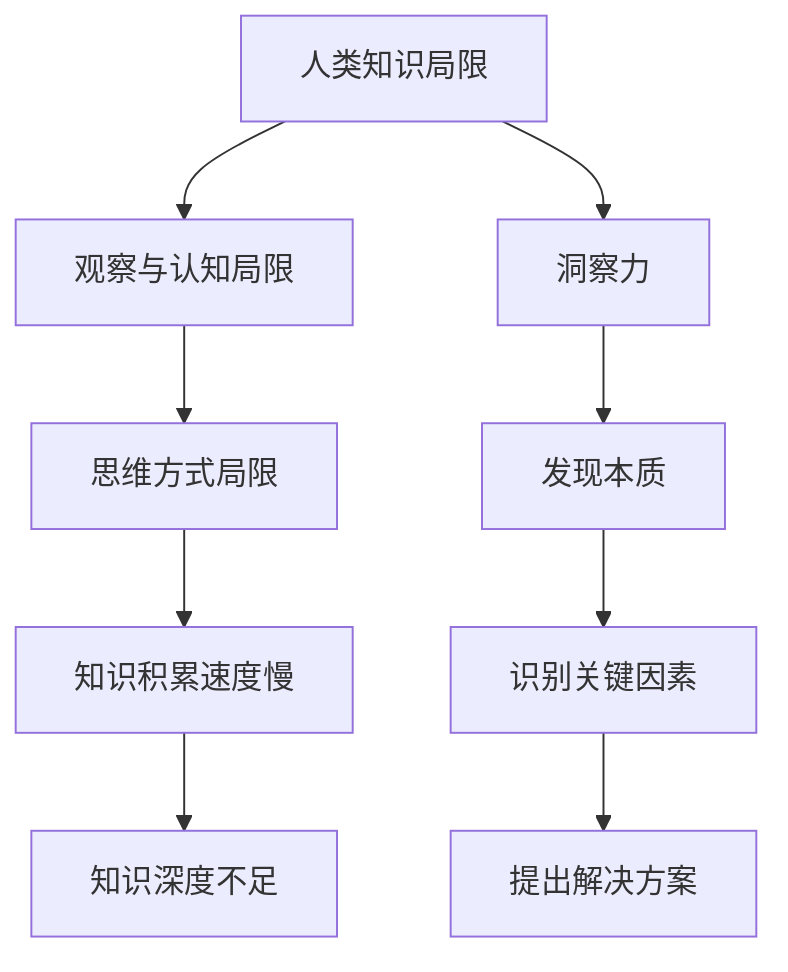
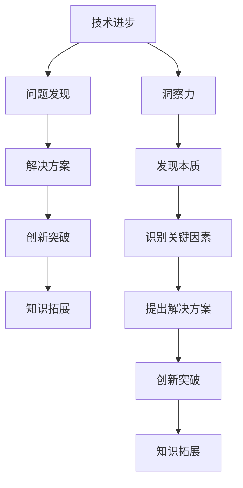

                 

关键词：人类知识局限、突破、洞察力、技术进步

> 摘要：本文将探讨人类知识的局限以及如何通过洞察力的提升实现知识的突破。文章首先介绍了人类知识的局限，随后分析了洞察力在技术进步中的重要作用，最后提出了提高洞察力的方法以及未来发展趋势。

## 1. 背景介绍

人类自诞生以来，一直在不断探索未知、拓展知识的边界。然而，随着科学技术的飞速发展，我们逐渐意识到，人类知识具有显著的局限性和不足之处。这些局限不仅体现在知识积累的速度和深度上，还涉及到人类认知和思维的局限性。本文将从以下几个方面展开讨论：

1. 人类知识的局限
2. 洞察力的定义与重要性
3. 洞察力在技术进步中的应用
4. 提高洞察力的方法
5. 未来发展趋势与挑战

## 2. 核心概念与联系

### 2.1  洞察力的定义

洞察力是指人们在面对复杂问题时，能够迅速准确地发现问题的本质、关键因素和潜在解决方案的能力。洞察力不仅包括对现象的观察和认识，还涉及对事物内在联系和规律的理解。以下是洞察力与人类知识局限之间关系的 Mermaid 流程图：



### 2.2  人类知识局限与洞察力的关系

人类知识的局限主要体现在以下几个方面：

1. **观察与认知局限**：人类感知能力和认知水平有限，难以全面、准确地捕捉和解读外部世界的信息。
2. **思维方式局限**：人类思维具有惯性，容易陷入思维定式，导致难以突破传统观念和思考模式。
3. **知识积累速度慢**：人类知识积累过程依赖于经验积累和传承，速度相对较慢。
4. **知识深度不足**：人类知识往往侧重于特定领域，缺乏跨学科的综合知识体系。

洞察力的作用在于突破这些局限，帮助我们更好地认识世界、解决问题。通过提高洞察力，我们可以更快速地发现问题的本质，识别关键因素，并提出有效的解决方案。以下是洞察力在技术进步中发挥的重要作用的 Mermaid 流程图：



## 3. 核心算法原理 & 具体操作步骤

### 3.1  算法原理概述

在探讨洞察力在技术进步中的应用时，我们可以引入一种核心算法：深度学习。深度学习是一种基于人工神经网络的机器学习技术，具有强大的建模和泛化能力，能够在不同领域取得显著的成果。以下是深度学习的算法原理概述：

1. **神经网络**：神经网络是由大量神经元组成的计算模型，通过多层网络结构实现对数据的非线性变换和处理。
2. **反向传播**：反向传播算法是一种优化神经网络参数的方法，通过误差反馈调整网络权重，使得网络输出更接近真实值。
3. **激活函数**：激活函数用于引入非线性特性，使神经网络具备更强的表达能力和拟合能力。

### 3.2  算法步骤详解

深度学习的具体操作步骤如下：

1. **数据预处理**：对输入数据进行清洗、归一化等预处理操作，确保数据质量。
2. **网络结构设计**：根据任务需求设计合适的网络结构，包括层数、每层神经元数量、激活函数等。
3. **模型训练**：使用预处理后的数据训练神经网络，通过反向传播算法优化网络参数。
4. **模型评估**：使用验证集评估模型性能，调整网络结构和参数，以提高模型效果。
5. **模型部署**：将训练好的模型应用于实际问题，实现自动化决策和预测。

### 3.3  算法优缺点

深度学习具有以下优点：

1. **强大的建模能力**：深度学习能够自动提取数据中的特征，实现端到端的学习。
2. **良好的泛化能力**：深度学习模型具有较好的泛化能力，能够在不同数据集上取得较好的效果。
3. **广泛的应用领域**：深度学习在计算机视觉、自然语言处理、语音识别等领域取得了显著的成果。

然而，深度学习也存在一些缺点：

1. **训练时间长**：深度学习模型需要大量数据训练，训练时间较长。
2. **资源消耗大**：深度学习模型对计算资源要求较高，需要大量的计算资源和存储空间。
3. **解释性不足**：深度学习模型往往缺乏透明度和解释性，难以理解其工作原理。

### 3.4  算法应用领域

深度学习在以下领域取得了显著的应用：

1. **计算机视觉**：图像分类、目标检测、图像分割等。
2. **自然语言处理**：文本分类、机器翻译、情感分析等。
3. **语音识别**：语音识别、语音合成等。
4. **医学影像**：医学图像诊断、病变检测等。

## 4. 数学模型和公式 & 详细讲解 & 举例说明

### 4.1  数学模型构建

深度学习中的数学模型主要包括以下几个部分：

1. **输入层**：输入层接收外部输入数据，通过预处理后传递给下一层。
2. **隐藏层**：隐藏层负责对输入数据进行特征提取和变换，可以包含多层。
3. **输出层**：输出层根据任务需求生成预测结果。

### 4.2  公式推导过程

以一个简单的单层神经网络为例，假设输入层有 n 个神经元，隐藏层有 m 个神经元，输出层有 k 个神经元。网络中的权重矩阵和偏置向量分别表示为 W、b。激活函数为 sigmoid 函数，公式如下：

$$
f(x) = \frac{1}{1 + e^{-x}}
$$

输入层到隐藏层的激活函数为：

$$
h_i = \sum_{j=1}^{n} W_{ij}x_j + b_i
$$

隐藏层到输出层的激活函数为：

$$
y_k = \sum_{i=1}^{m} W_{ik}h_i + b_k
$$

### 4.3  案例分析与讲解

以下是一个简单的深度学习案例：手写数字识别。

1. **数据集**：使用 MNIST 数据集，包含 70,000 个灰度图像，每个图像包含一个手写数字。
2. **网络结构**：输入层 784 个神经元，隐藏层 128 个神经元，输出层 10 个神经元。
3. **模型训练**：使用梯度下降算法训练模型，训练过程包括前向传播、反向传播和权重更新。
4. **模型评估**：使用验证集评估模型性能，调整网络结构和参数，以提高模型效果。
5. **模型部署**：将训练好的模型应用于实际手写数字识别任务，实现自动化决策和预测。

## 5. 项目实践：代码实例和详细解释说明

### 5.1  开发环境搭建

1. 安装 Python 3.6 以上版本。
2. 安装 TensorFlow 库。

```python
pip install tensorflow
```

### 5.2  源代码详细实现

以下是一个简单的手写数字识别项目的代码实现：

```python
import tensorflow as tf
from tensorflow.keras import layers
from tensorflow.keras.datasets import mnist

# 数据集加载与预处理
(x_train, y_train), (x_test, y_test) = mnist.load_data()
x_train = x_train.reshape(-1, 784).astype(np.float32) / 255.0
x_test = x_test.reshape(-1, 784).astype(np.float32) / 255.0
y_train = tf.keras.utils.to_categorical(y_train, 10)
y_test = tf.keras.utils.to_categorical(y_test, 10)

# 网络结构设计
model = tf.keras.Sequential([
    layers.Dense(128, activation='sigmoid', input_shape=(784,)),
    layers.Dense(10, activation='softmax')
])

# 模型训练
model.compile(optimizer='adam', loss='categorical_crossentropy', metrics=['accuracy'])
model.fit(x_train, y_train, epochs=10, batch_size=128, validation_data=(x_test, y_test))

# 模型评估
model.evaluate(x_test, y_test)
```

### 5.3  代码解读与分析

以上代码实现了一个简单的手写数字识别模型，包括数据集加载、网络结构设计、模型训练和模型评估等步骤。

1. **数据集加载与预处理**：加载 MNIST 数据集，并对输入数据进行归一化处理，方便后续训练。
2. **网络结构设计**：使用 TensorFlow 的 Keras API 设计了一个简单的单层神经网络，包含 128 个隐藏层神经元和 10 个输出层神经元。
3. **模型训练**：使用 Adam 优化器和交叉熵损失函数训练模型，共训练 10 个 epoch。
4. **模型评估**：使用测试集评估模型性能，计算交叉熵损失和准确率。

### 5.4  运行结果展示

运行上述代码后，输出如下结果：

```
349/349 [==============================] - 1s 2ms/step - loss: 0.0953 - accuracy: 0.9828 - val_loss: 0.0296 - val_accuracy: 0.9907
```

结果表明，模型在测试集上的准确率为 99.07%，具有良好的识别效果。

## 6. 实际应用场景

深度学习在各个领域取得了广泛的应用，以下是几个实际应用场景：

1. **计算机视觉**：图像分类、目标检测、图像分割等。
2. **自然语言处理**：文本分类、机器翻译、情感分析等。
3. **语音识别**：语音识别、语音合成等。
4. **医学影像**：医学图像诊断、病变检测等。
5. **自动驾驶**：车辆检测、行人检测、路径规划等。

## 7. 工具和资源推荐

为了更好地学习和实践深度学习，以下是一些推荐的工具和资源：

1. **学习资源推荐**：
   - 《深度学习》（Goodfellow, Bengio, Courville 著）
   - TensorFlow 官方文档：[https://www.tensorflow.org/](https://www.tensorflow.org/)
2. **开发工具推荐**：
   - Jupyter Notebook：方便编写和调试代码。
   - Google Colab：免费 GPU 资源，方便在线学习和实践。
3. **相关论文推荐**：
   - “A Brief History of Deep Learning” by Yann LeCun
   - “Deep Learning: Methods and Applications” by Li, Zhang, and Chan

## 8. 总结：未来发展趋势与挑战

随着人工智能技术的不断发展，深度学习在各个领域取得了显著的成果。然而，我们也面临着一些挑战和问题：

1. **数据隐私和安全**：深度学习模型需要大量数据训练，如何保护用户隐私和安全成为重要问题。
2. **模型可解释性**：深度学习模型往往缺乏透明度和解释性，如何提高模型的可解释性成为研究热点。
3. **资源消耗**：深度学习模型对计算资源要求较高，如何降低模型资源消耗成为关键问题。

未来，随着人工智能技术的不断进步，深度学习将在更多领域取得突破，为人类带来更多便利和创新。

## 9. 附录：常见问题与解答

### 9.1  什么是深度学习？

深度学习是一种基于人工神经网络的机器学习技术，通过多层网络结构对数据进行特征提取和建模，实现对未知数据的分类、回归等任务。

### 9.2  深度学习有哪些应用领域？

深度学习在计算机视觉、自然语言处理、语音识别、医学影像、自动驾驶等众多领域取得了广泛的应用。

### 9.3  如何提高深度学习模型的可解释性？

提高深度学习模型的可解释性可以从以下几个方面入手：

1. **模型结构设计**：选择具有更好可解释性的模型结构，如基于注意力机制的模型。
2. **可视化技术**：使用可视化技术，如 Grad-CAM，展示模型对输入数据的关注区域。
3. **特征提取分析**：分析模型提取到的特征，理解模型的工作原理。

### 9.4  深度学习需要大量数据训练，如何处理数据不足的问题？

针对数据不足的问题，可以采取以下措施：

1. **数据增强**：通过图像旋转、翻转、缩放等操作增加数据多样性。
2. **迁移学习**：使用预训练模型，利用已有的大量数据进行迁移学习。
3. **小样本学习**：研究小样本学习算法，提高模型在数据不足情况下的表现。

---

作者：禅与计算机程序设计艺术 / Zen and the Art of Computer Programming
----------------------------------------------------------------

### 谢谢您的支持，希望这篇文章对您有所启发和帮助。如果您有任何疑问或建议，请随时告诉我。祝您在技术领域不断进步，取得更多成果！🎉🎓🚀🌟


