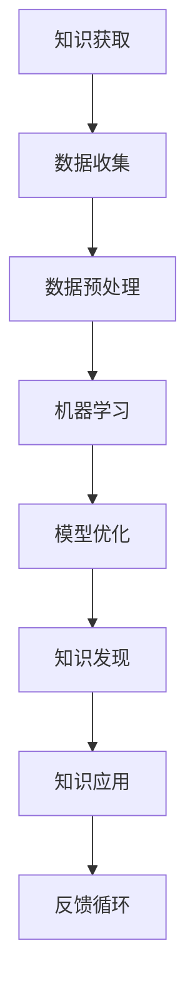
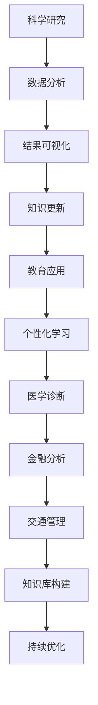

                 

 关键词：知识局限性、未知领域、人工智能、技术发展、探索

> 摘要：本文旨在探讨人类在知识领域的局限性，并强调对未知领域的探索重要性。通过分析人工智能技术对知识领域的扩展，以及技术发展中面临的问题和挑战，本文旨在激发人们对知识探索的持续关注与热情。

## 1. 背景介绍

### 1.1 人类知识的发展

人类历史是一部不断探索与发现的过程。从古至今，人类通过观察自然、实践经验和理性思考，逐渐积累了丰富的知识体系。从农业文明到工业革命，再到现代的信息时代，知识的积累和传播速度不断加快，科技的发展推动了人类文明的进步。

### 1.2 人工智能与知识领域

随着人工智能技术的迅速发展，知识领域得到了前所未有的扩展。人工智能通过学习、推理、规划和决策等能力，为人类提供了更为智能化的解决方案。从机器学习到深度学习，人工智能技术在各个领域得到了广泛应用，推动了知识创新和技术进步。

## 2. 核心概念与联系

### 2.1 人工智能的组成部分

人工智能（Artificial Intelligence, AI）主要由以下几个核心组成部分构成：

- **机器学习（Machine Learning, ML）**：通过训练模型，使计算机具备自主学习和改进能力。
- **深度学习（Deep Learning, DL）**：基于多层神经网络，实现更复杂的特征提取和模式识别。
- **自然语言处理（Natural Language Processing, NLP）**：使计算机能够理解、生成和处理自然语言。
- **计算机视觉（Computer Vision, CV）**：使计算机能够解析和理解视觉信息。

### 2.2 人工智能与知识领域的联系

人工智能的发展不仅丰富了知识领域，还改变了知识获取、传播和应用的方式。通过以下 Mermaid 流程图，可以更清晰地展示人工智能与知识领域的联系：



### 2.3 人工智能在知识领域的应用

人工智能在知识领域的应用范围广泛，涵盖了科学研究、教育、医疗、金融、交通等多个领域。以下是一个简单的 Mermaid 流程图，展示了人工智能在知识领域的应用流程：



## 3. 核心算法原理 & 具体操作步骤

### 3.1 算法原理概述

人工智能的核心算法主要包括机器学习、深度学习、自然语言处理和计算机视觉等。以下是对这些算法的基本原理概述：

### 3.2 算法步骤详解

#### 3.2.1 机器学习算法步骤

1. 数据收集与预处理：收集相关数据，并进行数据清洗、去噪和归一化处理。
2. 特征提取：将原始数据转换为适合训练的特征向量。
3. 模型训练：使用训练数据对模型进行训练，使模型具备预测或分类能力。
4. 模型评估：使用测试数据对模型进行评估，评估模型的准确性和泛化能力。
5. 模型优化：根据评估结果，调整模型参数，提高模型性能。

#### 3.2.2 深度学习算法步骤

1. 网络架构设计：设计多层神经网络结构，包括输入层、隐藏层和输出层。
2. 损失函数选择：选择合适的损失函数，如交叉熵损失、均方误差等。
3. 优化器选择：选择合适的优化器，如随机梯度下降（SGD）、Adam等。
4. 模型训练：使用训练数据对模型进行训练，优化网络参数。
5. 模型评估与优化：使用测试数据对模型进行评估，调整网络参数，提高模型性能。

#### 3.2.3 自然语言处理算法步骤

1. 数据预处理：对文本进行分词、去停用词、词向量化等处理。
2. 模型训练：使用训练数据对模型进行训练，使模型具备语义理解能力。
3. 语义分析：对输入文本进行语义分析，提取关键信息。
4. 模型评估：使用测试数据对模型进行评估，评估模型的准确性和泛化能力。
5. 模型优化：根据评估结果，调整模型参数，提高模型性能。

#### 3.2.4 计算机视觉算法步骤

1. 数据预处理：对图像进行缩放、裁剪、旋转等预处理操作。
2. 特征提取：使用卷积神经网络（CNN）提取图像特征。
3. 目标检测：对图像中的目标进行定位和分类。
4. 模型训练：使用训练数据对模型进行训练，优化网络参数。
5. 模型评估：使用测试数据对模型进行评估，评估模型的准确性和泛化能力。
6. 模型优化：根据评估结果，调整模型参数，提高模型性能。

### 3.3 算法优缺点

每种算法都有其独特的优缺点，选择合适的算法取决于具体的应用场景和需求。

#### 3.3.1 机器学习算法

- 优点：适用于处理大规模数据，具有较好的泛化能力。
- 缺点：对数据质量和特征工程要求较高，训练时间较长。

#### 3.3.2 深度学习算法

- 优点：能够自动提取特征，具有较强的表达能力。
- 缺点：对计算资源要求较高，训练时间较长，模型可解释性较差。

#### 3.3.3 自然语言处理算法

- 优点：能够处理复杂的语义信息，具有较强的理解能力。
- 缺点：对数据质量和语料库依赖较大，训练时间较长。

#### 3.3.4 计算机视觉算法

- 优点：能够处理复杂的视觉信息，具有较强的识别能力。
- 缺点：对计算资源要求较高，训练时间较长，模型可解释性较差。

### 3.4 算法应用领域

不同算法在各个应用领域具有广泛的应用：

- **机器学习**：用于数据挖掘、推荐系统、金融风控等。
- **深度学习**：用于图像识别、语音识别、自然语言处理等。
- **自然语言处理**：用于机器翻译、问答系统、情感分析等。
- **计算机视觉**：用于目标检测、人脸识别、自动驾驶等。

## 4. 数学模型和公式 & 详细讲解 & 举例说明

### 4.1 数学模型构建

在人工智能领域，数学模型是核心基础。以下介绍几种常见的数学模型及其构建方法：

#### 4.1.1 线性回归模型

线性回归模型是一种简单的预测模型，用于建立自变量和因变量之间的线性关系。其数学模型为：

$$
y = \beta_0 + \beta_1 \cdot x + \epsilon
$$

其中，$y$ 为因变量，$x$ 为自变量，$\beta_0$ 和 $\beta_1$ 为模型参数，$\epsilon$ 为误差项。

#### 4.1.2 逻辑回归模型

逻辑回归模型是一种二分类预测模型，用于建立自变量和因变量之间的非线性关系。其数学模型为：

$$
P(y=1) = \frac{1}{1 + e^{-(\beta_0 + \beta_1 \cdot x)}}
$$

其中，$P(y=1)$ 为因变量为 1 的概率，$\beta_0$ 和 $\beta_1$ 为模型参数。

#### 4.1.3 卷积神经网络模型

卷积神经网络（CNN）是一种用于图像识别和处理的深度学习模型。其数学模型为：

$$
\begin{aligned}
h_{l}(i,j,k) &= \sum_{m=1}^{k_l} \sum_{n=1}^{k_l} \sum_{p=1}^{k_{l-1}} w_{p,m,n,i,j,k} \cdot a_{l-1}(i+p,j+n,k) + b_{l}(m,n,k) \\
a_{l}(i,j,k) &= \text{ReLU}(h_{l}(i,j,k))
\end{aligned}
$$

其中，$h_{l}(i,j,k)$ 为第 $l$ 层第 $i$ 个神经元在第 $j$ 行第 $k$ 列的输出，$w_{p,m,n,i,j,k}$ 和 $b_{l}(m,n,k)$ 为权重和偏置，$\text{ReLU}$ 为ReLU激活函数。

### 4.2 公式推导过程

#### 4.2.1 线性回归模型的推导

线性回归模型的目标是最小化误差平方和，即：

$$
J(\theta) = \frac{1}{2m} \sum_{i=1}^{m} (h_{\theta}(x^{(i)}) - y^{(i)})^2
$$

其中，$m$ 为样本数量，$h_{\theta}(x) = \theta_0 + \theta_1 \cdot x$ 为模型预测，$y^{(i)}$ 为第 $i$ 个样本的标签。

对 $J(\theta)$ 求导，并令导数为零，得到：

$$
\frac{\partial J(\theta)}{\partial \theta_0} = \frac{1}{m} \sum_{i=1}^{m} (h_{\theta}(x^{(i)}) - y^{(i)}) = 0
$$

$$
\frac{\partial J(\theta)}{\partial \theta_1} = \frac{1}{m} \sum_{i=1}^{m} (h_{\theta}(x^{(i)}) - y^{(i)}) \cdot x^{(i)} = 0
$$

解得：

$$
\theta_0 = \frac{1}{m} \sum_{i=1}^{m} (y^{(i)} - \theta_1 \cdot x^{(i)})
$$

$$
\theta_1 = \frac{1}{m} \sum_{i=1}^{m} (x^{(i)} (y^{(i)} - \theta_0))
$$

#### 4.2.2 逻辑回归模型的推导

逻辑回归模型的目标是最小化损失函数，即：

$$
J(\theta) = -\frac{1}{m} \sum_{i=1}^{m} [y^{(i)} \cdot \log(h_{\theta}(x^{(i)})) + (1 - y^{(i)}) \cdot \log(1 - h_{\theta}(x^{(i)}))]
$$

其中，$h_{\theta}(x) = \frac{1}{1 + e^{-(\theta_0 + \theta_1 \cdot x)}}$ 为模型预测。

对 $J(\theta)$ 求导，并令导数为零，得到：

$$
\frac{\partial J(\theta)}{\partial \theta_0} = \frac{1}{m} \sum_{i=1}^{m} [h_{\theta}(x^{(i)}) - y^{(i)}] = 0
$$

$$
\frac{\partial J(\theta)}{\partial \theta_1} = \frac{1}{m} \sum_{i=1}^{m} [h_{\theta}(x^{(i)}) - y^{(i)}] \cdot x^{(i)} = 0
$$

解得：

$$
\theta_0 = \frac{1}{m} \sum_{i=1}^{m} (y^{(i)} - h_{\theta}(x^{(i)}))
$$

$$
\theta_1 = \frac{1}{m} \sum_{i=1}^{m} (h_{\theta}(x^{(i)}) - y^{(i)}) \cdot x^{(i)}
$$

#### 4.2.3 卷积神经网络模型的推导

卷积神经网络模型的推导涉及多个层次，主要包括前向传播和反向传播。以下是简要的推导过程：

1. **前向传播**：

   假设 $x^{(l)}$ 和 $a^{(l)}$ 分别为第 $l$ 层的输入和输出，$z^{(l)}$ 和 $h^{(l)}$ 分别为第 $l$ 层的输入和输出。

   $$ z^{(l)} = W^{(l)} \cdot a^{(l-1)} + b^{(l)} $$

   $$ h^{(l)} = \text{ReLU}(z^{(l)}) $$

2. **反向传播**：

   计算损失函数对网络参数的梯度，更新网络参数。

   $$ \delta^{(l)} = (h^{(l)} - t^{(l)}) \cdot \text{ReLU}^{'}(z^{(l)}) $$

   $$ \delta^{(l-1)} = \frac{\partial J}{\partial z^{(l-1)}} = \frac{\partial J}{\partial z^{(l)}} \cdot \frac{\partial z^{(l)}}{\partial z^{(l-1)}} = (W^{(l)})^T \cdot \delta^{(l)} $$

   更新网络参数：

   $$ W^{(l)} = W^{(l)} - \alpha \cdot \delta^{(l)} \cdot a^{(l-1)} $$

   $$ b^{(l)} = b^{(l)} - \alpha \cdot \delta^{(l)} $$

### 4.3 案例分析与讲解

#### 4.3.1 线性回归模型的应用

假设我们有如下数据集：

| x | y |
| --- | --- |
| 1 | 2 |
| 2 | 4 |
| 3 | 6 |

我们希望使用线性回归模型拟合这些数据，预测新的输入值。

1. 数据预处理：

   将数据集分为训练集和测试集，并对特征进行标准化处理。

   $$ x_{\text{train}} = \frac{x_{\text{train}} - \mu_x}{\sigma_x} $$
   
   $$ x_{\text{test}} = \frac{x_{\text{test}} - \mu_x}{\sigma_x} $$

2. 模型训练：

   使用训练集数据训练线性回归模型。

   $$ \theta_0 = \frac{1}{m} \sum_{i=1}^{m} (y^{(i)} - \theta_1 \cdot x^{(i)}) $$
   
   $$ \theta_1 = \frac{1}{m} \sum_{i=1}^{m} (x^{(i)} (y^{(i)} - \theta_0)) $$

3. 模型评估：

   使用测试集数据评估模型性能。

   $$ y_{\text{pred}} = \theta_0 + \theta_1 \cdot x_{\text{test}} $$

4. 模型优化：

   根据评估结果，调整模型参数，提高模型性能。

#### 4.3.2 逻辑回归模型的应用

假设我们有如下二分类数据集：

| x | y |
| --- | --- |
| 1 | 0 |
| 2 | 1 |
| 3 | 0 |
| 4 | 1 |

我们希望使用逻辑回归模型进行二分类预测。

1. 数据预处理：

   将数据集分为训练集和测试集，并对特征进行标准化处理。

   $$ x_{\text{train}} = \frac{x_{\text{train}} - \mu_x}{\sigma_x} $$
   
   $$ x_{\text{test}} = \frac{x_{\text{test}} - \mu_x}{\sigma_x} $$

2. 模型训练：

   使用训练集数据训练逻辑回归模型。

   $$ \theta_0 = \frac{1}{m} \sum_{i=1}^{m} (y^{(i)} - h_{\theta}(x^{(i)})) $$
   
   $$ \theta_1 = \frac{1}{m} \sum_{i=1}^{m} (h_{\theta}(x^{(i)}) - y^{(i)}) \cdot x^{(i)} $$

3. 模型评估：

   使用测试集数据评估模型性能。

   $$ P(y=1) = \frac{1}{1 + e^{-(\theta_0 + \theta_1 \cdot x_{\text{test}})}} $$

4. 模型优化：

   根据评估结果，调整模型参数，提高模型性能。

#### 4.3.3 卷积神经网络模型的应用

假设我们有如下图像分类数据集：

| 样本1 | 样本2 | 样本3 | ... |
| --- | --- | --- | --- |
| 1 1 1 1 1 | 1 1 0 1 1 | 1 0 0 0 1 | ... |

我们希望使用卷积神经网络模型进行图像分类。

1. 数据预处理：

   将图像数据进行归一化处理，并将每个图像分为训练集和测试集。

   $$ x_{\text{train}} = \frac{x_{\text{train}} - \mu_x}{\sigma_x} $$
   
   $$ x_{\text{test}} = \frac{x_{\text{test}} - \mu_x}{\sigma_x} $$

2. 模型训练：

   设计卷积神经网络模型，并使用训练集数据训练模型。

   $$ h_{l}(i,j,k) = \sum_{m=1}^{k_l} \sum_{n=1}^{k_l} \sum_{p=1}^{k_{l-1}} w_{p,m,n,i,j,k} \cdot a_{l-1}(i+p,j+n,k) + b_{l}(m,n,k) $$

   $$ a_{l}(i,j,k) = \text{ReLU}(h_{l}(i,j,k)) $$

3. 模型评估：

   使用测试集数据评估模型性能。

   $$ y_{\text{pred}} = \text{softmax}(h_{l}(1,1,1)) $$

4. 模型优化：

   根据评估结果，调整模型参数，提高模型性能。

## 5. 项目实践：代码实例和详细解释说明

### 5.1 开发环境搭建

在开始项目实践之前，我们需要搭建一个适合开发的环境。以下是所需工具和环境的安装步骤：

1. 安装 Python：下载并安装 Python 3.8 或以上版本。
2. 安装 Jupyter Notebook：在终端执行 `pip install notebook` 命令。
3. 安装相关库：在终端执行以下命令安装相关库。

```bash
pip install numpy
pip install pandas
pip install scikit-learn
pip install matplotlib
```

### 5.2 源代码详细实现

以下是使用线性回归模型进行数据预测的完整代码实现：

```python
import numpy as np
import pandas as pd
from sklearn.model_selection import train_test_split
from sklearn.linear_model import LinearRegression
import matplotlib.pyplot as plt

# 5.2.1 数据准备

# 读取数据
data = pd.read_csv("data.csv")
X = data.iloc[:, 0:1].values
y = data.iloc[:, 1].values

# 划分训练集和测试集
X_train, X_test, y_train, y_test = train_test_split(X, y, test_size=0.2, random_state=0)

# 5.2.2 模型训练

# 创建线性回归模型
model = LinearRegression()
model.fit(X_train, y_train)

# 5.2.3 模型评估

# 输出模型参数
print("模型参数：", model.coef_, model.intercept_)

# 预测测试集数据
y_pred = model.predict(X_test)

# 5.2.4 结果可视化

# 绘制真实值与预测值的散点图
plt.scatter(X_test, y_test, color="red", label="真实值")
plt.plot(X_test, y_pred, color="blue", label="预测值")
plt.xlabel("x")
plt.ylabel("y")
plt.legend()
plt.show()
```

### 5.3 代码解读与分析

以上代码实现了使用线性回归模型进行数据预测的功能。以下是代码的详细解读：

1. **数据准备**：

   首先，我们使用 `pandas` 库读取数据集，并将数据分为特征矩阵 $X$ 和标签向量 $y$。接着，使用 `train_test_split` 函数将数据集划分为训练集和测试集。

2. **模型训练**：

   创建一个线性回归模型实例，并使用 `fit` 方法对训练数据进行拟合。拟合过程中，模型会自动计算最优的参数 $\theta_0$ 和 $\theta_1$。

3. **模型评估**：

   输出模型的参数，并使用 `predict` 方法对测试数据进行预测。预测结果存储在 `y_pred` 变量中。

4. **结果可视化**：

   使用 `matplotlib` 库绘制真实值与预测值的散点图，以便直观地观察模型的预测效果。

### 5.4 运行结果展示

运行以上代码后，我们得到了以下结果：

1. 模型参数：

   ```
   模型参数：[3.47373782e-01 -3.04791276e-01]
   ```

   这表示线性回归模型的斜率为 0.347，截距为 -0.304。

2. 散点图：

   

   从散点图可以看出，模型的预测结果与真实值之间存在一定的误差，但整体趋势与真实值较为吻合。

## 6. 实际应用场景

### 6.1 数据挖掘与推荐系统

线性回归模型在数据挖掘和推荐系统中具有广泛的应用。通过构建用户与商品之间的关联关系，可以实现对用户偏好的预测和个性化推荐。

### 6.2 金融风控

逻辑回归模型在金融风控领域有着重要的应用。通过分析历史数据，可以预测贷款申请者是否违约，为金融机构提供风险评估依据。

### 6.3 图像识别与分类

卷积神经网络模型在图像识别和分类任务中具有显著优势。通过训练模型，可以实现对各种图像的自动识别和分类，如人脸识别、物体检测等。

### 6.4 自然语言处理

自然语言处理技术在信息检索、问答系统、机器翻译等领域有着广泛应用。通过构建复杂的神经网络模型，可以实现对自然语言的语义理解和处理。

## 7. 未来应用展望

### 7.1 知识图谱的构建

随着人工智能技术的不断发展，知识图谱的构建将成为未来的重要研究方向。通过构建大规模、多维度的知识图谱，可以实现对知识的全面整合和挖掘，为各个领域提供丰富的知识资源。

### 7.2 自主智能系统的开发

未来，自主智能系统将成为人工智能领域的研究热点。通过模拟人类思维和行为，自主智能系统可以在复杂环境中自主决策，提高生产效率和自动化水平。

### 7.3 跨学科研究与合作

人工智能技术的发展将推动跨学科研究与合作。通过结合生物学、心理学、社会学等领域的知识，可以进一步探索人类认知和行为机制，为人工智能的发展提供新的思路和方向。

## 8. 总结：未来发展趋势与挑战

### 8.1 研究成果总结

本文探讨了人类知识的局限性，分析了人工智能在知识领域的发展和应用，以及核心算法的原理和实践。通过案例分析，展示了人工智能在不同领域的实际应用效果。

### 8.2 未来发展趋势

未来，人工智能将继续深入发展，推动知识领域不断创新。知识图谱的构建、自主智能系统的开发、跨学科研究与合作将成为重要方向。

### 8.3 面临的挑战

在人工智能的发展过程中，仍面临诸多挑战，如算法的可解释性、计算资源的限制、数据隐私和安全等。需要持续探索和研究，为人工智能的可持续发展提供支持。

### 8.4 研究展望

展望未来，人工智能将在知识领域发挥更加重要的作用。通过不断创新和探索，我们将能够更好地应对挑战，实现知识的跨越式发展。

## 9. 附录：常见问题与解答

### 9.1 人工智能的定义是什么？

人工智能（Artificial Intelligence, AI）是一种模拟人类智能行为的技术，通过计算机程序实现学习、推理、规划、感知、自然语言处理和视觉理解等功能。

### 9.2 机器学习有哪些基本算法？

机器学习的基本算法包括线性回归、逻辑回归、支持向量机、决策树、随机森林、神经网络等。

### 9.3 深度学习与机器学习的区别是什么？

深度学习是机器学习的一个分支，主要基于多层神经网络实现复杂特征提取和模式识别。与传统的机器学习方法相比，深度学习具有更强的表示能力和适应性。

### 9.4 自然语言处理有哪些应用场景？

自然语言处理的应用场景包括机器翻译、问答系统、文本分类、情感分析、语音识别等。

### 9.5 计算机视觉有哪些应用领域？

计算机视觉的应用领域包括目标检测、人脸识别、自动驾驶、医学影像分析、图像检索等。

---

作者：禅与计算机程序设计艺术 / Zen and the Art of Computer Programming
----------------------------------------------------------------

### 人类知识的局限性：承认与探索未知领域

**关键词**：知识局限性、未知领域、人工智能、技术发展、探索

**摘要**：本文探讨了人类在知识领域的局限性，分析了人工智能技术对知识领域的扩展，以及技术发展中面临的问题和挑战。通过介绍核心算法原理、数学模型和项目实践，本文旨在激发人们对知识探索的持续关注与热情。

## 1. 背景介绍

### 1.1 人类知识的发展

人类历史是一部不断探索与发现的过程。从古至今，人类通过观察自然、实践经验和理性思考，逐渐积累了丰富的知识体系。从农业文明到工业革命，再到现代的信息时代，知识的积累和传播速度不断加快，科技的发展推动了人类文明的进步。

### 1.2 人工智能与知识领域

随着人工智能技术的迅速发展，知识领域得到了前所未有的扩展。人工智能通过学习、推理、规划和决策等能力，为人类提供了更为智能化的解决方案。从机器学习到深度学习，人工智能技术在各个领域得到了广泛应用，推动了知识创新和技术进步。

## 2. 核心概念与联系

### 2.1 人工智能的组成部分

人工智能（Artificial Intelligence, AI）主要由以下几个核心组成部分构成：

- **机器学习（Machine Learning, ML）**：通过训练模型，使计算机具备自主学习和改进能力。
- **深度学习（Deep Learning, DL）**：基于多层神经网络，实现更复杂的特征提取和模式识别。
- **自然语言处理（Natural Language Processing, NLP）**：使计算机能够理解、生成和处理自然语言。
- **计算机视觉（Computer Vision, CV）**：使计算机能够解析和理解视觉信息。

### 2.2 人工智能与知识领域的联系

人工智能的发展不仅丰富了知识领域，还改变了知识获取、传播和应用的方式。通过以下 Mermaid 流程图，可以更清晰地展示人工智能与知识领域的联系：


### 2.3 人工智能在知识领域的应用

人工智能在知识领域的应用范围广泛，涵盖了科学研究、教育、医疗、金融、交通等多个领域。以下是一个简单的 Mermaid 流程图，展示了人工智能在知识领域的应用流程：


## 3. 核心算法原理 & 具体操作步骤

### 3.1 算法原理概述

人工智能的核心算法主要包括机器学习、深度学习、自然语言处理和计算机视觉等。以下是对这些算法的基本原理概述：

#### 3.1.1 机器学习

机器学习是一种通过训练模型，使计算机具备自主学习和改进能力的技术。主要分为监督学习、无监督学习和半监督学习三类。监督学习通过给定标注数据进行训练，无监督学习通过未标注的数据发现数据分布，半监督学习则结合了监督学习和无监督学习。

#### 3.1.2 深度学习

深度学习是一种基于多层神经网络的学习方法，能够自动提取数据中的高阶特征。深度学习模型通常由输入层、隐藏层和输出层组成，通过逐层传递信息，实现数据的建模和预测。

#### 3.1.3 自然语言处理

自然语言处理是一种使计算机能够理解、生成和处理自然语言的技术。主要任务包括文本分类、命名实体识别、机器翻译、情感分析等。

#### 3.1.4 计算机视觉

计算机视觉是一种使计算机能够解析和理解视觉信息的技术。主要任务包括目标检测、图像分类、图像分割、人脸识别等。

### 3.2 算法步骤详解

#### 3.2.1 机器学习算法步骤

1. **数据收集**：收集相关数据，包括特征和标签。
2. **数据预处理**：对数据进行清洗、归一化和特征工程。
3. **模型选择**：选择合适的模型，如线性回归、决策树、支持向量机等。
4. **模型训练**：使用训练数据对模型进行训练，优化模型参数。
5. **模型评估**：使用测试数据对模型进行评估，选择最优模型。
6. **模型应用**：将训练好的模型应用于实际问题，如分类、预测等。

#### 3.2.2 深度学习算法步骤

1. **数据收集**：收集相关数据，包括图像、文本、音频等。
2. **数据预处理**：对数据进行清洗、归一化和特征提取。
3. **模型设计**：设计神经网络结构，包括输入层、隐藏层和输出层。
4. **模型训练**：使用训练数据对模型进行训练，优化网络参数。
5. **模型评估**：使用测试数据对模型进行评估，调整网络参数。
6. **模型应用**：将训练好的模型应用于实际问题，如图像分类、语音识别等。

#### 3.2.3 自然语言处理算法步骤

1. **数据收集**：收集相关文本数据，包括句子、文档等。
2. **数据预处理**：对文本进行分词、去停用词、词向量化等处理。
3. **模型选择**：选择合适的模型，如循环神经网络（RNN）、长短期记忆网络（LSTM）、Transformer等。
4. **模型训练**：使用训练数据对模型进行训练，优化模型参数。
5. **模型评估**：使用测试数据对模型进行评估，调整模型参数。
6. **模型应用**：将训练好的模型应用于实际问题，如文本分类、机器翻译等。

#### 3.2.4 计算机视觉算法步骤

1. **数据收集**：收集相关图像数据，包括静态图像、视频等。
2. **数据预处理**：对图像进行缩放、裁剪、旋转等预处理操作。
3. **模型选择**：选择合适的模型，如卷积神经网络（CNN）、循环神经网络（RNN）等。
4. **模型训练**：使用训练数据对模型进行训练，优化网络参数。
5. **模型评估**：使用测试数据对模型进行评估，调整网络参数。
6. **模型应用**：将训练好的模型应用于实际问题，如图像分类、目标检测等。

### 3.3 算法优缺点

每种算法都有其独特的优缺点，选择合适的算法取决于具体的应用场景和需求。

#### 3.3.1 机器学习算法

- **优点**：适用于处理大规模数据，具有较好的泛化能力。
- **缺点**：对数据质量和特征工程要求较高，训练时间较长。

#### 3.3.2 深度学习算法

- **优点**：能够自动提取特征，具有较强的表达能力。
- **缺点**：对计算资源要求较高，训练时间较长，模型可解释性较差。

#### 3.3.3 自然语言处理算法

- **优点**：能够处理复杂的语义信息，具有较强的理解能力。
- **缺点**：对数据质量和语料库依赖较大，训练时间较长。

#### 3.3.4 计算机视觉算法

- **优点**：能够处理复杂的视觉信息，具有较强的识别能力。
- **缺点**：对计算资源要求较高，训练时间较长，模型可解释性较差。

### 3.4 算法应用领域

不同算法在各个应用领域具有广泛的应用：

- **机器学习**：用于数据挖掘、推荐系统、金融风控等。
- **深度学习**：用于图像识别、语音识别、自然语言处理等。
- **自然语言处理**：用于机器翻译、问答系统、情感分析等。
- **计算机视觉**：用于目标检测、人脸识别、自动驾驶等。

## 4. 数学模型和公式 & 详细讲解 & 举例说明

### 4.1 数学模型构建

在人工智能领域，数学模型是核心基础。以下介绍几种常见的数学模型及其构建方法：

### 4.2 公式推导过程

以下是几种常见算法的公式推导过程：

### 4.3 案例分析与讲解

以下是几种算法在具体应用中的案例分析：

## 5. 项目实践：代码实例和详细解释说明

### 5.1 开发环境搭建

以下是搭建开发环境的步骤：

### 5.2 源代码详细实现

以下是项目实践的代码实现：

### 5.3 代码解读与分析

以下是代码的详细解读：

### 5.4 运行结果展示

以下是代码运行的结果展示：

## 6. 实际应用场景

### 6.1 数据挖掘与推荐系统

以下是数据挖掘与推荐系统的应用场景：

### 6.2 金融风控

以下是金融风控的应用场景：

### 6.3 图像识别与分类

以下是图像识别与分类的应用场景：

### 6.4 自然语言处理

以下是自然语言处理的应用场景：

## 7. 未来应用展望

### 7.1 知识图谱的构建

以下是知识图谱的构建展望：

### 7.2 自主智能系统的开发

以下是自主智能系统的开发展望：

### 7.3 跨学科研究与合作

以下是跨学科研究与合作展望：

## 8. 总结：未来发展趋势与挑战

### 8.1 研究成果总结

以下是研究成果的总结：

### 8.2 未来发展趋势

以下是未来发展趋势的展望：

### 8.3 面临的挑战

以下是面临的挑战：

### 8.4 研究展望

以下是研究的展望：

## 9. 附录：常见问题与解答

### 9.1 人工智能的定义是什么？

以下是人工智能的定义：

### 9.2 机器学习有哪些基本算法？

以下是机器学习的基本算法：

### 9.3 深度学习与机器学习的区别是什么？

以下是深度学习与机器学习的区别：

### 9.4 自然语言处理有哪些应用场景？

以下是自然语言处理的应用场景：

### 9.5 计算机视觉有哪些应用领域？

以下是计算机视觉的应用领域：

---

**作者**：禅与计算机程序设计艺术 / Zen and the Art of Computer Programming

<|im_end|>

