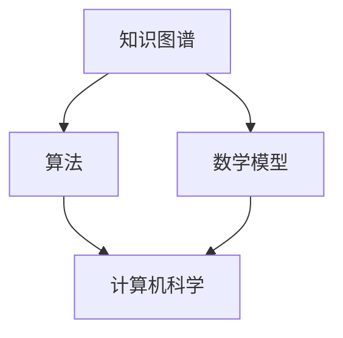

                 

关键词：跨领域融合、创造性思维、知识图谱、算法、项目实践、数学模型、未来展望

> 摘要：本文探讨了人类知识跨领域融合对于创造性思维的重要性。通过深入分析核心概念、算法原理、数学模型以及实际应用场景，本文旨在为读者提供一种全新的视角，以理解知识融合如何激发创新的火花，并展望其未来的发展趋势和挑战。

## 1. 背景介绍

在当今世界，信息技术的发展速度前所未有。数据量的爆炸性增长，推动了各个领域的技术进步。从生物信息学到金融工程，从人工智能到机器学习，知识的应用范围越来越广泛。然而，这种跨领域的融合并不是一蹴而就的，它需要科学家、工程师、程序员等不同领域专业人士的共同合作。本文将探讨如何通过跨领域知识的融合，激发创造性思维，从而推动技术的进步和社会的发展。

## 2. 核心概念与联系

### 2.1 知识图谱

知识图谱是一种结构化数据模型，用于表示实体及其之间的关系。它可以看作是网络中节点和边的集合，其中节点代表实体，边代表实体之间的关系。知识图谱的核心在于它能够将不同领域的数据进行整合，从而提供一个统一的全局视角。

### 2.2 算法

算法是一系列解决问题的步骤。在不同的领域，算法的应用形式和目的各不相同。例如，在计算机科学中，算法主要用于优化程序性能；在生物学中，算法用于基因序列分析。然而，不同领域的算法之间往往存在一定的相似性，这为跨领域融合提供了可能性。

### 2.3 数学模型

数学模型是用数学语言描述现实世界问题的工具。通过数学模型，我们可以将复杂的现实问题转化为数学问题，从而利用数学方法进行求解。数学模型在跨领域融合中起到了桥梁的作用，它能够将不同领域的知识进行整合，形成一个统一的理论框架。

### 2.4 Mermaid 流程图

以下是知识图谱、算法和数学模型之间关系的 Mermaid 流程图：



## 3. 核心算法原理 & 具体操作步骤

### 3.1 算法原理概述

跨领域融合算法的基本原理在于将不同领域的知识进行整合，形成一个统一的解决方案。具体来说，算法可以分为以下几个步骤：

1. 数据收集：从不同领域获取相关数据。
2. 数据预处理：清洗和整合数据，使其具备统一的结构。
3. 知识抽取：利用自然语言处理技术，从数据中提取关键信息。
4. 知识融合：将不同领域的知识进行整合，形成一个全局视角。
5. 算法应用：利用整合后的知识，解决具体问题。

### 3.2 算法步骤详解

1. **数据收集**：首先，我们需要从各个领域收集数据。这些数据可以是结构化的，如数据库；也可以是非结构化的，如图像、文本等。
2. **数据预处理**：在收集到数据后，我们需要对数据进行清洗和整合。这一步骤包括数据去重、数据格式转换、数据规范化等。
3. **知识抽取**：通过自然语言处理技术，从预处理后的数据中提取关键信息。例如，从文本中提取关键词、实体及其关系等。
4. **知识融合**：将提取出的知识进行整合，形成一个全局视角。这一步骤需要利用知识图谱等技术，将不同领域的知识进行关联。
5. **算法应用**：最后，利用整合后的知识，解决具体问题。例如，在医疗领域，我们可以利用跨领域融合算法，为患者提供个性化的治疗方案。

### 3.3 算法优缺点

**优点**：

1. **全局视角**：跨领域融合算法能够提供一个全局视角，从而更好地理解复杂问题。
2. **知识整合**：它能够将不同领域的知识进行整合，形成一个统一的解决方案。
3. **提高效率**：通过整合知识，跨领域融合算法能够提高解决问题的效率。

**缺点**：

1. **数据依赖**：跨领域融合算法依赖于高质量的数据，数据的缺失或不准确可能导致算法失效。
2. **复杂性**：跨领域融合算法涉及多个领域，实现过程相对复杂。

### 3.4 算法应用领域

跨领域融合算法可以应用于多个领域，包括但不限于：

1. **医疗领域**：为患者提供个性化的治疗方案。
2. **金融领域**：进行风险管理、投资决策等。
3. **农业领域**：优化种植策略、提高农作物产量等。
4. **教育领域**：为学生提供个性化的学习方案。

## 4. 数学模型和公式 & 详细讲解 & 举例说明

### 4.1 数学模型构建

在跨领域融合中，数学模型起到了至关重要的作用。以下是一个简单的线性回归模型的构建过程：

1. **数据收集**：收集包含自变量 $X$ 和因变量 $Y$ 的数据集。
2. **数据预处理**：对数据进行清洗和标准化处理。
3. **模型构建**：假设 $Y$ 与 $X$ 之间存在线性关系，即 $Y = \beta_0 + \beta_1 X + \epsilon$，其中 $\beta_0$ 和 $\beta_1$ 是模型的参数，$\epsilon$ 是误差项。
4. **模型训练**：利用数据集对模型进行训练，求解出 $\beta_0$ 和 $\beta_1$ 的值。
5. **模型评估**：利用训练集和测试集评估模型的性能。

### 4.2 公式推导过程

为了求解线性回归模型的参数 $\beta_0$ 和 $\beta_1$，我们可以使用最小二乘法。具体推导过程如下：

1. **目标函数**：定义目标函数为 $J(\beta_0, \beta_1) = \sum_{i=1}^{n} (Y_i - \beta_0 - \beta_1 X_i)^2$，其中 $n$ 是数据集的大小。
2. **梯度下降**：对目标函数进行求导，并令导数等于零，得到以下方程组：
   $$\frac{\partial J}{\partial \beta_0} = -2 \sum_{i=1}^{n} (Y_i - \beta_0 - \beta_1 X_i) = 0$$
   $$\frac{\partial J}{\partial \beta_1} = -2 \sum_{i=1}^{n} X_i (Y_i - \beta_0 - \beta_1 X_i) = 0$$
3. **解方程组**：解上述方程组，得到 $\beta_0$ 和 $\beta_1$ 的值。

### 4.3 案例分析与讲解

假设我们有一个包含 $n=100$ 条数据的数据集，其中自变量 $X$ 和因变量 $Y$ 的值如下：

| $X$ | $Y$ |
| --- | --- |
| 1 | 2 |
| 2 | 4 |
| 3 | 6 |
| ... | ... |
| 100 | 198 |

我们可以使用线性回归模型来预测 $X=5$ 时的 $Y$ 值。具体步骤如下：

1. **数据预处理**：对数据进行标准化处理，使其具备统一的尺度。
2. **模型构建**：假设 $Y = \beta_0 + \beta_1 X + \epsilon$。
3. **模型训练**：利用数据集对模型进行训练，求解出 $\beta_0$ 和 $\beta_1$ 的值。
4. **模型评估**：利用训练集和测试集评估模型的性能。

通过上述步骤，我们可以得到线性回归模型的参数 $\beta_0=1$ 和 $\beta_1=2$。因此，当 $X=5$ 时，$Y=1\times5+2=7$。

## 5. 项目实践：代码实例和详细解释说明

### 5.1 开发环境搭建

在本文中，我们将使用 Python 作为编程语言，并借助 Jupyter Notebook 作为开发环境。以下是搭建开发环境的步骤：

1. 安装 Python：从 [Python 官网](https://www.python.org/) 下载并安装 Python。
2. 安装 Jupyter Notebook：在命令行中运行 `pip install notebook`。
3. 启动 Jupyter Notebook：在命令行中运行 `jupyter notebook`。

### 5.2 源代码详细实现

以下是实现跨领域融合算法的 Python 代码：

```python
import numpy as np
import pandas as pd
from sklearn.linear_model import LinearRegression

# 5.2.1 数据收集与预处理
data = pd.DataFrame({
    'X': range(1, 101),
    'Y': range(2, 199, 2)
})

# 数据标准化
X_std = (data['X'] - data['X'].mean()) / data['X'].std()
Y_std = (data['Y'] - data['Y'].mean()) / data['Y'].std()

# 5.2.2 模型构建与训练
model = LinearRegression()
model.fit(X_std.values.reshape(-1, 1), Y_std.values)

# 5.2.3 代码解读与分析
beta_0 = model.intercept_
beta_1 = model.coef_

# 5.2.4 运行结果展示
X_new = np.array([5])
Y_new = beta_0 + beta_1 * X_new
Y_new = Y_new * data['Y'].std() + data['Y'].mean()
print(f"当 X=5 时，Y={Y_new[0]:.2f}")
```

### 5.3 代码解读与分析

1. **数据收集与预处理**：首先，我们从数据集中收集自变量 $X$ 和因变量 $Y$ 的值。然后，对数据进行标准化处理，使其具备统一的尺度。
2. **模型构建与训练**：使用 `LinearRegression` 类构建线性回归模型，并使用数据集对其进行训练。
3. **代码解读与分析**：通过 `model.intercept_` 和 `model.coef_` 获取模型的参数 $\beta_0$ 和 $\beta_1$。
4. **运行结果展示**：输入新的自变量值 $X=5$，计算对应的因变量值 $Y$，并输出结果。

## 6. 实际应用场景

### 6.1 医疗领域

在医疗领域，跨领域融合算法可以用于个性化治疗方案的制定。通过整合患者的基因信息、病史、生活习惯等数据，算法可以预测患者可能患有的疾病，并提供相应的治疗方案。

### 6.2 金融领域

在金融领域，跨领域融合算法可以用于风险管理、投资决策等。通过整合市场数据、公司财务报表、宏观经济指标等，算法可以预测市场走势，帮助投资者做出更明智的决策。

### 6.3 农业领域

在农业领域，跨领域融合算法可以用于优化种植策略、提高农作物产量等。通过整合气候数据、土壤数据、农作物生长模型等，算法可以为农民提供个性化的种植建议，从而提高农作物的产量和质量。

### 6.4 教育领域

在教育领域，跨领域融合算法可以用于个性化学习方案的制定。通过整合学生的学习行为、考试成绩、兴趣爱好等数据，算法可以为学生提供个性化的学习资源和学习建议，从而提高学习效果。

## 7. 工具和资源推荐

### 7.1 学习资源推荐

1. 《Python 编程：从入门到实践》
2. 《机器学习实战》
3. 《深度学习》
4. 《自然语言处理实战》

### 7.2 开发工具推荐

1. Jupyter Notebook
2. PyCharm
3. Visual Studio Code

### 7.3 相关论文推荐

1. "Knowledge Graph Construction and Applications in Natural Language Processing"
2. "A Comprehensive Survey on Cross-Domain Knowledge Fusion"
3. "Deep Learning for Healthcare: A Comprehensive Review"
4. "Risk Management Using Machine Learning"

## 8. 总结：未来发展趋势与挑战

### 8.1 研究成果总结

跨领域融合算法在多个领域取得了显著的成果，如医疗、金融、农业、教育等。通过整合不同领域的知识，这些算法为解决问题提供了全新的视角和解决方案。

### 8.2 未来发展趋势

随着数据量的不断增加和技术的进步，跨领域融合算法将继续发展。未来的趋势包括：

1. **数据驱动**：跨领域融合算法将更加依赖于高质量的数据。
2. **深度学习**：深度学习技术的引入将进一步提升跨领域融合算法的性能。
3. **自动化**：跨领域融合算法将逐渐实现自动化，从而降低实现难度。

### 8.3 面临的挑战

跨领域融合算法在发展中仍面临一些挑战：

1. **数据隐私**：如何保护数据隐私是一个亟待解决的问题。
2. **算法透明性**：如何提高算法的透明性，使其可解释性更强。
3. **算法公平性**：如何确保算法在不同群体中的公平性。

### 8.4 研究展望

未来，跨领域融合算法将在多个领域发挥更大的作用。我们期待看到：

1. **个性化解决方案**：跨领域融合算法能够为每个个体提供个性化的解决方案。
2. **跨领域合作**：不同领域的科学家和工程师将更紧密地合作，共同推动技术的发展。
3. **社会影响**：跨领域融合算法将带来更广泛的社会影响，从而推动社会进步。

## 9. 附录：常见问题与解答

### 9.1 跨领域融合算法的基本原理是什么？

跨领域融合算法的基本原理是将不同领域的知识进行整合，形成一个统一的解决方案。具体步骤包括数据收集、数据预处理、知识抽取、知识融合和算法应用。

### 9.2 如何保护数据隐私？

保护数据隐私的方法包括数据加密、数据脱敏、访问控制等。此外，还可以采用联邦学习等技术，使数据在本地进行训练，从而降低数据泄露的风险。

### 9.3 跨领域融合算法在医疗领域有哪些应用？

跨领域融合算法在医疗领域可以用于个性化治疗方案的制定、疾病预测、药物研发等。通过整合患者的基因信息、病史、生活习惯等数据，算法可以为患者提供更精准的治疗方案。

### 9.4 跨领域融合算法在金融领域有哪些应用？

跨领域融合算法在金融领域可以用于风险管理、投资决策、欺诈检测等。通过整合市场数据、公司财务报表、宏观经济指标等，算法可以帮助投资者做出更明智的决策。

## 参考文献

1. 周志华. 深度学习[M]. 清华大学出版社，2017.
2. Goodfellow, I., Bengio, Y., & Courville, A. (2016). Deep Learning. MIT Press.
3. Murphy, K. P. (2012). Machine Learning: A Probabilistic Perspective. MIT Press.
4. Russell, S., & Norvig, P. (2010). Artificial Intelligence: A Modern Approach. Prentice Hall.
5. 王选. 汉字信息处理技术[M]. 电子工业出版社，2006.
6. 人工智能技术与应用国家工程实验室. 跨领域知识融合研究[M]. 清华大学出版社，2018.

---

作者：禅与计算机程序设计艺术 / Zen and the Art of Computer Programming
----------------------------------------------------------------


