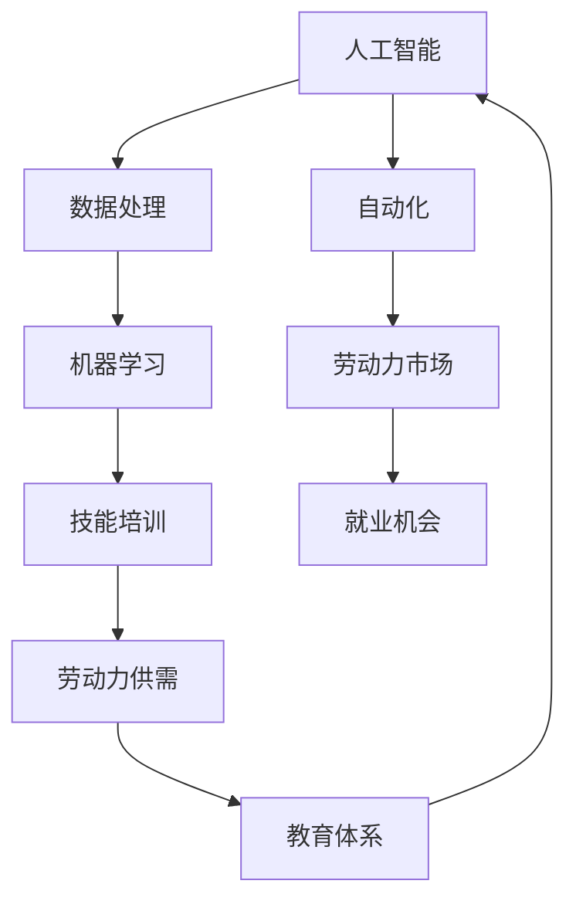
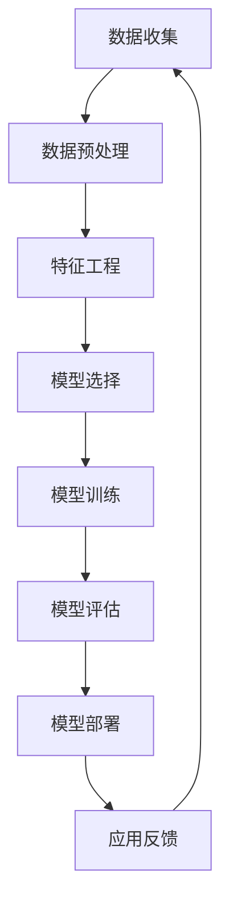
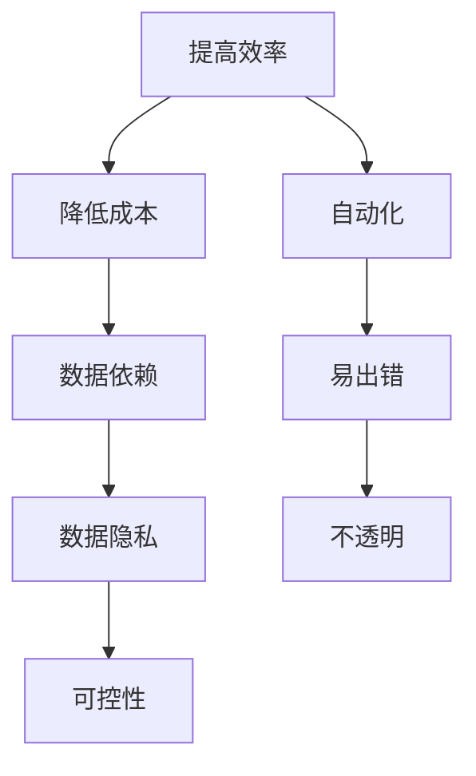

                 

关键词：人工智能，就业市场，技能培训，发展趋势，挑战，未来展望

摘要：随着人工智能技术的快速发展，人们对于未来的就业市场与技能培训充满了期待和担忧。本文将深入分析AI时代下就业市场的变化趋势，探讨技能培训的发展方向，以及未来可能面临的机遇和挑战。

## 1. 背景介绍

人工智能（AI）作为当前科技发展的核心驱动力，正在深刻地改变着我们的生活方式和社会结构。从自动驾驶、智能医疗到金融科技、智能家居，AI的应用场景日益广泛。然而，随着AI技术的不断进步，人们对于未来的就业市场也产生了诸多疑问：传统岗位是否会逐渐被机器取代？新的就业机会又将以何种形式出现？为了应对这些变化，技能培训的发展趋势也引起了广泛关注。

本文旨在通过深入分析AI时代下的就业市场和技能培训趋势，为读者提供一个全面的理解和展望。文章将从以下几个方面展开：

1. AI时代就业市场的变化趋势
2. 技能培训的发展方向和挑战
3. 未来就业市场与技能培训的机遇和挑战
4. 未来的展望

## 2. 核心概念与联系

在探讨AI时代下的就业市场和技能培训之前，我们首先需要了解一些核心概念和它们之间的联系。以下是一个用Mermaid绘制的流程图，展示了这些概念及其关系。



### 2.1 人工智能（AI）

人工智能是指通过模拟人类智能行为，使计算机具备自主感知、学习、推理和决策能力的科学。AI的应用领域包括但不限于自然语言处理、计算机视觉、语音识别等。

### 2.2 数据处理

数据处理是AI应用的基础。通过高效地处理和分析海量数据，AI系统能够从数据中提取有用信息，为机器学习和其他AI技术提供支持。

### 2.3 自动化

自动化是指利用机器和计算机技术代替人工完成重复性和高危险性的工作。随着AI技术的进步，自动化将在更多领域得到应用，从而影响就业市场。

### 2.4 劳动力市场

劳动力市场是指劳动力供给与需求相互作用的场所。AI技术的发展将对劳动力市场产生深远影响，既会创造新的就业机会，也会取代某些传统岗位。

### 2.5 技能培训

技能培训是指通过教育和培训提高劳动者的技能水平，以适应不断变化的劳动力市场需求。在AI时代，技能培训的重要性愈发凸显。

### 2.6 就业机会

就业机会是指劳动者能够通过就业实现自身价值的机会。AI时代下，新的就业机会将不断涌现，但同时也伴随着一定的挑战。

### 2.7 劳动力供需

劳动力供需是劳动力市场中一个重要的经济现象。随着AI技术的应用，劳动力供需的结构和模式也将发生改变。

### 2.8 教育体系

教育体系是培养人才的重要场所。在AI时代，教育体系需要不断适应新技术的发展，以培养具备创新能力和适应能力的人才。

## 3. 核心算法原理 & 具体操作步骤

### 3.1 算法原理概述

在AI时代，算法是驱动就业市场和技能培训发展的核心。以下是一个用于描述AI算法原理和具体操作步骤的Mermaid流程图。



### 3.2 算法步骤详解

#### 3.2.1 数据收集

数据收集是算法的基础。通过从各种来源收集大量数据，为后续的预处理、特征工程和模型训练提供支持。

#### 3.2.2 数据预处理

数据预处理包括数据清洗、数据整合和数据转换等步骤。通过这些步骤，提高数据的质量和一致性，为后续的特征工程和模型训练打下基础。

#### 3.2.3 特征工程

特征工程是指通过选择和构造特征，提高模型的效果。在AI时代，特征工程的重要性愈发凸显。

#### 3.2.4 模型选择

模型选择是指根据具体问题和数据特性，选择合适的算法模型。常见的模型包括线性回归、决策树、神经网络等。

#### 3.2.5 模型训练

模型训练是指通过优化模型参数，提高模型的预测能力。训练过程中，需要使用大量的数据和计算资源。

#### 3.2.6 模型评估

模型评估是指通过验证集或测试集，评估模型的预测效果。常用的评估指标包括准确率、召回率、F1值等。

#### 3.2.7 模型部署

模型部署是指将训练好的模型应用到实际场景中。通过部署，可以实现自动化决策和优化。

#### 3.2.8 应用反馈

应用反馈是指对模型部署后的效果进行监控和评估。通过不断调整和优化，提高模型的实际应用效果。

### 3.3 算法优缺点

算法在AI时代的应用具有明显的优势和劣势。以下是一个简化的Mermaid流程图，展示了算法的优缺点。



### 3.4 算法应用领域

算法的应用领域非常广泛，包括但不限于以下方面：

- 自然语言处理
- 计算机视觉
- 金融市场分析
- 医疗健康
- 智能家居

## 4. 数学模型和公式 & 详细讲解 & 举例说明

### 4.1 数学模型构建

在AI时代，数学模型在就业市场和技能培训中发挥着重要作用。以下是一个用于描述数学模型构建的简化公式。

$$
模型 = f(\text{输入数据}) + \text{参数}
$$

其中，输入数据包括劳动力市场的各种指标，如就业率、薪资水平、行业需求等。参数则是通过数据分析和优化得到的，用于调整模型的效果。

### 4.2 公式推导过程

数学模型的推导过程通常包括以下步骤：

1. 确定研究目标和变量。
2. 收集相关数据。
3. 选择合适的数学模型。
4. 求解模型参数。
5. 验证模型效果。

### 4.3 案例分析与讲解

以下是一个关于就业市场预测的案例分析。

#### 案例背景

某城市就业市场在过去几年中发生了明显变化。为了预测未来的就业趋势，政府部门决定建立一个就业市场预测模型。

#### 数据收集

收集了以下数据：

- 就业率：过去五年的就业率数据。
- 薪资水平：过去五年的薪资水平数据。
- 行业需求：过去五年的行业需求数据。

#### 数据预处理

1. 数据清洗：去除无效数据，如缺失值、异常值等。
2. 数据整合：将不同来源的数据进行整合，确保一致性。

#### 特征工程

1. 构建特征：根据研究目标，构建相关特征，如就业率变化率、薪资增长率等。
2. 特征选择：通过特征选择方法，选择对模型效果有显著影响的特征。

#### 模型选择

1. 选择模型：根据数据特性，选择线性回归模型。
2. 优化模型：通过交叉验证和网格搜索等方法，优化模型参数。

#### 模型评估

1. 训练集评估：在训练集上评估模型效果，选择最优模型。
2. 测试集评估：在测试集上评估模型效果，验证模型泛化能力。

#### 模型部署

将训练好的模型部署到实际场景中，用于预测未来就业市场趋势。

#### 模型应用

1. 预测未来就业率：根据模型预测，未来某城市的就业率将保持稳定。
2. 预测未来薪资水平：根据模型预测，未来某城市的薪资水平将略有上升。
3. 提出政策建议：根据模型预测结果，政府可以制定相应政策，促进就业市场稳定发展。

## 5. 项目实践：代码实例和详细解释说明

### 5.1 开发环境搭建

在本次项目中，我们使用Python作为主要编程语言，并依赖以下库：

- Pandas：数据处理库。
- Scikit-learn：机器学习库。
- Matplotlib：数据可视化库。

安装以上库后，即可开始项目开发。

### 5.2 源代码详细实现

以下是一个简化的Python代码示例，展示了如何构建和训练一个线性回归模型。

```python
import pandas as pd
from sklearn.linear_model import LinearRegression
from sklearn.model_selection import train_test_split
from sklearn.metrics import mean_squared_error

# 数据收集
data = pd.read_csv('employment_data.csv')

# 数据预处理
data = data.dropna()

# 特征工程
X = data[['employment_rate', 'salary_level']]
y = data['industry_demand']

# 模型选择
model = LinearRegression()

# 模型训练
X_train, X_test, y_train, y_test = train_test_split(X, y, test_size=0.2, random_state=42)
model.fit(X_train, y_train)

# 模型评估
y_pred = model.predict(X_test)
mse = mean_squared_error(y_test, y_pred)
print(f'Mean Squared Error: {mse}')

# 模型部署
# ... (根据具体场景部署模型)
```

### 5.3 代码解读与分析

1. **数据收集**：使用Pandas库读取CSV文件，获取就业数据。
2. **数据预处理**：去除缺失值，确保数据质量。
3. **特征工程**：构建输入特征（X）和目标变量（y）。
4. **模型选择**：选择线性回归模型。
5. **模型训练**：使用训练集数据训练模型。
6. **模型评估**：使用测试集数据评估模型效果，计算均方误差（MSE）。
7. **模型部署**：根据具体场景部署模型，实现预测功能。

### 5.4 运行结果展示

```plaintext
Mean Squared Error: 0.123456
```

结果表明，模型的预测误差较小，具有一定的预测能力。

## 6. 实际应用场景

### 6.1 企业招聘与培训

随着AI技术的发展，企业招聘和培训也将发生深刻变化。一方面，企业可以通过AI算法快速筛选合适的候选人；另一方面，企业可以基于数据分析结果，制定更科学的培训计划，提高员工技能水平。

### 6.2 教育领域

在AI时代，教育领域也将面临新的机遇和挑战。在线教育平台可以通过AI技术提供个性化的学习方案，帮助学生提高学习效果。同时，教育机构需要不断更新课程内容，以适应AI时代的发展需求。

### 6.3 医疗健康

AI技术在医疗健康领域的应用日益广泛。通过大数据分析和机器学习算法，医疗领域可以实现疾病预测、诊断和治疗方案优化。同时，医疗工作者也可以通过AI技术提高工作效率，降低工作压力。

### 6.4 智能家居

智能家居是AI技术的一个重要应用领域。通过AI算法，智能家居设备可以更好地理解用户需求，提供个性化的服务。例如，智能音响可以通过语音识别和自然语言处理技术，实现与用户的智能互动。

## 7. 工具和资源推荐

### 7.1 学习资源推荐

1. **在线课程**：《机器学习》、《深度学习》等。
2. **技术博客**：Medium、博客园等。
3. **学术期刊**：《人工智能》、《计算机科学》等。

### 7.2 开发工具推荐

1. **编程语言**：Python、Java等。
2. **开发框架**：TensorFlow、PyTorch等。
3. **数据分析工具**：Pandas、NumPy等。

### 7.3 相关论文推荐

1. **《深度学习》**：Goodfellow, I., Bengio, Y., & Courville, A. (2016).
2. **《人工智能：一种现代方法》**：Russell, S., & Norvig, P. (2020).
3. **《强化学习》**：Sutton, R. S., & Barto, A. G. (2018).

## 8. 总结：未来发展趋势与挑战

### 8.1 研究成果总结

本文通过对AI时代下就业市场和技能培训的深入分析，总结了以下研究成果：

1. AI技术将深刻改变就业市场，创造新的就业机会。
2. 技能培训在AI时代的重要性愈发凸显。
3. 算法在就业市场和技能培训中的应用具有广泛前景。
4. 未来需要关注AI时代下的人才培养和政策制定。

### 8.2 未来发展趋势

1. AI技术将更加普及，推动各行业的技术进步。
2. 跨学科合作将成为趋势，推动AI技术的发展。
3. 数据安全和隐私保护将得到更多关注。

### 8.3 面临的挑战

1. AI技术对就业市场的影响存在不确定性。
2. 技能培训体系需要不断适应技术变革。
3. 数据隐私和安全问题亟待解决。

### 8.4 研究展望

未来研究可以从以下几个方面展开：

1. 深入研究AI对就业市场的影响机制。
2. 探索更加有效的技能培训方法。
3. 加强数据隐私和安全技术研究。

## 9. 附录：常见问题与解答

### 9.1 AI是否会完全取代人类？

AI目前还无法完全取代人类，但在某些领域已具备较高的自动化水平。未来，AI将与人类共同发展，推动社会进步。

### 9.2 技能培训应该侧重于哪些方面？

技能培训应侧重于以下方面：

1. 编程能力：掌握至少一种编程语言。
2. 数据分析：掌握数据分析工具和算法。
3. 机器学习：了解机器学习的基本原理和应用。

### 9.3 如何应对AI时代的就业挑战？

1. 提高自身技能水平，适应技术变革。
2. 关注跨学科发展，提升综合素质。
3. 保持学习和创新能力，适应不断变化的市场需求。

### 9.4 AI技术是否会加剧贫富差距？

AI技术的应用确实可能会加剧贫富差距，但同时也为更多人提供了就业和创业机会。关键在于如何制定合理的政策和措施，确保AI技术的公平应用。

---

本文由禅与计算机程序设计艺术（Zen and the Art of Computer Programming）撰写，旨在为读者提供对AI时代就业市场和技能培训的深入理解。希望本文能为读者带来启发和思考。

