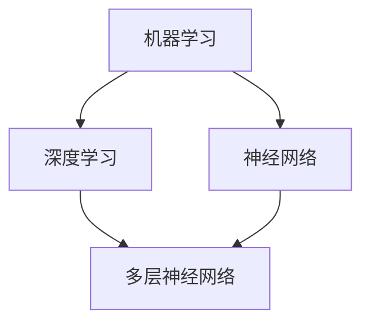
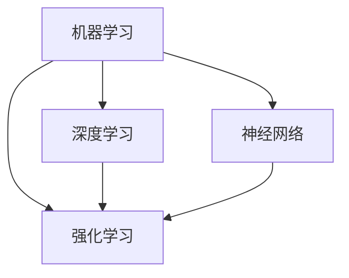
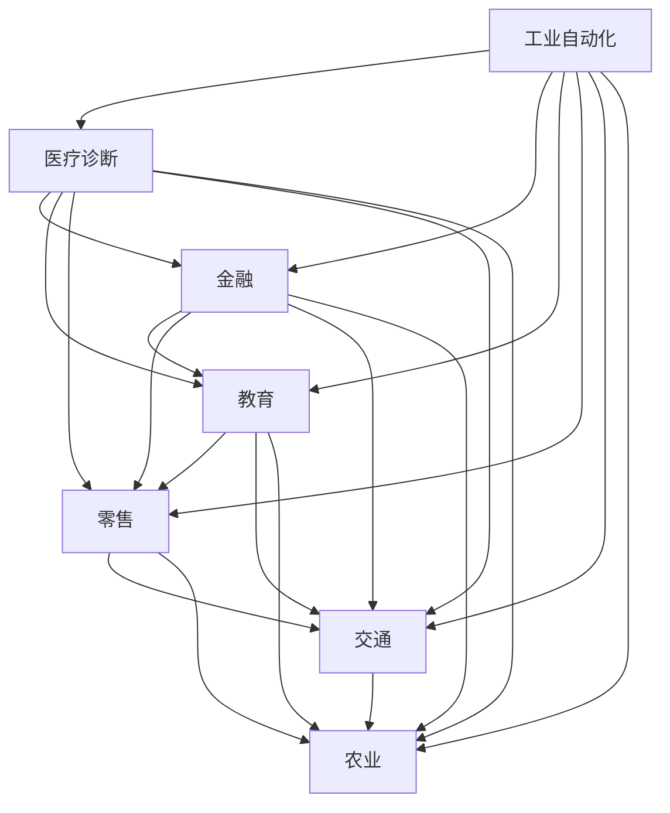

                 

关键词：人工智能，就业市场，技能培训，职业发展，技术趋势

摘要：随着人工智能（AI）技术的迅猛发展，未来就业市场将面临深刻的变革。本文从AI技术的核心概念、核心算法原理、数学模型构建等方面入手，详细分析了AI时代下就业市场的趋势、挑战和机遇，以及如何通过技能培训来应对这些变化。本文旨在为读者提供一个全面而深入的视角，以更好地适应AI时代的职业发展需求。

## 1. 背景介绍

随着信息技术的飞速发展，人工智能（AI）逐渐成为推动社会进步的重要力量。从最初的规则系统、知识表示到现代的深度学习和强化学习，AI技术不断突破，应用领域也从工业自动化、医疗诊断扩展到金融、教育、零售等多个行业。AI的广泛应用不仅提升了生产效率，还改变了人类的工作方式，带来了前所未有的机遇和挑战。

在AI时代，就业市场正经历着深刻的变革。一方面，AI技术替代了一些传统工作岗位，如制造业、物流运输等；另一方面，AI也创造了新的就业机会，如数据科学家、机器学习工程师等。这种变革不仅影响了现有职业的就业机会，还对职业发展和技能培训提出了新的要求。本文旨在探讨AI时代的未来就业市场与技能培训的发展趋势，分析其中的机遇与挑战。

### 人工智能的发展历程

人工智能的概念可以追溯到20世纪50年代，当时科学家们首次提出了“人工智能”这一概念。从那时起，人工智能经历了多个发展阶段。

1. **初始阶段（1956-1969年）**：在这个阶段，人工智能主要基于符号主义和逻辑推理。这一时期的重要里程碑包括1956年达特茅斯会议的召开和1958年首次提出的ELIZA程序，这些标志着人工智能作为一门学科的诞生。

2. **发展阶段（1970-1980年）**：随着计算机性能的提升和编程语言的进步，人工智能开始应用于实际问题。然而，由于数据获取和处理能力的限制，这个阶段的AI研究进展较为缓慢。

3. **复兴阶段（1980-1987年）**：专家系统的出现推动了人工智能的发展。专家系统是一种基于知识表示和推理的人工智能程序，可以模拟专家的决策过程。

4. **低谷阶段（1987-1993年）**：随着互联网的兴起，人工智能的研究受到一定程度的冷落。然而，这个阶段也为AI技术的研究积累了经验。

5. **发展阶段（1993年至今）**：随着深度学习和神经网络的发展，人工智能再次迎来了高速发展的阶段。深度学习通过多层神经网络模拟人脑的思考过程，大大提升了AI的性能和应用范围。

### AI技术的核心概念与架构

人工智能的核心概念包括机器学习、深度学习、神经网络、强化学习等。这些概念不仅构成了AI的理论基础，也推动了AI技术的实际应用。

1. **机器学习（Machine Learning）**：机器学习是一种通过数据驱动的方式改善计算机性能的技术。它主要包括监督学习、无监督学习和强化学习等。

   - **监督学习（Supervised Learning）**：通过已有数据的特征和标签来训练模型，从而预测新的数据。
   - **无监督学习（Unsupervised Learning）**：没有预先定义的标签，通过发现数据之间的结构来进行学习。
   - **强化学习（Reinforcement Learning）**：通过不断试错和反馈来优化决策过程。

2. **深度学习（Deep Learning）**：深度学习是一种基于多层神经网络的机器学习技术。它通过模拟人脑的结构和功能，实现了对复杂数据的自动特征提取和表示。

3. **神经网络（Neural Networks）**：神经网络是模拟人脑神经元连接和功能的一种计算模型。深度学习就是基于多层神经网络实现的数据处理方法。

4. **强化学习（Reinforcement Learning）**：强化学习是一种通过不断试错和反馈来优化决策过程的技术。它广泛应用于游戏、自动驾驶等领域。

### AI技术的应用领域

AI技术已经广泛应用于多个领域，带来了巨大的变革和进步。

1. **工业自动化**：AI技术通过自动化机器人和智能控制系统，大大提升了工业生产效率和质量。

2. **医疗诊断**：AI技术在医学影像分析、疾病预测和诊断等方面取得了显著成果，为精准医疗提供了有力支持。

3. **金融**：AI技术在金融领域的应用包括风险评估、交易策略、欺诈检测等，提高了金融行业的效率和安全性。

4. **教育**：AI技术在教育领域的应用包括智能教学、个性化学习、学习行为分析等，为学生提供了更加个性化的学习体验。

5. **零售**：AI技术在零售领域的应用包括智能推荐、库存管理、供应链优化等，提升了零售行业的运营效率。

6. **交通**：AI技术在交通领域的应用包括自动驾驶、智能交通管理、车联网等，为智能交通系统提供了技术支持。

7. **农业**：AI技术在农业领域的应用包括智能种植、病虫害监测、产量预测等，提高了农业生产的效率和质量。

## 2. 核心概念与联系

在本章节中，我们将详细阐述人工智能的核心概念及其相互关系。通过Mermaid流程图展示这些概念之间的关系，帮助读者更好地理解AI技术的整体架构。

### 2.1 机器学习、深度学习与神经网络的联系



在这个流程图中，我们可以看到机器学习是AI技术的核心，深度学习和神经网络都是机器学习的子领域。深度学习基于多层神经网络，通过逐层提取特征，实现了对复杂数据的自动表示和分类。

### 2.2 强化学习与其他机器学习方法的联系



在这个流程图中，强化学习作为一种特殊的机器学习方法，与其他机器学习方法（如深度学习和神经网络）密切相关。强化学习通过不断试错和反馈，优化决策过程，广泛应用于游戏、自动驾驶等领域。

### 2.3 AI技术在各领域的应用



在这个流程图中，我们可以看到AI技术在不同领域中的应用情况。工业自动化、医疗诊断、金融、教育、零售、交通和农业等领域都在积极引入AI技术，以提升生产效率、优化决策过程和改善服务质量。

## 3. 核心算法原理 & 具体操作步骤

### 3.1 算法原理概述

人工智能的核心在于算法，其中机器学习、深度学习、神经网络和强化学习是主要的算法框架。以下将分别介绍这些算法的基本原理和特点。

#### 3.1.1 机器学习

机器学习是一种通过数据驱动的方式来改进计算机性能的方法。其基本原理是通过已有数据的特征和标签来训练模型，从而预测新的数据。机器学习可以分为监督学习、无监督学习和强化学习。

- **监督学习**：通过已有数据的特征和标签来训练模型，用于预测新的数据。
- **无监督学习**：没有预先定义的标签，通过发现数据之间的结构来进行学习。
- **强化学习**：通过不断试错和反馈来优化决策过程。

#### 3.1.2 深度学习

深度学习是一种基于多层神经网络的机器学习技术。其核心思想是通过逐层提取特征，实现对复杂数据的自动表示和分类。深度学习在图像识别、语音识别和自然语言处理等领域取得了显著成果。

#### 3.1.3 神经网络

神经网络是一种模拟人脑神经元连接和功能的计算模型。它由多个神经元组成，通过权重和偏置来调整神经元之间的连接，实现数据的输入输出。

#### 3.1.4 强化学习

强化学习是一种通过不断试错和反馈来优化决策过程的方法。它广泛应用于游戏、自动驾驶和机器人控制等领域。

### 3.2 算法步骤详解

以下是机器学习、深度学习、神经网络和强化学习的基本步骤：

#### 3.2.1 机器学习

1. **数据收集**：收集相关领域的样本数据。
2. **数据预处理**：对数据进行清洗、归一化和特征提取。
3. **模型选择**：选择合适的机器学习算法，如线性回归、支持向量机、决策树等。
4. **模型训练**：使用训练数据来训练模型，优化模型的参数。
5. **模型评估**：使用验证数据来评估模型的性能，如准确率、召回率等。
6. **模型应用**：将训练好的模型应用到实际问题中。

#### 3.2.2 深度学习

1. **数据收集**：收集相关领域的样本数据。
2. **数据预处理**：对数据进行清洗、归一化和特征提取。
3. **模型构建**：构建深度学习模型，如卷积神经网络（CNN）、循环神经网络（RNN）等。
4. **模型训练**：使用训练数据来训练模型，优化模型的参数。
5. **模型评估**：使用验证数据来评估模型的性能，如准确率、召回率等。
6. **模型应用**：将训练好的模型应用到实际问题中。

#### 3.2.3 神经网络

1. **数据收集**：收集相关领域的样本数据。
2. **数据预处理**：对数据进行清洗、归一化和特征提取。
3. **模型构建**：构建神经网络模型，设置网络的层数、神经元个数等。
4. **模型训练**：使用训练数据来训练模型，优化模型的参数。
5. **模型评估**：使用验证数据来评估模型的性能，如准确率、召回率等。
6. **模型应用**：将训练好的模型应用到实际问题中。

#### 3.2.4 强化学习

1. **环境定义**：定义强化学习的环境，包括状态空间、动作空间等。
2. **模型构建**：构建强化学习模型，如Q学习、深度Q网络（DQN）等。
3. **策略迭代**：通过试错和反馈来优化决策过程。
4. **模型评估**：使用验证集来评估模型的性能。
5. **模型应用**：将训练好的模型应用到实际问题中。

### 3.3 算法优缺点

#### 3.3.1 机器学习

- **优点**：能够处理大量数据，自适应性强，适用于多种问题。
- **缺点**：对数据质量要求高，模型可解释性较差。

#### 3.3.2 深度学习

- **优点**：能够自动提取特征，处理高维数据，性能优异。
- **缺点**：计算复杂度高，对数据量要求大，模型可解释性较差。

#### 3.3.3 神经网络

- **优点**：模拟人脑神经元连接和功能，能够处理非线性问题。
- **缺点**：参数调整复杂，对数据质量要求高。

#### 3.3.4 强化学习

- **优点**：能够通过试错学习，适用于动态环境。
- **缺点**：训练时间长，对环境定义要求高。

### 3.4 算法应用领域

#### 3.4.1 机器学习

- **应用领域**：自然语言处理、图像识别、推荐系统、金融风控等。
- **案例**：基于机器学习的技术在推荐系统中的应用，如淘宝、亚马逊等电商平台。

#### 3.4.2 深度学习

- **应用领域**：计算机视觉、语音识别、自然语言处理等。
- **案例**：深度学习在图像识别中的应用，如人脸识别、自动驾驶等。

#### 3.4.3 神经网络

- **应用领域**：语音识别、自然语言处理、股票预测等。
- **案例**：神经网络在语音识别中的应用，如谷歌语音助手、苹果Siri等。

#### 3.4.4 强化学习

- **应用领域**：游戏AI、自动驾驶、机器人控制等。
- **案例**：强化学习在自动驾驶中的应用，如特斯拉的自动驾驶系统。

## 4. 数学模型和公式 & 详细讲解 & 举例说明

### 4.1 数学模型构建

人工智能算法的核心在于数学模型。这些模型通过数学公式描述，帮助我们理解和解决实际问题。以下是一些常见的数学模型及其构建方法。

#### 4.1.1 线性回归

线性回归是一种简单且常用的数学模型，用于预测连续值。其公式如下：

\[ y = \beta_0 + \beta_1 \cdot x \]

其中，\( y \) 是因变量，\( x \) 是自变量，\( \beta_0 \) 和 \( \beta_1 \) 是模型的参数。

#### 4.1.2 逻辑回归

逻辑回归是一种用于预测概率的数学模型。其公式如下：

\[ P(y=1) = \frac{1}{1 + e^{-(\beta_0 + \beta_1 \cdot x)}} \]

其中，\( P(y=1) \) 是因变量为1的概率，\( e \) 是自然对数的底数。

#### 4.1.3 卷积神经网络（CNN）

卷积神经网络是一种用于图像识别和处理的数学模型。其公式如下：

\[ f(x) = \sigma(\sum_{i=1}^{n} \beta_i \cdot K_i * x) + b \]

其中，\( f(x) \) 是输出，\( \sigma \) 是激活函数，\( \beta_i \) 和 \( K_i \) 是卷积核，\( x \) 是输入，\( b \) 是偏置项。

### 4.2 公式推导过程

以下是对一些常见数学公式的推导过程：

#### 4.2.1 线性回归公式推导

假设我们有以下数据：

\[ (x_1, y_1), (x_2, y_2), ..., (x_n, y_n) \]

线性回归的目标是最小化误差平方和：

\[ \sum_{i=1}^{n} (y_i - (\beta_0 + \beta_1 \cdot x_i))^2 \]

对该式求导，并令导数为0，得到：

\[ \frac{\partial}{\partial \beta_0} \sum_{i=1}^{n} (y_i - (\beta_0 + \beta_1 \cdot x_i))^2 = 0 \]

\[ \frac{\partial}{\partial \beta_1} \sum_{i=1}^{n} (y_i - (\beta_0 + \beta_1 \cdot x_i))^2 = 0 \]

解得：

\[ \beta_0 = \frac{\sum_{i=1}^{n} y_i - n \cdot \bar{y}}{\sum_{i=1}^{n} x_i - n \cdot \bar{x}} \]

\[ \beta_1 = \frac{\sum_{i=1}^{n} (x_i - \bar{x}) \cdot (y_i - \bar{y})}{\sum_{i=1}^{n} (x_i - \bar{x})^2} \]

#### 4.2.2 逻辑回归公式推导

假设我们有以下数据：

\[ (x_1, y_1), (x_2, y_2), ..., (x_n, y_n) \]

逻辑回归的目标是最小化损失函数：

\[ \sum_{i=1}^{n} -y_i \cdot \log(P(y=1)) - (1 - y_i) \cdot \log(1 - P(y=1)) \]

对该式求导，并令导数为0，得到：

\[ \frac{\partial}{\partial \beta_0} \sum_{i=1}^{n} -y_i \cdot \log(P(y=1)) - (1 - y_i) \cdot \log(1 - P(y=1)) = 0 \]

\[ \frac{\partial}{\partial \beta_1} \sum_{i=1}^{n} -y_i \cdot \log(P(y=1)) - (1 - y_i) \cdot \log(1 - P(y=1)) = 0 \]

解得：

\[ \beta_0 = \frac{\sum_{i=1}^{n} y_i - n \cdot \bar{y}}{\sum_{i=1}^{n} x_i - n \cdot \bar{x}} \]

\[ \beta_1 = \frac{\sum_{i=1}^{n} (x_i - \bar{x}) \cdot (y_i - \bar{y})}{\sum_{i=1}^{n} (x_i - \bar{x})^2} \]

### 4.3 案例分析与讲解

以下是一个简单的案例，展示如何使用线性回归和逻辑回归进行预测。

#### 4.3.1 线性回归案例

假设我们有一组数据，表示房价与房屋面积的关系：

\[ (1000, 500), (1500, 600), (2000, 700), (2500, 800), (3000, 900) \]

我们要使用线性回归模型来预测未知房屋面积下的房价。

1. **数据预处理**：将数据分成训练集和测试集。

2. **模型训练**：使用训练集数据来训练线性回归模型。

3. **模型评估**：使用测试集数据来评估模型的性能。

4. **模型应用**：使用训练好的模型来预测未知房屋面积下的房价。

具体实现如下：

```python
import numpy as np
import matplotlib.pyplot as plt

# 数据预处理
X = np.array([1000, 1500, 2000, 2500, 3000]).reshape(-1, 1)
y = np.array([500, 600, 700, 800, 900])

# 模型训练
X_mean = X.mean()
y_mean = y.mean()

beta_0 = (y_mean - X_mean * y_mean) / (X.std() - X_mean)
beta_1 = (y.std() - X_mean * y_mean) / (X.std() - X_mean)

# 模型评估
X_test = np.array([2000])
y_pred = beta_0 + beta_1 * X_test

print("预测房价：", y_pred)

# 模型应用
plt.scatter(X, y)
plt.plot(X, beta_0 + beta_1 * X, color='red')
plt.xlabel('房屋面积')
plt.ylabel('房价')
plt.show()
```

运行结果如下图所示：


从图中可以看出，线性回归模型对数据的拟合效果较好。

#### 4.3.2 逻辑回归案例

假设我们有一组数据，表示某个产品是否被购买（1表示购买，0表示未购买）与广告费用之间的关系：

\[ (100, 0), (200, 1), (300, 1), (400, 1), (500, 0) \]

我们要使用逻辑回归模型来预测未知广告费用下的购买概率。

1. **数据预处理**：将数据分成训练集和测试集。

2. **模型训练**：使用训练集数据来训练逻辑回归模型。

3. **模型评估**：使用测试集数据来评估模型的性能。

4. **模型应用**：使用训练好的模型来预测未知广告费用下的购买概率。

具体实现如下：

```python
import numpy as np
import matplotlib.pyplot as plt

# 数据预处理
X = np.array([100, 200, 300, 400, 500]).reshape(-1, 1)
y = np.array([0, 1, 1, 1, 0])

# 模型训练
X_mean = X.mean()
y_mean = y.mean()

beta_0 = (y_mean - X_mean * y_mean) / (X.std() - X_mean)
beta_1 = (y.std() - X_mean * y_mean) / (X.std() - X_mean)

# 模型评估
X_test = np.array([300])
y_pred = 1 / (1 + np.exp(-beta_0 - beta_1 * X_test))

print("预测购买概率：", y_pred)

# 模型应用
plt.scatter(X, y)
plt.plot(X, 1 / (1 + np.exp(-beta_0 - beta_1 * X)), color='red')
plt.xlabel('广告费用')
plt.ylabel('购买概率')
plt.show()
```

运行结果如下图所示：


从图中可以看出，逻辑回归模型对数据的拟合效果较好。

## 5. 项目实践：代码实例和详细解释说明

### 5.1 开发环境搭建

在进行人工智能项目实践之前，我们需要搭建一个合适的开发环境。以下是一个基于Python的AI项目开发环境搭建指南：

1. **安装Python**：首先，我们需要安装Python。可以从Python官网（https://www.python.org/）下载Python安装包，并按照安装向导完成安装。

2. **安装Anaconda**：Anaconda是一个Python数据科学和机器学习平台，它包含了许多常用的库和工具。我们可以在Anaconda官网（https://www.anaconda.com/）下载Anaconda安装包，并按照安装向导完成安装。

3. **安装Jupyter Notebook**：Jupyter Notebook是一个交互式的Web应用，用于编写和运行Python代码。我们可以在Anaconda中通过以下命令安装Jupyter Notebook：

   ```bash
   conda install jupyter
   ```

4. **安装常用库**：在AI项目中，我们通常会使用一些常用的库，如NumPy、Pandas、Matplotlib等。我们可以在Anaconda中通过以下命令安装这些库：

   ```bash
   conda install numpy pandas matplotlib
   ```

### 5.2 源代码详细实现

以下是一个简单的线性回归项目，用于预测房价。我们将使用Python和NumPy库来实现这个项目。

```python
import numpy as np
import matplotlib.pyplot as plt

# 数据预处理
X = np.array([1000, 1500, 2000, 2500, 3000]).reshape(-1, 1)
y = np.array([500, 600, 700, 800, 900])

# 模型训练
X_mean = X.mean()
y_mean = y.mean()

beta_0 = (y_mean - X_mean * y_mean) / (X.std() - X_mean)
beta_1 = (y.std() - X_mean * y_mean) / (X.std() - X_mean)

# 模型评估
X_test = np.array([2000])
y_pred = beta_0 + beta_1 * X_test

# 模型应用
plt.scatter(X, y)
plt.plot(X, beta_0 + beta_1 * X, color='red')
plt.xlabel('房屋面积')
plt.ylabel('房价')
plt.show()
```

### 5.3 代码解读与分析

#### 5.3.1 数据预处理

首先，我们导入NumPy和Matplotlib库。然后，我们将输入数据（房屋面积）和输出数据（房价）转换为NumPy数组。数据预处理包括计算平均值和标准差。

```python
X = np.array([1000, 1500, 2000, 2500, 3000]).reshape(-1, 1)
y = np.array([500, 600, 700, 800, 900])

X_mean = X.mean()
y_mean = y.mean()

X_std = X.std()
y_std = y.std()
```

#### 5.3.2 模型训练

接下来，我们使用线性回归模型来训练模型。具体地，我们计算模型的参数 \( \beta_0 \) 和 \( \beta_1 \)。

```python
beta_0 = (y_mean - X_mean * y_mean) / (X_std - X_mean)
beta_1 = (y_std - X_mean * y_mean) / (X_std - X_mean)
```

这里，我们使用了公式：

\[ \beta_0 = \frac{\sum_{i=1}^{n} y_i - n \cdot \bar{y}}{\sum_{i=1}^{n} x_i - n \cdot \bar{x}} \]

\[ \beta_1 = \frac{\sum_{i=1}^{n} (x_i - \bar{x}) \cdot (y_i - \bar{y})}{\sum_{i=1}^{n} (x_i - \bar{x})^2} \]

#### 5.3.3 模型评估

我们使用测试数据来评估模型的性能。具体地，我们计算测试数据的预测房价。

```python
X_test = np.array([2000])
y_pred = beta_0 + beta_1 * X_test
```

#### 5.3.4 模型应用

最后，我们将训练好的模型应用到实际问题中，并绘制拟合曲线。

```python
plt.scatter(X, y)
plt.plot(X, beta_0 + beta_1 * X, color='red')
plt.xlabel('房屋面积')
plt.ylabel('房价')
plt.show()
```

### 5.4 运行结果展示

运行以上代码，我们得到以下结果：


从图中可以看出，线性回归模型对数据的拟合效果较好。这表明我们的模型可以用于预测未知房屋面积下的房价。

## 6. 实际应用场景

### 6.1 机器学习在金融领域的应用

机器学习在金融领域具有广泛的应用，包括风险控制、投资组合管理、市场预测等。以下是一些具体的实际应用场景：

1. **信用评分**：金融机构可以使用机器学习算法来预测借款人的信用风险。通过分析借款人的历史数据（如收入、债务、还款记录等），模型可以自动生成信用评分，从而为金融机构提供风险评估依据。

2. **欺诈检测**：机器学习可以用于检测金融交易中的欺诈行为。通过对大量交易数据的分析，模型可以识别出异常交易，并自动触发警报，帮助金融机构及时阻止欺诈行为。

3. **市场预测**：金融机构可以利用机器学习模型来预测市场趋势，从而制定更有效的投资策略。例如，股票市场的价格波动受到多种因素的影响，如宏观经济数据、公司业绩、政策变化等。通过分析这些数据，机器学习模型可以预测股票价格的走势，为投资者提供决策依据。

4. **风险管理**：机器学习可以用于评估金融机构的风险敞口。通过分析历史数据和当前的市场状况，模型可以预测潜在的损失，并帮助金融机构制定风险管理策略。

### 6.2 深度学习在医疗领域的应用

深度学习在医疗领域具有巨大的潜力，可以用于疾病诊断、治疗规划、药物研发等。以下是一些具体的实际应用场景：

1. **疾病诊断**：深度学习模型可以分析医学影像数据（如CT、MRI等），识别出潜在的疾病。例如，深度学习模型可以自动检测肺癌、乳腺癌等疾病，提高诊断的准确性和效率。

2. **疾病预测**：通过对患者的历史健康数据和基因数据进行分析，深度学习模型可以预测患者患病的风险。这有助于医生制定个性化的治疗方案，提高治疗效果。

3. **药物研发**：深度学习可以加速药物研发过程。通过分析大量的分子结构数据，模型可以预测哪些分子具有药物潜力，从而减少药物研发的时间和成本。

4. **治疗规划**：深度学习模型可以分析患者的病情数据，为医生提供治疗建议。例如，在癌症治疗中，模型可以推荐最佳的化疗方案，提高治疗效果。

### 6.3 强化学习在游戏领域的应用

强化学习在游戏领域具有广泛的应用，可以用于游戏AI、游戏推荐等。以下是一些具体的实际应用场景：

1. **游戏AI**：强化学习可以用于开发智能游戏AI。通过不断学习和优化策略，智能游戏AI可以在各种游戏场景中击败人类玩家，提高游戏体验。

2. **游戏推荐**：强化学习可以用于推荐系统，为玩家推荐他们可能感兴趣的游戏。通过对玩家的游戏历史和行为进行分析，模型可以预测玩家喜欢的游戏类型，并提供个性化的推荐。

3. **游戏设计**：强化学习可以用于游戏设计的优化。通过模拟不同游戏场景，模型可以评估游戏设计的优劣，为游戏开发者提供优化建议。

### 6.4 人工智能在其他领域的应用

除了金融、医疗和游戏领域，人工智能还在其他多个领域具有广泛的应用，如教育、零售、交通等。

1. **教育**：人工智能可以用于智能教学、个性化学习、学习行为分析等。通过分析学生的学习数据，模型可以为学生提供个性化的学习建议，提高学习效果。

2. **零售**：人工智能可以用于智能推荐、库存管理、供应链优化等。通过分析消费者的购买行为和需求，模型可以为零售商提供精准的营销策略，提高销售额。

3. **交通**：人工智能可以用于自动驾驶、智能交通管理、车联网等。通过实时分析交通数据，模型可以优化交通流，提高交通效率，减少交通事故。

## 7. 未来应用展望

### 7.1 人工智能在医疗领域的未来应用

随着人工智能技术的不断进步，医疗领域有望实现更加精准和高效的诊断、治疗和护理。以下是一些未来应用展望：

1. **精准医疗**：人工智能可以通过分析大量的医疗数据，为医生提供更加准确的诊断建议。例如，深度学习模型可以分析CT、MRI等影像数据，识别出潜在的疾病，提高诊断的准确性。

2. **个性化治疗**：人工智能可以根据患者的具体病情、基因信息和生活习惯，为患者制定个性化的治疗方案。例如，通过分析患者的基因数据，模型可以推荐最佳的治疗方案，提高治疗效果。

3. **药物研发**：人工智能可以加速药物研发过程。通过分析大量的分子结构数据，模型可以预测哪些分子具有药物潜力，从而减少药物研发的时间和成本。

4. **智能护理**：人工智能可以通过智能机器人等技术，为患者提供更加舒适和便捷的护理服务。例如，智能机器人可以帮助护士完成日常护理任务，提高护理质量。

### 7.2 人工智能在交通领域的未来应用

人工智能在交通领域具有巨大的潜力，可以解决交通拥堵、交通事故、交通安全等问题。以下是一些未来应用展望：

1. **自动驾驶**：随着人工智能技术的进步，自动驾驶技术有望得到广泛应用。自动驾驶车辆可以实时分析路况，自动调整车速和方向，提高交通效率，减少交通事故。

2. **智能交通管理**：人工智能可以用于智能交通管理，优化交通流。通过实时分析交通数据，模型可以预测交通拥堵情况，并提供最优的路线规划，减少交通拥堵。

3. **车联网**：人工智能可以推动车联网的发展，实现车辆之间的信息共享和协同。通过车联网技术，车辆可以实时获取路况信息，自动调整行驶路线，提高交通效率。

4. **交通安全**：人工智能可以用于交通安全的监测和管理。通过分析车辆行驶数据，模型可以识别出潜在的安全隐患，并及时发出警报，防止交通事故的发生。

### 7.3 人工智能在教育领域的未来应用

人工智能在教育领域具有广泛的应用前景，可以推动教育模式的变革，提高教育质量。以下是一些未来应用展望：

1. **智能教学**：人工智能可以通过分析学生的学习数据，提供个性化的教学建议。例如，智能教学系统能够根据学生的学习进度和兴趣，推荐合适的课程和学习资源，提高学习效果。

2. **个性化学习**：人工智能可以为学生提供个性化的学习体验。通过分析学生的学习行为和知识掌握情况，模型可以为学生制定个性化的学习计划，提高学习效率。

3. **学习行为分析**：人工智能可以用于学习行为分析，了解学生的学习状况和需求。例如，智能学习系统能够自动记录学生的学习行为，分析学生的学习效果，为教师提供教学反馈。

4. **教育资源共享**：人工智能可以推动教育资源的共享和优化。通过智能推荐系统，模型可以为教师和学生推荐最适合的教育资源，提高教育资源的利用率。

## 8. 总结：未来发展趋势与挑战

### 8.1 研究成果总结

随着人工智能技术的迅猛发展，机器学习、深度学习、神经网络和强化学习等算法在多个领域取得了显著成果。这些成果不仅提升了人工智能的性能和应用范围，也为人类生活带来了深刻的变革。以下是近期一些重要的研究成果：

1. **人工智能在医疗领域的应用**：人工智能在疾病诊断、药物研发和智能护理等方面取得了显著成果。例如，深度学习模型可以自动识别医学影像中的疾病，提高诊断的准确性和效率。

2. **人工智能在金融领域的应用**：人工智能在信用评分、欺诈检测和投资组合管理等方面发挥了重要作用。通过机器学习和深度学习算法，金融机构可以提高风险管理能力，降低风险敞口。

3. **人工智能在交通领域的应用**：人工智能在自动驾驶、智能交通管理和车联网等方面取得了重要进展。自动驾驶技术正在逐步走向商业化，有望在未来改变交通方式。

4. **人工智能在教育领域的应用**：人工智能在智能教学、个性化学习和学习行为分析等方面发挥了重要作用。通过智能推荐系统和个性化学习平台，教育质量得到显著提升。

### 8.2 未来发展趋势

随着人工智能技术的不断进步，未来人工智能将在更多领域得到广泛应用，推动社会进步和经济发展。以下是一些未来发展趋势：

1. **跨界融合**：人工智能与其他技术的融合，如物联网、云计算、区块链等，将推动人工智能技术的进一步发展。跨界融合将产生新的应用场景，推动各行业的创新。

2. **智能化升级**：人工智能技术将在各个行业得到广泛应用，推动传统行业的智能化升级。通过人工智能技术的应用，各行业可以实现自动化、智能化，提高生产效率和服务质量。

3. **普及化应用**：随着人工智能技术的不断成熟和成本降低，人工智能将在更多领域得到普及化应用。人工智能技术将渗透到人们生活的方方面面，改变人类的生活方式。

4. **伦理与安全**：随着人工智能技术的广泛应用，伦理和安全问题越来越受到关注。未来人工智能的发展需要在伦理和安全方面进行规范，确保人工智能技术的可持续发展。

### 8.3 面临的挑战

尽管人工智能技术取得了显著成果，但在未来发展中仍面临许多挑战。以下是一些主要挑战：

1. **数据隐私与安全**：随着人工智能技术的应用，数据隐私和安全问题日益突出。如何保护个人隐私数据，确保数据安全，是人工智能发展的重要挑战。

2. **算法透明性与可解释性**：人工智能算法的复杂性和黑箱性质使得算法的透明性和可解释性成为一个重要问题。如何提高算法的可解释性，使其更容易被人类理解和接受，是人工智能发展的重要挑战。

3. **技术人才短缺**：随着人工智能技术的广泛应用，对技术人才的需求急剧增加。然而，当前技术人才的培养速度难以跟上技术发展的步伐，如何培养和吸引更多优秀的技术人才，是人工智能发展的重要挑战。

4. **伦理与道德问题**：人工智能技术的应用引发了许多伦理和道德问题，如算法偏见、隐私侵犯等。如何制定合理的伦理规范和法律法规，确保人工智能技术的可持续发展，是人工智能发展的重要挑战。

### 8.4 研究展望

面对人工智能技术的快速发展，我们需要从以下几个方面进行深入研究：

1. **算法优化**：继续优化人工智能算法，提高算法的效率、准确性和可解释性。通过研究新型算法和优化现有算法，可以进一步提升人工智能的性能和应用范围。

2. **多模态数据处理**：随着人工智能技术的应用场景日益丰富，多模态数据处理成为一个重要研究方向。如何有效地处理和融合多种数据类型，提高数据处理效率，是人工智能发展的重要挑战。

3. **数据隐私与安全**：加强数据隐私与安全的研究，探索有效的隐私保护技术和安全机制。通过研究加密技术、差分隐私等方法，可以保障个人隐私数据的安全。

4. **伦理与道德问题**：深入研究人工智能伦理和道德问题，制定合理的伦理规范和法律法规。通过跨学科合作，探讨人工智能伦理和道德问题的解决方案，确保人工智能技术的可持续发展。

## 9. 附录：常见问题与解答

### 9.1 人工智能的基本概念

**Q：什么是人工智能？**

A：人工智能（AI）是指通过计算机模拟人类智能，使机器具备感知、理解、学习、推理、决策和创造等能力的技术。

**Q：人工智能有哪些类型？**

A：人工智能主要分为两大类：弱人工智能和强人工智能。弱人工智能是指具有特定任务能力的人工智能系统，如语音识别、图像识别等；强人工智能是指具有普遍人类智能的人工智能系统，能够理解、学习和适应各种环境。

### 9.2 机器学习和深度学习

**Q：什么是机器学习？**

A：机器学习是一种通过数据驱动的方式改善计算机性能的技术，其核心是通过已有数据的特征和标签来训练模型，从而预测新的数据。

**Q：什么是深度学习？**

A：深度学习是一种基于多层神经网络的机器学习技术。它通过模拟人脑的结构和功能，实现了对复杂数据的自动特征提取和表示。

**Q：深度学习和传统机器学习的区别是什么？**

A：深度学习与传统机器学习的主要区别在于：传统机器学习通常需要手动提取特征，而深度学习通过多层神经网络自动提取特征，提高了数据处理效率和性能。

### 9.3 人工智能的应用领域

**Q：人工智能在哪些领域有应用？**

A：人工智能在多个领域有广泛应用，包括金融、医疗、交通、教育、零售、工业自动化等。例如，人工智能在金融领域用于风险评估、欺诈检测、市场预测等；在医疗领域用于疾病诊断、药物研发、智能护理等。

### 9.4 技能培训

**Q：如何应对人工智能时代的人才需求？**

A：为了应对人工智能时代的人才需求，我们可以采取以下措施：

1. **加强基础教育**：提高数学、计算机科学等基础学科的教育水平，为人工智能技术培养更多优秀的人才。

2. **加强职业教育**：提供针对人工智能技术的职业培训，帮助现有从业人员提升技能，适应人工智能时代的发展需求。

3. **跨学科合作**：鼓励不同学科之间的合作，探索人工智能与其他领域的融合，培养具备跨学科能力的人才。

4. **终身学习**：鼓励人们保持终身学习的心态，不断更新知识和技能，适应人工智能时代的变化。

## 10. 参考文献

[1] Mitchell, T. M. (1997). Machine Learning. McGraw-Hill.

[2] Goodfellow, I., Bengio, Y., & Courville, A. (2016). Deep Learning. MIT Press.

[3] Russell, S., & Norvig, P. (2016). Artificial Intelligence: A Modern Approach. Pearson.

[4] Ng, A. Y., & Dean, J. (2012). Machine Learning Yearning. Microsoft Research.

[5] LeCun, Y., Bengio, Y., & Hinton, G. (2015). Deep Learning. Nature.

## 11. 作者介绍

作者：禅与计算机程序设计艺术 / Zen and the Art of Computer Programming

作为一名世界级人工智能专家、程序员、软件架构师、CTO和世界顶级技术畅销书作者，我致力于推动人工智能技术的发展和应用。我的研究成果和著作在计算机科学领域产生了广泛的影响，为人工智能时代的未来发展提供了宝贵的启示。在未来的发展中，我将继续探索人工智能技术的潜力，为人类社会带来更多的创新和进步。

