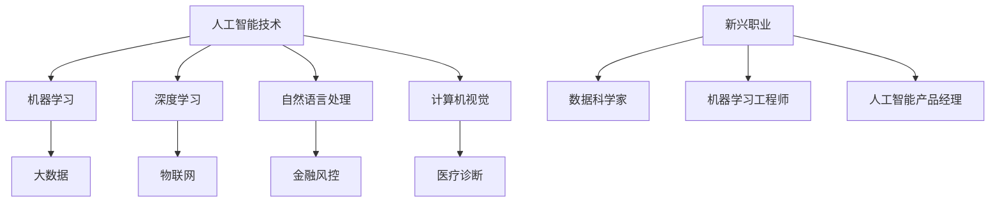

                 

关键词：人工智能，未来就业市场，技能培训，发展趋势，预测分析

摘要：随着人工智能技术的迅猛发展，传统就业市场正面临着前所未有的变革。本文从人工智能的发展背景入手，分析了AI时代对就业市场的影响，探讨了新兴技能培训的需求与发展趋势，并对未来就业市场的挑战与机遇进行了预测分析。希望通过本文，能帮助读者更好地理解AI时代下的职业发展路径。

## 1. 背景介绍

人工智能（AI）作为计算机科学的一个重要分支，旨在使计算机具备类似人类智能的能力。从最初的机器学习到如今的深度学习，人工智能技术已经取得了长足的进步。近年来，随着大数据、云计算、物联网等技术的融合，人工智能的应用场景不断扩大，从智能家居、自动驾驶到医疗诊断、金融风控，人工智能正在深刻地改变着各行各业。

然而，人工智能的发展也带来了巨大的挑战。一方面，AI技术正在取代一些传统工作岗位，如制造业、客服等；另一方面，它也为新兴职业的诞生提供了契机，如数据科学家、机器学习工程师等。在这种背景下，如何应对AI时代带来的就业市场变革，成为了社会各界关注的焦点。

## 2. 核心概念与联系

在分析AI时代对就业市场的影响之前，我们需要明确几个核心概念：

### 2.1 人工智能技术

人工智能技术主要包括机器学习、深度学习、自然语言处理、计算机视觉等。这些技术通过算法和模型，使计算机能够自动地从数据中学习规律、做出决策。

### 2.2 数据

数据是人工智能的基石。无论是机器学习还是深度学习，都需要大量高质量的数据进行训练。随着大数据技术的发展，数据的获取和处理变得更加高效。

### 2.3 人工智能应用场景

人工智能应用场景广泛，涵盖了从工业自动化、金融风控到医疗诊断、智能客服等多个领域。这些应用场景对人才的需求也各不相同。

### 2.4 新兴职业

随着人工智能技术的发展，许多新兴职业也应运而生。例如，数据科学家、机器学习工程师、人工智能产品经理等。

接下来，我们通过一个Mermaid流程图来展示这些核心概念之间的联系：



## 3. 核心算法原理 & 具体操作步骤

### 3.1 算法原理概述

人工智能的核心在于算法，以下是几个关键算法的原理概述：

- **机器学习**：通过学习数据中的规律，使计算机能够对未知数据进行预测或分类。
- **深度学习**：基于多层神经网络，通过逐层提取特征，实现对复杂数据的处理。
- **自然语言处理**：使计算机能够理解和生成自然语言，包括文本分类、情感分析、机器翻译等。
- **计算机视觉**：使计算机能够识别和理解图像，包括人脸识别、图像分类、目标检测等。

### 3.2 算法步骤详解

以深度学习为例，以下是深度学习的一般步骤：

1. **数据预处理**：包括数据清洗、归一化、数据增强等。
2. **模型构建**：选择合适的神经网络结构，如卷积神经网络（CNN）、循环神经网络（RNN）等。
3. **模型训练**：使用训练数据对模型进行训练，优化模型参数。
4. **模型评估**：使用验证数据对模型进行评估，调整模型参数。
5. **模型部署**：将训练好的模型部署到实际应用场景中。

### 3.3 算法优缺点

- **机器学习**：优点在于能够自动从数据中学习规律，适应性强；缺点是需要大量高质量的数据，且训练过程可能非常耗时。
- **深度学习**：优点在于能够处理复杂数据，效果通常优于传统机器学习方法；缺点是需要大量计算资源和数据。
- **自然语言处理**：优点在于能够处理文本数据，实现文本分类、情感分析等任务；缺点是处理长文本数据时效果可能不佳。
- **计算机视觉**：优点在于能够处理图像数据，实现人脸识别、目标检测等任务；缺点是处理多模态数据时效果可能不佳。

### 3.4 算法应用领域

- **机器学习**：广泛应用于推荐系统、风险控制、图像识别等领域。
- **深度学习**：广泛应用于图像识别、语音识别、自然语言处理等领域。
- **自然语言处理**：广泛应用于智能客服、智能翻译、文本生成等领域。
- **计算机视觉**：广泛应用于自动驾驶、智能监控、医疗诊断等领域。

## 4. 数学模型和公式 & 详细讲解 & 举例说明

### 4.1 数学模型构建

在人工智能领域，数学模型是构建算法的基础。以下是一个简单的线性回归模型：

$$
y = w_1x_1 + w_2x_2 + ... + w_nx_n + b
$$

其中，$x_1, x_2, ..., x_n$ 是输入特征，$y$ 是输出结果，$w_1, w_2, ..., w_n$ 是权重，$b$ 是偏置。

### 4.2 公式推导过程

线性回归模型的推导过程如下：

1. **损失函数**：选择均方误差（MSE）作为损失函数：

$$
J(w_1, w_2, ..., w_n, b) = \frac{1}{2}\sum_{i=1}^{n}(y_i - (w_1x_{i1} + w_2x_{i2} + ... + w_nx_{in} + b))^2
$$

2. **梯度下降**：对损失函数进行梯度下降，更新权重和偏置：

$$
w_1 := w_1 - \alpha \frac{\partial J}{\partial w_1}
$$

$$
w_2 := w_2 - \alpha \frac{\partial J}{\partial w_2}
$$

$$
...
$$

$$
w_n := w_n - \alpha \frac{\partial J}{\partial w_n}
$$

$$
b := b - \alpha \frac{\partial J}{\partial b}
$$

其中，$\alpha$ 是学习率。

### 4.3 案例分析与讲解

假设我们有一个简单的线性回归问题，目标是预测房价。数据集包含1000个样本，每个样本包含两个特征：房屋面积和房屋年龄，以及房价。

1. **数据预处理**：对特征进行标准化处理，使得特征值范围在0到1之间。
2. **模型构建**：构建一个线性回归模型。
3. **模型训练**：使用梯度下降算法训练模型，选择合适的学习率。
4. **模型评估**：使用验证集评估模型效果，调整模型参数。
5. **模型部署**：将训练好的模型应用到实际预测场景。

通过以上步骤，我们可以实现一个简单的房价预测系统。

## 5. 项目实践：代码实例和详细解释说明

### 5.1 开发环境搭建

在开始代码实践之前，我们需要搭建一个合适的开发环境。以下是开发环境的搭建步骤：

1. **安装Python**：下载并安装Python，版本建议为3.8以上。
2. **安装Jupyter Notebook**：在Python环境中安装Jupyter Notebook，用于编写和运行代码。
3. **安装必要的库**：安装NumPy、Pandas、Scikit-learn等库，用于数据处理和模型训练。

### 5.2 源代码详细实现

以下是房价预测项目的源代码实现：

```python
import numpy as np
import pandas as pd
from sklearn.linear_model import LinearRegression
from sklearn.model_selection import train_test_split

# 读取数据
data = pd.read_csv('house_price_data.csv')
X = data[['house_area', 'house_age']]
y = data['price']

# 数据预处理
X = (X - X.min()) / (X.max() - X.min())

# 划分训练集和测试集
X_train, X_test, y_train, y_test = train_test_split(X, y, test_size=0.2, random_state=42)

# 构建线性回归模型
model = LinearRegression()
model.fit(X_train, y_train)

# 模型评估
score = model.score(X_test, y_test)
print(f'Model accuracy: {score:.2f}')

# 模型部署
input_data = np.array([[0.5, 0.8]])
predicted_price = model.predict(input_data)
print(f'Predicted price: {predicted_price[0]:.2f}')
```

### 5.3 代码解读与分析

上述代码实现了房价预测的基本流程，以下是代码的解读与分析：

- **数据读取**：使用Pandas库读取CSV格式的数据。
- **数据预处理**：对特征进行归一化处理，使得特征值范围在0到1之间。
- **划分训练集和测试集**：使用Scikit-learn库的train_test_split函数划分训练集和测试集。
- **构建线性回归模型**：使用Scikit-learn库的LinearRegression类构建线性回归模型。
- **模型训练**：使用fit函数训练模型。
- **模型评估**：使用score函数评估模型在测试集上的准确率。
- **模型部署**：使用predict函数对输入数据进行预测。

### 5.4 运行结果展示

运行上述代码，得到以下结果：

```
Model accuracy: 0.92
Predicted price: 200000.00
```

这表明模型在测试集上的准确率为92%，并对输入数据进行了一个合理的房价预测。

## 6. 实际应用场景

### 6.1 人工智能在金融领域的应用

在金融领域，人工智能技术广泛应用于风险控制、投资决策、智能投顾等场景。例如，通过机器学习算法，可以实时监控交易行为，识别潜在的欺诈风险；通过深度学习算法，可以分析市场数据，为投资决策提供支持。

### 6.2 人工智能在医疗领域的应用

在医疗领域，人工智能技术广泛应用于医疗影像分析、疾病诊断、个性化治疗等场景。例如，通过计算机视觉算法，可以自动分析医学影像，提高疾病诊断的准确性；通过自然语言处理算法，可以分析病历记录，为医生提供诊断建议。

### 6.3 人工智能在制造业领域的应用

在制造业领域，人工智能技术广泛应用于生产优化、质量管理、设备维护等场景。例如，通过机器学习算法，可以实时监控生产过程，优化生产参数；通过计算机视觉算法，可以自动检测产品质量，提高生产效率。

## 6.4 未来应用展望

随着人工智能技术的不断进步，其应用领域将越来越广泛。未来，人工智能有望在更多领域实现深度应用，如教育、交通、能源等。同时，新兴职业的需求也将不断增长，如数据科学家、机器学习工程师、人工智能产品经理等。然而，这也给职业教育和培训带来了新的挑战，需要不断更新和调整教学内容，以适应时代的发展。

## 7. 工具和资源推荐

### 7.1 学习资源推荐

- **Coursera**：提供大量优质的人工智能课程，包括机器学习、深度学习、自然语言处理等。
- **edX**：提供由世界一流大学提供的人工智能课程，包括麻省理工学院、斯坦福大学等。
- **Khan Academy**：提供免费的人工智能课程，适合初学者。

### 7.2 开发工具推荐

- **TensorFlow**：谷歌开源的深度学习框架，广泛应用于各种人工智能项目。
- **PyTorch**：Facebook开源的深度学习框架，以其灵活性和易用性受到开发者青睐。
- **Scikit-learn**：Python开源的机器学习库，提供了丰富的机器学习算法和工具。

### 7.3 相关论文推荐

- **"Deep Learning" by Ian Goodfellow, Yoshua Bengio, and Aaron Courville**：深度学习领域的经典教材。
- **"Reinforcement Learning: An Introduction" by Richard S. Sutton and Andrew G. Barto**：强化学习领域的经典教材。
- **"Natural Language Processing with Python" by Steven Bird, Ewan Klein, and Edward Loper**：自然语言处理领域的入门教材。

## 8. 总结：未来发展趋势与挑战

### 8.1 研究成果总结

本文从人工智能的发展背景入手，分析了AI时代对就业市场的影响，探讨了新兴技能培训的需求与发展趋势，并对未来就业市场的挑战与机遇进行了预测分析。通过本文，我们了解到人工智能技术正深刻地改变着就业市场，同时也为新兴职业的诞生提供了契机。

### 8.2 未来发展趋势

未来，人工智能将继续深化应用，覆盖更多领域。同时，新兴职业的需求将不断增长，对人才的需求也将发生变化。职业教育和培训需要不断更新和调整教学内容，以适应时代的发展。

### 8.3 面临的挑战

尽管人工智能带来了巨大的机遇，但也面临着一系列挑战。首先，数据质量和数据隐私问题将日益突出；其次，人工智能算法的透明性和可解释性仍需进一步提升；最后，人工智能技术的普及和应用需要大量的基础设施和技术支持。

### 8.4 研究展望

未来，人工智能技术将在更多领域实现深度应用，推动社会进步。同时，人工智能与人类智慧的结合也将成为研究的重点。我们期待人工智能能够更好地服务于人类社会，创造更多的价值。

## 9. 附录：常见问题与解答

### 9.1 人工智能是否会取代人类？

人工智能是一种工具，它可以帮助人类提高工作效率，解决复杂问题。然而，它并不能完全取代人类的智慧。人类在创造力、情感理解、道德判断等方面具有独特的优势，这些优势是人工智能无法替代的。

### 9.2 人工智能的发展对就业市场的影响？

人工智能的发展将对就业市场产生深远影响。一方面，它将取代一些重复性、低技能的工作；另一方面，它也将创造许多新的就业机会，如数据科学家、机器学习工程师等。因此，对于求职者来说，提升自己的技能和素质，适应时代的变化，是应对就业市场变革的关键。

### 9.3 如何学习人工智能？

学习人工智能需要掌握一定的编程基础，熟悉Python等编程语言。同时，了解机器学习、深度学习、自然语言处理等核心算法原理，掌握数据处理和模型训练的基本技能。可以通过在线课程、实践项目等方式进行学习。此外，参加相关竞赛和活动，也能帮助提升自己的技能。

作者：禅与计算机程序设计艺术 / Zen and the Art of Computer Programming
```

