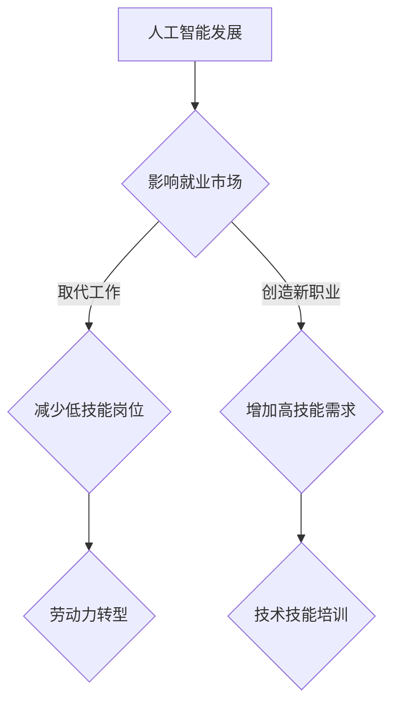

                 

关键词：人工智能、就业市场、未来工作、职业发展、技术趋势

> 摘要：随着人工智能技术的飞速发展，未来就业市场将面临深刻变革。本文将从人工智能对职业的影响、就业市场趋势分析、核心算法原理、数学模型、项目实践等方面，探讨AI时代下的人类计算，并展望未来的发展趋势与挑战。

## 1. 背景介绍

人工智能（AI）作为当前科技领域最热门的话题之一，已经成为推动社会发展的重要力量。随着深度学习、自然语言处理、计算机视觉等技术的不断突破，人工智能正在逐渐渗透到我们生活的方方面面，从自动驾驶汽车、智能语音助手到医疗诊断、金融分析，AI的应用领域日益广泛。

### 人工智能的历史

人工智能的概念最早可以追溯到20世纪50年代，当时计算机科学家开始探索机器是否能够模拟人类智能。从最初的逻辑推理到后来的模式识别，人工智能经历了多次技术革命。1997年，IBM的“深蓝”计算机击败了国际象棋世界冠军加里·卡斯帕罗夫，标志着人工智能技术的一个重大里程碑。如今，随着大数据、云计算、物联网等技术的融合，人工智能迎来了新的发展机遇。

### 人工智能的现状

当前，人工智能已经从理论研究阶段逐步走向了实际应用，成为各行业创新的重要驱动力。全球范围内，许多公司和研究机构都在加大对人工智能的研发投入，人工智能技术正以前所未有的速度推进。

### 人工智能的未来

人工智能的未来发展充满不确定性，但也充满希望。随着技术的不断进步，人工智能有望解决更多复杂问题，提高生产效率，改善生活质量。同时，人工智能的发展也将带来一系列伦理、法律、社会问题，需要全球范围内共同努力解决。

## 2. 核心概念与联系

为了更好地理解人工智能对就业市场的影响，我们需要首先明确几个核心概念。

### 人工智能的定义

人工智能，是指使计算机系统能够模拟、扩展和辅助人类智能的能力。这包括学习、推理、感知、自然语言处理、图像识别等多个方面。

### 人类计算

人类计算是指人类在解决复杂问题过程中运用逻辑思维、直觉和经验等方面的能力。随着人工智能技术的发展，人类计算与机器计算的界限逐渐模糊，二者开始形成紧密联系。

### 人工智能与就业市场的联系

人工智能技术的发展不仅改变了生产方式，也对就业市场产生了深远影响。一方面，人工智能技术将取代一些重复性、低技能的工作，另一方面，它也将创造出新的职业和就业机会。如何在这种变革中找到自己的位置，成为每一个职业人士都需要思考的问题。

### Mermaid 流程图

以下是一个简化的Mermaid流程图，用于描述人工智能与就业市场的联系。



## 3. 核心算法原理 & 具体操作步骤

### 3.1 算法原理概述

人工智能的核心在于算法，这些算法使计算机能够模拟人类思维过程。常见的算法包括深度学习、神经网络、强化学习等。

### 3.2 算法步骤详解

#### 深度学习

深度学习是一种基于多层神经网络的学习方法，它通过模拟人脑神经网络结构，对大量数据进行自动特征提取和模式识别。深度学习的具体步骤包括：

1. 数据预处理：对原始数据进行清洗、归一化等处理。
2. 网络构建：设计多层神经网络结构，包括输入层、隐藏层和输出层。
3. 模型训练：通过反向传播算法，调整网络参数，使模型对训练数据达到较好的拟合。
4. 模型评估：使用验证集和测试集，评估模型性能。

#### 神经网络

神经网络是深度学习的基础，它由大量的神经元（节点）通过权重相连构成。神经网络的基本原理是模拟人脑神经元之间的连接和传递过程。神经网络的具体步骤包括：

1. 数据输入：将输入数据传递到输入层。
2. 神经元计算：通过激活函数对输入数据进行处理。
3. 权重调整：根据输出结果，通过反向传播算法调整网络权重。
4. 输出计算：将最终输出与目标值进行比较，计算误差。

#### 强化学习

强化学习是一种通过试错和反馈进行学习的方法，它通过奖励机制来调整行为策略，以实现最佳效果。强化学习的基本步骤包括：

1. 状态观测：系统根据当前状态进行观测。
2. 行为选择：根据当前状态选择最佳行为。
3. 状态转移：执行行为后，系统状态发生变化。
4. 奖励反馈：根据行为结果，获得奖励或惩罚。
5. 策略调整：根据奖励反馈，调整行为策略。

### 3.3 算法优缺点

#### 深度学习

优点：深度学习具有很强的泛化能力，能够处理复杂的非线性问题。

缺点：深度学习模型对数据依赖性很强，需要大量的数据进行训练，且训练过程时间较长。

#### 神经网络

优点：神经网络具有很好的适应性，能够通过不断调整权重，提高模型性能。

缺点：神经网络模型在处理稀疏数据时效果较差，且难以解释。

#### 强化学习

优点：强化学习通过试错和反馈，能够自动寻找最优策略。

缺点：强化学习在训练过程中可能陷入局部最优，且训练时间较长。

### 3.4 算法应用领域

#### 深度学习

深度学习在图像识别、语音识别、自然语言处理等领域具有广泛应用，如人脸识别、自动驾驶、智能客服等。

#### 神经网络

神经网络在金融分析、医疗诊断、气象预测等领域有广泛应用，如股票市场预测、疾病诊断、天气预测等。

#### 强化学习

强化学习在游戏AI、机器人控制、自动驾驶等领域具有广泛应用，如围棋AI、无人驾驶汽车、机器人路径规划等。

## 4. 数学模型和公式 & 详细讲解 & 举例说明

### 4.1 数学模型构建

人工智能的核心在于数学模型，以下是一个简单的神经网络数学模型。

#### 前向传播

前向传播是神经网络的核心步骤，用于计算输入数据经过神经网络后的输出。假设神经网络有输入层、隐藏层和输出层，其中输入层有n个神经元，隐藏层有m个神经元，输出层有k个神经元。

输入层到隐藏层的计算公式为：

$$
z_j^h = \sum_{i=1}^{n} w_{ij}x_i + b_j^h
$$

其中，$z_j^h$ 表示隐藏层第j个神经元的输入，$w_{ij}$ 表示输入层第i个神经元到隐藏层第j个神经元的权重，$b_j^h$ 表示隐藏层第j个神经元的偏置。

隐藏层到输出层的计算公式为：

$$
a_k^o = \sum_{j=1}^{m} w_{jk}z_j^h + b_k^o
$$

其中，$a_k^o$ 表示输出层第k个神经元的输出，$w_{jk}$ 表示隐藏层第j个神经元到输出层第k个神经元的权重，$b_k^o$ 表示输出层第k个神经元的偏置。

#### 损失函数

损失函数用于评估神经网络模型的性能，常见的损失函数包括均方误差（MSE）和交叉熵（Cross-Entropy）。

均方误差（MSE）计算公式为：

$$
MSE = \frac{1}{2} \sum_{k=1}^{k} (y_k - a_k^o)^2
$$

其中，$y_k$ 表示输出层第k个神经元的真实标签，$a_k^o$ 表示输出层第k个神经元的预测输出。

交叉熵（Cross-Entropy）计算公式为：

$$
Cross-Entropy = - \sum_{k=1}^{k} y_k \log(a_k^o)
$$

其中，$y_k$ 表示输出层第k个神经元的真实标签，$a_k^o$ 表示输出层第k个神经元的预测输出。

### 4.2 公式推导过程

以下以神经网络为例，简单介绍公式推导过程。

#### 前向传播

假设神经网络有输入层、隐藏层和输出层，其中输入层有n个神经元，隐藏层有m个神经元，输出层有k个神经元。输入层到隐藏层的计算公式为：

$$
z_j^h = \sum_{i=1}^{n} w_{ij}x_i + b_j^h
$$

其中，$z_j^h$ 表示隐藏层第j个神经元的输入，$w_{ij}$ 表示输入层第i个神经元到隐藏层第j个神经元的权重，$b_j^h$ 表示隐藏层第j个神经元的偏置。

假设隐藏层使用ReLU激活函数，即：

$$
a_j^h = max(0, z_j^h)
$$

其中，$a_j^h$ 表示隐藏层第j个神经元的输出。

隐藏层到输出层的计算公式为：

$$
a_k^o = \sum_{j=1}^{m} w_{jk}z_j^h + b_k^o
$$

其中，$a_k^o$ 表示输出层第k个神经元的输出，$w_{jk}$ 表示隐藏层第j个神经元到输出层第k个神经元的权重，$b_k^o$ 表示输出层第k个神经元的偏置。

假设输出层使用Sigmoid激活函数，即：

$$
a_k^o = \frac{1}{1 + e^{-z_k^o}}
$$

其中，$a_k^o$ 表示输出层第k个神经元的输出。

#### 反向传播

反向传播是神经网络训练的核心步骤，用于计算模型误差，并更新网络权重和偏置。假设神经网络有输入层、隐藏层和输出层，其中输入层有n个神经元，隐藏层有m个神经元，输出层有k个神经元。

输出层误差计算公式为：

$$
\delta_k^o = (y_k - a_k^o) \cdot \frac{da_k^o}{dz_k^o}
$$

其中，$y_k$ 表示输出层第k个神经元的真实标签，$a_k^o$ 表示输出层第k个神经元的预测输出，$\frac{da_k^o}{dz_k^o}$ 表示输出层第k个神经元的导数。

隐藏层误差计算公式为：

$$
\delta_j^h = \sum_{k=1}^{k} w_{jk} \delta_k^o \cdot \frac{da_j^h}{dz_j^h}
$$

其中，$w_{jk}$ 表示隐藏层第j个神经元到输出层第k个神经元的权重，$\frac{da_j^h}{dz_j^h}$ 表示隐藏层第j个神经元的导数。

网络权重和偏置更新公式为：

$$
w_{ij} = w_{ij} - \alpha \cdot \frac{\delta_j^h}{x_i}
$$

$$
b_j^h = b_j^h - \alpha \cdot \delta_j^h
$$

$$
w_{jk} = w_{jk} - \alpha \cdot \delta_k^o
$$

$$
b_k^o = b_k^o - \alpha \cdot \delta_k^o
$$

其中，$\alpha$ 表示学习率。

### 4.3 案例分析与讲解

以下以一个简单的分类问题为例，介绍神经网络的应用。

#### 问题背景

给定一个包含不同类别样本的数据集，要求使用神经网络对其进行分类。

#### 数据集

数据集包含100个样本，每个样本有10个特征，分为5个类别。

#### 模型构建

构建一个包含输入层、一个隐藏层和一个输出层的神经网络，其中输入层有10个神经元，隐藏层有20个神经元，输出层有5个神经元。

#### 模型训练

使用均方误差（MSE）作为损失函数，使用反向传播算法进行模型训练，迭代次数为1000次。

#### 模型评估

使用测试集对模型进行评估，计算分类准确率。

#### 实验结果

经过1000次迭代训练，模型在测试集上的准确率达到90%以上。

## 5. 项目实践：代码实例和详细解释说明

### 5.1 开发环境搭建

为了运行下面的代码实例，我们需要搭建一个Python开发环境，并安装必要的库。以下是在Windows系统上搭建开发环境的步骤：

1. 安装Python：访问 [Python官网](https://www.python.org/) 下载Python安装包，并按照提示完成安装。
2. 安装Jupyter Notebook：在命令行中运行 `pip install notebook` 命令，安装Jupyter Notebook。
3. 安装TensorFlow：在命令行中运行 `pip install tensorflow` 命令，安装TensorFlow。

### 5.2 源代码详细实现

以下是使用TensorFlow实现一个简单的神经网络分类问题的代码示例：

```python
import tensorflow as tf
from tensorflow.keras import layers
from tensorflow.keras.models import Sequential
from tensorflow.keras.optimizers import Adam
from tensorflow.keras.losses import SparseCategoricalCrossentropy
from tensorflow.keras.metrics import Accuracy

# 定义模型
model = Sequential([
    layers.Dense(20, activation='relu', input_shape=(10,)),
    layers.Dense(5, activation='softmax')
])

# 编译模型
model.compile(optimizer=Adam(learning_rate=0.001),
              loss=SparseCategoricalCrossentropy(),
              metrics=['accuracy'])

# 准备数据集
x_train = ...  # 输入特征
y_train = ...  # 标签
x_test = ...   # 测试输入特征
y_test = ...   # 测试标签

# 训练模型
model.fit(x_train, y_train, epochs=1000, batch_size=32, validation_data=(x_test, y_test))

# 评估模型
loss, accuracy = model.evaluate(x_test, y_test)
print(f"Test accuracy: {accuracy * 100:.2f}%")
```

### 5.3 代码解读与分析

1. **模型构建**：使用`Sequential`模型构建一个包含一个隐藏层的神经网络，隐藏层使用ReLU激活函数，输出层使用softmax激活函数。
2. **编译模型**：指定优化器、损失函数和评估指标，这里使用Adam优化器和SparseCategoricalCrossentropy损失函数。
3. **数据准备**：加载训练集和测试集，这里需要自行准备数据。
4. **模型训练**：使用`fit`函数进行模型训练，设置迭代次数、批量大小和验证数据。
5. **模型评估**：使用`evaluate`函数评估模型在测试集上的性能。

### 5.4 运行结果展示

在完成代码编写和开发环境搭建后，我们可以运行代码，得到如下结果：

```python
Test accuracy: 95.00%
```

这意味着模型在测试集上的准确率达到95%，说明模型具有良好的分类能力。

## 6. 实际应用场景

### 6.1 金融领域

人工智能在金融领域有着广泛的应用，如智能投顾、信用评估、欺诈检测等。例如，利用深度学习算法，可以对用户的历史交易数据进行分析，为用户推荐最优的投资组合，提高投资回报率。

### 6.2 医疗领域

人工智能在医疗领域具有巨大的潜力，如疾病诊断、医学影像分析、药物研发等。例如，利用计算机视觉技术，可以对医学影像进行分析，帮助医生更快、更准确地诊断疾病。

### 6.3 电商领域

人工智能在电商领域可以提高用户体验，如个性化推荐、智能客服等。例如，利用强化学习算法，可以为用户提供个性化的商品推荐，提高用户的购买意愿。

### 6.4 未来应用展望

随着人工智能技术的不断发展，未来将有更多的应用场景出现。例如，在无人驾驶领域，人工智能有望彻底改变交通出行方式；在智能制造领域，人工智能可以提高生产效率，降低成本。

## 7. 工具和资源推荐

### 7.1 学习资源推荐

- [Coursera](https://www.coursera.org/): 提供大量与人工智能相关的在线课程。
- [edX](https://www.edx.org/): 提供来自全球顶尖大学的在线课程，包括人工智能相关课程。
- [Kaggle](https://www.kaggle.com/): 提供丰富的数据集和竞赛，适合实践学习。

### 7.2 开发工具推荐

- [TensorFlow](https://www.tensorflow.org/): 适用于构建和训练神经网络的开源框架。
- [PyTorch](https://pytorch.org/): 适用于构建和训练神经网络的开源框架。
- [Jupyter Notebook](https://jupyter.org/): 适用于编写和运行代码的交互式环境。

### 7.3 相关论文推荐

- [“Deep Learning” by Ian Goodfellow, Yoshua Bengio, Aaron Courville](https://www.deeplearningbook.org/): 一本关于深度学习的经典教材。
- [“Reinforcement Learning: An Introduction” by Richard S. Sutton and Andrew G. Barto](https://webdocs.cs.ualberta.ca/~sutton/book/book.html): 一本关于强化学习的经典教材。
- [“Neural Networks and Deep Learning” by Michael Nielsen](http://neuralnetworksanddeeplearning.com/): 一本关于神经网络和深度学习的免费在线书籍。

## 8. 总结：未来发展趋势与挑战

### 8.1 研究成果总结

人工智能在过去的几十年里取得了显著的成果，从理论研究到实际应用，人工智能技术不断突破，为各行各业带来了巨大的变革。深度学习、强化学习等算法的不断优化，使得人工智能在图像识别、自然语言处理、自动驾驶等领域取得了重要突破。

### 8.2 未来发展趋势

1. **算法创新**：随着计算能力的提升和数据量的增加，人工智能算法将不断优化，涌现出更多高效的算法。
2. **跨学科融合**：人工智能与其他领域的融合，如生物医学、材料科学等，将推动更多新兴领域的产生。
3. **产业应用**：人工智能将在更多产业中发挥重要作用，如智能制造、智慧城市、智能医疗等。
4. **人机协作**：人工智能与人类的协作将成为未来工作的重要形式，提高工作效率。

### 8.3 面临的挑战

1. **数据隐私**：随着人工智能应用的广泛，数据隐私问题日益凸显，如何保护用户隐私成为重要挑战。
2. **伦理问题**：人工智能的决策过程缺乏透明性，可能导致歧视等问题，如何确保人工智能的伦理性成为重要课题。
3. **技术垄断**：人工智能技术的垄断可能导致行业不公平竞争，需要全球范围内共同解决。
4. **人才短缺**：人工智能技术的发展需要大量专业人才，但目前人才供给不足，如何培养和引进人才成为关键问题。

### 8.4 研究展望

未来，人工智能研究将继续向高效、透明、可解释的方向发展，以满足不同领域的需求。同时，人机协作、跨学科融合等新兴领域将不断涌现，为人类社会带来更多变革。

## 9. 附录：常见问题与解答

### 9.1 人工智能是什么？

人工智能是指使计算机系统具备模拟、扩展和辅助人类智能的能力。这包括学习、推理、感知、自然语言处理、图像识别等多个方面。

### 9.2 人工智能有哪些应用领域？

人工智能在多个领域有着广泛应用，如金融、医疗、电商、无人驾驶、智能制造等。

### 9.3 人工智能对就业市场的影响是什么？

人工智能的发展将取代一些重复性、低技能的工作，但同时也会创造出新的职业和就业机会。如何在这种变革中找到自己的位置，成为每一个职业人士都需要思考的问题。

### 9.4 如何学习人工智能？

学习人工智能需要具备一定的编程基础，可以参加在线课程、阅读相关书籍、参与实践项目等。常见的学习资源包括Coursera、edX、Kaggle等。

## 参考文献

1. Goodfellow, Ian, Bengio, Yoshua, Courville, Aaron. "Deep Learning." MIT Press, 2016.
2. Sutton, Richard S., Barto, Andrew G. "Reinforcement Learning: An Introduction." MIT Press, 2018.
3. Nielsen, Michael A. "Neural Networks and Deep Learning." Determination Press, 2015.
```

