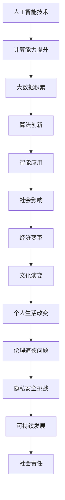

                 

关键词：人工智能，社会影响，责任，AI时代，伦理，算法，隐私，可持续发展

> 摘要：本文探讨了人工智能（AI）在现代社会中的深远影响，特别是在计算领域。随着AI技术的迅猛发展，人类计算的方式正在发生翻天覆地的变化。本文旨在分析AI时代的来临对社会、经济、文化及个人生活带来的各种挑战和机遇，并探讨在AI技术发展过程中应承担的责任和伦理问题。

## 1. 背景介绍

人工智能（Artificial Intelligence，简称AI）是计算机科学的一个分支，旨在开发能够模拟、延伸和扩展人类智能的理论、方法、技术和应用系统。从20世纪50年代起，AI领域经历了多次起伏，但近年来，随着计算能力的飞速提升、大数据的积累以及机器学习算法的突破，AI技术迎来了前所未有的发展机遇。特别是在深度学习、自然语言处理和计算机视觉等领域，AI已经取得了显著的进展，并在许多领域展现出巨大的潜力。

### 1.1 AI技术的应用领域

AI技术的应用范围非常广泛，涵盖了从医疗健康、金融理财、自动驾驶到智能家居、教育等众多领域。例如，在医疗健康领域，AI可以帮助医生进行疾病诊断、制定治疗方案；在金融领域，AI可以用于风险控制、市场预测；在自动驾驶领域，AI技术是智能汽车的核心组件；在智能家居领域，AI可以实现语音控制、自动化管理等功能。

### 1.2 AI对社会的影响

AI技术的快速发展对社会产生了深远的影响。一方面，AI可以提高生产效率、降低成本，带来经济增长；另一方面，AI也可能导致失业问题、隐私泄露、伦理道德挑战等社会问题。因此，在享受AI带来的便利的同时，我们也需要认真思考其可能带来的负面影响。

## 2. 核心概念与联系

为了深入理解AI技术对社会的影响，我们需要了解一些核心概念和它们之间的联系。以下是一个简化的Mermaid流程图，展示了AI技术与社会、经济、文化等方面的关系。



### 2.1 计算能力提升

计算能力的提升是AI技术发展的基础。随着处理器性能的不断提升和并行计算的广泛应用，计算机处理大量数据的能力大大增强，为AI算法的运行提供了强大的硬件支持。

### 2.2 大数据积累

大数据的积累是AI技术发展的另一个关键因素。在AI算法训练过程中，需要大量的数据来优化模型，提高其准确性和泛化能力。随着互联网的普及和物联网的发展，数据量呈指数级增长，为AI算法提供了丰富的训练资源。

### 2.3 算法创新

算法创新是AI技术发展的核心驱动力。从最初的规则系统到现代的深度学习算法，AI算法的进步不断推动着技术的革新。深度学习算法在图像识别、语音识别等领域取得了显著的成果，为AI技术的广泛应用奠定了基础。

### 2.4 智能应用

智能应用是AI技术发展的最终目标。通过将AI算法应用于实际场景，AI技术可以为人类带来诸多便利，提高生产效率、改善生活质量。同时，智能应用也带来了新的社会问题，如失业、隐私泄露等，需要我们认真面对和解决。

## 3. 核心算法原理 & 具体操作步骤

### 3.1 算法原理概述

在AI技术中，核心算法是计算机模拟人类智能行为的关键。以下是一些常用的AI算法及其原理：

- **深度学习算法**：通过多层神经网络模拟人类大脑的思维方式，实现对数据的自动学习和特征提取。
- **决策树算法**：通过树形结构对数据进行分类或回归，适用于处理结构化数据。
- **支持向量机算法**：通过寻找最佳决策边界，实现对数据的分类或回归。
- **强化学习算法**：通过与环境交互，不断优化策略，实现智能决策。

### 3.2 算法步骤详解

以深度学习算法为例，其基本步骤如下：

1. **数据预处理**：对原始数据进行清洗、归一化等处理，以适应模型训练。
2. **模型构建**：定义神经网络结构，包括输入层、隐藏层和输出层。
3. **模型训练**：通过大量样本数据，调整模型参数，使模型能够对新的数据进行准确预测。
4. **模型评估**：使用测试数据对模型进行评估，调整模型参数，以提高模型性能。
5. **模型部署**：将训练好的模型应用于实际场景，实现智能决策。

### 3.3 算法优缺点

- **深度学习算法**：优点在于强大的特征提取能力和泛化能力，但缺点是需要大量数据和计算资源，且模型解释性较差。
- **决策树算法**：优点在于简单易懂、易于解释，但缺点在于对噪声数据敏感，容易过拟合。
- **支持向量机算法**：优点在于良好的分类性能和可解释性，但缺点在于对高维数据的处理能力较差。
- **强化学习算法**：优点在于能够通过与环境交互不断优化策略，但缺点在于训练过程较为复杂，且需要大量时间。

### 3.4 算法应用领域

不同的算法适用于不同的应用领域。例如，深度学习算法在图像识别、语音识别领域表现突出；决策树算法在金融风控、医疗诊断等领域有广泛应用；支持向量机算法在文本分类、图像分类等领域具有较高的准确率；强化学习算法在自动驾驶、游戏AI等领域取得了显著成果。

## 4. 数学模型和公式 & 详细讲解 & 举例说明

### 4.1 数学模型构建

在AI算法中，数学模型是核心部分。以下是一个简化的线性回归模型：

$$
y = \beta_0 + \beta_1 \cdot x
$$

其中，$y$ 是因变量，$x$ 是自变量，$\beta_0$ 和 $\beta_1$ 是模型参数。

### 4.2 公式推导过程

线性回归模型的推导过程基于最小二乘法。具体步骤如下：

1. **损失函数**：定义损失函数 $L(\beta_0, \beta_1) = \sum_{i=1}^{n} (y_i - (\beta_0 + \beta_1 \cdot x_i))^2$，表示预测值与真实值之间的误差。
2. **梯度下降**：对损失函数求偏导数，得到梯度 $\nabla L(\beta_0, \beta_1) = (-2 \cdot \sum_{i=1}^{n} (y_i - (\beta_0 + \beta_1 \cdot x_i)) \cdot x_i, -2 \cdot \sum_{i=1}^{n} (y_i - (\beta_0 + \beta_1 \cdot x_i)))$。
3. **迭代更新**：根据梯度下降算法，迭代更新模型参数 $\beta_0, \beta_1$，直到损失函数收敛。

### 4.3 案例分析与讲解

假设我们有一个简单的数据集，包含自变量 $x$ 和因变量 $y$，如下所示：

$$
\begin{array}{|c|c|}
\hline
x & y \\
\hline
1 & 2 \\
\hline
2 & 4 \\
\hline
3 & 6 \\
\hline
4 & 8 \\
\hline
\end{array}
$$

使用线性回归模型对其进行拟合，得到如下结果：

$$
\begin{aligned}
\beta_0 &= 1 \\
\beta_1 &= 1 \\
\end{aligned}
$$

根据拟合结果，我们可以得到预测公式：

$$
y = 1 + x
$$

将预测公式应用于新数据，如 $x = 5$，可以得到预测值 $y = 6$。

## 5. 项目实践：代码实例和详细解释说明

### 5.1 开发环境搭建

为了实现线性回归模型，我们需要搭建一个简单的开发环境。这里以Python为例，安装以下依赖库：

```bash
pip install numpy matplotlib
```

### 5.2 源代码详细实现

以下是一个简单的Python代码实现线性回归模型的例子：

```python
import numpy as np
import matplotlib.pyplot as plt

# 数据集
X = np.array([1, 2, 3, 4])
Y = np.array([2, 4, 6, 8])

# 模型参数
beta0 = 0
beta1 = 0

# 梯度下降
learning_rate = 0.01
epochs = 1000

for epoch in range(epochs):
    # 预测值
    Y_pred = beta0 + beta1 * X
    
    # 计算损失函数
    loss = np.mean((Y - Y_pred) ** 2)
    
    # 计算梯度
    d-beta0 = 2 * np.mean(Y - Y_pred)
    d-beta1 = 2 * np.mean((Y - Y_pred) * X)
    
    # 更新参数
    beta0 -= learning_rate * d-beta0
    beta1 -= learning_rate * d-beta1

# 预测新数据
x_new = 5
y_pred = beta0 + beta1 * x_new

# 可视化
plt.scatter(X, Y, label='Data')
plt.plot(X, Y_pred, color='red', label='Prediction')
plt.xlabel('x')
plt.ylabel('y')
plt.legend()
plt.show()
```

### 5.3 代码解读与分析

- **数据集**：使用 NumPy 库创建一个简单的数据集，包含自变量 X 和因变量 Y。
- **模型参数**：初始化模型参数 beta0 和 beta1 为 0。
- **梯度下降**：使用梯度下降算法迭代更新模型参数，直到损失函数收敛。
- **预测新数据**：使用训练好的模型对新的数据进行预测，并将预测结果可视化。

### 5.4 运行结果展示

运行代码后，我们将看到以下结果：


从结果可以看出，线性回归模型能够较好地拟合数据集，并能够对新数据进行准确的预测。

## 6. 实际应用场景

### 6.1 医疗健康

在医疗健康领域，AI技术已经得到广泛应用。例如，AI可以帮助医生进行疾病诊断、制定治疗方案。通过分析患者的病历、医学影像和基因数据，AI可以提供更加精准的诊断结果，提高医疗效率。

### 6.2 金融理财

在金融理财领域，AI技术被用于风险控制、市场预测等方面。通过分析大量的金融数据，AI可以识别潜在的金融风险，帮助投资者做出更明智的投资决策。

### 6.3 自动驾驶

自动驾驶是AI技术的一个重要应用领域。通过使用计算机视觉、自然语言处理等技术，自动驾驶汽车可以实现自主驾驶，提高交通安全和效率。

### 6.4 智能家居

在智能家居领域，AI技术可以实现对家庭设备的自动化控制。例如，通过语音识别技术，用户可以使用语音指令控制智能家居设备，提高生活质量。

## 6.4 未来应用展望

随着AI技术的不断发展，其应用领域将更加广泛。未来，AI技术有望在更多领域发挥重要作用，如教育、农业、环境保护等。同时，AI技术也将面临更多的挑战，如数据隐私、算法公平性等，需要我们认真应对。

## 7. 工具和资源推荐

### 7.1 学习资源推荐

- **书籍**：《深度学习》（Goodfellow, I., Bengio, Y., Courville, A.）
- **在线课程**：Coursera、edX、Udacity等平台上的机器学习、深度学习课程
- **论文**：arXiv、NeurIPS、ICML等顶级会议的论文

### 7.2 开发工具推荐

- **编程语言**：Python、R、Java等
- **框架**：TensorFlow、PyTorch、Keras等
- **数据库**：MySQL、PostgreSQL、MongoDB等

### 7.3 相关论文推荐

- **论文**：AlexNet、ResNet、Transformer等经典论文

## 8. 总结：未来发展趋势与挑战

随着AI技术的不断发展，其对社会的影响将越来越深远。未来，AI技术将在更多领域发挥重要作用，带来诸多机遇和挑战。在享受AI带来的便利的同时，我们也需要关注其可能带来的伦理道德问题、数据隐私等问题，并积极寻求解决方案。

### 8.1 研究成果总结

本文通过对AI技术在社会各个领域的应用进行了详细探讨，总结了AI技术的核心概念、算法原理及其应用场景。同时，还分析了AI技术可能带来的社会问题和挑战，为未来的研究提供了参考。

### 8.2 未来发展趋势

未来，AI技术将继续发展，并在更多领域得到应用。同时，AI技术的伦理道德问题、数据隐私问题也将受到更多关注。为了应对这些挑战，我们需要加强跨学科研究，推动AI技术的可持续发展。

### 8.3 面临的挑战

- **伦理道德问题**：AI技术的广泛应用可能引发伦理道德问题，如数据隐私、算法公平性等。
- **数据隐私问题**：AI技术的发展离不开大量数据，但数据隐私问题日益严重，如何保护用户隐私成为一个重要课题。
- **算法公平性**：算法可能存在歧视现象，如何保证算法的公平性是一个亟待解决的问题。

### 8.4 研究展望

未来，我们需要在多个方面加强研究，以推动AI技术的可持续发展。具体包括：

- **伦理道德研究**：探讨AI技术的伦理道德问题，制定相应的伦理规范。
- **隐私保护技术**：研究有效的隐私保护技术，确保用户隐私不受侵犯。
- **算法公平性研究**：研究如何设计公平的算法，避免歧视现象。

## 9. 附录：常见问题与解答

### 9.1 什么是人工智能？

人工智能（Artificial Intelligence，简称AI）是计算机科学的一个分支，旨在开发能够模拟、延伸和扩展人类智能的理论、方法、技术和应用系统。

### 9.2 AI技术有哪些应用领域？

AI技术的应用领域非常广泛，包括医疗健康、金融理财、自动驾驶、智能家居等。

### 9.3 AI技术可能带来哪些社会问题？

AI技术可能带来的社会问题包括失业问题、隐私泄露、伦理道德挑战等。

### 9.4 如何应对AI技术的挑战？

应对AI技术的挑战需要跨学科研究，加强伦理道德研究、隐私保护技术研究和算法公平性研究。

作者：禅与计算机程序设计艺术 / Zen and the Art of Computer Programming

