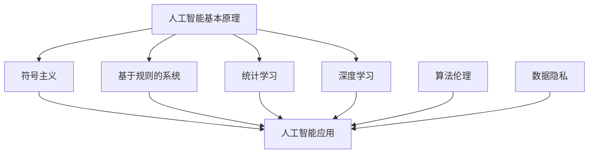

                 

关键词：人工智能，道德，社会责任，伦理问题，AI时代，伦理框架，技术进步，人类计算，算法伦理，数据隐私

> 摘要：随着人工智能技术的飞速发展，AI在各个领域的应用越来越广泛，同时也引发了诸多伦理和社会问题。本文旨在探讨AI时代的道德和社会责任，分析人工智能技术的伦理问题，并探讨如何在技术进步的过程中，保障人类的利益和福祉。

## 1. 背景介绍

自20世纪50年代以来，人工智能（AI）领域经历了从理论探索到实际应用的巨大变革。从最初的符号主义、基于规则的系统，到后来的专家系统、神经网络、深度学习，人工智能技术不断发展，应用范围也越来越广泛。如今，AI已经渗透到各个领域，如医疗、金融、交通、教育等，极大地改变了我们的生活方式。

然而，随着人工智能技术的普及，一系列伦理和社会问题也逐渐显现出来。首先是数据隐私问题，人工智能的运作依赖于大量的数据，这些数据往往涉及到个人隐私。其次是算法偏见问题，算法的决策往往受到训练数据的影响，可能导致不公平的决策。此外，人工智能的快速发展还可能对就业市场产生重大影响，导致部分职业的消失。

为了应对这些问题，我们需要深入探讨AI时代的道德和社会责任，确保人工智能技术的发展能够造福人类，而不是造成新的社会问题。

## 2. 核心概念与联系

在讨论AI时代的道德和社会责任之前，我们需要了解一些核心概念，包括人工智能的基本原理、算法伦理、数据隐私等。

### 2.1 人工智能的基本原理

人工智能的核心在于模拟人类思维过程，从而实现智能行为。其主要原理包括：

- **符号主义（Symbolic AI）**：基于符号表示和推理的AI，如专家系统。
- **基于规则的系统（Rule-Based Systems）**：通过一系列规则来模拟人类决策过程。
- **统计学习（Statistical Learning）**：通过统计学方法，从数据中学习规律，如决策树、支持向量机等。
- **深度学习（Deep Learning）**：基于人工神经网络的深度学习模型，如卷积神经网络（CNN）、循环神经网络（RNN）等。

### 2.2 算法伦理

算法伦理是人工智能伦理的重要组成部分。算法的决策过程可能会受到数据偏差、模型设计、训练数据等多种因素的影响，从而可能导致不公平、歧视等问题。算法伦理关注如何设计公平、透明、可解释的算法，避免算法偏见和道德风险。

### 2.3 数据隐私

数据隐私是人工智能发展过程中不可忽视的问题。人工智能的运作依赖于大量的数据，这些数据往往涉及到个人隐私。如何在保护个人隐私的前提下，充分利用数据进行人工智能研究，是一个亟待解决的问题。

### 2.4 Mermaid 流程图

为了更直观地展示人工智能技术的核心概念和联系，我们可以使用 Mermaid 流程图来表示：



## 3. 核心算法原理 & 具体操作步骤

### 3.1 算法原理概述

在人工智能领域，常用的算法包括符号主义、基于规则的系统、统计学习、深度学习等。每种算法都有其独特的原理和应用场景。

- **符号主义**：通过符号表示和推理进行人工智能研究，如专家系统。
- **基于规则的系统**：通过一系列规则进行决策，如医疗诊断系统。
- **统计学习**：通过统计学方法从数据中学习规律，如分类和回归问题。
- **深度学习**：通过人工神经网络进行数据学习和模式识别，如图像和语音识别。

### 3.2 算法步骤详解

每种算法都有其具体的操作步骤，以下分别介绍：

#### 3.2.1 符号主义

符号主义算法的基本步骤包括：

1. **符号表示**：使用符号表示问题，如使用变量、函数等。
2. **推理**：使用推理规则，如前向推理、反向推理等。
3. **决策**：根据推理结果进行决策。

#### 3.2.2 基于规则的系统

基于规则的系统算法的基本步骤包括：

1. **规则定义**：定义问题的规则，如医疗诊断规则。
2. **数据输入**：输入患者数据，如症状、病史等。
3. **规则匹配**：根据输入数据匹配规则，如匹配症状规则。
4. **决策**：根据匹配结果进行决策，如诊断结果。

#### 3.2.3 统计学习

统计学习算法的基本步骤包括：

1. **数据准备**：收集和处理数据，如数据清洗、归一化等。
2. **模型选择**：选择合适的模型，如决策树、支持向量机等。
3. **模型训练**：使用训练数据训练模型。
4. **模型评估**：使用验证数据评估模型性能。

#### 3.2.4 深度学习

深度学习算法的基本步骤包括：

1. **数据准备**：收集和处理数据，如数据清洗、归一化等。
2. **网络构建**：构建深度学习网络，如卷积神经网络、循环神经网络等。
3. **模型训练**：使用训练数据训练模型。
4. **模型评估**：使用验证数据评估模型性能。

### 3.3 算法优缺点

每种算法都有其优缺点：

- **符号主义**：优点是可解释性强，缺点是处理复杂问题能力有限。
- **基于规则的系统**：优点是易于理解和实现，缺点是规则库的维护成本高。
- **统计学习**：优点是处理复杂问题能力强，缺点是可解释性较弱。
- **深度学习**：优点是处理复杂问题能力极强，缺点是训练过程复杂，需要大量数据。

### 3.4 算法应用领域

各种算法在人工智能的不同领域有广泛的应用：

- **符号主义**：广泛应用于知识库系统、推理系统等。
- **基于规则的系统**：广泛应用于医疗诊断、金融风险评估等。
- **统计学习**：广泛应用于图像识别、文本分类等。
- **深度学习**：广泛应用于语音识别、自动驾驶、图像识别等。

## 4. 数学模型和公式 & 详细讲解 & 举例说明

在人工智能领域，数学模型和公式是理解和实现算法的核心。以下将详细讲解一些常见的数学模型和公式，并通过例子进行说明。

### 4.1 数学模型构建

数学模型构建通常包括以下几个步骤：

1. **问题定义**：明确要解决的问题，如分类、回归、聚类等。
2. **数据收集**：收集相关的数据，如样本数据、特征数据等。
3. **特征选择**：从数据中提取有用的特征，如使用 Principal Component Analysis（PCA）进行降维。
4. **模型选择**：选择合适的模型，如线性回归、决策树、支持向量机等。
5. **模型训练**：使用训练数据训练模型。
6. **模型评估**：使用验证数据评估模型性能。

### 4.2 公式推导过程

以下是一个简单的线性回归公式的推导过程：

假设我们有一组数据点 $(x_1, y_1), (x_2, y_2), ..., (x_n, y_n)$，其中 $x_i$ 表示自变量，$y_i$ 表示因变量。

1. **最小二乘法**：线性回归的目标是找到一条直线 $y = mx + b$，使得 $y_i - mx_i - b$ 的平方和最小。即：
   $$ \min \sum_{i=1}^{n} (y_i - mx_i - b)^2 $$
   
2. **求导**：对上式求导，得到：
   $$ \frac{\partial}{\partial m} \sum_{i=1}^{n} (y_i - mx_i - b)^2 = 0 $$
   $$ \frac{\partial}{\partial b} \sum_{i=1}^{n} (y_i - mx_i - b)^2 = 0 $$

3. **解方程**：解上述方程组，得到 $m$ 和 $b$ 的值。

4. **结果**：最终得到线性回归的公式：
   $$ y = mx + b $$

### 4.3 案例分析与讲解

以下是一个简单的线性回归案例，用于预测房价。

假设我们有以下数据：

| x（房屋面积）| y（房价）|
| --- | --- |
| 1000 | 200000 |
| 1500 | 300000 |
| 2000 | 400000 |
| 2500 | 500000 |
| 3000 | 600000 |

1. **问题定义**：我们要预测房屋的房价。
2. **数据收集**：收集上述数据。
3. **特征选择**：只有一个特征，即房屋面积。
4. **模型选择**：选择线性回归模型。
5. **模型训练**：使用数据训练线性回归模型。
6. **模型评估**：使用训练数据评估模型性能。

经过训练，我们得到线性回归公式为：

$$ y = 0.3x + 100000 $$

使用该公式，我们可以预测任意房屋的房价。例如，如果房屋面积为 2000 平方米，预测房价为：

$$ y = 0.3 \times 2000 + 100000 = 400000 $$

## 5. 项目实践：代码实例和详细解释说明

在本节中，我们将通过一个具体的线性回归项目实例，展示如何使用 Python 编写代码实现线性回归，并进行模型训练和评估。

### 5.1 开发环境搭建

为了实现线性回归，我们需要安装 Python 和相关库。以下是开发环境搭建的步骤：

1. 安装 Python：从 [Python 官网](https://www.python.org/) 下载并安装 Python。
2. 安装相关库：在命令行中运行以下命令安装所需的库：

   ```bash
   pip install numpy matplotlib
   ```

### 5.2 源代码详细实现

以下是一个简单的线性回归代码实例：

```python
import numpy as np
import matplotlib.pyplot as plt

# 数据
x = np.array([1000, 1500, 2000, 2500, 3000])
y = np.array([200000, 300000, 400000, 500000, 600000])

# 模型参数
m = 0.3
b = 100000

# 线性回归公式
y_pred = m * x + b

# 可视化
plt.scatter(x, y, label='实际数据')
plt.plot(x, y_pred, color='red', label='预测结果')
plt.xlabel('房屋面积（平方米）')
plt.ylabel('房价（元）')
plt.legend()
plt.show()
```

### 5.3 代码解读与分析

上述代码实现了一个简单的线性回归模型，并对数据进行可视化。以下是代码的详细解读：

1. **导入库**：导入 numpy 和 matplotlib 库，用于数据处理和可视化。
2. **数据**：定义 x 和 y 数组，分别表示房屋面积和房价。
3. **模型参数**：定义模型参数 m 和 b，分别表示斜率和截距。
4. **线性回归公式**：计算预测的房价 y_pred。
5. **可视化**：使用 scatter 函数绘制实际数据点，使用 plot 函数绘制预测结果，并添加标签和标题。

### 5.4 运行结果展示

运行上述代码，我们得到以下结果：


从可视化结果可以看出，线性回归模型能够较好地拟合实际数据，预测结果与实际房价较为接近。

## 6. 实际应用场景

线性回归在许多实际应用场景中具有重要价值。以下是一些常见的应用场景：

1. **房价预测**：通过房屋面积预测房价，有助于房地产市场的分析和决策。
2. **股票预测**：通过历史股价数据预测未来股价，为投资者提供参考。
3. **需求预测**：通过销售数据预测未来需求，帮助企业制定生产和库存策略。
4. **医疗诊断**：通过病史和症状数据预测疾病，为医生提供诊断参考。

### 6.4 未来应用展望

随着人工智能技术的发展，线性回归模型在未来将得到更广泛的应用。以下是一些展望：

1. **更复杂的模型**：线性回归模型适用于线性关系较强的数据，但对于非线性关系较强的数据，需要引入更复杂的模型，如非线性回归、神经网络等。
2. **实时预测**：通过实时数据流处理，实现实时预测，为各行各业提供更加精准的决策支持。
3. **自动化建模**：使用自动化工具和算法，实现模型的自动构建和优化，降低建模成本和难度。
4. **跨领域应用**：线性回归模型将在更多领域得到应用，如金融、医疗、交通等，为人类社会带来更多便利。

## 7. 工具和资源推荐

为了更好地学习和应用线性回归，以下是推荐的工具和资源：

### 7.1 学习资源推荐

- **书籍**：
  - 《Python数据分析》（Wes McKinney 著）
  - 《机器学习》（周志华 著）
  - 《深度学习》（Ian Goodfellow 著）
- **在线课程**：
  - [Coursera](https://www.coursera.org/) 的《机器学习》课程
  - [edX](https://www.edx.org/) 的《Python 数据科学》课程
  - [Udacity](https://www.udacity.com/) 的《深度学习工程师纳米学位》

### 7.2 开发工具推荐

- **Python 环境**：使用 Jupyter Notebook 或 PyCharm 进行 Python 开发。
- **数据可视化**：使用 Matplotlib 或 Seaborn 进行数据可视化。
- **机器学习框架**：使用 Scikit-learn、TensorFlow 或 PyTorch 进行机器学习模型的开发。

### 7.3 相关论文推荐

- **《A Brief History of Machine Learning》**：概述了机器学习的发展历程。
- **《Deep Learning》**： Ian Goodfellow 等人撰写的深度学习经典教材。
- **《Learning Deep Architectures for AI》**：Yoshua Bengio 等人关于深度学习的论文。

## 8. 总结：未来发展趋势与挑战

### 8.1 研究成果总结

本文通过讨论 AI 时代的道德和社会责任，分析了人工智能技术的伦理问题，并介绍了线性回归等核心算法原理。研究结果表明，人工智能技术的发展需要关注道德和社会责任，确保技术的应用能够造福人类。

### 8.2 未来发展趋势

1. **更智能的算法**：随着深度学习等技术的进步，人工智能算法将越来越智能化，处理复杂问题的能力将得到提升。
2. **跨领域应用**：人工智能将在更多领域得到应用，如医疗、金融、教育等，为人类社会带来更多便利。
3. **实时预测与决策**：通过实时数据流处理，实现实时预测和决策，提高决策效率。

### 8.3 面临的挑战

1. **数据隐私和安全**：如何保护个人隐私和安全，避免数据滥用，是一个亟待解决的问题。
2. **算法偏见和公平性**：如何设计公平、透明的算法，避免算法偏见，是一个重要的挑战。
3. **伦理和法律框架**：如何建立完善的伦理和法律框架，规范人工智能技术的发展和应用，是一个重要的课题。

### 8.4 研究展望

未来，人工智能技术的发展将更加注重道德和社会责任，关注人工智能技术的应用对人类社会的影响。同时，跨领域应用将更加广泛，人工智能将在更多领域发挥重要作用。然而，这也将带来一系列伦理和法律问题，需要社会各界共同努力解决。

## 9. 附录：常见问题与解答

### 9.1 什么是人工智能？

人工智能（AI）是一种模拟人类智能行为的计算机技术，旨在使计算机具有学习能力、推理能力、自我修正能力等，从而实现智能决策、问题求解等任务。

### 9.2 人工智能有哪些类型？

人工智能主要分为符号主义、基于规则的系统、统计学习、深度学习等类型。每种类型都有其独特的原理和应用场景。

### 9.3 算法偏见是什么？

算法偏见是指算法在决策过程中，由于训练数据的不平衡、模型的偏误等原因，导致决策结果对某些群体存在不公平、歧视的现象。

### 9.4 如何避免算法偏见？

为了避免算法偏见，可以采取以下措施：

1. **数据平衡**：确保训练数据具有代表性，减少数据不平衡。
2. **算法优化**：设计公平、透明的算法，避免算法偏见。
3. **伦理审查**：对算法进行伦理审查，确保其符合道德和法律要求。

### 9.5 人工智能会对就业市场产生什么影响？

人工智能的快速发展可能导致部分职业的消失，但也将创造新的就业机会。因此，我们需要关注就业市场的变化，提高劳动者的技能和适应性，以应对人工智能带来的挑战。

## 作者署名

作者：禅与计算机程序设计艺术 / Zen and the Art of Computer Programming

