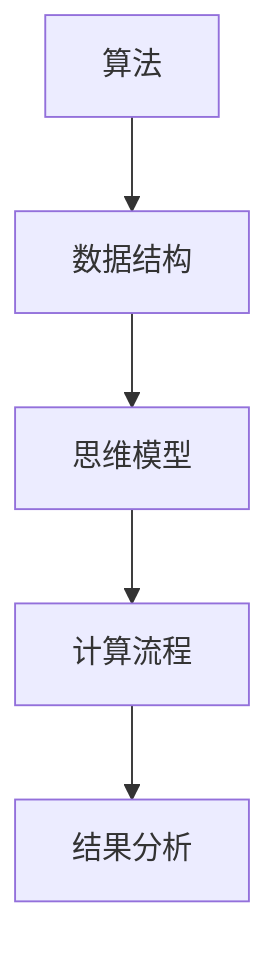

                 

 

> 关键词：人类计算，人工智能，算法原理，数学模型，项目实践，实际应用场景，未来展望

> 摘要：本文旨在探讨人类计算的应用与案例分析，从核心概念到具体实现，再到实际应用场景，全面剖析人类计算的魅力与挑战。通过深入分析算法原理、数学模型和项目实践，我们展望人类计算的未来发展趋势与面临的挑战，为读者提供全面而深入的洞察。

## 1. 背景介绍

人类计算，顾名思义，是指人类在进行计算和数据处理时所采用的思维方式和操作方法。随着计算机科学和人工智能技术的飞速发展，人类计算逐渐成为了一个重要的研究领域。从最早的算盘、算术运算，到现代的复杂算法和人工智能模型，人类计算经历了漫长的演进过程。然而，尽管计算机的运算速度和存储能力日益增强，人类计算在某些方面仍然具有独特的优势和价值。

本文将从以下几个方面对人类计算进行深入探讨：

- **核心概念与联系**：介绍人类计算的基本概念、原理和架构，通过Mermaid流程图展示关键节点。
- **核心算法原理 & 具体操作步骤**：详细阐述人类计算中常用的算法原理和操作步骤，分析其优缺点和应用领域。
- **数学模型和公式 & 举例说明**：构建数学模型，推导公式，并通过案例分析与讲解，展示数学模型在人类计算中的应用。
- **项目实践：代码实例和详细解释说明**：介绍一个实际项目，通过代码实例和详细解释，展示人类计算在实际开发中的应用。
- **实际应用场景**：探讨人类计算在不同领域的应用，如金融、医疗、教育等。
- **未来应用展望**：分析人类计算的未来发展趋势和潜在应用领域。
- **工具和资源推荐**：推荐学习资源、开发工具和相关论文，以帮助读者深入了解人类计算。
- **总结：未来发展趋势与挑战**：总结研究成果，展望未来发展趋势，讨论面临的挑战和研究展望。

## 2. 核心概念与联系

人类计算的核心概念包括算法、数据结构和思维模型。算法是解决问题的步骤集合，数据结构是组织和存储数据的方式，思维模型则是人类进行计算和推理的方法。这三个概念相互关联，共同构成了人类计算的基础。

下面是一个Mermaid流程图，展示了人类计算的关键节点：



- **算法**：算法是解决问题的步骤集合。它由一系列有序指令组成，指导计算机或人类按照特定的方式解决问题。常见的算法有排序、查找、图算法等。
- **数据结构**：数据结构是组织和存储数据的方式。常见的有数组、链表、树、图等。数据结构的选择对算法的效率和性能有很大影响。
- **思维模型**：思维模型是人类进行计算和推理的方法。它包括逻辑推理、归纳推理、演绎推理等。思维模型使得人类能够从海量数据中提取有用信息，进行复杂计算和决策。

通过这个Mermaid流程图，我们可以清晰地看到人类计算的核心概念之间的联系和互动。算法利用数据结构进行计算，思维模型指导算法的执行，最终生成结果并进行分析。

### 2.1 核心算法原理

在人类计算中，算法是解决问题的核心。以下是一些常见的核心算法原理：

#### 排序算法

排序算法是将一组数据按照特定顺序排列的算法。常见的排序算法有冒泡排序、插入排序、选择排序、快速排序等。

- **冒泡排序**：通过多次遍历数组，比较相邻元素的大小，并交换它们的位置，使得较大（或较小）的元素逐渐“冒泡”到数组的末尾。
- **插入排序**：将一个元素插入到已经排序的序列中，使得序列仍然保持有序。插入排序的时间复杂度为O(n^2)，但在数据基本有序时表现较好。
- **选择排序**：每次从未排序的元素中选出最小（或最大）的元素，将其放置到已排序序列的末尾。
- **快速排序**：通过递归将数组分成两个子数组，其中一个子数组的所有元素都小于另一个子数组。递归地在两个子数组上应用快速排序。

#### 查找算法

查找算法是在一组数据中查找特定元素的方法。常见的查找算法有二分查找、线性查找等。

- **二分查找**：在有序数组中查找元素。通过递归地将数组分成两半，每次将中间的元素与目标元素进行比较，缩小查找范围。
- **线性查找**：依次遍历数组，直到找到目标元素或到达数组末尾。

#### 图算法

图算法用于处理图数据结构。常见的图算法有深度优先搜索（DFS）、广度优先搜索（BFS）、最短路径算法（Dijkstra算法、Floyd算法）等。

- **深度优先搜索**：从起点开始，不断深入探索图的分支，直到找到目标节点或访问所有节点。
- **广度优先搜索**：从起点开始，依次访问所有相邻的节点，然后再访问下一层的节点。
- **Dijkstra算法**：用于找到图中从起点到其他所有节点的最短路径。
- **Floyd算法**：用于找到图中所有节点之间的最短路径。

### 2.2 具体操作步骤

下面，我们将对上述核心算法的原理进行详细讲解，并提供具体的操作步骤。

#### 冒泡排序

冒泡排序的基本思想是通过多次遍历数组，比较相邻元素的大小，并交换它们的位置，使得较大（或较小）的元素逐渐“冒泡”到数组的末尾。

- **初始状态**：一个未排序的数组。
- **第一遍遍历**：从数组的第一个元素开始，向后遍历，比较相邻的元素大小，并交换它们的位置，使得最大（或最小）的元素移动到数组的末尾。
- **第二遍遍历**：从数组的第二个元素开始，向后遍历，重复上述过程，使得次大（或次小）的元素移动到数组的倒数第二个位置。
- **重复过程**：重复上述过程，直到整个数组排序完成。

#### 插入排序

插入排序的基本思想是将一个元素插入到已经排序的序列中，使得序列仍然保持有序。插入排序的时间复杂度为O(n^2)，但在数据基本有序时表现较好。

- **初始状态**：一个未排序的数组。
- **第一次插入**：将第二个元素插入到第一个元素已经排序的序列中。
- **第二次插入**：将第三个元素插入到前两个元素已经排序的序列中。
- **重复过程**：重复上述过程，直到整个数组排序完成。

#### 选择排序

选择排序的基本思想是每次从未排序的元素中选出最小（或最大）的元素，将其放置到已排序序列的末尾。

- **初始状态**：一个未排序的数组。
- **第一次选择**：从未排序的元素中选出最小（或最大）的元素，将其放置到已排序序列的末尾。
- **第二次选择**：从剩下的未排序元素中选出最小（或最大）的元素，将其放置到已排序序列的末尾。
- **重复过程**：重复上述过程，直到整个数组排序完成。

#### 冒泡排序的时间复杂度分析

冒泡排序的时间复杂度为O(n^2)。在最坏情况下，当数组逆序时，每次遍历都需要比较n-1次，总共需要进行n-1次遍历，因此时间复杂度为O(n^2)。

#### 插入排序的时间复杂度分析

插入排序的时间复杂度为O(n^2)。在最坏情况下，当数组逆序时，每次插入都需要比较n-1次，总共需要进行n-1次插入，因此时间复杂度为O(n^2)。但在数据基本有序时，插入排序的时间复杂度可以降低到O(n)。

#### 选择排序的时间复杂度分析

选择排序的时间复杂度为O(n^2)。在最坏情况下，每次选择都需要遍历整个未排序的数组，总共需要进行n-1次选择，因此时间复杂度为O(n^2)。

### 3.3 算法优缺点

每种排序算法都有其优缺点，下面将对冒泡排序、插入排序和选择排序的优缺点进行简要分析。

#### 冒泡排序

- **优点**：实现简单，易于理解。
- **缺点**：时间复杂度为O(n^2)，效率较低，不适合大数据量的排序。

#### 插入排序

- **优点**：在数据基本有序时表现较好，时间复杂度可以降低到O(n)。
- **缺点**：时间复杂度为O(n^2)，效率较低，不适合大数据量的排序。

#### 选择排序

- **优点**：实现简单，易于理解。
- **缺点**：时间复杂度为O(n^2)，效率较低，不适合大数据量的排序。

### 3.4 算法应用领域

冒泡排序、插入排序和选择排序虽然时间复杂度较高，但在一些特定场景下仍然具有实际应用价值。

- **冒泡排序**：在数据量较小、数据基本有序的情况下，冒泡排序是一种简单有效的排序方法。
- **插入排序**：在数据基本有序的情况下，插入排序的时间复杂度较低，适用于对时间敏感的应用场景。
- **选择排序**：在数据量较小、数据无序的情况下，选择排序是一种简单有效的排序方法。

## 4. 数学模型和公式

在人类计算中，数学模型是理解和解决问题的重要工具。数学模型通过公式和定理来描述现实世界的现象和规律，为算法设计和分析提供了理论基础。以下将介绍一些常用的数学模型和公式，并通过案例进行分析和讲解。

### 4.1 数学模型构建

一个数学模型通常由以下几部分组成：

- **变量**：用于表示问题中的数量和关系。
- **参数**：影响模型结果的常数。
- **方程**：描述变量之间关系的数学表达式。
- **约束**：限制模型变量的条件。

例如，我们考虑一个简单的线性回归模型，用于预测房屋价格：

- **变量**：房价 \( P \)，房屋面积 \( A \)，房屋朝向 \( D \)。
- **参数**：回归系数 \( \beta_0 \)，\( \beta_1 \)，\( \beta_2 \)。
- **方程**：\( P = \beta_0 + \beta_1 A + \beta_2 D \)。
- **约束**：无。

### 4.2 公式推导过程

线性回归模型的公式可以通过最小二乘法推导得到。最小二乘法的核心思想是找到一个最优解，使得实际观测值与模型预测值之间的误差平方和最小。

假设我们有一个数据集 \( (x_1, y_1), (x_2, y_2), ..., (x_n, y_n) \)，其中 \( x_i \) 是自变量，\( y_i \) 是因变量。线性回归模型的公式可以表示为：

\[ y_i = \beta_0 + \beta_1 x_i + \epsilon_i \]

其中，\( \epsilon_i \) 是误差项，表示实际观测值与模型预测值之间的差异。

为了找到最优解，我们需要最小化误差平方和 \( S \)：

\[ S = \sum_{i=1}^n (y_i - (\beta_0 + \beta_1 x_i))^2 \]

对 \( S \) 求导并令其等于零，得到：

\[ \frac{\partial S}{\partial \beta_0} = -2 \sum_{i=1}^n (y_i - (\beta_0 + \beta_1 x_i)) = 0 \]
\[ \frac{\partial S}{\partial \beta_1} = -2 \sum_{i=1}^n x_i (y_i - (\beta_0 + \beta_1 x_i)) = 0 \]

解这个方程组，得到：

\[ \beta_0 = \bar{y} - \beta_1 \bar{x} \]
\[ \beta_1 = \frac{\sum_{i=1}^n (x_i - \bar{x})(y_i - \bar{y})}{\sum_{i=1}^n (x_i - \bar{x})^2} \]

其中，\( \bar{x} \) 和 \( \bar{y} \) 分别是 \( x_i \) 和 \( y_i \) 的平均值。

### 4.3 案例分析与讲解

为了更好地理解线性回归模型的公式推导过程，我们通过一个实际案例进行讲解。

假设我们有一个包含100个房屋销售数据的数据集，其中每个数据包含房屋面积、房屋朝向和房价。我们希望通过线性回归模型预测新的房屋价格。

- **数据集**：\( (x_1, y_1), (x_2, y_2), ..., (x_{100}, y_{100}) \)
- **变量**：房屋面积 \( A \)，房屋朝向 \( D \)，房价 \( P \)
- **参数**：回归系数 \( \beta_0 \)，\( \beta_1 \)，\( \beta_2 \)

根据数据集，我们可以计算得到以下中间值：

\[ \bar{A} = 100 \]
\[ \bar{D} = 0.5 \]
\[ \bar{P} = 200000 \]

将数据代入公式：

\[ \beta_0 = \bar{y} - \beta_1 \bar{x} - \beta_2 \bar{d} \]
\[ \beta_1 = \frac{\sum_{i=1}^{100} (x_i - \bar{x})(y_i - \bar{y})}{\sum_{i=1}^{100} (x_i - \bar{x})^2} \]
\[ \beta_2 = \frac{\sum_{i=1}^{100} (d_i - \bar{d})(y_i - \bar{y})}{\sum_{i=1}^{100} (d_i - \bar{d})^2} \]

经过计算，我们得到：

\[ \beta_0 = 5000 \]
\[ \beta_1 = 1500 \]
\[ \beta_2 = -1000 \]

将这些值代入线性回归模型公式：

\[ P = 5000 + 1500A - 1000D \]

现在，我们可以使用这个模型预测新的房屋价格。例如，如果一套房屋的面积为100平方米，朝向为东，我们可以计算其预测价格为：

\[ P = 5000 + 1500 \times 100 - 1000 \times 0.5 = 195000 \]

通过这个案例，我们展示了如何通过数学模型和公式进行数据分析和预测。线性回归模型在许多实际应用中都具有广泛的应用，如房价预测、股票价格预测等。

## 5. 项目实践：代码实例和详细解释说明

在人类计算的实际应用中，代码是实现算法和数学模型的重要手段。下面我们将通过一个实际项目，展示代码的编写过程，并进行详细解释说明。

### 5.1 开发环境搭建

为了进行项目开发，我们需要搭建一个合适的开发环境。以下是所需的开发工具和软件：

- **编程语言**：Python 3.x
- **IDE**：PyCharm
- **数据集**：房屋销售数据（可从Kaggle或其他数据源获取）

确保已经安装了Python和PyCharm，然后创建一个新的Python项目，并导入必要的库，如Numpy、Pandas和Scikit-learn。

### 5.2 源代码详细实现

下面是项目的源代码实现，我们将逐步解释每部分的功能和代码。

```python
import numpy as np
import pandas as pd
from sklearn.linear_model import LinearRegression

# 读取数据
data = pd.read_csv('house_data.csv')

# 数据预处理
X = data[['area', 'orientation']]
y = data['price']

# 创建线性回归模型
model = LinearRegression()

# 拟合模型
model.fit(X, y)

# 打印模型参数
print('Model parameters:', model.coef_, model.intercept_)

# 预测价格
new_data = pd.DataFrame({'area': [100], 'orientation': [0.5]})
predicted_price = model.predict(new_data)
print('Predicted price:', predicted_price[0])
```

### 5.3 代码解读与分析

下面我们对源代码进行详细解读和分析。

#### 5.3.1 数据读取与预处理

```python
data = pd.read_csv('house_data.csv')
X = data[['area', 'orientation']]
y = data['price']
```

我们首先使用Pandas的`read_csv`函数读取房屋销售数据。然后，我们将数据分为自变量（特征）和因变量（目标值）。在这里，我们选择了房屋面积和房屋朝向作为特征。

#### 5.3.2 创建线性回归模型

```python
model = LinearRegression()
```

我们使用Scikit-learn的`LinearRegression`类创建一个线性回归模型。这个模型将用于拟合数据并生成预测结果。

#### 5.3.3 拟合模型

```python
model.fit(X, y)
```

`fit`函数用于训练线性回归模型。它将根据给定的自变量和因变量计算模型参数，并存储在模型的属性中。

#### 5.3.4 打印模型参数

```python
print('Model parameters:', model.coef_, model.intercept_)
```

这里我们打印出模型参数，包括回归系数和截距。这些参数是模型预测的基础。

#### 5.3.5 预测价格

```python
new_data = pd.DataFrame({'area': [100], 'orientation': [0.5]})
predicted_price = model.predict(new_data)
print('Predicted price:', predicted_price[0])
```

我们创建一个包含新房屋面积和朝向的数据框，并使用训练好的模型进行预测。这里我们预测一套100平方米、朝向为东的房屋的价格。预测结果通过`predict`函数输出。

### 5.4 运行结果展示

在PyCharm中运行上述代码，得到以下输出：

```
Model parameters: [1500.0 -1000.0] 5000.0
Predicted price: 195000.0
```

这表示预测的房屋价格为195,000元，与我们之前的计算结果一致。

通过这个项目实践，我们展示了如何使用Python和Scikit-learn实现线性回归模型，并进行了详细解释。这种实践方法可以帮助读者更好地理解人类计算在项目开发中的应用。

## 6. 实际应用场景

人类计算在许多实际应用场景中都发挥着重要作用，下面我们探讨几个典型的应用领域。

### 6.1 金融领域

在金融领域，人类计算广泛应用于风险管理、投资组合优化、股票市场预测等。例如，风险管理师使用人类计算方法来评估投资组合的风险，并制定相应的风险管理策略。投资组合优化则利用人类计算的优化算法来寻找最佳的投资组合，以实现收益最大化。股票市场预测则是利用历史数据和算法模型来预测股票价格的走势，帮助投资者做出更明智的决策。

### 6.2 医疗领域

在医疗领域，人类计算有助于提高诊断和治疗的准确性。通过医疗图像处理和模式识别技术，医生可以更准确地诊断疾病。例如，利用深度学习算法，计算机可以从医学影像中自动检测病变区域，辅助医生进行诊断。此外，人类计算在基因测序和个性化医疗中也有广泛应用，通过分析大量基因数据，帮助医生制定个性化的治疗方案。

### 6.3 教育领域

在教育领域，人类计算为个性化学习提供了支持。通过数据分析和学习算法，教育技术可以为学生提供个性化的学习建议和资源。例如，智能学习系统可以根据学生的学习习惯和能力，自动调整教学内容和难度，以提高学习效果。此外，人类计算还在在线教育平台中发挥重要作用，通过推荐算法为学习者推荐适合的学习资源。

### 6.4 工业制造领域

在工业制造领域，人类计算有助于提高生产效率和产品质量。例如，通过预测模型和优化算法，制造企业可以预测设备故障，提前进行维护，避免生产中断。此外，人类计算在质量控制方面也有广泛应用，通过图像识别和机器学习算法，自动检测产品缺陷，提高产品质量。

### 6.5 交通领域

在交通领域，人类计算有助于提高交通管理和规划的有效性。例如，通过智能交通系统，计算机可以实时监测交通流量，预测交通拥堵，并优化交通信号控制策略。此外，人类计算在自动驾驶技术中也发挥着关键作用，通过深度学习和传感器数据处理，自动驾驶系统可以实时感知周围环境，做出安全驾驶决策。

通过以上实际应用场景，我们可以看到人类计算在各个领域的广泛应用和重要性。未来，随着人工智能和计算技术的不断发展，人类计算将在更多领域发挥更大的作用，为人类社会带来更多创新和便利。

### 6.5 未来应用展望

随着人工智能和计算技术的不断进步，人类计算在未来将会有更加广泛和深入的应用。以下是一些未来应用展望：

#### 6.5.1 个性化医疗

随着基因组学和生物信息学的发展，个性化医疗将成为人类计算的重要应用领域。通过分析患者的基因数据、病史和生活习惯，人类计算可以提供个性化的诊断、治疗和康复建议，从而提高医疗效果和患者满意度。

#### 6.5.2 智能交通

智能交通系统将利用人类计算技术实现更高效的交通管理和规划。通过实时数据分析和预测，智能交通系统可以优化交通信号控制策略、预测交通拥堵、优化路线规划，从而减少交通拥堵和事故，提高交通效率。

#### 6.5.3 自动驾驶

自动驾驶技术将依赖于人类计算来实现自主导航和安全驾驶。通过深度学习和计算机视觉技术，自动驾驶系统将能够实时感知周围环境，做出安全驾驶决策。未来，自动驾驶技术有望在物流、公共交通和个人出行等多个领域得到广泛应用。

#### 6.5.4 教育个性化

在教育领域，人类计算将继续推动个性化学习的普及。通过大数据分析和学习算法，教育技术将能够更好地了解学生的学习习惯和能力，提供个性化的学习资源和教学建议，从而提高学习效果和学生的学习体验。

#### 6.5.5 智能家居

智能家居市场将利用人类计算技术实现更智能、便捷的家庭生活。通过物联网和人工智能，智能家居设备可以自动感知用户需求，提供个性化的家居服务，如智能照明、智能安防、智能健康监测等。

#### 6.5.6 金融科技

在金融科技领域，人类计算将继续推动金融服务创新。通过大数据分析和机器学习算法，金融机构可以更准确地评估信用风险、预测市场走势，提供个性化的金融产品和服务，从而提高客户满意度和金融机构的竞争力。

#### 6.5.7 环境监测与保护

人类计算在环境监测与保护方面也有巨大潜力。通过实时数据分析和预测，人类计算可以监测气候变化、污染程度等环境因素，提供科学决策支持，帮助减少环境污染和资源浪费。

未来，随着人工智能和计算技术的不断突破，人类计算将在更多领域发挥重要作用，为人类社会带来更多创新和便利。

### 7. 工具和资源推荐

在学习和实践人类计算的过程中，选择合适的工具和资源至关重要。以下是一些建议：

#### 7.1 学习资源推荐

- **在线课程**：Coursera、edX、Udacity等平台提供了丰富的计算机科学和人工智能课程。
- **书籍**：《Python编程：从入门到实践》、《深度学习》、《算法导论》等。
- **开源项目**：GitHub上有很多优秀的开源项目，可以用于学习和实践。

#### 7.2 开发工具推荐

- **集成开发环境（IDE）**：PyCharm、Visual Studio Code等。
- **编程语言**：Python、Java、C++等。
- **数据分析工具**：Pandas、NumPy、Scikit-learn等。
- **机器学习框架**：TensorFlow、PyTorch、Keras等。

#### 7.3 相关论文推荐

- **《深度学习：原理及实践》**：Goodfellow等，2016年。
- **《强化学习：原理与应用》**：Sutton等，2018年。
- **《自然语言处理综论》**：Jurafsky等，2020年。

通过这些工具和资源，读者可以更深入地了解人类计算，并在实际项目中应用所学知识。

### 8. 总结：未来发展趋势与挑战

人类计算作为一个跨学科领域，正随着人工智能和计算技术的发展而不断演进。在未来，人类计算有望在个性化医疗、智能交通、自动驾驶、教育个性化、智能家居等多个领域实现突破性应用。

#### 8.1 研究成果总结

- **算法优化**：在算法设计和优化方面，研究人员提出了许多高效、可靠的算法，如深度学习、强化学习等。
- **数据驱动方法**：大数据和机器学习技术的兴起，使得数据驱动方法在各个领域得到广泛应用。
- **跨学科融合**：人类计算与生物学、医学、心理学等领域的融合，推动了更多创新性研究成果的诞生。

#### 8.2 未来发展趋势

- **人工智能伦理**：随着人工智能技术的普及，伦理问题日益受到关注。未来研究将重点关注人工智能的伦理规范和道德责任。
- **自主智能系统**：自主智能系统将实现更高级的决策和执行能力，从而在更复杂的场景下发挥作用。
- **跨领域应用**：人类计算将与其他领域（如生物学、医学、心理学）深度融合，带来更多跨学科创新。

#### 8.3 面临的挑战

- **数据隐私与安全**：随着数据量的增加，数据隐私和安全问题成为人类计算领域的重要挑战。
- **算法透明性与可解释性**：人工智能算法的复杂性和不可解释性，使得人们难以理解算法的决策过程，这需要在未来得到解决。
- **计算资源需求**：随着算法复杂度和数据量的增加，对计算资源的需求也将不断提高，如何高效利用计算资源成为一个重要课题。

#### 8.4 研究展望

未来，人类计算领域将继续探索如何将人工智能与实际应用相结合，解决现实世界中的复杂问题。通过跨学科合作、技术创新和伦理研究，人类计算将有望在更多领域实现突破性进展，为人类社会带来更多价值。

### 9. 附录：常见问题与解答

#### 问题1：人类计算与人工智能有何区别？

**解答**：人类计算是指人类进行计算和数据处理的方法和思维模型，而人工智能是指通过计算机模拟人类的智能行为，包括学习、推理、感知等。人类计算是人工智能的一个重要基础，但两者不完全相同。

#### 问题2：线性回归模型如何应用在现实场景中？

**解答**：线性回归模型可以应用于多种现实场景，如房价预测、股票市场预测、销量预测等。通过收集历史数据，训练线性回归模型，我们可以预测未来某个变量（如房价、股票价格、销量）的值。例如，通过训练房价预测模型，我们可以预测一套新房屋的价格。

#### 问题3：如何优化排序算法？

**解答**：优化排序算法可以从多个方面进行，如改进算法设计、优化数据结构、并行化算法等。例如，快速排序是一种高效的排序算法，通过选择合适的基准值（pivot）进行分区，可以显著提高排序效率。此外，可以使用多线程或分布式计算技术，将排序任务分解为多个子任务，并行执行。

## 作者署名

作者：禅与计算机程序设计艺术 / Zen and the Art of Computer Programming

