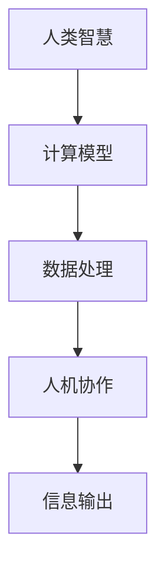

                 

在信息爆炸的时代，人类计算正逐渐成为驱动个人、社区和社会进步的重要力量。本文将探讨人类计算的概念、核心原理、数学模型、算法及其在实际应用中的重要性，以及未来发展的趋势和面临的挑战。

## 关键词

- 人类计算
- 个人赋能
- 社区发展
- 社会进步
- 信息处理
- 数学模型
- 算法优化
- 技术应用

## 摘要

本文将从多角度深入分析人类计算的概念，探讨其如何通过技术手段赋能个人、社区和社会。我们将详细描述人类计算的核心原理，包括数学模型和算法，并通过实际案例展示其在不同领域的应用。最后，本文将展望人类计算的未来发展趋势，以及可能面临的挑战和解决方案。

## 1. 背景介绍

随着计算机技术的快速发展，数据处理能力得到了极大提升。然而，面对海量的信息和复杂的计算任务，单纯依赖计算机硬件和软件的自动处理已经无法满足需求。这时，人类计算的概念应运而生。人类计算强调将人类的智慧、经验和直觉融入计算过程中，实现更加智能化、高效化的信息处理。

人类计算的应用领域非常广泛，包括但不限于以下几个方面：

1. **科学研究和数据分析**：利用人类计算可以处理复杂的科学问题和大数据分析，为科研提供更加深入的见解。
2. **人工智能和机器学习**：通过人类计算辅助算法优化和模型调整，提高人工智能系统的性能和准确性。
3. **商业决策和风险管理**：利用人类计算提供的数据分析和预测，帮助企业做出更明智的商业决策。
4. **社会服务和公共服务**：通过人类计算优化公共服务流程，提高政府治理效率和公共服务质量。

## 2. 核心概念与联系

### 2.1 人类计算的基本概念

人类计算的核心概念包括以下几个方面：

- **人类智慧**：人类拥有独特的思维能力和经验，能够进行抽象思考、逻辑推理和创新。
- **计算模型**：人类计算涉及到各种计算模型，如逻辑推理、机器学习、知识图谱等。
- **数据处理**：人类计算强调对大量复杂的数据进行处理和分析，以发现有价值的信息。
- **人机协作**：人类计算不仅是人类参与计算，还包括人与计算机系统的协作。

### 2.2 核心原理与架构

为了更好地理解人类计算的核心原理，我们可以使用Mermaid流程图来描述其架构。



在上述流程图中，A代表人类智慧，B代表计算模型，C代表数据处理，D代表人机协作，E代表信息输出。这个流程图展示了人类计算的核心原理，即通过人类的智慧和计算模型，对大量数据进行分析和处理，实现人机协作，最终输出有价值的信息。

### 2.3 人类计算的优势与挑战

**优势**：

- **灵活性和适应性**：人类计算能够处理复杂和多样化的计算任务，具有很高的灵活性和适应性。
- **创新和创造力**：人类计算结合了人类的智慧和创造力，能够在数据处理过程中产生新的见解和解决方案。
- **人机协作**：人类计算强调人机协作，能够充分发挥人类和计算机系统的优势，实现更高效的计算。

**挑战**：

- **数据质量和可靠性**：人类计算依赖于数据的质量和可靠性，数据的不准确或缺失可能导致计算结果失真。
- **计算资源和成本**：人类计算涉及到大量数据的处理和分析，需要消耗大量的计算资源和成本。
- **安全性和隐私保护**：人类计算涉及到大量敏感信息的处理，需要确保数据的安全性和隐私保护。

## 3. 核心算法原理 & 具体操作步骤

### 3.1 算法原理概述

人类计算的核心算法包括以下几个方面：

- **逻辑推理算法**：通过逻辑推理，人类能够从已知事实中推断出新的结论。常见的逻辑推理算法包括命题逻辑、谓词逻辑等。
- **机器学习算法**：机器学习算法通过训练模型，让计算机自动从数据中学习规律和模式，实现预测和分类。常见的机器学习算法包括决策树、支持向量机、神经网络等。
- **知识图谱算法**：知识图谱是一种结构化的语义知识库，通过知识图谱算法，人类能够对知识进行组织和推理。常见的知识图谱算法包括图论算法、语义网络算法等。

### 3.2 算法步骤详解

**逻辑推理算法**：

1. 输入一组事实。
2. 利用逻辑推理规则，对事实进行推理。
3. 输出推理结果。

**机器学习算法**：

1. 数据收集：收集大量训练数据。
2. 特征提取：从数据中提取特征。
3. 模型训练：使用训练数据训练模型。
4. 模型评估：使用测试数据评估模型性能。
5. 模型优化：根据评估结果调整模型参数。

**知识图谱算法**：

1. 知识抽取：从非结构化数据中提取知识。
2. 知识组织：将提取的知识组织成知识图谱。
3. 知识推理：利用知识图谱进行推理。
4. 知识可视化：将知识图谱可视化展示。

### 3.3 算法优缺点

**逻辑推理算法**：

- **优点**：能够处理复杂和抽象的逻辑问题，具有很高的推理能力。
- **缺点**：依赖于推理规则，处理大规模问题时效率较低。

**机器学习算法**：

- **优点**：能够自动从数据中学习规律，适应性强。
- **缺点**：依赖于大量训练数据，模型解释性较差。

**知识图谱算法**：

- **优点**：能够对知识进行结构化和组织，支持复杂的知识推理。
- **缺点**：知识抽取和构建过程复杂，需要大量人力和时间投入。

### 3.4 算法应用领域

**逻辑推理算法**：广泛应用于自然语言处理、逻辑推理系统、决策支持系统等领域。

**机器学习算法**：广泛应用于计算机视觉、语音识别、推荐系统、金融风控等领域。

**知识图谱算法**：广泛应用于搜索引擎、知识库构建、智能问答系统等领域。

## 4. 数学模型和公式 & 详细讲解 & 举例说明

### 4.1 数学模型构建

在人类计算中，数学模型是核心组成部分。以下是一个简单的数学模型构建过程：

1. **确定问题类型**：首先需要明确计算问题的类型，如线性回归、分类问题、优化问题等。
2. **定义变量和参数**：根据问题类型，定义变量和参数，如自变量、因变量、权重等。
3. **建立数学模型**：根据变量和参数之间的关系，建立数学模型。例如，线性回归模型可以表示为：

   $$
   y = \beta_0 + \beta_1x_1 + \beta_2x_2 + ... + \beta_nx_n
   $$

### 4.2 公式推导过程

以线性回归模型为例，我们来看一下公式推导过程：

1. **最小二乘法**：线性回归模型的目标是找到一组参数（$\beta_0, \beta_1, ..., \beta_n$），使得预测值与实际值之间的误差最小。这个误差可以通过最小二乘法来求解。

   $$
   \min_{\beta} \sum_{i=1}^{n} (y_i - \beta_0 - \beta_1x_{i1} - ... - \beta_nx_{in})^2
   $$

2. **求导**：对上述目标函数求导，并令导数为0，可以得到参数的估计值。

   $$
   \frac{\partial}{\partial \beta_j} \sum_{i=1}^{n} (y_i - \beta_0 - \beta_1x_{i1} - ... - \beta_nx_{in})^2 = 0
   $$

3. **求解**：通过求解上述方程组，可以得到参数的估计值。

### 4.3 案例分析与讲解

假设我们有一个房价预测的问题，已知自变量（如面积、楼层等）和因变量（房价）。我们使用线性回归模型来预测房价。

1. **数据准备**：收集房价数据，包括面积、楼层等特征。
2. **数据预处理**：对数据缺失、异常值进行预处理，并进行特征工程。
3. **模型训练**：使用训练数据训练线性回归模型。
4. **模型评估**：使用测试数据评估模型性能，调整模型参数。
5. **预测**：使用训练好的模型预测新数据的房价。

## 5. 项目实践：代码实例和详细解释说明

### 5.1 开发环境搭建

1. 安装Python环境。
2. 安装NumPy、Pandas、Scikit-learn等常用库。

### 5.2 源代码详细实现

```python
import numpy as np
import pandas as pd
from sklearn.linear_model import LinearRegression

# 数据准备
data = pd.read_csv('house_price_data.csv')
X = data[['area', 'floor']]
y = data['price']

# 模型训练
model = LinearRegression()
model.fit(X, y)

# 模型评估
score = model.score(X, y)
print(f'Model R^2 Score: {score}')

# 预测
new_data = pd.DataFrame([[150, 3]], columns=['area', 'floor'])
predicted_price = model.predict(new_data)
print(f'Predicted Price: {predicted_price[0]}')
```

### 5.3 代码解读与分析

1. **数据准备**：读取房价数据，并分离自变量和因变量。
2. **模型训练**：使用训练数据训练线性回归模型。
3. **模型评估**：使用训练数据评估模型性能。
4. **预测**：使用训练好的模型预测新数据的房价。

## 6. 实际应用场景

### 6.1 科学研究

人类计算在科学研究中发挥着重要作用。例如，在基因组学研究中，人类计算可以帮助分析大量的基因数据，发现基因突变和关联关系，从而揭示疾病的发病机制。

### 6.2 商业应用

在商业应用中，人类计算可以帮助企业进行数据分析、市场预测和风险管理。例如，通过分析客户购买行为，企业可以制定更加精准的营销策略，提高销售额。

### 6.3 社会治理

在社会治理领域，人类计算可以优化公共服务流程，提高政府治理效率。例如，通过分析交通数据，可以优化交通信号控制，减少交通拥堵。

## 7. 未来应用展望

随着人工智能和大数据技术的不断发展，人类计算在未来有望在更多领域发挥重要作用。例如，在医疗领域，人类计算可以帮助医生进行疾病诊断和治疗方案推荐；在教育领域，人类计算可以帮助教师进行个性化教学和学生学习分析。

## 8. 总结：未来发展趋势与挑战

### 8.1 研究成果总结

人类计算作为一种结合人类智慧和计算机技术的计算方式，已经在多个领域取得显著成果。未来，人类计算将继续在科学研究、商业应用和社会治理等领域发挥重要作用。

### 8.2 未来发展趋势

- **人机协同**：随着人工智能技术的发展，人类计算将与人工智能更紧密地融合，实现更高效的人机协同。
- **大数据处理**：随着数据规模的不断扩大，人类计算将在大数据处理中发挥更加关键的作用。
- **知识图谱**：知识图谱作为一种重要的数据结构，将在人类计算中发挥越来越重要的作用。

### 8.3 面临的挑战

- **数据质量和可靠性**：人类计算依赖于高质量的数据，数据质量和可靠性是未来需要解决的重要问题。
- **计算资源和成本**：随着计算任务的复杂度增加，计算资源和成本将成为制约人类计算发展的关键因素。
- **安全性和隐私保护**：在处理敏感信息时，如何确保数据的安全性和隐私保护是未来需要解决的重要问题。

### 8.4 研究展望

未来，人类计算的研究将朝着更加智能化、高效化和安全化的方向发展。通过不断创新，人类计算将为个人、社区和社会带来更多的价值和机遇。

## 附录：常见问题与解答

### Q：什么是人类计算？

A：人类计算是一种结合人类智慧和计算机技术的计算方式，通过利用人类的智慧、经验和直觉，实现对大量复杂信息的处理和分析。

### Q：人类计算有哪些优势？

A：人类计算的优势包括灵活性和适应性、创新和创造力、以及人机协作。

### Q：人类计算有哪些挑战？

A：人类计算的挑战包括数据质量和可靠性、计算资源和成本、以及安全性和隐私保护。

### Q：人类计算的应用领域有哪些？

A：人类计算的应用领域包括科学研究、商业应用、社会治理、医疗、教育等多个领域。

### Q：如何进行人类计算？

A：进行人类计算需要结合人类智慧和计算机技术，包括数据收集、数据处理、模型构建和模型训练等步骤。

## 作者署名

作者：禅与计算机程序设计艺术 / Zen and the Art of Computer Programming
```

