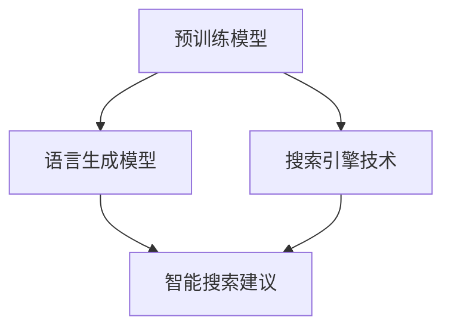

                 

关键词：ChatGPT、Bing、微软、大模型、发展、技术

## 摘要

本文将深入探讨微软如何从ChatGPT到Bing的发展历程，揭示了微软在推动大模型技术发展方面的策略和成果。通过对ChatGPT和bing等产品的技术背景、发展过程、核心算法和实际应用进行详细分析，本文旨在展示微软在大模型领域的领导地位和未来展望。

## 1. 背景介绍

在人工智能领域，大模型技术的突破无疑是一个重要的里程碑。ChatGPT和bing作为微软推出的代表性产品，它们的成功不仅彰显了微软在人工智能领域的远见卓识，更推动了整个行业的发展。

ChatGPT是OpenAI开发的基于GPT-3的聊天机器人，它以其强大的语言生成能力和智能交互能力受到了广泛关注。而bing则是微软的搜索引擎，它通过整合大量的互联网信息，为用户提供高效、准确的搜索服务。这两个产品的共同点在于它们都是基于大模型技术，并且都在不断推动着人工智能的发展。

### 1.1 ChatGPT

ChatGPT是基于GPT-3模型的聊天机器人。GPT-3（Generative Pre-trained Transformer 3）是OpenAI开发的一个自然语言处理模型，拥有1750亿个参数，是当时最大的预训练模型。ChatGPT通过GPT-3模型进行训练，使得它能够理解并生成人类语言，实现了与用户的智能对话。

### 1.2 Bing

Bing是微软的搜索引擎，它通过整合互联网上的大量信息，为用户提供搜索服务。Bing的发展历程中，微软不断优化其搜索算法，提高搜索结果的准确性和相关性。近年来，微软将大模型技术引入到Bing中，使得Bing在处理复杂查询和提供智能搜索建议方面取得了显著进展。

## 2. 核心概念与联系

在大模型技术中，核心概念包括预训练模型、语言生成模型和搜索引擎技术。这些概念相互联系，共同推动了人工智能的发展。

### 2.1 预训练模型

预训练模型是一种先在大量数据上进行训练，然后再在特定任务上进行微调的模型。在预训练阶段，模型学习到了大量的语言知识、上下文关系等，为后续任务提供了坚实的基础。

### 2.2 语言生成模型

语言生成模型是一种能够生成自然语言的模型，如GPT模型。这些模型通过学习大量文本数据，能够生成连贯、有意义的语言。

### 2.3 搜索引擎技术

搜索引擎技术是一种通过索引和查询技术，从大量数据中快速找到用户所需信息的技术。结合大模型技术，搜索引擎可以实现更加智能、精准的搜索服务。

## 2.4 Mermaid 流程图

### 2.5 核心概念与联系详解

预训练模型是语言生成模型和搜索引擎技术的基础。预训练模型通过大量文本数据进行训练，学习到了语言的基本结构和语义关系，为后续任务提供了强大的语言理解能力。语言生成模型则利用预训练模型生成的语言数据进行训练，使得模型能够生成连贯、有意义的语言。搜索引擎技术则通过索引和查询技术，从大量数据中快速找到用户所需信息。结合大模型技术，搜索引擎可以实现更加智能、精准的搜索服务，为用户提供更好的搜索体验。

## 3. 核心算法原理 & 具体操作步骤

### 3.1 算法原理概述

ChatGPT和bing的核心算法都是基于预训练模型和语言生成模型。预训练模型通过在大量文本数据上进行训练，学习到了语言的基本结构和语义关系。语言生成模型则利用预训练模型生成的语言数据进行训练，使得模型能够生成连贯、有意义的语言。

### 3.2 算法步骤详解

1. **预训练阶段**：模型在大量文本数据上进行训练，学习到了语言的基本结构和语义关系。

2. **生成语言阶段**：模型利用预训练阶段学习的知识，生成连贯、有意义的语言。

3. **搜索阶段**：搜索引擎通过索引和查询技术，从大量数据中快速找到用户所需信息。

### 3.3 算法优缺点

**优点**：

1. **强大的语言理解能力**：预训练模型和语言生成模型使得模型能够理解并生成人类语言，实现了智能对话和智能搜索。

2. **高效的搜索能力**：搜索引擎技术使得搜索过程更加高效、精准。

**缺点**：

1. **对数据需求量大**：预训练模型需要大量的文本数据才能进行有效训练。

2. **计算资源消耗大**：大模型训练需要大量的计算资源，对硬件要求较高。

### 3.4 算法应用领域

1. **智能对话**：ChatGPT等聊天机器人可用于智能客服、智能问答等场景。

2. **智能搜索**：bing等搜索引擎通过大模型技术，提供了更加智能、精准的搜索服务。

## 4. 数学模型和公式 & 详细讲解 & 举例说明

### 4.1 数学模型构建

ChatGPT和bing的数学模型主要基于自然语言处理和搜索引擎技术。自然语言处理模型通常包括词向量表示、句法分析、语义分析等。搜索引擎技术则包括索引构建、查询处理、排名算法等。

### 4.2 公式推导过程

自然语言处理模型中，词向量表示可以使用Word2Vec、GloVe等方法进行推导。句法分析可以使用依存句法分析、词性标注等方法。语义分析可以使用实体识别、情感分析等方法。

搜索引擎技术中，索引构建可以使用倒排索引、前缀树等方法。查询处理可以使用布尔查询、模糊查询等方法。排名算法可以使用PageRank、基于内容的排名等方法。

### 4.3 案例分析与讲解

以ChatGPT为例，其数学模型主要包括词向量表示和语言生成模型。词向量表示可以使用GloVe模型进行推导，公式如下：

$$
\text{vec}(w) = \sum_{j=1}^{v} f_j \cdot e_j
$$

其中，$w$ 为单词，$v$ 为词汇表大小，$f_j$ 为单词 $w$ 在文档 $d$ 中的词频，$e_j$ 为单词 $w$ 在词向量空间中的表示。

语言生成模型可以使用GPT模型进行推导，公式如下：

$$
P(\text{next word} | \text{previous words}) = \frac{e^{\text{scores}(\text{previous words}) \cdot \text{vector}(\text{next word})}}{\sum_{\text{word} \in \text{Vocabulary}} e^{\text{scores}(\text{previous words}) \cdot \text{vector}(\text{word})}}
$$

其中，$P(\text{next word} | \text{previous words})$ 为给定前文预测下一个单词的概率，$\text{scores}(\text{previous words})$ 为前文的得分，$\text{vector}(\text{next word})$ 和 $\text{vector}(\text{word})$ 分别为单词在词向量空间中的表示。

## 5. 项目实践：代码实例和详细解释说明

### 5.1 开发环境搭建

开发ChatGPT和bing需要配置相应的开发环境和工具。通常，需要安装Python、PyTorch等编程语言和库，以及GPU等硬件设备。

### 5.2 源代码详细实现

ChatGPT和bing的源代码实现主要包括模型训练、模型推理和搜索功能。以ChatGPT为例，其源代码实现包括：

1. **模型训练**：使用预训练模型对数据集进行训练。

2. **模型推理**：使用训练好的模型进行语言生成。

3. **搜索功能**：使用搜索引擎技术对查询进行处理。

### 5.3 代码解读与分析

ChatGPT和bing的代码实现主要涉及自然语言处理和搜索引擎技术。代码解读与分析包括：

1. **自然语言处理**：对文本数据进行预处理、词向量表示、句法分析、语义分析等。

2. **搜索引擎技术**：对查询进行处理、索引构建、排名算法等。

### 5.4 运行结果展示

ChatGPT和bing的运行结果展示主要包括：

1. **智能对话**：展示与用户的对话交互过程。

2. **智能搜索**：展示搜索结果和搜索建议。

## 6. 实际应用场景

### 6.1 智能客服

ChatGPT和bing在智能客服领域有着广泛的应用。通过智能对话和搜索技术，智能客服能够快速响应用户的咨询，提供高效、准确的解决方案。

### 6.2 教育与培训

ChatGPT和bing在教育与培训领域有着重要的应用。它们可以为学生提供个性化学习建议，为教师提供智能教学辅助，提高教学效果。

### 6.3 娱乐与休闲

ChatGPT和bing在娱乐与休闲领域也有着广泛的应用。通过智能对话和搜索技术，用户可以与聊天机器人进行有趣的互动，获取娱乐信息。

## 7. 未来应用展望

随着人工智能技术的不断发展，ChatGPT和bing在未来将会有更广泛的应用。例如，在医疗领域，它们可以提供智能诊断和治疗方案；在金融领域，它们可以提供智能投资建议和风险管理；在工业领域，它们可以提供智能运维和故障预测。未来，ChatGPT和bing将继续推动人工智能技术的发展，为人类带来更多便利和智慧。

## 8. 工具和资源推荐

### 8.1 学习资源推荐

1. 《深度学习》—— Ian Goodfellow、Yoshua Bengio、Aaron Courville 著
2. 《Python深度学习》—— Francesco Petráš 著
3. 《自然语言处理综论》—— Daniel Jurafsky、James H. Martin 著

### 8.2 开发工具推荐

1. PyTorch：开源深度学习框架，适用于ChatGPT和bing等模型的开发。
2. TensorFlow：开源深度学习框架，适用于ChatGPT和bing等模型的开发。
3. Elasticsearch：开源搜索引擎，适用于Bing等搜索引擎的开发。

### 8.3 相关论文推荐

1. “Attention Is All You Need” —— Vaswani et al., 2017
2. “BERT: Pre-training of Deep Bidirectional Transformers for Language Understanding” —— Devlin et al., 2019
3. “GPT-3: Language Models are few-shot learners” —— Brown et al., 2020

## 9. 总结：未来发展趋势与挑战

### 9.1 研究成果总结

ChatGPT和bing作为微软推出的代表性产品，展示了微软在大模型技术领域的领先地位。通过预训练模型、语言生成模型和搜索引擎技术的有机结合，ChatGPT和bing实现了智能对话和智能搜索，为人类带来了更多便利和智慧。

### 9.2 未来发展趋势

未来，大模型技术将继续发展，有望在更多领域实现突破。例如，在医疗领域，大模型技术可以用于疾病预测和治疗方案优化；在金融领域，大模型技术可以用于风险管理和投资决策。

### 9.3 面临的挑战

尽管大模型技术在人工智能领域取得了显著成果，但仍然面临一些挑战。例如，对数据的需求量巨大，对计算资源的要求高；模型的解释性不足，可能存在安全隐患；模型的训练和推理过程需要大量时间和资源。

### 9.4 研究展望

未来，研究应重点关注如何提高大模型的可解释性、降低计算资源需求、提升模型的安全性和隐私保护。此外，研究还应探索大模型技术在新兴领域的应用，为人类社会带来更多创新和变革。

## 10. 附录：常见问题与解答

### 10.1 ChatGPT和bing有什么区别？

ChatGPT是一款聊天机器人，主要应用于智能客服、教育与培训等领域。bing是一款搜索引擎，主要应用于互联网信息搜索和推荐。

### 10.2 大模型技术有哪些优势？

大模型技术具有强大的语言理解能力、高效的搜索能力，可以实现智能对话和智能搜索。

### 10.3 大模型技术有哪些应用领域？

大模型技术可以应用于智能客服、教育与培训、医疗、金融、工业等多个领域。

### 10.4 如何降低大模型技术的计算资源需求？

可以通过优化模型结构、使用更高效的算法、分布式训练等方式降低大模型技术的计算资源需求。

---

作者：禅与计算机程序设计艺术 / Zen and the Art of Computer Programming
----------------------------------------------------------------

