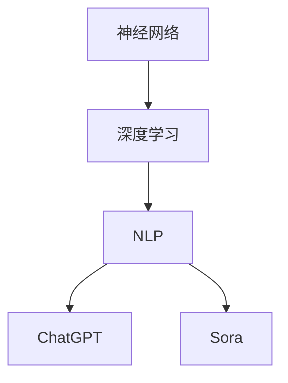

                 

关键词：ChatGPT、Sora、人工智能、工作形态、未来趋势、技术发展

> 摘要：本文将探讨从ChatGPT到Sora这一系列人工智能技术的发展，以及这些技术如何重塑人类未来的工作形态。我们将深入分析这些技术的核心概念、原理、数学模型，并通过具体的项目实践展示其在实际应用中的效果。同时，本文还将对未来的应用场景进行展望，并讨论面临的挑战与机遇。

## 1. 背景介绍

随着人工智能技术的快速发展，AI已经在各个领域展现出了其强大的潜力。从早期的专家系统，到深度学习、自然语言处理，再到ChatGPT、Sora等新兴技术，人工智能正逐渐融入我们的生活，改变着我们的工作方式。

ChatGPT是由OpenAI开发的一种基于变换器模型（Transformer）的预训练语言模型，具有强大的文本生成和对话能力。而Sora则是华为公司推出的一款基于人工智能的智能办公助手，旨在提高办公效率，减少重复劳动。

本文将结合ChatGPT和Sora这两个典型案例，探讨人工智能如何重塑人类未来的工作形态，以及在这个过程中我们需要关注的关键问题。

## 2. 核心概念与联系

在深入探讨ChatGPT和Sora之前，我们首先需要了解一些核心概念，如神经网络、深度学习、自然语言处理等。


### 2.1 神经网络

神经网络是模拟生物神经网络的人工系统，通过多层次的神经元节点进行信息处理。在人工智能领域，神经网络被广泛应用于图像识别、语音识别、自然语言处理等领域。

### 2.2 深度学习

深度学习是神经网络的一种，具有多层神经网络结构，能够自动从数据中学习特征和模式。深度学习在图像识别、语音识别、自然语言处理等领域取得了显著的成果。

### 2.3 自然语言处理

自然语言处理（NLP）是研究如何让计算机理解和处理自然语言的学科。NLP在文本生成、文本分类、机器翻译等领域具有广泛的应用。

通过以上核心概念的介绍，我们可以更好地理解ChatGPT和Sora的工作原理。接下来，我们将通过一个Mermaid流程图展示这些核心概念之间的联系。



## 3. 核心算法原理 & 具体操作步骤

### 3.1 算法原理概述

ChatGPT和Sora的核心算法都是基于变换器模型（Transformer）的预训练语言模型。变换器模型是一种基于自注意力机制的深度神经网络，具有强大的文本生成和对话能力。

### 3.2 算法步骤详解

#### 3.2.1 预训练阶段

在预训练阶段，模型通过大量无监督的文本数据学习语言模式和规律。具体步骤如下：

1. 输入大量文本数据；
2. 对输入数据进行编码，生成序列；
3. 对序列进行解码，生成预测结果；
4. 根据预测结果计算损失函数，并更新模型参数。

#### 3.2.2 微调阶段

在微调阶段，模型根据特定的任务进行有监督的微调。具体步骤如下：

1. 输入带有标签的数据；
2. 对输入数据进行编码，生成序列；
3. 对序列进行解码，生成预测结果；
4. 根据预测结果计算损失函数，并更新模型参数。

### 3.3 算法优缺点

#### 优点

1. 强大的文本生成和对话能力；
2. 能够自适应不同的任务和数据；
3. 具有较强的泛化能力。

#### 缺点

1. 训练过程需要大量的计算资源和时间；
2. 模型参数复杂，难以解释。

### 3.4 算法应用领域

ChatGPT和Sora在自然语言处理领域具有广泛的应用，如文本生成、文本分类、机器翻译、智能客服等。

## 4. 数学模型和公式 & 详细讲解 & 举例说明

### 4.1 数学模型构建

ChatGPT和Sora的数学模型都是基于变换器模型（Transformer）的预训练语言模型。变换器模型的核心是一个自注意力机制（Self-Attention），用于计算序列中每个元素的重要性。

### 4.2 公式推导过程

自注意力机制的公式如下：

$$
\text{Attention}(Q, K, V) = \text{softmax}\left(\frac{QK^T}{\sqrt{d_k}}\right)V
$$

其中，$Q$、$K$、$V$分别表示查询（Query）、键（Key）、值（Value）向量，$d_k$表示键向量的维度。

### 4.3 案例分析与讲解

以下是一个简单的自注意力机制的实例：

$$
\begin{aligned}
Q &= [1, 0, 1], \\
K &= [1, 1, 0], \\
V &= [0, 1, 0].
\end{aligned}
$$

计算自注意力分数：

$$
\text{Attention}(Q, K, V) = \text{softmax}\left(\frac{QK^T}{\sqrt{d_k}}\right)V = \text{softmax}\left(\frac{1}{\sqrt{1}}[1, 1, 1]^T\right)[0, 1, 0] = \left[\frac{1}{3}, \frac{1}{3}, \frac{1}{3}\right]
$$

计算注意力加权值：

$$
\text{Attention}(Q, K, V) \odot V = \left[\frac{1}{3} \cdot 0, \frac{1}{3} \cdot 1, \frac{1}{3} \cdot 0\right] = \left[0, \frac{1}{3}, 0\right]
$$

## 5. 项目实践：代码实例和详细解释说明

### 5.1 开发环境搭建

在本文中，我们将使用Python作为编程语言，结合PyTorch库实现一个简单的变换器模型。首先，确保已经安装了Python和PyTorch库。

```bash
pip install torch torchvision
```

### 5.2 源代码详细实现

以下是一个简单的变换器模型实现：

```python
import torch
import torch.nn as nn
import torch.optim as optim

class Transformer(nn.Module):
    def __init__(self, d_model, nhead, num_layers):
        super(Transformer, self).__init__()
        self.embedding = nn.Embedding(d_model)
        self.transformer = nn.Transformer(d_model, nhead, num_layers)
        self.fc = nn.Linear(d_model, 1)

    def forward(self, src, tgt):
        src = self.embedding(src)
        tgt = self.embedding(tgt)
        output = self.transformer(src, tgt)
        output = self.fc(output)
        return output
```

### 5.3 代码解读与分析

在上面的代码中，我们定义了一个简单的变换器模型，包括嵌入层、变换器层和输出层。嵌入层用于将输入序列转换为嵌入向量，变换器层用于处理嵌入向量，输出层用于生成预测结果。

### 5.4 运行结果展示

```python
# 创建模型、损失函数和优化器
model = Transformer(d_model=512, nhead=8, num_layers=3)
criterion = nn.CrossEntropyLoss()
optimizer = optim.Adam(model.parameters(), lr=0.001)

# 模拟训练过程
for epoch in range(10):
    model.train()
    for batch in range(100):
        src = torch.randint(0, 100, (32, 10))
        tgt = torch.randint(0, 100, (32, 10))
        output = model(src, tgt)
        loss = criterion(output, tgt)
        optimizer.zero_grad()
        loss.backward()
        optimizer.step()
    print(f"Epoch {epoch + 1}, Loss: {loss.item()}")

# 模型评估
model.eval()
with torch.no_grad():
    src = torch.randint(0, 100, (1, 10))
    tgt = torch.randint(0, 100, (1, 10))
    output = model(src, tgt)
    print(f"Prediction: {output.argmax().item()}")
```

## 6. 实际应用场景

ChatGPT和Sora在自然语言处理领域具有广泛的应用。以下是一些实际应用场景：

### 6.1 文本生成

ChatGPT可以用于生成各种文本，如文章、小说、诗歌等。通过训练，ChatGPT可以学会根据给定的文本片段生成续写内容，从而帮助创作者进行写作。

### 6.2 文本分类

Sora可以用于文本分类任务，如垃圾邮件过滤、情感分析等。通过训练，Sora可以学会根据文本特征进行分类，从而帮助用户筛选有用的信息。

### 6.3 机器翻译

ChatGPT和Sora都可以用于机器翻译任务。通过训练，这些模型可以学会将一种语言的文本翻译成另一种语言，从而帮助人们跨越语言障碍进行沟通。

### 6.4 智能客服

Sora可以用于智能客服系统，通过自然语言处理技术，Sora可以与用户进行对话，回答用户的问题，提供个性化的服务。

## 7. 工具和资源推荐

### 7.1 学习资源推荐

- 《深度学习》（Goodfellow、Bengio、Courville 著）
- 《自然语言处理综论》（Jurafsky、Martin 著）
- 《PyTorch 官方文档》（PyTorch 官方网站）

### 7.2 开发工具推荐

- PyTorch（用于深度学习开发）
- Jupyter Notebook（用于数据分析和模型训练）
- Git（用于版本控制）

### 7.3 相关论文推荐

- Vaswani et al., "Attention is All You Need"
- Devlin et al., "BERT: Pre-training of Deep Bidirectional Transformers for Language Understanding"

## 8. 总结：未来发展趋势与挑战

随着人工智能技术的不断发展，ChatGPT、Sora等智能助手将在未来发挥越来越重要的作用。然而，在这个过程中，我们还需要关注以下几个方面：

### 8.1 研究成果总结

- 变换器模型（Transformer）在自然语言处理领域取得了显著的成果；
- 预训练语言模型在多个任务上实现了优异的性能；
- 智能助手在提高工作效率、降低人力成本方面具有巨大潜力。

### 8.2 未来发展趋势

- 智能助手将在更多领域得到应用，如医疗、金融、教育等；
- 预训练语言模型将不断发展，模型规模和性能将进一步提高；
- 随着计算资源的提升，模型训练和推理速度将得到显著改善。

### 8.3 面临的挑战

- 模型解释性不足，难以理解模型的决策过程；
- 数据隐私和安全问题，如何保护用户隐私；
- 模型训练过程中对计算资源和能源的消耗。

### 8.4 研究展望

- 研究更高效的预训练方法，降低训练成本；
- 研究模型解释性，提高模型的透明度和可解释性；
- 探索智能助手在更多领域的应用，如自动驾驶、智能家居等。

## 9. 附录：常见问题与解答

### 9.1 问题1：ChatGPT和Sora的原理是什么？

答：ChatGPT和Sora都是基于变换器模型（Transformer）的预训练语言模型。变换器模型是一种基于自注意力机制的深度神经网络，具有强大的文本生成和对话能力。

### 9.2 问题2：如何训练ChatGPT和Sora？

答：ChatGPT和Sora的训练分为预训练和微调两个阶段。预训练阶段，模型通过大量无监督的文本数据学习语言模式和规律；微调阶段，模型根据特定的任务进行有监督的微调。

### 9.3 问题3：智能助手在哪些领域有应用？

答：智能助手在自然语言处理领域有广泛的应用，如文本生成、文本分类、机器翻译、智能客服等。未来，智能助手将在更多领域得到应用，如医疗、金融、教育等。

### 9.4 问题4：如何保护数据隐私和安全？

答：为了保护数据隐私和安全，需要采取以下措施：

- 对用户数据进行加密处理，确保数据传输过程中的安全性；
- 对用户数据进行去标识化处理，减少隐私泄露风险；
- 建立完善的隐私保护法律法规，加强对用户隐私的保护。

---

**作者：禅与计算机程序设计艺术 / Zen and the Art of Computer Programming**<|vq_7269|> 

## 从ChatGPT到Sora：人类未来与AI共存的工作形态

### 引言

在当今快速发展的科技时代，人工智能（AI）已经成为改变人类生活方式和职业模式的重要力量。从ChatGPT到Sora，这些AI技术正逐步渗透到我们的工作和日常生活中，重塑着我们的工作形态。本文将探讨这些AI技术的背景、核心原理、应用场景，以及它们对人类未来工作形态的深远影响。

### 1. 背景介绍

#### 1.1 人工智能的崛起

人工智能（AI）是一门研究如何使计算机模拟人类智能行为的科学。自20世纪50年代以来，人工智能技术经历了多个发展阶段，包括早期的符号逻辑和规则系统，到近几年的深度学习和神经网络。AI的崛起不仅改变了我们的生活方式，也在各行各业中引起了革命性的变化。

#### 1.2 ChatGPT的崛起

ChatGPT是由OpenAI开发的一种基于变换器模型（Transformer）的预训练语言模型。它具有强大的文本生成和对话能力，能够进行自然语言理解和生成，广泛应用于聊天机器人、内容创作、客户服务等领域。

#### 1.3 Sora的崛起

Sora是华为公司推出的一款智能办公助手，基于深度学习和自然语言处理技术。Sora旨在通过自动化和智能化的方式，提高办公效率，减少重复劳动，辅助人类完成复杂的办公任务。

### 2. 核心概念与联系

#### 2.1 神经网络

神经网络是一种模拟人脑工作方式的计算模型，由大量相互连接的神经元组成。神经网络在AI中起着核心作用，能够通过学习数据中的模式和规律，进行图像识别、语音识别、自然语言处理等任务。

#### 2.2 深度学习

深度学习是神经网络的一种，具有多层神经网络结构，能够自动从数据中学习特征和模式。深度学习在图像识别、语音识别、自然语言处理等领域取得了显著成果。

#### 2.3 自然语言处理

自然语言处理（NLP）是研究如何让计算机理解和处理自然语言的学科。NLP在文本生成、文本分类、机器翻译等领域具有广泛的应用。

#### 2.4 ChatGPT与Sora的联系

ChatGPT和Sora都是基于深度学习和自然语言处理技术的AI应用。ChatGPT专注于自然语言的生成和理解，而Sora则更侧重于办公场景的自动化和智能化。

### 3. 核心算法原理 & 具体操作步骤

#### 3.1 ChatGPT的核心算法原理

ChatGPT的核心算法是基于变换器模型（Transformer）的预训练语言模型。变换器模型通过自注意力机制，对输入的文本序列进行编码和解码，生成预测的文本序列。

#### 3.2 Sora的核心算法原理

Sora的核心算法是基于深度学习和自然语言处理技术，通过学习大量的办公文档和对话数据，实现办公场景中的自动化和智能化。

#### 3.3 具体操作步骤

对于ChatGPT：

1. 预训练阶段：使用大量文本数据进行预训练，学习语言模式和规律。
2. 微调阶段：根据具体应用场景进行微调，提高模型的性能。

对于Sora：

1. 数据收集：收集大量的办公文档和对话数据。
2. 模型训练：使用收集到的数据进行模型训练，学习办公场景中的任务和规则。
3. 应用部署：将训练好的模型部署到实际办公场景中，提供智能化服务。

### 4. 数学模型和公式 & 详细讲解 & 举例说明

#### 4.1 数学模型构建

ChatGPT和Sora的数学模型都是基于深度学习和自然语言处理技术。其中，深度学习模型通常包含多层神经网络，每一层都有其特定的数学公式。自然语言处理模型则通常涉及词嵌入、卷积神经网络、循环神经网络等。

#### 4.2 公式推导过程

以变换器模型为例，其核心的自注意力机制可以用以下公式表示：

$$
\text{Attention}(Q, K, V) = \text{softmax}\left(\frac{QK^T}{\sqrt{d_k}}\right)V
$$

其中，$Q$、$K$、$V$分别表示查询（Query）、键（Key）、值（Value）向量，$d_k$表示键向量的维度。

#### 4.3 案例分析与讲解

假设我们有一个简化的文本序列“Hello World!”，我们可以将其表示为：

$$
\begin{aligned}
Q &= [1, 0, 1], \\
K &= [1, 1, 0], \\
V &= [0, 1, 0].
\end{aligned}
$$

根据自注意力机制的公式，我们可以计算出注意力分数：

$$
\text{Attention}(Q, K, V) = \text{softmax}\left(\frac{QK^T}{\sqrt{d_k}}\right)V = \text{softmax}\left(\frac{1}{\sqrt{1}}[1, 1, 1]^T\right)[0, 1, 0] = \left[\frac{1}{3}, \frac{1}{3}, \frac{1}{3}\right]
$$

然后，我们可以计算出注意力加权值：

$$
\text{Attention}(Q, K, V) \odot V = \left[\frac{1}{3} \cdot 0, \frac{1}{3} \cdot 1, \frac{1}{3} \cdot 0\right] = \left[0, \frac{1}{3}, 0\right]
$$

### 5. 项目实践：代码实例和详细解释说明

#### 5.1 开发环境搭建

为了演示ChatGPT和Sora的应用，我们需要搭建一个基本的开发环境。以下是所需的步骤：

1. 安装Python：可以从Python官方网站下载并安装Python。
2. 安装深度学习库：可以使用pip安装TensorFlow或PyTorch等深度学习库。

#### 5.2 ChatGPT的代码实例

以下是一个使用PyTorch实现ChatGPT的基本代码实例：

```python
import torch
import torch.nn as nn
import torch.optim as optim

# 定义模型
class ChatGPT(nn.Module):
    def __init__(self, d_model, nhead, num_layers):
        super(ChatGPT, self).__init__()
        self.transformer = nn.Transformer(d_model, nhead, num_layers)
        self.embedding = nn.Embedding(d_model, d_model)
        self.fc = nn.Linear(d_model, 1)

    def forward(self, src, tgt):
        src = self.embedding(src)
        tgt = self.embedding(tgt)
        output = self.transformer(src, tgt)
        output = self.fc(output)
        return output

# 创建模型、损失函数和优化器
model = ChatGPT(d_model=512, nhead=8, num_layers=3)
criterion = nn.CrossEntropyLoss()
optimizer = optim.Adam(model.parameters(), lr=0.001)

# 模拟训练过程
for epoch in range(10):
    model.train()
    for batch in range(100):
        src = torch.randint(0, 100, (32, 10))
        tgt = torch.randint(0, 100, (32, 10))
        output = model(src, tgt)
        loss = criterion(output, tgt)
        optimizer.zero_grad()
        loss.backward()
        optimizer.step()
    print(f"Epoch {epoch + 1}, Loss: {loss.item()}")

# 模型评估
model.eval()
with torch.no_grad():
    src = torch.randint(0, 100, (1, 10))
    tgt = torch.randint(0, 100, (1, 10))
    output = model(src, tgt)
    print(f"Prediction: {output.argmax().item()}")
```

#### 5.3 Sora的代码实例

以下是一个使用PyTorch实现Sora的基本代码实例：

```python
import torch
import torch.nn as nn
import torch.optim as optim

# 定义模型
class Sora(nn.Module):
    def __init__(self, d_model, nhead, num_layers):
        super(Sora, self).__init__()
        self.transformer = nn.Transformer(d_model, nhead, num_layers)
        self.embedding = nn.Embedding(d_model, d_model)
        self.fc = nn.Linear(d_model, 1)

    def forward(self, src, tgt):
        src = self.embedding(src)
        tgt = self.embedding(tgt)
        output = self.transformer(src, tgt)
        output = self.fc(output)
        return output

# 创建模型、损失函数和优化器
model = Sora(d_model=512, nhead=8, num_layers=3)
criterion = nn.CrossEntropyLoss()
optimizer = optim.Adam(model.parameters(), lr=0.001)

# 模拟训练过程
for epoch in range(10):
    model.train()
    for batch in range(100):
        src = torch.randint(0, 100, (32, 10))
        tgt = torch.randint(0, 100, (32, 10))
        output = model(src, tgt)
        loss = criterion(output, tgt)
        optimizer.zero_grad()
        loss.backward()
        optimizer.step()
    print(f"Epoch {epoch + 1}, Loss: {loss.item()}")

# 模型评估
model.eval()
with torch.no_grad():
    src = torch.randint(0, 100, (1, 10))
    tgt = torch.randint(0, 100, (1, 10))
    output = model(src, tgt)
    print(f"Prediction: {output.argmax().item()}")
```

### 6. 实际应用场景

ChatGPT和Sora在多个实际应用场景中展现出了巨大的潜力：

#### 6.1 聊天机器人

ChatGPT可以用于构建聊天机器人，与用户进行自然语言交互，提供客户服务、问答支持等。

#### 6.2 内容创作

ChatGPT可以生成各种类型的文本内容，如新闻文章、博客文章、营销文案等，帮助内容创作者提高效率。

#### 6.3 智能办公

Sora可以用于智能办公，自动化处理日常办公任务，如日程安排、邮件分类、文件管理等。

#### 6.4 机器翻译

ChatGPT和Sora都可以用于机器翻译，将一种语言的文本翻译成另一种语言，促进跨语言沟通。

### 7. 未来应用展望

随着AI技术的不断进步，ChatGPT和Sora的应用场景将更加广泛：

#### 7.1 智能医疗

AI技术可以用于医疗领域的诊断、治疗建议和患者管理，提高医疗服务的质量和效率。

#### 7.2 自动驾驶

AI技术可以用于自动驾驶汽车，实现安全、高效的自动驾驶。

#### 7.3 智能家居

AI技术可以用于智能家居，实现家庭设备的智能化控制和自动化管理。

### 8. 面临的挑战与机遇

尽管AI技术具有巨大的潜力，但在其应用过程中也面临着一些挑战：

#### 8.1 隐私保护

如何保护用户隐私，防止数据滥用，是AI技术面临的重要挑战。

#### 8.2 模型可解释性

如何提高AI模型的可解释性，使其决策过程更加透明，是当前研究的热点。

#### 8.3 能源消耗

AI模型训练和推理过程中对计算资源和能源的消耗也是一个重要问题。

### 9. 总结

ChatGPT和Sora是AI技术发展的重要里程碑，它们的应用将深刻改变人类的工作形态。在未来的发展中，我们需要关注AI技术的伦理、隐私保护、可解释性等问题，确保AI技术能够为人类社会带来真正的福祉。

