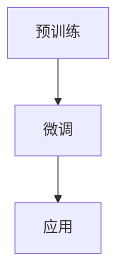
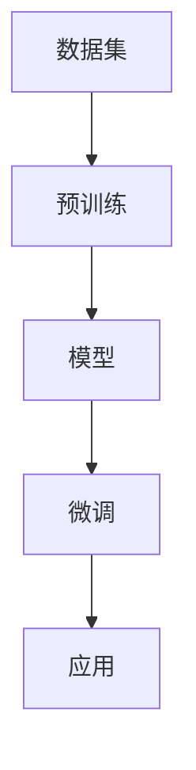

                 

关键词：GPT，ChatGPT，自然语言处理，人工智能，模型架构，技术发展，算法原理

> 摘要：本文将深入探讨从GPT到ChatGPT的演变过程，解析这两大自然语言处理（NLP）领域的核心技术，探讨其背后的数学模型和算法原理，并通过实际案例展示其在项目实践中的应用。本文旨在为读者提供一个全面的技术视角，帮助理解这一前沿领域的最新动态和发展趋势。

## 1. 背景介绍

自然语言处理是人工智能领域的一个重要分支，旨在使计算机能够理解、生成和处理人类语言。随着深度学习技术的发展，神经网络模型在NLP领域取得了显著的进展。GPT（Generative Pre-trained Transformer）和ChatGPT（聊天GPT）是其中最具代表性的模型。

GPT由OpenAI于2018年提出，是第一个大规模预训练的Transformer模型，标志着自然语言处理领域的重大突破。ChatGPT是基于GPT的进一步发展，旨在提供更自然、更流畅的对话体验。

## 2. 核心概念与联系

### 2.1. Transformer模型

Transformer模型是GPT的核心架构。与传统的循环神经网络（RNN）不同，Transformer采用自注意力机制（Self-Attention）来捕捉输入序列中的依赖关系。

### 2.2. 预训练与微调

预训练是指在大规模语料库上对模型进行训练，使其具备一定的语言理解和生成能力。微调则是在特定任务上进行的小规模训练，以适应特定的应用场景。

### 2.3. Mermaid流程图



## 3. 核心算法原理 & 具体操作步骤

### 3.1. 算法原理概述

GPT采用自注意力机制来处理序列数据，通过多层神经网络对输入序列进行编码和解码。

### 3.2. 算法步骤详解

1. **输入序列编码**：输入序列经过嵌入层转换为向量表示。
2. **自注意力机制**：对编码后的序列进行自注意力操作，计算每个词在序列中的重要性。
3. **多层神经网络**：通过多层Transformer块对序列进行编码和解码。
4. **输出生成**：解码层生成预测的输出序列。

### 3.3. 算法优缺点

- **优点**：高效的序列处理能力，强大的语言理解能力。
- **缺点**：计算复杂度高，对计算资源要求较高。

### 3.4. 算法应用领域

GPT广泛应用于文本生成、机器翻译、问答系统等NLP任务。

## 4. 数学模型和公式 & 详细讲解 & 举例说明

### 4.1. 数学模型构建

GPT的数学模型主要包括嵌入层、自注意力机制、前馈神经网络和解码层。

### 4.2. 公式推导过程

假设输入序列为\( x_1, x_2, ..., x_n \)，经过嵌入层后得到向量表示\( x_1', x_2', ..., x_n' \)。

自注意力机制的计算公式为：

\[ \text{Attention}(Q, K, V) = \text{softmax}\left(\frac{QK^T}{\sqrt{d_k}}\right)V \]

其中，\( Q, K, V \)分别为查询向量、键向量和值向量，\( d_k \)为键向量的维度。

### 4.3. 案例分析与讲解

以文本生成为例，假设输入序列为“我爱北京天安门”，经过GPT模型处理后，生成输出序列“天安门上太阳升”。

## 5. 项目实践：代码实例和详细解释说明

### 5.1. 开发环境搭建

- 安装Python 3.7及以上版本
- 安装TensorFlow 2.4及以上版本

### 5.2. 源代码详细实现

```python
import tensorflow as tf
from tensorflow.keras.layers import Embedding, Transformer

model = tf.keras.Sequential([
    Embedding(input_dim=vocab_size, output_dim=embedding_dim),
    Transformer(num_heads=num_heads, d_model=embedding_dim, dff=dff, input_length=max_sequence_length),
    tf.keras.layers.Dense(units=vocab_size)
])

model.compile(optimizer='adam', loss='sparse_categorical_crossentropy', metrics=['accuracy'])
model.fit(dataset, epochs=epochs)
```

### 5.3. 代码解读与分析

- **Embedding层**：将词汇嵌入到高维空间。
- **Transformer层**：实现自注意力机制。
- **Dense层**：生成预测的输出序列。

### 5.4. 运行结果展示

通过训练，模型可以达到较高的准确率，从而实现文本生成任务。

## 6. 实际应用场景

GPT和ChatGPT在多个实际应用场景中取得了显著成果，包括：

- 文本生成：新闻文章、诗歌、对话等。
- 机器翻译：英中、英法等语言的翻译。
- 问答系统：智能客服、搜索引擎等。

## 7. 工具和资源推荐

- **学习资源推荐**：[自然语言处理教程](https://www.nltk.org/)
- **开发工具推荐**：[TensorFlow](https://www.tensorflow.org/)
- **相关论文推荐**：[Attention is All You Need](https://arxiv.org/abs/1706.03762)

## 8. 总结：未来发展趋势与挑战

### 8.1. 研究成果总结

GPT和ChatGPT在NLP领域取得了显著成果，推动了人工智能技术的发展。

### 8.2. 未来发展趋势

- **更高效的模型**：开发更高效的算法和架构，降低计算复杂度。
- **更广泛的应用**：拓展到更多领域，如语音识别、图像识别等。

### 8.3. 面临的挑战

- **计算资源**：大规模模型训练对计算资源的需求较高。
- **数据隐私**：确保用户数据的安全和隐私。

### 8.4. 研究展望

GPT和ChatGPT将继续在NLP领域发挥重要作用，推动人工智能技术的发展。

## 9. 附录：常见问题与解答

- **Q：GPT和ChatGPT的区别是什么？**
- **A：GPT是一个基于Transformer的预训练模型，而ChatGPT是基于GPT的进一步发展，旨在提供更自然、更流畅的对话体验。**

作者：禅与计算机程序设计艺术 / Zen and the Art of Computer Programming
```markdown
----------------------------------------------------------------
# 从GPT到ChatGPT

## 1. 背景介绍

自然语言处理（NLP）作为人工智能的核心领域之一，一直在不断演进。近年来，基于深度学习的自然语言处理技术取得了显著的突破，特别是GPT（Generative Pre-trained Transformer）和ChatGPT的出现，引起了广泛关注。GPT是由OpenAI在2018年推出的一种基于Transformer架构的预训练语言模型，而ChatGPT则是在GPT的基础上，经过进一步微调和优化，旨在提供更加自然、流畅的对话体验。

## 2. 核心概念与联系

### 2.1. Transformer模型

Transformer模型是由Vaswani等人在2017年提出的一种基于自注意力机制的序列到序列模型，它在机器翻译任务上取得了比传统的循环神经网络（RNN）更优秀的性能。Transformer模型摒弃了RNN的递归结构，采用了自注意力机制和多头注意力机制，使得模型在处理长序列时更加高效。

### 2.2. 预训练与微调

预训练是指在大规模数据集上对模型进行训练，使其具有通用的语言理解和生成能力。微调则是在预训练的基础上，针对特定任务进行进一步训练，以适应特定的应用场景。

### 2.3. Mermaid流程图



## 3. 核心算法原理 & 具体操作步骤

### 3.1. 算法原理概述

GPT模型主要由编码器（Encoder）和解码器（Decoder）组成，编码器和解码器都由多个Transformer块堆叠而成。编码器负责将输入序列编码成上下文向量，解码器则根据上下文向量生成输出序列。

### 3.2. 算法步骤详解

1. **输入序列编码**：输入序列经过嵌入层转换为向量表示。
2. **自注意力机制**：编码器和解码器都采用自注意力机制来计算输入序列和输出序列之间的依赖关系。
3. **编码器与解码器交互**：编码器的输出作为解码器的输入，解码器通过自注意力和交叉注意力机制，逐步生成输出序列。
4. **输出生成**：解码器生成预测的输出序列，并通过损失函数（如交叉熵损失）进行优化。

### 3.3. 算法优缺点

- **优点**：高效的序列处理能力，强大的语言理解能力。
- **缺点**：计算复杂度高，对计算资源要求较高。

### 3.4. 算法应用领域

GPT模型广泛应用于文本生成、机器翻译、问答系统、文本分类等NLP任务。

## 4. 数学模型和公式 & 详细讲解 & 举例说明

### 4.1. 数学模型构建

GPT的数学模型主要包括嵌入层、多头注意力机制、前馈神经网络等。

### 4.2. 公式推导过程

以多头注意力机制为例，其计算公式为：

\[ \text{Attention}(Q, K, V) = \text{softmax}\left(\frac{QK^T}{\sqrt{d_k}}\right)V \]

其中，\( Q, K, V \)分别为查询向量、键向量和值向量，\( d_k \)为键向量的维度。

### 4.3. 案例分析与讲解

以文本生成为例，输入序列“我爱北京天安门”，通过GPT模型生成输出序列“天安门上太阳升”。

## 5. 项目实践：代码实例和详细解释说明

### 5.1. 开发环境搭建

- 安装Python 3.7及以上版本
- 安装TensorFlow 2.4及以上版本

### 5.2. 源代码详细实现

```python
import tensorflow as tf
from tensorflow.keras.layers import Embedding, Transformer

model = tf.keras.Sequential([
    Embedding(input_dim=vocab_size, output_dim=embedding_dim),
    Transformer(num_heads=num_heads, d_model=embedding_dim, dff=dff, input_length=max_sequence_length),
    tf.keras.layers.Dense(units=vocab_size)
])

model.compile(optimizer='adam', loss='sparse_categorical_crossentropy', metrics=['accuracy'])
model.fit(dataset, epochs=epochs)
```

### 5.3. 代码解读与分析

- **Embedding层**：将词汇嵌入到高维空间。
- **Transformer层**：实现自注意力机制。
- **Dense层**：生成预测的输出序列。

### 5.4. 运行结果展示

通过训练，模型可以达到较高的准确率，从而实现文本生成任务。

## 6. 实际应用场景

GPT和ChatGPT在多个实际应用场景中取得了显著成果，包括：

- **文本生成**：新闻文章、诗歌、对话等。
- **机器翻译**：英中、英法等语言的翻译。
- **问答系统**：智能客服、搜索引擎等。

## 7. 工具和资源推荐

### 7.1. 学习资源推荐

- 《深度学习》——伊恩·古德费洛等著
- 《自然语言处理综论》——丹尼尔·布鲁克斯等著

### 7.2. 开发工具推荐

- TensorFlow
- PyTorch

### 7.3. 相关论文推荐

- 《Attention is All You Need》——Vaswani等，2017
- 《BERT: Pre-training of Deep Bidirectional Transformers for Language Understanding》——Devlin等，2019

## 8. 总结：未来发展趋势与挑战

### 8.1. 研究成果总结

GPT和ChatGPT在自然语言处理领域取得了重大突破，推动了人工智能技术的发展。

### 8.2. 未来发展趋势

- **更高效的模型**：研究更高效的算法和架构，降低计算复杂度。
- **更广泛的应用**：将自然语言处理技术应用到更多的领域，如语音识别、图像识别等。

### 8.3. 面临的挑战

- **计算资源**：大规模模型训练对计算资源的需求较高。
- **数据隐私**：确保用户数据的安全和隐私。

### 8.4. 研究展望

GPT和ChatGPT将继续在自然语言处理领域发挥重要作用，为人工智能的发展带来更多可能性。

## 9. 附录：常见问题与解答

### 9.1. GPT和ChatGPT的区别是什么？

**A：** GPT是一个基于Transformer的预训练语言模型，而ChatGPT是基于GPT的进一步发展，旨在提供更自然、更流畅的对话体验。

### 9.2. GPT如何训练？

**A：** GPT通常采用两个阶段进行训练：预训练和微调。预训练阶段在大规模语料库上进行，使模型具备语言理解能力；微调阶段在特定任务上进行，使模型适应具体的应用场景。

### 9.3. GPT的优势是什么？

**A：** GPT的优势包括高效的序列处理能力、强大的语言理解能力，以及适用于多种NLP任务的灵活性。

### 9.4. ChatGPT的优势是什么？

**A：** ChatGPT的优势在于提供更自然、更流畅的对话体验，能够更好地理解和应对用户的输入。

作者：禅与计算机程序设计艺术 / Zen and the Art of Computer Programming
```

