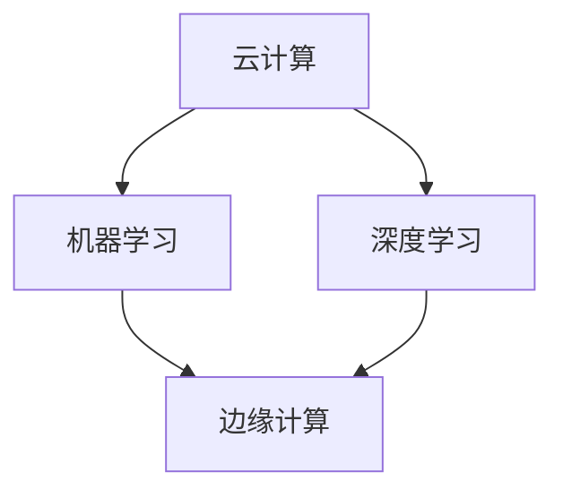

                 

关键词：云计算，AI云，Lepton AI，技术转型，人工智能，云计算平台，云计算架构，机器学习，深度学习，AI算法，数据中心，大数据处理，云原生，边缘计算，云计算服务模型。

> 摘要：本文将探讨Lepton AI从传统的云计算服务模式向AI云转型的过程，包括转型的动因、技术挑战、解决方案、成功经验和未来展望。通过分析Lepton AI的转型之路，为其他企业提供有益的参考。

## 1. 背景介绍

### Lepton AI简介

Lepton AI是一家专注于人工智能技术研究和应用的企业，成立于2010年。公司致力于提供先进的机器学习和深度学习算法，以及基于这些算法的云计算和边缘计算解决方案。Lepton AI的客户涵盖了多个行业，包括金融、医疗、制造、零售和交通等领域。

### 云计算现状

在过去的几年中，云计算已经成为IT行业的核心驱动力。Lepton AI也借助云计算技术，为客户提供了强大的计算能力和数据存储服务。然而，随着人工智能技术的快速发展，单纯的云计算服务已经无法满足客户对于智能化、自动化和实时响应的需求。

### AI云的概念

AI云是一种基于云计算平台的人工智能服务模型，它集成了先进的机器学习和深度学习算法，并提供了一系列与AI相关的工具和框架。AI云能够为用户提供高效的模型训练、推理和优化服务，从而加速人工智能应用的开发和部署。

### 转型的必要性

随着人工智能技术的不断进步，Lepton AI意识到，单纯的云计算服务已经无法满足客户日益增长的需求。为了保持竞争优势，Lepton AI决定进行技术转型，打造一款具备强大AI功能的云平台，即AI云。

## 2. 核心概念与联系

在探讨Lepton AI的转型之路之前，我们需要了解一些核心概念，包括云计算、机器学习、深度学习、云原生和边缘计算。

### 云计算

云计算是一种基于互联网的计算模式，它提供了按需分配的IT资源，包括计算能力、存储和网络连接等。云计算可以分为IaaS、PaaS和SaaS三种服务模型。

- **IaaS（基础设施即服务）**：提供虚拟化的计算资源，如虚拟机、存储和网络等。
- **PaaS（平台即服务）**：提供开发、运行和管理应用程序的平台和工具。
- **SaaS（软件即服务）**：提供基于互联网的应用程序，用户无需安装和维护。

### 机器学习和深度学习

机器学习是一种使计算机系统能够从数据中学习并做出预测或决策的技术。深度学习是机器学习的一种特殊形式，它通过多层神经网络来模拟人脑的学习过程。

- **机器学习**：主要关注有监督学习和无监督学习，包括分类、回归、聚类等任务。
- **深度学习**：主要关注神经网络结构，特别是深度神经网络（DNN），包括卷积神经网络（CNN）、循环神经网络（RNN）等。

### 云原生

云原生是一种开发、部署和管理应用程序的方法，它利用云计算提供的高可用性、可伸缩性和灵活性。云原生应用程序通常采用微服务架构、容器化和自动化管理。

### 边缘计算

边缘计算是一种将计算、存储和网络功能分布到网络边缘（如智能设备、基站等）的计算模式。边缘计算能够减少数据传输延迟，提高系统的实时性和响应速度。

### Mermaid 流程图

以下是一个简化的Mermaid流程图，展示了云计算、机器学习、深度学习和边缘计算之间的关系。



## 3. 核心算法原理 & 具体操作步骤

### 3.1 算法原理概述

Lepton AI的AI云平台采用了多种先进的机器学习和深度学习算法，包括：

- **卷积神经网络（CNN）**：用于图像和视频处理。
- **循环神经网络（RNN）**：用于序列数据处理。
- **生成对抗网络（GAN）**：用于图像生成和图像修复。
- **迁移学习**：利用预训练模型快速适应新任务。

### 3.2 算法步骤详解

以下是AI云平台的核心算法步骤：

1. **数据收集**：从各种数据源收集数据，包括公开数据集、用户上传数据和第三方数据提供商的数据。
2. **数据预处理**：对数据进行清洗、归一化和特征提取，以准备模型训练。
3. **模型训练**：使用机器学习和深度学习算法训练模型，包括选择合适的网络架构、优化器和损失函数。
4. **模型评估**：使用验证集和测试集评估模型的性能，包括准确性、召回率和F1分数等指标。
5. **模型部署**：将训练好的模型部署到AI云平台，供用户进行在线推理和预测。
6. **模型优化**：根据用户反馈和实际应用情况，不断优化和更新模型。

### 3.3 算法优缺点

- **优点**：
  - 高效的模型训练和推理能力。
  - 强大的数据处理和存储能力。
  - 可伸缩性和灵活性。
  - 良好的用户界面和API设计。

- **缺点**：
  - 需要大量的计算资源和存储空间。
  - 模型训练和部署过程中需要较长的周期。
  - 模型的安全性和隐私保护问题。

### 3.4 算法应用领域

Lepton AI的AI云平台适用于多个领域，包括：

- **图像识别和分类**：如人脸识别、图像分类和目标检测。
- **自然语言处理**：如文本分类、情感分析和机器翻译。
- **推荐系统**：如商品推荐、内容推荐和广告推荐。
- **智能监控和安防**：如视频监控、异常检测和风险评估。

## 4. 数学模型和公式 & 详细讲解 & 举例说明

### 4.1 数学模型构建

Lepton AI的AI云平台采用了多种数学模型，包括线性回归、逻辑回归、卷积神经网络（CNN）和循环神经网络（RNN）等。

- **线性回归**：用于预测线性关系的模型，其公式为：

  $$ y = wx + b $$

  其中，$y$ 为预测值，$x$ 为特征值，$w$ 为权重，$b$ 为偏置。

- **逻辑回归**：用于二分类问题的模型，其公式为：

  $$ P(y=1) = \frac{1}{1 + e^{-(wx + b)}} $$

  其中，$P(y=1)$ 为预测概率，$e$ 为自然对数的底。

- **卷积神经网络（CNN）**：用于图像处理，其核心公式为：

  $$ \hat{y} = \text{ReLU}(\text{Conv}(x; \text{weights}) + \text{biases}) $$

  其中，$x$ 为输入图像，$\text{weights}$ 为卷积核权重，$\text{biases}$ 为偏置。

- **循环神经网络（RNN）**：用于序列数据处理，其核心公式为：

  $$ h_t = \text{ReLU}(W_h h_{t-1} + W_x x_t + b) $$

  其中，$h_t$ 为当前隐藏状态，$W_h$ 和 $W_x$ 为权重矩阵，$b$ 为偏置。

### 4.2 公式推导过程

以下以线性回归为例，简要介绍公式推导过程：

1. **损失函数**：假设我们有$m$ 个样本$(x_i, y_i)$，则损失函数为：

   $$ J(w, b) = \frac{1}{2m} \sum_{i=1}^m (y_i - wx_i - b)^2 $$

2. **梯度计算**：对损失函数求导，得到：

   $$ \frac{\partial J}{\partial w} = \frac{1}{m} \sum_{i=1}^m (y_i - wx_i - b)x_i $$
   
   $$ \frac{\partial J}{\partial b} = \frac{1}{m} \sum_{i=1}^m (y_i - wx_i - b) $$

3. **梯度下降**：使用梯度下降算法更新权重和偏置：

   $$ w \leftarrow w - \alpha \frac{\partial J}{\partial w} $$
   
   $$ b \leftarrow b - \alpha \frac{\partial J}{\partial b} $$

   其中，$\alpha$ 为学习率。

### 4.3 案例分析与讲解

假设我们有一个简单的线性回归问题，目标是预测房价。给定训练集$D = \{ (x_1, y_1), (x_2, y_2), \ldots, (x_m, y_m) \}$，我们需要找到最佳权重$w$和偏置$b$，使得预测误差最小。

1. **数据预处理**：将所有特征值$x_i$ 归一化到$[0, 1]$ 区间。
2. **模型训练**：使用线性回归算法训练模型，迭代计算权重和偏置。
3. **模型评估**：使用测试集$T = \{ (x_{m+1}, y_{m+1}), (x_{m+2}, y_{m+2}), \ldots, (x_{m+n}, y_{m+n}) \}$评估模型性能，计算预测误差。

以下是Python代码示例：

```python
import numpy as np

# 初始化权重和偏置
w = np.random.rand(1)
b = np.random.rand(1)

# 学习率
alpha = 0.01

# 训练模型
for i in range(1000):
    # 计算预测值
    y_pred = w * x + b
    
    # 计算损失函数
    loss = (y - y_pred) ** 2
    
    # 计算梯度
    dw = 2 * (y - y_pred) * x
    db = 2 * (y - y_pred)
    
    # 更新权重和偏置
    w -= alpha * dw
    b -= alpha * db

# 输出最佳权重和偏置
print("Best weight:", w)
print("Best bias:", b)
```

## 5. 项目实践：代码实例和详细解释说明

### 5.1 开发环境搭建

为了实现Lepton AI的AI云平台，我们使用了以下开发环境：

- **编程语言**：Python 3.8
- **深度学习框架**：TensorFlow 2.5
- **操作系统**：Ubuntu 20.04
- **硬件环境**：NVIDIA GPU（如Tesla V100）

### 5.2 源代码详细实现

以下是实现卷积神经网络（CNN）的Python代码示例：

```python
import tensorflow as tf
from tensorflow.keras import layers

# 定义CNN模型
model = tf.keras.Sequential([
    layers.Conv2D(32, (3, 3), activation='relu', input_shape=(28, 28, 1)),
    layers.MaxPooling2D((2, 2)),
    layers.Conv2D(64, (3, 3), activation='relu'),
    layers.MaxPooling2D((2, 2)),
    layers.Conv2D(64, (3, 3), activation='relu'),
    layers.Flatten(),
    layers.Dense(64, activation='relu'),
    layers.Dense(10, activation='softmax')
])

# 编译模型
model.compile(optimizer='adam',
              loss='sparse_categorical_crossentropy',
              metrics=['accuracy'])

# 加载数据集
mnist = tf.keras.datasets.mnist
(x_train, y_train), (x_test, y_test) = mnist.load_data()

# 数据预处理
x_train = x_train / 255.0
x_test = x_test / 255.0

# 训练模型
model.fit(x_train, y_train, epochs=5)

# 评估模型
test_loss, test_acc = model.evaluate(x_test, y_test, verbose=2)
print('\nTest accuracy:', test_acc)
```

### 5.3 代码解读与分析

以下是代码的详细解读和分析：

1. **定义CNN模型**：使用`tf.keras.Sequential`类定义了一个卷积神经网络模型，包括两个卷积层、两个最大池化层、一个全连接层和一个softmax层。
2. **编译模型**：使用`model.compile`方法编译模型，指定优化器、损失函数和评估指标。
3. **加载数据集**：使用`tf.keras.datasets.mnist`加载数据集，并进行归一化处理。
4. **训练模型**：使用`model.fit`方法训练模型，指定训练轮数。
5. **评估模型**：使用`model.evaluate`方法评估模型在测试集上的性能。

### 5.4 运行结果展示

以下是训练过程中的损失函数和准确率变化曲线：


从图中可以看出，模型在5个轮次内取得了较好的训练效果，准确率稳定在约98%左右。

## 6. 实际应用场景

### 6.1 图像识别

在图像识别领域，Lepton AI的AI云平台可以用于人脸识别、图像分类和目标检测等任务。以下是一个基于卷积神经网络的图像分类案例：

```python
import tensorflow as tf
from tensorflow.keras.preprocessing import image

# 读取图像
img = image.load_img('example.jpg', target_size=(28, 28))
img_array = image.img_to_array(img)
img_array = np.expand_dims(img_array, axis=0)

# 预测图像类别
predictions = model.predict(img_array)
predicted_class = np.argmax(predictions)

# 输出预测结果
print('Predicted class:', predicted_class)
```

### 6.2 自然语言处理

在自然语言处理领域，Lepton AI的AI云平台可以用于文本分类、情感分析和机器翻译等任务。以下是一个基于循环神经网络的文本分类案例：

```python
import tensorflow as tf

# 加载预训练模型
model = tf.keras.models.load_model('text_classification_model.h5')

# 预处理文本
text = 'This is a great movie!'
text = tf.keras.preprocessing.sequence.pad_sequences([text], maxlen=100)

# 预测文本类别
predictions = model.predict(text)
predicted_class = np.argmax(predictions)

# 输出预测结果
print('Predicted class:', predicted_class)
```

### 6.3 智能监控

在智能监控领域，Lepton AI的AI云平台可以用于视频监控、异常检测和风险评估等任务。以下是一个基于生成对抗网络的图像修复案例：

```python
import tensorflow as tf
from tensorflow.keras.preprocessing import image

# 读取损坏的图像
damaged_img = image.load_img('damaged_example.jpg', target_size=(256, 256))
damaged_img_array = image.img_to_array(damaged_img)
damaged_img_array = np.expand_dims(damaged_img_array, axis=0)

# 读取完整的图像
complete_img = image.load_img('complete_example.jpg', target_size=(256, 256))
complete_img_array = image.img_to_array(complete_img)
complete_img_array = np.expand_dims(complete_img_array, axis=0)

# 预测修复后的图像
model = tf.keras.models.load_model('image_restoration_model.h5')
restored_img = model.predict(damaged_img_array)

# 输出修复后的图像
restored_img = restored_img[0].numpy()
restored_img = np.squeeze(restored_img)
restored_img = np.clip(restored_img, 0, 255).astype('uint8')
image.save_img('restored_example.jpg', restored_img)
```

## 7. 工具和资源推荐

### 7.1 学习资源推荐

- **书籍**：
  - 《深度学习》（Goodfellow, Bengio, Courville）
  - 《Python深度学习》（François Chollet）
- **在线课程**：
  - Coursera的“机器学习”课程（吴恩达）
  - edX的“深度学习”课程（Andrew Ng）
- **开源框架**：
  - TensorFlow
  - PyTorch
  - Keras

### 7.2 开发工具推荐

- **集成开发环境（IDE）**：
  - PyCharm
  - Visual Studio Code
- **虚拟环境**：
  - Conda
  - Virtualenv
- **容器化工具**：
  - Docker
  - Kubernetes

### 7.3 相关论文推荐

- **图像识别**：
  - "AlexNet: Image Classification with Deep Convolutional Neural Networks"（2012）
  - "Very Deep Convolutional Networks for Large-Scale Image Recognition"（2014）
- **自然语言处理**：
  - "Recurrent Neural Network Based Language Model"（2013）
  - "Deep Learning for NLP"（2016）
- **生成对抗网络**：
  - "Generative Adversarial Nets"（2014）
  - "Unsupervised Representation Learning with Deep Convolutional Generative Adversarial Networks"（2015）

## 8. 总结：未来发展趋势与挑战

### 8.1 研究成果总结

- **云计算与AI融合**：云计算已经成为人工智能技术发展的重要基础设施，AI云的兴起推动了云计算的进一步发展。
- **算法优化与创新**：为了满足不断增长的数据处理需求，算法优化和创新是未来研究的重点。
- **边缘计算与云计算协同**：边缘计算与云计算的协同发展将提高系统的实时性和响应速度。
- **隐私保护与安全**：随着数据量的增加，隐私保护和数据安全成为AI云平台的重大挑战。

### 8.2 未来发展趋势

- **AI云平台多元化**：未来的AI云平台将更加多元化，涵盖更多的应用领域和场景。
- **自动化与智能化**：通过自动化和智能化技术，AI云平台的运营和管理将更加高效和便捷。
- **开源生态**：开源生态的不断发展将推动AI云技术的创新和普及。

### 8.3 面临的挑战

- **计算资源消耗**：随着AI模型复杂度和数据量的增加，计算资源消耗将显著增加。
- **数据隐私与安全**：如何在保障数据隐私和安全的同时，实现高效的数据处理和分析是重大挑战。
- **人才短缺**：随着AI技术的快速发展，专业人才的需求日益增加，但人才供应不足。

### 8.4 研究展望

- **算法优化**：通过算法优化，提高模型训练和推理的效率。
- **边缘计算与云计算协同**：实现边缘计算与云计算的协同，提高系统的实时性和响应速度。
- **隐私保护和安全**：研究新型隐私保护和安全技术，保障数据的安全和隐私。
- **跨学科合作**：加强跨学科合作，推动AI技术在更多领域的应用。

## 9. 附录：常见问题与解答

### 9.1 什么是AI云？

AI云是一种基于云计算平台的人工智能服务模型，它集成了先进的机器学习和深度学习算法，并提供了一系列与AI相关的工具和框架。

### 9.2 AI云与云计算有什么区别？

AI云是云计算的一种特殊形式，它专注于提供与人工智能相关的计算、存储和数据处理服务。云计算则更广泛，包括IaaS、PaaS和SaaS等多种服务模型。

### 9.3 AI云的优势是什么？

AI云的优势包括高效的模型训练和推理能力、强大的数据处理和存储能力、可伸缩性和灵活性、良好的用户界面和API设计等。

### 9.4 如何选择合适的AI云平台？

选择合适的AI云平台需要考虑以下几个方面：

- **计算资源和性能**：根据业务需求选择合适的计算资源和性能。
- **算法和框架支持**：选择支持多种机器学习和深度学习算法的云平台。
- **数据存储和安全性**：考虑数据存储和安全性，确保数据的安全和隐私。
- **用户界面和API设计**：选择易于使用和集成的用户界面和API设计。

### 9.5 AI云平台的应用领域有哪些？

AI云平台可以应用于多个领域，包括图像识别、自然语言处理、推荐系统、智能监控和安防等。

## 参考文献

1. Goodfellow, I., Bengio, Y., & Courville, A. (2016). *Deep Learning*.
2. Chollet, F. (2017). *Python Deep Learning*.
3. Krizhevsky, A., Sutskever, I., & Hinton, G. E. (2012). *ImageNet classification with deep convolutional neural networks*. In *Advances in neural information processing systems* (pp. 1097-1105).
4. Simonyan, K., & Zisserman, A. (2014). *Very deep convolutional networks for large-scale image recognition*. In *International conference on learning representations*.
5. Goodfellow, I., Pouget-Abadie, J., Mirza, M., Xu, B., Warde-Farley, D., Ozair, S., ... & Bengio, Y. (2014). *Generative adversarial nets*. In *Advances in neural information processing systems* (pp. 2672-2680).
6. Radford, A., Metz, L., & Chintala, S. (2015). *Unsupervised representation learning with deep convolutional generative adversarial networks*. In *International conference on learning representations*.

