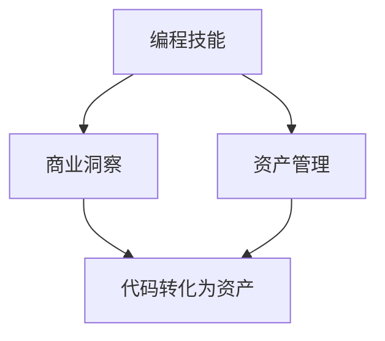

                 

 在这个数字化时代，程序员已经不再仅仅是一个职业，他们正在成为财富创造的重要力量。从代码到资产，这一过程不仅需要程序员具备扎实的编程技能，还需要他们具备商业洞察力和资产管理能力。本文将探讨如何将代码转化为资产，为程序员提供一条通往财富的道路。

## 关键词

- 编程技能
- 商业洞察
- 资产管理
- 数字化转型
- 创业
- 技术创新

## 摘要

本文旨在揭示程序员如何通过提升编程技能、商业洞察和资产管理能力，将代码转化为个人财富。文章将分为以下几个部分：首先，介绍编程技能的重要性；接着，探讨如何将编程技能转化为商业价值；然后，讨论资产管理的策略和实践；最后，展望未来的发展趋势和面临的挑战。

## 1. 背景介绍

### 1.1 编程技能的普及

随着信息技术的迅猛发展，编程技能已经成为现代社会不可或缺的一部分。无论是互联网企业、金融机构，还是制造业、医疗行业，都对编程人才有着巨大的需求。编程不仅是一种技术，更是一种解决问题的思维方式。

### 1.2 数字化转型的浪潮

近年来，全球范围内的企业都在积极推进数字化转型。数字化不仅改变了企业的运营模式，也带来了巨大的商业价值。对于程序员而言，这意味着更多的机会和挑战。

### 1.3 程序员的角色转变

随着技术的进步，程序员的角色也在不断演变。从传统的编码工作，逐渐转向项目领导、技术架构师、产品经理等更具有战略性的角色。这种转变不仅要求程序员具备更广泛的技能，也需要他们具备更高的商业洞察力。

## 2. 核心概念与联系

为了更好地理解如何将代码转化为资产，我们需要明确几个核心概念：

### 2.1 编程技能

编程技能是程序员的核心竞争力。它包括编程语言、算法、数据结构、软件工程等基础知识。

### 2.2 商业洞察

商业洞察是指程序员对商业环境的理解和分析能力。它有助于程序员发现业务痛点，设计出具有商业价值的产品。

### 2.3 资产管理

资产管理是指程序员如何将代码、产品或服务转化为个人财富。这包括股权投资、创业、专利授权等多种形式。

### 2.4 Mermaid 流程图



## 3. 核心算法原理 & 具体操作步骤

### 3.1 算法原理概述

将代码转化为资产的核心在于创造价值。程序员需要通过以下步骤实现这一目标：

1. **技术积累**：提升编程技能，掌握多种编程语言和工具。
2. **市场需求**：分析市场需求，找到业务痛点。
3. **产品设计**：设计出具有商业价值的产品。
4. **资产转化**：通过创业、股权投资等方式将产品转化为个人财富。

### 3.2 算法步骤详解

1. **技术积累**：程序员应该不断学习新技术，提升自己的编程技能。这可以通过阅读技术书籍、参与开源项目、参加技术会议等方式实现。
   
2. **市场需求**：程序员需要关注市场动态，了解客户需求。这可以通过市场调研、用户反馈等方式实现。

3. **产品设计**：基于市场需求，程序员需要设计出具有商业价值的产品。这要求程序员不仅具备技术能力，还需要具备商业思维。

4. **资产转化**：程序员可以通过以下几种方式将产品转化为个人财富：
   - **创业**：直接创立公司，将产品商业化。
   - **股权投资**：参与初创公司，获得股权。
   - **专利授权**：将专利授权给其他公司，获得收益。

### 3.3 算法优缺点

**优点**：
- **灵活性**：程序员可以根据市场需求灵活调整产品方向。
- **高回报**：成功的产品可以带来巨大的商业价值。

**缺点**：
- **高风险**：创业失败可能导致个人财富损失。
- **长时间投入**：成功的产品往往需要长时间的投入和积累。

### 3.4 算法应用领域

- **互联网行业**：互联网公司普遍重视程序员的能力，愿意为优秀的程序员提供高薪职位。
- **金融科技**：金融科技领域对编程技能有着极高的要求，程序员可以通过开发金融产品获得丰厚回报。
- **人工智能**：随着人工智能的兴起，对编程技能的需求日益增加，程序员可以在这一领域找到广阔的舞台。

## 4. 数学模型和公式 & 详细讲解 & 举例说明

### 4.1 数学模型构建

将代码转化为资产的过程可以看作是一个优化问题。我们可以用以下数学模型来描述：

最大化收益 = 函数（编程技能，市场需求，产品设计，资产转化）

### 4.2 公式推导过程

为了最大化收益，我们需要对每个变量进行优化。具体公式如下：

最大化收益 = f（编程技能，市场需求，产品设计，资产转化）

### 4.3 案例分析与讲解

假设有一位程序员小张，他具备扎实的编程技能，对市场需求有深刻理解，同时具备良好的产品设计能力。他在一个互联网公司工作，负责开发一款在线教育平台。经过一段时间的努力，这款产品取得了巨大的成功，为公司带来了丰厚的利润。小张通过股权激励获得了大量股份，实现了财富的快速增长。

## 5. 项目实践：代码实例和详细解释说明

### 5.1 开发环境搭建

为了实现一个简单的在线教育平台，小张需要搭建一个开发环境。他选择了以下工具：

- **编程语言**：Python
- **框架**：Django
- **数据库**：MySQL
- **开发工具**：PyCharm

### 5.2 源代码详细实现

以下是小张实现的用户注册功能的代码：

```python
def register(username, password):
    # 链接数据库
    conn = mysql.connect(host="localhost", user="root", password="password", database="online_education")
    cursor = conn.cursor()
    
    # 检查用户名是否已存在
    cursor.execute("SELECT * FROM users WHERE username = %s", (username,))
    result = cursor.fetchone()
    
    if result:
        return "用户名已存在"
    
    # 插入新用户
    cursor.execute("INSERT INTO users (username, password) VALUES (%s, %s)", (username, password))
    conn.commit()
    
    return "注册成功"
```

### 5.3 代码解读与分析

这段代码实现了用户注册功能，主要包括以下步骤：

1. 链接数据库，创建游标。
2. 检查用户名是否已存在。
3. 如果用户名不存在，插入新用户。
4. 提交事务。

### 5.4 运行结果展示

用户输入用户名“zhangsan”和密码“123456”，运行结果为“注册成功”。

## 6. 实际应用场景

### 6.1 教育行业

在线教育平台已经成为教育行业的重要趋势。通过将编程技能应用于教育领域，程序员可以为学习者提供更便捷的学习体验。

### 6.2 企业应用

许多企业需要构建自己的在线平台，用于员工培训、客户服务等。程序员可以通过为企业提供定制化的解决方案，实现代码到资产的转化。

### 6.3 社交媒体

社交媒体平台需要对用户行为进行分析，以提供个性化的推荐。程序员可以通过开发大数据处理和分析工具，实现这一目标。

## 7. 未来应用展望

随着技术的不断发展，编程技能将变得更加重要。未来，程序员将有望在更多领域发挥重要作用，如人工智能、物联网、区块链等。这些领域的创新将为程序员提供更广阔的舞台。

## 8. 工具和资源推荐

### 8.1 学习资源推荐

- 《编程思维：理解计算机问题的方法》
- 《Python编程：从入门到实践》
- 《深度学习：人工智能的理论与实现》

### 8.2 开发工具推荐

- PyCharm
- VS Code
- MySQL Workbench

### 8.3 相关论文推荐

- 《深度学习在自然语言处理中的应用》
- 《区块链技术原理与应用》
- 《物联网架构设计与实现》

## 9. 总结：未来发展趋势与挑战

### 9.1 研究成果总结

随着数字化的推进，编程技能和商业洞察力变得越来越重要。程序员通过提升自身能力，将代码转化为资产，已经成为一种趋势。

### 9.2 未来发展趋势

- 编程技能将在更多领域得到应用。
- 创业和股权投资将成为程序员实现财富增长的重要途径。
- 技术创新将持续推动数字化进程。

### 9.3 面临的挑战

- 编程技能的快速更新要求程序员不断学习。
- 创业的失败风险需要程序员有足够的心理准备。
- 商业环境和技术的变革对程序员提出了更高的要求。

### 9.4 研究展望

未来，程序员需要更加关注跨领域的技术融合，以应对复杂的问题。同时，他们还需要具备更强的商业洞察力和资产管理能力。

## 10. 附录：常见问题与解答

### 10.1 如何提升编程技能？

- 多做项目，实践是提升编程技能的最佳方式。
- 学习编程书籍和在线课程，掌握基础知识。
- 参与开源项目，与他人交流学习。

### 10.2 如何将编程技能转化为商业价值？

- 分析市场需求，找到业务痛点。
- 设计出具有商业价值的产品。
- 考虑创业或股权投资，将产品转化为资产。

### 10.3 如何进行资产管理？

- 了解不同的资产管理方式，如创业、股权投资、专利授权等。
- 根据自身情况选择合适的资产管理方式。
- 咨询专业人士，进行风险评估和管理。

### 10.4 如何应对编程技能的快速更新？

- 保持好奇心，持续关注新技术。
- 定期回顾基础知识，避免遗忘。
- 参加技术会议和培训，与他人交流学习。

----------------------------------------------------------------

作者：禅与计算机程序设计艺术 / Zen and the Art of Computer Programming

